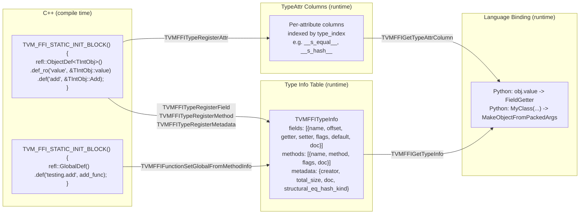
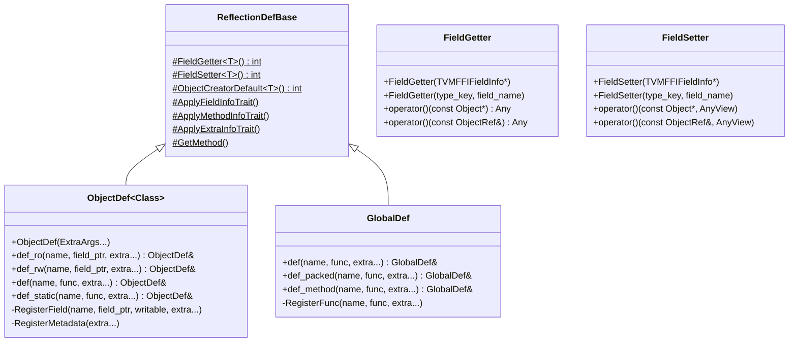

# Reflection System

**TL;DR**
- The reflection system provides runtime access to object fields and methods by name, enabling language bindings (Python, Rust) to interact with C++ objects without compile-time knowledge of class layout. It also supports reflection-based object construction and extensible per-type attributes.
- `ObjectDef<T>` is the registration builder (nanobind/pybind-style) that registers fields (`def_ro`/`def_rw`), methods (`def`/`def_static`), and type metadata (creator, size, doc) for each object type. `GlobalDef` registers global functions in the same style. `TypeAttrDef<T>` registers extensible per-type attributes (functions, constants) indexed by type.
- Runtime accessors (`FieldGetter`, `FieldSetter`, `GetFieldInfo`, `GetMethodInfo`, `GetMethod`, `ForEachFieldInfo`) are split into a separate header (`reflection/accessor.h`) from registration (`reflection/registry.h`). `TypeAttrColumn` provides runtime lookup of per-type attributes.

## Problem Statement

### Background
- Python and Rust bindings need to access C++ object fields and call methods without C++ compilation — they interact through the C ABI.
- Hardcoding field accessors for every type is fragile and high-maintenance.
- The object system needs a way to expose fields with type information, default values, and docstrings for serialization, code generation, and cross-language object construction.

### Solution
- A lightweight reflection registry attached to the type info table: each type registers fields (with names, types, offsets, getters/setters, flags, defaults, docs) and methods (with Function objects, docs, type schemas).
- Language bindings query `TVMFFIGetTypeInfo(type_index)` to discover fields and methods, then call getters/setters/methods through the C ABI.
- `MakeObjectFromPackedArgs` enables cross-language object construction by type key + field name/value pairs, traversing the ancestor chain for inherited fields.

### Goals
- **Goal**: Runtime field and method access by name for any registered object type.
- **Goal**: Type-annotated fields with flags, defaults, and docstrings for binding generation.
- **Goal**: Reflection-based object construction (create by type key, set fields by name).
- **Goal**: Clean separation of registration-time vs runtime accessor APIs.
- **Non-goal**: Not a general serialization framework; specifically for in-process FFI reflection.

## Design





### Key Classes, Fields and Interfaces

**`TVMFFIFieldInfo`** (C ABI struct, restructured):
```c
typedef struct {
  TVMFFIByteArray name;
  TVMFFIByteArray doc;              // docstring
  int64_t flags;                    // bitmask of TVMFFIFieldFlagBitMask
  int64_t offset;                   // byte offset from Object* base
  TVMFFIFieldGetter getter;         // int (*)(void* field, TVMFFIAny* result)
  TVMFFIFieldSetter setter;         // int (*)(void* field, const TVMFFIAny* value)
  TVMFFIAny default_value_or_factory;  // renamed from default_value (5e564cd):
                                       // - If kTVMFFIFieldFlagBitMaskDefaultFromFactory NOT set: direct default value
                                       // - If kTVMFFIFieldFlagBitMaskDefaultFromFactory IS set: Function () -> Any
  int32_t field_static_type_index;
  int64_t size;                     // sizeof(field_type)
  int64_t alignment;                // alignof(field_type)
  TVMFFIByteArray metadata;      // JSON type schema for codegen
} TVMFFIFieldInfo;
```

**`TVMFFIMethodInfo`** (C ABI struct):
```c
typedef struct {
  TVMFFIByteArray name;
  TVMFFIByteArray doc;              // docstring
  int64_t flags;                    // bitmask (kTVMFFIFieldFlagBitMaskIsStaticMethod)
  TVMFFIAny method;                 // holds a Function object
  TVMFFIByteArray metadata;      // JSON type schema
} TVMFFIMethodInfo;
```

**`TVMFFIFieldFlagBitMask`** enum:
```c
enum TVMFFIFieldFlagBitMask : int32_t {
  kTVMFFIFieldFlagBitMaskWritable             = 1 << 0,
  kTVMFFIFieldFlagBitMaskHasDefault           = 1 << 1,
  kTVMFFIFieldFlagBitMaskIsStaticMethod       = 1 << 2,
  kTVMFFIFieldFlagBitMaskSEqHashIgnore        = 1 << 3,  // skip field during structural eq/hash
  kTVMFFIFieldFlagBitMaskSEqHashDef           = 1 << 4,  // field enters "def region" for free-var mapping
  kTVMFFIFieldFlagBitMaskDefaultFromFactory   = 1 << 5,  // default_value_or_factory is a callable factory (5e564cd)
  kTVMFFIFieldFlagBitMaskReprOff              = 1 << 6,  // exclude field from reflection-based repr (b648c5d)
  kTVMFFIFieldFlagBitMaskCompareOff           = 1 << 7,  // exclude from recursive comparison (6b39efb)
  kTVMFFIFieldFlagBitMaskHashOff              = 1 << 8,  // exclude from recursive hashing (6b39efb)
  kTVMFFIFieldFlagBitMaskInitOff              = 1 << 9,  // exclude from auto-generated init (6b39efb)
  kTVMFFIFieldFlagBitMaskKwOnly               = 1 << 10, // keyword-only in auto-generated init (6b39efb)
  kTVMFFIFieldFlagBitSetterIsFunctionObj      = 1 << 11, // setter is FunctionObj*, not raw fn ptr (10dc59d)
};
```

**`TVMFFITypeMetadata`** (C ABI struct, renamed from `TVMFFITypeMetadata`):
```c
typedef struct {
  TVMFFIByteArray doc;
  TVMFFIObjectCreator creator;      // int (*)(TVMFFIObjectHandle* result)
  int32_t total_size;               // sizeof(ObjectType), for fixed-size types
  TVMFFISEqHashKind structural_eq_hash_kind;  // structural equality dispatch kind
} TVMFFITypeMetadata;
```

**`TVMFFITypeAttrColumn`** (C ABI struct, updated in c85fd42):
```c
typedef struct {
  const TVMFFIAny* data;    // indexed by (type_index - begin_index)
  int32_t size;             // was size_t; covers [begin_index, begin_index + size)
  int32_t begin_index;      // starting type index of column data (0 for now)
} TVMFFITypeAttrColumn;
```
Lookup pattern: `offset = type_index - col->begin_index; if (offset >= 0 && offset < col->size) use col->data[offset]`.

**`TypeAttrDef<Class>`** -- registration builder for per-type attributes (`reflection/registry.h`):
```cpp
template <typename Class, typename = std::enable_if_t<std::is_base_of_v<Object, Class>>>
class TypeAttrDef : public ReflectionDefBase {
public:
  template <typename... ExtraArgs>
  explicit TypeAttrDef(ExtraArgs&&... extra_args);
  template <typename Func>
  TypeAttrDef& def(const char* name, Func&& func);  // register function-valued attr
  template <typename T>
  TypeAttrDef& attr(const char* name, T value);       // register constant-valued attr
};
```

**`TypeAttrColumn`** -- runtime accessor for per-type attributes (`reflection/accessor.h`):
```cpp
class TypeAttrColumn {
public:
  explicit TypeAttrColumn(std::string_view attr_name);  // throws if column not found
  AnyView operator[](int32_t type_index) const;         // returns null AnyView if out of range
};
```

**`EnsureTypeAttrColumn`** -- pre-create a column without registering values:
```cpp
void EnsureTypeAttrColumn(std::string_view name);
```

**`OverloadObjectDef<Class>`** -- overload-aware registration builder (`reflection/overload.h`, 84c5bdb):
```cpp
template <typename Class>
class OverloadObjectDef : private ObjectDef<Class> {
  OverloadObjectDef& def_ro(const char* name, field_ptr, extra...);
  OverloadObjectDef& def_rw(const char* name, field_ptr, extra...);
  OverloadObjectDef& def(const char* name, func, extra...);        // overloadable method
  OverloadObjectDef& def_static(const char* name, func, extra...); // overloadable static method
  OverloadObjectDef& def(init<Args...>, extra...);                 // overloadable constructor
  // Internally tracks registered_fields_ map: name -> OverloadBase*
  // First def() for a name creates OverloadedFunction via FromPackedInplace
  // Subsequent def() calls Register() on the existing OverloadBase
};
```
Private-inherits `ObjectDef<Class>`. The first `def()` call for a given name creates an `OverloadedFunction` (embedded inside a `Function` via `FromPackedInplace`); subsequent calls to `def()` with the same name register additional overloads. Field registration (`def_ro`/`def_rw`) delegates directly to `ObjectDef`.

**`details::OverloadBase`** -- base class for overload dispatch entries (`reflection/overload.h`, 84c5bdb):
```cpp
struct OverloadBase {
  using FnPtr = bool (*)(OverloadBase*, const AnyView*, int32_t, Any*);
  explicit OverloadBase(int32_t num_args, std::optional<std::string> name);
  virtual void Register(std::unique_ptr<OverloadBase> overload) = 0;
  virtual FnPtr GetTryCallPtr() = 0;
  virtual void GetMismatchMessage(std::ostringstream& os, const AnyView* args, int32_t num_args) = 0;
  int32_t last_mismatch_index_;   // fast cache for error reporting
  const int32_t num_args_;
  const std::string name_;
};
```

**`details::TypedOverload<Callable>`** -- concrete overload with try-cast per argument (`reflection/overload.h`, 84c5bdb):
```cpp
template <typename Callable>
struct TypedOverload : OverloadBase {
  bool TryCall(const AnyView* args, int32_t num_args, Any* rv);
  // Uses try_cast per argument; returns false on type mismatch
  FnPtr GetTryCallPtr() final;  // returns captureless lambda convertible to FnPtr
};
```

**`details::OverloadedFunction<Callable>`** -- runtime overload dispatch callable (`reflection/overload.h`, 84c5bdb):
```cpp
template <typename Callable>
struct OverloadedFunction : TypedOverload<Callable> {
  void Register(std::unique_ptr<OverloadBase> overload) final;
  void operator()(const AnyView* args, int32_t num_args, Any* rv);
  // Fast path: no overloads -> direct unpack_call (zero extra overhead)
  // Slow path: try self first, then iterate overloads sorted by num_args then try_call
  // Failure: throws TypeError with all overload mismatch messages
};
```

**`ReflectionDefBase::WrapFunction`** -- factored-out member-pointer-to-lambda conversion (84c5bdb):
```cpp
template <typename Func> static Func&& WrapFunction(Func&& func);        // passthrough
template <typename Class, typename R, typename... Args>
static auto WrapFunction(R (Class::*func)(Args...));       // -> lambda
static auto WrapFunction(R (Class::*func)(Args...) const); // -> lambda
```

**Python type attribute accessor** (`_lookup_type_attr`, 4edf4f3):
```python
def _lookup_type_attr(type_index: int, attr_key: str) -> Any:
    """Query the C type attribute table for a given type index and attribute key.
    Returns None if not found."""
```
Binds `TVMFFIGetTypeAttrColumn` C API to Python, enabling Python-side access to per-type attributes registered via `TypeAttrDef<T>`.

**Type key enumeration** (`get_registered_type_keys`, 8fcd924):
```python
# C++: Array<String> TypeTable::GetRegisteredTypeKeys() const
# FFI: ffi.GetRegisteredTypeKeys() -> Array[String]
# Python: tvm_ffi.registry.get_registered_type_keys() -> Sequence[str]
```
Returns all registered type keys from the type table. Enables tools like stubgen to discover all C++-registered types without parsing C++ source.

**`ReflectionDefBase`** — base class with shared helpers:
```cpp
class ReflectionDefBase {
protected:
  template<typename T> static int FieldGetter(void* field, TVMFFIAny* result);
  template<typename T> static int FieldSetter(void* field, const TVMFFIAny* value);
  template<typename T> static int ObjectCreatorDefault(TVMFFIObjectHandle* result);
  // Uses make_object<T>() for default-constructible types

  template<typename R, typename Class, typename... Args>
  static Function GetMethod(std::string name, R (Class::*func)(Args...));
  // Class is deduced from the member function pointer (no explicit template parameter needed)
  // If Class derives from ObjectRef: wraps as lambda taking Class by value
  // If Class derives from Object: wraps as lambda taking const Class* pointer
};
```

**`ObjectDef<Class>`** — registration builder for object types:
```cpp
template<typename Class>
class ObjectDef : public ReflectionDefBase {
public:
  template<typename... ExtraArgs>
  explicit ObjectDef(ExtraArgs&&... extra_args);
  // Registers TVMFFITypeMetadata (total_size, creator, doc)

  template<typename T, typename BaseClass, typename... Extra>
  ObjectDef& def_ro(const char* name, T BaseClass::*field_ptr, Extra&&... extra);
  // static_assert(std::is_base_of_v<BaseClass, Class>)

  template<typename T, typename BaseClass, typename... Extra>
  ObjectDef& def_rw(const char* name, T BaseClass::*field_ptr, Extra&&... extra);
  // static_assert(Class::_type_mutable) — only mutable types may have writable fields

  template<typename Func, typename... Extra>
  ObjectDef& def(const char* name, Func&& func, Extra&&... extra);

  template<typename Func, typename... Extra>
  ObjectDef& def_static(const char* name, Func&& func, Extra&&... extra);
};
// Extra... accepts: string literals (docstrings), DefaultValue(value)
```

**`GlobalDef`** — registration builder for global functions:
```cpp
class GlobalDef : public ReflectionDefBase {
public:
  template<typename Func, typename... Extra>
  GlobalDef& def(const char* name, Func&& func, Extra&&... extra);

  template<typename Func, typename... Extra>
  GlobalDef& def_packed(const char* name, Func func, Extra&&... extra);

  template<typename Func, typename... Extra>
  GlobalDef& def_method(const char* name, Func&& func, Extra&&... extra);
};
```

**`reflection::init<Args...>`** — constructor registration struct (replaces old `init<T, Args...>` free function, fc2630f):
```cpp
namespace tvm::ffi::reflection {
template <typename... Args>
struct init {
  init();  // default constructor
private:
  template <typename Class>
  static inline ObjectRef execute(Args&&... args);
  // Calls make_object<Class>(forward<Args>(args)...) where Class is deduced
  // from the ObjectDef<Class> context via friend relationship
};
}
```
Used with `ObjectDef<T>::def(refl::init<Args...>())` which registers `__ffi_init__` automatically. The object type `T` is deduced from the `ObjectDef<Class>` context, eliminating the redundant type parameter.

**`ObjectDef<Class>::def(init<Args...>, Extra...)`** — dedicated constructor registration method:
```cpp
template <typename... Args, typename... Extra>
ObjectDef& def(init<Args...> init_func, Extra&&... extra);
// Registers __ffi_init__ as a static method via RegisterMethod(INIT_METHOD_NAME, true, ...)
```

**`ObjectDef::INIT_METHOD_NAME`** — constant: `"__ffi_init__"`, centralizes the init method name string.

**`InfoTrait`** — base class for field and method info traits (renamed from `FieldInfoTrait` in 28fe3cc):
```cpp
struct InfoTrait {};  // Base class for both field and method info traits
```

**`Metadata`** — attach key-value metadata to fields, methods, and global functions (added in 28fe3cc):
```cpp
class Metadata : public InfoTrait {
public:
  explicit Metadata(std::initializer_list<std::pair<String, Any>> dict);
  void Apply(FieldInfoBuilder* info) const;
  void Apply(MethodInfoBuilder* info) const;
private:
  static std::string ToJSON(const _MetadataType& metadata);
  // _MetadataType = std::vector<std::pair<String, Any>>
};
```
When applied, metadata key-value pairs are serialized to JSON and stored in `TVMFFIFieldInfo.metadata` / `TVMFFIMethodInfo.metadata`. All registered fields, methods, and global functions automatically get a `type_schema` key injected via `TypeTraits<T>::TypeSchema()`.

**`FieldInfoBuilder`** / **`MethodInfoBuilder`** — extended info structs carrying builder-time metadata (added in 28fe3cc):
```cpp
struct FieldInfoBuilder : public TVMFFIFieldInfo { _MetadataType metadata_; };
struct MethodInfoBuilder : public TVMFFIMethodInfo { _MetadataType metadata_; };
```

**`repr`** — field trait for controlling repr visibility (`reflection/registry.h`, b648c5d, renamed from `Repr` to lowercase in 6b39efb):
```cpp
class repr : public InfoTrait {
public:
  explicit repr(bool show);
  void Apply(TVMFFIFieldInfo* info) const;
  // When show==false, sets kTVMFFIFieldFlagBitMaskReprOff on info->flags
};
```
Used with `ObjectDef::def_ro`/`def_rw` to exclude internal fields from the unified `ffi.ReprPrint` output (e.g., `def_ro("cache", &MyObj::cache, refl::repr(false))`).

**`compare`** — field trait for recursive comparison opt-out (`reflection/registry.h`, 6b39efb):
```cpp
class compare : public InfoTrait {
public:
  explicit compare(bool include);
  void Apply(TVMFFIFieldInfo* info) const;
  // When include==false, sets kTVMFFIFieldFlagBitMaskCompareOff on info->flags
};
```

**`hash`** — field trait for recursive hashing opt-out (`reflection/registry.h`, 6b39efb):
```cpp
class hash : public InfoTrait {
public:
  explicit hash(bool include);
  void Apply(TVMFFIFieldInfo* info) const;
  // When include==false, sets kTVMFFIFieldFlagBitMaskHashOff on info->flags
};
```

**`kw_only`** — field trait for keyword-only init parameter (`reflection/registry.h`, 6b39efb):
```cpp
class kw_only : public InfoTrait {
public:
  explicit kw_only(bool is_kw_only);
  void Apply(TVMFFIFieldInfo* info) const;
  // When is_kw_only==true, sets kTVMFFIFieldFlagBitMaskKwOnly on info->flags
};
```

**`kTVMFFIFieldFlagBitSetterIsFunctionObj`** — field setter dispatch via FunctionObj (`c_api.h`, 10dc59d):
When bit 11 is set on `TVMFFIFieldInfo.flags`, the `setter` member holds a `TVMFFIObjectHandle` pointing to a `FunctionObj` rather than a raw `TVMFFIFieldSetter` function pointer. `FieldAccessor::SetField` checks this bit: if set, it reinterprets `setter` as `FunctionObj*` and invokes it with `(field_addr_as_OpaquePtr, value_as_AnyView)`. This enables runtime-defined setter logic (e.g., Python-side `__ffi_convert__` wrapped in a FunctionObj).

**`CreateEmptyObject(const TVMFFITypeInfo*) -> ObjectPtr<Object>`** (`reflection/creator.h`, e268eb1d):
```cpp
inline ObjectPtr<Object> CreateEmptyObject(const TVMFFITypeInfo* type_info);
// Fast path: metadata->creator (native C++ creator)
// Fallback: __ffi_new__ type attribute (Python-defined types)
// Throws RuntimeError if neither is available
```
Centralizes the two-step "check creator, call creator" pattern used by `ObjectCreator`, `MakeInit`, `reflection_extra.cc`, and `serialization.cc` (e268eb1d).

**`HasCreator(const TVMFFITypeInfo*) -> bool`** (`reflection/creator.h`, e268eb1d):
```cpp
inline bool HasCreator(const TVMFFITypeInfo* type_info);
// Returns true if native creator or __ffi_new__ type attr exists
```

**`type_attr::kRepr`** — constant string `"__ffi_repr__"` (`reflection/registry.h`, b648c5d):
```cpp
namespace type_attr {
inline constexpr const char* kRepr = "__ffi_repr__";
}
```
Types that register a function under this attribute key get custom repr formatting. The function signature is `(const Object* self, const Function& fn_repr) -> String`, where `fn_repr` is a callback for recursively formatting child values.

**`ffi.ReprPrint`** — global function for unified object representation (`extra/repr_print.cc`, b648c5d):
```cpp
// Registered as "ffi.ReprPrint"
// Signature: (Any value) -> String
// Algorithm: DFS with 3-state cycle detection (NotVisited, InProgress, Done).
//   - DAG nodes: on second visit after completion, returns cached repr string.
//   - Cycles: on revisit while in-progress, returns "..." marker.
//   - Custom __ffi_repr__: if the type has a type_attr::kRepr attribute, calls it.
//   - Generic fallback: "TypeKey(field1=val1, field2=val2)" using ForEachFieldInfo,
//     skipping fields with kTVMFFIFieldFlagBitMaskReprOff.
// Environment variable: TVM_FFI_REPR_WITH_ADDR=1 shows object addresses.
```

Repr format for built-in types:
| Type | Format |
|------|--------|
| int | `42` |
| String | `"hello"` |
| Array | `(1, 2, 3)` |
| List | `[1, 2, 3]` |
| Map | `{"key": "value"}` |
| Object | `TypeKey(field1=val1, field2=val2)` |
| Cycle | `...` |
| Tensor | `float32[3, 4]@cpu:0` |
| Shape | `Shape(3, 4)` |

Built-in `__ffi_repr__` handlers are registered at static init for `String`, `Bytes`, `Tensor`, `Shape`, `Array`, `List`, and `Map`. All Python `__repr__` methods on `Object` now delegate to `ffi.ReprPrint` (with silent fallback if unavailable).

**`DefaultValue`** — field trait for direct default values:
```cpp
class DefaultValue : public InfoTrait {
public:
  explicit DefaultValue(Any value);
  void Apply(TVMFFIFieldInfo* info) const;
  // Sets kTVMFFIFieldFlagBitMaskHasDefault flag and stores value in default_value_or_factory
};
```

**`DefaultFactory`** — field trait for factory-based default values (5e564cd):
```cpp
class DefaultFactory : public InfoTrait {
public:
  explicit DefaultFactory(Function factory);
  void Apply(TVMFFIFieldInfo* info) const;
  // Sets kTVMFFIFieldFlagBitMaskHasDefault | kTVMFFIFieldFlagBitMaskDefaultFromFactory
  // Stores factory Function in default_value_or_factory
  // Factory is called with no arguments to produce a fresh default per instance
};
```
`DefaultFactory` prevents mutable default aliasing: when multiple instances of a type share a field with a mutable default (e.g., `Array<int>{}`), each instance gets its own fresh copy from the factory call. Without `DefaultFactory`, all instances would share the same `Array` object, and mutating one would affect all others.

**`SetFieldToDefault`** — centralized default resolution helper (5e564cd):
```cpp
// reflection/accessor.h
inline void SetFieldToDefault(const TVMFFIFieldInfo* field_info, void* field_addr);
// When kTVMFFIFieldFlagBitMaskDefaultFromFactory is set: extracts Function from
// default_value_or_factory, calls it with no arguments, passes result to setter.
// Otherwise: passes default_value_or_factory directly to setter.
// Used by ObjectCreator, MakeObjectFromPackedArgs, and JSON deserialization.
```

**`type_attr` namespace** — well-known attribute name constants (c73d61a):
```cpp
namespace tvm::ffi::reflection::type_attr {
  inline constexpr const char* kInit = "__ffi_init__";
  inline constexpr const char* kShallowCopy = "__ffi_shallow_copy__";
}
```

**Deep copy protocol** — auto-registered shallow copy + global deep copy (c73d61a):
```cpp
// ObjectDef constructor now calls AutoRegisterCopy():
// For std::is_copy_constructible_v<Class> types:
//   1. Registers __ffi_shallow_copy__ as an instance method
//   2. Registers __ffi_shallow_copy__ as a type attribute (via TVMFFITypeRegisterAttr)
// Non-copyable types get neither; Python __copy__ raises TypeError.

// extra/deep_copy.h
TVM_FFI_EXTRA_CXX_API Any DeepCopy(const Any& value);
// Recursively copies the entire object graph with memoization:
// - Primitives, strings, bytes: returned as-is (immutable)
// - Copy-constructible objects: shallow copied via __ffi_shallow_copy__
// - Arrays, Lists, Maps: recursively deep copied element-by-element
// - Shared references preserved: if two fields point to same object, deep copy preserves sharing
// - Cycle-safe: memoization map prevents infinite recursion
```

Python side (installed by `registry.py` on registered object types):
- `__copy__(self)` -- calls `__ffi_shallow_copy__` type attribute
- `__deepcopy__(self, memo)` -- calls `ffi.DeepCopy` global function
- `__replace__(self, **kwargs)` -- shallow copy + field overrides (dataclass-style replace)

**`dataclass.h` unified API** -- consolidated header for all reflection-based dataclass operations (6b39efb, replaces separate `extra/deep_copy.h` and `extra/repr_print.cc`):
```cpp
// include/tvm/ffi/extra/dataclass.h
TVM_FFI_EXTRA_CXX_API Any DeepCopy(const Any& value);
TVM_FFI_EXTRA_CXX_API String ReprPrint(const Any& value);
TVM_FFI_EXTRA_CXX_API int64_t RecursiveHash(const Any& value);
TVM_FFI_EXTRA_CXX_API bool RecursiveEq(const Any& lhs, const Any& rhs);
TVM_FFI_EXTRA_CXX_API bool RecursiveLt(const Any& lhs, const Any& rhs);
TVM_FFI_EXTRA_CXX_API bool RecursiveLe(const Any& lhs, const Any& rhs);
TVM_FFI_EXTRA_CXX_API bool RecursiveGt(const Any& lhs, const Any& rhs);
TVM_FFI_EXTRA_CXX_API bool RecursiveGe(const Any& lhs, const Any& rhs);
```
Internally implemented via a shared `ObjectGraphDFS` CRTP engine for iterative graph walking with cycle/DAG handling.

**Auto-init from reflection** (`reflection/init.h`, 6b39efb):
```cpp
// reflection/init.h
inline Function MakeInit(int32_t type_index);
// Creates a packed __ffi_init__ from reflection metadata:
// 1. Pre-computes field analysis (init/kw_only/has_default flags)
// 2. Returns a Function that:
//    a. Creates object via creator
//    b. Detects KWARGS sentinel for mixed positional+keyword calling
//    c. Binds positional args to pos_indices (sorted: required before optional)
//    d. Binds keyword args by name lookup
//    e. Fills defaults for unbound fields via SetFieldToDefault
//    f. Throws TypeError for missing required fields

inline void RegisterAutoInit(int32_t type_index);
// Calls MakeInit() and registers the result as __ffi_init__ static method
// with metadata {"auto_init": true}
```
`RegisterAutoInit` is called automatically from the `ObjectDef` destructor when no explicit `refl::init<Args...>` was registered. This eliminates the need for Python-side `__init__` code generation.

**`GetFieldByteOffsetToObject`** — computes byte offset from Object header to field:
```cpp
template<typename Class, typename T>
int64_t GetFieldByteOffsetToObject(T Class::*field_ptr) {
  int64_t field_offset_to_class =
      reinterpret_cast<int64_t>(&(static_cast<Class*>(nullptr)->*field_ptr));
  return field_offset_to_class - ObjectUnsafe::GetObjectOffsetToSubclass<Class>();
}
```

**Runtime accessors** (in `reflection/accessor.h`):

**`FieldGetter`** — callable field read wrapper:
```cpp
class FieldGetter {
public:
  explicit FieldGetter(const TVMFFIFieldInfo* field_info);
  explicit FieldGetter(std::string_view type_key, const char* field_name);
  Any operator()(const Object* obj_ptr) const;
  Any operator()(const ObjectRef& obj) const;
};
```

**`FieldSetter`** — callable field write wrapper:
```cpp
class FieldSetter {
public:
  explicit FieldSetter(const TVMFFIFieldInfo* field_info);
  explicit FieldSetter(std::string_view type_key, const char* field_name);
  void operator()(const Object* obj_ptr, AnyView value) const;
  void operator()(const ObjectRef& obj, AnyView value) const;
};
```

**Lookup functions**:
```cpp
const TVMFFIFieldInfo* GetFieldInfo(std::string_view type_key, const char* field_name);
const TVMFFIMethodInfo* GetMethodInfo(std::string_view type_key, const char* method_name);
Function GetMethod(std::string_view type_key, const char* method_name);
```

**Field traversal utilities**:
```cpp
template <typename Callback>
void ForEachFieldInfo(const TypeInfo* type_info, Callback callback);
// callback: (const TVMFFIFieldInfo*) -> void
// Iterates ancestors[1..depth-1] fields, then own fields (parent-to-child order)
// static_assert enforces callback returns void

template <typename Callback>
bool ForEachFieldInfoWithEarlyStop(const TypeInfo* type_info, Callback callback);
// callback: (const TVMFFIFieldInfo*) -> bool
// Returns true if any callback returned true (early stop triggered)
```

**`MakeObjectFromPackedArgs`** — global packed function for cross-language object construction:
```cpp
// Registered as "ffi.MakeObjectFromPackedArgs"
// args[0]: String type_key OR int32_t type_index
// args[1..]: alternating field_name, field_value pairs
// Returns: ObjectRef with all fields set (defaults applied for missing fields)
// Traverses ancestor chain to set inherited fields
// NOTE: Relocated from src/ffi/object.cc to src/ffi/extra/reflection_extra.cc (commit f4ede98)
```

**`reflection::ObjectCreator`** — reusable helper for reflection-based object construction from field maps (`reflection/creator.h`):
```cpp
namespace tvm::ffi::reflection {
class ObjectCreator {
public:
  explicit ObjectCreator(std::string_view type_key);
  explicit ObjectCreator(const TVMFFITypeInfo* type_info);
  // Validates type has reflection metadata and creator function; throws RuntimeError otherwise.

  Any operator()(const Map<String, Any>& fields) const;
  // Iterates ForEachFieldInfo, sets each field from the map using field_info->setter.
  // Applies defaults for missing fields with kTVMFFIFieldFlagBitMaskHasDefault.
  // Throws TypeError for missing required fields or unknown extra fields.
private:
  const TVMFFITypeInfo* type_info_;
};
}
```
This is used by the JSON graph deserializer for reflection-based object reconstruction, and serves as a building block for any code needing to create objects from string-keyed field maps.

### Contracts, Assumptions and Invariants
- **Offset is relative to Object***: The offset stored in `TVMFFIFieldInfo.offset` is computed from the `Object*` base, not the subclass pointer. Language bindings with `TVMFFIObjectHandle` can compute correct field addresses.
- **Getter/Setter are exception-safe**: Both use `TVM_FFI_SAFE_CALL_BEGIN/END`, so type conversion errors propagate as error codes.
- **Flag semantics**: `kTVMFFIFieldFlagBitMaskWritable` indicates the field is writable; its absence means read-only. This is the inverse of the legacy `readonly` boolean.
- **_type_mutable enforcement**: `def_rw` enforces `static_assert(Class::_type_mutable)` at compile time. Only mutable types can register writable fields.
- **Base-class field registration**: `RegisterField` accepts `T BaseClass::*field_ptr` with `static_assert(std::is_base_of_v<BaseClass, Class>)`, allowing inherited fields to be registered on derived types.
- **Duplicate metadata guard**: `RegisterTypeMetadata` is once-only per type_index; a second registration throws a descriptive `RuntimeError`.
- **Registration is at static init time**: `TVM_FFI_STATIC_INIT_BLOCK() { ... }` runs the registration body once during static initialization. On GCC/Clang, it uses `__attribute__((constructor))`; on MSVC, it falls back to a static-variable-driven function call pattern.
- **TypeAttr column growth**: `TVMFFITypeAttrColumn` data arrays grow dynamically as new types register attributes. Column lookup by `type_index` is O(1). Out-of-range indices return null `AnyView`.
- **TypeAttr duplicate column fix**: `TypeTable::RegisterTypeAttr` reuses existing columns when a column name already exists, rather than creating a duplicate.
- **`field_static_type_index` is a compile-time hint only** (3b26a09): The `TVMFFIFieldInfo.field_static_type_index` reflects the C++ declared type, not the runtime value. `Any` fields report `kTVMFFIAny` regardless of actual content; `Array<Any>` reports `kTVMFFIArray` without element type information. The serializer uses this to inline POD values (None, Bool, Int, Float, DataType) directly rather than routing through the node graph. Never use `field_static_type_index` to determine actual runtime types.

### Extension Points
- **Custom field traits**: Implement `InfoTrait` and pass as extra args to `def_ro`/`def_rw` (e.g., `DefaultValue`, `DefaultFactory`, `AttachFieldFlag`, `Metadata`, custom validators).
- **Factory-based defaults** (5e564cd): `DefaultFactory(fn)` produces fresh values per instance, critical for mutable types like `Array`/`List`/`Map` where sharing a default would cause aliasing bugs.
- **Custom type schemas**: The `metadata` JSON field on `TVMFFIFieldInfo`/`TVMFFIMethodInfo` enables future schema-aware code generation.
- **Custom object creators**: Provide a non-default creator via `TVMFFITypeMetadata.creator` for types requiring special construction logic.
- **Type attributes via `TypeAttrDef<T>`**: Register arbitrary named attributes (functions, constants) indexed by type. Used by structural equal/hash for custom `__s_equal__`/`__s_hash__` dispatch, and by the copy protocol for `__ffi_shallow_copy__`. Extensible to any per-type extensibility need.
- **Deep copy customization**: Types registered via `ObjectDef` with `std::is_copy_constructible_v` automatically get `__ffi_shallow_copy__`. `DeepCopy` uses this for graph-preserving copy. Types can customize behavior by registering their own `__ffi_shallow_copy__` type attribute.

### Evolution Timeline

| Commit | Change |
|--------|--------|
| `7d34eb8` | Initial reflection: `ReflectionDef` with `def_readonly`/`def_readwrite`, `TVMFFIFieldInfo` with `readonly`, `TVM_FFI_REFLECTION_DEF` macro |
| `1a85688` | Nanobind-style API: `def_ro`/`def_rw`/`def`/`def_static`, flags bitmask, docstrings, defaults, namespace move to `reflection::`, `FieldSetter`, `_type_mutable` |
| `a419ed1` | `ReflectionDef` -> `ObjectDef<Class>`, `TVM_FFI_REFLECTION_DEF` -> `TVM_FFI_STATIC_INIT_BLOCK`, `TVMFFITypeMetadata`, rich field metadata (size, alignment, metadata) |
| `e909486` | `ReflectionDefBase` base class, `MakeObjectFromPackedArgs`, `ObjectCreatorDefault<T>`, `_type_mutable` enforcement on `def_rw` |
| `837800e` | `type_ancestors` pointer-based, `ForEachFieldInfo` traversal utility, `String(TVMFFIByteArray)` constructor |
| `69f2484` | `ForEachFieldInfoWithEarlyStop`, `static_assert` on `ForEachFieldInfo` callback return type |
| `f7311e4` | Base-class member pointer generalization for `def_ro`/`def_rw` |
| `b333288` | `GlobalDef` builder for global function registration |
| `e95b43b` | Header split: `reflection/reflection.h` -> `reflection/registry.h` + `reflection/accessor.h` |
| `26b68b0` | `Function::Registry` and `TVM_FFI_REGISTER_GLOBAL` removed; `GlobalDef` is the sole registration path |
| `9445fe7` | `AttachFieldFlag` trait (SEqHashIgnore/SEqHashDef), `TVMFFIFieldFlagBitMask` bits 3-4, `TVMFFITypeMetadata` (was ExtraInfo) gains `structural_eq_hash_kind` |
| `162d600` | `TVMFFITypeExtraInfo` renamed to `TVMFFITypeMetadata`; `TypeAttrDef<T>`, `TypeAttrColumn`, `TVMFFITypeAttrColumn`, `TVMFFITypeRegisterAttr`, `TVMFFIGetTypeAttrColumn` introduced |
| `7cb9273` | `reflection::ObjectCreator` helper for reflection-based object construction from `Map<String, Any>` |
| `f4ede98` | `MakeObjectFromPackedArgs` relocated from `object.cc` to `extra/reflection_extra.cc`; `ReflectionDefBase::GetMethod` template parameter `Class` removed (deduced from member pointer) |
| `c01dadf` | `reflection::init<T, Args...>` free function; `__ffi_init__` replaces `__create__` as standard constructor method name |
| `fc2630f` | Replace `init<T, Args...>` free function with `init<Args...>` struct; add `ObjectDef::def(init<...>)` method; type deduced from context |
| `7b57a46` | Add SFINAE-based `FunctionInfo` specializations for `ObjectRef` member functions (non-const/const) |
| `28fe3cc` | `Metadata` class, `FieldInfoBuilder`/`MethodInfoBuilder`, `FieldInfoTrait` -> `InfoTrait` rename, `TypeSchema()` on all TypeTraits, `FunctionInfo` for member pointers, `EscapeString`, `ffi.GetGlobalFuncMetadata`, Python `TypeSchema` class |
| `cdc1ccc` | Fix member function schema to include `self` (Class*) as first argument in `FunctionInfo<R (Class::*)>` |
| `dd4fb0a` | `TypeSchema.repr(ty_map)` for customizable type name rendering; bare container normalization |
| `0d8fec8` | Fix `DataType` -> `dtype` mapping in `_TYPE_SCHEMA_ORIGIN_CONVERTER` |
| `84c5bdb` | `OverloadObjectDef<Class>`, `OverloadedFunction<Callable>`, `OverloadBase`/`TypedOverload<Callable>`, `Function::FromPackedInplace`, `ReflectionDefBase::WrapFunction`; `FunctionObjImpl` constructor changed to variadic forwarding |
| `c73d61a` | Deep copy protocol: `ffi.DeepCopy`, `__ffi_shallow_copy__` auto-registration, `type_attr::kInit`/`kShallowCopy` constants. Python `__copy__`/`__deepcopy__`/`__replace__` |
| `5e564cd` | `DefaultFactory` trait, `default_value` -> `default_value_or_factory` rename, `SetFieldToDefault` helper, `kTVMFFIFieldFlagBitMaskDefaultFromFactory = 1 << 5` |
| `6b39efb` | Consolidate `deep_copy.cc`+`repr_print.cc` into `dataclass.cc` via `ObjectGraphDFS` CRTP; add `dataclass.h` unified API with `RecursiveHash/Eq/Lt/Le/Gt/Ge`; auto-init from reflection (`init.h` `MakeInit`/`RegisterAutoInit`); 4 new field flag bits (CompareOff, HashOff, InitOff, KwOnly); lowercase trait helpers (`repr`, `compare`, `hash`, `kw_only`); `Repr` -> `repr` rename |
| `10dc59d` | `kTVMFFIFieldFlagBitSetterIsFunctionObj` (bit 11): when set, `FieldAccessor::SetField` interprets `setter` as `FunctionObj*` and invokes via packed call, enabling runtime-defined setter logic (e.g., Python-side `__ffi_convert__`) |
| `e268eb1d` | `CreateEmptyObject`/`HasCreator` inline helpers in `creator.h`: unify "try native creator, fall back to `__ffi_new__`" pattern; deduplicate 4 call sites; qualify `details::` to `::tvm::ffi::details::` |

### Usage Examples

#### Registering fields and methods with ObjectDef
**Context**: Defining a reflectable type with fields, methods, defaults, and docstrings.
```cpp
#include <tvm/ffi/reflection/registry.h>
namespace refl = tvm::ffi::reflection;

class TFloatObj : public TNumberObj {
 public:
  double value;
  static constexpr bool _type_mutable = true;  // required for def_rw
  TFloatObj(double value) : value(value) {}
  double Add(double other) const { return value + other; }
  static constexpr const char* _type_key = "test.Float";
  TVM_FFI_DECLARE_OBJECT_INFO_FINAL("test.Float", TFloatObj, TNumberObj);
};

TVM_FFI_STATIC_INIT_BLOCK() {
  refl::ObjectDef<TFloatObj>()
      .def_rw("value", &TFloatObj::value, "float value field", refl::DefaultValue(10.0))
      .def("sub", [](const TFloatObj* self, double other) { return self->value - other; })
      .def("add", &TFloatObj::Add, "add method");
}
```

#### DefaultFactory for mutable defaults
**Context**: Using `DefaultFactory` to avoid aliasing of mutable default values across instances.
```cpp
ObjectDef<MyObj>("test.MyObj")
    .def_rw("items", &MyObj::items,
            DefaultFactory(Function::from_typed([]() -> Array<int> {
                return Array<int>{};
            })));
// Each MyObj instance gets a fresh empty Array, not a shared reference
// Without DefaultFactory, all instances would share the same Array object
```

#### Deep copy (cross-language)
**Context**: Using `copy.copy` and `copy.deepcopy` on FFI objects in Python.
```python
import copy
from tvm_ffi import dataclasses

@dataclasses.c_class("test.Point")
class Point:
    x: int
    y: int

p = Point(x=1, y=2)
p_shallow = copy.copy(p)        # shallow copy via __ffi_shallow_copy__ type attr
p_deep = copy.deepcopy(p)       # graph-preserving deep copy via ffi.DeepCopy
p_replaced = p.__replace__(x=3) # returns Point(x=3, y=2)
```
`__ffi_shallow_copy__` is auto-registered by `ObjectDef` for all `std::is_copy_constructible_v<Class>` types. Non-copyable types raise `TypeError` on `copy.copy()`.

#### Registering global functions with GlobalDef
**Context**: The replacement for `TVM_FFI_REGISTER_GLOBAL`.
```cpp
TVM_FFI_STATIC_INIT_BLOCK() {
  refl::GlobalDef()
      .def("testing.add", [](int a, int b) -> int { return a + b; })
      .def_packed("ffi.Array",
                  [](ffi::PackedArgs args, Any* ret) {
                    *ret = Array<Any>(args.data(), args.data() + args.size());
                  })
      .def_method("testing.Int_GetValue", &TIntObj::GetValue);
}
```

#### Runtime field access and object construction (cross-language)
**Context**: Using reflection accessors and MakeObjectFromPackedArgs.
```cpp
#include <tvm/ffi/reflection/accessor.h>
namespace refl = tvm::ffi::reflection;

// Field access
refl::FieldGetter getter("test.Float", "value");
Any val = getter(some_float_obj);  // returns 10.0 (default)

refl::FieldSetter setter("test.Float", "value");
setter(some_float_obj, 20.0);     // sets value to 20.0

// Method call
Function float_add = refl::GetMethod("test.Float", "add");
double result = float_add(some_float_obj, 2.0).cast<double>();

// Object construction (e.g., from Python)
// ffi.MakeObjectFromPackedArgs("test.Float", "value", 42.0)
```

#### Registering overloaded methods and constructors with OverloadObjectDef
**Context**: When a type has multiple constructors or multiple methods with the same name but different argument types (e.g., both `int` and `float` overloads).
```cpp
#include <tvm/ffi/reflection/overload.h>
namespace refl = tvm::ffi::reflection;

struct MyObj : public Object {
  explicit MyObj(int32_t x);
  explicit MyObj(float y);
  static int AddOne(int x);
  static float AddOne(float x);
  TVM_FFI_DECLARE_OBJECT_INFO("test.MyObj", MyObj, Object);
};

TVM_FFI_STATIC_INIT_BLOCK() {
  refl::OverloadObjectDef<MyObj>()
      .def(refl::init<int32_t>())        // constructor overload 1
      .def(refl::init<float>())          // constructor overload 2
      .def_static("add_one", &MyObj::AddOne)  // multiple overloads of same name
      .def_static("add_one", &MyObj::AddOne); // resolved by try_cast per arg at runtime
}

// Calling from C++:
Function init = refl::GetMethod("test.MyObj", "__ffi_init__");
Any obj_int = init(10);    // dispatches to MyObj(int32_t)
Any obj_flt = init(3.14f); // dispatches to MyObj(float)
```
Overload dispatch: `OverloadedFunction` first tries the primary overload via direct `unpack_call`. If that fails (try_cast returns nullopt for any argument), it iterates registered overloads sorted by arity, calling `TryCall` on each. If all overloads fail, it throws `TypeError` with a diagnostic listing each overload's mismatch.

#### Centralized object creation with CreateEmptyObject
**Context**: Using the unified creation helper to instantiate objects from type info, handling both C++ native creators and Python-defined types (e268eb1d).
```cpp
#include <tvm/ffi/reflection/creator.h>

const TVMFFITypeInfo* type_info = TVMFFIGetTypeInfo(type_index);
if (HasCreator(type_info)) {
    ObjectPtr<Object> obj = CreateEmptyObject(type_info);
    // Populate fields via reflection setters...
    ForEachFieldInfo(type_info, [&](const TVMFFIFieldInfo* field_info) {
        if (field_info->flags & kTVMFFIFieldFlagBitMaskHasDefault) {
            SetFieldToDefault(field_info, GetFieldAddr(obj.get(), field_info));
        }
    });
}
```
This pattern replaces four previous call sites that duplicated the "try native creator, fall back to `__ffi_new__`" logic.

#### Auto-init with per-field opt-out (C++ -> Python)
**Context**: Defining a reflected type where the C++ `ObjectDef` destructor auto-generates `__ffi_init__` using field metadata, with per-field control over comparison, hashing, and init participation.
```cpp
// C++: ObjectDef destructor auto-registers __ffi_init__ when none provided
TVM_FFI_STATIC_INIT_BLOCK() {
  refl::ObjectDef<MyConfigObj>()
      .def_rw("name", &MyConfigObj::name)
      .def_rw("value", &MyConfigObj::value)
      .def_rw("cached", &MyConfigObj::cached,
              refl::compare(false), refl::hash(false), refl::init(false))
      .def_rw("tag", &MyConfigObj::tag, refl::kw_only(true));
  // No refl::init<Args...> registered => auto-generated __ffi_init__
  // Auto-init accepts: positional(name, value), keyword-only(tag), skips(cached)
}
```
```python
# Python: auto-init called from register_object pipeline
@register_object("my.Config")
class MyConfig(Object):
    name: str
    value: int
    cached: float   # init=False, compare=False, hash=False
    tag: str        # kw_only=True

obj = MyConfig("foo", 42, tag="v1")  # cached gets creator default
```

#### Controlling repr output with the repr trait and ffi.ReprPrint
**Context**: Excluding internal fields from repr output and using the unified repr system from Python.
```cpp
// C++: Use Repr(false) to exclude implementation-detail fields
refl::ObjectDef<MyObj>()
    .def_ro("x", &MyObj::x)
    .def_ro("internal_cache", &MyObj::cache, refl::Repr(false));
// repr(obj) -> "test.MyObj(x=42)"  -- cache field excluded

// Custom __ffi_repr__ for special formatting:
refl::TypeAttrDef<MySpecialObj>()
    .def(refl::type_attr::kRepr,
         [](const MySpecialObj* self, const Function& fn_repr) -> String {
           return String("MySpecial<" + std::to_string(self->value) + ">");
         });
```
```python
# Python: All Object.__repr__ delegates to ffi.ReprPrint automatically
import tvm_ffi
obj = MyObj(x=1, y="hello")
repr(obj)  # "test.MyObj(x=1, y=\"hello\")"
# Environment variable TVM_FFI_REPR_WITH_ADDR=1 enables address display
```

### Related Subsystems

**Structural equality/hash** (`StructuralEqual`, `StructuralHash`) was originally part of the reflection module but has been moved to the `extra/` module (`include/tvm/ffi/extra/`). It consumes reflection field metadata via `ForEachFieldInfo` and custom dispatch via `TypeAttrColumn`. See [0010-structural-equal-hash.md](0010-structural-equal-hash.md) for the full design.

**Python `TypeSchema`** (dataclass in `cython/type_info.pxi`, added in 28fe3cc, extended in cdc1ccc):
```python
@dataclasses.dataclass(repr=False)
class TypeSchema:
    origin: str                           # e.g. "int", "list", "Callable"
    args: tuple[TypeSchema, ...] = ()     # type arguments
    @staticmethod
    def from_json_obj(obj: dict[str, Any]) -> TypeSchema: ...
    @staticmethod
    def from_json_str(s: str) -> TypeSchema: ...
    def repr(ty_map: Callable[[str], str] | None = None) -> str: ...
    def __repr__(self) -> str: ...        # delegates to self.repr(ty_map=None)
```
- Parses JSON type schemas from C++ reflection into Python annotation strings.
- `_TYPE_SCHEMA_ORIGIN_CONVERTER` maps C++ type keys to Python names (e.g., `ffi.Array` -> `list`, `ffi.Map` -> `dict`, `Variant` -> `Union`, `ffi.Function` -> `Callable`, `DataType` -> `dtype`).
- Bare `list`/`dict` schemas (no type args) are normalized in `__post_init__` to `list[Any]`/`dict[Any, Any]`.
- `repr(ty_map)` allows custom type name rendering (e.g., `list` -> `Sequence`).

**Python metadata access** (`TypeField.metadata`, `TypeMethod.metadata`):
- `dict[str, Any]` fields on `TypeField` and `TypeMethod` dataclasses, populated by parsing the `TVMFFIByteArray metadata` JSON from C structs.
- `get_global_func_metadata(name: str) -> dict[str, Any]`: calls `ffi.GetGlobalFuncMetadata`, returns parsed JSON metadata for a global function.

**JSON object graph serialization** (`ToJSONGraph`/`FromJSONGraph`) consumes reflection field metadata via `ForEachFieldInfo` and `ObjectCreator` for serialization/deserialization. Custom per-type serialization uses `__data_to_json__`/`__data_from_json__` TypeAttr columns. See [0012-json-and-serialization.md](0012-json-and-serialization.md) for the full design.

## Alternatives & Trade-offs
### Code generation (protobuf / flatbuffers style)
- Pros: No runtime overhead, compile-time type safety.
- Cons: Requires an external schema definition language and code generator. The TVM FFI reflection is self-describing from C++ class definitions, avoiding an extra build step.

### Virtual accessor methods
- Pros: Standard OOP, no raw pointer arithmetic.
- Cons: Requires vtable (adds overhead to every object), cannot discover fields by name at runtime. The offset+getter approach enables name-based access without virtual dispatch.

## Related Work
### Design Docs & ADRs
- [0003-object-system.md](.knowledge/designs/0003-object-system.md) — Object types that reflection operates on
- [0001-c-abi-layer.md](.knowledge/designs/0001-c-abi-layer.md) — TVMFFIFieldInfo, TVMFFIMethodInfo, TVMFFITypeInfo C structs
- [0004-function-system.md](.knowledge/designs/0004-function-system.md) — GlobalDef replaces Function::Registry for function registration

### Evidence Matrix
- ObjectDef<Class> builder and registration -> `2025-06-16-a419ed1.md` + `reflection/registry.h`
- GlobalDef builder -> `2025-07-03-b333288.md` + `reflection/registry.h`
- ReflectionDefBase base class -> `2025-06-17-e909486.md` + `reflection/registry.h`
- MakeObjectFromPackedArgs -> `2025-06-17-e909486.md` + `src/ffi/object.cc`
- ForEachFieldInfo/ForEachFieldInfoWithEarlyStop -> `2025-06-19-837800e.md`, `2025-06-25-69f2484.md` + `reflection/accessor.h`
- TVMFFIFieldInfo restructured struct -> `2025-06-15-1a85688.md`, `2025-06-16-a419ed1.md` + `c_api.h`
- TVMFFITypeMetadata and object creator -> `2025-06-16-a419ed1.md`, `2025-06-17-e909486.md` + `c_api.h`
- Function::Registry removal -> `2025-07-15-26b68b0.md` + `function.h`
- Header split (registry.h / accessor.h) -> `2025-07-14-e95b43b.md`
- TypeAttrDef/TypeAttrColumn/TVMFFITypeAttrColumn -> `2025-07-22-162d600.md` + `reflection/registry.h`, `reflection/accessor.h`, `c_api.h`
- AttachFieldFlag and SEqHash field flag bits -> `2025-07-19-9445fe7.md` + `reflection/registry.h`, `c_api.h`
- ObjectCreator helper -> `2025-08-05-7cb92736b2ed.md` + `reflection/creator.h`
- MakeObjectFromPackedArgs relocation to extra/ -> `2025-08-06-f4ede982f002.md` + `extra/reflection_extra.cc`
- TVM_FFI_STATIC_INIT_BLOCK syntax change (lambda-body to function-definition) -> `2025-09-13-7b813f8b.md` (7b813f8)
- Metadata class, InfoTrait, TypeSchema, FieldInfoBuilder/MethodInfoBuilder -> `2025-10-03-28fe3cc7.md` (28fe3cc)
- FunctionInfo member pointer self fix -> `2025-10-07-c046b171.md` (cdc1ccc, actually c046b17)
- TypeSchema.repr(ty_map) + bare container normalization -> `2025-10-08-dd4fb0ae.md` (dd4fb0a)
- `init<Args...>` struct, `ObjectDef::def(init<...>)` -> `fc2630fac7ac.md` (fc2630f)
- `FunctionInfo` ObjectRef member function specializations -> `7b57a46648662.md` (7b57a46)
- Python `_lookup_type_attr` binding for TVMFFIGetTypeAttrColumn -> `2025-11-08-4edf4f30e50c52e082ad178eb91016378335040d.md` (4edf4f3)
- `get_registered_type_keys()` API -> `2025-11-09-8fcd9245186df3d6570e641dfc1c84239a9f9a40.md` (8fcd924)
- OverloadObjectDef, OverloadedFunction, OverloadBase, TypedOverload, Function::FromPackedInplace, WrapFunction -> `2025-12-23-84c5bdbcd11ae0e5bc921db4f35d3fd1d3ae762c.md` (84c5bdb) + `reflection/overload.h`, `function.h`
- `Repr` field trait, `kTVMFFIFieldFlagBitMaskReprOff` flag, `type_attr::kRepr`, `ffi.ReprPrint` DFS-based unified repr with cycle detection -> `2026-02-18-b648c5d6b7981350c165096efbb98d00787e2900.md` (b648c5d) + `reflection/registry.h`, `c_api.h`, `extra/repr_print.cc`
- `field_static_type_index` documentation clarification (compile-time hint vs runtime type, serializer POD inlining) -> `2026-02-17-3b26a09a1e47a55e641f2267317c97114b27ab36.md` (3b26a09) + `c_api.h`, `type_traits.h`
- Deep copy protocol: `ffi.DeepCopy`, `__ffi_shallow_copy__` auto-registration, `type_attr::kInit`/`kShallowCopy` -> `2026-02-13-c73d61a423edf69483676f727cf272feebbe4d49.md` (c73d61a) + `extra/deep_copy.h`, `reflection/registry.h`
- `DefaultFactory` trait, `default_value_or_factory` rename, `SetFieldToDefault`, `kTVMFFIFieldFlagBitMaskDefaultFromFactory` -> `2026-02-14-5e564cdfb932af63915fbeb5a5aa30671f55ae2c.md` (5e564cd) + `reflection/registry.h`, `reflection/accessor.h`, `c_api.h`
- `dataclass.h` consolidation (DeepCopy, ReprPrint, RecursiveHash/Eq/Lt/Le/Gt/Ge), `ObjectGraphDFS` CRTP, auto-init `MakeInit`/`RegisterAutoInit`, field flags CompareOff/HashOff/InitOff/KwOnly, lowercase traits `repr`/`compare`/`hash`/`kw_only` -> `2026-02-27-6b39efbf381e48a8a42ab3779bc2adf587458fb3.md` (6b39efb) + `extra/dataclass.h`, `reflection/init.h`, `reflection/registry.h`, `c_api.h`
- `TVMFFITypeAttrColumn` sparse range (`begin_index` field, `size_t` -> `int32_t` size) -> `2026-02-22-c85fd42df6eae4ae0ec1aaa4ebb67ac859758cf5.md` (c85fd42) + `c_api.h`
- `kTVMFFIFieldFlagBitSetterIsFunctionObj` (bit 11): FunctionObj-based field setter dispatch -> `2026-03-10-10dc59d196c8a88371a73a3fdc43d3400c0c0427.md` (10dc59d) + `c_api.h`, `reflection/accessor.h`
- `CreateEmptyObject`/`HasCreator` centralized helpers, qualified `details::` references -> `2026-03-10-e268eb1d2d55ae97bdaab7ab52f381f436fd0c82.md` (e268eb1d) + `reflection/creator.h`
- Plus 4 supporting commits (base-class field generalization, early-stop visitor, DLDataType padding fix, clang-tidy overload.h lint fix 22f22e8)
