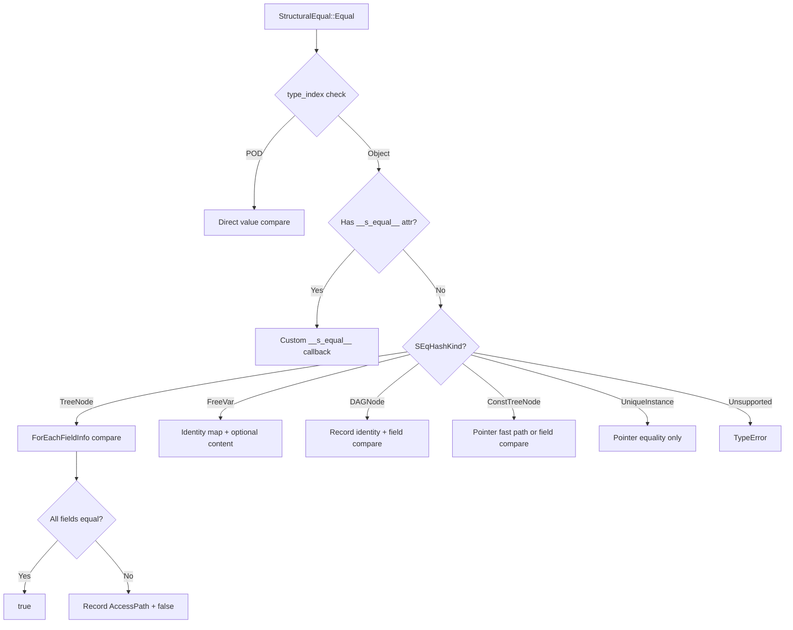

# Structural Equality and Hashing: Reflection-Driven Deep Comparison

**TL;DR**
- `StructuralEqual` and `StructuralHash` recursively compare/hash FFI objects using reflection metadata (field info from the type table), eliminating per-type handwritten equality/hash implementations.
- Each object type declares a `TVMFFISEqHashKind` (TreeNode, FreeVar, DAGNode, ConstTreeNode, UniqueInstance) that controls comparison semantics. Types can also register custom `__s_equal__`/`__s_hash__` functions via `TypeAttrColumn` for cases where field-by-field comparison is insufficient.
- `GetFirstMismatch` returns an `AccessPath` pinpointing the exact field/index/key where two values diverge, enabling structured error reporting.

## Problem Statement

### Background
- Compiler IRs and ML frameworks need structural equality (not pointer equality) to compare expressions, check equivalence of optimization results, and implement caching.
- Legacy TVM required every object type to implement `SEqualReduce`/`SHashReduce` virtual methods, leading to massive boilerplate across hundreds of types.
- Different types need different comparison semantics: tree nodes compare field-by-field, free variables map to each other within definition regions, DAG nodes track sharing for efficiency.

### Solution
- Leverage the existing reflection system (`ForEachFieldInfo`, `FieldGetter`, `TVMFFIFieldInfo`) to iterate and compare object fields generically, with no per-type code needed for the common case.
- Per-type comparison semantics are declared via `_type_s_eq_hash_kind` static constexpr and stored in `TVMFFITypeMetadata.structural_eq_hash_kind`.
- Field-level control: `kTVMFFIFieldFlagBitMaskSEqHashIgnore` skips fields during comparison; `kTVMFFIFieldFlagBitMaskSEqHashDef` marks fields that enter definition regions (where free variables can be mapped).
- Custom dispatch: types register `__s_equal__`/`__s_hash__` via `TypeAttrColumn` for full control when field-by-field is insufficient.

### Goals
- Zero-boilerplate structural equality for reflected types.
- Structured mismatch reporting via `AccessPath`.
- Support for free variable mapping, DAG sharing, and custom comparison.
- Non-goal: Replacing pointer equality for identity checks (use `same_as` for that).

## Design



### Key Classes, Fields and Interfaces

```python
class TVMFFISEqHashKind(IntEnum):
    """Per-type structural comparison semantics. Stored in TVMFFITypeMetadata."""
    kTVMFFISEqHashKindUnsupported = 0    # No structural eq/hash; throws TypeError
    kTVMFFISEqHashKindTreeNode = 1       # Compare field-by-field recursively
    kTVMFFISEqHashKindFreeVar = 2        # Variable: maps to another in def regions
    kTVMFFISEqHashKindDAGNode = 3        # Like TreeNode but records pointer identity
    kTVMFFISEqHashKindConstTreeNode = 4  # TreeNode without free vars; pointer eq sufficient
    kTVMFFISEqHashKindUniqueInstance = 5 # Singleton: pointer equality always
    # Invariant: types must have metadata and non-Unsupported kind to participate
    # Invariant: missing metadata -> TypeError (no silent fallback)
    # Interacts with: TVMFFITypeMetadata.structural_eq_hash_kind, Object._type_s_eq_hash_kind

# Field flag extensions (in TVMFFIFieldFlagBitMask):
# kTVMFFIFieldFlagBitMaskSEqHashIgnore = 1 << 3  # skip this field in structural eq/hash
# kTVMFFIFieldFlagBitMaskSEqHashDef    = 1 << 4  # field enters def region (enables free var mapping)
# Interacts with: TVMFFIFieldInfo.flags, StructEqualHandler.ForEachFieldInfo, StructuralHashHandler

class StructuralEqual:
    """Recursive structural equality comparator. Lives in tvm::ffi namespace (extra/ module)."""

    @staticmethod
    def Equal(lhs: Any, rhs: Any, map_free_vars: bool = False,
              skip_tensor_content: bool = False) -> bool: ...
        # Dispatch order:
        # 1. Same type_index? If not, false
        # 2. POD types: direct value compare (NaN == NaN by canonicalization)
        # 3. Object types: check __s_equal__ TypeAttrColumn -> custom dispatch
        # 4. Else: switch on SEqHashKind from TVMFFITypeMetadata
        # Interacts with: StructEqualHandler (internal stateful walker)
        # Invariant: NaN values compare equal to each other

    @staticmethod
    def GetFirstMismatch(lhs: Any, rhs: Any, map_free_vars: bool = False,
                         skip_tensor_content: bool = False) -> Optional[AccessPathPair]: ...
        # Returns (lhs_path, rhs_path) to first difference, or None if equal
        # Interacts with: AccessStep, AccessPath

    def __call__(self, lhs: Any, rhs: Any) -> bool: ...
        # Shorthand: Equal(lhs, rhs, map_free_vars=False, skip_tensor_content=True)

class StructuralHash:
    """Recursive structural hasher. Lives in tvm::ffi namespace (extra/ module)."""

    @staticmethod
    def Hash(value: Any, map_free_vars: bool = False,
             skip_tensor_content: bool = False) -> uint64: ...
        # Dispatch order mirrors StructuralEqual
        # Uses StableHashCombine and StableHashBytes for deterministic hashing
        # Invariant: NaN hashes to quiet_NaN() canonical representation
        # Invariant: Map keys hashed in sorted order (order-independent)
        # Interacts with: StructuralHashHandler (internal stateful walker)
        # NOTE (86bbddfd): The FFI-registered wrapper "ffi.StructuralHash" returns int64_t
        #   (explicit bitcast from uint64_t) to avoid OverflowError in TypeTraits<Int>::CopyToAnyView.
        #   The internal C++ Hash() method still returns uint64_t.

    def __call__(self, value: Any) -> uint64: ...

# === Access Path for mismatch reporting ===

class AccessKind(IntEnum):
    kAttr = 0              # was kObjectField
    kArrayItem = 1
    kMapItem = 2
    kAttrMissing = 3       # attribute missing (NEW)
    kArrayItemMissing = 4  # was 3
    kMapItemMissing = 5    # was 4

class AccessStepObj(Object):
    """Single step in a field/index/key access path."""
    kind: AccessKind
    key: Any               # str for field, int for array, Any for map
    _type_key = "ffi.reflection.AccessStep"  # was "tvm.ffi.reflection.AccessStep"
    _type_s_eq_hash_kind = kTVMFFISEqHashKindConstTreeNode
    def StepEqual(self, other: AccessStep) -> bool: ...
        # Deep equality: kind == other.kind and AnyEqual(key, other.key)
    # Interacts with: AccessPathObj.PathEqual, StructuralEqual.GetFirstMismatch

class AccessStep(ObjectRef):
    """Ref wrapper for AccessStepObj."""
    @staticmethod
    def Attr(field_name: str) -> AccessStep: ...        # was ObjectField()
    @staticmethod
    def AttrMissing(field_name: str) -> AccessStep: ... # NEW
    @staticmethod
    def ArrayItem(index: int) -> AccessStep: ...
    @staticmethod
    def ArrayItemMissing(index: int) -> AccessStep: ...
    @staticmethod
    def MapItem(key: Any) -> AccessStep: ...
    @staticmethod
    def MapItemMissing(key: Any = None) -> AccessStep: ...

class AccessPathObj(Object):
    """Parent-pointer tree node representing an access path.
    More space efficient than Array when many paths share a common prefix.
    Replaces the old Array[AccessStep] type alias."""
    parent: Optional[ObjectRef]    # Empty for root
    step: Optional[AccessStep]     # Empty for root
    depth: int                     # 0 for root
    # Invariant: depth == number of steps from root to this node
    # Invariant: parent chain always terminates at a root node (depth=0, parent=None)
    def Extend(self, step: AccessStep) -> AccessPath: ...
    def Attr(self, field_name: str) -> AccessPath: ...
    def ArrayItem(self, index: int) -> AccessPath: ...
    def MapItem(self, key: Any) -> AccessPath: ...
    def ToSteps(self) -> Array[AccessStep]: ...
    def PathEqual(self, other: AccessPath) -> bool: ...
    def IsPrefixOf(self, other: AccessPath) -> bool: ...
    _type_key = "ffi.reflection.AccessPath"

class AccessPath(ObjectRef):
    """Ref wrapper for AccessPathObj."""
    @staticmethod
    def Root() -> AccessPath: ...
    @staticmethod
    def FromSteps(steps: Union[Array[AccessStep], Iterator[AccessStep]]) -> AccessPath: ...

AccessPathPair = Tuple[AccessPath, AccessPath]

# === Custom eq/hash protocol via TypeAttrColumn ===

# Types register __s_equal__ / __s_hash__ via TypeAttrDef:
# refl::TypeAttrDef<MyObj>()
#     .def("__s_equal__", &MyObj::SEqual)
#     .def("__s_hash__", &MyObj::SHash);

def __s_equal__(
    self: ObjectRef,
    other: ObjectRef,
    cmp: TypedFunction[[AnyView, AnyView, bool, AnyView], bool]
) -> bool: ...
    # cmp(lhs_field, rhs_field, def_region, field_name) -> bool
    # Invariant: cmp must be called for every field that participates in equality
    # Invariant: set def_region=True for fields that define free variables
    # Invariant: field_name used for mismatch path reporting

def __s_hash__(
    self: ObjectRef,
    init_hash: int64,
    hash: TypedFunction[[AnyView, int64, bool], int64]
) -> int64: ...
    # hash(value, running_hash, def_region) -> combined_hash
    # CHANGED (86bbddfd): all hash values are now int64_t (bitcast from uint64_t) at the FFI boundary
    #   to avoid triggering the uint64_t overflow guard in TypeTraits<Int>::CopyToAnyView.
    #   Bit patterns are preserved; Python callers may see negative values for large hashes.
    # Invariant: callback combines via StableHashCombine internally
    # Invariant: set def_region=True for fields that define free variables

# === Registration pattern for field-level flags ===

class AttachFieldFlag(FieldInfoTrait):
    """Trait to attach field-level flags during ObjectDef registration."""
    @staticmethod
    def SEqHashDef() -> AttachFieldFlag: ...
        # Marks field as entering a definition region
    @staticmethod
    def SEqHashIgnore() -> AttachFieldFlag: ...
        # Marks field to be skipped during structural eq/hash
    # Interacts with: kTVMFFIFieldFlagBitMaskSEqHashDef/Ignore
```

### Contracts, Assumptions and Invariants
- **Reflection required**: Objects must have reflection registered (fields and metadata) to participate in structural comparison. Types without metadata throw `TypeError` -- no silent fallback to pointer equality.
- **NaN canonicalization**: All NaN bit patterns are structurally equal and hash to `quiet_NaN()`. This ensures deterministic behavior for floating-point IR representations.
- **Free variable mapping**: In `map_free_vars=True` mode, FreeVar-kind objects encountered under a SEqHashDef-flagged field are mapped to each other by encounter order. Two structurally identical functions with different variable names compare as equal.
- **DAG identity tracking**: DAGNode-kind objects record pointer identity during traversal. If the same pair `(lhs, rhs)` is encountered again, the result from the first encounter is reused, handling shared sub-expressions correctly.
- **Custom dispatch overrides reflection**: If `TypeAttrColumn("__s_equal__")[type_index]` is non-null, the custom function is called instead of reflection-based field iteration, even for TreeNode types.
- **Distinct from AnyHash/AnyEqual**: `__s_equal__`/`__s_hash__` are for deep structural comparison (recursive, with free variable mapping and DAG tracking). `__any_hash__`/`__any_equal__` (see [0003-any-system.md](../designs/0003-any-system.md)) are for shallow value-based comparison in Dict/Map key lookup. The two dispatch systems are independent and serve different use cases.

### Extension Points
- **New SEqHash kinds**: Add to `TVMFFISEqHashKind` enum in `c_api.h`.
- **Custom comparison for specific types**: Register `__s_equal__`/`__s_hash__` via `TypeAttrDef<T>` for types where field-by-field comparison is insufficient (e.g., types with computed fields or external state).
- **New field flags**: Extend `TVMFFIFieldFlagBitMask` with additional bits for future per-field comparison semantics.
- **py_class integration**: `@py_class(structure="tree")` declares structural comparison semantics for Python-defined types. `field(structure="ignore")` and `field(structure="def")` map to the corresponding field flags. `__s_equal__`/`__s_hash__` dunder methods on py_class types are auto-registered as TypeMethod/TypeAttr (5735098).

### Evolution Timeline
| Phase | Commits | Change |
|-------|---------|--------|
| v1: Initial | 9445fe7 | Introduced StructuralEqual/Hash with 6-value SEqHashKind enum (including CustomTreeNode), reflection-based field comparison, AccessPath mismatch reporting |
| v2: Custom via TypeAttrColumn | 2ec11f5 | Added kTVMFFISEqHashKindCustomTreeNode=6, custom __s_equal__/__s_hash__ via TypeAttrColumn |
| v3: Unified dispatch | 59a837e | Removed CustomTreeNode enum, custom dispatch detected via TypeAttrColumn lookup; NaN canonicalization; TypeError on missing metadata |
| v4: Isolated module | 3fc0391, e52aed5 | Moved to extra/ module (tvm::ffi:: namespace), renamed AccessKind variants, removed legacy SEqualReduce/SHashReduce markers from Object |

### Usage Examples

#### Declaring a type with structural equality and comparing instances
**Context**: Defining a simple expression type that participates in structural comparison, with one field excluded.

```cpp
class MyExprObj : public Object {
 public:
  int64_t value;
  String name;           // excluded from comparison
  static constexpr TVMFFISEqHashKind _type_s_eq_hash_kind = kTVMFFISEqHashKindTreeNode;
  TVM_FFI_DECLARE_OBJECT_INFO_FINAL("my.Expr", MyExprObj, Object);
};

// Register reflection with field flags
namespace refl = tvm::ffi::reflection;
refl::ObjectDef<MyExprObj>()
    .def_ro("value", &MyExprObj::value)
    .def_ro("name", &MyExprObj::name, refl::AttachFieldFlag::SEqHashIgnore());

// Compare
ObjectRef a = make_expr(42, "foo");
ObjectRef b = make_expr(42, "bar");
bool eq = StructuralEqual::Equal(a, b);  // true (name ignored)
uint64_t h = StructuralHash::Hash(a);     // stable hash

// Diagnose mismatch with access path
ObjectRef c = make_expr(99, "baz");
auto mismatch = StructuralEqual::GetFirstMismatch(a, c);
// mismatch->get<0>() = AccessPath::Root()->Attr("value")
```

#### Custom structural equality with free variable mapping
**Context**: A function type where parameter names should not affect equality.

```cpp
class TCustomFuncObj : public Object {
 public:
  Array<TVar> params;
  Array<ObjectRef> body;
  String comment;  // excluded from equality

  bool SEqual(const TCustomFuncObj* other,
              ffi::TypedFunction<bool(AnyView, AnyView, bool, AnyView)> cmp) const {
    if (!cmp(params, other->params, true, "params")) return false;  // def_region=true
    if (!cmp(body, other->body, false, "body")) return false;
    return true;  // comment omitted
  }

  int64_t SHash(int64_t init_hash,
                ffi::TypedFunction<int64_t(AnyView, int64_t, bool)> hash) const {
    // NOTE: hash values are int64_t (bitcast from uint64_t) at FFI boundary (86bbddfd)
    int64_t h = init_hash;
    h = hash(params, h, true);   // def_region=true
    h = hash(body, h, false);
    return h;
  }

  static constexpr TVMFFISEqHashKind _type_s_eq_hash_kind = kTVMFFISEqHashKindTreeNode;
  // ...
};

// Register custom dispatch
refl::ObjectDef<TCustomFuncObj>()
    .def_ro("params", &TCustomFuncObj::params)
    .def_ro("body", &TCustomFuncObj::body)
    .def_ro("comment", &TCustomFuncObj::comment);
refl::TypeAttrDef<TCustomFuncObj>()
    .def("__s_equal__", &TCustomFuncObj::SEqual)
    .def("__s_hash__", &TCustomFuncObj::SHash);
```

## Alternatives & Trade-offs

### Per-type virtual SEqualReduce/SHashReduce (legacy)
- Pros: Full control per type, no reflection dependency
- Cons: Massive boilerplate (every type implements two virtual methods), no structured mismatch reporting, no declarative field flags, cannot compose or override generically.

### Codegen-based equality (generate comparison code from schema)
- Pros: Zero runtime overhead, compile-time type checking
- Cons: Requires a code generation build step, must regenerate when types change, cannot handle DAG sharing or free variable mapping without runtime state.

## Related Work
### Design Docs & ADRs
- [0008-reflection.md](../designs/0008-reflection.md) -- ObjectDef, ForEachFieldInfo, TypeAttrDef/TypeAttrColumn used by structural eq/hash
- [0001-c-abi.md](../designs/0001-c-abi.md) -- TVMFFISEqHashKind enum, TVMFFITypeMetadata, field flags
- [0002-object-system.md](../designs/0002-object-system.md) -- Object._type_s_eq_hash_kind declaration
- [ADR 0005](../ADRs/0005-reflection-driven-structural-equality.md) -- Decision to use reflection for structural equality

### Evidence Matrix
- StructuralEqual/Hash initial design, SEqHashKind enum, AccessPath -> `commits/2025-07-19-9445fe734839cffc8bdf881788528b7763f7be03.md` (9445fe7)
- Custom __s_equal__/__s_hash__ via TypeAttrColumn -> `commits/2025-07-26-2ec11f5f1ed2c2607765b2cfd589cc2adcbea2ec.md` (2ec11f5)
- kTVMFFISEqHashKindCustomTreeNode removal, NaN canonicalization, TypeError on missing metadata -> `commits/2025-07-28-59a837eb4040843051706cbf5c7b71725fd65364.md` (59a837e)
- Isolation into extra/ module, AccessKind renames -> `commits/2025-07-30-3fc0391e29dac100ad37db45348090438e1db739.md` (3fc0391)
- Legacy SEqualReduce/SHashReduce markers removed from Object -> `commits/2025-07-29-e52aed53526d3a6207feb940303a6cd584fdf9d1.md` (e52aed5)
- AccessPath refactored to parent-pointer tree Object, kObjectField->kAttr, kAttrMissing added -> `commits/2025-08-06-f4ede982f00257881d9ba7fe82dd8abc07e14690.md` (f4ede98)
- __s_hash__ callback signature changed from uint64_t to int64_t, FFI wrapper bitcasts hash result -> `commits/2026-01-08-86bbddfdbaa9103016e3f39633b8b2402ea24428.md` (86bbddfd)
- StructuralKey with cached structural hash, __any_hash__/__any_equal__ type attrs, Python structural module -> `commits/2026-02-16-6adc8df7d2180ea14e463d3beeaa3d7eecb6f897.md` (6adc8df)
- Recursive compare/hash consolidated into dataclass.cc -> `commits/2026-02-27-6b39efbf381e48a8a42ab3779bc2adf587458fb3.md` (6b39efb)
- py_class structural eq/hash integration, field(structure="ignore"/"def"), __s_equal__/__s_hash__ hooks -> `commits/2026-03-14-84f46d45cb55871d64b69b66342176bf47931c0f.md` (84f46d4)
