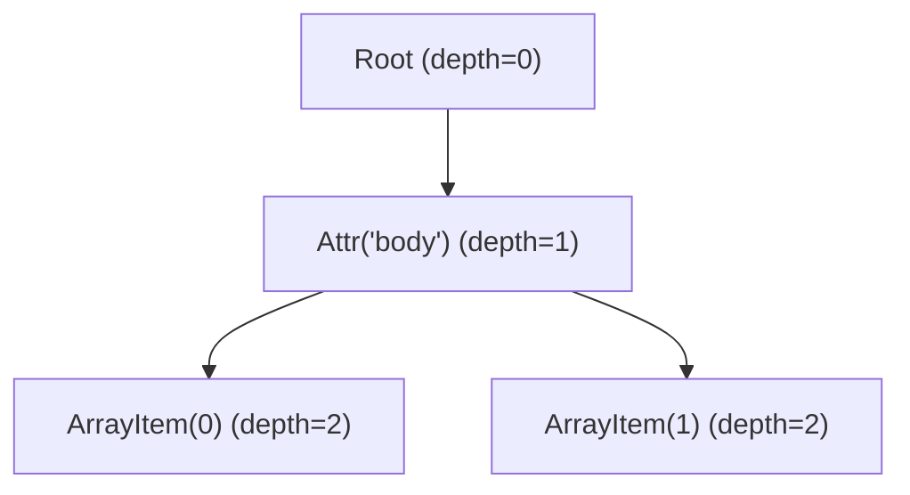
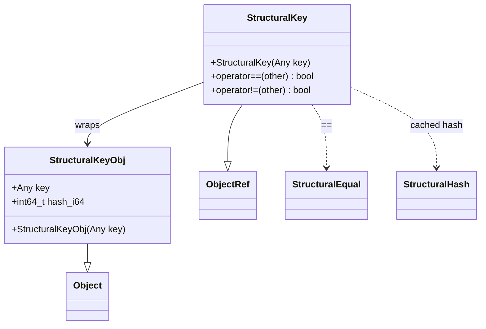

# Structural Equality and Hash System

**TL;DR**
- `StructuralEqual` and `StructuralHash` perform deep, reflection-driven comparison and hashing of `Any` values by walking field metadata registered via `ObjectDef<T>`. They live in the "extra" API tier (`include/tvm/ffi/extra/`).
- The `TVMFFISEqHashKind` enum (5 active values) on each object type controls dispatch semantics: tree-node (field-by-field), DAG-node (memoized graph), free-variable (alpha-equivalence), const-tree-node (pointer fast-path then content), and unique-instance (pointer-only).
- Custom structural equal/hash is supported via `__s_equal__` / `__s_hash__` type attributes registered through `TypeAttrColumn`, providing a runtime-detected override without requiring a dedicated enum value.

## Problem Statement

### Background

Compiler IR objects need deep structural comparison (e.g., checking if two expression trees are semantically identical) and stable hashing (for deduplication, caching, and hash-consing). Pointer equality is insufficient because structurally identical objects may be distinct allocations, and alpha-equivalent expressions (differing only in bound variable names) must compare as equal.

### Solution

A reflection-based structural comparison system that walks the field metadata registered via `ObjectDef<T>`, dispatching on a per-type `TVMFFISEqHashKind` enum to select the appropriate comparison strategy. Custom types can override the default field-by-field comparison by registering `__s_equal__` / `__s_hash__` type attributes.

### Goals

- **Goal**: Deep, field-by-field structural equality and hashing using reflection metadata.
- **Goal**: Alpha-equivalence support for variable-binding IR nodes via free-variable mapping.
- **Goal**: DAG-aware memoization for graph-structured IR with shared subexpressions.
- **Goal**: First-mismatch diagnostics via `AccessPath` for debugging comparison failures.
- **Goal**: Custom per-type override via `TypeAttrColumn` without breaking the C ABI.
- **Non-goal**: Thread-safe concurrent comparison (single-threaded only).

## Design

### TVMFFISEqHashKind Enum

The `TVMFFISEqHashKind` enum in `c_api.h` controls how each object type participates in structural comparison. The enum is stored in `TVMFFITypeMetadata::structural_eq_hash_kind` and set via the `Object::_type_s_eq_hash_kind` static constexpr.

| Value | Name | Semantics |
|---|---|---|
| 0 | `kTVMFFISEqHashKindUnsupported` | No structural comparison. Throws `TypeError` if encountered. |
| 1 | `kTVMFFISEqHashKindTreeNode` | Recursive field-by-field comparison via reflection. The default for most IR nodes. |
| 2 | `kTVMFFISEqHashKindFreeVar` | Alpha-equivalence: free variables are mapped between LHS and RHS during comparison. Used for variable-binding nodes. |
| 3 | `kTVMFFISEqHashKindDAGNode` | Graph-aware: maintains a memoization table so shared subexpressions are compared only once. |
| 4 | `kTVMFFISEqHashKindConstTreeNode` | Pointer-equality fast path: if pointers match, skip content comparison. Otherwise, fall through to field-by-field. |
| 5 | `kTVMFFISEqHashKindUniqueInstance` | Pointer equality only. For singleton-like types where identity implies equality. |

Types opt in by overriding `_type_s_eq_hash_kind` on their `Object` subclass:
```cpp
class MyIRNodeObj : public Object {
  static constexpr TVMFFISEqHashKind _type_s_eq_hash_kind = kTVMFFISEqHashKindTreeNode;
};
```

### Dispatch Logic

The structural equal handler (`StructEqualHandler`) dispatches on the value type:

1. **POD values** (`type_index < kTVMFFIStaticObjectBegin`): Direct bitwise comparison of `v_int64`, with NaN canonicalization for `kTVMFFIFloat`.
2. **Built-in containers**: Switch on type index for `String`/`Bytes` (content compare), `Array` (element-wise), `Map` (order-independent), `Shape` (element-wise), `Tensor` (tensor content). The `skip_tensor_content` parameter (renamed from `skip_ndarray_content` in commit `3a551d8`) allows skipping tensor data comparison.
3. **Generic objects**: Look up `TVMFFITypeInfo::metadata->structural_eq_hash_kind`, then:
   - Check for custom `__s_equal__` via `TypeAttrColumn`. If registered, call it.
   - Otherwise, iterate fields via `ForEachFieldInfoWithEarlyStop`, recursively comparing each field.

The structural hash handler (`StructuralHashHandler`) mirrors this with `StableHashCombine` accumulation.

### SEqHash Field Flags

Two per-field flag bits in `TVMFFIFieldFlagBitMask` control structural comparison behavior:

| Flag | Bit | Effect |
|---|---|---|
| `kTVMFFIFieldFlagBitMaskSEqHashIgnore` | 3 | Field is skipped during structural comparison/hashing (e.g., span info, comments). |
| `kTVMFFIFieldFlagBitMaskSEqHashDef` | 4 | Field defines a variable-binding region. During free-variable comparison, new variable mappings are established within this field's scope. |

Applied via `AttachFieldFlag` trait in `ObjectDef<T>`:
```cpp
ObjectDef<LetBindingObj>()
  .def_ro("var", &LetBindingObj::var_, SEqHashDef())
  .def_ro("value", &LetBindingObj::value_)
  .def_ro("span", &LetBindingObj::span_, SEqHashIgnore());
```

### Custom Structural Equal/Hash via TypeAttrColumn

Types can register custom `__s_equal__` and `__s_hash__` functions as type attributes, providing full control over comparison logic while maintaining any `_type_s_eq_hash_kind` value (typically `kTVMFFISEqHashKindTreeNode`).

**Custom equal signature**: `(self: ObjectRef, other: ObjectRef, cmp_callback: Function) -> bool`
- `cmp_callback(lhs, rhs, def_region, field_name)` delegates back to the handler for recursive comparison.

**Custom hash signature**: `(self: ObjectRef, init_hash: uint64_t, hash_callback: Function) -> uint64_t`
- `hash_callback(val, init_hash, def_region)` delegates back to the handler and returns the combined hash via `StableHashCombine`.

Detection is purely runtime: `TypeAttrColumn("__s_equal__")[type_index] != nullptr`. No dedicated enum value is needed.

### NaN Canonicalization

`StructuralEqual(NaN, NaN) == true` and all NaN bit patterns produce the same hash. This is achieved by:
- In `CompareAny`: when `type_index == kTVMFFIFloat && std::isnan(lhs)`, return `std::isnan(rhs)`.
- In `HashAny`: canonicalize NaN to `std::numeric_limits<double>::quiet_NaN()` before hashing.

### AccessPath Mismatch Diagnostics

`StructuralEqual::GetFirstMismatch(lhs, rhs)` returns an `AccessPathPair = Tuple<AccessPath, AccessPath>` describing the precise location of the first divergence.

`AccessPath` is a parent-pointing tree object (`AccessPathObj`) with fields `parent`, `step`, and `depth`. Each node represents one navigation step from the root. Sibling paths (e.g., `root.body[0]` and `root.body[1]`) share the parent chain up to their common prefix, allocating only one new `AccessPathObj` per sibling. This is compact for structural comparison where many paths are explored from a common root.



`AccessStep` encodes one navigation step:
- `AccessStep::Attr(name)` -- object attribute by name.
- `AccessStep::ArrayItem(index)` -- array element by index.
- `AccessStep::MapItem(key)` -- map entry by key.
- Missing variants (`AttrMissing`, `ArrayItemMissing`, `MapItemMissing`) for asymmetric structures.

Builder API: `AccessPath::Root()`, `->Extend(step)`, `->Attr(name)`, `->ArrayItem(i)`, `->MapItem(key)`. `ToSteps()` materializes the flat `Array<AccessStep>` representation. `PathEqual()` and `IsPrefixOf()` provide comparison with pointer-equality fast paths.

See [ADR 0016](../ADRs/0016-access-path-parent-tree.md) for the decision to move from flat `Array<AccessStep>` to parent-pointing tree.

### Free-Variable and DAG Memoization

- **Free-variable mapping**: `StructEqualHandler` maintains bidirectional maps (`equal_map_lhs_`, `equal_map_rhs_`) that track variable correspondences. When entering a `def_region` field (flagged `kTVMFFIFieldFlagBitMaskSEqHashDef`), new mappings are established. Free variables compare equal if they map to corresponding variables in the other tree.
- **DAG memoization**: For `kTVMFFISEqHashKindDAGNode` types, previously compared object pairs are memoized so shared subgraphs are not re-traversed.
- **Graph counter**: DAG and free-var nodes are assigned monotonically increasing counters for ordering and hash stability.

### StructuralKey: Hash-Caching Wrapper for Content-Addressed Lookup

`StructuralKey` (`include/tvm/ffi/extra/structural_key.h`, commit `6adc8df` #453) is a frozen, hashable wrapper that caches the structural hash of an arbitrary `Any` value. It enables using structurally compared objects as dictionary and `Map` keys without recomputing the hash on every lookup.



**Construction**: `StructuralKey(key)` computes `StructuralHash::Hash(key)` once and caches it in `hash_i64`. The cost of structural hashing is paid at construction time only.

**Equality**: `operator==` first checks pointer identity (`same_as`), then compares cached hashes (cheap integer comparison as a fast rejection), and only calls `StructuralEqual::Equal` on hash collision. This three-stage strategy avoids expensive deep comparison in the common case.

**STL integration**: A `std::hash<StructuralKey>` specialization returns `static_cast<size_t>(static_cast<uint64_t>(key->hash_i64))`, enabling use in `std::unordered_map` and `std::unordered_set`.

**Python binding** (`python/tvm_ffi/structural.py`): The `StructuralKey` Python class (registered as `"ffi.StructuralKey"`) exposes `__hash__` (returning `hash_i64 & 0xFFFFFFFFFFFFFFFF` for unsigned conversion) and `__eq__` (delegating to `ffi.StructuralKeyEqual`). Python dictionaries and `Map` objects accept `StructuralKey` instances as keys:
```python
k0 = tvm_ffi.StructuralKey([1, 2, 3])
k1 = tvm_ffi.StructuralKey([1, 2, 3])
d = {k0: "value"}
assert d[k1] == "value"  # k1 matches k0 structurally
```

**Python helper functions** (also in `structural.py`): `structural_equal(lhs, rhs, ...)`, `structural_hash(value, ...)`, and `get_first_structural_mismatch(lhs, rhs, ...)` provide direct Python access to the structural comparison system without requiring `StructuralKey` wrapping. These delegate to `ffi.StructuralEqual`, `ffi.StructuralHash`, and `ffi.GetFirstStructuralMismatch` respectively.

**Reflection registration**: `StructuralKeyObj` is registered via `ObjectDef<StructuralKeyObj>` with `def_ro("key", ...)` and `def_ro("hash_i64", ...)` fields. A static `__init__` method and `StructuralKeyEqual` global function are also registered (in `src/ffi/extra/reflection_extra.cc`).

**Key invariant**: `StructuralKey` is immutable after construction. Mutating `key` after construction would invalidate `hash_i64`, breaking hash consistency. The fields are registered as `def_ro` (read-only).

**Relationship to AnyHash/AnyEqual**: `StructuralKey` uses the graph-level `StructuralEqual`/`StructuralHash` system (deep, reflection-driven comparison). This is distinct from the value-level `AnyHash`/`AnyEqual` used by `Map` (see [ADR 0060](../ADRs/0060-custom-any-hash-equal.md)). `StructuralKey` can be used as a `Map` key and will be compared via the default `AnyHash`/`AnyEqual` (pointer identity), so two distinct `StructuralKey` objects wrapping the same content will be different keys in a `Map`. To use structural comparison with `Map`, register custom `__any_hash__`/`__any_equal__` on `StructuralKeyObj`, or use Python `dict` with `StructuralKey` instances (which use `__hash__`/`__eq__`).

### Key Classes, Fields and Interfaces

- **`StructuralEqual`** (`include/tvm/ffi/extra/structural_equal.h`): Public API. `Equal(lhs, rhs) -> bool`, `GetFirstMismatch(lhs, rhs) -> Optional<AccessPathPair>`. Marked `TVM_FFI_EXTRA_CXX_API`.
- **`StructuralHash`** (`include/tvm/ffi/extra/structural_hash.h`): Public API. `Hash(value) -> uint64_t`. Marked `TVM_FFI_EXTRA_CXX_API`.
- **`StructuralKeyObj` / `StructuralKey`** (`include/tvm/ffi/extra/structural_key.h`): Hash-caching wrapper. Type key `"ffi.StructuralKey"`. Fields: `key` (Any), `hash_i64` (int64_t). `std::hash<StructuralKey>` specialization provided. Registered with reflection in `src/ffi/extra/reflection_extra.cc`.
- **`StructEqualHandler`** (`src/ffi/extra/structural_equal.cc`): Internal handler implementing the comparison algorithm.
- **`StructuralHashHandler`** (`src/ffi/extra/structural_hash.cc`): Internal handler implementing the hashing algorithm.
- **`AccessStepObj` / `AccessStep`** (`include/tvm/ffi/reflection/access_path.h`): Path step object. Type key `"ffi.reflection.AccessStep"`. Factory methods: `Attr(name)`, `AttrMissing(name)`, `ArrayItem(index)`, `ArrayItemMissing(index)`, `MapItem(key)`, `MapItemMissing(key)`.
- **`AccessPathObj` / `AccessPath`** (`include/tvm/ffi/reflection/access_path.h`): Parent-pointing tree object. Type key `"ffi.reflection.AccessPath"`. Fields: `parent`, `step`, `depth`. Methods: `Root()`, `Extend(step)`, `Attr(name)`, `ToSteps()`, `PathEqual()`, `IsPrefixOf()`.
- **`AccessPathPair`**: Type alias for `Tuple<AccessPath, AccessPath>`.
- **`TVMFFISEqHashKind`** (`include/tvm/ffi/c_api.h`): C ABI enum with 6 values (0-5).
- **`AttachFieldFlag`** (`include/tvm/ffi/reflection/registry.h`): `FieldInfoTrait` subclass for attaching flag bits. Factory methods: `SEqHashDef()`, `SEqHashIgnore()`.

### Contracts, Assumptions and Invariants

- **Metadata required**: Every object type used in structural comparison must have `TVMFFITypeMetadata` registered and `structural_eq_hash_kind != kTVMFFISEqHashKindUnsupported`. Violation throws `TypeError`.
- **NaN equality**: `StructuralEqual(NaN, NaN) == true` and `StructuralHash(NaN_a) == StructuralHash(NaN_b)`.
- **Hash consistency**: Small strings and heap strings produce the same structural hash (delegated to the same content-based hashing).
- **Cross-representation**: Structural equal/hash handles both small-string and heap-string representations transparently.
- **AccessPath conventions**: `AccessStep` uses "Attr" for object attributes and "Item" terminology (`ArrayItem`, `MapItem`) for container elements. Parent-pointing tree invariant: `depth == parent->depth + 1` for non-root nodes.

### Extension Points

- **New container types**: Add switch-case arms in `CompareAny`/`HashAny` for new built-in containers.
- **Custom comparison**: Register `__s_equal__`/`__s_hash__` via `TypeAttrDef<T>` for types needing non-standard comparison logic.
- **New SEqHashKind values**: The enum can be extended with new comparison strategies.
- **New field flags**: Bits 7-10 are now used for `CompareOff` (7), `HashOff` (8), `InitOff` (9), and `KwOnly` (10) by the dataclass operations system (commit `6b39efb`). Bits 11-63 remain available for future per-field annotations.

## Alternatives & Trade-offs

### Alternative: Virtual method override for custom equal/hash

- Pros: Direct C++ dispatch, no packed function overhead.
- Cons: Breaks C ABI (requires vtable), not accessible from Python/Rust. TypeAttr-based dispatch maintains ABI stability.

### Alternative: Dedicated kTVMFFISEqHashKindCustomTreeNode enum value

- Pros: Compile-time documentation of custom intent.
- Cons: Redundant with the runtime TypeAttrColumn check. Couples "has custom equal/hash" to a static declaration. Was introduced in `2ec11f5` and removed in `59a837e` in favor of purely runtime detection.

### Alternative: Per-field virtual comparison methods

- Pros: Field-level customization without whole-type override.
- Cons: Combinatorial complexity. The field-flag approach (`SEqHashIgnore`, `SEqHashDef`) covers the common cases, and whole-type `__s_equal__` handles the rest.

## Related Work

### Design Docs & ADRs

- [`.knowledge/designs/0001-c-abi.md`](0001-c-abi.md) -- `TVMFFISEqHashKind` enum and field flags in C ABI
- [`.knowledge/designs/0003-object-system.md`](0003-object-system.md) -- `_type_s_eq_hash_kind` on Object
- [`.knowledge/designs/0006-reflection.md`](0006-reflection.md) -- `ForEachFieldInfo`, `FieldGetter`, field metadata
- [`.knowledge/designs/0010-type-attr-columns.md`](0010-type-attr-columns.md) -- `TypeAttrColumn` used for custom dispatch
- [`.knowledge/designs/0011-extra-api-tier.md`](0011-extra-api-tier.md) -- Extra API tier where structural equal/hash lives
- [`.knowledge/ADRs/0014-remove-custom-tree-node-enum.md`](../ADRs/0014-remove-custom-tree-node-enum.md) -- Decision to remove CustomTreeNode enum
- [`.knowledge/ADRs/0016-access-path-parent-tree.md`](../ADRs/0016-access-path-parent-tree.md) -- Decision to refactor AccessPath to parent-pointing tree
- [`.knowledge/ADRs/0060-custom-any-hash-equal.md`](../ADRs/0060-custom-any-hash-equal.md) -- Custom `AnyHash`/`AnyEqual` (value-level, distinct from structural equal/hash which is graph-level)
- [`.knowledge/ADRs/0062-structural-key-frozen-wrapper.md`](../ADRs/0062-structural-key-frozen-wrapper.md) -- Decision to use frozen wrapper with cached structural hash
- [`.knowledge/designs/0027-dataclass-operations.md`](0027-dataclass-operations.md) -- RecursiveHash/RecursiveEq: parallel but distinct system for dataclass-level structural operations (no alpha-equivalence, no SEqHashKind dispatch)

### Evidence Matrix

- StructuralEqual/StructuralHash introduction -> `.knowledge/commits/2025-07-19-9445fe734839cffc8bdf881788528b7763f7be03.md` + `9445fe7`
- TypeAttr-based custom dispatch -> `.knowledge/commits/2025-07-26-2ec11f5f1ed2c2607765b2cfd589cc2adcbea2ec.md` + `2ec11f5`
- CustomTreeNode enum removal + NaN canonicalization -> `.knowledge/commits/2025-07-28-59a837eb4040843051706cbf5c7b71725fd65364.md` + `59a837e`
- SEqualReduce/SHashReduce flag removal -> `.knowledge/commits/2025-07-29-e52aed53526d3a6207feb940303a6cd584fdf9d1.md` + `e52aed5`
- String memequal optimization -> `.knowledge/commits/2025-07-30-ba0ea87da5f51890b8801ceaad2f583d17265bc1.md` + `ba0ea87`
- Move to extra/ namespace -> `.knowledge/commits/2025-07-30-3fc0391e29dac100ad37db45348090438e1db739.md` + `3fc0391`
- AccessPath refactored to parent-pointing tree, Attr rename -> `.knowledge/commits/2025-08-06-f4ede982f00257881d9ba7fe82dd8abc07e14690.md` + `f4ede98`
- skip_ndarray_content renamed to skip_tensor_content, CompareNDArray/HashNDArray renamed to CompareTensor/HashTensor -> `.knowledge/commits/2025-09-06-3a551d83f7c05106fa8033a61970a5ce34aa8aef.md` + `3a551d8`
- StructuralKey frozen hashable wrapper + Python structural.py module -> `.knowledge/commits/2026-02-16-6adc8df7d2180ea14e463d3beeaa3d7eecb6f897.md` + `6adc8df`
