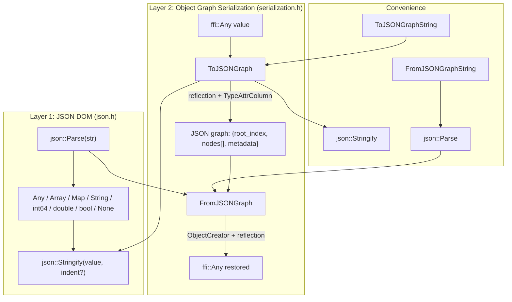

# JSON and Object Graph Serialization

**TL;DR**
- `tvm::ffi::json` provides a lightweight JSON parser/writer (`Parse`/`Stringify`) that reuses the existing `Any`/`Array`/`Map` value system as the JSON DOM. It extends RFC 8259 with JavaScript-style `Infinity`/`NaN` literals and preserves `int64` vs `double` distinction.
- `ToJSONGraph`/`FromJSONGraph` build on top of the JSON layer and the reflection system to serialize any `ffi::Any` value to/from a JSON object graph with node deduplication, type preservation, and support for custom per-type serialization via the `__data_to_json__`/`__data_from_json__` TypeAttrColumn protocol.
- String-based convenience wrappers (`ToJSONGraphString`/`FromJSONGraphString`) and `Base64Encode`/`Base64Decode` utilities for binary data complete the serialization stack.

## Problem Statement

### Background
- The FFI system needed a way to serialize and deserialize object graphs (e.g., IR modules, compiler configurations) for persistence, debugging, and cross-process communication.
- Standard JSON libraries would introduce external dependencies and could not leverage the FFI's existing type-erased value system (`Any`, `Array<Any>`, `Map<Any, Any>`).
- ML workloads use special float values (`NaN`, `Infinity`) that standard JSON cannot represent, and integer types must be distinguished from floats for FFI value fidelity.

### Solution
- Build a JSON parser/writer that maps directly onto the FFI value system: JSON objects become `Map<Any, Any>`, arrays become `Array<Any>`, strings become `String`, numbers become `int64_t` or `double`, booleans become `bool`, and null becomes `None`.
- Layer a reflection-driven object graph serializer on top, walking reflected fields generically to produce a node-deduplicated JSON representation.
- Allow per-type customization via `TypeAttrColumn("__data_to_json__")`/`TypeAttrColumn("__data_from_json__")`, following the same pattern as `__s_equal__`/`__s_hash__` in structural equality.

### Goals
- Roundtrip fidelity: `Parse(Stringify(v))` preserves `int64` vs `double` type distinction.
- No external dependencies (header-only JSON, builds within the `extra/` module).
- Reflection-based serialization that works for any type with registered metadata.
- Non-goal: High-performance streaming parser or full JSON Schema validation.

## Design

The system has two layers: the JSON DOM layer and the object graph serialization layer.



### Key Classes, Fields and Interfaces

```python
# === Layer 1: JSON DOM (tvm::ffi::json namespace) ===

Value = Any           # Any JSON value is stored as ffi::Any
Object = Map[Any, Any]  # JSON object; keys checked at read-time
# Invariant: Object preserves insertion order (backed by insertion-ordered Map)
Array = Array[Any]    # JSON array

def Parse(json_str: String, error_msg: Optional[Ptr[String]] = None) -> Value:
    """Parse JSON text into an Any value tree.
    Extensions beyond RFC 8259:
      - Infinity, -Infinity, NaN (JavaScript-style)
      - int64 integers (no fractional/exponent -> stored as int64_t)
    """
    # Interacts with: ffi::Any, ffi::String, ffi::Array, ffi::Map
    # Interacts with: GlobalDef (registered as "ffi.json.Parse")
    # Invariant: if error_msg is not None, errors reported there instead of throwing
    # Invariant: integers within int64 range stored as int64_t; floats as double
    # Invariant: all error messages include "line N column M (char P)" context
    # Extension: add new literal handlers in JSONParserContext
    ...

def Stringify(value: Value, indent: Optional[int] = None) -> String:
    """Serialize an Any value tree to JSON text.
    Float roundtrip: integer-valued doubles print with '.0' suffix;
    non-integer doubles use %.17g precision.
    """
    # Interacts with: ffi::Any, ffi::String, ffi::Array, ffi::Map
    # Interacts with: GlobalDef (registered as "ffi.json.Stringify")
    # Invariant: Map keys must be strings; ValueError thrown otherwise
    # Invariant: indent=None -> compact output; indent=N -> N-space pretty-print
    # Extension: add custom type serializers by extending WriteValue switch
    ...

# Internal: FastMathSafe IEEE 754 helpers
# Under -ffast-math, std::isnan/isinf/numeric_limits are unreliable.
# The parser and writer use union-based type punning to construct/detect
# NaN, +Infinity, -Infinity from bit patterns:
#   NaN     = 0x7FF8000000000000 (quiet NaN)
#   +Inf    = 0x7FF0000000000000
#   -Inf    = 0xFFF0000000000000
# Invariant: sizeof(double) == sizeof(uint64_t) (static_assert verified)
# Invariant: union-based punning avoids strict-aliasing violations (not reinterpret_cast)

# === Layer 2: Object Graph Serialization (tvm::ffi namespace) ===

def ToJSONGraph(value: Any, metadata: Any = None) -> json.Value:
    """Serialize an ffi::Any value to a JSON object graph.
    Graph structure: {"root_index": int, "nodes": [...], "metadata": ...}
    """
    # Dispatch by type_index:
    #   POD (bool, int, float, DataType, None): inlined directly
    #   String: stored as node {"type": "ffi.String", "data": <str>}
    #   Bytes: stored as node {"type": "ffi.Bytes", "data": <base64>}
    #   Shape: stored as node {"type": "ffi.Shape", "data": [dim0, ...]}
    #   Array: stored as node {"type": "ffi.Array", "data": [node_indices...]}
    #   Map: stored as node {"type": "ffi.Map", "data": [[key_idx, val_idx]...]}
    #   Object with __data_to_json__: custom serializer returns json::Value
    #   Object with reflection: field-by-field via ForEachFieldInfo
    #     - primitive-typed fields inlined, others stored as node references
    # Interacts with: reflection::ForEachFieldInfo, reflection::FieldGetter,
    #   TypeAttrColumn("__data_to_json__"), TVMFFITypeInfo.metadata,
    #   Base64Encode (for Bytes), DLDataTypeToString (for DataType)
    # Invariant: identical objects (by Any identity) share the same node index
    # Invariant: value must have reflection metadata for object types
    # Extension: register __data_to_json__ via TypeAttrDef<T>
    ...

def FromJSONGraph(value: json.Value) -> Any:
    """Deserialize a JSON object graph back to an ffi::Any value."""
    # Interacts with: reflection::ForEachFieldInfo, TVMFFITypeMetadata.creator,
    #   TypeAttrColumn("__data_from_json__"), TVMFFIFieldInfo.setter,
    #   TVMFFIFieldInfo.default_value, Base64Decode, StringToDLDataType
    # Invariant: JSON must have "root_index" (int) and "nodes" (array)
    # Invariant: object types must have metadata.creator (default constructor)
    # Invariant: required fields without defaults raise TypeError if missing
    ...

def ToJSONGraphString(value: Any, metadata: Any) -> String:
    """Convenience: serialize to JSON string directly."""
    # Delegates to: json::Stringify(ToJSONGraph(value, metadata))
    # Registered as: "ffi.ToJSONGraphString"
    ...

def FromJSONGraphString(value: String) -> Any:
    """Convenience: deserialize from JSON string directly."""
    # Delegates to: FromJSONGraph(json::Parse(value))
    # Registered as: "ffi.FromJSONGraphString"
    ...

# === Custom serialization protocol ===

# Per-type opt-in via TypeAttrDef<T>:
#   refl::TypeAttrDef<MyObj>()
#       .def("__data_to_json__", [](const MyObj* self) -> json::Value { ... })
#       .def("__data_from_json__", [](json::Value data) -> MyObj { ... });
# Interacts with: TypeAttrColumn, ObjectGraphSerializer.CreateObjectData
# Extension: any object type can override default field-by-field serialization

# === ObjectCreator (reflection/creator.h) ===

class ObjectCreator:
    """Reflection-based creator: constructs objects from Map<String, Any> field maps."""
    # Interacts with: TVMFFITypeInfo, TVMFFITypeMetadata.creator, ForEachFieldInfo
    # Invariant: type must have reflection registered and default constructor
    # Invariant: all required fields must be present; no unknown fields allowed
    def __init__(self, type_key: str): ...
    def __init__(self, type_info: Ptr[TVMFFITypeInfo]): ...
    def __call__(self, fields: Map[String, Any]) -> Any: ...
        # 1. Call metadata->creator to allocate empty object
        # 2. ForEachFieldInfo: set fields from map, use defaults, or raise TypeError
        # 3. Verify no extra fields

# === Base64 utilities (base64.h) ===

def Base64Encode(data: Union[Bytes, TVMFFIByteArray]) -> String:
    """Standard Base64 encoding (RFC 4648, no line breaks)."""
    # Interacts with: ToJSONGraph (Bytes fields encoded as base64 strings)

def Base64Decode(data: Union[String, TVMFFIByteArray]) -> Bytes:
    """Standard Base64 decoding."""
    # Invariant: input length must be a multiple of 4
    # Interacts with: FromJSONGraph (decodes base64 back to Bytes)
```

### Contracts, Assumptions and Invariants
- **Roundtrip int/float distinction**: `Stringify` prints integer-valued doubles with a `.0` suffix (e.g., `42.0`) to distinguish them from `int64` values (`42`). `Parse` then stores the former as `double` and the latter as `int64_t`. This is non-standard JSON but critical for FFI type fidelity.
- **Map key ordering**: JSON objects preserve insertion order because they use `Map<Any, Any>`, which is insertion-ordered (ADR 0004). This ensures `Stringify(Parse(s))` preserves key order.
- **Node deduplication**: `ToJSONGraph` uses a `Map<Any, int64_t>` node index map keyed by `Any` identity. Objects referenced multiple times in the value graph appear as a single node with multiple index references.
- **Reflection required for deserialization**: `FromJSONGraph` requires that object types have both reflection metadata and a default constructor (`TVMFFITypeMetadata.creator`). Types without metadata cannot be deserialized.
- **Custom serialization overrides reflection**: When `TypeAttrColumn("__data_to_json__")[type_index]` is non-null, the custom function is called instead of reflection-based field iteration.
- **FastMath safety**: Under `-ffast-math`, `NaN`/`Infinity` construction and detection use union-based IEEE 754 bit manipulation instead of `std::isnan`/`std::isinf`/`std::numeric_limits`, which the compiler may optimize away. This is guarded by `#ifdef __FAST_MATH__`.
- **Failure mode -- missing metadata**: If an object type has no reflection metadata, `ToJSONGraph` throws `TypeError`. This is fail-fast by design; there is no fallback to raw pointer serialization.
- **Failure mode -- parse errors**: `Parse` throws `ValueError` with "line N column M" context. If `error_msg` output parameter is provided, errors are reported there without throwing.

### Extension Points
- **Custom per-type JSON serialization**: Register `__data_to_json__`/`__data_from_json__` via `TypeAttrDef<T>` for types where field-by-field serialization is insufficient.
- **New JSON literal types**: Extend `JSONParserContext` with additional literal handlers (e.g., BigInt, Date).
- **New serializable container types**: Add cases to the `ObjectGraphSerializer` type_index switch for new container types.

### Usage Examples

#### Parsing and stringifying JSON
**Context**: Working with the JSON DOM layer -- parsing JSON text and producing output.

```cpp
#include <tvm/ffi/extra/json.h>
using namespace tvm::ffi;

// Parse JSON string into Any value tree
json::Value val = json::Parse("{\"name\": \"Alice\", \"scores\": [95, 87.5]}");
json::Object obj = val.cast<json::Object>();
String name = obj["name"].cast<String>();          // "Alice"
int64_t first = obj["scores"].cast<json::Array>()[0].cast<int64_t>();  // 95 (int64, not double)

// Serialize with pretty-print
String pretty = json::Stringify(val, 2);  // indented with 2 spaces

// Error handling without exceptions
String error_msg;
json::Value bad = json::Parse("{invalid", &error_msg);
// error_msg: "Expecting property name enclosed in double quotes: line 1 column 2 (char 1)"
```

#### Serializing a reflected object graph
**Context**: Round-tripping a C++ object through JSON graph serialization.

```cpp
#include <tvm/ffi/extra/serialization.h>

// Serialize a reflected object to JSON graph
TVar x = TVar("x");
json::Value graph = ToJSONGraph(x);
// graph == {"root_index": 1, "nodes": [
//   {"type": "ffi.String", "data": "x"},
//   {"type": "test.Var", "data": {"name": 0}}
// ]}

// Deserialize back
Any restored = FromJSONGraph(graph);
StructuralEqual::Equal(restored, x, /*map_free_vars=*/true);  // true

// String-based convenience (for cross-language FFI callers)
String json_str = ToJSONGraphString(x, Any(nullptr));
Any restored2 = FromJSONGraphString(json_str);
```

#### Cross-language serialization via FFI
**Context**: Python caller using registered global functions.

```python
# Python side
to_json = tvm_ffi.get_global_func("ffi.ToJSONGraphString")
from_json = tvm_ffi.get_global_func("ffi.FromJSONGraphString")

json_str = to_json(my_ir_module, None)  # returns String
restored = from_json(json_str)           # returns Any
```

## Alternatives & Trade-offs

### Use an external JSON library (nlohmann/json, rapidjson)
- Pros: Mature, well-tested, full RFC 8259 compliance
- Cons: External dependency, cannot directly use FFI value types (need conversion layer), no `Infinity`/`NaN` support, no `int64` preservation

### Protobuf / FlatBuffers for serialization
- Pros: Binary format (faster), schema enforcement, language-neutral
- Cons: Heavy dependency, requires schema definitions, not human-readable (bad for debugging), does not compose with the existing reflection system

### Visitor pattern instead of reflection for serialization
- Pros: Full per-type control, no reflection dependency
- Cons: Requires every type to implement visit methods (same boilerplate problem that reflection was designed to eliminate), cannot handle new types without recompilation

## Related Work
### Design Docs & ADRs
- [0008-reflection.md](../designs/0008-reflection.md) -- ForEachFieldInfo, FieldGetter/Setter, TypeAttrDef/TypeAttrColumn used by serialization
- [0003-any-system.md](../designs/0003-any-system.md) -- json::Value is a direct alias of ffi::Any
- [0007-containers.md](../designs/0007-containers.md) -- Array and Map used as JSON DOM types
- [0009-structural-equal-hash.md](../designs/0009-structural-equal-hash.md) -- Uses StructuralEqual to verify roundtrip; shares TypeAttrColumn pattern
- [ADR 0004](../ADRs/0004-insertion-ordered-map.md) -- Map insertion order guarantees JSON object key ordering
- [ADR 0006](../ADRs/0006-json-dialect-and-serialization-strategy.md) -- Decision to extend JSON and use reflection for serialization

### Evidence Matrix
- JSON parser/writer initial implementation -> `commits/2025-08-04-de541e37ad3820033856cc8a0af55e896af55a3b.md` (de541e3)
- Object graph serialization (ToJSONGraph/FromJSONGraph), Base64, __data_to_json__ protocol -> `commits/2025-08-05-8eaefe04a044292e071263aca309b6991124c566.md` (8eaefe0)
- ObjectCreator, Shape serialization support -> `commits/2025-08-05-7cb92736b2ed95852ac71543937511acc7a3feec.md` (7cb9273)
- String convenience wrappers (ToJSONGraphString/FromJSONGraphString) -> `commits/2025-08-06-55edee051c780af1831d7d04a40ddb8960ce01ed.md` (55edee0)
- FastMathSafe NaN/Infinity helpers -> `commits/2025-08-15-1a271f00321b8cc16b72e58436716a05e2f62500.md` (1a271f0)
- Fix strict-aliasing in FastMath helpers (union idiom) -> `commits/2025-08-22-3f4f4f11184fc9862670d929a32ab81beb79286b.md` (3f4f4f1)
