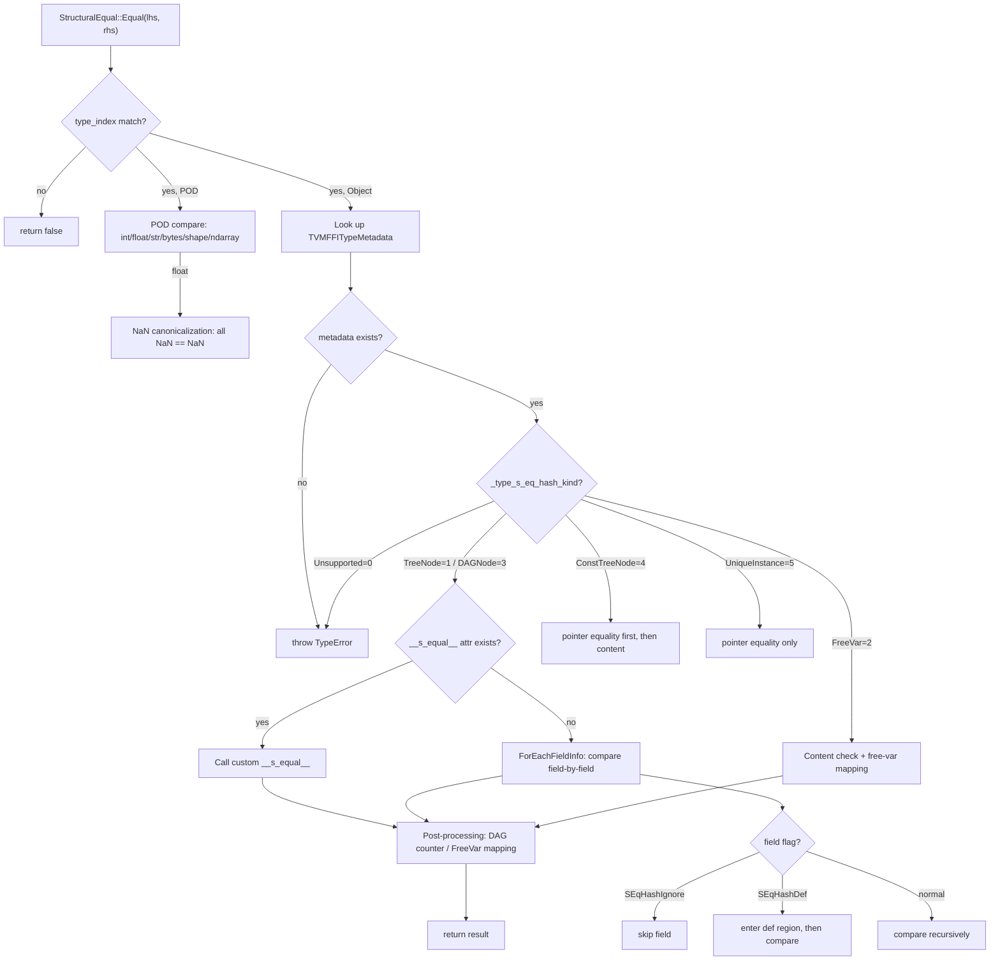

# Structural Equality and Hash System

**TL;DR**
- Provides reflection-based deep comparison and hashing of `Any` values via `StructuralEqual` and `StructuralHash`, supporting tree nodes, DAG nodes, free variables, pointer-equal singletons, and user-defined custom handlers.
- Dispatch is controlled by the `TVMFFISEqHashKind` enum (6 values, 0-5) on each type's `_type_s_eq_hash_kind` static field, with optional custom `__s_equal__`/`__s_hash__` overrides discovered via `TypeAttrColumn` lookup at runtime.
- Lives in the `extra/` module (`include/tvm/ffi/extra/`) as a non-core C++ API, gated by the `TVM_FFI_USE_EXTRA_CXX_API` CMake option, while the `AccessPath` diagnostics remain in core reflection.

## Problem Statement

### Background
- IR compilers need structural comparison of complex object graphs (ASTs, type expressions, relay programs) where pointer equality is insufficient and manual `operator==` on every type is unmaintainable.
- Different node types require different comparison semantics: tree nodes (content-equal), DAG nodes (identity-tracked), free variables (mappable across two IR fragments), singletons (pointer-equal is sufficient).
- The legacy approach used virtual methods (`SEqualReduce`/`SHashReduce`) on `Object`, which required every node to implement these methods and could not be extended cross-language.

### Solution
- The reflection system's field metadata (`ForEachFieldInfo`) provides automatic field-by-field comparison and hashing without per-type boilerplate.
- Types opt into structural comparison by setting `_type_s_eq_hash_kind` (a compile-time static field) and optionally registering custom `__s_equal__`/`__s_hash__` functions via `TypeAttrDef`.
- Field-level annotations (`SEqHashIgnore`, `SEqHashDef`) control which fields participate and which define "def regions" for free-variable scoping.

### Goals
- **Goal**: Automatic structural equality/hash for any reflectable type without per-type `operator==`/hash boilerplate.
- **Goal**: Support five comparison semantics (tree, DAG, free-var, const-tree, unique-instance) plus user-defined custom.
- **Goal**: Structured mismatch diagnostics via `AccessPath` for debugging.
- **Non-goal**: Not a general-purpose deep comparison framework; specifically for IR/object graph comparison in the reflection system.

## Design



### Key Classes, Fields and Interfaces

**`TVMFFISEqHashKind` enum** (C ABI, `c_api.h`):
```c
enum TVMFFISEqHashKind : int32_t {
  kTVMFFISEqHashKindUnsupported    = 0,  // no structural eq/hash; throws TypeError
  kTVMFFISEqHashKindTreeNode       = 1,  // compare by content, tree semantics
  kTVMFFISEqHashKindFreeVar        = 2,  // mappable free variable
  kTVMFFISEqHashKindDAGNode        = 3,  // compare by content, DAG identity tracking
  kTVMFFISEqHashKindConstTreeNode  = 4,  // tree node; pointer eq is sufficient if same
  kTVMFFISEqHashKindUniqueInstance  = 5,  // singleton; always pointer eq
};
```

**`Object::_type_s_eq_hash_kind`** static field (default on `Object`):
```cpp
static constexpr TVMFFISEqHashKind _type_s_eq_hash_kind = kTVMFFISEqHashKindUnsupported;
// Subclasses override to opt in:
// static constexpr TVMFFISEqHashKind _type_s_eq_hash_kind = kTVMFFISEqHashKindTreeNode;
```

**Field flag bits** (`TVMFFIFieldFlagBitMask` additions):
```c
kTVMFFIFieldFlagBitMaskSEqHashIgnore = 1 << 3,  // skip field during structural eq/hash
kTVMFFIFieldFlagBitMaskSEqHashDef    = 1 << 4,  // field enters "def region" (enables free-var mapping)
```

**`StructuralEqual`** (`extra/structural_equal.h`):
```cpp
class StructuralEqual {
 public:
  TVM_FFI_EXTRA_CXX_API static bool Equal(
      const Any& lhs, const Any& rhs,
      bool map_free_vars = false, bool skip_ndarray_content = false);
  TVM_FFI_EXTRA_CXX_API static Optional<AccessPathPair> GetFirstMismatch(
      const Any& lhs, const Any& rhs,
      bool map_free_vars = false, bool skip_ndarray_content = false);
  bool operator()(const Any& lhs, const Any& rhs) const;
  // operator() calls Equal(lhs, rhs, false, true)
};
```

**`StructuralHash`** (`extra/structural_hash.h`):
```cpp
class StructuralHash {
 public:
  TVM_FFI_EXTRA_CXX_API static uint64_t Hash(
      const Any& value,
      bool map_free_vars = false, bool skip_ndarray_content = false);
  uint64_t operator()(const Any& value) const;
  // operator() calls Hash(value, false, false)
};
```

**`AttachFieldFlag`** field trait (`reflection/registry.h`):
```cpp
class AttachFieldFlag : public InfoTrait {
 public:
  explicit AttachFieldFlag(int32_t flag);
  static AttachFieldFlag SEqHashDef();     // kTVMFFIFieldFlagBitMaskSEqHashDef
  static AttachFieldFlag SEqHashIgnore();  // kTVMFFIFieldFlagBitMaskSEqHashIgnore
  void Apply(TVMFFIFieldInfo* info) const; // info->flags |= flag_
};
```

**`AccessKind` enum and `AccessStep`** (`reflection/access_path.h`):
```cpp
enum class AccessKind : int32_t {
  kAttr = 0,             // object attribute/field access (renamed from kObjectField)
  kArrayItem = 1,        // container element by integer index
  kMapItem = 2,          // map element by key
  kAttrMissing = 3,      // error: expected attribute not found (new)
  kArrayItemMissing = 4, // error: expected array element not found (was 3)
  kMapItemMissing = 5,   // error: expected map key not found (was 4)
};

class AccessStepObj : public Object {
  AccessKind kind;
  Any key;
  bool StepEqual(const AccessStep& other) const;  // deep equality of a single step
  static constexpr const char* _type_key = "ffi.reflection.AccessStep";  // changed from "tvm.ffi.reflection.AccessStep"
  static constexpr TVMFFISEqHashKind _type_s_eq_hash_kind = kTVMFFISEqHashKindConstTreeNode;
};

class AccessStep : public ObjectRef {
  static AccessStep Attr(String field_name);             // renamed from ObjectField
  static AccessStep AttrMissing(String field_name);      // new
  static AccessStep ArrayItem(int64_t index);
  static AccessStep ArrayItemMissing(int64_t index);
  static AccessStep MapItem(Any key);
  static AccessStep MapItemMissing(Any key);
};
```

**`AccessPathObj` / `AccessPath`** -- parent-pointing tree for compact prefix sharing (replaced `using AccessPath = Array<AccessStep>`):
```cpp
class AccessPathObj : public Object {
  Optional<ObjectRef> parent;   // empty for root
  Optional<AccessStep> step;    // empty for root
  int32_t depth;                // 0 for root
  Optional<AccessPath> GetParent() const;
  AccessPath Extend(AccessStep step) const;
  AccessPath Attr(String field_name) const;
  AccessPath AttrMissing(String field_name) const;
  AccessPath ArrayItem(int64_t index) const;
  AccessPath ArrayItemMissing(int64_t index) const;
  AccessPath MapItem(Any key) const;
  AccessPath MapItemMissing(Any key) const;
  Array<AccessStep> ToSteps() const;  // materialize flat step array
  bool PathEqual(const AccessPath& other) const;
  bool IsPrefixOf(const AccessPath& other) const;
  static constexpr const char* _type_key = "ffi.reflection.AccessPath";
  static constexpr TVMFFISEqHashKind _type_s_eq_hash_kind = kTVMFFISEqHashKindConstTreeNode;
};

class AccessPath : public ObjectRef {
  static AccessPath Root();
  static AccessPath FromSteps(Array<AccessStep> steps);
  template<typename Iter>
  static AccessPath FromSteps(Iter begin, Iter end);
};
```
The parent-pointing tree structure enables O(depth) prefix sharing among paths with common prefixes, and O(depth) prefix-of checks without materializing full arrays. `ToSteps()` produces a flat `Array<AccessStep>` when needed for backwards compatibility.

```cpp
using AccessPathPair = Tuple<AccessPath, AccessPath>;
```

**`StructuralKeyObj` / `StructuralKey`** (`extra/structural_key.h`, 6adc8df):
```cpp
class StructuralKeyObj : public Object {
  Any key;
  int64_t hash_i64{0};  // cached structural hash (static_cast<int64_t>(StructuralHash::Hash(key)))
  StructuralKeyObj() = default;
  explicit StructuralKeyObj(Any key);
  TVM_FFI_DECLARE_OBJECT_INFO_FINAL("ffi.StructuralKey", StructuralKeyObj, Object);
};

class StructuralKey : public ObjectRef {
  explicit StructuralKey(Any key);
  bool operator==(const StructuralKey& other) const;
  // Fast path: same_as check, then hash_i64 mismatch short-circuit, then StructuralEqual::Equal
  bool operator!=(const StructuralKey& other) const;
  TVM_FFI_DEFINE_OBJECT_REF_METHODS_NOTNULLABLE(StructuralKey, ObjectRef, StructuralKeyObj);
};

// std::hash specialization for use in std::unordered_map / std::unordered_set
namespace std {
template <> struct hash<tvm::ffi::StructuralKey> {
  size_t operator()(const tvm::ffi::StructuralKey& key) const {
    return static_cast<size_t>(static_cast<uint64_t>(key->hash_i64));
  }
};
}
```
`StructuralKey` wraps an arbitrary `Any` value alongside its pre-computed structural hash, enabling efficient structural-equality-based lookups in hash maps. The equality check uses a three-tier strategy: pointer identity, hash mismatch short-circuit, then full `StructuralEqual::Equal`. Registers `__any_hash__` and `__any_equal__` type attributes so `StructuralKey` objects work as keys in the FFI `Map` container.

**Python `StructuralKey`** (`tvm_ffi.structural`, 6adc8df):
```python
@register_object("ffi.StructuralKey")
class StructuralKey(Object):
    key: Any
    hash_i64: int
    def __init__(self, key: Any) -> None: ...
    def __hash__(self) -> int: ...   # returns hash_i64 masked to unsigned
    def __eq__(self, other: Any) -> bool: ...  # delegates to ffi.StructuralKeyEqual
```

**Python utility functions** (`tvm_ffi.structural`, 6adc8df):
```python
def structural_hash(value: Any, map_free_vars: bool = False, skip_tensor_content: bool = False) -> int: ...
def structural_equal(lhs: Any, rhs: Any, map_free_vars: bool = False, skip_tensor_content: bool = False) -> bool: ...
def get_first_structural_mismatch(lhs, rhs, ...) -> tuple[AccessPath, AccessPath] | None: ...
```

**Custom structural equal/hash protocol** (via `TypeAttrColumn`):
```cpp
// Custom __s_equal__ signature:
bool __s_equal__(
    ObjectRefType self, ObjectRefType other,
    TypedFunction<bool(AnyView lhs, AnyView rhs, bool def_region, AnyView field_name)> cmp);

// Custom __s_hash__ signature (updated from uint64_t to int64_t in 86bbddf):
int64_t __s_hash__(
    ObjectRefType self, int64_t init_hash,
    TypedFunction<int64_t(AnyView val, int64_t init_hash, bool def_region)> hash);
// Rationale: uint64_t values > INT64_MAX now throw OverflowError when stored in Any;
// the FFI registered "ffi.StructuralHash" returns int64_t (internally computes uint64_t,
// then static_cast to int64_t). Custom __s_hash__ implementations must match this signature.
```

**Global registered functions**:
- `"ffi.GetFirstStructuralMismatch"` -> `StructuralEqual::GetFirstMismatch`
- `"ffi.StructuralHash"` -> `StructuralHash::Hash` (returns `int64_t` as of 86bbddf; internally computes `uint64_t`, then `static_cast<int64_t>`)

### Contracts, Assumptions and Invariants
- **Missing metadata = TypeError**: If a type has `type_index >= kTVMFFIStaticObjectBegin` but no registered `TVMFFITypeMetadata`, structural equal/hash throws `TypeError` rather than silently falling back to pointer comparison. This surfaces misconfigured types early.
- **NaN canonicalization**: All NaN float representations are treated as structurally equal and hash to `quiet_NaN()`. This ensures hash consistency (`hash(NaN) == hash(NaN)`) and equality consistency (`NaN == NaN` structurally).
- **FreeVar mapping is post-processing**: FreeVar mapping and DAGNode identity tracking are applied *after* successful field comparison (or custom function), not as a mutually exclusive branch. This allows free-var types to have content prechecks before mapping.
- **Small/large string normalization**: The structural equal/hash system treats `kTVMFFISmallStr` and `kTVMFFIStr` (and similarly `kTVMFFISmallBytes`/`kTVMFFIBytes`) as semantically equivalent, comparing by content.
- **SEqHashIgnore excludes fields completely**: Fields with `kTVMFFIFieldFlagBitMaskSEqHashIgnore` are skipped during both equality and hashing.
- **SEqHashDef enables free-var mapping scope**: Fields with `kTVMFFIFieldFlagBitMaskSEqHashDef` flip `map_free_vars` to `true` for that subtree, enabling free variables encountered within to be mapped rather than compared by identity.

### Recursive Dataclass Comparison and Hash API

In addition to the `StructuralEqual`/`StructuralHash` system (which uses `TVMFFISEqHashKind` dispatch and free-variable mapping), a parallel set of simpler recursive comparison APIs was introduced in 6b39efb via `dataclass.h`:

```cpp
// include/tvm/ffi/extra/dataclass.h
TVM_FFI_EXTRA_CXX_API int64_t RecursiveHash(const Any& value);
TVM_FFI_EXTRA_CXX_API bool RecursiveEq(const Any& lhs, const Any& rhs);
TVM_FFI_EXTRA_CXX_API bool RecursiveLt(const Any& lhs, const Any& rhs);
TVM_FFI_EXTRA_CXX_API bool RecursiveLe(const Any& lhs, const Any& rhs);
TVM_FFI_EXTRA_CXX_API bool RecursiveGt(const Any& lhs, const Any& rhs);
TVM_FFI_EXTRA_CXX_API bool RecursiveGe(const Any& lhs, const Any& rhs);
```

These use reflection field metadata (via `ForEachFieldInfo`) and honor per-field opt-out flags:
- `kTVMFFIFieldFlagBitMaskCompareOff` (1<<7): skip field in `RecursiveEq`/`Lt`/`Le`/`Gt`/`Ge`
- `kTVMFFIFieldFlagBitMaskHashOff` (1<<8): skip field in `RecursiveHash`

Key differences from `StructuralEqual`/`StructuralHash`:
- No `TVMFFISEqHashKind` dispatch (operates purely on reflection metadata)
- No free-variable mapping or DAG identity tracking
- Provides ordering comparisons (`Lt`/`Le`/`Gt`/`Ge`) not available in the structural system
- Shares the same `ObjectGraphDFS` CRTP engine internally for cycle/DAG handling
- Consistency guarantee: `RecursiveEq(a, b)` implies `RecursiveHash(a) == RecursiveHash(b)`

### Extension Points
- **Custom `__s_equal__`/`__s_hash__`**: Register via `TypeAttrDef<T>().def("__s_equal__", ...)` for types needing non-standard comparison (e.g., ignoring certain fields, custom ordering, partial matching).
- **New `TVMFFISEqHashKind` values**: The enum can be extended with new comparison semantics.
- **Field flag extensions**: Additional `TVMFFIFieldFlagBitMask` bits can annotate fields for other traversal purposes. The `CompareOff`/`HashOff` bits (6b39efb) control participation in the recursive dataclass comparison API independently of the structural equal/hash system.

### Evolution Timeline

| Commit | Change |
|--------|--------|
| `9445fe7` | Initial implementation: `TVMFFISEqHashKind` (6 values), `StructuralEqual`, `StructuralHash`, `AccessPath`, `AttachFieldFlag`, `TVM_FFI_EXTRA_CXX_API` macro |
| `162d600` | Rename `TVMFFITypeExtraInfo` -> `TVMFFITypeMetadata`; introduce `TypeAttrDef`/`TypeAttrColumn` system |
| `2ec11f5` | Add `kTVMFFISEqHashKindCustomTreeNode=6` for custom dispatch; fix FreeVar post-processing order; add `TVM_FFI_USE_EXTRA_CXX_API` CMake option |
| `59a837e` | Remove `kTVMFFISEqHashKindCustomTreeNode`; unify custom dispatch via `TypeAttrColumn` lookup; add NaN canonicalization; tighten error handling |
| `e52aed5` | Remove legacy `_type_has_method_sequal_reduce`/`_type_has_method_shash_reduce` from `Object` |
| `ba0ea87` | Optimize string equality (`Bytes::memequal`) and hashing (`StableHashBytes` aligned fast-path) |
| `3fc0391` | Move `StructuralEqual`/`StructuralHash` to `extra/` module; rename `AccessKind` values (`kArrayIndex`->`kArrayItem`, `kMapKey`->`kMapItem`) |
| `f4ede98` | Refactor `AccessPath` from `Array<AccessStep>` alias to parent-pointing tree object (`AccessPathObj`/`AccessPath`); rename `kObjectField`->`kAttr`, add `kAttrMissing`; rename `AccessStep::ObjectField`->`Attr`; change `_type_key` from `"tvm.ffi.reflection.AccessStep"` to `"ffi.reflection.AccessStep"`; add `StepEqual`, `PathEqual`, `IsPrefixOf`; relocate `MakeObjectFromPackedArgs` to `extra/reflection_extra.cc` |
| `6adc8df` | Introduce `StructuralKey`/`StructuralKeyObj` wrapper with cached structural hash; `std::hash<StructuralKey>` specialization; Python `StructuralKey` with `__hash__`/`__eq__`; register `__any_hash__`/`__any_equal__` type attributes; add `structural_hash`/`structural_equal`/`get_first_structural_mismatch` Python utilities |

### Usage Examples

#### Opting a type into structural equality with field annotations
**Context**: Defining a reflectable type with custom field semantics for structural comparison.
```cpp
class TFuncObj : public Object {
  Array<TVar> params;
  Array<ObjectRef> body;
  String comment;

  static void RegisterReflection() {
    namespace refl = tvm::ffi::reflection;
    refl::ObjectDef<TFuncObj>()
        .def_ro("params", &TFuncObj::params, refl::AttachFieldFlag::SEqHashDef())
        .def_ro("body", &TFuncObj::body)
        .def_ro("comment", &TFuncObj::comment, refl::AttachFieldFlag::SEqHashIgnore());
  }
  static constexpr TVMFFISEqHashKind _type_s_eq_hash_kind = kTVMFFISEqHashKindTreeNode;
  // ...
};
```

#### Custom structural equal/hash via TypeAttrDef
**Context**: A type that needs non-standard comparison logic (e.g., skipping fields, custom ordering).
```cpp
class TCustomFuncObj : public Object {
  Array<TVar> params;
  Array<ObjectRef> body;
  String comment;  // intentionally excluded from comparison

  bool SEqual(const TCustomFuncObj* other,
              TypedFunction<bool(AnyView, AnyView, bool, AnyView)> cmp) const {
    if (!cmp(params, other->params, true, "params")) return false;
    if (!cmp(body, other->body, false, "body")) return false;
    return true;
  }

  uint64_t SHash(uint64_t init_hash,
                 TypedFunction<uint64_t(AnyView, uint64_t, bool)> hash) const {
    uint64_t h = init_hash;
    h = hash(params, h, true);
    h = hash(body, h, false);
    return h;
  }

  static void RegisterReflection() {
    refl::ObjectDef<TCustomFuncObj>()
        .def_ro("params", &TCustomFuncObj::params)
        .def_ro("body", &TCustomFuncObj::body)
        .def_ro("comment", &TCustomFuncObj::comment);
    refl::TypeAttrDef<TCustomFuncObj>()
        .def("__s_equal__", &TCustomFuncObj::SEqual)
        .def("__s_hash__", &TCustomFuncObj::SHash);
  }
  static constexpr TVMFFISEqHashKind _type_s_eq_hash_kind = kTVMFFISEqHashKindTreeNode;
};
```

#### Comparing values and getting mismatch diagnostics
**Context**: Using `StructuralEqual` and `StructuralHash` from C++.
```cpp
#include <tvm/ffi/extra/structural_equal.h>
#include <tvm/ffi/extra/structural_hash.h>

Array<int> a = {1, 2, 3};
Array<int> b = {1, 2, 3};
bool eq = StructuralEqual()(a, b);        // true
uint64_t h = StructuralHash()(a);          // same as StructuralHash()(b)

Array<int> c = {1, 3};
auto mismatch = StructuralEqual::GetFirstMismatch(a, c);
// mismatch->get<0>() is an AccessPath: Root()->ArrayItem(1)
// mismatch->get<1>() is an AccessPath: Root()->ArrayItem(1)
// Use ->ToSteps() to materialize as Array<AccessStep> if needed
```

#### Using StructuralKey for structural-equality-based map lookups
**Context**: When you need dictionary/map keys that compare by structural content rather than pointer identity.
```cpp
// C++: StructuralKey wraps any value with cached structural hash
#include <tvm/ffi/extra/structural_key.h>
StructuralKey k1(Array<int>{1, 2, 3});
StructuralKey k2(Array<int>{1, 2, 3});
assert(k1 == k2);  // structural equality (different objects, same content)

std::unordered_map<StructuralKey, int> m;
m[k1] = 42;
assert(m[k2] == 42);  // lookup by structural content
```
```python
# Python: StructuralKey integrates with dict and tvm_ffi.Map
from tvm_ffi import StructuralKey, Map
k0 = StructuralKey([1, 2, 3])
k1 = StructuralKey([1, 2, 3])  # different object, same content
d = {k0: "value"}
assert d[k1] == "value"  # structural lookup

m = Map({k0: 1, k1: 2})
assert len(m) == 1  # k0 and k1 are structurally equal
```

#### Recursive comparison with per-field opt-out
**Context**: Using the dataclass recursive comparison API with fields excluded from comparison/hashing.
```cpp
#include <tvm/ffi/extra/dataclass.h>
namespace refl = tvm::ffi::reflection;

// Register type with per-field opt-out
TVM_FFI_STATIC_INIT_BLOCK() {
  refl::ObjectDef<MyObj>()
      .def_rw("name", &MyObj::name)
      .def_rw("cached", &MyObj::cached, refl::compare(false), refl::hash(false));
}

Any a = make_object<MyObj>("hello", 42);
Any b = make_object<MyObj>("hello", 99);
assert(RecursiveEq(a, b));            // true: cached excluded from comparison
assert(RecursiveHash(a) == RecursiveHash(b));  // consistent with RecursiveEq
assert(!RecursiveLt(a, b));           // ordering comparison available
```

## Alternatives & Trade-offs
### Virtual methods on Object (legacy SEqualReduce/SHashReduce)
- Pros: Familiar OOP pattern, no reflection dependency.
- Cons: Every type must implement two virtual methods; cannot be extended cross-language; requires vtable overhead; cannot annotate individual fields (ignore/def). The reflection approach eliminates per-type boilerplate and works cross-language.

### Template specialization for custom comparison
- Pros: Compile-time dispatch, zero runtime overhead.
- Cons: Cannot be extended at runtime or from other languages. The TypeAttrColumn approach enables Python or Rust code to register custom comparison functions.

## Related Work
### Design Docs & ADRs
- [0009-reflection.md](../designs/0009-reflection.md) -- TypeAttrDef/TypeAttrColumn system used for custom dispatch
- [0001-c-abi-layer.md](../designs/0001-c-abi-layer.md) -- TVMFFISEqHashKind enum and TVMFFITypeMetadata struct
- [0003-object-system.md](../designs/0003-object-system.md) -- Object._type_s_eq_hash_kind static field
- [0009-custom-seqhash-via-typeattr.md](../ADRs/0009-custom-seqhash-via-typeattr.md) -- Decision to use TypeAttrColumn over dedicated enum
- [0010-extra-api-isolation.md](../ADRs/0010-extra-api-isolation.md) -- Decision to isolate into extra/ module

### Evidence Matrix
- TVMFFISEqHashKind enum + field flags + StructuralEqual/Hash classes -> `2025-07-19-9445fe7.md` + `c_api.h`, `extra/structural_equal.h`
- TypeAttrColumn-based custom dispatch -> `2025-07-26-2ec11f5.md`, `2025-07-28-59a837e.md` + `structural_equal.cc`, `structural_hash.cc`
- NaN canonicalization + error tightening -> `2025-07-28-59a837e.md` + `structural_equal.cc`
- Legacy flag removal -> `2025-07-29-e52aed5.md` + `object.h`
- String equality optimization -> `2025-07-30-ba0ea87.md` + `string.h`, `base_details.h`
- extra/ module isolation + AccessKind rename -> `2025-07-30-3fc0391.md` + `extra/base.h`, `reflection/access_path.h`
- AccessPath tree refactoring + kAttr rename + kAttrMissing -> `2025-08-06-f4ede982f002.md` + `reflection/access_path.h`
- `ffi.StructuralHash` return type changed `uint64_t` -> `int64_t`, custom `__s_hash__` signature changed to `int64_t` -> `2026-01-08-86bbddfdbaa9103016e3f39633b8b2402ea24428.md` (86bbddf) + `extra/structural_hash.h`, `extra/structural_hash.cc`
- StructuralKey wrapper with cached hash, std::hash specialization, Python StructuralKey/structural_hash/structural_equal -> `2026-02-16-6adc8df7d2180ea14e463d3beeaa3d7eecb6f897.md` (6adc8df) + `extra/structural_key.h`, `python/tvm_ffi/structural.py`
- `dataclass.h` consolidation with RecursiveHash/RecursiveEq/RecursiveLt/Le/Gt/Ge, ObjectGraphDFS CRTP engine, CompareOff/HashOff field flag bits -> `2026-02-27-6b39efbf381e48a8a42ab3779bc2adf587458fb3.md` (6b39efb) + `extra/dataclass.h`, `src/ffi/extra/dataclass.cc`, `c_api.h`
