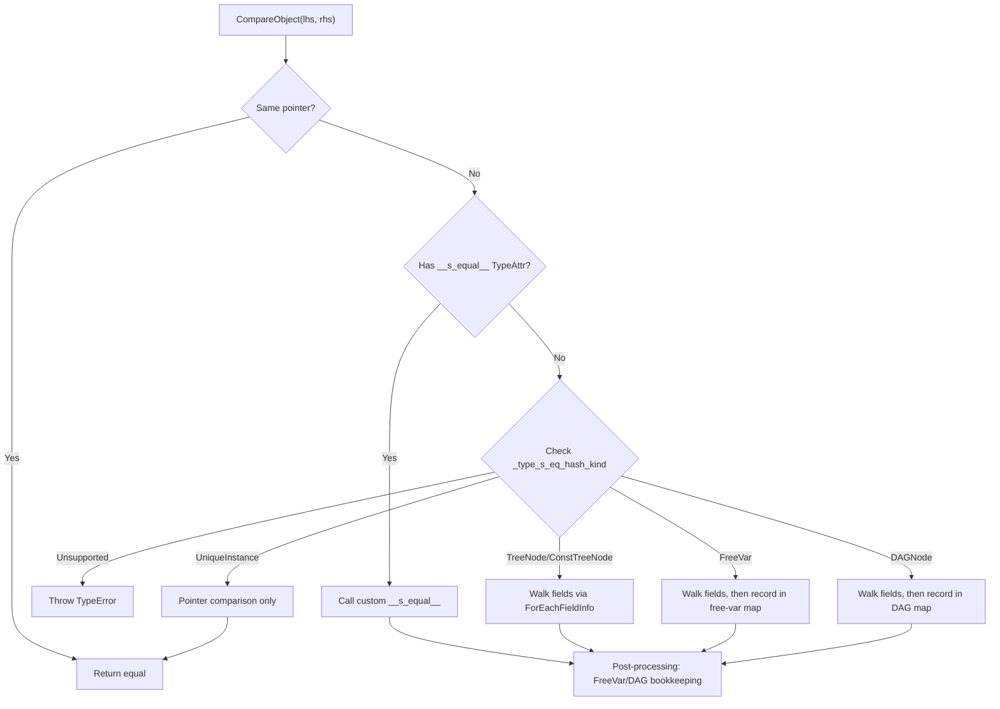

# Structural Equal/Hash System Design

**TL;DR**:
- Provides recursive structural comparison and hashing of `Any` values using the reflection field registry, supporting five semantic modes: tree, DAG, free-variable, constant-tree, and unique-instance.
- Types opt in via `_type_s_eq_hash_kind` static field and optionally provide custom `__s_equal__`/`__s_hash__` callbacks via `TypeAttrDef`.
- `AccessPath`/`AccessStep` provide structured first-mismatch diagnostics with field/index/key path reporting.

## Problem Statement
### Background
- IR compilers built on TVM FFI need to compare and hash complex AST trees structurally (not by pointer identity).
- The legacy approach used per-type virtual methods (`SEqualReduce`/`SHashReduce`) with compile-time boolean flags (`_type_has_method_sequal_reduce`/`_type_has_method_shash_reduce`), requiring every type to manually implement comparison logic.
- Reflection metadata already describes all object fields, types, and offsets -- structural comparison can be derived automatically.

### Solution
- Reflection-driven structural comparison: walk object fields via `ForEachFieldInfo`/`ForEachFieldInfoWithEarlyStop`, comparing/hashing each field recursively.
- Per-type semantic mode via `TVMFFISEqHashKind` enum stored in `TVMFFITypeMetadata`.
- Custom override via `__s_equal__`/`__s_hash__` TypeAttr callbacks that take priority when present.
- `AccessPath` diagnostics report the exact field path where two values diverge.

### Goals
- Automatic structural comparison for any type that registers reflection fields.
- Support for DAG deduplication, free-variable mapping, and constant-tree semantics.
- Structured mismatch diagnostics (not just true/false).
- Non-goals: comparison of non-reflectable types (types must register fields via `ObjectDef`).

## Design

### Dispatch Model



The dispatch is **presence-based for custom callbacks**: if a type's `__s_equal__` TypeAttrColumn entry is non-null, the custom function is called regardless of the `_type_s_eq_hash_kind` value. Otherwise, the enum kind determines the traversal strategy. The same pattern applies to `__s_hash__`.

### TVMFFISEqHashKind Enum

```c
enum TVMFFISEqHashKind : int32_t {
    kTVMFFISEqHashKindUnsupported  = 0,  // No structural comparison (default)
    kTVMFFISEqHashKindTreeNode     = 1,  // Pure tree: compare recursively, no dedup
    kTVMFFISEqHashKindFreeVar      = 2,  // Free variable: map lhs↔rhs positionally
    kTVMFFISEqHashKindDAGNode      = 3,  // DAG node: deduplicate via equality map
    kTVMFFISEqHashKindConstTreeNode = 4, // Constant tree: compared by content, not identity
    kTVMFFISEqHashKindUniqueInstance = 5, // Unique: pointer equality only
};
```

Stored per-type in `TVMFFITypeMetadata.structural_eq_hash_kind` (registered via `ObjectDef<T>` which reads `Class::_type_s_eq_hash_kind`).

### Field-Level Flags

Two `TVMFFIFieldFlagBitMask` bits control per-field behavior:

| Flag | Value | Effect |
|------|-------|--------|
| `kTVMFFIFieldFlagBitMaskSEqHashIgnore` | `1 << 3` | Skip this field during structural comparison/hashing |
| `kTVMFFIFieldFlagBitMaskSEqHashDef` | `1 << 4` | Entering a "definition region" where free variables can be mapped |

Applied via `AttachFieldFlag` trait during registration:
```cpp
refl::ObjectDef<TFuncObj>()
    .def_ro("params", &TFuncObj::params, refl::AttachFieldFlag::SEqHashDef())
    .def_ro("body", &TFuncObj::body)
    .def_ro("comment", &TFuncObj::comment, refl::AttachFieldFlag::SEqHashIgnore());
```

### AttachFieldFlag Trait

```cpp
class AttachFieldFlag : public FieldInfoTrait {
    explicit AttachFieldFlag(int64_t flag_mask);
    void Apply(TVMFFIFieldInfo* info) const;  // info->flags |= flag_mask_
    static AttachFieldFlag SEqHashDef();       // returns AttachFieldFlag(1 << 4)
    static AttachFieldFlag SEqHashIgnore();    // returns AttachFieldFlag(1 << 3)
};
```

Generalizes the `FieldInfoTrait` protocol beyond `DefaultValue` by OR-ing arbitrary bitmask flags onto `TVMFFIFieldInfo::flags`.

### Custom Structural Equal/Hash Protocol

Types register custom callbacks via `TypeAttrDef<T>`:

```cpp
refl::TypeAttrDef<MyObj>()
    .def("__s_equal__", &MyObj::SEqual)
    .def("__s_hash__", &MyObj::SHash);
```

**`__s_equal__` callback signature:**
```cpp
bool SEqual(const MyObj* other,
            TypedFunction<bool(AnyView lhs, AnyView rhs, bool def_region, AnyView field_name)> cmp) const;
```
- `cmp(lhs, rhs, true, "field")`: compare sub-values; `def_region=true` enables free-variable mapping for that comparison.

**`__s_hash__` callback signature:**
```cpp
uint64_t SHash(uint64_t init_hash,
               TypedFunction<uint64_t(AnyView val, uint64_t init_hash, bool def_region)> hash) const;
```
- Receives and returns a running hash accumulator. The callback internally calls `StableHashCombine(init_hash, HashAny(val))`.

### NaN Canonicalization

All NaN float values are treated as structurally equal:
- **Equality**: `CompareAny` checks `std::isnan(lhs) && std::isnan(rhs)` as equal.
- **Hashing**: `HashAny` canonicalizes NaN to `std::numeric_limits<double>::quiet_NaN()` before hashing.

This ensures that different NaN representations (signaling vs quiet, different payloads) produce the same hash and compare as equal.

### AccessPath Diagnostics

```cpp
enum class AccessKind : int32_t {
    kAttr             = 0,   // object field access (renamed from kObjectField in f4ede98)
    kArrayItem        = 1,
    kMapItem          = 2,
    kAttrMissing      = 3,   // field exists on one side but not the other (added in f4ede98)
    kArrayItemMissing = 4,
    kMapItemMissing   = 5,
};

class AccessStepObj : public Object {
    AccessKind kind;
    Any key;  // field name (String), array index (int64), or map key (Any)
    AccessStepObj() = default;  // enables auto-serialization
    bool StepEqual(const AccessStep& other) const;  // deep equality via AnyEqual on keys
    static constexpr const char* _type_key = "ffi.reflection.AccessStep";
};

class AccessStep : public ObjectRef {
    static AccessStep Attr(String field_name);            // was ObjectField()
    static AccessStep AttrMissing(String field_name);     // new in f4ede98
    static AccessStep ArrayItem(int64_t index);
    static AccessStep ArrayItemMissing(int64_t index);
    static AccessStep MapItem(Any key);
    static AccessStep MapItemMissing(Any key);
};
```

`AccessPath` is a parent-pointing tree object (refactored in f4ede98 from `Array<AccessStep>` type alias):

```cpp
class AccessPathObj : public Object {
    Optional<ObjectRef> parent;   // parent node (empty for root)
    Optional<AccessStep> step;    // current step (empty for root)
    int32_t depth;                // 0 for root

    Optional<AccessPath> GetParent() const;
    AccessPath Extend(AccessStep step) const;
    AccessPath Attr(String field_name) const;
    AccessPath AttrMissing(String field_name) const;
    AccessPath ArrayItem(int64_t index) const;
    AccessPath ArrayItemMissing(int64_t index) const;
    AccessPath MapItem(Any key) const;
    AccessPath MapItemMissing(Any key) const;
    Array<AccessStep> ToSteps() const;
    bool PathEqual(const AccessPath& other) const;
    bool IsPrefixOf(const AccessPath& other) const;

    static constexpr const char* _type_key = "ffi.reflection.AccessPath";
};

class AccessPath : public ObjectRef {
    static AccessPath Root();
    static AccessPath FromSteps(Array<AccessStep> steps);
    template <typename Iter>
    static AccessPath FromSteps(Iter begin, Iter end);
};

using AccessPathPair = Tuple<AccessPath, AccessPath>;
```

Multiple paths sharing a common prefix (e.g., `root.body[0]` and `root.body[1]`) share the same ancestor nodes in memory. `IsPrefixOf` walks the longer path down to the shorter path's depth before calling `PathEqual`. Both include fast-path pointer equality checks.

`StructuralEqual::GetFirstMismatch` returns `Optional<AccessPathPair>` -- `nullopt` if values are equal, otherwise a pair of paths (one for lhs, one for rhs) that trace the first divergence.

### Key Classes, Fields and Interfaces

| Symbol | Signature | Description |
|--------|-----------|-------------|
| `StructuralEqual` (class, `tvm::ffi`) | `static bool Equal(const Any& lhs, const Any& rhs, bool map_free_vars=false, bool skip_tensor_content=false)` | Top-level equality check (param renamed from `skip_ndarray_content` in 3a551d8) |
| `StructuralEqual::GetFirstMismatch` | `static Optional<AccessPathPair> GetFirstMismatch(const Any& lhs, const Any& rhs, bool map_free_vars=false, bool skip_tensor_content=false)` | Structured mismatch diagnostics |
| `StructuralEqual::operator()` | `bool operator()(const Any& lhs, const Any& rhs) const` | Convenience: `Equal(lhs, rhs, false, true)` |
| `StructuralHash` (class, `tvm::ffi`) | `static uint64_t Hash(const Any& value, bool map_free_vars=false, bool skip_tensor_content=false)` | Top-level structural hash (param renamed from `skip_ndarray_content` in 3a551d8) |
| `StructuralHash::operator()` | `uint64_t operator()(const Any& value) const` | Convenience: `Hash(value)` |
| `AttachFieldFlag` | `class : FieldInfoTrait`, `SEqHashDef()`, `SEqHashIgnore()` | Per-field flag attachment for eq/hash control |
| `AccessStep` | ObjectRef with `Attr(String)`, `AttrMissing(String)`, `ArrayItem(int64_t)`, `MapItem(Any)`, etc. | Single step in a mismatch path |
| `AccessPathObj` | Object with `Optional<ObjectRef> parent`, `Optional<AccessStep> step`, `int32_t depth` | Parent-pointing tree node for access paths |
| `AccessPath` | ObjectRef with `Root()`, `FromSteps(...)`, `->Extend(step)`, `->Attr(name)`, `->ToSteps()`, `->PathEqual(other)`, `->IsPrefixOf(other)` | Linked-list path from leaf to root; shared prefixes share memory |

### Contracts, Assumptions and Invariants
- **Missing metadata throws TypeError**: If a type declares `_type_s_eq_hash_kind != Unsupported` but has no reflection metadata registered, `CompareObject`/`HashObject` throw `TypeError` (not silent fallback to pointer comparison).
- **FreeVar/DAG post-processing is unconditional**: After content comparison (whether field-based or custom), the free-var map recording and DAG graph-counter logic runs regardless. Custom callbacks do not need to implement this bookkeeping.
- **`_type_s_eq_hash_kind` stored in TVMFFITypeMetadata**: The enum value is read from `Class::_type_s_eq_hash_kind` by `ObjectDef::RegisterExtraInfo` and stored in `TVMFFITypeMetadata.structural_eq_hash_kind`.
- **Custom callbacks take priority**: If `TypeAttrColumn["__s_equal__"][type_index]` is non-null, the custom function is called instead of reflection-based field walking, regardless of `_type_s_eq_hash_kind`.
- **`AccessStep`/`AccessPath` are header-only types; their reflection registration is in `reflection_extra.cc` gated by `TVM_FFI_USE_EXTRA_CXX_API`**: The types can be used in core code without the extra flag, but reflection-based operations (serialization, MakeObjectFromPackedArgs) require the extra API build (changed in f4ede98 -- previously `access_path.cc` was always compiled).

### Extension Points
- New `TVMFFISEqHashKind` values can be added to support additional comparison semantics (e.g., partial ordering).
- Custom `__s_equal__`/`__s_hash__` callbacks enable arbitrary comparison logic while reusing the framework's FreeVar/DAG bookkeeping.
- New field flag bits can be added via `AttachFieldFlag` for future per-field comparison control.

### Usage Examples

#### Defining a type with structural comparison via reflection
**Context**: A simple IR node that opts into tree-node comparison with a definition region and an ignored field.
```cpp
class TFuncObj : public Object {
 public:
  Array<TVar> params;
  Array<ObjectRef> body;
  String comment;

  static constexpr TVMFFISEqHashKind _type_s_eq_hash_kind = kTVMFFISEqHashKindTreeNode;
  static constexpr const char* _type_key = "ir.Func";
  TVM_FFI_DECLARE_FINAL_OBJECT_INFO(TFuncObj, Object);
};

TVM_FFI_STATIC_INIT_BLOCK() {
  namespace refl = tvm::ffi::reflection;
  refl::ObjectDef<TFuncObj>()
      .def_ro("params", &TFuncObj::params, refl::AttachFieldFlag::SEqHashDef())
      .def_ro("body", &TFuncObj::body)
      .def_ro("comment", &TFuncObj::comment, refl::AttachFieldFlag::SEqHashIgnore());
}

// Usage:
TFunc a(params_a, body_a, "comment1");
TFunc b(params_b, body_b, "comment2");
bool eq = StructuralEqual::Equal(a, b);  // ignores comment field
```

#### Custom structural equal/hash via TypeAttr callbacks
**Context**: A type needing non-standard comparison logic (e.g., only compare select fields, or transform values before comparing).
```cpp
class TCustomObj : public Object {
 public:
  Array<TVar> params;
  Array<ObjectRef> body;
  String comment;

  bool SEqual(const TCustomObj* other,
              TypedFunction<bool(AnyView, AnyView, bool, AnyView)> cmp) const {
    if (!cmp(params, other->params, true, "params")) return false;
    if (!cmp(body, other->body, false, "body")) return false;
    return true;
  }

  uint64_t SHash(uint64_t init_hash,
                 TypedFunction<uint64_t(AnyView, uint64_t, bool)> hash) const {
    uint64_t h = init_hash;
    h = hash(params, h, true);
    h = hash(body, h, false);
    return h;
  }

  static constexpr TVMFFISEqHashKind _type_s_eq_hash_kind = kTVMFFISEqHashKindTreeNode;
  static constexpr const char* _type_key = "test.Custom";
  TVM_FFI_DECLARE_FINAL_OBJECT_INFO(TCustomObj, Object);
};

TVM_FFI_STATIC_INIT_BLOCK() {
  namespace refl = tvm::ffi::reflection;
  refl::ObjectDef<TCustomObj>()
      .def_ro("params", &TCustomObj::params)
      .def_ro("body", &TCustomObj::body)
      .def_ro("comment", &TCustomObj::comment);
  refl::TypeAttrDef<TCustomObj>()
      .def("__s_equal__", &TCustomObj::SEqual)
      .def("__s_hash__", &TCustomObj::SHash);
}
```

#### Getting first mismatch path
**Context**: Debugging why two IR nodes differ structurally.
```cpp
Array<int> a = {1, 2, 3};
Array<int> b = {1, 9, 3};
auto mismatch = StructuralEqual::GetFirstMismatch(a, b);
// mismatch.has_value() == true
// mismatch->get<0>()->ToSteps() == [AccessStep::ArrayItem(1)]
// => divergence at array index 1: lhs=2, rhs=9
```

#### Building AccessPaths with the fluent API (since f4ede98)
**Context**: Constructing structured paths for diagnostic reporting.
```cpp
// Fluent builder pattern
AccessPath path = AccessPath::Root()->Attr("body")->ArrayItem(1)->MapItem("key");
assert(path->depth == 3);

// Shared prefix optimization: both paths share root->Attr("body") in memory
AccessPath base = AccessPath::Root()->Attr("body");
AccessPath child1 = base->ArrayItem(0);
AccessPath child2 = base->ArrayItem(1);

// Prefix checking
assert(base->IsPrefixOf(child1));
assert(!child1->IsPrefixOf(base));
```

### Evolution Timeline
| Version | Commit | Change | Motivation |
|---------|--------|--------|------------|
| v1 | 9445fe7 | Initial reflection-based structural equal/hash; `TVMFFISEqHashKind` (0-5); `AccessPath`; `AttachFieldFlag`; `TVM_FFI_EXTRA_CXX_API` macro | Automatic structural comparison from reflection metadata |
| v2 | 2ec11f5 | Add `kTVMFFISEqHashKindCustomTreeNode = 6`; `__s_equal__`/`__s_hash__` via TypeAttr; `TVM_FFI_USE_EXTRA_CXX_API` build flag | Enable custom comparison logic |
| v3 | 59a837e | Remove `kTVMFFISEqHashKindCustomTreeNode`; presence-based custom dispatch; NaN canonicalization; `__s_hash__` accumulator signature; TypeError on missing metadata | Simplify dispatch; fix NaN; harden error handling |
| v4 | e52aed5 | Remove `_type_has_method_sequal_reduce`/`_type_has_method_shash_reduce` from Object | Complete migration from legacy boolean flags |
| v5 | 3fc0391 | Move to `tvm::ffi` namespace; relocate to `extra/` directory; rename `AccessKind` values (`kArrayIndex`->`kArrayItem`, `kMapKey`->`kMapItem`) | API isolation and naming cleanup |
| v6 | f4ede98 | Refactor `AccessPath` from `Array<AccessStep>` type alias to parent-pointing tree object (`AccessPathObj`/`AccessPath`); rename `kObjectField`->`kAttr`; add `kAttrMissing`; fluent builder API; move registration to `reflection_extra.cc` under extra flag | Compact multi-path representation with shared prefixes; consistent naming |

## Alternatives & Trade-offs
### Per-type virtual method (`SEqualReduce`/`SHashReduce`)
- Pros: Full control per type; no reflection dependency
- Cons: Every type must manually implement; error-prone; no automatic field coverage; cannot share FreeVar/DAG bookkeeping across custom and default paths
### Visitor-based approach (`VisitAttrs` + comparison)
- Pros: Single visitor method handles both reflection and comparison
- Cons: Couples field iteration with comparison semantics; already removed (`VisitAttrs` phased out in da47623); cannot distinguish comparison semantics (ignore, def-region) from general reflection
### Dedicated enum kind for custom dispatch (`kTVMFFISEqHashKindCustomTreeNode`)
- Pros: Explicit declaration of custom behavior
- Cons: Inflexible -- a type cannot have both reflection fields and custom callbacks; removed in v3 in favor of presence-based dispatch

## Related Work
### Design Docs & ADRs
- `.knowledge/designs/reflection.md` -- TypeAttr system (`TypeAttrDef`, `TypeAttrColumn`) used for custom callback registration; `AttachFieldFlag` as `FieldInfoTrait` extension
- `.knowledge/designs/c-abi.md` -- `TVMFFISEqHashKind` enum; `TVMFFITypeMetadata` struct; field flag bits
- `.knowledge/designs/any-system.md` -- NaN canonicalization in `AnyHash`/`AnyEqual`
- `.knowledge/ADRs/009-reflection-structural-eq-hash.md` -- Decision to use reflection-based approach

### Evidence Matrix
- Reflection-based structural eq/hash -> `2025-07-19-9445fe7.md` + commit 9445fe7
- Custom __s_equal__/__s_hash__ via TypeAttr -> `2025-07-26-2ec11f5.md` + commit 2ec11f5
- Presence-based dispatch, NaN, accumulator -> `2025-07-28-59a837e.md` + commit 59a837e
- Legacy flag removal -> `2025-07-29-e52aed5.md` + commit e52aed5
- Extra API isolation, namespace move -> `2025-07-30-3fc0391.md` + commit 3fc0391
- AccessPath parent-pointing tree refactor -> `2025-08-06-f4ede982f002.md` + commit f4ede98
