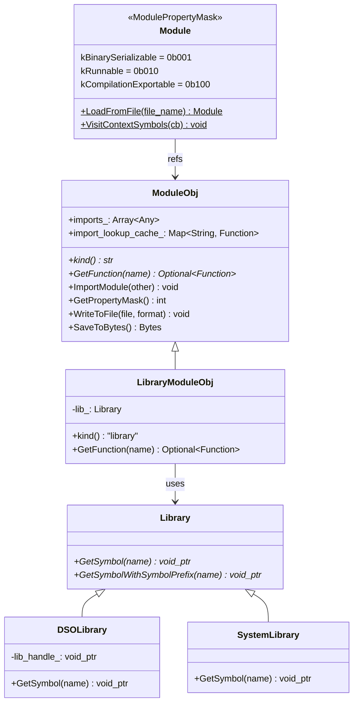
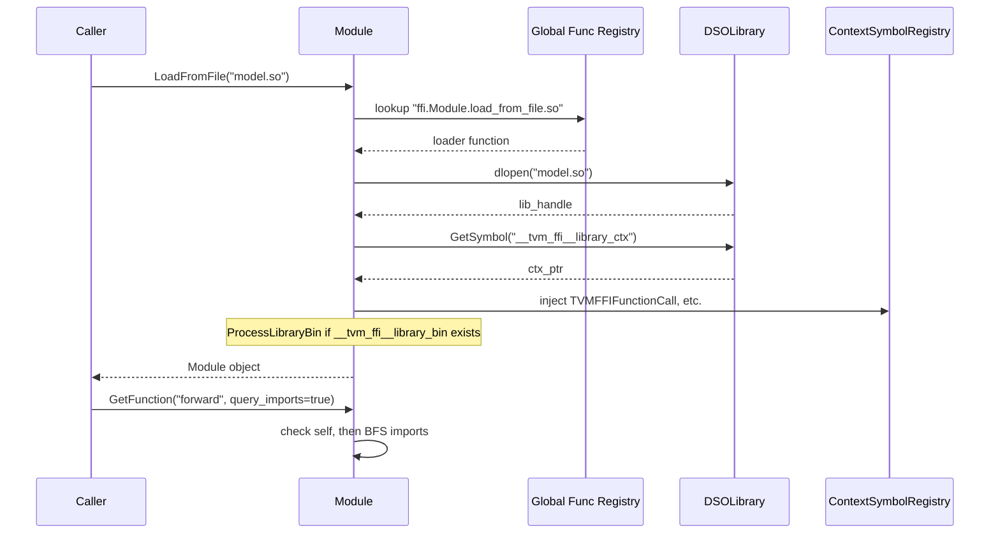
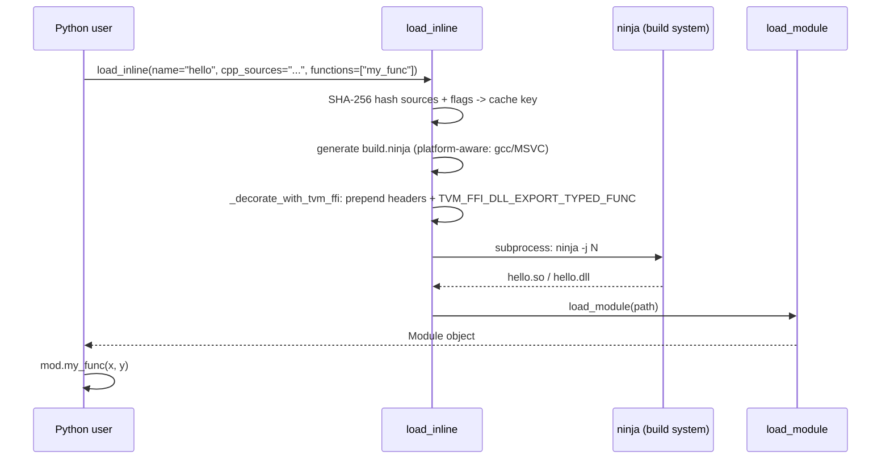

# Module System: Loadable Function Containers

**TL;DR**
- `ModuleObj`/`Module` is a first-class static Object type (`kTVMFFIModule = 73`) that formalizes the concept of a loadable container of `ffi::Function` values with import graph semantics (DAG invariant, BFS cycle detection).
- Three concrete implementations exist: `LibraryModuleObj` (wraps a `Library` symbol provider), `DSOLibrary` (dynamic shared objects via `dlopen`/`LoadLibraryW`), and `SystemLibrary` (static symbol table for embedded/AOT scenarios).
- C ABI entry points (`TVMFFIEnvModLookupFromImports`, `TVMFFIEnvModRegisterContextSymbol`, `TVMFFIEnvModRegisterSystemLibSymbol`) enable compiled/generated code to interact with the module's import tree and symbol injection mechanisms.

## Problem Statement

### Background
- Compiled ML kernels are packaged as shared libraries (`.so`/`.dll`) containing device code. The runtime needs a uniform abstraction to load these libraries, resolve their exported functions, and manage dependencies between modules.
- Generated code within loaded libraries needs to call back into the host runtime to resolve imported functions, without explicit link-time dependency on the runtime.
- AOT (ahead-of-time) compiled scenarios register symbols at static initialization time rather than loading from dynamic libraries, requiring a different symbol resolution path.

### Solution
- Define `ModuleObj` as a static object type with a fixed type index (`73`), making it a first-class FFI citizen alongside `String`, `Function`, `Array`, and `Map`.
- Provide a `Library` abstract base class as the internal symbol provider interface, with `DSOLibrary` and `SystemLibrary` as concrete implementations.
- Use a loading pipeline: `Module::LoadFromFile` dispatches by file extension to format-specific loaders registered as global functions (e.g., `ffi.Module.load_from_file.so`).
- Enable context symbol injection via `ContextSymbolRegistry` so the host runtime can inject callbacks (e.g., `TVMFFIFunctionCall`) into loaded libraries without explicit linkage.

### Goals
- Cross-platform dynamic library loading (Linux, macOS, Windows).
- DAG-structured import graph with cycle detection.
- Cached function lookups from imports (mutex-protected).
- Non-goal (relaxed): JIT compilation via `load_inline` is now supported as an optional pipeline that produces Modules, but the Module abstraction itself still wraps pre-compiled code.
- [ADR 0010](../ADRs/0010-ffi-symbol-prefix-convention.md) -- Decision to mandate `__tvm_ffi_` prefix for DSO symbols

## Design





### Key Classes, Fields and Interfaces

```python
class ModuleObj(Object):
    """A loadable container of ffi::Functions with import graph support."""
    imports_: Array[Any]                       # Child modules (uses Any to avoid circular dep)
    import_lookup_cache_: Map[String, Function] # Cached lookups (mutex-protected, lazy)
    # Invariant: imports_ forms a DAG (cyclic import raises RuntimeError via BFS detection)
    # Invariant: import_lookup_cache_ populated lazily, protected by std::mutex

    def kind(self) -> str: ...         # Virtual, returns module type string (e.g., "library")
        # Interacts with: Serialization dispatch (kind -> loader key)
        # Extension: override in subclass

    def GetPropertyMask(self) -> int: ...
        # Returns bitmask of ModulePropertyMask flags
        # Extension: override to declare capabilities

    def GetFunction(self, name: str) -> Optional[Function]: ...
        # Pure virtual: resolve a function by name from this module's own exports
        # Interacts with: Library.GetSymbol (for LibraryModuleObj)
        # Extension: override for custom resolution

    def GetFunction(self, name: str, query_imports: bool) -> Optional[Function]: ...
        # Overload: if query_imports=True, searches self then BFS over imports_
        # Interacts with: InternalUnsafe.GetFunctionFromImports (mutex-protected, cached)

    def GetFunctionMetadata(self, name: str) -> Optional[String]: ...
        # Virtual: return JSON metadata for a named function
        # Default: returns None (nullopt)
        # Extension: override in subclass to provide function-level metadata
        # Interacts with: GetFunction (parallel lookup pattern)

    def GetFunctionMetadata(self, name: str, query_imports: bool) -> Optional[String]: ...
        # Overload: if query_imports=True, traverses self then imports_ (same pattern as GetFunction)
        # Interacts with: imports_ (child modules)

    def GetFunctionDoc(self, name: str) -> Optional[String]: ...
        # Virtual: return docstring for a named function. Default: None (935a5a0)
        # Interacts with: GetFunctionMetadata (parallel API -- doc is unstructured, metadata is structured)
        # Extension: override in subclass to provide function-level docstrings

    def GetFunctionDoc(self, name: str, query_imports: bool) -> Optional[String]: ...
        # Overload: searches self then imports_ if query_imports=True (935a5a0)
        # Interacts with: imports_ (child modules), same traversal pattern as GetFunctionMetadata

    # Registered FFI method:
    # "ffi.ModuleGetFunctionDoc" -> lambda mod, name, query_imports: mod.GetFunctionDoc(name, query_imports)

    def ImportModule(self, other: Module) -> None: ...
        # Invariant: performs BFS cycle detection before adding
        # Failure mode: RuntimeError("Cyclic dependency detected") if cycle found

    def WriteToFile(self, file_name: str, format: str) -> None: ...
        # Default: RuntimeError. Extension: override for kCompilationExportable modules

    def SaveToBytes(self) -> Bytes: ...
        # Default: RuntimeError. Extension: override for kBinarySerializable modules

    _type_index: int = 73  # kTVMFFIModule (static, fixed)
    _type_key: str = "ffi.Module"
    _type_final: bool = True
    # Interacts with: StaticTypeKey.kTVMFFIModule, TypeIndex enum

class Module(ObjectRef):
    """Handle for ModuleObj. Non-nullable, mutable."""

    class ModulePropertyMask(IntEnum):
        kBinarySerializable = 0b001      # Implements SaveToBytes
        kRunnable = 0b010                # GetFunction returns callable Functions
        kCompilationExportable = 0b100   # Implements WriteToFile
        # Extension: new bits can be added (int storage)

    @staticmethod
    def LoadFromFile(file_name: str) -> Module: ...
        # 1. Extract format from file extension
        # 2. Normalize: dll/dylib/dso -> "so"
        # 3. Lookup "ffi.Module.load_from_file.<format>" in global registry
        # 4. Call loader function
        # Interacts with: Function::GetGlobal, DSOLibrary
        # Failure mode: RuntimeError if no loader registered for format

    @staticmethod
    def VisitContextSymbols(callback: Callable[[str, void_ptr], None]) -> None: ...
        # Iterates all registered context symbols
        # Interacts with: ContextSymbolRegistry singleton

class LibraryModuleObj(ModuleObj):
    """Concrete module wrapping a Library with metadata/docstring symbol resolution (ac7bf68)."""
    lib_: Library

    def GetFunctionMetadata(self, name: str) -> Optional[String]:
        """Look up __tvm_ffi__metadata_<name> in loaded library, invoke as SafeCallType."""
        # Interacts with: Library.GetSymbol, Function.InvokeExternC, symbol::tvm_ffi_metadata_prefix
        # Returns: JSON string with type_schema, or None
        ...

    def GetFunctionDoc(self, name: str) -> Optional[String]:
        """Look up __tvm_ffi__doc_<name> in loaded library, invoke as SafeCallType."""
        # Interacts with: Library.GetSymbol, Function.InvokeExternC, symbol::tvm_ffi_doc_prefix
        # Returns: docstring, or None
        ...

class Library(Object):
    """Internal abstract interface for symbol providers."""
    def GetSymbol(self, name: String) -> void_ptr: ...
        # Parameter type widened from const char* to const String& (40e8a51)
        # Interacts with: LibraryModuleObj, DSOLibrary, SystemLibrary
        # Extension: subclass for new library types (e.g., WASM, remote)

    def GetSymbolWithSymbolPrefix(self, name: String) -> void_ptr: ...
        # NEW (40e8a51): prepends symbol::tvm_ffi_symbol_prefix ("__tvm_ffi_") + name
        # Delegates to GetSymbol for actual resolution
        # Interacts with: LibraryModuleObj.GetFunction (calls this instead of GetSymbol)
        # Extension: SystemLibrary overrides to compose system_prefix + ffi_prefix + name
        # Invariant: returns mangled symbol for logical function name

class DSOLibrary(Library):
    """Dynamic shared object loader. Uses dlopen (POSIX) / LoadLibraryW (Windows)."""
    lib_handle_: void_ptr
    # Invariant: dlclose/FreeLibrary called on destruction
    # Extension: platform-specific symbol resolution

class SystemLibrary(Library):
    """Static symbol table for embedded/AOT scenarios."""
    symbol_prefix_: str  # e.g., "" or "mylib_"
    # Invariant: symbols registered at static init via TVMFFIEnvModRegisterSystemLibSymbol
    # Interacts with: SystemLibSymbolRegistry (global)
    # GetSymbol: tries symbol_prefix_ + name first, falls back to bare name (315f4bb)
    # GetSymbolWithSymbolPrefix: tries "__tvm_ffi_" + symbol_prefix_ + name first,
    #   falls back to "__tvm_ffi_" + name if not found (315f4bb)
    # Invariant: lookup succeeds regardless of whether name is pre-prefixed or not

# Symbol naming conventions for library modules (updated in 40e8a51):
#
# namespace tvm::ffi::symbol constants:
# tvm_ffi_symbol_prefix = "__tvm_ffi_"       -- canonical prefix for all FFI function symbols
# tvm_ffi_main = "__tvm_ffi_main"            -- default entry function (was __tvm_ffi_main__)
# tvm_ffi_library_ctx = "__tvm_ffi__library_ctx"   -- context pointer (double underscore = internal)
# tvm_ffi_library_bin = "__tvm_ffi__library_bin"   -- embedded binary data (double underscore = internal)
# tvm_ffi_metadata_prefix = "__tvm_ffi__metadata_" -- metadata prefix (double underscore = internal)
# tvm_ffi_doc_prefix = "__tvm_ffi__doc_"             -- docstring prefix (double underscore = internal, ac7bf68)
#
# Two-tier naming convention:
#   User FFI functions:  __tvm_ffi_<name>   (single underscore separator after "tvm_ffi")
#   Internal symbols:    __tvm_ffi__<name>  (double underscore separator -- avoids user collision)
#
# TVM_FFI_DLL_EXPORT_TYPED_FUNC(ExportName, Function) emits:
#   extern "C" int __tvm_ffi_ExportName(void* self, TVMFFIAny* args, int32_t num_args, TVMFFIAny* result)
#   -- symbol name is now tvm_ffi_symbol_prefix + ExportName (was just ExportName before 40e8a51)
#   When TVM_FFI_DLL_EXPORT_INCLUDE_METADATA == 1, also emits __tvm_ffi__metadata_<ExportName> (ac7bf68)
#   TVM_FFI_DLL_EXPORT_TYPED_FUNC_DOC(ExportName, DocString) emits __tvm_ffi__doc_<ExportName> (ac7bf68)
#
# Interacts with: Library.GetSymbolWithSymbolPrefix (lookup side prepends prefix)
# Interacts with: ModuleObj.GetFunctionMetadata (looks up metadata symbols)

# C ABI entry points (c_env_api.h):
def TVMFFIEnvModLookupFromImports(library_ctx: TVMFFIObjectHandle,
                                   func_name: const_char_ptr,
                                   out: Ref[TVMFFIObjectHandle]) -> int: ...
    # Interacts with: ModuleObj.InternalUnsafe.GetFunctionFromImports
    # Invariant: returned function is a weak reference cached by the module
    # Extension: called from generated code to resolve imported functions

def TVMFFIEnvModRegisterContextSymbol(name: const_char_ptr, symbol: void_ptr) -> int: ...
    # Register a host-side symbol for injection into loaded libraries
    # Interacts with: ContextSymbolRegistry

def TVMFFIEnvModRegisterSystemLibSymbol(name: const_char_ptr, ptr: void_ptr) -> int: ...
    # Register a symbol in the system library table (AOT/embedded)
    # Interacts with: SystemLibSymbolRegistry

# === ModuleGlobals singleton (8dcaec1f) ===

class ModuleGlobals:
    """Process-global registry that pins loaded modules to prevent dlclose.
    Thread-safe via std::mutex. Meyers singleton (static local in Get())."""
    _storage: Map[Module, int]  # key is module ref, value is unused sentinel
    # Invariant: once added, module refcount never drops to zero -> dlclose never runs
    # Invariant: thread-safe via std::scoped_lock on every Add/Remove
    # Interacts with: load_module (Python), cpp.load_inline, cpp.load

    def Add(self, m: Module) -> None: ...
        # Idempotent -- re-adding overwrites sentinel
    def Remove(self, m: Module) -> None: ...
        # Drops the strong ref, allowing dlclose if no other refs exist

# FFI-registered methods:
# "ffi.ModuleGlobalsAdd" -> ModuleGlobals.Get()->Add(mod)
# "ffi.ModuleGlobalsRemove" -> ModuleGlobals.Get()->Remove(mod)

# Updated Python API signatures (8dcaec1f):
def load_module(path: str, keep_module_alive: bool = True) -> Module: ...
    # When keep_module_alive=True (default), pins module in ModuleGlobals after loading
    # Interacts with: _ffi_api.ModuleLoadFromFile, _ffi_api.ModuleGlobalsAdd

def load_inline(..., keep_module_alive: bool = True) -> Module: ...
def load(..., keep_module_alive: bool = True) -> Module: ...
    # Both pass keep_module_alive through to load_module
```

### Contracts, Assumptions and Invariants
- **DAG invariant**: The import graph must be a DAG. `ImportModule` performs BFS cycle detection before adding a new import. Violation raises `RuntimeError`.
- **Cached lookups**: `GetFunctionFromImports` is protected by a `std::mutex` and caches results in `import_lookup_cache_`. Once resolved, subsequent lookups for the same name skip the BFS traversal.
- **Context symbol injection**: When `DSOLibrary` loads a `.so`, it looks up `__tvm_ffi_library_ctx` in the loaded library. If found, it writes a `ModuleObj*` context pointer there, enabling the loaded code to call `TVMFFIEnvModLookupFromImports` to resolve imports at runtime.
- **Format normalization**: `LoadFromFile` normalizes file extensions: `.dll`, `.dylib`, `.dso` all map to the `"so"` loader. This simplifies cross-platform usage.
- **Failure mode -- missing loader**: If no global function `ffi.Module.load_from_file.<format>` is registered, `LoadFromFile` throws `RuntimeError`.
- **Failure mode -- missing symbol**: `DSOLibrary::GetSymbol` returns `nullptr` for symbols not found, propagated as `Optional<Function>()` by `LibraryModuleObj::GetFunction`.
- **Static type index**: Module uses `kTVMFFIModule = 73` in the static object range `[64, 75)`. This ensures stable cross-DLL identity and avoids dynamic type index allocation.
- **Module must outlive returned objects** (a97b7c6): When a loaded DSO module returns an object (e.g., a Tensor), the object's deleter address resides in the library's code segment. If `dlclose` runs before the deleter, the deleter call jumps to an invalid address (use-after-unload). **This invariant is now enforced automatically by default** via `ModuleGlobals` (8dcaec1f): `load_module(..., keep_module_alive=True)` pins the module in a process-global singleton so `dlclose` never runs. Users who pass `keep_module_alive=False` must still manually scope object lifetimes.
- **Metadata/doc string allocation in libtvm_ffi** (dcacb98d): `TVM_FFI_DLL_EXPORT_TYPED_FUNC` and `_DOC` macros allocate returned metadata/doc String objects via `TVMFFIStringFromByteArray` (a C ABI function in libtvm_ffi), not in the DSO's code space. This ensures the strings survive `dlclose` of the exporting DSO.

### Extension Points
- **New module types**: Subclass `ModuleObj`, override `kind()`, `GetFunction()`, and optionally `WriteToFile()`/`SaveToBytes()`.
- **New library types**: Subclass `Library`, override `GetSymbol()` for new loading mechanisms (e.g., WASM, network-loaded code).
- **New file format loaders**: Register `ffi.Module.load_from_file.<format>` as a global function.
- **Binary serialization**: For `kBinarySerializable` modules, register `ffi.Module.load_from_bytes.<kind>` for deserialization.

### Usage Examples

#### Loading and using a compiled module
**Context**: Loading a shared library containing compiled ML kernels and calling a function from it.

```cpp
#include <tvm/ffi/extra/module.h>
using namespace tvm::ffi;

// Load a compiled module from a shared library
Module mod = Module::LoadFromFile("my_model.so");

// Get a function from the module
Optional<Function> func = mod->GetFunction("forward");
if (func.defined()) {
    Any result;
    (*func)(input_tensor, &result);
}

// Import another module (creates import dependency)
Module aux = Module::LoadFromFile("aux_kernels.so");
mod->ImportModule(aux);
// Functions in aux_kernels now resolvable via query_imports=true
Optional<Function> helper = mod->GetFunction("helper_op", /*query_imports=*/true);
```

#### Generated code resolving imports via C ABI
**Context**: Code generated by a compiler uses the C ABI to look up functions from the module's import tree at runtime.

```c
#include <tvm/ffi/extra/c_env_api.h>

// Inside generated code -- resolve an imported function
TVMFFIObjectHandle func = NULL;
int ret = TVMFFIEnvModLookupFromImports(
    __tvm_ffi_library_ctx,  // context pointer injected by the loader
    "my.imported.func",
    &func);
if (ret == 0 && func != NULL) {
    // Call the resolved function via TVMFFIFunctionCall
}
```

### Inline Module Compilation (`load_inline`)

The `tvm_ffi.cpp.build_inline()` and `tvm_ffi.cpp.load_inline()` APIs provide JIT compilation of inline C++/CUDA source into TVM FFI modules, analogous to PyTorch's `torch.utils.cpp_extension.load_inline` but targeting the TVM FFI ABI. `build_inline` (added in `4fcf94f`) compiles to a shared library path without loading; `load_inline` is now a thin wrapper: `load_module(build_inline(...))`. Initial implementation in `83805ec`, refined in `825aeb9`, cross-platform support in `2df07e5` (Windows) and `4ffbc88` (macOS).

```python
def build_inline(
    name: str,
    *,
    cpp_sources: Sequence[str] | str | None = None,
    cuda_sources: Sequence[str] | str | None = None,
    functions: Mapping[str, str] | Sequence[str] | str | None = None,
    extra_cflags: Sequence[str] | None = None,
    extra_cuda_cflags: Sequence[str] | None = None,
    extra_ldflags: Sequence[str] | None = None,
    extra_include_paths: Sequence[str] | None = None,
    build_directory: str | None = None,
    embed_cubin: Mapping[str, bytes] | None = None,  # NEW (d49effd)
) -> str:
    """Compile C++/CUDA source into a shared library, return its path without loading (4fcf94f).
    Pipeline: hash sources -> create build dir -> generate build.ninja -> ninja build -> return path.
    When embed_cubin is provided, uses 3-step ninja pipeline: merge objects -> embed CUBIN -> link (d49effd)."""
    # Interacts with: _decorate_with_tvm_ffi (source decoration), _generate_ninja_build,
    #   _build_ninja (subprocess invocation), _maybe_write (cache-aware file writes)
    # Interacts with: tvm_ffi.utils.embed_cubin (invoked by ninja embed_cubin rule when embed_cubin given)
    # Invariant: at least one of cpp_sources or cuda_sources must be non-empty
    # Invariant: returns absolute path to compiled .so/.dll
    # Invariant: Windows not supported for embed_cubin
    # Extension: callers can post-process the .so before loading (inspect symbols, copy, etc.)

def load_inline(
    name: str,
    *,
    cpp_sources: Sequence[str] | str | None = None,
    cuda_sources: Sequence[str] | str | None = None,
    functions: Sequence[str] | Mapping[str, str] | str | None = None,
    extra_cflags: Sequence[str] | None = None,
    extra_cuda_cflags: Sequence[str] | None = None,
    extra_ldflags: Sequence[str] | None = None,
    extra_include_paths: Sequence[str] | None = None,
    build_directory: Optional[str] = None,
    embed_cubin: Mapping[str, bytes] | None = None,  # NEW (d49effd)
) -> Module:
    """Compile and load C++/CUDA source -- thin wrapper around build_inline + load_module (4fcf94f).
    Pipeline: build_inline(...) -> load_module(path)."""
    # Interacts with: load_module (Module::LoadFromFile -> DSOLibrary)
    # Interacts with: TVM_FFI_DLL_EXPORT_TYPED_FUNC macro (decorates exported functions)
    # Interacts with: find_include_path, find_dlpack_include_path, find_libtvm_ffi (libinfo.py)
    # Interacts with: FileLock (serializes concurrent builds)
    # Invariant: at least one of cpp_sources or cuda_sources must be non-empty
    # Invariant: when build_directory is set, source hashing is skipped (no cache dedup)
    # Invariant: when cpp_sources is empty, TVM_FFI_DLL_EXPORT_TYPED_FUNC macros are
    #   routed to cuda_source instead of cpp_source (1ce0f6f)
    # Extension: add new source languages by extending _generate_ninja_build
```



Cross-platform considerations:
- **Linux**: Uses `c++` compiler, `-shared -fPIC`, `-L<path> -ltvm_ffi` ldflags
- **macOS**: Same as Linux but also links `-ltvm_ffi` (fixed in `4ffbc88`)
- **Windows**: Uses `cl` (MSVC), `/MD /EHsc /std:c++17`, `/DLL /LIBPATH:`, escapes drive letters for ninja (`C:` -> `C$:`). Ninja build step is wrapped in `_run_command_in_dev_prompt()` which discovers VS installation via `vswhere.exe` and runs inside `VsDevCmd.bat -arch=x64` environment (4383b1a)

### File-Based Module Compilation (`build`/`load`, c897e4c)

File-path-based counterparts to `build_inline`/`load_inline` that accept paths to `.cc`/`.cu` files instead of raw source strings. Interface modeled after `torch.utils.cpp_extension.load`. Source files contain their own `#include` directives and `TVM_FFI_DLL_EXPORT_TYPED_FUNC` invocations -- no automatic header prepending or function decoration occurs.

```python
def build(
    name: str,
    *,
    cpp_files: Sequence[str] | str | None = None,
    cuda_files: Sequence[str] | str | None = None,
    extra_cflags: Sequence[str] | None = None,
    extra_cuda_cflags: Sequence[str] | None = None,
    extra_ldflags: Sequence[str] | None = None,
    extra_include_paths: Sequence[str] | None = None,
    build_directory: str | None = None,
) -> str:
    """Compile C++/CUDA files into a shared library, return its path."""
    # Interacts with: _build_impl (shared implementation), _hash_sources, _generate_ninja_build
    # Interacts with: FileLock (serializes concurrent builds to same cache dir)
    # Invariant: at least one of cpp_files or cuda_files must be non-empty
    # Invariant: file paths resolved to absolute via Path.resolve() before hashing
    # Extension: callers post-process the .so before loading (inspect symbols, copy, etc.)

def load(
    name: str,
    *,
    cpp_files: Sequence[str] | str | None = None,
    cuda_files: Sequence[str] | str | None = None,
    extra_cflags: Sequence[str] | None = None,
    extra_cuda_cflags: Sequence[str] | None = None,
    extra_ldflags: Sequence[str] | None = None,
    extra_include_paths: Sequence[str] | None = None,
    build_directory: str | None = None,
) -> Module:
    """Compile C++/CUDA files and load as a tvm_ffi Module. Thin wrapper: load_module(build(...))."""
    # Interacts with: build() (compilation), load_module (Module::LoadFromFile -> DSOLibrary)
```

Key difference from inline: `_build_impl` is shared between file-based and inline paths. Inline path calls `_build_impl(need_lock=False)` since it holds its own outer lock. `_generate_ninja_build` produces per-file object targets (`cpp_0.o`, `cpp_1.o`, ...) instead of fixed `main.o`/`cuda.o`.

#### File-based build usage example

```python
import tvm_ffi.cpp

# Build a C++ file that uses TVM_FFI_DLL_EXPORT_TYPED_FUNC manually
output_lib_path = tvm_ffi.cpp.build(name="hello", cpp_files=["my_module.cc"])
mod = tvm_ffi.load_module(output_lib_path)
mod.add_one_cpu(x, y)

# Or the convenience wrapper:
mod = tvm_ffi.cpp.load(name="hello", cpp_files=["my_module.cc"])
```

#### Inline compilation usage example
**Context**: JIT-compiling a C++ function and calling it through the Module.

```python
import tvm_ffi.cpp

mod = tvm_ffi.cpp.load_inline(
    name="hello",
    cpp_sources=r"""
        void add_one_cpu(ffi::TensorView x, ffi::TensorView y) {
          for (int i = 0; i < x->shape[0]; ++i)
            static_cast<float*>(y->data)[i] = static_cast<float*>(x->data)[i] + 1;
        }
    """,
    functions=["add_one_cpu"],
)
mod.add_one_cpu(x, y)  # calls __tvm_ffi_add_one_cpu via DSOLibrary symbol lookup
```

## Alternatives & Trade-offs

### Dynamic type index for Module
- Pros: No need to reserve a static slot; more flexible
- Cons: Module needs stable cross-DLL identity for library loading and import resolution. A dynamic index would vary between compilation units, breaking the C ABI convention where `kTVMFFIModule = 73` is a hard-coded constant in generated code.

### Flat import list instead of DAG
- Pros: Simpler implementation, no cycle detection needed
- Cons: Cannot express hierarchical module dependencies (e.g., model imports runtime imports device-specific kernels). The DAG structure mirrors real compilation pipelines.

## Related Work
### Design Docs & ADRs
- [0001-c-abi.md](../designs/0001-c-abi.md) -- TVMFFIEnvMod* C API entry points, kTVMFFIModule type index
- [0002-object-system.md](../designs/0002-object-system.md) -- Static object type registration (TVM_FFI_DECLARE_OBJECT_INFO_STATIC)
- [0004-function-system.md](../designs/0004-function-system.md) -- Function wrapping for loaded symbols, global function registry
- [0008-reflection.md](../designs/0008-reflection.md) -- ObjectDef<ModuleObj> registers imports field
- [0012-python-bindings.md](../designs/0012-python-bindings.md) -- Python Module wrapper class
- [0013-packaging.md](../designs/0013-packaging.md) -- Extension packaging pattern using Module
- [ADR 0007](../ADRs/0007-module-as-static-object.md) -- Decision to use static type index for Module
- [ADR 0010](../ADRs/0010-ffi-symbol-prefix-convention.md) -- Decision to mandate `__tvm_ffi_` prefix for DSO symbols

### Evidence Matrix
- Module system initial implementation -> `commits/2025-08-17-538bef49b4daa91970f0f9cea137acdcb696562a.md` (538bef4)
- Env API relocation/rename (TVMFFIEnvMod* prefix) -> `commits/2025-08-20-023ea448be6e86e09f4ebaba5a235ee53f3cdeef.md` (023ea44)
- Stream context in c_env_api.h -> `commits/2025-08-19-0daaffedd23982ea09f8c38fec4eef1cca1d8cac.md` (0daaffed)
- GetFunctionMetadata, tvm_ffi_metadata_prefix, type index reordering -> `commits/2025-08-30-777cf8d51f2054d96e0413b7406ed38ef43a7b39.md` (777cf8d)
- Python Module class, load_module, system_lib -> `commits/2025-08-24-2d41a5115f6a91e2781012a3379f9626bc9e18a1.md` (2d41a51)
- `__tvm_ffi_` symbol prefix, `GetSymbolWithSymbolPrefix`, two-tier naming -> `commits/2025-09-06-40e8a519f5270dfb18436b2f26c2d691cf24c9c1.md` (40e8a51)
- `load_inline` initial implementation -> `commits/2025-09-05-83805ec949227620d05e61358a4ecb4f0c931979.md` (83805ec)
- `load_inline` API alignment with torch -> `commits/2025-09-06-825aeb9aff00911cc8500aeec9ebb3ade738b015.md` (825aeb9)
- `load_inline` Windows support -> `commits/2025-09-08-2df07e52ef8c8008be4ffa3a29e3f541ca98c1c2.md` (2df07e5)
- `load_inline` macOS support -> `commits/2025-09-08-4ffbc88b60f659a74619035e699986792c071e8d.md` (4ffbc88)
- SystemLibrary prefix-agnostic fallback lookup -> `commits/2025-09-10-315f4bb00eac8b4d26cdcd6839fb1a077bab6976.md` (315f4bb)
- load_inline CUDA-only function export routing fix -> `commits/2025-09-12-1ce0f6fa8f7ed99e2972daaf9b69598c630f4244.md` (1ce0f6f)
- Windows load_inline MSVC VsDevCmd.bat discovery -> `commits/2025-09-14-4383b1a6d81f5403879e9266f3d0924a289c227a.md` (4383b1a)
- build_inline compile-only API -> `commits/2025-09-29-4fcf94f6e2dcce9901e0e42c30c7d4d57487619d.md` (4fcf94f)
- GetFunctionDoc virtual + ffi.ModuleGetFunctionDoc, type_schema->metadata rename -> `commits/2025-10-01-935a5a074686839ae42a9bc52581232beeb5b1fc.md` (935a5a0)
- LibraryModuleObj.GetFunctionMetadata/Doc overrides, TVM_FFI_DLL_EXPORT_TYPED_FUNC_DOC, tvm_ffi_doc_prefix -> `commits/2025-11-20-ac7bf68058b392c3a8475619016fde48bd08334b.md` (ac7bf68)
- CUBIN launcher header, embed_cubin parameter, tvm_ffi.cpp.nvrtc, tvm_ffi.utils.embed_cubin -> `commits/2025-11-25-d49effdb22392363050e1f2d85cd4b31bf242cf0.md` (d49effd)
