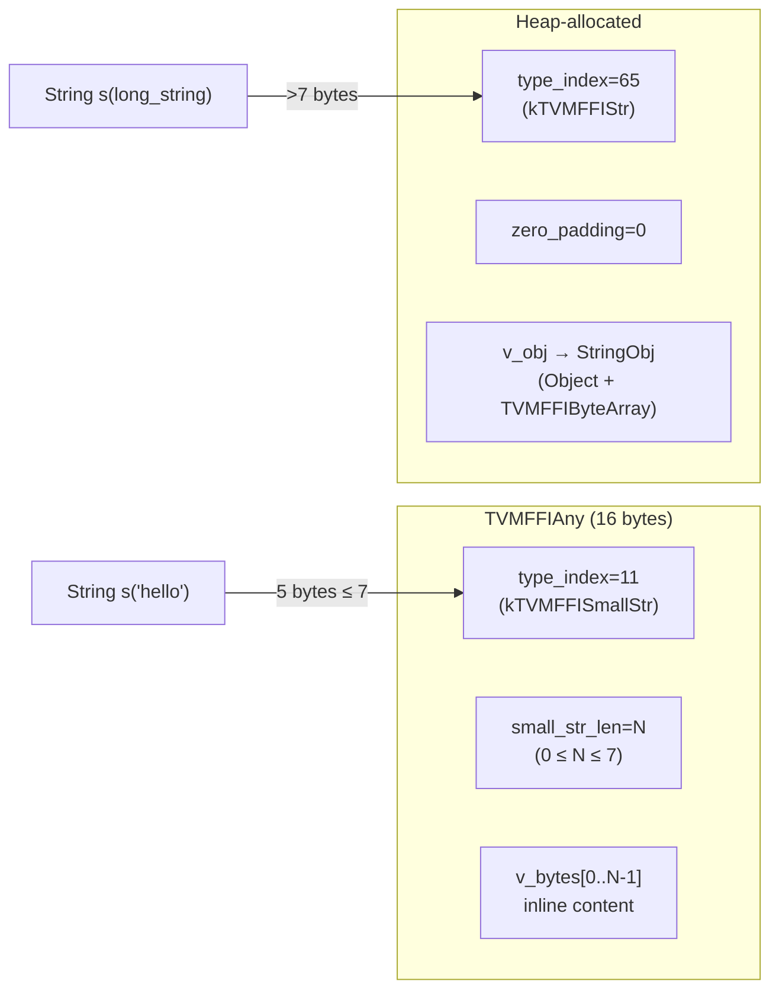
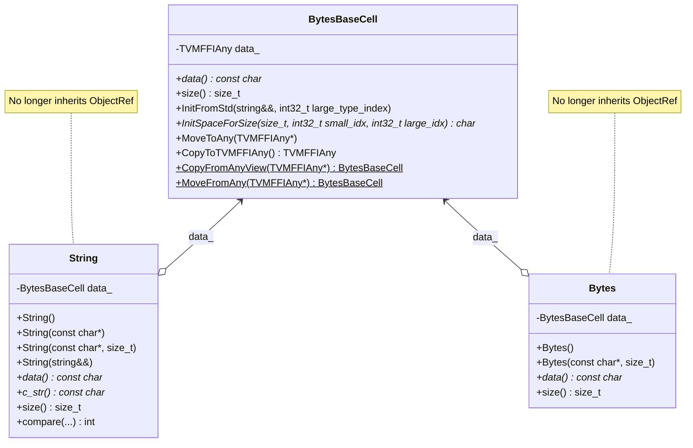

# Small String Optimization (SSO)

**TL;DR**
- Strings and bytes of 7 characters or fewer are stored inline within the 16-byte `TVMFFIAny` struct using new type indices `kTVMFFISmallStr=11` and `kTVMFFISmallBytes=12`, eliminating heap allocation for short strings.
- `String` and `Bytes` no longer inherit from `ObjectRef`; they are standalone value types backed by an internal `details::BytesBaseCell` that dispatches between inline (small) and heap-allocated (large) representations.
- All consumers (`AnyHash`, `AnyEqual`, `StructuralHash`, `StructuralEqual`, `TypeTraits`) treat small and large string/bytes as semantically equivalent.

## Problem Statement

### Background
- String values are among the most common FFI values (type keys, field names, IR node attributes). Most are short (< 8 bytes).
- Every string previously required heap allocation of a `StringObj` (Object header + TVMFFIByteArray + data), incurring allocation overhead and cache pressure.
- The `TVMFFIAny` struct had a reserved `small_len` field and an unused `v_bytes[8]` union member, providing exactly the storage needed for inline short strings.

### Solution
- Repurpose the `small_len` field as `zero_padding`/`small_str_len` union and the `v_bytes` member for inline content.
- Introduce `details::BytesBaseCell` as the internal storage abstraction that dispatches between small (inline in `TVMFFIAny`) and large (heap-allocated `StringObj`/`BytesObj`) representations.
- Decouple `String`/`Bytes` from `ObjectRef` to allow them to hold either representation without forcing object semantics on small values.

### Goals
- **Goal**: Eliminate heap allocation for strings/bytes of 7 bytes or fewer.
- **Goal**: Maintain semantic equivalence between small and large representations across all consumers.
- **Goal**: `sizeof(String) == sizeof(Bytes) == sizeof(TVMFFIAny) == 16` (no overhead).
- **Non-goal**: Not a general small-buffer optimization; specifically for the FFI string types within `TVMFFIAny`.

## Design





### Key Classes, Fields and Interfaces

**New type indices** (`TVMFFITypeIndex`):
| Name | Value | Purpose |
|------|-------|---------|
| `kTVMFFISmallStr` | 11 | On-stack small string (<=7 bytes) |
| `kTVMFFISmallBytes` | 12 | On-stack small bytes (<=7 bytes) |

**`TVMFFIAny` field change** (`c_api.h`):
```c
typedef struct TVMFFIAny {
  int32_t type_index;
  union {
    uint32_t zero_padding;    // MUST be 0 for non-small-string types
    uint32_t small_str_len;   // length of small string (max 7)
  };
  union {
    int64_t v_int64;
    // ... other members ...
    char v_bytes[8];          // small string content stored here
  };
} TVMFFIAny;
```

**`details::BytesBaseCell`** (`string.h`):
```cpp
class BytesBaseCell {
public:
  BytesBaseCell();                       // default: empty, type_index=0
  explicit BytesBaseCell(std::nullopt_t); // null sentinel for Optional
  // copy/move with proper refcount management for large strings
  const char* data() const noexcept;   // dispatches small (v_bytes) vs large (obj->data)
  size_t size() const noexcept;        // dispatches small (small_str_len) vs large (obj->size)
  template <typename LargeObj>
  void InitFromStd(std::string&& str, int32_t large_type_index);
  template <typename LargeObj>
  char* InitSpaceForSize(size_t n, int32_t small_type_index, int32_t large_type_index);
  void MoveToAny(TVMFFIAny* result);
  TVMFFIAny CopyToTVMFFIAny() const;
  static BytesBaseCell CopyFromAnyView(const TVMFFIAny* src);
  static BytesBaseCell MoveFromAny(TVMFFIAny* src);
private:
  TVMFFIAny data_;
};
```

**`String`** (no longer inherits `ObjectRef`):
```cpp
class String {
public:
  String();                              // default: empty small string (kTVMFFISmallStr, len=0)
  String(const char* other);
  String(const char* other, size_t size);
  String(const std::string& other);
  String(std::string&& other);
  explicit String(TVMFFIByteArray other);
  String(std::nullptr_t) = delete;       // prevent null construction
  const char* data() const noexcept;
  const char* c_str() const noexcept;
  size_t size() const noexcept;
  int compare(const String& other) const;
  int compare(const char* other) const;  // no strlen; checks null terminator inline
  operator std::string() const;
private:
  details::BytesBaseCell data_;
};
// All comparisons with nullptr_t are deleted
```

**`Bytes`** (no longer inherits `ObjectRef`):
```cpp
class Bytes {
public:
  Bytes();                               // default: empty small bytes (kTVMFFISmallBytes, len=0)
  Bytes(const char* data, size_t size);
  Bytes(TVMFFIByteArray bytes);
  Bytes(const std::string& other);
  Bytes(std::string&& other);
  const char* data() const;
  size_t size() const;
  operator std::string() const;
  static bool memequal(const void* lhs, const void* rhs, size_t lhs_count, size_t rhs_count);
  static int memncmp(const char* lhs, const char* rhs, size_t lhs_count, size_t rhs_count);
private:
  details::BytesBaseCell data_;
};
```

**`TypeTraits<String>`** and **`TypeTraits<Bytes>`** (rewritten):
- No longer extend `ObjectRefWithFallbackTraitsBase`. Now extend `TypeTraitsBase` directly.
- `field_static_type_index = TypeIndex::kTVMFFIAny` (was `kTVMFFIStr`/`kTVMFFIBytes`), because the value can be either small or large.
- `CheckAnyStrict` checks for both small and large type indices.
- `TryCastFromAnyView` handles `kTVMFFIRawStr` -> `String` and `kTVMFFIByteArrayPtr` -> `Bytes` fallback conversions.

**`Optional<String>` and `Optional<Bytes>`** (new specialization):
- Uses `BytesBaseCell(std::nullopt)` as the null sentinel instead of `std::optional` wrapping.
- `sizeof(Optional<String>) == sizeof(String)` (16 bytes, zero overhead).

**New C ABI inline** (`c_api.h`):
```c
inline TVMFFIByteArray TVMFFISmallBytesGetContentByteArray(const TVMFFIAny* value);
// Returns {value->v_bytes, value->small_str_len}
```

**`StableHashSmallStrBytes`** (`base_details.h`):
```cpp
uint64_t StableHashSmallStrBytes(const TVMFFIAny* data);
// Hash function optimized for inline small strings
```

**C API signature change**:
```c
// Before:
int TVMFFIDataTypeToString(const DLDataType* dtype, TVMFFIObjectHandle* out);
// After:
int TVMFFIDataTypeToString(const DLDataType* dtype, TVMFFIAny* out);
// Returns small string when dtype string fits in 7 bytes
```

### Contracts, Assumptions and Invariants
- **`zero_padding` invariant**: All non-small-string `TVMFFIAny` values MUST have `zero_padding == 0`. This is enforced across all `TypeTraits` specializations and enables `Any::same_as` to use full 16-byte comparison (comparing `type_index + zero_padding + v_int64` as a unit).
- **Max small string length = 7**: `sizeof(int64_t) - 1 = 7`. The `v_bytes[8]` member provides 8 bytes of storage but 1 byte is reserved for alignment considerations.
- **Semantic equivalence**: `AnyHash(small_str) == AnyHash(large_str)` and `AnyEqual(small_str, large_str) == true` when the content is the same. All consumers (structural equal/hash, Map keys, etc.) normalize before comparison.
- **No ObjectRef inheritance**: `String` and `Bytes` cannot be assigned to `ObjectRef`, stored in `ObjectPtr`, or checked via `IsInstance`. Code that relied on these patterns must be updated.
- **Default construction**: `String()` creates an empty small string (`kTVMFFISmallStr`, `small_str_len=0`), not a null/undefined state. `Bytes()` similarly creates `kTVMFFISmallBytes`.
- **nullptr_t deletion**: All `String`/`Bytes` constructors and comparison operators with `nullptr_t` are deleted to prevent accidental null usage.

### Extension Points
- **Larger inline threshold**: If `TVMFFIAny` were ever enlarged (e.g., to 24 bytes), the small string threshold could increase proportionally.
- **Other inline value types**: The same pattern (POD type index + inline data in the union) could be applied to other small value types.

### Usage Examples

#### Small string on-stack storage
**Context**: Short strings avoid heap allocation entirely.
```cpp
// Short string (<= 7 bytes) stored inline in TVMFFIAny
Any a = "a1";
EXPECT_EQ(a.type_index(), TypeIndex::kTVMFFISmallStr);

// Long string heap-allocated as before
Any b = String(std::string("a1"));
EXPECT_EQ(b.type_index(), TypeIndex::kTVMFFIStr);

// Small and large representations compare equal and hash equal
EXPECT_TRUE(AnyEqual()(a, b));
EXPECT_EQ(AnyHash()(a), AnyHash()(b));
```

#### Optional<String> with zero overhead
**Context**: Optional strings use a null sentinel without extra storage.
```cpp
Optional<String> opt_str;
EXPECT_TRUE(!opt_str.has_value());
EXPECT_EQ(opt_str.value_or("default"), "default");

opt_str = "hello";
EXPECT_TRUE(opt_str.has_value());
EXPECT_EQ(opt_str.value(), "hello");
static_assert(sizeof(Optional<String>) == sizeof(String));  // 16 bytes
```

## Alternatives & Trade-offs
### Keep String as ObjectRef, add separate SmallStr type
- Pros: No breaking change to String's inheritance; SSO only applies to new code paths.
- Cons: Two incompatible string types; every consumer must handle both. The unified approach with `BytesBaseCell` keeps a single `String` type with transparent dual storage.

### Use std::string with SSO (libstdc++/libc++ implementations)
- Pros: Leverage well-tested std library SSO (typically 15-22 bytes inline).
- Cons: std::string cannot cross the C ABI boundary; it has platform-specific layout. The FFI needs a representation that works in `TVMFFIAny` across all bindings.

## Related Work
### Design Docs & ADRs
- [0001-c-abi-layer.md](../designs/0001-c-abi-layer.md) -- TVMFFIAny struct layout with zero_padding/small_str_len
- [0002-any-value-system.md](../designs/0002-any-value-system.md) -- AnyHash/AnyEqual normalization
- [0005-type-traits.md](../designs/0005-type-traits.md) -- Rewritten TypeTraits<String>/TypeTraits<Bytes>
- [0004-type-index-layout.md](../ADRs/0004-type-index-layout.md) -- New POD indices kTVMFFISmallStr=11, kTVMFFISmallBytes=12
- [0001-unified-any-value.md](../ADRs/0001-unified-any-value.md) -- zero_padding field now actively used

### Evidence Matrix
- Small string type indices and TVMFFIAny field changes -> `2025-08-04-49e2ed4.md` + `c_api.h`
- BytesBaseCell, String/Bytes class rewrite -> `2025-08-04-49e2ed4.md` + `string.h`
- TypeTraits rewrite for dual type indices -> `2025-08-04-49e2ed4.md` + `string.h`
- Optional<String>/Optional<Bytes> specialization -> `2025-08-04-49e2ed4.md` + `optional.h`
- StringObj/BytesObj moved to details namespace -> `2025-08-01-f9d2bff.md` + `string.h`
- Bytes::memequal and StableHashBytes optimization -> `2025-07-30-ba0ea87.md` + `string.h`, `base_details.h`
