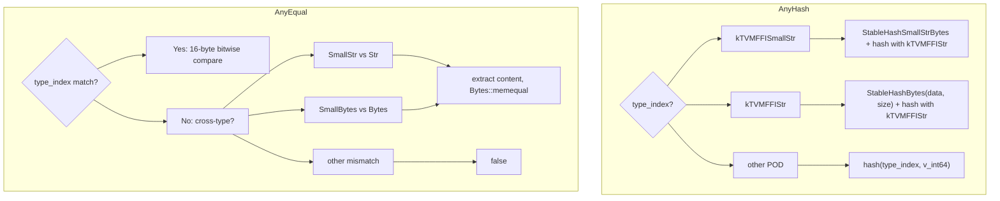

# Small String/Bytes Optimization (SSO) Design

**TL;DR**:
- Strings up to 7 bytes are stored inline in the 16-byte `TVMFFIAny` value, avoiding heap allocation and ref-counting entirely.
- `String` and `Bytes` are redesigned from `ObjectRef` subclasses to value types backed by `details::BytesBaseCell`, a private wrapper around `TVMFFIAny` that transparently dispatches between inline (small) and heap-allocated (large) storage.
- `AnyHash` and `AnyEqual` handle cross-representation equality so a small string compares equal to a heap-allocated string with the same content.

## Problem Statement
### Background
- Short strings (type keys, field names, attribute names) are extremely common in TVM FFI but each one required a heap allocation: `StringObj` with `TVMFFIObject` header (16 bytes) + `TVMFFIByteArray` (16 bytes) + data allocation.
- The `TVMFFIAny` value already has 8 unused bytes in its value union (`v_bytes[8]`), plus 4 bytes at offset 4 (`small_len`, previously reserved). Strings up to 7 bytes could fit entirely inline.
- String equality comparison used `memncmp` (three-way compare), which is slower than needed for the common equality-only path.

### Solution
- **Inline storage**: Strings with `size <= 7` get `type_index = kTVMFFISmallStr` and their content stored directly in `TVMFFIAny.v_bytes` with length in `small_str_len`. The 8th byte is reserved for null terminator compatibility.
- **Value types**: `String` and `Bytes` are no longer `ObjectRef` subclasses. They embed a `BytesBaseCell` (which wraps a `TVMFFIAny`) directly, managing the dual small/large representation transparently.
- **Cross-representation equality**: `AnyHash` uses `kTVMFFIStr` (not `kTVMFFISmallStr`) as the canonical type index for hashing, ensuring small and large strings with the same content hash identically. `AnyEqual` extracts content from both representations and compares via `Bytes::memequal`.
- **`zero_padding` invariant**: All non-small-string `TVMFFIAny` values must set `zero_padding = 0` (the field at offset 4) to maintain `AnyEqual`'s fast-path 16-byte comparison and `AnyHash` consistency.

### Goals
- Zero-allocation for short strings (<=7 bytes).
- Full backward compatibility: `String` and `Bytes` public API (`.data()`, `.size()`, comparison operators) is unchanged.
- Cross-representation transparency: users never need to know whether a string is small or large.
- Non-goals: inline storage for strings > 7 bytes; variable-width encoding; this is purely a POD-range optimization.

## Design

### TVMFFIAny Layout (Updated)

```
Offset  Size   Field
0       4      int32_t type_index
4       4      union { uint32_t zero_padding; uint32_t small_str_len }
8       8      union { int64_t, double, void*, ..., char v_bytes[8] }
```

For small strings/bytes:
- `type_index = kTVMFFISmallStr (11)` or `kTVMFFISmallBytes (12)`
- `small_str_len` = content length (0-7)
- `v_bytes[0..small_str_len-1]` = content, `v_bytes[small_str_len]` = `\0` (null terminator)

For all other types:
- `zero_padding = 0` (invariant enforced in every `CopyToAnyView`/`MoveToAny`)

### BytesBaseCell (Private Implementation)

```cpp
namespace details {
class BytesBaseCell {
    TVMFFIAny data_;
public:
    BytesBaseCell() noexcept;                          // empty small string (len=0)
    BytesBaseCell(std::nullopt_t) noexcept;            // null (type_index=kTVMFFINone)
    const char* data() const noexcept;                  // inline or heap dispatch
    size_t size() const noexcept;                       // inline or heap dispatch
    void MoveToAny(TVMFFIAny* result) noexcept;
    void CopyToTVMFFIAny(TVMFFIAny* result) const;
    void CopyFromAnyView(const TVMFFIAny* src);
    void MoveFromAny(TVMFFIAny* src);

    // Allocation: returns writable char* to storage, choosing inline or heap
    template <typename LargeObj>
    char* InitSpaceForSize(size_t size, int32_t small_type_index, int32_t large_type_index);
};
}
```

`InitSpaceForSize<LargeObj>(size, small_idx, large_idx)`:
- If `size <= 7`: sets `type_index = small_idx`, `small_str_len = size`, returns `&data_.v_bytes[0]`
- If `size > 7`: allocates `LargeObj` via `MakeInplaceBytes`, sets `type_index = large_idx`, returns pointer to heap data

### String / Bytes (Public API)

```cpp
class String {
    details::BytesBaseCell data_;
public:
    String() noexcept;                     // empty string
    String(const char* str);               // from C string
    String(const char* str, size_t len);   // from buffer
    String(std::string str);               // from std::string
    String(std::nullptr_t) = delete;       // prevent null construction

    const char* data() const noexcept;
    const char* c_str() const noexcept;
    size_t size() const noexcept;
    bool empty() const noexcept;

    int compare(const String& other) const;
    int compare(const char* other) const;  // avoids strlen

    // Comparison operators with String, std::string, const char*
    // Comparison operators with std::nullptr_t are all = delete
};

class Bytes {
    details::BytesBaseCell data_;
public:
    // Similar interface; uses kTVMFFISmallBytes / kTVMFFIBytes
    static bool memequal(const void* lhs, const void* rhs, size_t lhs_count, size_t rhs_count);
    static int memncmp(const char* lhs, const char* rhs, size_t lhs_count, size_t rhs_count);
};
```

Key difference from previous design: `String` and `Bytes` no longer inherit from `ObjectRef`. They do not have `get()`, `use_count()`, `operator->()`, or `defined()`. The public API is purely value-type: `.data()`, `.size()`, comparison operators.

### Type Index Additions

| Index | Name | Range | Description |
|-------|------|-------|-------------|
| 11 | `kTVMFFISmallStr` | POD [0,64) | Inline small string |
| 12 | `kTVMFFISmallBytes` | POD [0,64) | Inline small bytes |

With corresponding `StaticTypeKey` constants:
- `StaticTypeKey::kTVMFFISmallStr = "ffi.SmallStr"`
- `StaticTypeKey::kTVMFFISmallBytes = "ffi.SmallBytes"`

### TypeTraits Changes

`TypeTraits<String>` is now a fully custom specialization (no longer uses `ObjectRefWithFallbackTraitsBase`):

```cpp
template<> struct TypeTraits<String> {
    static constexpr int32_t field_static_type_index = kTVMFFIAny;  // not kTVMFFIStr
    static bool CheckAnyStrict(const TVMFFIAny* src);
        // accepts kTVMFFISmallStr or kTVMFFIStr
    static std::optional<String> TryCastFromAnyView(const TVMFFIAny* src);
        // accepts kTVMFFIRawStr, kTVMFFISmallStr, or kTVMFFIStr
    // ... CopyToAnyView, MoveToAny delegate to BytesBaseCell
};
```

`field_static_type_index = kTVMFFIAny` because the runtime type may be either `kTVMFFISmallStr` or `kTVMFFIStr` -- the reflection system cannot predict which at registration time.

### AnyHash / AnyEqual Cross-Representation Handling



Key invariant: hashing uses `kTVMFFIStr` (not `kTVMFFISmallStr`) as the type index component, so `hash("hi" as SmallStr) == hash("hi" as Str)`.

### Optional<String> / Optional<Bytes>

Dedicated template specialization using `BytesBaseCell(std::nullopt)` as null sentinel:
- `Optional<String>` stores `type_index = kTVMFFINone` for the null state
- `sizeof(Optional<String>) == sizeof(String) == 16` (zero overhead)
- `has_value()` checks `type_index != kTVMFFINone`

### String Performance Optimizations

Two helper methods optimize the common equality and hashing paths:

- **`Bytes::memequal(lhs, rhs, lhs_count, rhs_count)`**: Short-circuits on length mismatch, then delegates to `std::memcmp`. Replaces `memncmp() == 0` in equality paths (ba0ea87).
- **`StableHashBytes` aligned fast-path**: When data is 8-byte aligned on little-endian systems, loads `uint64_t` directly instead of byte-by-byte union fill (ba0ea87).
- **`StableHashSmallStrBytes`**: Specialized fast-path for hashing small strings. On little-endian systems, hashes `v_uint64 % kMod` directly (49e2ed4).
- **`String::compare(const char*)`**: Scans inline character-by-character, avoiding `strlen` call (ba0ea87).

### Key Classes, Fields and Interfaces

| Symbol | Signature | Description |
|--------|-----------|-------------|
| `details::BytesBaseCell` | private class wrapping `TVMFFIAny` | Dual-storage manager for String/Bytes |
| `BytesBaseCell::InitSpaceForSize<LargeObj>` | `char* InitSpaceForSize(size_t, int32_t, int32_t)` | Choose inline vs heap, return writable pointer |
| `String` | value type, `data()`, `size()`, `c_str()`, `compare()` | No longer ObjectRef; may be small or large |
| `Bytes` | value type, `data()`, `size()` | No longer ObjectRef; may be small or large |
| `Bytes::memequal` | `static bool memequal(const void*, const void*, size_t, size_t)` | Equality-only comparison (length + memcmp) |
| `StableHashSmallStrBytes` | `uint64_t(const TVMFFIAny*)` | Fast hash for inline small strings |
| `Optional<String>` | specialization using `BytesBaseCell(nullopt)` | Zero-overhead optional string |
| `TVMFFISmallBytesGetContentByteArray` | `TVMFFIByteArray(const TVMFFIAny*)` | C ABI accessor for inline content |

### Contracts, Assumptions and Invariants
- **`zero_padding = 0` for non-small-string types**: Every `CopyToAnyView` and `MoveToAny` for non-small-string types must explicitly set `result->zero_padding = 0`. This affects 17+ TypeTraits specializations. Violation causes `AnyEqual` false negatives and `AnyHash` inconsistencies.
- **Max inline size = 7 bytes**: `sizeof(int64_t) - 1 = 7`. The 8th byte is reserved for null terminator. Strings with `size > 7` fall back to heap allocation via `MakeInplaceBytes`.
- **Cross-representation equality is symmetric**: `SmallStr("hi") == Str("hi")` and vice versa, for both `AnyEqual` and structural equality.
- **String is not nullable**: `String(std::nullptr_t) = delete`. Use `Optional<String>` for nullable strings.
- **`Any::same_as` compares `zero_padding`**: Since small strings encode length in this field, identity comparison must include it.
- **`std::hash<String>` uses `std::hash<std::string_view>`**: Not `StableHashBytes`. Stable hashing is only for `AnyHash` (cross-run determinism).

### Extension Points
- The `BytesBaseCell` pattern could be extended to other small-value optimizations (e.g., small arrays or small tuples).
- The `InitSpaceForSize` template is generic over `LargeObj`, enabling different heap allocation strategies.
- Additional small-string hash fast-paths could be added for non-little-endian architectures.

### Usage Examples

#### Small string creation (no heap allocation)
**Context**: Most type keys, field names, and short attribute strings are <=7 bytes and benefit from SSO.
```cpp
String s = "hello";   // 5 bytes <= 7, stored inline in TVMFFIAny
Any a = s;
assert(a.type_index() == kTVMFFISmallStr);

String long_s = "this is a long string";  // > 7 bytes, heap allocated
Any b = long_s;
assert(b.type_index() == kTVMFFIStr);
```

#### Cross-representation equality and hashing
**Context**: Small and large strings with the same content must compare equal and hash identically.
```cpp
Any a = "a1";                      // small string (2 bytes)
Any b = String(std::string("a1")); // may force heap allocation
assert(AnyEqual()(a, b));           // true: same content
assert(AnyHash()(a) == AnyHash()(b)); // true: same hash
```

#### Optional<String> with zero overhead
**Context**: Function parameters that may or may not have a string value.
```cpp
Optional<String> opt;               // null: type_index = kTVMFFINone
assert(!opt.has_value());
opt = "hello";                      // small string
assert(opt.value() == "hello");
static_assert(sizeof(Optional<String>) == sizeof(String));  // 16 bytes, zero overhead
```

### Evolution Timeline
| Version | Commit | Change | Motivation |
|---------|--------|--------|------------|
| v1 | ba0ea87 | `Bytes::memequal`; aligned `StableHashBytes`; `String::compare(const char*)` rewrite | Performance foundations for string equality/hashing |
| v2 | f9d2bff | `BytesObj`/`StringObj`/`BytesObjBase` moved to `details` namespace | Decouple public API from internal representation |
| v3 | 49e2ed4 | SSO: `kTVMFFISmallStr`/`kTVMFFISmallBytes`; `BytesBaseCell`; `String`/`Bytes` as value types; `zero_padding` invariant; cross-representation AnyHash/AnyEqual; `Optional<String>` specialization; custom `TypeTraits<String>`/`TypeTraits<Bytes>` | Eliminate heap allocation for short strings |

## Alternatives & Trade-offs
### Keep String/Bytes as ObjectRef subclasses with SSO only in Any
- Pros: Minimal API change; ObjectRef ecosystem (Downcast, get(), use_count()) preserved
- Cons: Cannot avoid ref-counting overhead for SSO; the inline representation does not have an Object header so it cannot participate in the ObjectRef hierarchy
### Larger inline threshold (e.g., 15 bytes with `sizeof(TVMFFIAny) = 24`)
- Pros: More strings fit inline (most type keys are <15 bytes)
- Cons: Increases `TVMFFIAny` size from 16 to 24 bytes, affecting ALL values (not just strings); violates the 16-byte layout invariant shared with `TVMFFIObject`
### Interned string table instead of SSO
- Pros: Perfect deduplication; O(1) equality by pointer
- Cons: Requires global table with synchronization; strings cannot be freed; does not help with fresh/temporary strings; more complex implementation

## Related Work
### Design Docs & ADRs
- `.knowledge/designs/any-system.md` -- `TVMFFIAny` layout, `AnyHash`/`AnyEqual`, `zero_padding` invariant
- `.knowledge/designs/c-abi.md` -- `TVMFFIAny` struct definition, type index table
- `.knowledge/designs/type-traits.md` -- Custom `TypeTraits<String>`/`TypeTraits<Bytes>` specializations
- `.knowledge/designs/containers.md` -- String/Bytes as value types, `BytesObjBase` in `details`
- `.knowledge/ADRs/003-type-index-ranges.md` -- `kTVMFFISmallStr`/`kTVMFFISmallBytes` in POD range

### Evidence Matrix
- `Bytes::memequal` + aligned hash -> `2025-07-30-ba0ea87.md` + commit ba0ea87
- StringObj/BytesObj -> details namespace -> `2025-08-01-f9d2bff.md` + commit f9d2bff
- SmallMapObj duplicate key fix -> `2025-07-31-0342d85.md` + commit 0342d85
- SSO full implementation -> `2025-08-04-49e2ed4.md` + commit 49e2ed4
