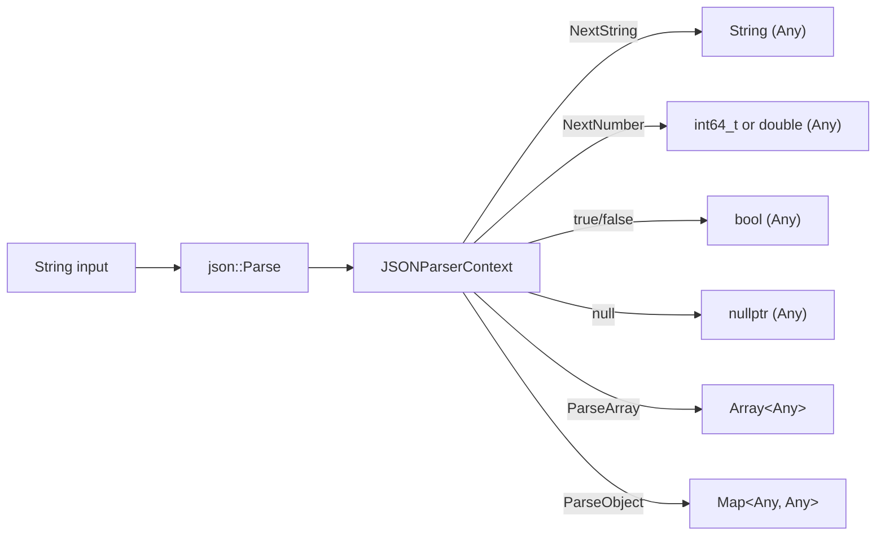
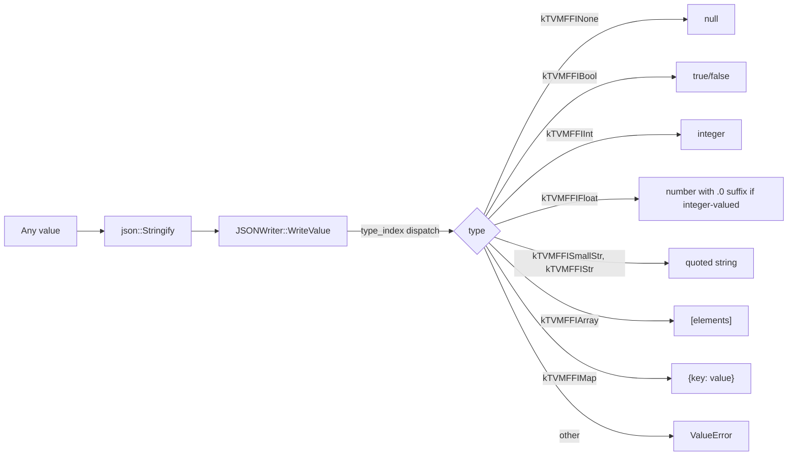
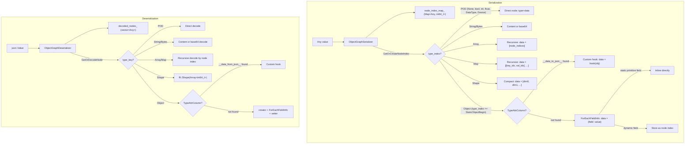

# JSON Module and Graph Serialization

**TL;DR**
- The `tvm::ffi::json` namespace provides lightweight JSON parsing (`json::Parse`) and serialization (`json::Stringify`) built on existing FFI primitives, where `json::Value = Any`, `json::Object = Map<Any, Any>`, and `json::Array = Array<Any>`. No new object types or type indices are introduced.
- `ToJSONGraph`/`FromJSONGraph` serialize arbitrary FFI value graphs to a node-indexed JSON format that preserves object identity (shared references), uses type-key-based type encoding for cross-process stability, and supports custom per-type serialization hooks via `__data_to_json__`/`__data_from_json__` TypeAttrColumns.
- Both subsystems live in the extra API tier (`include/tvm/ffi/extra/`), gated by `TVM_FFI_USE_EXTRA_CXX_API`, and include fast-math safety for NaN/Infinity handling under `-ffast-math`.

## Problem Statement

### Background

An FFI system needs (1) a lightweight JSON parser/writer for configuration and interchange, and (2) a full graph serialization format that preserves object identity, handles recursive structures, and supports arbitrary registered types. Before these additions, no in-tree JSON or serialization facility existed; downstream consumers used ad-hoc approaches.

### Solution

Two layered subsystems:
- **JSON parser/writer**: Hand-written recursive-descent parser and type-dispatch writer. Reuses `Any` as the JSON value type (zero new types). Supports extended JSON (NaN, Infinity, int64 integers).
- **JSON graph serialization**: Node-indexed graph format where shared references serialize to the same index. Uses reflection metadata (`ForEachFieldInfo`, `FieldGetter`, `FieldSetter`) for generic object serialization, with `__data_to_json__`/`__data_from_json__` TypeAttrColumn hooks for custom per-type overrides.

### Goals

- **Goal**: Lightweight JSON parsing/writing using existing FFI type system (no new object types).
- **Goal**: Preserve object identity (shared references) across serialization round-trips.
- **Goal**: Type-key-based type encoding for cross-process and cross-build stability.
- **Goal**: Custom per-type serialization hooks via the established TypeAttrColumn pattern.
- **Goal**: Safe handling of IEEE 754 special values (NaN, Infinity) even under `-ffast-math`.
- **Non-goal**: Binary serialization format (JSON is text-based, human-readable).
- **Non-goal**: Cycle detection for arbitrary object graphs (mutable containers like List/Dict have cycle guards; general object references do not).

## Design

### JSON Parser/Writer

#### Type Aliases

```cpp
namespace tvm::ffi::json {
  using Value  = Any;              // Any JSON value
  using Object = Map<Any, Any>;    // JSON object (Map for key-order preservation)
  using Array  = ffi::Array<Any>;  // JSON array
}
```

The choice to alias `Any` rather than introduce new types keeps the module minimal (no type index allocation, no registration overhead). The trade-off is the loss of static JSON-type safety. See [ADR 0015](../ADRs/0015-json-reuses-any-as-value.md).

#### Parse Data Flow



Key design choices:
- **Integer/float distinction**: `NextNumber` tracks a `maybe_int` flag. Numbers without `.`, `e`, or `E` are parsed as `int64_t` (via `strtoimax`), falling back to `double`. This preserves the int/float distinction useful for FFI round-trips.
- **Extended literals**: `Infinity`, `-Infinity`, `NaN` are parsed as `double` special values. Not valid JSON per RFC 8259, but needed in ML contexts.
- **Non-throwing parse**: An optional `String* error_msg` out-parameter reports errors without throwing.
- **String fast path**: `NextString` uses a simple loop for escape-free strings (common case), falling back to `NextStringWithFullHandling` only when backslash or control characters appear. **Important**: The control character check casts `*cur_` to `uint8_t` before comparing against `' '` (0x20) to avoid treating valid UTF-8 continuation bytes (>= 0x80) as control characters on platforms where `char` is signed. Fixed in commit `d3b5532` (#442).
- **Stack-based accumulation**: `JSONParser` uses flat `array_temp_stack_` / `object_temp_stack_` vectors as accumulation buffers, constructing `Array`/`Map` from `[stack_top, end)` ranges rather than intermediate containers.

#### Write Data Flow



Key invariants:
- **Float round-trip fidelity**: Integer-valued doubles use `%.1f` (e.g., `42.0`); others use `%.17g` (17 significant digits).
- **Object key validation**: Every key must be a `String`; non-string keys throw `ValueError`.
- **Unsupported types throw**: Any unrecognized `type_index` triggers `ValueError`.

#### Fast-Math Safety

Under `-ffast-math` (`__FAST_MATH__`), compilers assume no NaN/Inf, breaking `std::isnan`/`std::isinf` and `std::numeric_limits` special values. The parser and writer use `FastMathSafe*` helpers that manipulate IEEE 754 bit patterns directly:
- `FastMathSafePosInf()`: `0x7FF0000000000000ULL`
- `FastMathSafeNegInf()`: `0xFFF0000000000000ULL`
- `FastMathSafeNaN()`: `0x7FF8000000000000ULL`
- `FastMathSafeIsNaN(x)`: exponent == 0x7FF and mantissa != 0
- `FastMathSafeIsInf(x)`: exponent == 0x7FF and mantissa == 0

All helpers include `static_assert(sizeof(double) == sizeof(uint64_t))`.

**Type-punning idiom**: The helpers use union-based type punning to convert between `double` and `uint64_t`:
```cpp
union { double from; uint64_t to; } u;
u.from = x;
uint64_t bits = u.to;
```

This is well-defined in C11 and supported as an extension by all major C++ compilers (GCC, Clang, MSVC). An earlier implementation used `*reinterpret_cast<const uint64_t*>(&x)`, which violates the C++ strict-aliasing rule and causes `-Werror=strict-aliasing` failures under GCC with `-ffast-math` (which implies `-fstrict-aliasing`). The union-based idiom is the project's canonical approach for float-to-int bit reinterpretation. `std::bit_cast` (C++20) would be the standards-compliant alternative once the project moves beyond C++17.

### JSON Graph Serialization

#### Format Specification

```json
{
  "root_index": 0,
  "nodes": [
    {"type": "ffi.String", "data": "hello"},
    {"type": "ffi.Array", "data": [0, 2]},
    {"type": "ffi.Int", "data": 42},
    {"type": "MyModule.MyObj", "data": {"name": 0, "value": 42}}
  ],
  "metadata": {}
}
```

Structure:
- `root_index`: Integer index of the root value in `nodes`.
- `nodes`: Flat array of serialized values. Each node has `"type"` (type key string) and `"data"` (type-specific content).
- `metadata`: Optional JSON object passed through from caller.

#### Serialization Architecture



#### Identity Preservation

`ObjectGraphSerializer` maintains `Map<Any, int64_t> node_index_map_` that maps values to their node index via `AnyEqual`. Previously-seen values return the existing index, so shared subgraphs serialize as a single node referenced multiple times.

**Note**: Identity is value-based (via `AnyEqual`), not pointer-based. Two `int64_t(42)` values map to the same node.

#### Static-Type Optimization

For object fields where `field_static_type_index` is a known primitive (`kTVMFFINone`, `kTVMFFIBool`, `kTVMFFIInt`, `kTVMFFIFloat`, `kTVMFFIDataType`), the value is inlined directly in the object's `data` JSON object. Dynamic-typed fields use node-index references.

**`field_static_type_index` semantics** (clarified in commit `3b26a09` #456): This field reflects the **compile-time** declared type of the C++ field, not the runtime type. For example, a field declared as `Any` will have `field_static_type_index == kTVMFFIAny` even if it holds an `int` at runtime. A field declared as `Array<Any>` reports `kTVMFFIArray` with no element type information. The serializer uses this compile-time hint solely to decide whether to inline POD values (avoiding node-graph overhead) or route through the standard node graph. It must never be used to determine the actual runtime type of a value -- that comes from the value's own `type_index`.

**Symmetry invariant**: The serializer and deserializer must agree on exactly which `field_static_type_index` values get inlined. Both use identical switch-case arms.

#### Custom Serialization Hooks

Types can register custom serialization via TypeAttrColumn:
- `__data_to_json__`: Signature `(const T*) -> json::Value`. Called during serialization to produce custom JSON for a node's `data` field.
- `__data_from_json__`: Signature `(json::Value) -> T`. Called during deserialization to reconstruct from custom JSON.

Both columns are pre-created via `EnsureTypeAttrColumn` during static initialization. Detection is runtime: `TypeAttrColumn("__data_to_json__")[type_index] != nullptr`.

#### Shape Serialization

`Shape` gets a dedicated format: `{"type": "ffi.Shape", "data": [dim0, dim1, ...]}`. The data is a flat array of `int64_t` values (not node indices), avoiding the generic field-by-field reflection path. This is more compact and does not require `Shape` to have full reflection metadata.

#### Base64 for Bytes

`Bytes` values are serialized as base64 strings using `Base64Encode`/`Base64Decode` (RFC 4648, `+/` alphabet, `=` padding) in header-only `include/tvm/ffi/extra/base64.h`.

#### String Convenience Wrappers

`ToJSONGraphString` and `FromJSONGraphString` compose `json::Parse`/`json::Stringify` with `ToJSONGraph`/`FromJSONGraph`, providing direct `String`-in/`String`-out APIs for cross-language callers. All four functions are registered as global FFI functions (`ffi.ToJSONGraph`, `ffi.FromJSONGraph`, `ffi.ToJSONGraphString`, `ffi.FromJSONGraphString`).

#### ObjectCreator

`reflection::ObjectCreator` (`include/tvm/ffi/reflection/creator.h`) is a reusable helper class for reflection-based object construction from `Map<String, Any>`. It extracts and formalizes the field-population pattern previously embedded only in `MakeObjectFromPackedArgs`. Used by `ObjectGraphDeserializer` for reconstructing objects from JSON. See [0006-reflection](0006-reflection.md) for details.

### Key Classes, Fields and Interfaces

- **`json::Parse(String, String*)`** (`include/tvm/ffi/extra/json.h`): Parse JSON string to `Any`. Optional non-throwing error path.
- **`json::Stringify(Any, Optional<int>)`** (`include/tvm/ffi/extra/json.h`): Serialize `Any` to JSON string with optional indentation.
- **`json::Value`**: Type alias for `Any`.
- **`json::Object`**: Type alias for `Map<Any, Any>`.
- **`json::Array`**: Type alias for `Array<Any>`.
- **`ToJSONGraph(Any, Any)`** (`include/tvm/ffi/extra/serialization.h`): Serialize value graph to JSON.
- **`FromJSONGraph(json::Value)`** (`include/tvm/ffi/extra/serialization.h`): Deserialize JSON to value graph.
- **`ToJSONGraphString(Any, Any)`**: String wrapper around `ToJSONGraph` + `json::Stringify`.
- **`FromJSONGraphString(String)`**: String wrapper around `json::Parse` + `FromJSONGraph`.
- **`Base64Encode(TVMFFIByteArray)`** / **`Base64Decode(TVMFFIByteArray)`** (`include/tvm/ffi/extra/base64.h`): Header-only RFC 4648 base64.
- **`ObjectGraphSerializer`** (`src/ffi/extra/serialization.cc`): Internal serializer with `node_index_map_` memoization.
- **`ObjectGraphDeserializer`** (`src/ffi/extra/serialization.cc`): Internal deserializer with lazy `decoded_nodes_` decoding.

### Contracts, Assumptions and Invariants

- **Int/float round-trip**: `json::Parse(json::Stringify(int64_t(42)))` produces `int64_t(42)`, not `double(42.0)`. The `.0` suffix on integer-valued doubles is the preservation mechanism.
- **NaN/Infinity round-trip**: `json::Stringify(json::Parse("NaN")) == "NaN"`. Holds even under `-ffast-math`.
- **IEEE 754 assumed**: All fast-math helpers assume 64-bit IEEE 754 doubles. Guarded by `static_assert(sizeof(double) == sizeof(uint64_t))`.
- **Signed char safety**: The JSON parser casts `*cur_` to `uint8_t` before comparing against ASCII control characters (< 0x20). This is required because on platforms where `char` is signed, valid UTF-8 bytes >= 0x80 would be negative and incorrectly classified as control characters.
- **Serializer/deserializer symmetry**: The set of `field_static_type_index` values inlined directly in object data must be identical in both `CreateObjectData` and `decode_field_value`. Divergence causes deserialization failure.
- **Type-key stability**: The graph format uses string type keys (`"ffi.String"`, `"mymodule.MyObj"`) rather than integer type indices, so serialized JSON is valid across process restarts and rebuilds.
- **Object key validation**: `json::Stringify` validates that all `Map` keys are strings at write time.
- **Map key-order preserved**: `json::Object = Map<Any, Any>` preserves insertion order, tested by `ObjectOrderPreserving` test.
- **Custom hook detection is runtime**: `__data_to_json__`/`__data_from_json__` presence is checked via `TypeAttrColumn` lookup, not static declaration.

### Extension Points

- **New built-in container types**: Add switch-case arms in both `ObjectGraphSerializer` and `ObjectGraphDeserializer` for new containers. Must maintain serializer/deserializer symmetry.
- **Custom per-type serialization**: Register `__data_to_json__` and `__data_from_json__` via `TypeAttrDef<T>` for types needing non-default JSON representation.
- **Additional serialization formats**: Binary or MessagePack serializers could reuse the same graph-walking infrastructure (`node_index_map_`, `ForEachFieldInfo` iteration).
- **Shared FastMathSafe helpers**: The bit-level IEEE 754 helpers could be extracted to a shared utility header if more code needs fast-math safety.

## Alternatives & Trade-offs

### Alternative: JSON-specific value types instead of Any aliases

- Pros: Type-safe at compile time; can distinguish JSON null from FFI null.
- Cons: Requires new type indices, registration, and conversion overhead. The alias approach keeps the module at ~84 lines of header with zero new types. See [ADR 0015](../ADRs/0015-json-reuses-any-as-value.md).

### Alternative: Binary serialization instead of JSON graph

- Pros: More compact, faster to parse.
- Cons: Not human-readable, harder to debug. JSON is suitable for debugging, configuration interchange, and IR persistence where readability matters.

### Alternative: Flat JSON without graph structure

- Pros: Simpler format, no node-index indirection.
- Cons: Cannot preserve shared references (object identity lost). DAG-structured IR would serialize to exponentially larger trees.

### Alternative: Per-type serialization functions without unified framework

- Pros: No graph-walking infrastructure needed.
- Cons: Combinatorial explosion of per-type functions. No identity preservation. No standard format for cross-type containers.

## Related Work

### Design Docs & ADRs

- [`.knowledge/designs/0002-any-system.md`](0002-any-system.md) -- `Any` as the JSON value representation; type_index dispatch
- [`.knowledge/designs/0005-containers.md`](0005-containers.md) -- `Array<Any>`, `Map<Any, Any>` used by JSON types
- [`.knowledge/designs/0006-reflection.md`](0006-reflection.md) -- `ForEachFieldInfo`, `FieldGetter`, `FieldSetter`, `ObjectCreator` used by serialization
- [`.knowledge/designs/0010-type-attr-columns.md`](0010-type-attr-columns.md) -- `__data_to_json__`/`__data_from_json__` TypeAttrColumn hooks
- [`.knowledge/designs/0011-extra-api-tier.md`](0011-extra-api-tier.md) -- Tier where JSON and serialization live
- [`.knowledge/ADRs/0015-json-reuses-any-as-value.md`](../ADRs/0015-json-reuses-any-as-value.md) -- Decision to alias Any as json::Value

### Evidence Matrix

- JSON parser/writer introduction -> `.knowledge/commits/2025-08-04-de541e37ad3820033856cc8a0af55e896af55a3b.md` + `de541e3`
- JSON graph serialization format -> `.knowledge/commits/2025-08-05-8eaefe04a044292e071263aca309b6991124c566.md` + `8eaefe0`
- ObjectCreator + Shape serialization -> `.knowledge/commits/2025-08-05-7cb92736b2ed95852ac71543937511acc7a3feec.md` + `7cb9273`
- String convenience wrappers -> `.knowledge/commits/2025-08-06-55edee051c780af1831d7d04a40ddb8960ce01ed.md` + `55edee0`
- Fast-math safety for JSON parser/writer -> `.knowledge/commits/2025-08-15-1a271f00321b8cc16b72e58436716a05e2f62500.md` + `1a271f0`
- Union-based type punning fix (strict-aliasing) -> `.knowledge/commits/2025-08-22-3f4f4f11184fc9862670d929a32ab81beb79286b.md` + `3f4f4f1`
- UTF-8 signed char fix in JSON parser control character check -> `.knowledge/commits/2026-02-11-d3b5532fe68ad0d76dd8e8636a000629a7ec4716.md` + `d3b5532`
- field_static_type_index documentation + comprehensive serialization tests -> `.knowledge/commits/2026-02-17-3b26a09a1e47a55e641f2267317c97114b27ab36.md` + `3b26a09`
