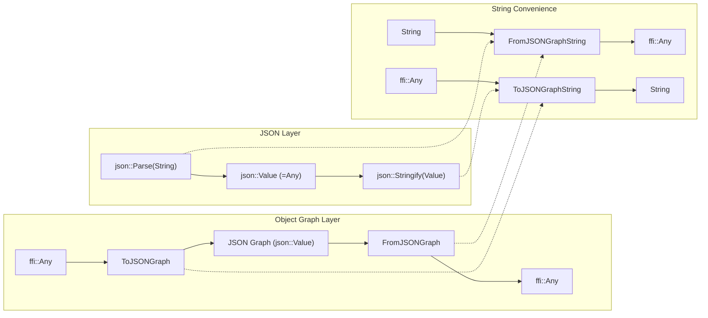
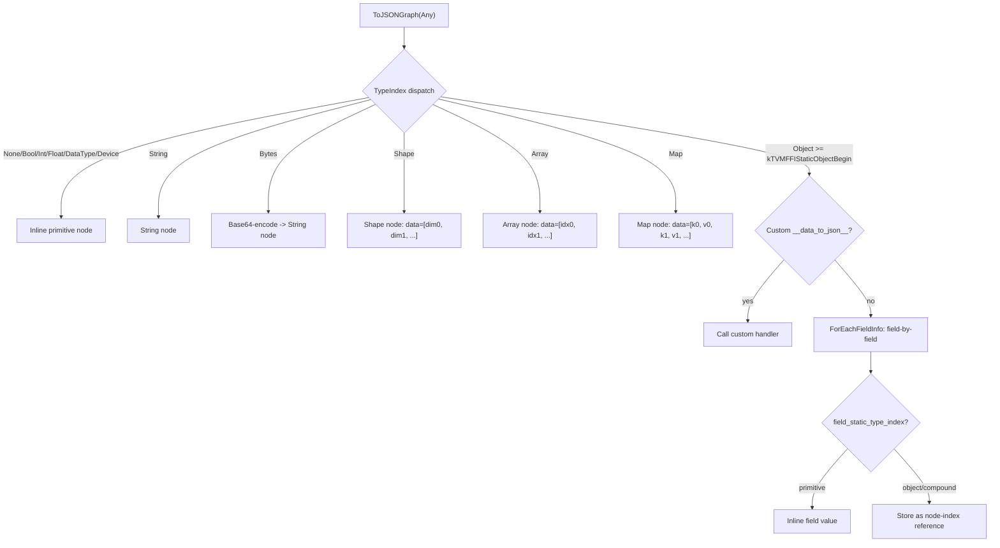

# JSON Parser/Writer and Object Graph Serialization

**TL;DR**
- A lightweight JSON parser (`json::Parse`) and writer (`json::Stringify`) in the `tvm::ffi::json` namespace provides standard JSON plus extended support for `Infinity`, `-Infinity`, `NaN`, and distinct `int64_t`/`double` round-tripping -- all reusing existing FFI types (`Any`, `Array<Any>`, `Map<Any, Any>`) with zero new Object subclasses.
- A reflection-based `ToJSONGraph`/`FromJSONGraph` serializer encodes arbitrary `ffi::Any` object graphs into a node-indexed JSON format that preserves type information, shared references, and supports round-tripping via field reflection and custom `__data_to_json__`/`__data_from_json__` TypeAttr hooks.
- String-based convenience wrappers (`ToJSONGraphString`/`FromJSONGraphString`) compose Parse/Stringify with the graph serializer for direct string-in/string-out cross-language use, registered as global functions for Python/Rust access.

## Problem Statement

### Background
- TVM FFI needs a JSON parser/writer for configuration, serialization, and debugging, but depends on no external libraries.
- Existing object graphs (IR nodes, typed containers, user-defined reflectable objects) need a serialization format that preserves type information, shared object identity, and supports arbitrary nesting.
- The serialization must work cross-language (C++ serializes, Python deserializes, and vice versa) with minimal glue code.

### Solution
- A minimal recursive-descent JSON parser and iterator-based writer, extended with JavaScript-style `NaN`/`Infinity` support and `int64_t`/`double` type fidelity.
- An object graph serializer that walks `Any` values using `TypeIndex` dispatch and reflection field metadata (`ForEachFieldInfo`), producing a flat node array with index-based references.
- Custom per-type serialization hooks via `__data_to_json__`/`__data_from_json__` TypeAttr columns enable non-reflectable types to participate in serialization.

### Goals
- **Goal**: Zero-dependency JSON parsing/writing with round-trip type fidelity (int64 vs double, NaN/Infinity).
- **Goal**: Reflection-based object graph serialization that works for any registered Object type without per-type boilerplate.
- **Goal**: Cross-language serialization via registered global functions.
- **Non-goal**: Not a general-purpose data exchange format; specifically for in-process FFI object persistence and debugging.

## Design



**JSON Graph Format**:
```json
{
  "root_index": <int>,
  "nodes": [{"type": "<type_key>", "data": <type_data>}, ...],
  "metadata": <object>
}
```



### Key Classes, Fields and Interfaces

**JSON Type Aliases** (`tvm::ffi::json` namespace, `include/tvm/ffi/extra/json.h`):
```cpp
namespace tvm::ffi::json {
  using Value  = Any;               // any JSON value
  using Object = ffi::Map<Any, Any>; // JSON object (insertion-order-preserving)
  using Array  = ffi::Array<Any>;    // JSON array
}
```

**JSON Parser/Writer** (`extra/json.h`):
```cpp
TVM_FFI_EXTRA_CXX_API json::Value Parse(const String& json_str, String* error_msg = nullptr);
TVM_FFI_EXTRA_CXX_API String Stringify(const json::Value& value, Optional<int> indent = std::nullopt);
```

**Object Graph Serialization** (`extra/serialization.h`):
```cpp
TVM_FFI_EXTRA_CXX_API json::Value ToJSONGraph(const Any& value, const Any& metadata = Any(nullptr));
TVM_FFI_EXTRA_CXX_API Any FromJSONGraph(const json::Value& value);
```

**String Convenience Wrappers** (registered as global functions):
```cpp
Any FromJSONGraphString(const String& value);
String ToJSONGraphString(const Any& value, const Any& metadata);
```

**Base64 Utilities** (`extra/base64.h`):
```cpp
inline String Base64Encode(TVMFFIByteArray bytes);
inline String Base64Encode(const Bytes& data);
inline Bytes Base64Decode(TVMFFIByteArray bytes);
inline Bytes Base64Decode(const String& data);
```

**ObjectCreator** (`reflection/creator.h`):
```cpp
namespace tvm::ffi::reflection {
class ObjectCreator {
public:
  explicit ObjectCreator(std::string_view type_key);
  explicit ObjectCreator(const TVMFFITypeInfo* type_info);
  Any operator()(const Map<String, Any>& fields) const;
private:
  const TVMFFITypeInfo* type_info_;
};
}
```
Used by the JSON graph deserializer for reflection-based object reconstruction. Validates that the type has reflection metadata and a creator function, then iterates `ForEachFieldInfo` to set each field from the map, applying defaults for missing fields with `kTVMFFIFieldFlagBitMaskHasDefault`.

**Internal Classes** (not public API):
- `JSONParserContext` -- cursor-based lexer with line/column tracking for Python-style error messages (`"line N column M (char K)"`).
- `JSONParser` -- recursive-descent parser dispatching on `JSONParserContext` state.
- `JSONWriter` -- `back_insert_iterator`-based serializer dispatching on `TypeIndex`.
- `ObjectGraphSerializer` -- builds a flat node array from an `Any` value tree, tracking object identity via `std::unordered_map<Object*, int>` to preserve shared references.
- `ObjectGraphDeserializer` -- reconstructs `Any` values from the node array, using `ObjectCreator` for reflection-based construction and `__data_from_json__` for custom types.

**TypeAttr Columns for Custom Serialization**:
- `"__data_to_json__"` -- `Function(const Object*) -> json::Value` (note: return type relaxed from `json::Object` to `json::Value`)
- `"__data_from_json__"` -- `Function(json::Value) -> Any`

**Global Function Registrations**:
| Name | Signature | Description |
|------|-----------|-------------|
| `ffi.json.Parse` | `(String) -> Any` | Parse JSON string |
| `ffi.json.Stringify` | `(Any, Optional<int>) -> String` | Serialize to JSON string |
| `ffi.ToJSONGraph` | `(Any, Any) -> json::Value` | Serialize to JSON object graph |
| `ffi.FromJSONGraph` | `(json::Value) -> Any` | Deserialize from JSON object graph |
| `ffi.ToJSONGraphString` | `(Any, Any) -> String` | Serialize to JSON graph string |
| `ffi.FromJSONGraphString` | `(String) -> Any` | Deserialize from JSON graph string |

**Type-to-Node Encoding Rules**:

| Type key | `data` encoding |
|----------|----------------|
| `None` | (absent) |
| `bool` | JSON boolean |
| `int` | JSON integer |
| `float` | JSON float (integers print as `X.0`) |
| `DataType` | string (e.g. `"int32"`, `"float64"`) |
| `Device` | `[device_type, device_id]` array |
| `ffi.String` | JSON string |
| `ffi.Bytes` | base64-encoded string |
| `ffi.Shape` | array of int64 dimensions |
| `ffi.Array` | array of node indices |
| `ffi.Map` | flat array of alternating key/value node indices |
| (Object) | JSON object with field names as keys; primitive fields inline, object fields as node indices |

### Contracts, Assumptions and Invariants
- **Round-trip type fidelity**: `Parse(Stringify(v))` preserves the distinction between `int64_t` and `double`. Integer-valued floats are printed as `X.0` to avoid confusion.
- **Extended JSON**: `NaN`, `Infinity`, `-Infinity` are valid tokens in both parsing and serialization, following JavaScript semantics. Under `-ffast-math` compilation, these are constructed/detected via IEEE 754 bit patterns (`0x7FF8000000000000ULL` for quiet NaN, `0x7FF0000000000000ULL`/`0xFFF0000000000000ULL` for +/-Inf) rather than `std::isnan`/`std::isinf`/`std::numeric_limits`, which may be broken.
- **Insertion-order determinism**: JSON objects are backed by `Map<Any, Any>`, which preserves insertion order. Serialized JSON key ordering is deterministic.
- **Shared object identity**: `ToJSONGraph` assigns a unique node index to each `Object*` pointer it encounters. Multiple references to the same object share one node entry, preserving identity on deserialization.
- **field_static_type_index determines inline vs. reference**: During object serialization, if a field's `field_static_type_index` is a primitive type, its value is inlined. Otherwise, it is stored as a node-index reference. This is the key dispatch rule for the graph serializer.
- **__data_to_json__ return type flexibility**: Custom `__data_to_json__` handlers may return any `json::Value` (not just `json::Object`), enabling compact representations for simple types.
- **Error-safe parsing**: `Parse` supports an optional `String* error_msg` out-parameter; when non-null, parse errors are reported via string rather than exception.
- **Base64 invariant**: `Base64Decode(Base64Encode(data)) == data` for all byte sequences. Base64-encoded strings are always a multiple of 4 characters with `=` padding.
- **UTF-8 string correctness** (d3b5532): JSON string control character detection casts `*cur_` to `uint8_t` before comparing against `' '` (0x20). On platforms where `char` is signed, bytes >= 0x80 (valid UTF-8 lead/continuation bytes) would be negative and falsely match `< ' '`. The fix ensures only bytes 0x00-0x1F are treated as control characters: `*reinterpret_cast<const uint8_t*>(cur_) < ' '`.

### Extension Points
- **Custom `__data_to_json__`/`__data_from_json__` TypeAttr hooks**: Register via `TypeAttrDef<T>().def(...)` for types needing non-reflection-based serialization (e.g., types without registered fields, or types needing compact representations).
- **New built-in type support**: The `TypeIndex` dispatch in `ObjectGraphSerializer`/`ObjectGraphDeserializer` can be extended with new cases for new built-in types (analogous to the `Shape` support added in commit `7cb9273`).
- **Metadata field**: `ToJSONGraph` accepts an optional `metadata` parameter attached to the root JSON object, enabling callers to embed version information, schema hints, or other context.

### Usage Examples

#### Parsing and Stringifying JSON
**Context**: Using the lightweight JSON parser for configuration or data exchange.
```cpp
#include <tvm/ffi/extra/json.h>
using namespace tvm::ffi;

// Parse a JSON string
json::Value val = json::Parse(R"({"name": "test", "count": 42, "items": [1, 2, 3]})");
auto obj = val.cast<json::Object>();

// Error-safe parsing (no exception on malformed input)
String err;
json::Value bad = json::Parse("{ invalid }", &err);
// err contains "Expecting property name enclosed in double quotes: line 1 column 3 (char 2)"

// Serialize to JSON string
json::Object data{{"key", "value"}, {"nums", json::Array{1, 2, 3}}};
String compact = json::Stringify(data);           // {"key":"value","nums":[1,2,3]}
String pretty  = json::Stringify(data, 2);        // pretty-printed with 2-space indent
```

#### Round-tripping an object graph through JSONGraph
**Context**: Serializing a composite object for persistence or debugging, then restoring it.
```cpp
#include <tvm/ffi/extra/serialization.h>
using namespace tvm::ffi;

// Serialize an Array of mixed types
Array<Any> arr;
arr.push_back(42);
arr.push_back(String("hello"));
json::Value graph = ToJSONGraph(arr);

// Deserialize back
Any restored = FromJSONGraph(graph);
Array<Any> restored_arr = restored.cast<Array<Any>>();
// restored_arr[0] == 42, restored_arr[1] == "hello"
```

#### Cross-language serialization via global functions (Python)
**Context**: Using the string-based serialization API from Python.
```python
from_json = tvm_ffi.get_global_func("ffi.FromJSONGraphString")
to_json = tvm_ffi.get_global_func("ffi.ToJSONGraphString")

# Serialize an object to a JSON string
json_str = to_json(my_object, None)

# Deserialize back
restored = from_json(json_str)
```

#### Custom per-type serialization hook
**Context**: Registering `__data_to_json__`/`__data_from_json__` for a type needing non-reflection serialization.
```cpp
refl::TypeAttrDef<TIntObj>()
    .def("__data_to_json__",
         [](const TIntObj* self) -> json::Value {
           return Map<String, Any>{{"value", self->value}};
         })
    .def("__data_from_json__", [](json::Value json_obj) -> TInt {
      return TInt(json_obj.cast<Map<String, Any>>()["value"].cast<int64_t>());
    });
```

### Evolution Timeline

| Commit | Change |
|--------|--------|
| `de541e3` | Initial JSON parser/writer: `json::Parse`, `json::Stringify`, `json::{Value,Object,Array}` type aliases, `ffi.json.Parse`/`ffi.json.Stringify` global functions |
| `8eaefe0` | JSONGraph serialization: `ToJSONGraph`, `FromJSONGraph`, `Base64Encode/Decode`, `__data_to_json__`/`__data_from_json__` TypeAttr columns |
| `7cb9273` | `ObjectCreator` helper, `Shape` serialization support, relaxed `CreateObjectData` return from `json::Object` to `json::Value` |
| `55edee0` | String convenience wrappers: `FromJSONGraphString`, `ToJSONGraphString`, global function registrations |
| `1a271f0` | Fastmath-safe float handling: IEEE 754 bit-level NaN/Inf construction and detection guarded by `__FAST_MATH__` |
| `3f4f4f1` | Fix strict-aliasing violation: replace `reinterpret_cast` with union type-punning in all `FastMathSafe*` helpers |
| `d3b5532` | Fix UTF-8 string parsing: cast `*cur_` to `uint8_t` before control character check to prevent signed-char platforms from rejecting non-ASCII bytes |

## Alternatives & Trade-offs
### Dedicated JsonValue/JsonObject/JsonArray object types
- Pros: Compile-time type safety for JSON operations; clearer intent in APIs.
- Cons: Introduces 3+ new Object subclasses, new type indices, new TypeTraits specializations. The chosen approach reuses `Any`/`Array<Any>`/`Map<Any, Any>` with zero new types, at the cost of losing compile-time key-type checking on `Map<Any, Any>` (runtime check at read time instead). See [ADR 0011](../ADRs/0011-json-reuses-any-no-new-objects.md).

### External JSON library (nlohmann/json, rapidjson)
- Pros: Battle-tested, feature-rich, well-optimized.
- Cons: Adds an external dependency to the FFI layer, which must remain dependency-free for embedded use. The internal parser is ~200 lines and sufficient for the use case.

## Related Work
### Design Docs & ADRs
- [0002-any-value-system.md](../designs/0002-any-value-system.md) -- `json::Value` is a type alias for `Any`
- [0008-containers.md](../designs/0008-containers.md) -- JSON arrays/objects backed by `Array<Any>`, `Map<Any, Any>`
- [0009-reflection.md](../designs/0009-reflection.md) -- `ForEachFieldInfo`, `ObjectCreator`, `TypeAttrColumn` for custom hooks
- [0010-extra-api-isolation.md](../ADRs/0010-extra-api-isolation.md) -- All code under `extra/`, gated by `TVM_FFI_USE_EXTRA_CXX_API`
- [0011-json-reuses-any-no-new-objects.md](../ADRs/0011-json-reuses-any-no-new-objects.md) -- Decision to reuse FFI types for JSON

### Evidence Matrix
- JSON parser/writer and type aliases -> `2025-08-04-de541e37ad38.md` + `extra/json.h`
- ToJSONGraph/FromJSONGraph and TypeAttr hooks -> `2025-08-05-8eaefe04a044.md` + `extra/serialization.h`
- ObjectCreator and Shape serialization -> `2025-08-05-7cb92736b2ed.md` + `reflection/creator.h`
- String convenience wrappers -> `2025-08-06-55edee051c78.md` + `extra/serialization.cc`
- Fastmath-safe float handling -> `2025-08-15-1a271f0032.md` + `extra/json_parser.cc`, `extra/json_writer.cc`
- Fastmath strict-aliasing fix (union type-punning) -> `2025-08-22-3f4f4f1118.md` + `extra/json_parser.cc`, `extra/json_writer.cc`
- UTF-8 signed-char fix in JSON string control char check -> `2026-02-11-d3b5532fe68ad0d76dd8e8636a000629a7ec4716.md` (d3b5532)
