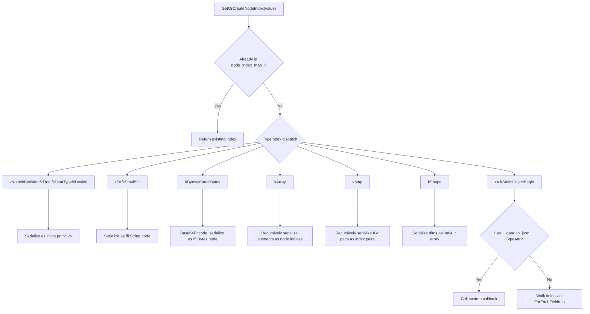

# JSON & Object Graph Serialization Design

**TL;DR**:
- A lightweight JSON parser/writer (`tvm::ffi::json`) built on the existing FFI type system (`Any`, `Array<Any>`, `Map<Any, Any>`, `String`), supporting standard JSON plus JavaScript-style `Infinity`/`NaN` and integer/float round-trip preservation.
- A reflection-based object graph serializer/deserializer (`ToJSONGraph`/`FromJSONGraph`) that preserves type information, DAG sharing, and multi-reference deduplication, with custom per-type hooks via `__data_to_json__`/`__data_from_json__` TypeAttr callbacks.
- `ObjectCreator` creates objects from type key + `Map<String, Any>` field map via reflection metadata, serving as the deserialization building block.
- All components are gated by `TVM_FFI_USE_EXTRA_CXX_API` and live under `include/tvm/ffi/extra/` and `src/ffi/extra/`.

## Problem Statement
### Background
- ML model serialization requires round-tripping complex FFI object graphs (IR nodes, shapes, tensors) through a portable text format.
- JSON is the natural interchange format, but standard JSON parsers lose integer/float distinction (both become `double`) and cannot handle `NaN`/`Infinity`.
- Serializing FFI objects requires type-preserving, DAG-aware, cross-language support. The reflection system already describes all object fields, types, and offsets, so serialization can be derived automatically.

### Solution
- **JSON layer**: A zero-overhead JSON representation using existing FFI types: `null` = `nullptr`, `bool`/`int64_t`/`double` as themselves, `String` for strings, `Array<Any>` for arrays, `Map<Any, Any>` for objects. A recursive descent parser and a type-index-dispatched writer convert between `String` and `json::Value`.
- **Object graph layer**: `ToJSONGraph` walks an `Any` value recursively, deduplicating shared objects via `Map<Any, int64_t>` node index mapping. `FromJSONGraph` reconstructs objects using `TVMFFITypeMetadata::creator` and field setters. Custom `__data_to_json__`/`__data_from_json__` TypeAttr callbacks allow per-type override.
- **String wrappers**: `ffi.ToJSONGraphString`/`ffi.FromJSONGraphString` global functions expose the serialization system to FFI callers (Python, Rust) that cannot construct `json::Value` objects.

### Goals
- Faithful round-trip of `int64_t` vs `double` through parse/stringify cycles.
- Preservation of object sharing (DAG structure) in serialized form.
- Automatic reflection-based serialization for all registered types.
- Custom per-type serialization hooks for types needing non-standard representation.
- Fastmath-safe parsing/writing of `NaN`/`Infinity` under `-ffast-math` compilation.
- Non-goals: streaming/incremental parsing; binary serialization formats.

## Design

### JSON Value Representation

JSON values are represented using existing FFI types with no new object classes:

| JSON Type | FFI Representation | TypeIndex |
|-----------|-------------------|-----------|
| `null` | `nullptr` | `kTVMFFINone` |
| `true`/`false` | `bool` | `kTVMFFIBool` |
| integer | `int64_t` | `kTVMFFIInt` |
| float | `double` | `kTVMFFIFloat` |
| string | `String` | `kTVMFFISmallStr` or `kTVMFFIStr` |
| array | `Array<Any>` | `kTVMFFIArray` |
| object | `Map<Any, Any>` | `kTVMFFIMap` |

Type aliases in the `tvm::ffi::json` namespace:
```cpp
using Value = Any;
using Object = ffi::Map<Any, Any>;  // Map<Any,Any> avoids key-type checking overhead
using Array = ffi::Array<Any>;
```

### JSON Parser

`JSONParserContext` handles character-level scanning (strings with full Unicode/surrogate-pair support, numbers, special values). `JSONParser` implements recursive descent with explicit temp stacks (`array_temp_stack_`, `object_temp_stack_`) to batch-construct arrays/objects at precise sizes, avoiding incremental `push_back`.

Number parsing rule: numbers without `.`/`e`/`E` are parsed as `int64_t`; numbers with fractional or exponent parts are parsed as `double`. This preserves the integer/float distinction critical for ML model serialization.

Extended syntax: `Infinity`, `-Infinity`, `NaN` are accepted as values, matching JavaScript conventions.

Error messages follow Python `json.loads` style: `"Expecting value: line 1 column 1 (char 0)"`.

### JSON Writer

`JSONWriter` dispatches on `value.type_index()` to serialize each FFI type. Output is via `std::back_insert_iterator<std::string>`. Indent tracking uses a `total_indent_` counter for pretty-printing.

Float serialization rules:
- Integer-valued doubles are written with `.0` suffix (e.g., `42.0` not `42`) to preserve the type distinction on round-trip.
- Non-integer doubles use `%.17g` for maximum precision.
- `NaN`/`Infinity`/`-Infinity` are written as literal tokens.

### Fastmath-Safe IEEE 754 Helpers

Under `-ffast-math`, the compiler may optimize away `std::isnan`/`std::isinf` checks and constant-fold `std::numeric_limits<double>::infinity()` incorrectly. Private helper methods on `JSONParserContext` and `JSONWriter` use bit-level construction/detection via anonymous-union-based type punning (`union { uint64_t from; double to; }`) to avoid GCC `-Werror=strict-aliasing` errors (changed from `reinterpret_cast` in commit 3f4f4f1):

```cpp
// Construction (parser):
static double FastMathSafePosInf();  // bit-cast 0x7FF0000000000000
static double FastMathSafeNegInf();  // bit-cast 0xFFF0000000000000
static double FastMathSafeNaN();     // bit-cast 0x7FF8000000000000

// Detection (writer):
static bool FastMathSafeIsNaN(double x);  // exponent=0x7FF, mantissa!=0
static bool FastMathSafeIsInf(double x);  // exponent=0x7FF, mantissa==0
```

These are guarded by `#ifdef __FAST_MATH__` and fall back to `std::` functions otherwise.

### Object Graph Serialization Schema

The JSON graph format is:
```json
{
  "root_index": <int>,
  "nodes": [<node>, ...],
  "metadata": <object>
}
```

Each node: `{"type": "<type_key>", "data": <type_data>}`

**Inline vs Reference dispatch rule**: For object fields whose `field_static_type_index` is a primitive type (Bool, Int, Float, DataType), the value is stored inline in the data object. Non-primitive fields are stored as node index references (integers pointing into the `nodes` array).

**Built-in type serialization**:
| Type | Format |
|------|--------|
| `ffi.String` | `{"type": "ffi.String", "data": "<string>"}` |
| `ffi.Bytes` | `{"type": "ffi.Bytes", "data": "<base64>"}` |
| `ffi.Array` | `{"type": "ffi.Array", "data": [<node_index>, ...]}` |
| `ffi.Map` | `{"type": "ffi.Map", "data": [[<key_index>, <val_index>], ...]}` |
| `ffi.Shape` | `{"type": "ffi.Shape", "data": [<dim0>, <dim1>, ...]}` |
| Registered objects | `{"type": "<type_key>", "data": {<field_name>: <value_or_index>, ...}}` |

### Serialization Dispatch Model



### Deserialization

`ObjectGraphDeserializer` supports lazy node decoding and arbitrary node ordering. For object types:
1. Look up `TVMFFITypeInfo` from the node's `"type"` key.
2. Check for `__data_from_json__` TypeAttr callback; if present, call it.
3. Otherwise, call `TVMFFITypeMetadata::creator` to make an empty instance, then set fields via reflection field setters.

### `__data_to_json__` / `__data_from_json__` Protocol

Per-type custom serialization hooks registered via `TypeAttrDef<T>`:

```cpp
// Custom serializer: (const TObj*) -> json::Value
// Custom deserializer: (json::Value) -> Any
refl::TypeAttrDef<MyObj>()
    .def("__data_to_json__", [](const MyObj* self) -> json::Object { ... })
    .def("__data_from_json__", [](json::Value data) -> MyObj { ... });
```

Dispatch is presence-based: if the TypeAttr column entry is non-null, the custom function is used; otherwise, reflection-based field walking is the default. This follows the same pattern as `__s_equal__`/`__s_hash__`.

The return type of `__data_to_json__` is `json::Value` (not restricted to `json::Object`), allowing types to serialize as arrays, scalars, or strings.

### ObjectCreator

A utility class that creates objects from a type key and a `Map<String, Any>` of field values:

```cpp
class ObjectCreator {
 public:
  explicit ObjectCreator(std::string_view type_key);
  explicit ObjectCreator(const TVMFFITypeInfo* type_info);
  Any operator()(const Map<String, Any>& fields) const;
};
```

Workflow:
1. Validate that the type has reflection metadata and a non-null `creator`.
2. Call `creator` to instantiate an empty object.
3. Iterate fields via `ForEachFieldInfo`:
   - If field name is in `fields`, set via `field_info->setter`.
   - If field has `kTVMFFIFieldFlagBitMaskHasDefault`, set the default.
   - Otherwise, throw `TypeError` for missing required field.
4. Validate no extra (unknown) fields were passed.

### String-Based FFI Entry Points

Since `json::Value` is a C++-only type that cannot be passed across the FFI boundary, string-based wrappers are the primary cross-language entry points:

| Global Function | Signature | Description |
|----------------|-----------|-------------|
| `ffi.json.Parse` | `(String json_str) -> json::Value` | Parse JSON string (throws on error) |
| `ffi.json.Stringify` | `(json::Value value, Optional<int> indent) -> String` | Serialize to JSON string |
| `ffi.ToJSONGraph` | `(Any value, Any metadata) -> json::Value` | Serialize to JSON graph (C++ only) |
| `ffi.FromJSONGraph` | `(json::Value value) -> Any` | Deserialize JSON graph (C++ only) |
| `ffi.ToJSONGraphString` | `(Any value, Any metadata) -> String` | Serialize to JSON graph string |
| `ffi.FromJSONGraphString` | `(String value) -> Any` | Deserialize from JSON graph string |

### Key Classes, Fields and Interfaces

| Symbol | Signature | Description |
|--------|-----------|-------------|
| `json::Value` | `using Value = Any` | Type alias for JSON value |
| `json::Object` | `using Object = Map<Any, Any>` | Type alias for JSON object |
| `json::Array` | `using Array = Array<Any>` | Type alias for JSON array |
| `json::Parse` | `TVM_FFI_EXTRA_CXX_API json::Value Parse(const String& json_str, String* error_msg = nullptr)` | Parse JSON with optional error output parameter |
| `json::Stringify` | `TVM_FFI_EXTRA_CXX_API String Stringify(const json::Value& value, Optional<int> indent = std::nullopt)` | Serialize to JSON string |
| `ToJSONGraph` | `TVM_FFI_EXTRA_CXX_API json::Value ToJSONGraph(const Any& value, const Any& metadata = Any(nullptr))` | Serialize any value to JSON object graph |
| `FromJSONGraph` | `TVM_FFI_EXTRA_CXX_API Any FromJSONGraph(const json::Value& value)` | Deserialize JSON object graph |
| `Base64Encode` | `inline String Base64Encode(TVMFFIByteArray bytes)` | Encode bytes to base64 string |
| `Base64Decode` | `inline Bytes Base64Decode(TVMFFIByteArray bytes)` | Decode base64 string to bytes |
| `reflection::ObjectCreator` | `class ObjectCreator { explicit ObjectCreator(string_view type_key); Any operator()(const Map<String, Any>& fields) const; }` | Create object from type key + field map |

### Contracts, Assumptions and Invariants
- **Integer/float round-trip**: Numbers without `.`/`e`/`E` are parsed as `int64_t`; with fractional parts as `double`. Integer-valued doubles are written with `.0` suffix. `json::Parse(json::Stringify(v))` preserves the `int64_t`/`double` type distinction.
- **DAG deduplication**: `ToJSONGraph` stores each unique object once in the `nodes` array. Shared references appear as repeated integer indices. `FromJSONGraph` reconstructs shared object identity from index equality.
- **Custom callback priority**: If `TypeAttrColumn["__data_to_json__"][type_index]` is non-null, the custom function is called instead of reflection-based field walking, regardless of field configuration.
- **ObjectCreator validation**: Throws `RuntimeError` if the type lacks reflection metadata or a creator. Throws `TypeError` for missing required fields or extra unknown fields.
- **Fastmath safety**: `NaN`/`Infinity` parsing and detection are correct even under `-ffast-math` via bit-level IEEE 754 operations.
- **Build gate**: All JSON and serialization code requires `TVM_FFI_USE_EXTRA_CXX_API=ON`.

### Extension Points
- New built-in types can be added to the serializer by extending the `TypeIndex` switch in `GetOrCreateNodeIndex`/`DecodeNode`.
- Custom `__data_to_json__`/`__data_from_json__` callbacks can return/consume any `json::Value` type, enabling arbitrary serialization formats per type.
- The `metadata` parameter in `ToJSONGraph` provides an extension point for attaching version info, provenance, or schema metadata to serialized graphs.
- `ObjectCreator` can be used independently of serialization for any reflection-based object factory use case.

### Usage Examples

#### Parsing and round-tripping JSON
**Context**: Parsing a JSON string and verifying integer/float distinction is preserved.
```cpp
#include <tvm/ffi/extra/json.h>
using namespace tvm::ffi;

// Parse a JSON object
auto val = json::Parse(R"({"layers": [1, 2.5, "conv"]})");
auto obj = val.cast<json::Object>();

// Integer vs float round-trip
auto v = json::Parse("42");
assert(v.type_index() == TypeIndex::kTVMFFIInt);
assert(json::Stringify(v) == "42");

auto f = json::Parse("42.0");
assert(f.type_index() == TypeIndex::kTVMFFIFloat);
assert(json::Stringify(f) == "42.0");
```

#### Serializing an object graph with shared references
**Context**: Round-tripping an FFI object graph through JSON, preserving sharing.
```cpp
#include <tvm/ffi/extra/serialization.h>

TVar x = TVar("x");
TFunc f({x}, {x, x}, "comment");

// Serialize: shared TVar(x) appears once in nodes array
json::Value encoded = ToJSONGraph(f);

// Deserialize: shared identity is reconstructed
Any decoded = FromJSONGraph(encoded);
```

#### Cross-language serialization via string wrappers
**Context**: Python code serializing/deserializing objects using global functions.
```python
import tvm_ffi

to_json = tvm_ffi.get_global_func("ffi.ToJSONGraphString")
from_json = tvm_ffi.get_global_func("ffi.FromJSONGraphString")

json_str = to_json(my_object, None)
restored = from_json(json_str)
```

#### Custom per-type serialization
**Context**: A type that needs non-standard JSON representation.
```cpp
TVM_FFI_STATIC_INIT_BLOCK() {
  namespace refl = tvm::ffi::reflection;
  refl::TypeAttrDef<TIntObj>()
      .def("__data_to_json__",
           [](const TIntObj* self) -> json::Object {
             return json::Object{{"value", self->value}};
           })
      .def("__data_from_json__", [](json::Value data) -> TInt {
        auto obj = data.cast<json::Object>();
        return TInt(obj[String("value")].cast<int64_t>());
      });
}
```

### Evolution Timeline
| Version | Commit | Change | Motivation |
|---------|--------|--------|------------|
| v1 | de541e3 | Initial JSON parser/writer with int64/double distinction, Infinity/NaN support | Lightweight JSON for ML model serialization |
| v2 | 8eaefe0 | `ToJSONGraph`/`FromJSONGraph` with reflection-based field walking, `__data_to_json__`/`__data_from_json__` TypeAttr protocol, Base64 utilities | DAG-aware object graph serialization |
| v3 | 7cb9273 | `ObjectCreator`, Shape serialization, relaxed `__data_to_json__` return type to `json::Value` | Generic object creation from field maps; Shape support |
| v4 | 55edee0 | `ffi.ToJSONGraphString`/`ffi.FromJSONGraphString` string wrappers | Cross-language FFI entry points |
| v5 | 1a271f0 | Fastmath-safe IEEE 754 bit-level helpers for NaN/Infinity | Correctness under `-ffast-math` compilation |
| v6 | 3f4f4f1 | Replace `reinterpret_cast` with union-based type punning in fast-math helpers | Fix GCC `-Werror=strict-aliasing` errors |

## Alternatives & Trade-offs
### Use nlohmann/json or RapidJSON as the JSON library
- Pros: Battle-tested; feature-complete; well-documented
- Cons: Adds a dependency; cannot directly represent values as `Any` (requires conversion layer); does not preserve `int64_t`/`double` distinction without custom number handling; cannot support `NaN`/`Infinity` without patching

### Serialize objects as flat key-value pairs instead of graph
- Pros: Simpler format; no node index indirection
- Cons: Cannot represent shared references (DAG structure collapses to tree with duplication); object identity is lost; serialized size grows exponentially for highly shared graphs

## Related Work
### Design Docs & ADRs
- `.knowledge/designs/any-system.md` -- `Any`/`AnyView` as the universal value container used by JSON values
- `.knowledge/designs/containers.md` -- `Array<Any>`, `Map<Any, Any>` used as JSON arrays/objects
- `.knowledge/designs/reflection.md` -- `ForEachFieldInfo`, `FieldGetter`/`FieldSetter`, `TVMFFITypeMetadata::creator`, `TypeAttrDef` used by the serialization system
- `.knowledge/ADRs/009-reflection-structural-eq-hash.md` -- `__s_equal__`/`__s_hash__` TypeAttr pattern that `__data_to_json__`/`__data_from_json__` follows

### Evidence Matrix
- JSON parser/writer -> `2025-08-04-de541e37ad38.md` + commit de541e3
- JSONGraph serialization + TypeAttr hooks -> `2025-08-05-8eaefe04a044.md` + commit 8eaefe0
- ObjectCreator + Shape serialization -> `2025-08-05-7cb92736b2ed.md` + commit 7cb9273
- String-based FFI wrappers -> `2025-08-06-55edee051c78.md` + commit 55edee0
- Fastmath-safe IEEE 754 helpers -> `2025-08-15-1a271f00321b.md` + commit 1a271f0
- Union-based type punning fix -> `2025-08-22-3f4f4f11184c.md` + commit 3f4f4f1
