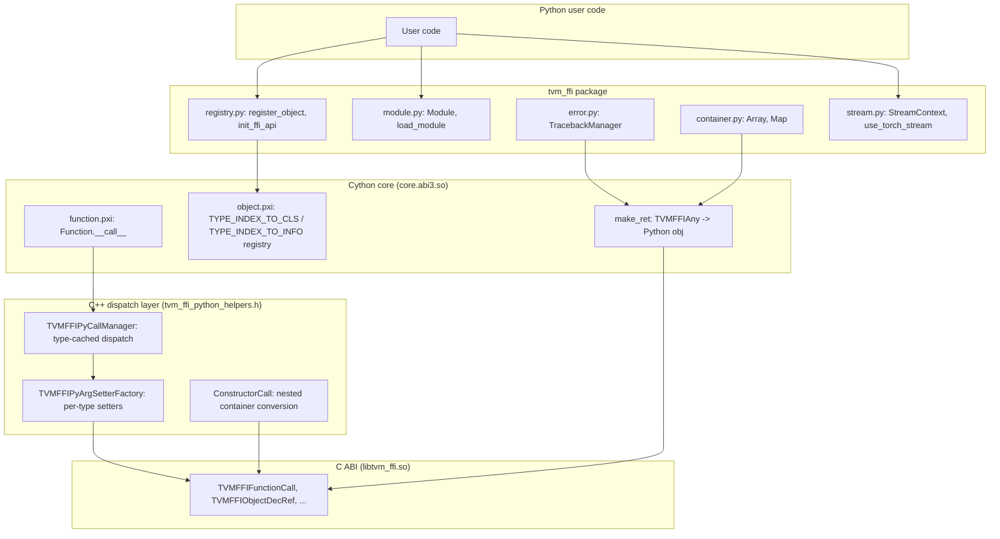
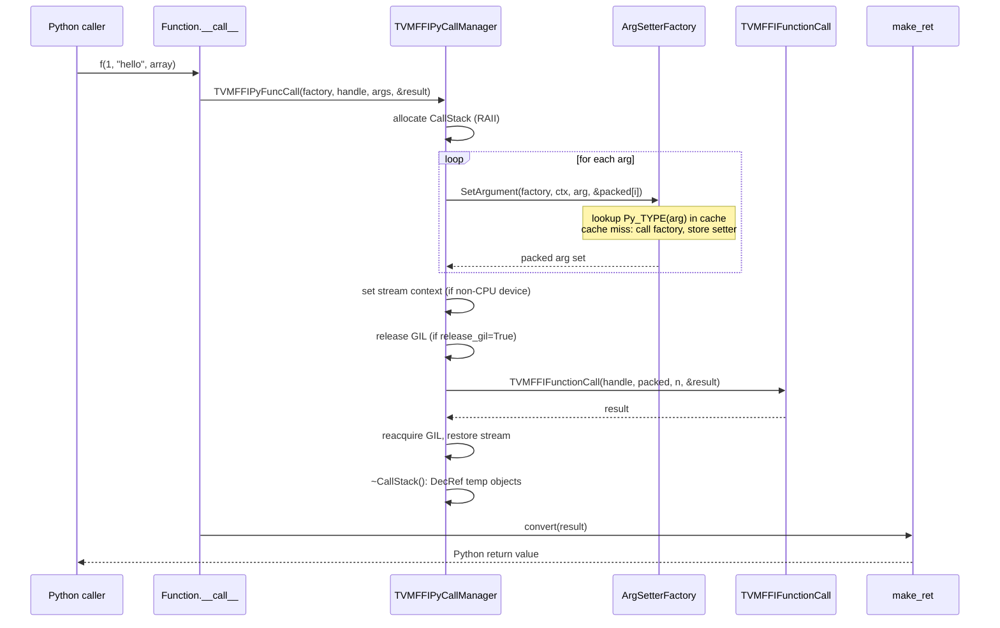

# Python Bindings: Cython FFI Bridge

**TL;DR**
- The `tvm_ffi` Python package provides high-performance Cython bindings to the C ABI, exposing all FFI primitives (Object, Function, NDArray, Array, Map, Module, etc.) to Python without ctypes overhead. A single native extension (`core.abi3.so` on Python >= 3.12) wraps the C ABI functions with optimized argument packing (`make_args`) and result conversion (`make_ret`).
- The `register_object` protocol maps C++ type keys to Python classes via a `TypeInfo`-based registry (`TYPE_INDEX_TO_INFO`, `TYPE_INDEX_TO_CLS`, `TYPE_KEY_TO_INFO`), automatically attaching reflected fields/methods via `_add_class_attrs`. Unregistered C++ types are auto-wrapped with fallback classes via `make_fallback_cls_for_type_index`. The `init_ffi_api` pattern (renamed from `_init_api` in `40f4d9d`) auto-populates Python modules from the C++ global function registry.
- Cross-language backtrace reconstruction via `TracebackManager` parses C++ backtrace strings and synthesizes Python frame objects, providing seamless error reporting across the FFI boundary.

## Problem Statement

### Background
- The C ABI provides stable binary interface functions (`TVMFFIFunctionCall`, `TVMFFIObjectDecRef`, etc.) but calling these from Python via ctypes has significant per-call overhead.
- Python users need Pythonic wrapper classes for FFI objects (Array as `collections.abc.Sequence`, Map as `collections.abc.Mapping`) with proper `__getitem__`, `__len__`, etc.
- When a C++ function raises an error, the Python caller needs a meaningful traceback that spans both languages, not a truncated Python-side traceback.

### Solution
- Compile Cython `.pxi` files into a single native extension that calls the C ABI directly via C-level function pointers, avoiding per-call marshaling overhead.
- Define a `register_object(type_key)` decorator that looks up the C++ type in the global type table and attaches reflected fields/methods to the Python class.
- Implement a `TracebackManager` that reconstructs Python frame objects from C++ traceback strings, enabling full cross-language tracebacks.

### Goals
- Zero-copy argument passing where possible (integers, floats stay as C values in `TVMFFIAny`).
- Automatic conversion between Python types and FFI values (list -> Array, dict -> Map, str -> String).
- Pythonic exception handling with cross-language tracebacks.
- Free-threaded Python (3.14t / PEP 703) is now supported via conditional GIL handling (b64b46f).

## Design

The Python binding layer operates at three levels:

1. **C++ dispatch layer** -- `TVMFFIPyCallManager` with `PyTypeObject*`-keyed cache dispatches arguments via per-type `TVMFFIPyArgSetter` functions, replacing the monolithic `make_args` (38d2cdaa). `make_ret` remains for result conversion.
2. **Object registration** -- `register_object` maps C++ types to Python classes with reflection-driven attribute access.
3. **Module/function bridging** -- `init_ffi_api` auto-populates Python modules from the global function registry.
4. **DLPack fast-path protocols** -- Unified `DLPackExchangeAPI` struct via `__dlpack_c_exchange_api__` class attribute (renamed from `__c_dlpack_exchange_api__` in 5393647) for zero-Python-overhead tensor exchange (22a7894). Backward compat via `_check_and_update_dlpack_c_exchange_api()` shim.
5. **Stream context managers** -- `StreamContext`, `use_torch_stream`, `use_raw_stream` for explicit stream save/restore (3197cd0).
6. **Dunder protocols for arg dispatch** -- `__tvm_ffi_object__` (generic Object backing, 8873700), `__tvm_ffi_value__` (generic value protocol, returns arbitrary proxy value for re-dispatch, 3dd7a817), `__cuda_stream__` (NVIDIA stream interop, b0537f0), `__tvm_ffi_env_stream__` (TLS stream context).
7. **Type stub generation** -- `tvm-ffi-stubgen` CLI tool generates inline TYPE_CHECKING stubs from FFI metadata (ea02e64). Extended with `--init-*` flags for whole-package stub bootstrapping (b58c2e3d), 3-stage pipeline, `lib_state.py` replacing `analysis.py`.
8. **Free-threaded Python** -- `TVMFFIPyWithGILIfNotFreeThreaded` RAII guard and `TVMFFIPyObjectDeleter` C++ helper for Py_GIL_DISABLED builds (b64b46f).
9. **kwargs wrapper utility** -- `tvm_ffi.utils.kwargs_wrapper` wraps positional-only callables with keyword argument support via `exec()`-based code generation (3115b237, 6bc1a8eb). MISSING sentinel for non-trivial defaults. Used by `c_class`/`py_class` init generation.





### Key Classes, Fields and Interfaces

```python
# === C++ call dispatcher (tvm_ffi_python_helpers.h, compiled into Cython extension) ===
# Replaced the monolithic make_args Cython function in commit 38d2cdaa.

class TVMFFIPyCallContext:
    """Per-call state tracking device/stream, DLPack converters, and temporary object lifetimes."""
    packed_args: Ptr[TVMFFIAny]       # workspace for packed arguments
    device_type: int                  # detected device type (-1 = unset)
    device_id: int                    # detected device id
    stream: Ptr[void]                 # detected stream
    dlpack_c_exchange_api: Ptr[DLPackExchangeAPI]  # unified API struct (22a7894, renamed from c_dlpack_exchange_api in 5393647)
    temp_ffi_objects: Ptr[Ptr[void]]  # temp FFI objects to DecRef after call
    num_temp_ffi_objects: int
    temp_py_objects: Ptr[Ptr[void]]   # temp Python objects to Py_DecRef after call
    num_temp_py_objects: int
    call_stack: Ptr[TVMFFIPyCallStack]           # pointer to owning call stack (3dd7a817)
    # Interacts with: TVMFFIPyCallStack (memory arena), all TVMFFIPyArgSetter* functions
    # Invariant: temp arrays are sized to num_args, each setter pushes at most 1 temp
    # Invariant: extra_temp_py_objects_stack cleanup handled in destructor (for __tvm_ffi_value__ re-dispatch)

class TVMFFIPyArgSetter:
    """Argument setter: function pointer + optional DLPack fast-path struct pointer."""
    func: Callable[[TVMFFIPyArgSetter, TVMFFIPyCallContext, PyObject, Ptr[TVMFFIAny]], int]
    dlpack_c_exchange_api: Ptr[DLPackExchangeAPI]  # renamed from c_dlpack_exchange_api (5393647)
    # Interacts with: TVMFFIPyCallManager.SetArgument (dispatch lookup)
    # Extension: new per-type setters registered by adding branches to TVMFFIPyArgSetterFactory_

class TVMFFIPyCallStack:
    """Thread-local memory arena for FFI call arguments. Extracted from TVMFFIPyCallManager (3dd7a817)."""
    args_stack: List[TVMFFIAny]                  # pre-allocated 4K page-aligned
    args_stack_top: int                          # current stack pointer
    extra_temp_py_objects_stack: List[PyObject]   # overflow temp storage for __tvm_ffi_value__ re-dispatch
    # Invariant: args_stack pre-sized to 4096 / sizeof(TVMFFIAny) slots
    # Invariant: extra_temp_py_objects_stack.reserve(16) at init

class TVMFFIPyCallManager:
    """Thread-local manager for FFI calls. Caches type dispatch and manages call stacks."""
    dispatch_map_: dict[PyTypeObject_ptr, TVMFFIPyArgSetter]  # thread-local, no locking
    call_stack_: TVMFFIPyCallStack                             # replaces temp_stack_/stack_top_ (3dd7a817)
    # Invariant: dispatch_map_ is thread-local, no locking needed
    # Invariant: TVMFFIPyCallContext uses RAII -- temps are cleaned up even on exception

    def FuncCall(self, setter_factory, func_handle, py_arg_tuple, result, c_api_ret_code) -> int: ...
        # 1. Allocate CallStack  2. SetArgument per arg  3. Set stream  4. Release GIL
        # 5. TVMFFIFunctionCall  6. Restore stream  7. CallStack destructor cleans temps
        # Interacts with: TVMFFIEnvSetStream (stream context), Py_BEGIN_ALLOW_THREADS

    def ConstructorCall(self, setter_factory, func_handle, py_arg_tuple, result,
                        c_api_ret_code, parent_ctx) -> int: ...
        # Recursive call for nested container conversion (list->Array, dict->Map)
        # Does NOT release GIL; propagates stream/device/allocator to parent_ctx
        # Interacts with: TVMFFIPyArgSetterTuple_, TVMFFIPyArgSetterMap_ (043d9f6)

    def SetArgument(self, setter_factory, ctx, py_arg, out) -> int: ...
        # Core dispatch: lookup Py_TYPE(py_arg) in dispatch_map_
        # Cache miss: call setter_factory, store result
        # Interacts with: dispatch_map_ (PyTypeObject* -> TVMFFIPyArgSetter)

# Top-level C-linkage entry points (called from Cython):
def TVMFFIPyFuncCall(setter_factory, func_handle, py_arg_tuple, result, c_api_ret_code) -> int: ...
def TVMFFIPyConstructorCall(setter_factory, func_handle, py_arg_tuple, result,
                            c_api_ret_code, parent_ctx) -> int: ...
def TVMFFIPyPushTempFFIObject(ctx: TVMFFIPyCallContext, arg: TVMFFIObjectHandle) -> None: ...
def TVMFFIPyPushTempPyObject(ctx: TVMFFIPyCallContext, arg: PyObject) -> None: ...

# Cython setter factory (function.pxi):
def TVMFFIPyArgSetterFactory_(value: PyObject, out: TVMFFIPyArgSetter) -> int: ...
    # Type dispatch (updated order, 8873700/b0537f0/22a7894):
    # None -> SetterNone_ | Tensor -> SetterTensor_ | Object -> SetterObject_
    # ObjectRValueRef -> SetterObjectRValueRef_
    # __tvm_ffi_object__ -> SetterFFIObjectProtocol_ (renamed from SetterFFIObjectCompatible_ in c1df05f)
    # __tvm_ffi_value__ -> TVMFFIPyArgSetterFFIValueProtocol_ (3dd7a817, generic value re-dispatch)
    # __dlpack_c_exchange_api__ -> SetterDLPackExchangeAPI_ (renamed from __c_dlpack_exchange_api__ in 5393647)
    # __cuda_stream__ -> SetterCUDAStreamProtocol_ (renamed from SetterCUDAStream_ in 6c85e56)
    # cuda_driver.CUstream -> SetterCUDADriverStreamFallback_ (6c85e56, temporary workaround)
    # torch.Tensor -> SetterTorchFallback_
    # __dlpack__ -> SetterDLPack_ (now checks arg_class, not arg)
    # PyNativeObject+str/bytes -> SetterPyNativeObject*_
    # bool -> SetterBool_ | int -> SetterInt_ | float -> SetterFloat_
    # Integral (numbers.Integral) -> SetterIntegral_ (c1df05f, dedicated for np.int32 etc.)
    # Real (numbers.Real) -> SetterReal_ (c1df05f, dedicated for np.float64 etc.)
    # dtype -> SetterDType_ | Device -> SetterDevice_ | str -> SetterStr_
    # bytes -> SetterBytes_ | tuple -> SetterTuple_ | list -> SetterTupleLike_
    # dict -> SetterMap_ | ObjectConvertible -> SetterObjectConvertible_
    # callable -> SetterCallable_
    # __tvm_ffi_opaque_ptr__ -> SetterFFIOpaquePtrCompatible_ (42e0612, passes void* via kTVMFFIOpaquePtr)
    # torch.dtype -> SetterDTypeFromTorch_ | numpy.dtype -> SetterDTypeFromNumpy_ (d77606a)
    # __dlpack_data_type__ -> SetterDLPackDataTypeProtocol_ (5e648f0, dtype exchange via 3-tuple)
    # __dlpack_device__ (without __dlpack__) -> SetterDLPackDeviceProtocol_ (0f8bf9f, device exchange via 2-tuple)
    # __tvm_ffi_int__ -> SetterIntProtocol_ (c1df05f, custom int protocol)
    # __tvm_ffi_float__ -> SetterFloatProtocol_ (c1df05f, custom float protocol)
    # Exception -> SetterException_ | (fallback) -> SetterFallback_
    # Invariant: same dispatch order as old make_args (bool before int, etc.)
    # Invariant: str/bytes now use TVMFFIStringFromByteArray/TVMFFIBytesFromByteArray (043d9f6)
    ...

def make_ret(result: TVMFFIAny) -> object:
    """Convert a TVMFFIAny result to Python object.
    Routes by type_index to appropriate handler:
    - kTVMFFINone -> None
    - kTVMFFIInt -> int
    - kTVMFFIBool -> bool
    - kTVMFFIFloat -> float
    - kTVMFFISmallStr -> str (inline SSO)
    - kTVMFFISmallBytes -> bytes (inline SSO)
    - kTVMFFIDataType -> dtype
    - kTVMFFIDevice -> Device
    - kTVMFFIDLTensorPtr -> Tensor (renamed from NDArray)
    - kTVMFFIOpaquePyObject -> OpaquePyObject.pyobject() (unwraps to original Python object)
    - >= kTVMFFIStaticObjectBegin -> TYPE_INDEX_TO_CLS[type_index]
      (fast path: direct list index, no attribute access; falls back to
       make_fallback_cls_for_type_index for unregistered types)
    """
    # Interacts with: TYPE_INDEX_TO_CLS (object.pxi, cdef list), TVMFFITypeIndex (c_api.h)
    # Invariant: object-typed results have already been IncRef'd by callee
    ...

# === Object registration (registry.py) ===

# === Type registration registries (object.pxi, Cython) ===

TYPE_INDEX_TO_INFO: list[TypeInfo | None] = []
# Primary registry: indexed by C++ type_index, stores full TypeInfo metadata.
# Replaced OBJECT_TYPE: dict[int, type].
# Interacts with: _register_object_by_index, _lookup_or_register_type_info_from_type_key

TYPE_INDEX_TO_CLS: list[type | None] = []
# Parallel registry: indexed by type_index, stores only the Python class.
# Eliminates attribute indirection on the make_ret hot path (035975a).
# Invariant: len(TYPE_INDEX_TO_CLS) == len(TYPE_INDEX_TO_INFO) at all times.
# Interacts with: make_ret_object (fast-path consumer), _register_object_by_index

TYPE_KEY_TO_INFO: dict[str, TypeInfo] = {}
# Keyed by type_key string. Enables lookup by name without type_index.
# Interacts with: _lookup_or_register_type_info_from_type_key

TYPE_CLS_TO_INFO: dict[type, TypeInfo] = {}
# Reverse-lookup: keyed by Python class, stores TypeInfo. Added in 6897a5f.
# Interacts with: _register_object_by_index (producer), _set_type_cls (producer),
#                 _type_cls_to_type_info (consumer)
# Invariant: every class with non-None value in TYPE_INDEX_TO_CLS also appears here.

def _type_cls_to_type_info(type_cls: type) -> TypeInfo | None:
    """Reverse lookup: given a Python class, return its TypeInfo or None."""
    # Interacts with: TYPE_CLS_TO_INFO dict

def _lookup_type_attr(type_index: int, attr_key: str) -> Any:
    """Look up a per-type attribute by type index and attribute name.
    Wraps TVMFFIGetTypeAttrColumn C API. Returns None when column is missing or
    type_index >= column.size."""
    # Interacts with: TVMFFIGetTypeAttrColumn (C ABI), make_ret (Cython result conversion)
    # Invariant: returns None (not raises) on missing column
    # Extension: used by stubgen, dataclass decorators, __repr__ dispatch

def _set_type_cls(type_info: TypeInfo, type_cls: type) -> None:
    """Late-bind a Python class to a TypeInfo that was registered with type_cls=None."""
    # Interacts with: TYPE_INDEX_TO_CLS, TYPE_INDEX_TO_INFO
    # Invariant: type_info.type_cls must be None (assert against double-registration)
    # Extension: enables two-phase registration -- metadata first, class later
    ...

def make_fallback_cls_for_type_index(type_index: int) -> type:
    """Auto-create a Python class for a C++ type with no registered Python class.
    Recursively creates parent classes first, then creates cls(parent_cls) with
    reflected fields as properties and methods as callables. Result cached in
    TYPE_INDEX_TO_CLS for all subsequent returns (98cb8af)."""
    # Invariant: called exactly once per unregistered type_index
    # Interacts with: _lookup_or_register_type_info_from_type_key, _update_registry
    # Interacts with: TypeInfo.parent_type_info (resolved via type_ancestors)
    ...

def register_object(type_key: str | type | None = None) -> Callable[[type], type] | type:
    """Register a Python class for a C++ object type by its type_key.
    1. Call core._object_type_key_to_index(type_key) -> type_index
    2. Call core._register_object_by_index(type_index, cls) -> TypeInfo
    3. Call _add_class_attrs(type_cls=cls, type_info=info)
       to attach reflected fields as Python descriptors and methods as bound callables.
    """
    # Interacts with: C ABI TVMFFITypeKeyToIndex, TVMFFIGetTypeInfo
    # Interacts with: ObjectDef<T> (0008-reflection) -- source of field/method metadata
    # Extension: user-defined Python classes can override reflected methods
    ...

def register_global_func(func_name: str, f: Callable = None,
                         override: bool = False) -> Callable:
    """Register a Python callable into the global packed function registry.
    Renamed from register_func in 40f4d9d."""
    # Interacts with: core._register_global_func -> TVMFFIFunctionSetGlobal
    # Invariant: f is wrapped into an FFI Function via _new_func_from_pycallback
    ...

def get_global_func(name: str, allow_missing: bool = False) -> Optional[Function]:
    """Retrieve a global packed function by name."""
    # Interacts with: core._get_global_func -> TVMFFIFunctionGetGlobal
    # Failure mode: raises AttributeError if not found and allow_missing=False
    ...

def init_ffi_api(namespace: str, target_module_name: str = None) -> None:
    """Auto-populate a Python module with all global functions matching a namespace prefix.
    Renamed from _init_api in 40f4d9d.
    Steps:
    1. Get list of all global function names via "ffi.FunctionListGlobalNamesFunctor"
    2. Filter those starting with namespace + "."
    3. For each matching name, get_global_func and set as module attribute
       (strip namespace prefix, replace '.' with '_')
    """
    # Interacts with: global function registry, Python module __dict__
    # Pattern: _ffi_api.py modules call init_ffi_api("ffi", __name__)
    # Invariant: target_module_name defaults to caller's __name__ via stack inspection
    ...

# === Type conversion (_convert.py, was convert.py before 40f4d9d) ===

def convert(value: Any) -> Any:
    """Convert Python objects to FFI-compatible values.
    Dispatch order:
    1. Object -> pass through
    2. PyNativeObject -> pass through
    3. bool -> int (FFI bool)
    4. Number (int/float) -> FFI int/float
    5. list/tuple -> Array
    6. dict -> Map
    7. str -> String
    8. bytes -> Bytes
    9. callable -> Function
    10. __dlpack__ -> Tensor (was NDArray)
    10a. torch.dtype -> DataType (via TORCH_DTYPE_TO_DL_DATA_TYPE lookup, d77606a)
    10b. numpy.dtype -> DataType (via NUMPY_DTYPE_TO_DL_DATA_TYPE lookup, d77606a)
    11. Exception -> Error
    12. (fallback) -> OpaquePyObject (wraps unknown types, 91d69f0)
    """
    # NOTE: _set_func_convert_to_object callback removed (043d9f6) -- nested container
    #   conversion is now handled by dedicated Cython setters (SetterTuple_, SetterMap_)
    #   via TVMFFIPyConstructorCall, propagating stream/device context correctly.
    ...

# === Cross-language error handling (error.py) ===

class TracebackManager:
    """Manages cross-language traceback reconstruction.
    Creates Python code objects and frame objects from C++ traceback strings
    (format: 'File "filename", line N, in function\\n  code...').
    Caches compiled code objects keyed by (filename, lineno, funcname) for performance.
    """
    _cache: dict[tuple[str, int, str], CodeType]

    def append_traceback(self, tb: TracebackType,
                         filename: str, lineno: int, func: str) -> TracebackType:
        """Create a synthetic Python traceback frame and append it to the chain.
        Uses nested create() function to avoid storing frame as a local, preventing
        reference cycles through f_back (6ccbdb6b)."""
        # Invariant: synthesized frame is never a local of append_traceback -- avoids cycle
        # Interacts with: Python internals (types.CodeType, ctypes for frame creation)
        ...

    # Interacts with: Cython make_ret (on error result), TLS error propagation (0005-error-system)
    # Invariant: C++ traceback string is parsed line by line; unrecognized lines are skipped
    # Invariant: _with_append_backtrace uses try/finally: del py_error, tb to break cycles (6ccbdb6b)

def register_error(name_or_cls: str | type, cls: type = None) -> type:
    """Register a Python exception class for C++ error kind mapping.
    Built-in registrations: RuntimeError, ValueError, TypeError,
    AttributeError, KeyError, IndexError, AssertionError.
    """
    # Interacts with: core.ERROR_NAME_TO_TYPE, core.ERROR_TYPE_TO_NAME
    # Extension: user code can register custom exception types for custom error kinds
    ...

# === PyNativeObject pattern ===

class PyNativeObject:
    """Mixin for Python classes that are simultaneously a Python builtin
    and have an FFI Object backing store.

    Example: Shape subclasses both `tuple` (for Pythonic indexing) and has
    a `_tvm_ffi_cached_object` attribute that stores the backing ffi::Shape.

    The pattern: class Shape(tuple, PyNativeObject): ...
    """
    _tvm_ffi_cached_object: Object | None  # Internal cached FFI Object (renamed from __tvm_ffi_object__, 8873700)
    # Interacts with: make_args (checks PyNativeObject before generic handling)
    # Interacts with: convert (passes through PyNativeObject unchanged)
    # Extension: user-defined classes can use this pattern for custom dual-typed objects

    def __init_cached_object_by_constructor__(self, fconstructor: Function, *args: Any) -> None:
        """Create FFI backing object via constructor. Renamed from __init_tvm_ffi_object_by_constructor__ (8873700)."""
        ...

    @classmethod
    def __from_tvm_ffi_object__(cls, obj: Object) -> "PyNativeObject":
        """Class method called by make_ret to construct a PyNativeObject from FFI."""
        ...

# === __tvm_ffi_object__ protocol (8873700, generalized from __tvm_ffi_tensor__ 4bc8925) ===

class TVMFFIObjectCompatible(Protocol):
    """Any Python class implementing this protocol can be passed directly
    to FFI calls. Returns a backing Object (not just Tensor)."""
    def __tvm_ffi_object__(self) -> Object: ...
    # Interacts with: TVMFFIPyArgSetterFFIObjectCompatible_ (dispatched via TVMFFIPyArgSetterFactory_)
    # Invariant: must return a valid Object (not None)
    # Invariant: setter reads type_index dynamically via TVMFFIObjectGetTypeIndex (not hardcoded)
    # Extension: any wrapper class holding an FFI Object can implement this

# === Opaque Python object wrapping (91d69f0) ===

class OpaquePyObject(Object):
    """Python wrapper for opaque PyObject containers.
    When convert() encounters an unknown type, it wraps it as OpaquePyObject
    instead of raising TypeError."""
    def pyobject(self) -> object: ...
        # Retrieves original Python object from handle via PyObject* cast
        # Invariant: returned object is same identity as original (is-check passes)
        # Interacts with: TVMFFIOpaqueObjectGetCellPtr

# === DLPackExchangeAPI unified struct (22a7894, supersedes f81ab9c/4dee97f) ===

class DLPackExchangeAPIHeader:
    """Versioned header for chaining APIs."""
    version: DLPackVersion          # major, minor
    prev_api: Optional[Ptr[DLPackExchangeAPIHeader]]   # linked list for API evolution

class DLPackExchangeAPI:
    """Unified struct bundling all DLPack exchange function pointers.
    Replaces separate __c_dlpack_from_pyobject__, __c_dlpack_to_pyobject__,
    __c_dlpack_tensor_allocator__ class attributes (DLPack proposal #175)."""
    header: DLPackExchangeAPIHeader
    managed_tensor_allocator: Optional[DLPackManagedTensorAllocator]
    managed_tensor_from_py_object_no_sync: Optional[DLPackManagedTensorFromPyObjectNoSync]
    managed_tensor_to_py_object_no_sync: Optional[DLPackManagedTensorToPyObjectNoSync]
    dltensor_from_py_object_no_sync: Optional[DLPackDLTensorFromPyObjectNoSync]  # non-owning DLTensor conversion
    current_work_stream: Optional[DLPackCurrentWorkStream]  # explicit stream query
    # Interacts with: TVMFFIPyArgSetterDLPackExchangeAPI_ (Cython consumer)
    # Interacts with: TVMFFIPyCallContext.dlpack_c_exchange_api (per-call context, renamed from c_dlpack_exchange_api in 5393647)
    # Invariant: each field is nullable -- NULL means capability not provided
    # Extension: implement per-framework (TorchDLPackExchangeAPI, test wrapper, fallback)

# Python dunder protocol (set on torch.Tensor by Torch addon):
# torch.Tensor.__dlpack_c_exchange_api__ : PyCapsule  (renamed from __c_dlpack_exchange_api__ in 5393647)
# Backward compat: _check_and_update_dlpack_c_exchange_api() detects old attribute and migrates
# Interacts with: TVMFFIPyArgSetterFactory_ (detects __dlpack_c_exchange_api__ on type(arg))
# Interacts with: TVMFFIPyCallManager.FuncCall (uses struct for return conversion)
# Interacts with: _from_dlpack_universal() (consumer path, routes through _get_dlpack_exchange_api(), fixed in 4147ba7d)
# Extension: any framework can implement the struct for fast-path DLPack exchange
# See ADR: [0015-dlpack-exchange-api-struct.md](../ADRs/0015-dlpack-exchange-api-struct.md)

# from_dlpack consumer path priority chain (7f3f872):
# 1. __dlpack_c_exchange_api__ -> _get_dlpack_exchange_api() -> _from_dlpack_exchange_api() [highest priority, fast-path]
# 2. __dlpack__ -> _from_dlpack() or _from_dlpack_versioned() [standard DLPack protocol]
# 3. PyCapsule -> _from_dlpack_versioned() or _from_dlpack() [raw capsule]
# Invariant: on conversion failure via exchange API, managed tensor deleter is called (leak-safety)
# Invariant: falls back to __dlpack__ on BufferError from exchange API path

# === __tvm_ffi_env_stream__ protocol (db98729) ===

# Any object implementing __dlpack__ can ALSO implement this dunder to provide its
# current execution stream to TVM FFI's thread-local context:
#   def __tvm_ffi_env_stream__(self) -> int:  # stream handle as integer
# Invariant: only consulted for non-CPU devices (device_type != kDLCPU)
# Invariant: only the FIRST non-CPU tensor's stream is used per FFI call
# Extension: any framework (JAX, CuPy, custom) can implement this protocol

# === Stream context managers (stream.py, 3197cd0) ===

class StreamContext:
    """Python context manager for save/restore of FFI env stream."""
    device_type: int; device_id: int; stream: int; prev_stream: int
    def __enter__(self) -> None: ...
        # Calls core._env_set_current_stream(device_type, device_id, stream)
        # Saves prev_stream for restore
    def __exit__(self, *args) -> None: ...
        # Restores prev_stream; always restores even on exception
    # Interacts with: TVMFFIEnvSetStream (C ABI via Cython)

class TorchStreamContext:
    """Bridge torch.cuda.Stream/CUDAGraph to FFI env stream."""
    def __enter__(self) -> None: ...
        # 1. Enter torch context  2. Read torch.cuda.current_stream()  3. Create StreamContext
    def __exit__(self, *args) -> None: ...
        # 1. Exit torch context  2. Exit StreamContext

def use_torch_stream(context: Optional[Any] = None) -> TorchStreamContext: ...
    # Factory: accepts torch.cuda.stream() or torch.cuda.graph(), or None for current stream
def use_raw_stream(device: Device, stream: Union[int, c_void_p]) -> StreamContext: ...
    # Factory: creates StreamContext with validation

class Function(Object):  # cdef class in Cython (promoted from plain class in f81ab9c)
    release_gil: bool  # default: True (env TVM_FFI_RELEASE_GIL_BY_DEFAULT)
    # Per-function GIL control; short-running functions can set release_gil = False

    @staticmethod
    def __from_extern_c__(c_symbol: int, *, keep_alive_object: object | None = None) -> Function:
        """Construct a Function from a raw C function pointer (TVMFFISafeCallType).
        Added in a153647; keep_alive_object became keyword-only in f6303b2."""
        # Interacts with: TVMFFIFunctionCreate, ExternCFunctionObjImpl / ExternCFunctionObjNullHandleImpl
        # Invariant: if keep_alive_object is not None, Py_INCREF'd and stored as closure
        # Extension: JIT engines pass their engine object as keep_alive_object

    @staticmethod
    def __from_mlir_packed_safe_call__(
        mlir_packed_symbol: int, *, keep_alive_object: object | None = None
    ) -> Function:
        """Construct a Function from an MLIR packed safe call function pointer void(*)(void**).
        Added in f6303b2."""
        # Uses TVMFFIPyMLIRPackedSafeCall C++ adapter (tvm_ffi_python_helpers.h)
        # MLIR arg layout: void*[] = {&handle, &args, &num_args, &rv, &ret_code}
        # Interacts with: TVMFFIFunctionCreate, TVMFFIPyMLIRPackedSafeCall

# === Free-threaded Python support (b64b46f) ===

class TVMFFIPyWithGILIfNotFreeThreaded:
    """RAII guard: acquires GIL in normal Python, no-op in free-threaded (Py_GIL_DISABLED).
    Compile-time dispatch via #if defined(Py_GIL_DISABLED)."""
    # Interacts with: TVMFFIPyObjectDeleter (sole consumer)

def TVMFFIPyObjectDeleter(py_obj: void_ptr) -> None:
    """extern 'C' deleter for Python objects held by FFI.
    Replaces Cython-level tvm_ffi_pyobject_deleter (which used 'with gil'). Added in b64b46f."""
    # Interacts with: TVMFFIFunctionCreate (callback deleter), TVMFFIObjectCreateOpaque
    # Invariant: marked noexcept -- must not propagate Python exceptions

# === tvm-ffi-stubgen CLI tool (ea02e64, refactored in 1af6d9f, extended 92e150b, b58c2e3d) ===
# Generates inline TYPE_CHECKING stubs from FFI runtime metadata.
# Decomposed into staged pipeline: cli.py, file_utils.py, codegen.py, lib_state.py (was analysis.py), consts.py, utils.py
# Data-oriented codegen model (92e150b): FuncInfo, ObjectInfo, NamedTypeSchema in utils.py
#   FuncInfo encapsulates function schema + member/static status; gen() produces stub line
#   ObjectInfo encapsulates fields + methods; gen_fields()/gen_methods() produce stub lines
#   NamedTypeSchema extends TypeSchema with a name attribute
#   FN_NAME_MAP in consts.py: {"__ffi_init__": "__c_ffi_init__"} for FFI-to-Python name mapping
#   ImportItem (b58c2e3d): structured import tracking; groups by module, separates TYPE_CHECKING
#   InitConfig (b58c2e3d): --init-pypkg, --init-lib, --init-prefix configuration (all-or-nothing)
#
# 3-stage pipeline (b58c2e3d, was 2-stage):
#   Stage 1: ty_maps collected inline in cli.py
#   Stage 2: generate missing _ffi_api.py / __init__.py files (NEW, via --init-* flags)
#   Stage 3: per-file: generate_global_funcs, generate_object, generate_import_section (was generate_imports)
#   generate_all: populates __all__ blocks with CONST > PascalCase > snake_case ordering
#
# Marker protocol in source files:
#   # tvm-ffi-stubgen(begin): global/<prefix>             -- global function stub block
#   # tvm-ffi-stubgen(begin): global/<prefix>@<module>    -- extended with @import-from (b58c2e3d)
#   # tvm-ffi-stubgen(begin): object/<type_key>           -- object type stub block
#   # tvm-ffi-stubgen(begin): import-section              -- auto-generated import block (renamed from "import" in b58c2e3d)
#   # tvm-ffi-stubgen(begin): __all__                     -- auto-generated __all__ list
#   # tvm-ffi-stubgen(begin): export/<submodule>          -- NEW: re-export block for __init__.py (b58c2e3d)
#   # tvm-ffi-stubgen(import-object): <from>;<tc_only>;<alias>  -- NEW: explicit import declaration (b58c2e3d)
#   # tvm-ffi-stubgen(end)                                -- end stub block
#   # tvm-ffi-stubgen(ty-map): A.B -> C                   -- type name remapping
#   # tvm-ffi-stubgen(skip-file)                          -- skip entire file
# Supersedes _ffi_api.pyi sidecar pattern.
# Registered as: [project.scripts] tvm-ffi-stubgen = "tvm_ffi.stub.cli:__main__"
# lib_state.py (b58c2e3d, replaces analysis.py): collect_global_funcs, collect_type_keys, object_info_from_type_key
#   toposort_objects: ensures parent classes emitted before children
# Interacts with: get_global_func_metadata, TypeSchema.repr(ty_map), list_global_func_names,
#                 _lookup_or_register_type_info_from_type_key, get_registered_type_keys

# === DLDeviceType enum (40f4d9d) ===

class DLDeviceType(IntEnum):
    """Standalone enum mapping to DLDeviceType from DLPack specification.
    Extracted from Device class attributes in 40f4d9d."""
    kDLCPU = 1
    kDLCUDA = 2
    kDLCUDAHost = 3
    # ... (16 total values)
    # Interacts with: Device._DEVICE_NAME_TO_TYPE, DLPack C ABI

# === ObjectConvertible (was ObjectGeneric, renamed 40f4d9d) ===

class ObjectConvertible:
    """Base class for objects convertible to FFI Object."""
    def asobject(self) -> Object: ...
    # Interacts with: make_args (isinstance check), convert()

# === Device property API (updated 40f4d9d) ===

class Device:
    """Thin wrapper around DLDevice in DLPack standard."""
    # Constructor: Device(device_type, index: Optional[Integral]=None)
    # index widened from int to numbers.Integral (a7ebc65f): accepts numpy int scalars directly
    # .item() fallback for objects like torch.tensor(1) that are not Integral but expose .item()
    # Invariant: after coercion, index must be Integral; TypeError raised otherwise
    @property
    def type(self) -> str: ...          # device type as string ("cpu", "cuda", etc.)
    @property
    def index(self) -> int: ...         # was device_id
    def dlpack_device_type(self) -> int: ...  # was device_type property returning int
    # Interacts with: DLDeviceType enum, DLDevice C struct

# === Module wrapper (module.py) ===

@register_object("ffi.Module")
class Module(Object):
    """Python wrapper for ffi::Module."""

    def get_function(self, name: str, query_imports: bool = False) -> Function: ...
    def get_function_metadata(self, name: str, query_imports: bool = False) -> dict[str, Any] | None: ...
        # Returns parsed JSON dict (key: "type_schema") or None. Added in ac7bf68.
        # Interacts with: _ffi_api.ModuleGetFunctionMetadata, json.loads
    def get_function_doc(self, name: str, query_imports: bool = False) -> str | None: ...
        # Returns docstring or None. Added in ac7bf68.
        # Interacts with: _ffi_api.ModuleGetFunctionDoc
    def import_module(self, module: "Module") -> None: ...
    def write_to_file(self, file_name: str, fmt: str = "") -> None: ...
    def inspect_source(self, fmt: str = "") -> str: ...
    def get_property_mask(self) -> int: ...
    def __call__(self, *args) -> Any: ...
        # Invariant: delegates to entry_func (__tvm_ffi_main__)
    def __getattr__(self, name: str) -> Function: ...
        # Caches looked-up functions in __dict__
    # Interacts with: ModuleObj (0011-module-system), _ffi_api.ModuleLoadFromFile

def load_module(path: str | PathLike) -> Module: ...
    # Widened from str to str | PathLike (af898a2). Uses os.fspath() to coerce PathLike -> str.
    # Interacts with: _ffi_api.ModuleLoadFromFile -> Module::LoadFromFile

def system_lib(symbol_prefix: str = "") -> Module: ...
    # Interacts with: _ffi_api.SystemLib -> SystemLibrary
```

### Contracts, Assumptions and Invariants
- **make_args None zeroing**: When packing `None` as an argument, both `type_index = kTVMFFINone` AND `v_int64 = 0` must be set. Missing the zero caused non-deterministic behavior from stack garbage (fixed in commit `3702e50`).
- **Bool-before-int ordering**: In `make_args`, the `isinstance(arg, bool)` check must precede `isinstance(arg, int)` because Python `bool` is a subclass of `int`. Reversing the order silently converts `True/False` to `1/0` integers.
- **Fallback class auto-creation**: If `make_ret` encounters a type_index where `TYPE_INDEX_TO_CLS[tindex]` is `None`, it calls `make_fallback_cls_for_type_index(tindex)` to auto-create a Python class with reflected fields/methods. This runs once per type; the result is cached. Replaces the old behavior (warning + bare `Object`). Two triggers: (1) `tindex >= len(TYPE_INDEX_TO_CLS)`, (2) `TYPE_INDEX_TO_CLS[tindex] is None` (98cb8af, d68c8d8).
- **Torch CUDA stream propagation**: When `make_args` encounters a `torch.Tensor` on CUDA, it records the current CUDA stream and device for the C ABI call. The stream resolution uses `torch._C._cuda_getCurrentRawStream(device_id)` (the same internal API used by torch dynamo), eliminating the need for JIT compilation (simplified from `load_torch_get_current_cuda_stream` in `1b07159`).
- **numpy/torch/ml_dtypes are optional**: `TORCH_DTYPE_TO_DL_DATA_TYPE`, `NUMPY_DTYPE_TO_DL_DATA_TYPE`, `MLDTYPES_DTYPE_TO_DL_DATA_TYPE` lookup tables (d77606a) are populated only when the respective packages are importable. `torch.dtype` and `numpy.dtype` objects can be passed directly as FFI arguments via dedicated arg setters.
- **ByteArrayArg lifetime**: In Cython code, `ByteArrayArg` instances must be stored in named `cdef` variables when their `.cptr()` is passed to C functions. Temporaries may be destroyed before the C function reads the pointer (fixed in 8e471b0).
- **OpaquePyObject fallback**: `convert()` no longer raises `TypeError` for unknown types. Instead, it wraps them as `OpaquePyObject` via `_convert_to_opaque_object()`, which calls `TVMFFIObjectCreateOpaque` with `Py_INCREF` to retain the Python object. `make_ret` unwraps back to the original Python object with identity preserved (added `91d69f0`).
- **Type dispatch cache**: `TVMFFIPyCallManager` caches `PyTypeObject* -> TVMFFIPyArgSetter` in a thread-local map. No cache invalidation is needed because Python types are immutable. Cache miss calls the Cython `TVMFFIPyArgSetterFactory_` which does the isinstance chain once per type per thread (38d2cdaa).
- **Type keep-alive for dispatch cache**: `_DISPATCH_TYPE_KEEP_ALIVE` (a module-level `set` in `function.pxi`, guarded by `threading.Lock`) retains strong references to every `PyTypeObject*` seen by `TVMFFIPyArgSetterFactory_`. This prevents a locally-defined type from being garbage collected and its address reused by a new type, which would cause the C++ dispatch cache to apply the wrong arg setter. The lock prepares for free-threaded Python (PEP 703). The number of distinct types is expected to be small (cfff30b).
- **GIL release default**: `Function.release_gil` defaults to `True` (env `TVM_FFI_RELEASE_GIL_BY_DEFAULT`). The GIL is released around `TVMFFIFunctionCall` inside `TVMFFIPyCallManager::FuncCall`, but NOT around `ConstructorCall` (container construction is cheap) (f81ab9c).
- **Nested container context propagation**: When `list`/`dict` arguments are converted to `Array`/`Map` via `TVMFFIPyConstructorCall`, the child call context propagates `device_type`, `device_id`, `stream`, and `c_dlpack_tensor_allocator` back to the parent context, ensuring torch CUDA stream context is captured from tensors nested inside containers (043d9f6).
- **make_tensor_from_chandle ownership transfer**: When returning a Tensor from C++ to Python via the DLPack fast path: (1) `TVMFFITensorToDLPackVersioned` creates a `DLManagedTensorVersioned` with its own IncRef'd reference, so the caller's `chandle` must be DecRef'd via `TVMFFIObjectDecRef(chandle)`. (2) If `c_dlpack_to_pyobject` fails, `dlpack.deleter(dlpack)` must be called to free the DLPack struct before falling through to chandle-based return. Missing either step causes a memory leak (fixed in `7092774`).
- **TVM_FFI_INLINE on call-path functions**: All `TVMFFIPyCallManager` methods and top-level C-linkage entry points in `tvm_ffi_python_helpers.h` use `TVM_FFI_INLINE` (forced inlining via `[[gnu::always_inline]]`/`[[msvc::forceinline]]`) to guarantee inlining even below O3 (000e197).
- **Page-aligned temp stack**: `TVMFFIPyCallManager` default temp stack is 4096 bytes (page-aligned), yielding `4096 / sizeof(TVMFFIAny)` slots (~128). Reduces heap fallbacks for functions with many arguments (000e197).
- **Reflected method __name__**: Every reflected method gets its `__name__` set correctly regardless of docstring presence (fixed af82dbb).
- **Auto-`__init__` generation in `_add_class_attrs`** (0729193): When `__init__` is not in the class's own `__dict__`, `_add_class_attrs` installs one: delegating to `__ffi_init__` if available, or raising `RuntimeError("The __init__ method of this class is not implemented.")` if neither `__ffi_init__` nor `PyNativeObject` applies. This closes the gap between `@c_class` (which already synthesized `__init__`) and plain `register_object`, preventing silent `chandle=None` objects.
- **Cython DLPack callback exception specs** (70caf4c): Cython `ctypedef` function pointers for DLPack callbacks MUST use `except -1` (not `noexcept`) when the callback can raise Python exceptions. The `noexcept` annotation silently discards exceptions. Applies to `DLPackManagedTensorFromPyObjectNoSync`, `DLPackManagedTensorToPyObjectNoSync`, `DLPackCurrentWorkStream`, `DLPackDLTensorFromPyObjectNoSync`.
- **Dunder protocols for arg dispatch** (42e0612, 5e648f0, 0f8bf9f, c1df05f): Five additional dunder protocols recognized by `TVMFFIPyArgSetterFactory_`:
  - `__tvm_ffi_opaque_ptr__() -> int`: passes an opaque `void*` through FFI as `kTVMFFIOpaquePtr` (42e0612). Inserted between `ctypes.c_void_p` and `callable` checks.
  - `__dlpack_data_type__() -> tuple[int, int, int]`: dtype exchange via DLPack tuple (5e648f0). Inserted after `numpy.dtype`. Enables `dtype.from_dlpack_data_type()` static factory.
  - `__dlpack_device__() -> tuple[int, int]` (without `__dlpack__`): device exchange via DLPack tuple (0f8bf9f). Inserted after `__dlpack_data_type__`. Guard: `hasattr(__dlpack_device__) and not hasattr(__dlpack__)`.
  - `__tvm_ffi_int__() -> int`: custom classes providing int values to FFI calls (c1df05f). Any class with this method is auto-converted to kTVMFFIInt.
  - `__tvm_ffi_float__() -> float`: custom classes providing float values to FFI calls (c1df05f). Any class with this method is auto-converted to kTVMFFIFloat.
- **Integral/Real setter separation** (c1df05f): `numbers.Integral` subclasses (e.g., `np.int32`) use `TVMFFIPyArgSetterIntegral_` with `<long long>` Cython cast; `numbers.Real` subclasses (e.g., `np.float64`) use `TVMFFIPyArgSetterReal_` with `<double>` cast. Integral check precedes Real (Integral is subtype of Real).
- **Registration ordering invariant** (6897a5f): In `core.pyx`, all `_register_object_by_index` calls must be in strict inheritance order (base before derived) to ensure `TypeInfo.__post_init__` correctly resolves `parent_type_info`. Registrations were centralized from scattered `.pxi` files into `core.pyx`.
- **dtype literal constants** (408aa78): 20 pre-instantiated `dtype` objects (`tvm_ffi.float32`, `tvm_ffi.int8`, etc.) plus one alias (`float4_e2m1fn_x2`). `convert()` treats `dtype` instances as atomic pass-through values. Naming aligns with numpy 2.0 convention (using `bool` not `bool_`).
- **DataType.__hash__** (5a87749): `DataType` is now hashable via `hash((code, bits, lanes))`, enabling use as dict key or set member.
- **Bool dtype alignment** (ae346ec): `tvm_ffi.dtype("bool")` maps to `{code=kDLBool(6), bits=8}` per DLPack spec, not the legacy `{code=kDLUInt(1), bits=1}`. `DataTypeCode.BOOL = 6` added to Python enum.
- **ml_dtypes version compatibility** (9574e9d): `MLDTYPES_DTYPE_TO_DL_DATA_TYPE` uses `hasattr(ml_dtypes, "int2")` to guard 8 newer dtype mappings that only exist in `ml_dtypes >= 0.5`. The 8 universally-available types remain unconditional.

### Extension Points
- **Custom type handlers in make_args**: Add new `isinstance` branches to handle additional Python types.
- **Custom error kinds**: Call `register_error("MyCustomError", MyException)` to reconstruct custom exceptions from C++ error kinds.
- **Custom PyNativeObject types**: Subclass both a Python builtin and provide `_tvm_ffi_cached_object` attribute + `__from_tvm_ffi_object__` classmethod (8873700).
- **`__tvm_ffi_object__` protocol**: Any class implementing `def __tvm_ffi_object__(self) -> Object` can be passed directly to FFI calls (8873700, generalized from tensor-only to any Object).
- **`__cuda_stream__` protocol**: Classes implementing NVIDIA's `__cuda_stream__` protocol are auto-converted to opaque void* stream pointers in FFI calls (b0537f0). `cuda_driver.CUstream` objects without the protocol use a temporary fallback setter (6c85e56, to be removed when cuda-python adds protocol support).
- **`__tvm_ffi_int__` / `__tvm_ffi_float__` protocols** (c1df05f): Custom classes can provide int/float values for FFI without subclassing `numbers.Integral`/`numbers.Real`.
- **`ffi.GetRegisteredTypeKeys`** (8fcd924): Global function returning all registered type keys as `Array<String>`. Python wrapper: `tvm_ffi.registry.get_registered_type_keys()`. Intended for stub generation tooling.
- **New _ffi_api modules**: Create a new Python module with `tvm_ffi.init_ffi_api("my.namespace", __name__)` to auto-bind all C++ functions with that prefix.
- **JIT function wrapping**: Use `Function.__from_extern_c__` or `Function.__from_mlir_packed_safe_call__` to wrap JIT-compiled function pointers into FFI Functions (a153647, f6303b2).
- **Stub generation**: Run `tvm-ffi-stubgen <path>` to generate inline type stubs from FFI metadata (ea02e64).

### Usage Examples

#### Registering and calling a cross-language function
**Context**: Defining a Python function, registering it in the global registry, and calling it from Python (which goes through the full C ABI round-trip).

```python
import tvm_ffi

# Register a Python function into the C++ global registry
@tvm_ffi.register_global_func("my.add")
def my_add(a, b):
    return a + b

# Look up the function by name (returns an FFI Function object)
f = tvm_ffi.get_global_func("my.add")

# Calling f goes: Python -> make_args -> TVMFFIFunctionCall -> make_ret -> Python
result = f(40, 2)  # result == 42

# Containers are auto-converted
arr = tvm_ffi.Array([1, 2, 3])  # Python list -> ffi::Array
m = tvm_ffi.Map({"key": "value"})  # Python dict -> ffi::Map
```

#### Loading a C++ module with torch tensors
**Context**: Using the Python Module wrapper to load a compiled shared library and pass torch tensors through the FFI with automatic DLPack conversion and CUDA stream propagation.

```python
import torch
import tvm_ffi

# Load a compiled module (dispatches to DSOLibrary under the hood)
mod = tvm_ffi.load_module("build/add_one_cuda.so")

# Prepare torch tensors
x = torch.tensor([1, 2, 3], dtype=torch.float32, device="cuda")
y = torch.empty_like(x)

# make_args auto-converts torch.Tensor via DLPack,
# propagates CUDA stream context for synchronization
mod.add_one_cuda(x, y)
print(y)  # tensor([2., 3., 4.])
```

#### Auto-populating a Python module from C++ global functions
**Context**: The `_init_api` pattern that bridges C++ registered global functions into Python module attributes.

```python
# In _ffi_api.py:
import tvm_ffi
tvm_ffi.init_ffi_api("ffi", __name__)
# After this call, all C++ functions registered with "ffi.*" prefix
# are available as module attributes:
#   _ffi_api.ModuleLoadFromFile  -> global func "ffi.ModuleLoadFromFile"
#   _ffi_api.SystemLib           -> global func "ffi.SystemLib"
```

## Alternatives & Trade-offs

### ctypes instead of Cython
- Pros: No compilation step, pure Python, easier to distribute
- Cons: Significant per-call overhead (argument marshaling through Python objects), no direct C-level memory access, cannot access Stable ABI efficiently

### pybind11 instead of Cython
- Pros: Familiar C++ API, good tooling
- Cons: Generates per-Python-version `.so` files (no abi3 support), heavier compile times, less control over the exact marshaling path

## Related Work
### Design Docs & ADRs
- [0001-c-abi.md](../designs/0001-c-abi.md) -- C ABI functions wrapped by Cython
- [0002-object-system.md](../designs/0002-object-system.md) -- Object lifecycle managed by Python wrappers
- [0004-function-system.md](../designs/0004-function-system.md) -- Function calling convention used by make_args/make_ret
- [0005-error-system.md](../designs/0005-error-system.md) -- Error propagation driving TracebackManager
- [0008-reflection.md](../designs/0008-reflection.md) -- Field/method metadata driving register_object
- [0011-module-system.md](../designs/0011-module-system.md) -- Module Python wrapper
- [0013-packaging.md](../designs/0013-packaging.md) -- Build and wheel packaging
- [0015-python-dataclasses.md](../designs/0015-python-dataclasses.md) -- @c_class decorator, field(), __ffi_init__ protocol
- [ADR 0008](../ADRs/0008-standalone-python-package.md) -- Decision to decouple tvm_ffi as standalone package

### Evidence Matrix
- Python package bringup (all exports, Cython core, register_object, _init_api, TracebackManager, convert, PyNativeObject, Module wrapper) -> `commits/2025-08-24-2d41a5115f6a91e2781012a3379f9626bc9e18a1.md` (2d41a51)
- make_args None zero-init bugfix -> `commits/2025-08-31-3702e50506a865f4aa4b8342ac5632502c1c40a3.md` (3702e50)
- Lazy torch stream loading -> `commits/2025-08-30-4523a834e6d7331870230873365a895ce94da050.md` (4523a83)
- Optional numpy dependency -> `commits/2025-08-25-2cf211f14a41a11c536fd16b6ea102dac3627c0a.md` (2cf211f)
- OpaquePyObject, `convert()` fallback wrapping -> `commits/2025-09-05-91d69f0658eef18fd9c99d4ac195ad5319db3787.md` (91d69f0)
- CUDA stream: `torch._C._cuda_getCurrentRawStream` replacing JIT extension -> `commits/2025-09-04-1b071590342940eebe006140aa37e09874fee4b9.md` (1b07159)
- Python API cleanup: `register_global_func`, `init_ffi_api`, `ObjectConvertible`, `DLDeviceType`, Device renames -> `commits/2025-09-07-40f4d9dc38e3794d5a5ec617002eba90311f86f4.md` (40f4d9d)
- NDArray->Tensor rename across Python -> `commits/2025-09-06-3a551d83f7c05106fa8033a61970a5ce34aa8aef.md` (3a551d8)
- TVMFFIPyCallManager, per-type setters, __dlpack_c_exporter__, TensorObj atomic DLPack cache -> `commits/2025-09-11-38d2cdaa03adc26a630e9cc3cc99b3c7e9f55097.md` (38d2cdaa)
- DLPack exporter/importer/allocator, EnvContext, Function.release_gil, __c_dlpack_*__ protocols -> `commits/2025-09-12-f81ab9c25ae4d2a42706747c50c5c410c51d6cdd.md` (f81ab9c)
- DLPack rename: Exporter->FromPyObject, Importer->ToPyObject, __c_dlpack_from_pyobject__/__c_dlpack_to_pyobject__ -> `commits/2025-09-12-4dee97f1b6473f32faeb8cd24fb2c960f3b17190.md` (4dee97f)
- TVMFFIStringFromByteArray/BytesFromByteArray, ConstructorCall for nested containers, temp object fix -> `commits/2025-09-13-043d9f647677cc3b4a8baba198a2ced45f99cc98.md` (043d9f6)
- `__tvm_ffi_env_stream__` protocol -> `commits/2025-09-09-db987299f74aadcb4d8003cc6009cb67a75662c8.md` (db98729)
- Python stream context managers (StreamContext, use_torch_stream, use_raw_stream) -> `commits/2025-09-15-3197cd0949ae9bb9a41eb5a429a4b1519d061db4.md` (3197cd0)
- Reflected method __name__ fix -> `commits/2025-09-14-af82dbb9a4cbb31f1ac9dc38195eaae747c31bcb.md` (af82dbb)
- TypeInfo/TypeField/TypeMethod Python metadata, dual-index registry -> `commits/2025-09-19-53b2e00ef90a34f2dfa79014877dc6ca53e78c0f.md` (53b2e00)
- TYPE_INDEX_TO_CLS optimization, _set_type_cls -> `commits/2025-09-23-035975a7e6804d1d23b07942d7704c30b3fadda0.md` (035975a)
- Fallback class auto-creation (make_fallback_cls_for_type_index), TypeMethod.as_callable, type_ancestors -> `commits/2025-09-25-98cb8af49ff599c217fce96c3d4f57c0f52b8ec4.md` (98cb8af)
- Framework dtype lookup tables (torch/numpy/ml_dtypes), arg setters -> `commits/2025-09-19-d77606afb21e3a40bc1da9cfaabd04562afbc1d0.md` (d77606a)
- @c_class decorator, Object.__ffi_init__ bridge -> `commits/2025-09-21-e98b94e118dfa5ac4bcf3764a8b1695afee3d596.md` (e98b94e)
- TVM_FFI_INLINE on call-path, page-aligned temp stack -> `commits/2025-09-26-000e1970c197b4b73f0670c647fb5582263712f6.md` (000e197)
- Type keep-alive for dispatch cache (GC'd type pointer reuse fix) -> `commits/2025-09-26-cfff30bd59e401e426ed6f3a3de5f7280ce5aed0.md` (cfff30b)
- Plus 4 supporting commits for torch CPU-only, bytearray helpers, and DLPack renames
- Cython tensor DLPack return path memory leak fix (make_tensor_from_chandle ownership) -> `commits/2025-10-03-70927743bd9f9e24eba65a06eb7a695137c49522.md` (7092774)
- DLPackExchangeAPI unified struct, _no_sync naming, explicit stream query -> `commits/2025-10-11-22a78943b78306a73011757fa635afa9dce35114.md` (22a7894)
- Function.__from_extern_c__, JIT function wrapping -> `commits/2025-10-10-a15364746d60766bfaf6e0a6ccdb2353ceee7d7d.md` (a153647)
- Function.__from_mlir_packed_safe_call__, MLIR JIT interop -> `commits/2025-10-11-f6303b23fd97909b59f6ff67b85f2203371f5db1.md` (f6303b2)
- __tvm_ffi_object__ protocol (generalized from __tvm_ffi_tensor__), _tvm_ffi_cached_object rename -> `commits/2025-10-14-8873700a87d0b8426d1840f29e28015e7be2e48c.md` (8873700)
- __cuda_stream__ protocol for NVIDIA stream interop -> `commits/2025-10-13-b0537f045b30334a12bf3365438aedb2c3bc7285.md` (b0537f0)
- tvm-ffi-stubgen CLI for inline type stub generation -> `commits/2025-10-12-ea02e646aea916ad18755cd6990b22ace8afd4b2.md` (ea02e64)
- Free-threaded Python (PEP 703), TVMFFIPyObjectDeleter, OpaqueObject type fix -> `commits/2025-10-10-b64b46f32e845b650850d73a5828a2d3f07d3406.md` (b64b46f)
- Plus 18 supporting commits for linting, CI, docs, DLPack bugfixes, mypy integration, and build system
- __tvm_ffi_int__/__tvm_ffi_float__ protocols, Integral/Real setters -> `commits/2025-11-08-c1df05f3555d4e2a9e1a32822c0f41ccb8467251.md` (c1df05f)
- from_dlpack exchange API consumer path -> `commits/2025-11-12-7f3f8726156ab6e33f781562afafd9c6f219551f.md` (7f3f872)
- TypeInfo registration ordering, TYPE_CLS_TO_INFO -> `commits/2025-11-08-6897a5f5a8dc662270dd10be40cf261bd1da93f8.md` (6897a5f)
- dtype literals, DataType.__hash__, bool dtype alignment -> `commits/2025-11-14-408aa78c4e7036127238ca626fdcb23e11103527.md` (408aa78), ae346ec
- _ObjectSlotsMeta enforcing __slots__=() on Object subclasses -> `commits/2026-02-27-49a5d71a3145aee20b6cfbcb7a2f7d9feb25f2f7.md` (49a5d71)
- Removed broken __instancecheck__/__subclasscheck__ from _ObjectSlotsMeta -> `commits/2026-03-06-721d87816152e4a1cdc5c7906b116d46007699f8.md` (721d878)
- Auto-wire __ffi_init__ to Python __init__ via _install_init -> `commits/2026-02-28-b1abaeac7103606a458d2bb91438652030d5ae88.md` (b1abaee)
- TypeSchema type converter with function-pointer dispatch -> `commits/2026-03-02-754f41d3a5c11bff968987661b7eed05a913f351.md` (754f41d)
- CAny owned-value wrapper -> `commits/2026-03-03-2885cf8bd952aa6d9bfd7a8611cfdd781ff7b51f.md` (2885cf8)
- Config-mode lazy import (_is_config_mode) -> `commits/2026-02-28-5c0deb94a9a8e9a56293ded341f0d4b0bcb7ba5b.md` (5c0deb9)
- HIP/ROCm backend for C++ extension compilation -> `commits/2026-02-19-65b5e90576185cb6300f43bc1307158dc99afb54.md` (65b5e90)
- Container type origins in stub generation (Array->list, Map->dict) -> `commits/2026-02-21-7786133167902a810dd4717fd0e7d39f4c6f7e99.md` (7786133)
- Stubgen staged pipeline refactor, import directive -> `commits/2025-11-15-1af6d9f9648bb2547d97d455bb4464d217654fc4.md` (1af6d9f)
- Stubgen __all__ directive, FuncInfo/ObjectInfo/NamedTypeSchema data classes, FN_NAME_MAP -> `commits/2025-11-16-92e150b9cb8222eeadf5469eae2e06400e4af850.md` (92e150b)
- Python Module.get_function_metadata/doc methods -> `commits/2025-11-20-ac7bf68058b392c3a8475619016fde48bd08334b.md` (ac7bf68)
- DLPack exchange API PyCapsule transport, _get_dlpack_exchange_api dual-mode helper -> `commits/2025-11-26-7f3bb77155645f90f7d221889b3795704ffd7d6f.md` (7f3bb77)
- Plus 12 supporting commits for cuda-python fallback, _lookup_type_attr, GetRegisteredTypeKeys, dtype renames, ctypes nullptr fix
- __tvm_ffi_value__ protocol, TVMFFIPyCallStack/TVMFFIPyCallContext refactor -> `commits/2025-12-04-3dd7a8173363bdf79806610818121e83e99b3b56.md` (3dd7a817)
- kwargs_wrapper utility (make_kwargs_wrapper, MISSING sentinel) -> `commits/2025-12-04-3115b237d43fa2c7a24157ec88e1a9f9ec403900.md` (3115b237)
- __dlpack_c_exchange_api__ rename, backward compat shim -> `commits/2025-12-05-539364726ea51d5ea4c7695bf9a1a6cfc37ca8cc.md` (5393647)
- Reference-cycle-free traceback reconstruction -> `commits/2025-12-12-6ccbdb6b48ca0bcf44db61cb705a960d359d6cf6.md` (6ccbdb6b)
- Device.__init__ index widened to Integral + .item() -> `commits/2025-12-18-a7ebc65f14eecd1592d407f1d5c952c65603a9aa.md` (a7ebc65f)
- Stubgen --init-* flags, 3-stage pipeline, lib_state.py -> `commits/2025-12-18-b58c2e3d7deadbd60c7480f5c84633966260bc9a.md` (b58c2e3d)
- Plus 6 supporting commits for from_dlpack PyCapsule fix, kwargs rename, Map.get sentinel, error traceback cycle-free, test fixes
