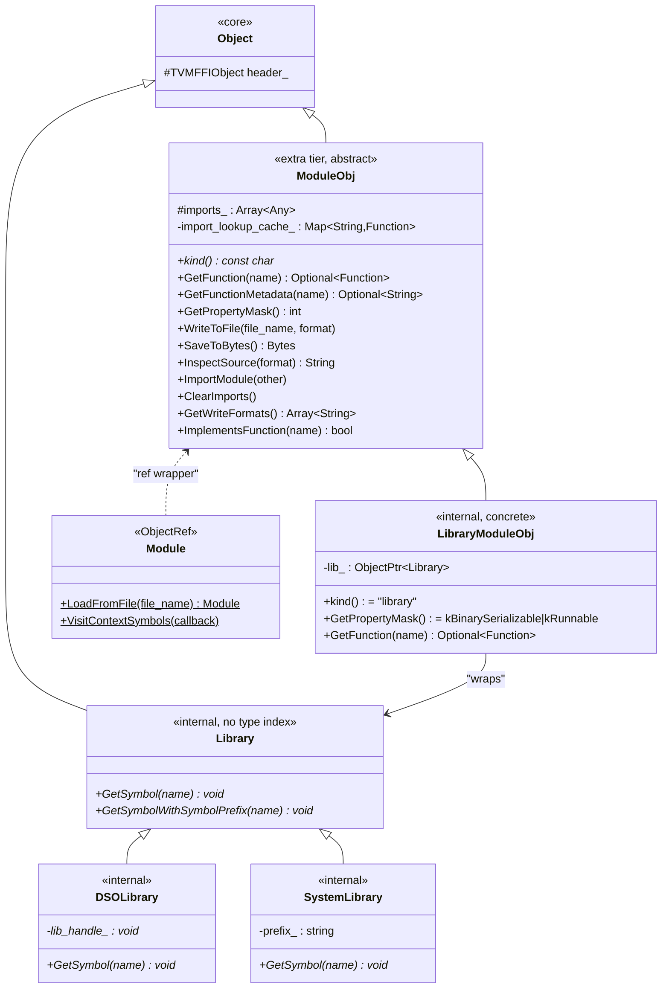
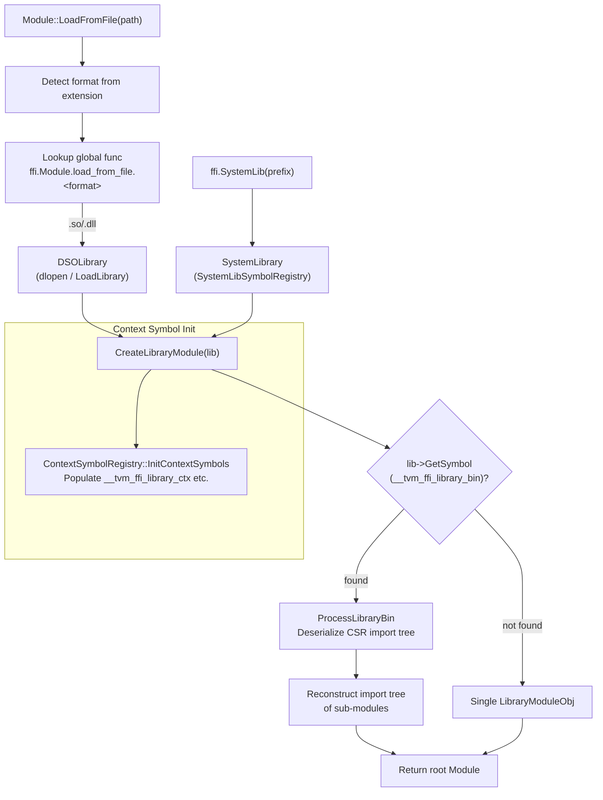

# Module System

**TL;DR**
- `ModuleObj` / `Module` is a first-class abstract object in the FFI extra tier (`include/tvm/ffi/extra/module.h`) with static type index `kTVMFFIModule = 73` and type key `"ffi.Module"`. It provides a virtual interface for dynamically loadable modules: `kind()`, `GetFunction()`, `GetPropertyMask()`, `WriteToFile()`, `SaveToBytes()`, `InspectSource()`, `ImportModule()`, `ClearImports()`.
- The library-loading stack wraps a `Library` (abstract symbol-lookup interface) into `LibraryModuleObj`, with two concrete `Library` implementations: `DSOLibrary` (dlopen/LoadLibrary) and `SystemLibrary` (global symbol registry). `ProcessLibraryBin` deserializes an embedded CSR-encoded import tree of sub-modules from a `__tvm_ffi_library_bin` symbol.
- The module system supports import-tree resolution, where a root module can transitively look up functions from imported sub-modules via `TVMFFIEnvModLookupFromImports`. Loader extensibility is achieved through a naming convention: `ffi.Module.load_from_file.<format>` and `ffi.Module.load_from_bytes.<kind>` global functions.

## Problem Statement

### Background

TVM kernel libraries and addons are compiled as shared libraries (`.so` / `.dll`) that are loaded at runtime. These libraries may embed multiple heterogeneous sub-modules (e.g., CUDA, OpenCL, Metal backends) serialized into a binary blob. The host runtime needs to:
- Load shared libraries and discover exported functions
- Reconstruct an import tree of sub-modules from serialized binary data
- Provide a uniform interface for function lookup, serialization, and source inspection across all module types

Previously, the `Module` concept lived in `runtime::Module` in the main TVM codebase, tightly coupled to the full runtime. Extracting it into the FFI layer enables lightweight consumers that only need module loading without the full TVM runtime.

### Solution

An abstract `ModuleObj` base class in the extra API tier, with a concrete `LibraryModuleObj` that wraps a `Library` symbol-lookup interface. The loading pipeline dispatches on file format via the global function registry, allowing new module formats to be registered without modifying the core loading code.

### Goals

- **Goal**: Provide a uniform interface for dynamically loadable modules across all backends.
- **Goal**: Support import-tree reconstruction from serialized binary blobs embedded in shared libraries.
- **Goal**: Extensible loader registration via global function naming convention.
- **Goal**: Keep the core FFI library minimal by placing all module functionality in the extra tier.
- **Non-goal**: Module compilation (that is handled by the upstream TVM compiler stack).
- **Non-goal**: Thread-safe concurrent module loading (writes are assumed during initialization).

## Design

### Class Hierarchy



### Module Loading Pipeline



### Two-Tier Symbol Resolution

Commit `40e8a51` (#18273) introduced a two-tier symbol naming convention on the `Library` interface:

- **`GetSymbol(name)`**: Resolves a raw symbol name directly (via `dlsym` for DSO, registry lookup for system library).
- **`GetSymbolWithSymbolPrefix(name)`**: Prepends `symbol::tvm_ffi_symbol_prefix` (`"__tvm_ffi_"`) before resolution. The base class provides a default implementation: `GetSymbol(prefix + name)`. `SystemLibrary` overrides to handle its own `symbol_prefix_` stacking (`__tvm_ffi_` + `symbol_prefix_` + `name`).

`LibraryModuleObj::GetFunction` uses `GetSymbolWithSymbolPrefix` for function discovery, so callers pass logical names (e.g., `"main"`) and the prefix is applied automatically.

### Prefix-Tolerant Symbol Lookup (SystemLibrary)

Commit `315f4bb` (#18298) fixed `SystemLibrary::GetSymbol` and `GetSymbolWithSymbolPrefix` to handle names that may or may not already include the symbol prefix. Both methods implement a "try-with-prefix, fallback-to-without" pattern, because `TVMFFIEnvModRegisterSystemLibSymbol` registrants may use fully-qualified or bare names. `DSOLibrary` does not need this because `dlsym` directly resolves the exact symbol name.

### LibraryModuleObj: Function Discovery

`LibraryModuleObj::GetFunction(name)` looks up the symbol `name` from the underlying `Library` via `GetSymbolWithSymbolPrefix` as a `TVMFFISafeCallType` function pointer, then wraps it in `Function::FromPacked` with a captured strong reference to the `Module` for lifetime management:

```
Optional<Function> GetFunction(name):
  faddr = lib_->GetSymbolWithSymbolPrefix(name) as TVMFFISafeCallType
  if faddr == nullptr: return nullopt
  self_strong_ref = GetRef<Module>(this)   // prevent premature library unload
  return Function::FromPacked([faddr, self_strong_ref](args, rv) {
    CHECK(rv->type_index < kTVMFFIStaticObjectBegin)
    CHECK_SAFE_CALL(faddr(nullptr, args, num_args, rv))
  })
```

The captured `self_strong_ref` ensures the shared library remains loaded as long as any function obtained from it is alive.

### ProcessLibraryBin: Binary Import Tree Format

The `__tvm_ffi_library_bin` symbol points to a contiguous byte buffer with this layout:

```
<nbytes : u64>                          // total size of the remaining data
<import_tree_indptr : vec<u64>>         // CSR row pointers (num_modules + 1 entries)
<import_tree_child_indices : vec<u64>>  // CSR column indices
<key0 : str> <val0 : bytes>            // module 0: kind string + serialized bytes
<key1 : str> <val1 : bytes>            // module 1: kind string + serialized bytes
...
```

- The special key `"_lib"` marks the position of the `LibraryModuleObj` in the tree (no bytes follow it).
- Other keys are module kind strings (e.g., `"cuda"`, `"opencl"`). The corresponding bytes are loaded via `ffi.Module.load_from_bytes.<kind>`.
- The CSR structure encodes the import DAG: `import_tree_indptr[i]..import_tree_indptr[i+1]` indexes into `child_indices` to find the imports of module `i`.
- Module 0 is always the root.

### Import Lookup: TVMFFIEnvModLookupFromImports

Generated kernel code calls `TVMFFIEnvModLookupFromImports(library_ctx, func_name, &out)` to resolve functions from the module's import tree. The implementation:

1. Checks `import_lookup_cache_` (a `Map<String, Function>`) for a cached result.
2. On cache miss, iterates all `imports_` recursively via `GetFunction(name, true)`.
3. Falls back to the global function registry via `Function::GetGlobal`.
4. Caches the result for future lookups.
5. Throws `RuntimeError` if the function is not found anywhere.

A static `std::mutex` serializes concurrent lookups to protect the cache.

### ModulePropertyMask

```cpp
enum ModulePropertyMask : int {
    kBinarySerializable    = 0b001,  // SaveToBytes supported
    kRunnable              = 0b010,  // GetFunction returns runnable functions
    kCompilationExportable = 0b100,  // WriteToFile for further compilation
};
```

### Well-Known Symbols

| Symbol constant | Meaning |
|---|---|
| `symbol::tvm_ffi_symbol_prefix` (`"__tvm_ffi_"`) | Canonical prefix for all FFI-exported function symbols |
| `symbol::tvm_ffi_library_ctx` (`"__tvm_ffi__library_ctx"`) | Global `void**` in library, set to point to the module object. Uses double-underscore (`__tvm_ffi__`) to avoid collision with user-prefixed symbols. |
| `symbol::tvm_ffi_library_bin` (`"__tvm_ffi__library_bin"`) | Global `const char*` pointing to the embedded binary blob. Double-underscore separator. |
| `symbol::tvm_ffi_main` (`"__tvm_ffi_main"`) | Default entry function of a library module. Python `Module` looks up `"main"` (resolved to `__tvm_ffi_main` via the prefix). |
| `symbol::tvm_ffi_metadata_prefix` (`"__tvm_ffi__metadata_"`) | Naming convention for per-function metadata symbols. Double-underscore separator. |

**Internal symbol double-underscore convention** (commit `40e8a51`): Internal/infrastructure symbols (`library_ctx`, `library_bin`, `metadata_prefix`) use `__tvm_ffi__` (double underscore before the sub-name) to partition the namespace from user-exported FFI functions whose names are prefixed with `__tvm_ffi_` (single underscore).

### GetFunctionMetadata

`ModuleObj::GetFunctionMetadata(const String& name)` is a virtual method (default returns `std::nullopt`) that allows modules to expose structured metadata (as JSON strings) for their exported functions. A non-virtual overload `GetFunctionMetadata(const String& name, bool query_imports)` walks the import tree recursively, following the same pattern as `GetFunction(name, query_imports)`.

For `LibraryModuleObj`, metadata is discovered via the `symbol::tvm_ffi_metadata_prefix` naming convention: the symbol `__tvm_ffi_metadata_<func_name>` in the loaded library provides the metadata string for function `<func_name>`.

The global function `ffi.ModuleGetFunctionMetadata` exposes this capability to Python.

### C Environment API Surface (Module-Scoped)

Three `extern "C"` functions in `include/tvm/ffi/extra/c_env_api.h` support the callee-side (kernel library) integration:

| Function | Purpose |
|---|---|
| `TVMFFIEnvModLookupFromImports(ctx, name, &out)` | Resolve function from import tree |
| `TVMFFIEnvModRegisterContextSymbol(name, symbol)` | Register a context symbol for library init |
| `TVMFFIEnvModRegisterSystemLibSymbol(name, symbol)` | Register a symbol in the system library |

All use `TVM_FFI_SAFE_CALL_BEGIN/END` and follow the `TVMFFIEnvMod*` naming convention for module-scoped operations (see [ADR 0019](../ADRs/0019-env-mod-naming-convention.md)).

### Key Classes, Fields and Interfaces

- **`ModuleObj`** (`include/tvm/ffi/extra/module.h`): Abstract base. Static type index `kTVMFFIModule = 73`. Virtual methods: `kind()`, `GetFunction()`, `GetPropertyMask()`, `WriteToFile()`, `SaveToBytes()`, `InspectSource()`, `ImportModule()`, `ClearImports()`, `GetWriteFormats()`, `ImplementsFunction()`. Fields: `imports_` (`Array<Any>`), `import_lookup_cache_` (`Map<String, Function>`).
- **`Module`** (`include/tvm/ffi/extra/module.h`): `ObjectRef` wrapper. Static methods: `LoadFromFile()`, `VisitContextSymbols()`.
- **`Library`** (`src/ffi/extra/module_internal.h`): Internal abstract base for symbol lookup. No type index or type key -- only used for ref-counting. Virtual methods: `GetSymbol(const String&) -> void*`, `GetSymbolWithSymbolPrefix(const String&) -> void*` (default prepends `__tvm_ffi_` and delegates to `GetSymbol`).
- **`LibraryModuleObj`** (`src/ffi/extra/library_module.cc`): Concrete `ModuleObj` wrapping a `Library`. `GetFunction` wraps `TVMFFISafeCallType` symbols into `Function::FromPacked`.
- **`DSOLibrary`** (`src/ffi/extra/library_module_dynamic_lib.cc`): `Library` subclass using `dlopen`/`LoadLibrary` for dynamic library loading. Registered as `ffi.Module.load_from_file.so`.
- **`SystemLibrary`** (`src/ffi/extra/library_module_system_lib.cc`): `Library` subclass resolving symbols from `SystemLibSymbolRegistry`. Supports symbol prefix for namespace isolation.
- **`ContextSymbolRegistry`** (`src/ffi/extra/library_module.cc`): Singleton storing `(name, void*)` pairs. On library load, initializes matching symbols in the library.
- **`ProcessLibraryBin`** (`src/ffi/extra/library_module.cc`): Deserializes the `__tvm_ffi_library_bin` blob into a module import tree using CSR format.

### Contracts, Assumptions and Invariants

- **Import tree is a DAG**: Circular imports are not detected. The root module is always at index 0 in the serialized binary.
- **Library lifetime via captured Module ref**: Every `Function` obtained from `LibraryModuleObj::GetFunction` captures a strong reference to the `Module`, preventing the `DSOLibrary` handle from being closed while functions are still alive.
- **Import lookup cache is mutex-protected**: `ModuleObj::InternalUnsafe::GetFunctionFromImports` serializes concurrent lookups with a static mutex. This is acceptable because lookups are expected during initialization only.
- **Global function fallback**: Import resolution falls back to the global function registry if no imported module provides the requested function. This enables kernel libraries to call utility functions registered by the host.
- **Format-based loader dispatch**: `Module::LoadFromFile` extracts the file extension and dispatches to `ffi.Module.load_from_file.<ext>`. Missing loaders cause `RuntimeError`.
- **Library has no type key**: `Library` deliberately has no `_type_index` or `_type_key` because it is never passed across the FFI boundary. It only needs ref-counting for lifetime management.

### Extension Points

- **New module formats**: Register a global function `ffi.Module.load_from_file.<format>` or `ffi.Module.load_from_bytes.<kind>` via `GlobalDef`. The module system will automatically dispatch to the new loader.
- **Custom ModuleObj subclasses**: Third-party code can subclass `ModuleObj` and override the virtual methods to implement custom module behaviors (e.g., JIT compilation, remote execution).
- **Additional context symbols**: Register new symbols via `TVMFFIEnvModRegisterContextSymbol` before module loading to inject context (e.g., allocator pointers, configuration) into loaded libraries.
- **Module property bits**: Bits 3+ of `ModulePropertyMask` are available for future properties.

## Alternatives & Trade-offs

### Alternative: Place Module in core tier instead of extra

- Pros: Always available, no build-time gating needed.
- Cons: Increases minimal library size for consumers that only need packed functions (e.g., lightweight inference runtimes). The core FFI should remain minimal.

### Alternative: Use JSON for the library binary format instead of custom CSR

- Pros: Human-readable, easier to debug.
- Cons: Slower to parse, larger payload, requires JSON parser at load time. The custom binary format is minimal, zero-dependency, and parsed once during loading.

### Alternative: Separate CMake target for Module instead of TVM_FFI_USE_EXTRA_CXX_API gating

- Pros: More granular build control.
- Cons: Adds build system complexity. The extra tier already provides the needed gating mechanism.

## Related Work

### Design Docs & ADRs

- [`.knowledge/designs/0001-c-abi.md`](0001-c-abi.md) -- C ABI contract for TVMFFISafeCallType, kTVMFFIModule type index
- [`.knowledge/designs/0003-object-system.md`](0003-object-system.md) -- Object/ObjectRef pattern, make_object, static type index reservation
- [`.knowledge/designs/0004-function-system.md`](0004-function-system.md) -- Function::FromPacked, GlobalFunctionTable, GlobalDef
- [`.knowledge/designs/0008-module-export-system.md`](0008-module-export-system.md) -- TVM_FFI_DLL_EXPORT_TYPED_FUNC symbol pattern consumed by LibraryModuleObj
- [`.knowledge/designs/0011-extra-api-tier.md`](0011-extra-api-tier.md) -- Extra tier gating and visibility
- [`.knowledge/ADRs/0005-safe-call-abi-boundary.md`](../ADRs/0005-safe-call-abi-boundary.md) -- Safe-call pattern used by env APIs
- [`.knowledge/ADRs/0018-module-in-extra-tier.md`](../ADRs/0018-module-in-extra-tier.md) -- Decision to place Module in extra tier
- [`.knowledge/ADRs/0019-env-mod-naming-convention.md`](../ADRs/0019-env-mod-naming-convention.md) -- TVMFFIEnvMod* naming convention

### Evidence Matrix

- ModuleObj/Module introduction, Library, LibraryModuleObj, DSOLibrary, SystemLibrary, ProcessLibraryBin, ContextSymbolRegistry -> `.knowledge/commits/2025-08-17-538bef49b4daa91970f0f9cea137acdcb696562a.md` + `538bef4`
- TVMFFIEnvMod* rename (was TVMFFIEnv*) -> `.knowledge/commits/2025-08-20-023ea448be6e86e09f4ebaba5a235ee53f3cdeef.md` + `023ea44`
- kTVMFFIModule = 73 type index, StaticTypeKey::kTVMFFIModule -> `.knowledge/commits/2025-08-17-538bef49b4daa91970f0f9cea137acdcb696562a.md` + `538bef4`
- GetFunctionMetadata virtual method + tvm_ffi_metadata_prefix symbol -> `.knowledge/commits/2025-08-30-777cf8d51f2054d96e0413b7406ed38ef43a7b39.md` + `777cf8d`
- ffi.ModuleGetFunctionMetadata global function -> `.knowledge/commits/2025-08-30-777cf8d51f2054d96e0413b7406ed38ef43a7b39.md` + `777cf8d`
- __tvm_ffi_ symbol prefix, two-tier symbol resolution, well-known symbol renames -> `.knowledge/commits/2025-09-06-40e8a519f5270dfb18436b2f26c2d691cf24c9c1.md` + `40e8a51`
- SystemLibrary prefix-tolerant symbol lookup fix -> `.knowledge/commits/2025-09-10-315f4bb00eac8b4d26cdcd6839fb1a077bab6976.md` + `315f4bb`
