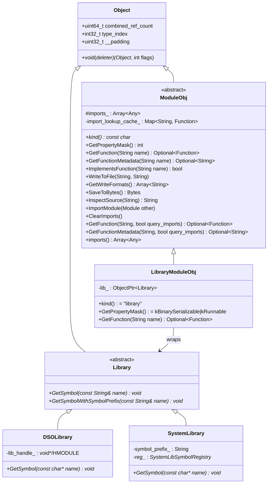
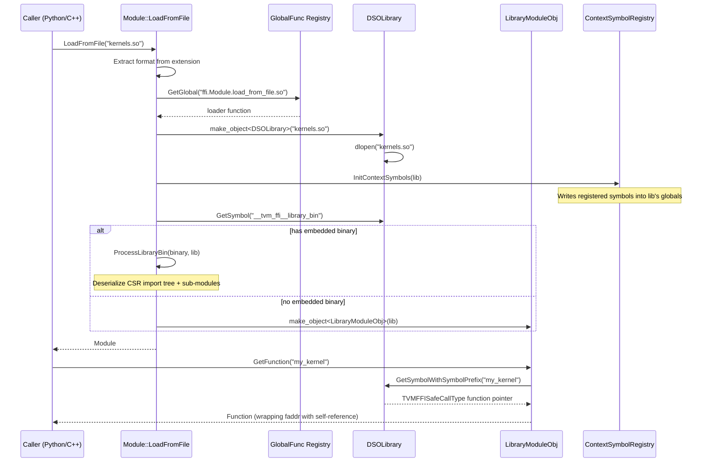

# Module System

**TL;DR**
- `ModuleObj`/`Module` is a first-class FFI object type (`kTVMFFIModule = 73`) providing an abstract interface for dynamic function loading, import tree management, serialization, and source inspection -- gated behind `TVM_FFI_USE_EXTRA_CXX_API`.
- Three concrete backends -- `LibraryModuleObj` (wraps a `Library` symbol provider), `DSOLibrary` (platform `dlopen`/`LoadLibrary`), and `SystemLibrary` (in-process symbol table via `SystemLibSymbolRegistry`) -- cover dynamic shared library loading and statically-linked kernel registration.
- A C env API layer (`TVMFFIEnvModLookupFromImports`, `TVMFFIEnvModRegisterContextSymbol`, `TVMFFIEnvModRegisterSystemLibSymbol`) enables generated code to call back into the module system without linking against C++ symbols.

## Problem Statement

### Background
- TVM compiles ML models into shared libraries (.so/.dll) containing kernel functions. The runtime needs to load these libraries, resolve functions by name, and manage import dependencies between modules.
- Generated code (e.g., compiled CUDA kernels) needs to look up helper functions from imported modules at runtime, but cannot link against C++ symbols directly -- it needs a C-level callback mechanism.
- System libraries (statically linked kernels) need a global symbol table so that `SystemLib` can provide a `Module` interface over pre-registered symbols.
- Prior to this design, module loading was handled outside the FFI layer. Formalizing it as a first-class FFI object enables cross-language module management (Python loading C++ modules, Rust querying module functions).

### Solution
- An abstract `ModuleObj` class with virtual methods for function lookup, serialization, and import management, registered as static object type 73.
- A `Library` internal abstraction for raw symbol resolution, with `DSOLibrary` (dlopen) and `SystemLibrary` (registry-backed) implementations.
- A binary embedded format for import trees using CSR (Compressed Sparse Row) encoding, enabling a single `.so` to contain multiple serialized sub-modules.
- C ABI functions prefixed with `TVMFFIEnvMod` for generated code integration.

### Goals
- **Goal**: Provide a unified Module interface for dynamic (.so) and static (system library) function loading.
- **Goal**: Enable cross-language module management via registered global functions.
- **Goal**: Support embedded binary sub-modules with import trees for deployment.
- **Non-goal**: Not a package manager or dependency resolver -- import management is explicit.
- **Non-goal**: Module serialization format is not meant for cross-version compatibility.

## Design



**Module loading flow** (dynamic library):



### Key Classes, Fields and Interfaces

**`ModuleObj : public Object`** -- abstract base for all modules:
```cpp
class TVM_FFI_EXTRA_CXX_API ModuleObj : public Object {
public:
  virtual const char* kind() const = 0;
  virtual int GetPropertyMask() const;                        // default 0b000
  virtual Optional<Function> GetFunction(const String& name) = 0;
  virtual bool ImplementsFunction(const String& name);        // default: GetFunction(name).defined()
  virtual void WriteToFile(const String& file_name, const String& format) const;  // default: throws
  virtual Array<String> GetWriteFormats() const;              // default: empty
  virtual Bytes SaveToBytes() const;                          // default: throws
  virtual String InspectSource(const String& format = "") const;  // default: empty
  virtual void ImportModule(const Module& other);             // with cyclic-dep guard (DFS)
  virtual void ClearImports();
  virtual Optional<String> GetFunctionMetadata(const String& name);   // default: returns nullopt
  virtual Optional<String> GetFunctionDoc(const String& name);        // default: returns nullopt (935a5a0)
  Optional<Function> GetFunction(const String& name, bool query_imports);
  Optional<String> GetFunctionMetadata(const String& name, bool query_imports);  // walks imports
  Optional<String> GetFunctionDoc(const String& name, bool query_imports);       // walks imports (935a5a0)
  bool ImplementsFunction(const String& name, bool query_imports);
  const Array<Any>& imports() const;

  static constexpr int32_t _type_index = kTVMFFIModule;       // 73
  static constexpr const char* _type_key = "ffi.Module";
  static constexpr bool _type_final = true;
protected:
  Array<Any> imports_;
private:
  Map<String, Function> import_lookup_cache_;  // used by TVMFFIEnvModLookupFromImports
};
```

**`Module : public ObjectRef`** -- reference handle:
```cpp
class Module : public ObjectRef {
public:
  enum ModulePropertyMask : int {
    kBinarySerializable    = 0b001,  // implements SaveToBytes; loader at "ffi.Module.load_from_bytes.<kind>"
    kRunnable              = 0b010,  // GetFunction returns callable functions
    kCompilationExportable = 0b100,  // implements WriteToFile for .o/.cc/.cu export
  };
  TVM_FFI_EXTRA_CXX_API static Module LoadFromFile(const String& file_name);
  TVM_FFI_EXTRA_CXX_API static void VisitContextSymbols(
      const TypedFunction<void(String, void*)>& callback);
  TVM_FFI_DEFINE_OBJECT_REF_METHODS_NOTNULLABLE(Module, ObjectRef, ModuleObj);
  // ModuleObj has _type_mutable = true, so __PtrType resolves to ModuleObj* (non-const)
};
```

**`Library : public Object`** -- internal symbol-provider abstraction (no type_key, no type_index, refcounting only):
```cpp
class Library : public Object {
public:
  virtual ~Library() {}
  virtual void* GetSymbol(const String& name) = 0;
  virtual void* GetSymbolWithSymbolPrefix(const String& name);
  // Default: prepends tvm_ffi_symbol_prefix ("__tvm_ffi_") to name, calls GetSymbol
};
```

**`LibraryModuleObj : public ModuleObj`** -- wraps a Library for function dispatch:
```cpp
class LibraryModuleObj final : public ModuleObj {
public:
  explicit LibraryModuleObj(ObjectPtr<Library> lib);
  const char* kind() const final;  // returns "library"
  int GetPropertyMask() const final;  // kBinarySerializable | kRunnable
  Optional<Function> GetFunction(const String& name) final;
  // GetFunction casts lib->GetSymbol(name) to TVMFFISafeCallType,
  // wraps it in Function::FromPacked with a self-strong-ref to keep Module alive

  // Metadata/doc overrides (ac7bf68): resolve companion symbols from loaded library
  Optional<String> GetFunctionMetadata(const String& name) final;
  // Looks up lib_->GetSymbol(tvm_ffi_metadata_prefix + name), invokes via Function::InvokeExternC
  Optional<String> GetFunctionDoc(const String& name) final;
  // Looks up lib_->GetSymbol(tvm_ffi_doc_prefix + name), invokes via Function::InvokeExternC
private:
  ObjectPtr<Library> lib_;
};
```

**`DSOLibrary : public Library`** -- platform-specific dynamic library:
```cpp
class DSOLibrary final : public Library {
public:
  explicit DSOLibrary(const String& name);  // calls dlopen/LoadLibraryW
  ~DSOLibrary();                            // calls dlclose/FreeLibrary
  void* GetSymbol(const String& name) final;  // calls dlsym/GetProcAddress
private:
  void* lib_handle_;  // HMODULE on Windows
};
```

**`SystemLibrary : public Library`** -- backed by `SystemLibSymbolRegistry`:
```cpp
class SystemLibrary final : public Library {
public:
  explicit SystemLibrary(const String& symbol_prefix);
  void* GetSymbol(const String& name) final;
  // Tries symbol_prefix_ + name first, falls back to name alone (prefix-idempotent)
  void* GetSymbolWithSymbolPrefix(const String& name) final;
  // Tries tvm_ffi_symbol_prefix + symbol_prefix_ + name first,
  // falls back to tvm_ffi_symbol_prefix + name alone (prefix-idempotent)
private:
  SystemLibSymbolRegistry* reg_;
  String symbol_prefix_;
};
```

**C env API functions** (`extra/c_env_api.h`):
```c
int TVMFFIEnvModLookupFromImports(TVMFFIObjectHandle library_ctx, const char* func_name,
                                   TVMFFIObjectHandle* out);
int TVMFFIEnvModRegisterContextSymbol(const char* name, void* symbol);
int TVMFFIEnvModRegisterSystemLibSymbol(const char* name, void* symbol);
```

**Global function registrations**:
| Name | Signature | Description |
|------|-----------|-------------|
| `ffi.ModuleLoadFromFile` | `(String) -> Module` | Load module from file path |
| `ffi.ModuleGetFunction` | `(Module, String, bool) -> Optional<Function>` | Get function, optionally querying imports |
| `ffi.ModuleImplementsFunction` | `(Module, String, bool) -> bool` | Check function existence |
| `ffi.ModuleGetPropertyMask` | `(Module) -> int` | Get property bitmask |
| `ffi.ModuleInspectSource` | `(Module, String) -> String` | Get source code |
| `ffi.ModuleGetKind` | `(Module) -> String` | Get module kind string |
| `ffi.ModuleGetWriteFormats` | `(Module) -> Array<String>` | Get exportable formats |
| `ffi.ModuleWriteToFile` | `(Module, String, String) -> void` | Write to file |
| `ffi.ModuleImportModule` | `(Module, Module) -> void` | Import another module |
| `ffi.ModuleClearImports` | `(Module) -> void` | Clear all imports |
| `ffi.ModuleGetFunctionMetadata` | `(Module, String, bool) -> Optional<String>` | Get function metadata as JSON string, optionally querying imports |
| `ffi.ModuleGetFunctionDoc` | `(Module, String, bool) -> Optional<String>` | Get function docstring, optionally querying imports (935a5a0) |
| `ffi.Module.load_from_file.so` | `(String, String) -> Module` | SO/DLL/dylib loader |
| `ffi.SystemLib` | `(Optional<String>) -> Module` | Get/create system library module |

**Well-known symbol names** (`tvm::ffi::symbol` namespace):
```cpp
constexpr const char* tvm_ffi_symbol_prefix    = "__tvm_ffi_";              // user-exported function prefix
constexpr const char* tvm_ffi_main             = "__tvm_ffi_main";          // default entry point
constexpr const char* tvm_ffi_library_ctx      = "__tvm_ffi__library_ctx";  // pointer to ModuleObj* (double underscore = internal)
constexpr const char* tvm_ffi_library_bin      = "__tvm_ffi__library_bin";  // embedded binary data (double underscore = internal)
constexpr const char* tvm_ffi_metadata_prefix  = "__tvm_ffi__metadata_";    // per-function metadata prefix (double underscore = internal)
constexpr const char* tvm_ffi_doc_prefix        = "__tvm_ffi__doc_";         // per-function doc prefix (double underscore = internal, ac7bf68)
```

**Two-tier symbol namespace convention** (from commit 40e8a51):
- User-exported functions: `__tvm_ffi_<name>` (single underscore separator after `tvm_ffi`)
- Internal well-known symbols: `__tvm_ffi__<name>` (double underscore separator)
- This prevents collision between user function `"library_ctx"` (which becomes `__tvm_ffi_library_ctx`) and the internal symbol `__tvm_ffi__library_ctx`.

**Binary embedded format** (in `__tvm_ffi_library_bin`):
```
<nbytes : u64>
<import_tree_indptr : vec<u64>>       // CSR row pointers
<import_tree_child_indices : vec<u64>> // CSR column indices
(<kind : str> <bytes : bytes>)*       // N modules: kind="_lib" for DSO, otherwise module bytes
```
The import tree is a CSR (Compressed Sparse Row) structure. `indptr[i]..indptr[i+1]` gives the child module indices for module `i`. Module 0 is the root. `_lib` is a sentinel kind meaning "place the DSOLibrary module here."

### Contracts, Assumptions and Invariants
- **Cyclic import guard**: `ImportModule` performs a DFS from the imported module through its entire import tree. If `this` is reachable, it throws `RuntimeError("Cyclic dependency detected during import")`.
- **Function lifetime via self-reference**: `LibraryModuleObj::GetFunction` captures a strong `Module` reference in the returned Function closure, preventing the DSOLibrary from being unloaded while any function is alive.
- **Import lookup cache**: `TVMFFIEnvModLookupFromImports` uses a mutex-protected `import_lookup_cache_` on the ModuleObj. The cache maps function name to Function. Once resolved, subsequent lookups skip the import tree walk. The global registry is checked as a fallback after all imports.
- **Library has no type_key**: `Library` deliberately omits `_type_key`/`_type_index` registration. It uses `Object`'s refcounting infrastructure only, never participates in FFI type dispatch, and cannot be passed across the C ABI.
- **SystemLibModuleRegistry ensures singleton per prefix**: The system library module for a given `symbol_prefix` is created once and cached in a mutex-protected `Map<String, Module>`, ensuring the same Module instance across the process lifetime.
- **Context symbol initialization**: When `CreateLibraryModule` is called, `ContextSymbolRegistry::Global()->InitContextSymbols(lib)` writes all registered context symbols into the library's matching global variable addresses. This enables lazy binding: register a context symbol at startup, and all subsequently loaded libraries receive it.
- **Prefix-idempotent lookup**: `SystemLibrary::GetSymbol` and `GetSymbolWithSymbolPrefix` are idempotent with respect to prefix application. Whether the caller passes `"my_kernel"` or `"prefix_my_kernel"`, the symbol is found if it exists in the registry under either form. The lookup tries the prefixed name first, then falls back to the raw name (from commit 315f4bb).
- **Format-based dispatch for LoadFromFile**: `Module::LoadFromFile` extracts the file extension, normalizes `dll`/`dylib`/`dso` to `so`, and looks up `ffi.Module.load_from_file.<format>` in the global function registry. New formats are added by registering the appropriate loader function.

### CUBIN Embedding via `load_inline`

The `load_inline` Python API (in `tvm_ffi.cpp.extension`) extends the module system with CUDA CUBIN embedding support via the `embed_cubin` parameter. When `embed_cubin={"name": cubin_bytes}` is passed:
1. CUBIN bytes are written to the build directory as `<name>.cubin`.
2. The ninja build merges all C++ object files into `unified.o` via `ld -r`.
3. For each CUBIN, the build chains `python -m tvm_ffi.utils.embed_cubin` calls, each merging a CUBIN into the unified object with `__tvm_ffi__cubin_<name>` symbols (localized post-merge).
4. The final object is linked into a `.so`, loaded as a `LibraryModuleObj`.

The C++ code in the extension uses `TVM_FFI_EMBED_CUBIN(name)` to declare the embedded CUBIN and `TVM_FFI_EMBED_CUBIN_GET_KERNEL(name, kernel_name)` to retrieve kernels. See [0021-cubin-launcher.md](0021-cubin-launcher.md) for the full CUBIN launcher design and [ADR 0023](../ADRs/0023-cubin-symbol-naming.md) for the symbol naming convention.

Evidence: d49effdb (initial CUBIN launcher and embedding toolchain)

### ModuleGlobals Singleton (8dcaec1)

`ModuleGlobals` is a thread-safe C++ singleton (static storage duration in `libtvm_ffi`) that holds strong references to loaded modules, preventing premature DSO unloading.

```cpp
class ModuleGlobals {
  void Add(const Module& m);     // mutex-protected, adds to map
  void Remove(const Module& m);  // mutex-protected, removes from map
  static ModuleGlobals* Get();   // singleton accessor
private:
  Map<Module, int> modules_;
  std::mutex mutex_;
};
```

Exposed as FFI functions:
- `ffi.ModuleGlobalsAdd(Module) -> None`
- `ffi.ModuleGlobalsRemove(Module) -> None`

**`keep_module_alive` convention**: All module loading APIs (`load_module`, `cpp.load_inline`, `cpp.load`) accept `keep_module_alive: bool = True`. When True (default), the loaded module is registered in `ModuleGlobals`, ensuring it survives for the program's lifetime even after all Python references are dropped. This fixes use-after-free crashes where objects containing destructors from the loaded DSO outlived the module. The trade-off is that DSO memory is not reclaimed until process exit. Callers can opt out with `keep_module_alive=False` but must ensure all objects from the module are freed before the module is GC'd.

Evidence: 8dcaec1 (initial), f255650 (load_lib_module uses keep_module_alive)

### Metadata String Allocation Invariant (dcacb98)

`TVM_FFI_DLL_EXPORT_TYPED_FUNC` and `TVM_FFI_DLL_EXPORT_TYPED_FUNC_DOC` macros allocate metadata strings via `TVMFFIStringFromByteArray` (C API in libtvm_ffi) instead of constructing `tvm::ffi::String` objects locally in the module's code. This ensures the returned String object's memory lives in libtvm_ffi's heap, not in the loaded module's address space. Without this, the String's deleter code would become invalid after `dlclose`, causing use-after-free.

### Extension Points
- **New module kinds**: Register a `ffi.Module.load_from_file.<ext>` global function for new formats, and optionally `ffi.Module.load_from_bytes.<kind>` for binary serialization. The loader function receives `(String path, String format)` and returns `Module`.
- **Custom Module subclasses**: While `ModuleObj` is marked `_type_final = true`, new module backends are implemented by overriding the virtual methods. The `_type_final` flag only prevents further type-index splitting, not subclassing in C++.
- **Context symbol registration**: New context symbols can be registered at any time via `TVMFFIEnvModRegisterContextSymbol`. They will be initialized in all subsequently loaded libraries.
- **CUBIN embedding**: Additional CUDA binary types can be embedded by extending the `embed_cubin` pipeline with new naming conventions under `__tvm_ffi__cubin_*`.

### Usage Examples

#### Loading a shared library and calling a function (C++)
**Context**: The primary workflow for loading compiled kernels and invoking them.
```cpp
#include <tvm/ffi/extra/module.h>
using namespace tvm::ffi;

// Load a shared library; format detected from extension
Module mod = Module::LoadFromFile("my_kernels.so");

// Look up a function exported by the library
Optional<Function> func = mod->GetFunction("my_kernel");
if (func.defined()) {
  Any result = (*func)(input_tensor);
}

// Import another module and query across imports
Module helper = Module::LoadFromFile("helper.so");
mod->ImportModule(helper);
auto f = mod->GetFunction("helper_func", /*query_imports=*/true);
```

#### Registering and querying system library symbols (C, for generated code)
**Context**: Statically-linked kernels register their entry points at load time; runtime queries them via `ffi.SystemLib`.
```c
// At static initialization time, compiled kernels register:
TVMFFIEnvModRegisterSystemLibSymbol("my_kernel", (void*)&my_kernel_impl);

// At runtime (C++):
// Module sys = Function::GetGlobalRequired("ffi.SystemLib")().cast<Module>();
// auto func = sys->GetFunction("my_kernel");

// Generated code uses TVMFFIEnvModLookupFromImports for import resolution:
TVMFFIObjectHandle func;
TVMFFIEnvModLookupFromImports(library_ctx, "needed_func", &func);
```

#### Cross-language module loading (Python)
**Context**: Python loading and querying a compiled module.
```python
import tvm_ffi

load_module = tvm_ffi.get_global_func("ffi.ModuleLoadFromFile")
mod = load_module("my_kernels.so")

get_func = tvm_ffi.get_global_func("ffi.ModuleGetFunction")
func = get_func(mod, "my_kernel", False)
if func is not None:
    result = func(input_tensor)
```

## Alternatives & Trade-offs
### Flat function registry (no Module abstraction)
- Pros: Simpler; all functions registered globally by name; no import tree complexity.
- Cons: No namespace isolation between libraries. Two libraries exporting `"main"` would collide. The Module abstraction provides per-library namespacing and explicit import relationships.

### Virtual dispatch for Library (with type_key)
- Pros: Library could participate in FFI type dispatch, enabling Python-side library introspection.
- Cons: Library is an internal implementation detail. Adding type_key/type_index would pollute the type registry with an abstraction that has no cross-language use case. Refcounting-only is sufficient.

## Related Work
### Design Docs & ADRs
- [0001-c-abi-layer.md](../designs/0001-c-abi-layer.md) -- C ABI exports, TVMFFISafeCallType calling convention
- [0003-object-system.md](../designs/0003-object-system.md) -- Object/ObjectRef pattern, make_object, TVM_FFI_DECLARE_OBJECT_INFO_STATIC
- [0004-function-system.md](../designs/0004-function-system.md) -- Function, TypedFunction, Function::FromPacked, GlobalDef
- [0009-reflection.md](../designs/0009-reflection.md) -- refl::ObjectDef, refl::GlobalDef registration
- [0010-extra-api-isolation.md](../ADRs/0010-extra-api-isolation.md) -- TVM_FFI_USE_EXTRA_CXX_API gating
- [0004-type-index-layout.md](../ADRs/0004-type-index-layout.md) -- kTVMFFIModule = 73 in static range
- [0013-env-api-naming-convention.md](../ADRs/0013-env-api-naming-convention.md) -- TVMFFIEnv vs TVMFFIEnvMod prefix convention
- [0023-opt-in-metadata-export.md](../ADRs/0023-opt-in-metadata-export.md) -- Opt-in metadata/doc export for DLL functions
- [0014-python-package.md](../designs/0014-python-package.md) -- Python `Module` class wrapper, `load_module`, `system_lib` re-exports
- [0021-cubin-launcher.md](../designs/0021-cubin-launcher.md) -- CUBIN launcher subsystem extending module loading with CUDA kernel embedding
- [0023-cubin-symbol-naming.md](../ADRs/0023-cubin-symbol-naming.md) -- Symbol naming convention for embedded CUBINs

### Evidence Matrix
- ModuleObj/Module class hierarchy and virtual methods -> `2025-08-17-538bef49.md` + `extra/module.h`
- GetFunctionMetadata and tvm_ffi_metadata_prefix -> `2025-08-30-777cf8d5.md` (777cf8d) + `extra/module.h`
- ffi.ModuleGetFunctionMetadata registration -> `2025-08-30-777cf8d5.md` (777cf8d) + `module.cc`
- Library/DSOLibrary/SystemLibrary internal abstractions -> `2025-08-17-538bef49.md`
- CSR binary import tree format -> `2025-08-17-538bef49.md` + `library_module.cc`
- C env API functions (TVMFFIEnvMod*) -> `2025-08-17-538bef49.md` + `2025-08-20-023ea44.md`
- Symbol prefix (__tvm_ffi_) and GetSymbolWithSymbolPrefix -> `2025-09-06-40e8a519.md` (40e8a51)
- Prefix-idempotent lookup fix for SystemLibrary -> `2025-09-10-315f4bb0.md` (315f4bb)
- LibraryModuleObj::GetFunctionMetadata/GetFunctionDoc overrides, tvm_ffi_doc_prefix symbol -> `2025-11-20-ac7bf68058b392c3a8475619016fde48bd08334b.md` (ac7bf68)
- ModuleGlobals singleton + keep_module_alive convention -> `2025-12-11-8dcaec1f.md` (8dcaec1)
- Metadata string allocation via TVMFFIStringFromByteArray -> `2025-12-02-dcacb98d.md` (dcacb98)
- Plus 5 supporting commits (initial design, env rename, inline module)
