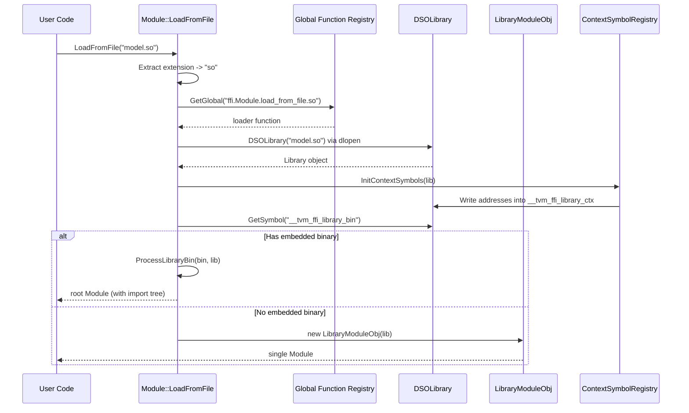
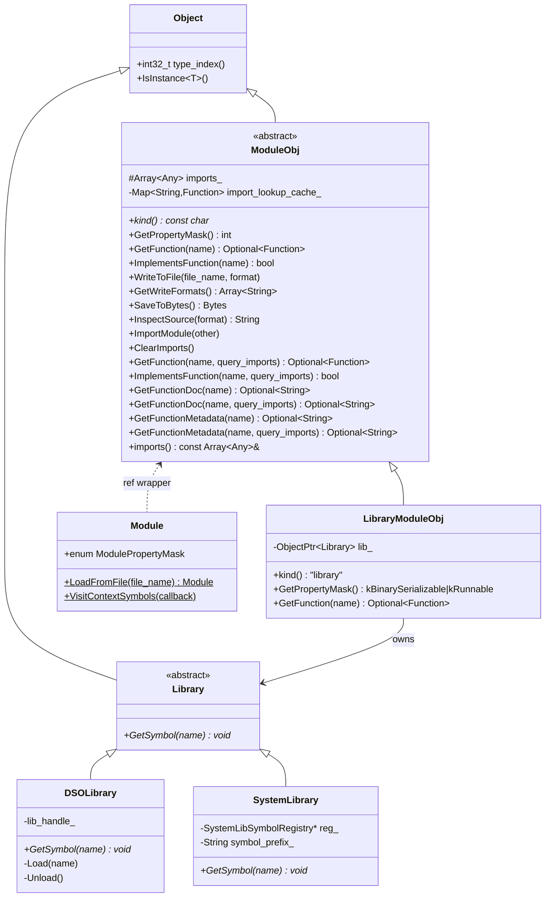
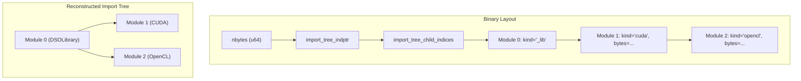

# Module System Design

**TL;DR**:
- `ffi::Module` / `ffi::ModuleObj` is the first-class abstract object type for dynamically loading shared libraries and retrieving `ffi::Function` instances by name. It sits in the `extra/` layer, gated by `TVM_FFI_USE_EXTRA_CXX_API`.
- Three concrete implementations: `LibraryModuleObj` (wraps a `Library`), `DSOLibrary` (`dlopen`/`LoadLibraryW`), and `SystemLibrary` (statically registered symbol table).
- A CSR-based binary module format (`ProcessLibraryBin`) supports embedding serialized sub-modules alongside a DSO, with import tree reconstruction at load time.

## Problem Statement
### Background
- ML model deployment requires loading compiled kernel libraries at runtime as `.so`/`.dll`/`.dylib` files and retrieving functions by name.
- Before this design, the module concept existed only in `tvm::runtime` (the main TVM project). The FFI layer had a reserved type index (`kTVMFFIModule = 73`) but no implementation.
- Generated code inside loaded libraries needs to resolve functions from imported modules and register context symbols without explicit link dependencies.

### Solution
- An abstract `ModuleObj` base class with virtual methods for function lookup, serialization, source inspection, and import management.
- A `Library` internal base class abstracting symbol lookup (`GetSymbol(name) -> void*`), with `DSOLibrary` and `SystemLibrary` as platform-specific implementations.
- Extension-based loader dispatch: `Module::LoadFromFile` normalizes the file extension and looks up a global function `ffi.Module.load_from_file.<ext>` to load the module. New module formats can be supported by registering a single global function.

### Goals
- Provide a complete module lifecycle: load, query functions, import sub-modules, serialize/deserialize.
- Support embedded binary modules alongside DSOs via a compact binary format.
- Enable generated code to resolve dependencies at runtime without link-time coupling.
- Non-goals: hot-reloading of modules; module versioning or compatibility checks.

## Design

### End-to-End Workflow



### Class Hierarchy



### Key Classes, Fields and Interfaces

#### ModuleObj (abstract base)

```cpp
class ModuleObj : public Object {
 public:
  virtual const char* kind() const = 0;
  virtual int GetPropertyMask() const;                     // default: 0b000
  virtual Optional<Function> GetFunction(const String& name) = 0;
  virtual bool ImplementsFunction(const String& name);     // default: checks GetFunction
  virtual void WriteToFile(const String& file_name, const String& format) const;
  virtual Array<String> GetWriteFormats() const;
  virtual Bytes SaveToBytes() const;
  virtual String InspectSource(const String& format = "") const;
  virtual void ImportModule(const Module& other);          // DFS cycle detection
  virtual void ClearImports();
  virtual Optional<String> GetFunctionDoc(const String& name);       // default: nullopt (since 935a5a0)
  virtual Optional<String> GetFunctionMetadata(const String& name);  // default: nullopt

  // Overloads that optionally query imported modules
  Optional<Function> GetFunction(const String& name, bool query_imports);
  bool ImplementsFunction(const String& name, bool query_imports);
  Optional<String> GetFunctionDoc(const String& name, bool query_imports);    // since 935a5a0
  Optional<String> GetFunctionMetadata(const String& name, bool query_imports);

  const Array<Any>& imports() const;

  static constexpr int32_t _type_index = TypeIndex::kTVMFFIModule;   // 73
  static constexpr bool _type_mutable = true;  // explicit since a08fa6e
  static constexpr const char* _type_key = "ffi.Module";
  TVM_FFI_DECLARE_OBJECT_INFO_STATIC("ffi.Module", ModuleObj, Object);

 protected:
  Array<Any> imports_;
 private:
  Map<String, Function> import_lookup_cache_;
};
```

#### Module (ref wrapper)

```cpp
class Module : public ObjectRef {
 public:
  enum ModulePropertyMask : int {
    kBinarySerializable     = 0b001,  // implements SaveToBytes
    kRunnable               = 0b010,  // GetFunction returns runnable functions
    kCompilationExportable  = 0b100,  // implements WriteToFile
  };

  static Module LoadFromFile(const String& file_name);
  static void VisitContextSymbols(const TypedFunction<void(String, void*)>& callback);

  TVM_FFI_DEFINE_OBJECT_REF_METHODS_NOTNULLABLE(Module, ObjectRef, ModuleObj);
  // Mutability derived from ModuleObj::_type_mutable = true
};
```

#### Library (internal abstract)

```cpp
class Library : public Object {
 public:
  virtual ~Library() {}
  virtual void* GetSymbol(const String& name) = 0;
  virtual void* GetSymbolWithSymbolPrefix(const String& name);
  // Default: prepends symbol::tvm_ffi_symbol_prefix and delegates to GetSymbol
  // No type_key or type_index: only ref-counting is needed, no dynamic downcasting
};
```

`GetSymbolWithSymbolPrefix` is used by `LibraryModuleObj::GetFunction` to resolve user functions. The default implementation prepends `"__tvm_ffi_"` to the name and calls `GetSymbol`. `SystemLibrary` overrides it to handle its own `symbol_prefix_` layered on top (tries `tvm_ffi_symbol_prefix + symbol_prefix_ + name` first, then falls back to `tvm_ffi_symbol_prefix + name`).

#### LibraryModuleObj

```cpp
class LibraryModuleObj final : public ModuleObj {
 public:
  explicit LibraryModuleObj(ObjectPtr<Library> lib);
  const char* kind() const final { return "library"; }
  int GetPropertyMask() const final { return kBinarySerializable | kRunnable; }
  Optional<Function> GetFunction(const String& name) final;
  // GetFunction wraps TVMFFISafeCallType symbols with a self_strong_ref closure
 private:
  ObjectPtr<Library> lib_;
};
```

#### DSOLibrary

Platform-specific shared library wrapper:
- **Unix/macOS**: `dlopen(name, RTLD_LAZY | RTLD_LOCAL)`, `dlsym`, `dlclose`
- **Windows**: `LoadLibraryW(wname)`, `GetProcAddress`, `FreeLibrary`
- **Hexagon**: Extra `dlinfo` logging

#### SystemLibrary

Backed by `SystemLibSymbolRegistry` (a global `Map<String, void*>`). Supports optional `symbol_prefix_`: `GetSymbol` looks up `symbol_prefix_ + name` first, then falls back to `name` alone. `GetSymbolWithSymbolPrefix` looks up `tvm_ffi_symbol_prefix + symbol_prefix_ + name` first, then falls back to `tvm_ffi_symbol_prefix + name` alone (fallback added in 315f4bb to handle callers that already include the prefix).

`SystemLibModuleRegistry` ensures at most one Module per symbol prefix (mutex-protected, singleton map).

#### Library Symbol Constants

```cpp
namespace ffi::symbol {
constexpr const char* tvm_ffi_symbol_prefix   = "__tvm_ffi_";            // prefix for FFI function symbols
constexpr const char* tvm_ffi_library_ctx     = "__tvm_ffi__library_ctx"; // context pointer (double underscore after prefix)
constexpr const char* tvm_ffi_library_bin     = "__tvm_ffi__library_bin"; // embedded binary data
constexpr const char* tvm_ffi_main            = "__tvm_ffi_main";         // default entry function
constexpr const char* tvm_ffi_metadata_prefix = "__tvm_ffi__metadata_";   // per-function metadata
constexpr const char* tvm_ffi_doc_prefix      = "__tvm_ffi__doc_";       // per-function docstring (since ac7bf68)
}
```

Note: Internal/special symbols use double underscore after the prefix (`__tvm_ffi__library_ctx`) while user functions use single underscore (`__tvm_ffi_main`). This prevents a user function named `library_ctx` from colliding with the context pointer symbol. See `.knowledge/ADRs/016-ffi-symbol-prefix.md`.

### Binary Module Format

`ProcessLibraryBin` defines the binary layout for embedded module data inside a shared library, pointed to by the `__tvm_ffi_library_bin` symbol:

```
<nbytes: u64 little-endian>
<import_tree_indptr: vec<u64>>     // CSR row pointers (num_modules + 1 entries)
<import_tree_child_indices: vec<u64>>  // CSR column indices
(<kind: length-prefixed string> <bytes: length-prefixed bytes>)*  // module data
```

Special `kind` value `"_lib"` is a placeholder indicating where the DSO library module sits in the tree (no bytes follow). All other kinds dispatch to `ffi.Module.load_from_bytes.<kind>` for deserialization.

The import tree is a CSR (Compressed Sparse Row) structure: `import_tree_indptr[i]` to `import_tree_indptr[i+1]` gives the child index range for module `i`. Module 0 is always the root.



### Context Symbol Registry

`ContextSymbolRegistry` allows registering name-to-address mappings via `TVMFFIEnvModRegisterContextSymbol`. When a library module is loaded, `InitContextSymbols` iterates registered symbols and writes addresses into matching symbols in the loaded library via `lib->GetSymbol(name)`.

This enables runtime initialization of context function pointers without explicit link dependencies -- generated code declares weak `void*` globals that get patched at load time.

### Import Mechanism

- `ModuleObj::ImportModule(other)` performs DFS cycle detection before adding to `imports_`. Throws `RuntimeError` on cyclic dependency.
- `GetFunction(name, query_imports=true)` does a recursive search through the import chain.
- `TVMFFIEnvModLookupFromImports` provides the C ABI entry for generated code. It searches imports recursively, falls back to the global function registry, and caches resolved results in a mutex-protected `import_lookup_cache_`.

### Loader Dispatch Convention

`Module::LoadFromFile(file_name)`:
1. Extract extension from filename (e.g., `.so`, `.dll`, `.dylib`)
2. Normalize: `dll`/`dylib`/`dso` all map to `so`
3. Look up `ffi.Module.load_from_file.<format>` in the global function registry
4. Call the loader function

Binary deserialization uses `ffi.Module.load_from_bytes.<kind>` similarly.

This convention is extensible: adding support for a new module format requires only registering a new global function.

### Registered Global Functions

| Function Name | Signature | Description |
|--------------|-----------|-------------|
| `ffi.ModuleLoadFromFile` | `(String) -> Module` | Load module from file path |
| `ffi.ModuleGetFunction` | `(Module, String, bool) -> Optional<Function>` | Get function, optionally from imports |
| `ffi.ModuleImplementsFunction` | `(Module, String, bool) -> bool` | Check if function exists |
| `ffi.ModuleGetFunctionDoc` | `(Module, String, bool) -> Optional<String>` | Get function documentation string, optionally from imports (since ac7bf68) |
| `ffi.ModuleGetFunctionMetadata` | `(Module, String, bool) -> Optional<String>` | Get function metadata (JSON), optionally from imports |
| `ffi.ModuleGetPropertyMask` | `(Module) -> int` | Get property bitmask |
| `ffi.ModuleInspectSource` | `(Module, String) -> String` | Get source code |
| `ffi.ModuleGetKind` | `(Module) -> String` | Get module kind string |
| `ffi.ModuleGetWriteFormats` | `(Module) -> Array<String>` | Get supported write formats |
| `ffi.ModuleWriteToFile` | `(Module, String, String)` | Write module to file |
| `ffi.ModuleImportModule` | `(Module, Module)` | Import sub-module |
| `ffi.ModuleClearImports` | `(Module)` | Clear all imports |
| `ffi.Module.load_from_file.so` | `(String, String) -> Module` | DSO loader |
| `ffi.SystemLib` | `(String?) -> Module` | Get/create system library module |

### Contracts, Assumptions and Invariants
- **Module is mutable + non-nullable**: Uses `TVM_FFI_DEFINE_OBJECT_REF_METHODS_NOTNULLABLE`, with `ModuleObj::_type_mutable = true` so the ref macro auto-derives a non-const `ModuleObj*` pointer. `Module` always wraps a valid `ModuleObj*` and allows non-const operations (import, clear).
- **Cycle detection on import**: `ImportModule` performs DFS from the imported module; if it reaches `this`, the import is rejected with `RuntimeError`. This prevents infinite loops during recursive function lookup.
- **Import lookup cache is mutex-protected**: `ModuleObj::InternalUnsafe::GetFunctionFromImports` acquires a static mutex before reading or updating `import_lookup_cache_`. This means import lookups are thread-safe but serialized.
- **Library has no type_key**: The `Library` base class deliberately omits `_type_key` and `_type_index` since it never participates in FFI type dispatch -- only ref-counting is needed.
- **Extension normalization**: `dll`, `dylib`, `dso` are all treated as `so` for loader dispatch. The canonical loader key is always `ffi.Module.load_from_file.so`.
- **Context symbols are weak references**: The FFI layer does not own or deallocate the addresses stored in `ContextSymbolRegistry`; it only patches pointers.
- **Module 0 is always root**: In `ProcessLibraryBin`, the first module in the binary is the root of the import tree.

### Extension Points
- **New module formats**: Register `ffi.Module.load_from_file.<ext>` and/or `ffi.Module.load_from_bytes.<kind>` global functions.
- **New Library backends**: Subclass `Library` and implement `GetSymbol`. Pass to `CreateLibraryModule` to create a `LibraryModuleObj`.
- **Custom ModuleObj subclasses**: Override virtual methods for non-library modules (e.g., JIT modules, remote modules).
- **Context symbols**: Register additional context symbols via `TVMFFIEnvModRegisterContextSymbol` before loading library modules.

### Usage Examples

#### Loading a shared library module and calling a function
**Context**: Loading a compiled model and running inference.
```cpp
#include <tvm/ffi/extra/module.h>
using namespace tvm::ffi;

// Load the shared library
Module mod = Module::LoadFromFile("my_model.so");

// Retrieve and call a function
Optional<Function> f = mod->GetFunction("forward");
if (f.defined()) {
  Any result = (*f)(input_tensor);
}
```

#### Importing sub-modules for cross-module function resolution
**Context**: Host module imports device kernels so generated code can resolve device functions.
```cpp
Module host = Module::LoadFromFile("host.so");
Module device = Module::LoadFromFile("device.so");
host->ImportModule(device);

// Now host can resolve functions from device via query_imports=true
auto f = host->GetFunction("device_kernel", /*query_imports=*/true);
```

#### Registering context symbols from generated code
**Context**: A compiled kernel library needs runtime functions without explicit link dependencies.
```c
// In generated kernel code (compiled into the .so)
TVMFFIEnvModRegisterContextSymbol("TVMBackendAllocWorkspace", &TVMBackendAllocWorkspace);
// When Module::LoadFromFile loads the .so, InitContextSymbols
// writes this address into the library's __tvm_ffi_library_ctx global
```

#### Using the system library for statically linked kernels
**Context**: Registering and retrieving functions from a statically linked library.
```cpp
// At static init time (e.g., in a static library)
TVMFFIEnvModRegisterSystemLibSymbol("my_kernel", &my_kernel_impl);

// Later, retrieve via the system library module
Function get_syslib = Function::GetGlobalRequired("ffi.SystemLib");
Module syslib = get_syslib("").cast<Module>();
auto f = syslib->GetFunction("my_kernel");
```

### Python Module Wrapper (since 2d41a51)

The Python `module.py` provides the `Module` class registered as `"ffi.Module"`:

```python
@register_object("ffi.Module")
class Module(core.Object):
    entry_name = "main"  # default entry function name (prefix applied by Library layer)
```

Key API:
- `get_function(name, query_imports=False) -> Function` -- delegates to `_ffi_api.ModuleGetFunction`; raises `AttributeError` if not found.
- `import_module(module)` -- delegates to `_ffi_api.ModuleImportModule`.
- `__getitem__(name)` -- equivalent to `get_function(name)`.
- `__getattr__(name)` -- auto-discovers functions as attributes (caches in `__dict__`).
- `__call__(*args)` -- calls `self.main(*args)` directly via attribute lookup (simplified in 3a551d8, removing the cached `_entry`/`entry_func` pattern).
- `inspect_source(fmt)`, `write_to_file(file_name, fmt)`, `get_write_formats()`, `get_property_mask()` -- delegated to `_ffi_api.Module*` global functions.
- `is_binary_serializable()`, `is_runnable()`, `is_compilation_exportable()` -- bitmask checks on `get_property_mask()`.
- `get_function_metadata(name, query_imports=False) -> dict | None` -- delegates to `_ffi_api.ModuleGetFunctionMetadata`; parses JSON result (since ac7bf68).
- `get_function_doc(name, query_imports=False) -> str | None` -- delegates to `_ffi_api.ModuleGetFunctionDoc` (since ac7bf68).
- `clear_imports()` -- delegates to `_ffi_api.ModuleClearImports`.
- `imports` property -- exposes `imports_` field (populated by reflection).

Top-level helpers:
- `system_lib(symbol_prefix="") -> Module` -- delegates to `_ffi_api.SystemLib`.
- `load_module(path: str | PathLike, keep_module_alive: bool = True) -> Module` -- delegates to `_ffi_api.ModuleLoadFromFile` after `os.fspath()` coercion (PathLike since 53a7fe9). When `keep_module_alive=True` (default, added in 8dcaec1f), the module handle is stored in a global list to prevent garbage collection, avoiding use-after-free when module functions are called after module objects go out of scope.

Library info helpers (in `tvm_ffi.libinfo`):
- `load_lib_module(name: str) -> Module` (since f255650b) -- convenience function that combines `find_library_by_basename(name)` with `load_module(..., keep_module_alive=True)`. Resolves shared library paths via the `libinfo` discovery mechanism.

`ModulePropertyMask(IntEnum)`: BINARY_SERIALIZABLE=0b001, RUNNABLE=0b010, COMPILATION_EXPORTABLE=0b100.

See `.knowledge/designs/0014-python-bindings.md` for the full Python binding layer.

### Evolution Timeline
| Version | Commit | Change | Motivation |
|---------|--------|--------|------------|
| v1 | 538bef4 | Initial module system: `ModuleObj`, `Module`, `Library`, `LibraryModuleObj`, `DSOLibrary`, `SystemLibrary`, binary format, context symbols, import mechanism, loader dispatch | Formalize module abstraction in FFI layer |
| v2 | 023ea44 | Rename `TVMFFIEnvLookupFromImports` -> `TVMFFIEnvModLookupFromImports` (and 2 others); move `TVMFFIEnvCheckSignals`/`TVMFFIEnvRegisterCAPI` to extra | Clarify module-side vs host-side env API boundary |
| v3 | 2d41a51 | Python `Module` wrapper in `module.py`; `system_lib`, `load_module` top-level functions | Complete Python binding layer |
| v4 | 777cf8d | `GetFunctionMetadata` virtual + query_imports overload; `tvm_ffi_metadata_prefix` symbol constant; `ffi.ModuleGetFunctionMetadata` global function | Per-function metadata protocol |
| v5 | 83805ec | `tvm_ffi.cpp.load_inline()` for JIT compilation of C++/CUDA into modules | Inline module compilation |
| v6 | 40e8a51 | `__tvm_ffi_` symbol prefix convention; `Library::GetSymbolWithSymbolPrefix`; two-tier symbol namespace (internal `__tvm_ffi__*` vs user `__tvm_ffi_*`); `entry_name` changes to `"main"` | Prevent symbol collisions in DSOs |
| v7 | 315f4bb | `SystemLibrary::GetSymbol`/`GetSymbolWithSymbolPrefix` fallback to unprefixed name | Fix double-prefix lookup bug |
| v8 | a97b7c6 | Document Module lifetime pitfall: objects with deleters in loaded library must be destroyed before module unloads; nested-function pattern | Fix test destruction ordering |
| v9 | da7007f | Split `testing.cc` into separate `libtvm_ffi_testing.so`; `find_library_by_basename()` in libinfo | Decouple testing utilities from core library |
| v10 | d183a95 | Switch from runtime `load_module` to compile-time linking for `libtvm_ffi_testing`; `TVMFFITestingDummyTarget()` call in `base.pxi` | Control DLL unloading order during interpreter shutdown |
| v11 | 53a7fe9 | Widen `load_module(path)` from `str` to `str | PathLike`; add `os.fspath()` coercion | Accept `pathlib.Path` objects directly |
| v12 | ac7bf68 | `tvm_ffi_doc_prefix` symbol constant; `LibraryModuleObj` implements `GetFunctionMetadata`/`GetFunctionDoc` via symbol lookup; Python `Module.get_function_metadata()` and `Module.get_function_doc()` methods; `build_inline` emits docstrings via `TVM_FFI_DLL_EXPORT_TYPED_FUNC_DOC` | Concrete metadata and docstring support for library modules and Python |
| v13 | 8dcaec1f | `load_module(path, keep_module_alive=True)` parameter; global list prevents premature GC of module handles | Module lifetime management |
| v14 | f255650b | `tvm_ffi.libinfo.load_lib_module(name)` convenience function combining library discovery and loading | Simplified library module loading |

## Alternatives & Trade-offs
### Fixed enum of loaders instead of string-keyed dispatch
- Pros: Compile-time exhaustiveness checking; slightly faster dispatch
- Cons: Cannot add new module formats without modifying the enum and the Module class; tight coupling between core and format-specific code
### Virtual method on Module for loading (factory pattern on the base class)
- Pros: Type-safe; standard OOP pattern
- Cons: Requires modifying the base class for each new format; no way to register loaders from external libraries at runtime

## Related Work
### Design Docs & ADRs
- `.knowledge/designs/object-system.md` -- `Object`, `ObjectRef`, `ObjectPtr`, `make_object`, `TVM_FFI_DECLARE_STATIC_OBJECT_INFO`
- `.knowledge/designs/function-system.md` -- `Function`, `Function::FromPacked`, `Function::GetGlobal`, global function registry
- `.knowledge/designs/containers.md` -- `Array<Any>`, `Map<String, Function>`, `Optional<Function>`, `String`, `Bytes`
- `.knowledge/designs/c-abi.md` -- `TVMFFISafeCallType`, `TVM_FFI_SAFE_CALL_BEGIN/END`, `TVM_FFI_DLL_EXPORT`
- `.knowledge/designs/reflection.md` -- `reflection::ObjectDef<T>`, `reflection::GlobalDef`
- `.knowledge/ADRs/003-type-index-ranges.md` -- Type index `kTVMFFIModule = 73` in static range `[64, 128)`
- `.knowledge/ADRs/011-module-loader-dispatch.md` -- Decision to use string-keyed dispatch
- `.knowledge/designs/0017-inline-module-compilation.md` -- Inline C++/CUDA compilation via `load_inline`

### Evidence Matrix
- Module abstraction + Library + DSOLibrary + SystemLibrary -> `2025-08-17-538bef49b4daa91970f0f9cea137acdcb696562a.md` + commit 538bef4
- Binary module format (ProcessLibraryBin) -> `2025-08-17-538bef49b4daa91970f0f9cea137acdcb696562a.md` + commit 538bef4
- Context symbol registry -> `2025-08-17-538bef49b4daa91970f0f9cea137acdcb696562a.md` + commit 538bef4
- Mod infix rename + core/extra split -> `2025-08-20-023ea448be6e86e09f4ebaba5a235ee53f3cdeef.md` + commit 023ea44
- GetFunctionMetadata + metadata prefix -> `2025-08-30-777cf8d.md` + commit 777cf8d
- Inline module compilation (load_inline) -> `2025-09-05-83805ec.md` + commit 83805ec
- `__tvm_ffi_` symbol prefix + GetSymbolWithSymbolPrefix -> `2025-09-06-40e8a51.md` + commit 40e8a51
- SystemLibrary fallback fix -> `2025-09-10-315f4bb.md` + commit 315f4bb
- GetFunctionDoc + doc prefix + LibraryModuleObj metadata/doc implementation + Python Module methods -> `2025-11-20-ac7bf68058b392c3a8475619016fde48bd08334b.md` + commit ac7bf68
- `keep_module_alive` parameter -> `2025-12-11-8dcaec1fb47bf7873b105385b7d2808d51f6b342.md` + commit 8dcaec1f
- `load_lib_module` convenience function -> `2025-12-12-f255650b8e5121452dd60805b206a0cb5bcb6525.md` + commit f255650b
- Metadata string lifetime fix -> `2025-12-02-dcacb98d189241d52ef51c1d63fb0e9f6c98a4b0.md` + commit dcacb98d
- Plus 1 supporting commit (a999de6 lint fix for metadata tests)
