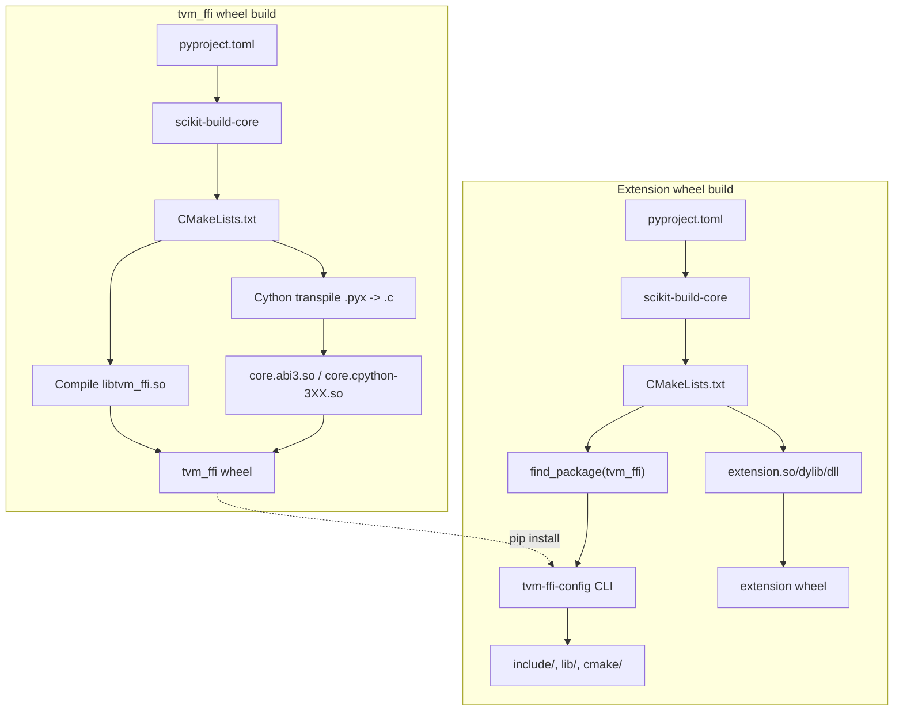
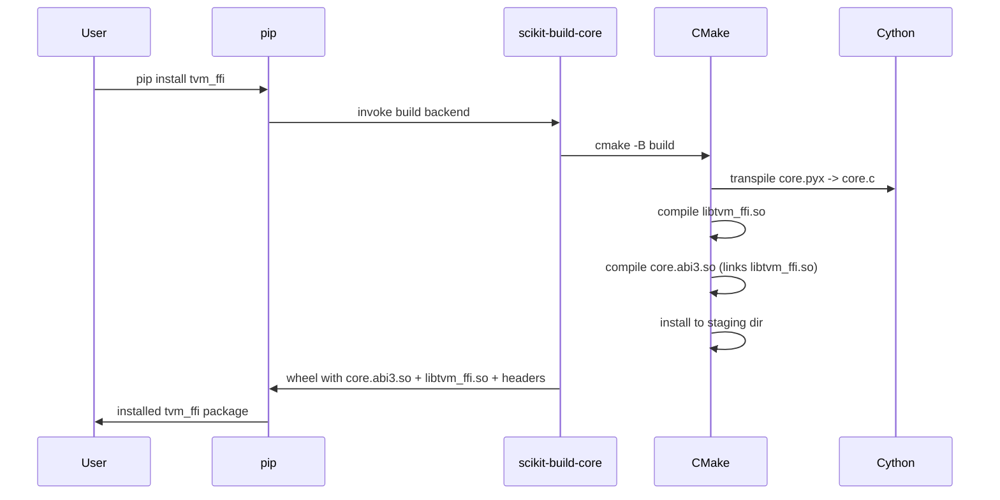

# Python Packaging: scikit-build-core Wheels and Extension Pattern

**TL;DR**
- The `tvm_ffi` package uses scikit-build-core as build backend, producing pip-installable wheels with Cython extensions compiled against the C ABI. On Python >= 3.12, a single `core.abi3.so` (Stable ABI) wheel works across Python versions; older Pythons get per-version `.cpython-3XX.so`.
- A reference extension packaging pattern (`examples/packaging/`) demonstrates how downstream C++ projects build their own pip-installable wheels that depend on the installed `tvm_ffi` package, using `find_package(tvm_ffi)` and the `tvm-ffi-config` CLI.
- RPATH handling, optional numpy/torch dependencies, and cross-platform wheel building via cibuildwheel are tuned for minimal runtime dependencies and maximal portability.

## Problem Statement

### Background
- The TVM FFI was historically embedded in the monolithic TVM compiler package, forcing a heavy install for users who only needed the FFI primitives.
- Building cross-platform wheels with Cython extensions requires careful RPATH management, platform-specific library naming, and proper Stable ABI support.
- Downstream projects (compiler backends, runtime extensions) need a documented pattern for packaging their own C++ code as Python wheels that link against the installed `tvm_ffi`.

### Solution
- Decouple `tvm_ffi` into a standalone pip-installable package with `pyproject.toml` using `scikit-build-core` as the build backend.
- Provide a `tvm-ffi-config` CLI entry point for downstream CMake projects to query include paths, library paths, and compiler flags.
- Ship `cmake/tvm_ffi-config.cmake` so downstream projects can use `find_package(tvm_ffi)` with imported targets `tvm_ffi_header` and `tvm_ffi_shared`.
- Document the extension packaging pattern with a working example.

### Goals
- Single `pip install tvm_ffi` for Python users.
- ABI-agnostic wheels on Python >= 3.12 via Stable ABI.
- Documented, reproducible extension packaging workflow.
- Non-goal: JIT compilation of C++ at install time (all compilation happens at wheel build time).

## Design





### Key Classes, Fields and Interfaces

```python
# === tvm-ffi-config CLI (config.py) ===
# Entry point: tvm-ffi-config
# Provides flags for downstream C++ consumers.

def main() -> None:
    """CLI entry point for querying tvm_ffi installation paths."""
    # Flags:
    #   --includedir       -> path to C++ headers (include/tvm/ffi/)
    #   --dlpack-includedir -> path to dlpack headers (3rdparty/dlpack/include/)
    #   --cmakedir         -> path to cmake/ directory with config module
    #   --sourcedir        -> path to C++ source (for source-build mode)
    #   --libfiles         -> full paths to shared libraries
    #   --libdir           -> directory containing shared libraries
    #   --libs             -> linker flags (-ltvm_ffi)
    #   --cython-lib-path  -> path to Cython extension .so
    #   --cflags           -> C include flags only (-I...) without -std=c++17 (c100338)
    #   --cxxflags         -> C++ compiler flags
    #   --ldflags          -> linker flags
    # Interacts with: libinfo.py (find_libtvm_ffi, find_include_path, etc.)
    # Interacts with: cmake/tvm_ffi-config.cmake (calls this CLI)
    ...

# === Library discovery and loading (libinfo.py, refactored 6887892d) ===

def load_lib_ctypes(package: str, target_name: str, mode: str) -> ctypes.CDLL:
    """Locate and load a shared library via ctypes. Primary public API for DSO loading.
    # package: pip package name (e.g. "apache-tvm-ffi"), used for importlib.metadata RECORD lookup
    # target_name: CMake target name (e.g. "tvm_ffi"), derives platform-specific lib name
    # mode: ctypes load mode string, e.g. "RTLD_GLOBAL" or "RTLD_LOCAL"
    # Interacts with: _find_library_by_basename (discovery), ctypes.CDLL (loading)
    # Extension: downstream packages call this with their own package/target_name
    """
    ...

def load_lib_module(package: str, target_name: str, keep_module_alive: bool = True) -> Module:
    """Locate and load a shared library as a tvm_ffi Module. Convenience wrapper (f255650b).
    # Combines _find_library_by_basename(package, target_name) -> load_module(path)
    # Interacts with: _find_library_by_basename, tvm_ffi.module.load_module
    # Extension: replaces manual _load_lib() boilerplate in downstream extensions
    """
    ...

def _find_library_by_basename(package: str, target_name: str) -> Path:
    """Internal. Primary: importlib.metadata RECORD-based lookup (6887892d).
    Fallback: env vars, build dirs. Was public find_library_by_basename(base: str)."""
    # Interacts with: importlib.metadata.distribution(package) for RECORD parsing
    # Interacts with: _split_env_var, _rel_top_directory, _dev_top_directory for fallback
    ...

def _resolve_and_validate(paths: list[Path], cond: Callable) -> str | None:
    """Shared resolve-and-test logic used by all find_* functions (6887892d)."""
    ...

def find_libtvm_ffi() -> str:
    """Thin wrapper around _find_library_by_basename."""
    ...

def find_include_path() -> str: ...
def find_dlpack_include_path() -> str: ...
def find_cmake_path() -> str:
    """Find the CMake config directory.
    Candidate order (df04392):
      1. <package>/share/cmake/tvm_ffi   (standard install, enables find_package auto-discovery)
      2. <package>/../../cmake            (dev mode)
    """
    ...
def find_cython_lib() -> str: ...

# === Extension packaging pattern (examples/packaging/) ===

# CMakeLists.txt in an extension project:
# find_package(tvm_ffi REQUIRED)
# -> invokes tvm-ffi-config to locate headers and libraries
# -> creates imported targets: tvm_ffi_header (headers only), tvm_ffi_shared (shared lib)
#
# Two build modes:
# 1. Source-build: TVM_FFI_SOURCE_DIR points to tvm_ffi source tree
#    -> compile tvm_ffi from source alongside extension
# 2. Pre-built: find_package(tvm_ffi) uses installed tvm-ffi-config
#    -> link against installed shared library
#
# Interacts with: cmake/tvm_ffi-config.cmake, cmake/Utils/Library.cmake

# Python side of extension (simplified via load_lib_module, f255650b):
# Old pattern: manual _load_lib() with platform-specific naming (27 lines)
# New pattern: single call to load_lib_module:
#   _LIB = tvm_ffi.libinfo.load_lib_module("my-ffi-extension", "my_ffi_extension")
# Interacts with: _find_library_by_basename (importlib.metadata RECORD), load_module

# _ffi_api.py in extension:
# tvm_ffi.init_ffi_api("extension_namespace", __name__)
# Invariant: _LIB must be imported/loaded BEFORE init_ffi_api is called

# === CMake convenience functions (ccd19f82) ===

# tvm_ffi_configure_target(target_name, ...)
#   Bundles link setup, prefix map, Apple dSYM, MSVC flags, and stub generation.
#   Parameters: LINK_SHARED(ON), LINK_HEADER(ON), DEBUG_SYMBOL(ON), MSVC_FLAGS(ON),
#               STUB_DIR(<dir>), STUB_INIT(OFF), STUB_PKG, STUB_PREFIX
#   Interacts with: tvm_ffi_add_prefix_map, tvm_ffi_add_apple_dsymutil, tvm_ffi_add_msvc_flags
#   Invariant: target must already exist as a CMake target

# tvm_ffi_install(target_name, [DESTINATION <dir>])
#   Platform-specific install of debug artifacts (Apple dSYM bundles).
#   Interacts with: tvm_ffi_configure_target (pair them: configure generates, install ships)
#   Extension: extend for PDB on Windows, DWARF split on Linux
```

### Contracts, Assumptions and Invariants
- **Stable ABI wheel**: On Python >= 3.12, the Cython extension uses `Py_LIMITED_API` to produce `core.abi3.so`, which works with all Python >= 3.12 versions. On Python < 3.12, a per-version `core.cpython-3XX.so` is produced.
- **RPATH convention**: The `tvm_ffi_cython` shared library sets `INSTALL_RPATH` to `@loader_path/lib` (macOS) or `$ORIGIN/lib` (Linux) so it finds `libtvm_ffi_shared.so` via relative path. `BUILD_WITH_INSTALL_RPATH` is NOT set (fixed in commit `ad8e5d2`), allowing CMake's standard build/install RPATH behavior. The `tvm_ffi_testing` library uses `@loader_path` / `$ORIGIN` (same directory, no `/lib` subpath) since it is co-located directly with `libtvm_ffi` (5dd60e6). Note: the platform guard must use `UNIX AND NOT APPLE` (not `LINUX`, which is not a built-in CMake variable).
- **Companion library pattern** (da7007f): Test-only code is built as a separate `libtvm_ffi_testing.so` that links against `tvm_ffi_shared`. It is loaded on-demand via `load_module(find_library_by_basename("tvm_ffi_testing"))` at first `import tvm_ffi.testing`. The CMake macro `tvm_ffi_add_target_from_obj` creates the companion target. A `TVMFFITestingDummyTarget()` C ABI function validates link correctness across C++, Python, and Rust.
- **CMake config auto-discovery** (df04392): Config files are installed to `share/cmake/tvm_ffi/` (standard CMake search path), enabling `find_package(tvm_ffi CONFIG REQUIRED)` to work automatically without `tvm_ffi_ROOT` when Python is discoverable. The `tvm-ffi-config --cmakedir` CLI still works but is no longer required.
- **Optional dependencies**: `numpy` is lazy-imported (populated only if importable). `torch` CUDA stream helper is lazily initialized on first CUDA tensor encounter. Neither is a hard dependency.
- **cibuildwheel config**: Builds `cp38-cp312` (5e2a0e5, lowered from cp39), publishes both manylinux2014 and manylinux_2_28 wheels (997a366). Skips `musllinux`, tests only on `cp312` (abi3). Python 3.8 builds include `from __future__ import annotations` and `collections.abc` compatibility shims.
- **Dynamic versioning** (ac63fb9): Version is derived from git tags via `setuptools_scm`. Python `__version__` comes from auto-generated `_version.py`. Cross-language version linting (`tests/lint/check_version.py --cpp --rust`) validates C++ macros and Rust Cargo.toml against the canonical version.
- **Extension wheel invariant**: The compiled `.so`/`.dylib`/`.dll` must be discoverable by `importlib.metadata` RECORD or in fallback search paths. `load_lib_module` handles platform-specific naming automatically.

### Extension Points
- **New build modes**: Add alternative build backends (meson, bazel) by providing equivalent cmake module discovery.
- **New platform support**: Extend `_load_lib()` with additional platform-specific library naming conventions.
- **Custom install layouts**: Override `find_*` functions in `libinfo.py` for non-standard installation paths.

### Usage Examples

#### Building and installing tvm_ffi from source
**Context**: Development workflow for building the package with editable install.

```bash
# Editable install (C++ and Cython changes require rebuild)
uv pip install --force-reinstall --verbose -e .

# For downstream CMake projects:
find_package(tvm_ffi REQUIRED)
target_link_libraries(my_target PRIVATE tvm_ffi_shared)
```

#### Packaging a C++ extension as a pip wheel
**Context**: Creating a Python wheel that wraps custom C++ kernels using the tvm_ffi extension pattern.

```python
# examples/packaging/python/my_ffi_extension/base.py (simplified, f255650b)
import tvm_ffi

_LIB = tvm_ffi.libinfo.load_lib_module("my-ffi-extension", "my_ffi_extension")

# Two patterns for exposing C++ functions:
# Pattern 1: Direct module function lookup
result = _LIB.add_one(x, y)   # calls __tvm_ffi_add_one C symbol

# Pattern 2: Global function registry via init_ffi_api
from . import _ffi_api         # calls init_ffi_api("my_ffi_extension", __name__)
```

CMake side (simplified via convenience functions, ccd19f82):
```cmake
find_package(tvm_ffi CONFIG REQUIRED)
add_library(my_ffi_extension SHARED src/extension.cc)
tvm_ffi_configure_target(my_ffi_extension STUB_DIR "./python" STUB_INIT ON)
install(TARGETS my_ffi_extension DESTINATION .)
tvm_ffi_install(my_ffi_extension)
_ffi_api.raise_error("msg")   # calls reflection-registered global func
```

#### C++ extension source with two registration patterns
**Context**: The C++ side showing `TVM_FFI_DLL_EXPORT_TYPED_FUNC` for runtime-loaded modules and `TVM_FFI_STATIC_INIT_BLOCK` for statically linked code.

```cpp
// examples/packaging/src/extension.cc
#include <tvm/ffi/function.h>
#include <tvm/ffi/reflection.h>
namespace refl = tvm::ffi::reflection;

// Pattern 1: C symbol export (runtime-loaded via Module::LoadFromFile)
void AddOne(ffi::TensorView x, ffi::TensorView y) { /* ... */ }
TVM_FFI_DLL_EXPORT_TYPED_FUNC(add_one, AddOne);
// Generates: extern "C" int __tvm_ffi_add_one(void*, TVMFFIAny*, int32_t, TVMFFIAny*)

// Pattern 2: Reflection-based global registration (statically linked)
void RaiseError(tvm::ffi::String msg) {
    TVM_FFI_THROW(RuntimeError) << msg;
}
TVM_FFI_STATIC_INIT_BLOCK() {
    refl::GlobalDef().def("my_ffi_extension.raise_error", RaiseError);
}
```

## Alternatives & Trade-offs

### Monolithic TVM package including FFI
- Pros: Single install, no dependency management
- Cons: Forces heavy TVM compiler install for users who only need FFI primitives. Prevents independent versioning. Blocks lightweight downstream packages.

### Pure-Python bindings (no Cython, ctypes only)
- Pros: No compilation step, simplest packaging
- Cons: ctypes per-call overhead is 5-10x slower than Cython for argument packing. Cannot use Stable ABI efficiently.

## Related Work
### Design Docs & ADRs
- [0012-python-bindings.md](../designs/0012-python-bindings.md) -- The Cython extension built by this packaging system
- [0011-module-system.md](../designs/0011-module-system.md) -- Module::LoadFromFile used by extension pattern
- [0004-function-system.md](../designs/0004-function-system.md) -- Global function registry used by init_ffi_api
- [ADR 0008](../ADRs/0008-standalone-python-package.md) -- Decision to decouple tvm_ffi

### Evidence Matrix
- Python package bringup (pyproject.toml, scikit-build-core, tvm-ffi-config, libinfo) -> `commits/2025-08-24-2d41a5115f6a91e2781012a3379f9626bc9e18a1.md` (2d41a51)
- cibuildwheel config, optional numpy/torch, RPATH setup -> `commits/2025-08-25-2cf211f14a41a11c536fd16b6ea102dac3627c0a.md` (2cf211f)
- RPATH BUILD_WITH_INSTALL_RPATH removal -> `commits/2025-08-29-ad8e5d2c3345c4cca1a9ce50a24238c0cafcb05e.md` (ad8e5d2)
- Packaging example, cmake install fix, lazy torch stream -> `commits/2025-08-30-4523a834e6d7331870230873365a895ce94da050.md` (4523a83)
- Missing example files + directory rename -> `commits/2025-09-01-5a3e3cbd4dbdf1f01d61bdfbe17b38134cc45e84.md` (5a3e3cb)
