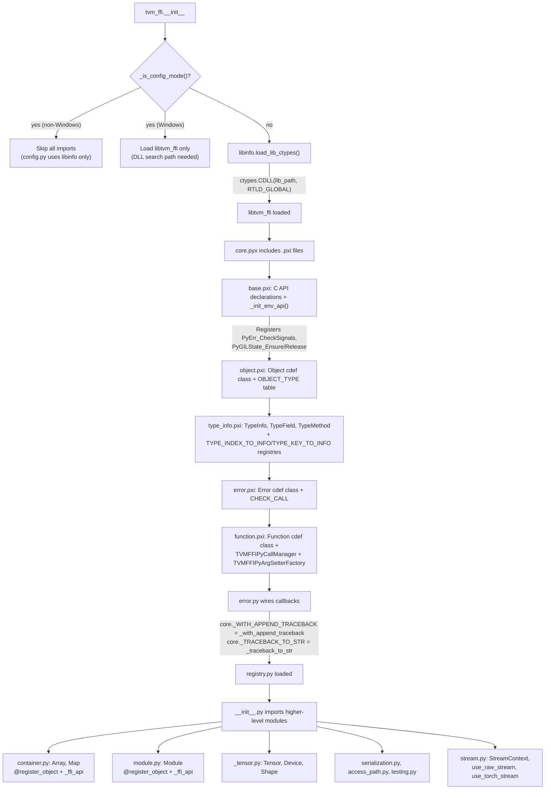
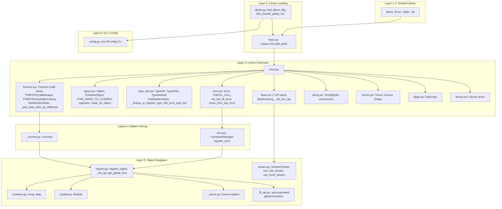
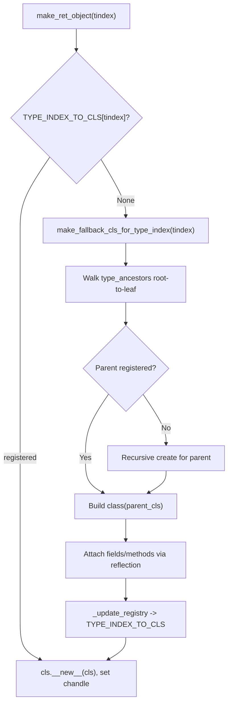
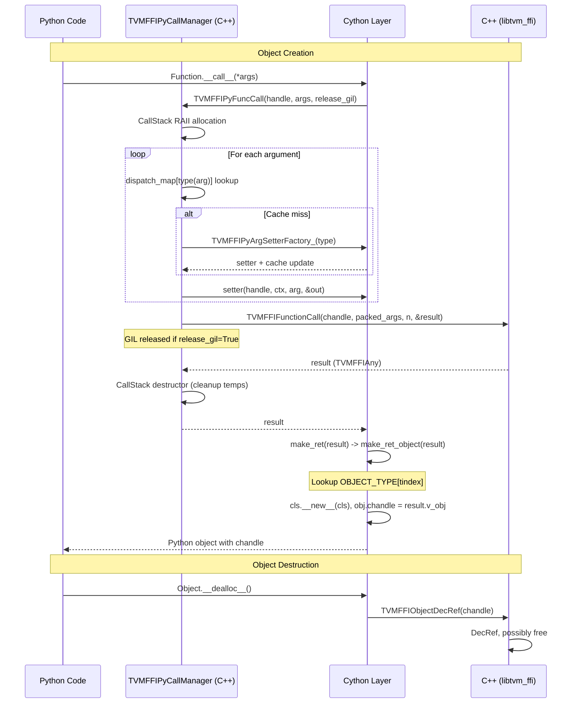
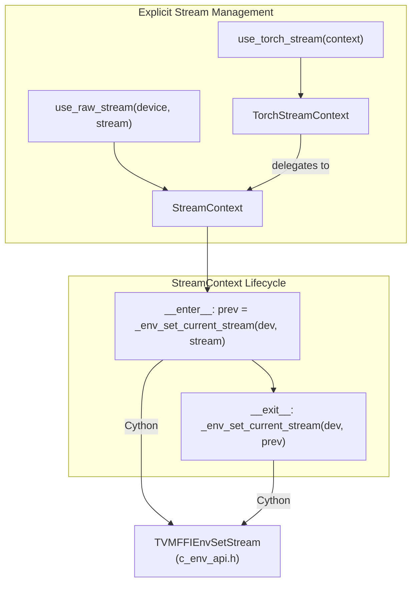
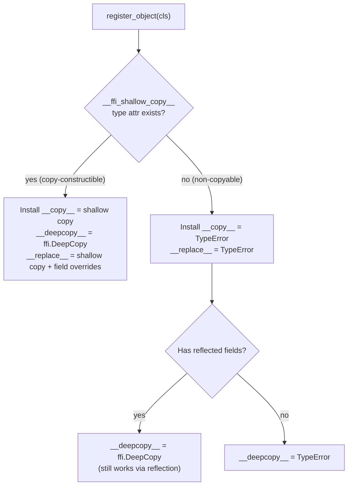
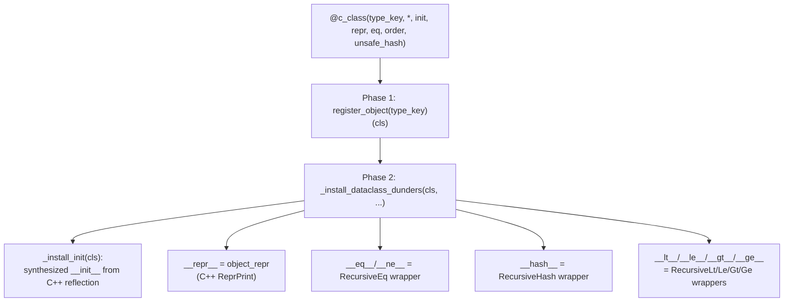
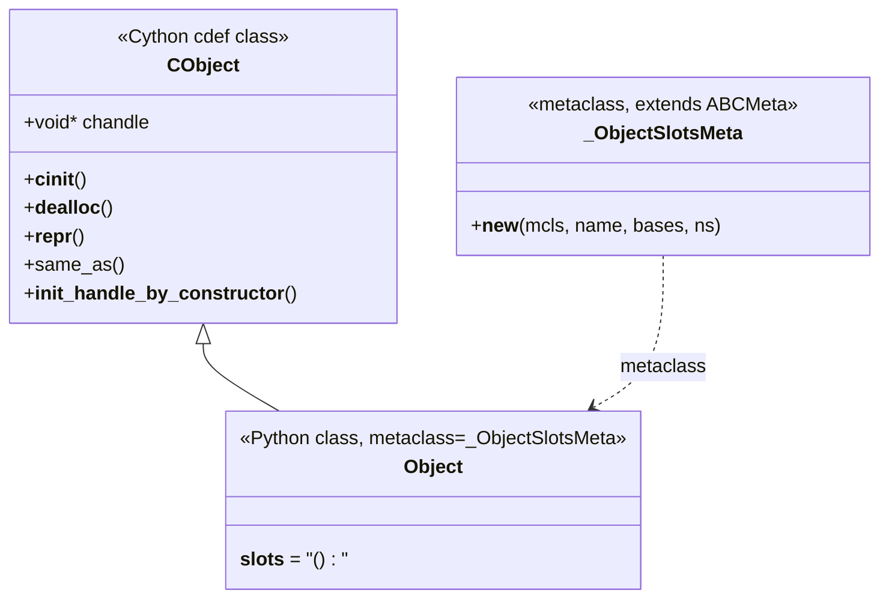

# Python Bindings (tvm_ffi Package)

**TL;DR**
- The `python/tvm_ffi/` package is a standalone, pip-installable Python module (`apache-tvm-ffi`) that exposes the entire C++ FFI (Object, Function, Array, Map, Tensor, Module, Shape, Error, etc.) to Python via a Cython extension module (`core.pyx` + `.pxi` files) and pure-Python wrapper modules.
- The package follows a strict layered initialization order: `base.py` loads `libtvm_ffi` via `ctypes.CDLL` -> Cython `core.pyx` includes all `.pxi` files and calls `_init_env_api` -> `error.py` wires traceback callbacks -> `registry.py` and higher-level modules register their object types and auto-populate global function bindings. (Note: the former `convert.py` -> `_set_func_convert_to_object` callback wiring was removed in commit `043d9f6`; container conversion is now handled directly in Cython via `ConstructorCall`.)
- Three key Python-side patterns recur: (1) `@register_object` decorator-based type registration with automatic reflection-based class attribute population, (2) `init_ffi_api` (renamed from `_init_api` in commit `40f4d9d`) auto-population of module-level attributes from the global function registry by prefix matching, and (3) `PyNativeObject` dual-inheritance for types that subclass both a Python builtin and expose a `__tvm_ffi_object__` handle.

## Problem Statement

### Background

The C++ FFI provides a rich set of type-erased values, objects, functions, and containers, but Python users need idiomatic access: dictionary-like maps, list-like arrays, callable functions, and Pythonic error handling. A previous approach embedded FFI bindings within the full TVM Python package (`tvm.runtime`), coupling lightweight FFI consumers to the heavyweight TVM installation.

### Solution

A standalone Python package (`python/tvm_ffi/`) with:
- **Cython extension module** for performance-critical paths: argument packing (via `TVMFFIPyCallManager` type-dispatched setters, replacing the former `make_args`), function calls (via `TVMFFIPyFuncCall`), object creation, and error propagation. A C++ helper header (`tvm_ffi_python_helpers.h`) provides the core call manager infrastructure.
- **Pure Python wrappers** for higher-level interfaces: `Array`, `Map`, `Module`, `Tensor`, `Shape`, each registered with `@register_object` and implementing standard Python ABCs (`collections.abc.Sequence`, `collections.abc.Mapping`).
- **Callback wiring** to connect Python-side logic (traceback synthesis, value conversion) to the Cython/C++ layer via module-level function pointers.

### Goals

- **Goal**: Provide idiomatic Python access to all C++ FFI objects and functions.
- **Goal**: Standalone pip-installable package with no dependencies beyond the C++ shared library.
- **Goal**: Automatic Python class enrichment from C++ reflection metadata (fields become `property`, methods become bound methods).
- **Goal**: Unified cross-language error handling with synthesized Python traceback frames from C++ traceback strings.
- **Non-goal**: Thread-safe concurrent registration (all registration happens at import time).
- **Non-goal**: Pure-Python fallback (Cython extension is required).

## Design

### Package Import/Initialization Flow



### Layered Architecture



### Pattern 1: `@register_object` Decorator Flow

```python
@register_object("ffi.Array")
class Array(core.Object, collections.abc.Sequence):
    ...
```

Registration steps:
1. `core._object_type_key_to_index("ffi.Array")` calls `TVMFFITypeKeyToIndex` to look up the integer type index.
2. `core._add_class_attrs(type_index, cls)` (in `registry.py`, replacing the former Cython-side `_add_class_attrs_by_reflection`) uses `TypeInfo` metadata to iterate `fields` and `methods`:
   - For each field: creates a `FieldGetter`/`FieldSetter` pair (Cython extension types holding C function pointers + byte offset), wraps them in a `property`, and sets it on the class via `setattr`. Respects `kTVMFFIFieldFlagBitMaskWritable` for read-only vs read-write.
   - For each method: extracts the `Function` from `TypeMethod.method`, wraps in `_member_method_wrapper` (for instance methods) or `staticmethod` (for static methods), and sets on the class.
   - Already-defined attributes are skipped (Python-side overrides take precedence).
3. `core._register_object_by_index(type_index, cls)` returns a `TypeInfo` and stores the class in both `TYPE_INDEX_TO_CLS[type_index]` and `TYPE_INDEX_TO_INFO[type_index]` for future object instantiation.
4. `_install_init(cls, enabled=True)` (commit `6973d22` #491): If the class has a `__ffi_init__` method from C++ reflection, wires it as `__init__`. Classes without `__ffi_init__` keep default `object.__init__` behavior (no TypeError guard). See [ADR 0073](../ADRs/0073-register-object-auto-wires-init.md).

When the Cython layer returns an object from C++ (`make_ret_object`), it looks up `TYPE_INDEX_TO_CLS[tindex]` (a fast-path parallel list, commit `035975a`) to find the registered Python class. If `None`, triggers the **fallback class auto-generation** protocol (commit `98cb8af`):

1. `make_fallback_cls_for_type_index` in `object.pxi` is called.
2. It walks `type_ancestors` from root to leaf, recursively creating fallback classes for each unregistered ancestor (parent classes are created before children).
3. Each fallback class inherits from the parent's fallback or registered class.
4. Reflected fields are attached via `TypeField.as_property(cls)` and methods via `TypeMethod.as_callable(cls)`.
5. The class is registered via `_update_registry` so the slow path fires only once per type.
6. Fallback classes include a warning in `__doc__` indicating they are auto-generated.

See [ADR 0040](../ADRs/0040-auto-fallback-python-class.md) for the decision rationale.



**Docstring policy**: Field and method docstrings are `None` unless explicitly set in C++ (commit `43ffe57` reverted auto-generated fallback docstrings to fix Sphinx conflicts).

Instantiation: `cls.__new__(cls)`, then sets `chandle` to the raw C object pointer.

### Pattern 2: `_init_api` Auto-Population

```python
# In _ffi_api.py:
_init_api("ffi", __name__)
```

`_init_api(namespace, target_module_name)` performs:
1. Strips `"tvm."` prefix if present to get the function prefix.
2. Calls `list_global_func_names()` to enumerate all registered global functions.
3. For each function whose name starts with `prefix + "."`:
   - Extracts the local name (after the prefix and dot).
   - Skips names containing additional dots (sub-namespaces).
   - Calls `get_global_func(name)` and sets it as an attribute on the target module.

This mechanism enables `_ffi_api.ArrayGetItem`, `_ffi_api.ArraySize`, etc. to be available as module-level attributes without explicit registration in Python.

### Pattern 3: `PyNativeObject` Dual Inheritance

For types like `Shape` that subclass a Python builtin (e.g., `tuple`) while also wrapping a C++ object:

```python
class Shape(tuple, core.PyNativeObject):
    __tvm_ffi_object__ = None

    @classmethod
    def __from_tvm_ffi_object__(cls, obj):
        # Construct Python tuple from C++ Shape data
        shape = cls.__new__(cls, shape_data)
        shape.__tvm_ffi_object__ = obj
        return shape
```

The `PyNativeObject` base provides `__init_tvm_ffi_object_by_constructor__` which creates a hidden `Object` instance and stores it as `self.__tvm_ffi_object__`. When passing a `PyNativeObject` to a C++ function, `make_args` detects the `__tvm_ffi_object__` attribute and extracts the underlying `chandle`.

### Cython Object Lifecycle



### Argument Packing Priority Order

As of commit `043d9f6`, the former monolithic `make_args` function is replaced by `TVMFFIPyArgSetterFactory_` (Cython callback) + per-type `TVMFFIPyArgSetter` function pointers cached in a thread-local `unordered_map<PyTypeObject*, TVMFFIPyArgSetter>`. See [0019-python-ffi-call-dispatch](0019-python-ffi-call-dispatch.md) for the full architecture. The factory classifies types in this priority order:

1. `None` -> `SetterNone_` (C++ inline)
2. `Tensor` (FFI Tensor) -> `SetterTensor_`
3. `Object` (any registered FFI object) -> `SetterObject_`
4. `ObjectRValueRef` -> `SetterObjectRValueRef_`
5. `PyNativeObject` subclass of `str` -> `SetterPyNativeObjectStr_`
6. `PyNativeObject` subclass of `bytes` -> `SetterPyNativeObjectBytes_`
7. `PyNativeObject` (general) -> `SetterPyNativeObjectGeneral_`
8. `__c_dlpack_from_pyobject__` protocol -> `SetterDLPackFromPyObject_` (C-level DLPack bypass)
9. `torch.Tensor` -> `SetterTorch_` or `SetterDLPackFromPyObject_` (if C exporter available)
10. `__dlpack__` protocol objects (with `__tvm_ffi_env_stream__` support) -> `SetterDLPack_`
11. `bool` -> `SetterBool_` (C++ inline, before `Integral` because `bool` subclasses `int`)
12. `Integral` (int) -> `SetterInt_` (C++ inline)
13. `float` -> `SetterFloat_` (C++ inline)
14. `_CLASS_DTYPE` -> `SetterDType_` (before `str` because DType subclasses `str`)
15. `_CLASS_DEVICE` -> `SetterDevice_`
16. `str` -> `SetterStr_` (creates `String` via `TVMFFIStringFromByteArray`, supporting SSO)
17. `bytes`/`bytearray` -> `SetterBytes_` (creates `Bytes` via `TVMFFIBytesFromByteArray`)
18. `tuple` -> `SetterTuple_` (recursive via `ConstructorCall` to `ffi.Array`)
19. `list` -> `SetterTupleLike_` (recursive via `ConstructorCall` to `ffi.Array`)
20. `dict` -> `SetterMap_` (recursive via `ConstructorCall` to `ffi.Map`)
21. `ctypes.c_void_p` -> `SetterCtypesVoidPtr_`
22. `Exception` -> `SetterException_`
23. `ObjectConvertible` -> `SetterObjectConvertible_`
24. `callable` -> `SetterCallable_`
25. **Fallback**: Any unrecognized type -> `SetterFallback_` (wraps as `OpaquePyObject`)

Notable changes from the pre-refactor order: `PyNativeObject` is split into three sub-setters dispatched early; `ObjectRValueRef` moved up; `str`/`bytes` now create proper `String`/`Bytes` objects (not raw pointers); containers (`tuple`, `list`, `dict`) have dedicated setters with recursive `ConstructorCall` instead of `_FUNC_CONVERT_TO_OBJECT`; `None` moved to the top.

### Python API Naming Alignment (commit `40f4d9d` #18277)

The following public symbols were renamed for consistency with PyTorch/array API conventions:

| Old Name | New Name |
|---|---|
| `register_func` | `register_global_func` |
| `_init_api` | `init_ffi_api` |
| `ObjectGeneric` | `ObjectConvertible` |
| `Device.device_id` | `Device.index` |
| `Device.device_type` (int property) | `Device.type` (str property) + `Device.dlpack_device_type()` (int method) |
| `device(dev_type, dev_id)` | `device(device_type, index)` |

Additional changes:
- **`DLDeviceType` IntEnum**: Standalone enum class extracted from Device, containing DLPack device type constants (`kDLCPU`, `kDLCUDA`, etc.).
- **Private-module naming convention**: Internal modules prefixed with `_` (`_convert.py`, `_dtype.py`, `_tensor.py`). Public re-exports via `__init__.py`.
- `String`, `Bytes`, `DataTypeCode`, `ModulePropertyMask` removed from `tvm_ffi.__all__`.
- Per-device convenience functions (`cpu()`, `cuda()`, `rocm()`, etc.) removed from public API.

### DLPack Import Defaults (commit `1b824e8` #18282)

The Python `from_dlpack()` defaults were relaxed to align with the C++ layer:
- Parameters renamed: `required_alignment` -> `require_alignment`, `required_contiguous` -> `require_contiguous`.
- Defaults changed: `require_alignment=0` (was 8), `require_contiguous=False` (was True).
- The `core.__dlpack_auto_import_required_alignment__` constant was removed.
- Auto-conversion paths (`convert()`, `make_args` for `__dlpack__` objects and `torch.Tensor`) now import tensors without alignment or contiguity restrictions.

### `__tvm_ffi_env_stream__` Protocol (commit `db98729` #18295)

A generic Python duck-typing protocol for stream context exchange when DLPack-compatible objects are passed as FFI arguments:

- Any object implementing both `__dlpack__` and `__tvm_ffi_env_stream__()` can provide a stream handle (as a Python integer representing a `void*`).
- The protocol is queried only for non-CPU devices and only when no prior argument has already set the stream context (first-writer-wins).
- This generalizes the torch-specific CUDA stream detection to any framework (e.g., JAX, CuPy).
- `__tvm_ffi_env_stream__()` must return a Python integer castable to `TVMFFIStreamHandle` (`void*`).

### Python Stream Context API (commit `3197cd0` #5)

The `python/tvm_ffi/stream.py` module provides explicit Python context managers for managing the FFI environment stream, complementing the implicit stream auto-detection in `TVMFFIPyCallManager`.



**API surface**:

| Function | Purpose |
|---|---|
| `StreamContext(device, stream)` | Low-level context manager. `__enter__` saves previous stream via `core._env_set_current_stream()` and sets new one; `__exit__` restores. |
| `use_raw_stream(device, stream)` | Creates a `StreamContext` from a raw stream handle (`int` or `ctypes.c_void_p`). |
| `use_torch_stream(context=None)` | Creates a `TorchStreamContext` that composes a torch stream/graph context with a `StreamContext`. When `context` is `None`, uses `torch.cuda.current_stream()`. |
| `get_raw_stream(device)` | Queries the current FFI stream for a device via `core._env_get_current_stream()`. |

**Cython bindings** (`base.pxi`):
- `_env_set_current_stream(device_type, device_id, stream)` -> calls `TVMFFIEnvSetStream`, returns previous stream handle.
- `_env_get_current_stream(device_type, device_id)` -> calls `TVMFFIEnvGetStream`, returns current stream handle.

**Key invariant**: Stream contexts are nestable. Each `__enter__` saves the previous stream, and `__exit__` restores it, forming a stack discipline. This interoperates with the implicit stream context management in `TVMFFIPyCallManager` (which also uses save/restore semantics).

**TorchStreamContext** composes two context managers: (1) the torch stream/graph context (if provided), and (2) the FFI `StreamContext` using the current CUDA stream. The torch context is entered first, then the FFI context queries `torch.cuda.current_stream()` to get the active stream handle. `use_torch_stream` is only available when torch is importable; otherwise it raises `ImportError`.

### Unified `__repr__` via `ffi.ReprPrint` (commit `b648c5d` #454)

As of commit `b648c5d`, all Python-side `__repr__` generation for FFI objects is delegated to the C++ `ffi.ReprPrint` function. The `__object_repr__` function in `object.pxi` lazily loads `ffi.ReprPrint` on first call and delegates to it. If the C++ function is unavailable or raises, a silent fallback to the old `ClassName(handle)` format occurs (`__repr__` must never raise).

This replaces the previous Python-side `method_repr` exec-based code generation in `_utils.py` (removed), and the `repr` parameter on both `c_class()` and `field()` (removed). Per-field repr control is now handled exclusively via the C++ `Repr(false)` InfoTrait, which sets `kTVMFFIFieldFlagBitMaskReprOff` (bit 6) on the field.

The `ffi.ReprPrint` function uses DFS with 3-state tracking (NotVisited/InProgress/Done) to handle DAG objects (memoized repr) and cycles (shown as `...`). Built-in repr functions are registered for String, Bytes, Tensor, Shape, Array, List, and Map. Custom types can register `__ffi_repr__` via `TypeAttrDef<T>`. Address display is hidden by default; set `TVM_FFI_REPR_WITH_ADDR=1` to enable.

See [ADR 0061](../ADRs/0061-unified-repr-print.md) for the decision rationale.

### Deep Copy Protocol (`__copy__`, `__deepcopy__`, `__replace__`)

As of commit `c73d61a` (#438), FFI objects support the standard Python copy protocol (`copy.copy`, `copy.deepcopy`) and the `copy.replace` protocol:



**Shallow copy** (`__copy__`): Delegates to the C++ `__ffi_shallow_copy__` type attribute, which calls the C++ copy constructor via `make_object<T>(*src)`. Only available for copy-constructible types.

**Deep copy** (`__deepcopy__`): Delegates to `ffi.DeepCopy` (`src/ffi/extra/deep_copy.cc`), a memoized graph copier that:
- Recursively copies all reachable objects in the object graph
- Preserves shared references (same object copied once, all references updated)
- Handles reference cycles via memoization
- Treats `String`/`Bytes` as immutable terminals (not copied)
- Deep copies `Array`, `List`, and `Map` recursively
- Resolves field values by runtime type (not static type), so `Any`/`ObjectRef` fields containing containers are correctly deep copied

**Replace** (`__replace__`): Creates a shallow copy, then overrides specific fields by keyword argument. Mirrors `dataclasses.replace()` / `copy.replace()` (Python 3.13+) semantics.

**Container support**: `Array` and `Map` also support `__deepcopy__` via `ffi.DeepCopy`, enabling `copy.deepcopy` on container roots.

### `@c_class` Structural Dunders (commit `e5f3af7` #488)

As of commit `e5f3af7`, the `@c_class` decorator is a two-phase decorator that combines FFI type registration with structural dunder installation:



Each installed dunder delegates to the corresponding C++ recursive operation via `_ffi_api`. The `_is_comparable(self, other)` guard checks bidirectional `isinstance` before delegating, returning `NotImplemented` for unrelated types (following Python data model conventions).

`@dataclass_transform(eq_default=False, order_default=False)` on the decorator enables pyright/mypy to understand `@c_class`-decorated classes as dataclass-like.

**Key behavioral change** (updated in commit `6973d22` #491): `@register_object` now auto-wires `__init__` when `__ffi_init__` is available from C++ reflection. This applies to both auto-inits (from `RegisterAutoInit`) and explicit inits (from `refl::init<Args...>()`). The `_install_dataclass_dunders` call from `@c_class` additionally installs structural dunders (`__repr__`, `__eq__`, etc.) that `register_object` does not provide. See [ADR 0073](../ADRs/0073-register-object-auto-wires-init.md).

See [ADR 0069](../ADRs/0069-c-class-as-register-object-plus-dunders.md) and [diagram 0018](../diagrams/0018-c-class-decorator-flow.md) for details.

### `__ffi_init__` to Python `__init__` Wiring (commit `b1abaea` #486)

As of commit `b1abaea`, the Python init wiring infrastructure connects C++ reflection-generated `__ffi_init__` methods to Python `__init__` constructors. The machinery lives in `registry.py`:

- **`_install_init(cls, enabled)`**: Central dispatcher. If `enabled=True`, looks for `__ffi_init__` in type metadata. If `auto_init=True` (set by C++ `RegisterAutoInit`), synthesizes a Python `__init__` with proper `inspect.Signature`. If explicit init (user-registered `refl::init<Args...>`), exposes raw `__ffi_init__` as `__init__`. If `enabled=False`, installs a `TypeError` guard.
- **`_make_init(type_cls, type_info)`**: Builds a Python `__init__` that packs positional args, appends the KWARGS sentinel object (`core.KWARGS`), then appends key-value pairs for keyword args, and delegates to `self.__ffi_init__(*ffi_args)`.
- **`_make_init_signature(type_info)`**: Walks the parent chain (parent-first order), collects all fields, partitions into positional/keyword-only and required/optional groups, and builds an `inspect.Signature`.

The Cython layer exposes three new field flags on `TypeField`: `c_init` (from `kTVMFFIFieldFlagBitMaskInitOff`, bit 9), `c_kw_only` (from `kTVMFFIFieldFlagBitMaskKwOnly`, bit 10), and `c_has_default` (from `kTVMFFIFieldFlagBitMaskHasDefault`, bit 1).

See [ADR 0068](../ADRs/0068-auto-init-from-reflection.md) and [diagram 0018](../diagrams/0018-c-class-decorator-flow.md) for details.

### Config-Mode Import Bypass (commits `5c0deb9` #489, `bad3896` #490)

As of commit `5c0deb9`, `__init__.py` detects config-mode invocations (`tvm-ffi-config` CLI or `python -m tvm_ffi.config`) via `_is_config_mode()` and skips all heavy imports when in config mode. The detection checks `sys.argv[0]` and `sys.orig_argv` (Python 3.10+). All imports are wrapped in `if TYPE_CHECKING or not _is_config_mode():` to maintain type-checker visibility.

On Windows (`sys.platform.startswith("win32")`), the native library is loaded even in config mode (commit `bad3896` #490) because DLL search path resolution requires `ctypes.CDLL` to have been called before any Cython extension can be imported, even indirectly.

See [diagram 0019](../diagrams/0019-config-mode-init-bypass.md) for the full flow.

### `_ObjectSlotsMeta` and Slots Enforcement (commit `49a5d71` #480)

As of commit `49a5d71`, the Cython `Object` class is split into two layers to enforce `__slots__ = ()` across the entire Object hierarchy:



- **`CObject`** (Cython `cdef class`, `object.pxi`): Extension type that owns the low-level `chandle`. Contains ref-counting (`__dealloc__` -> `TVMFFIObjectDecRef`), repr delegation, equality, and constructor wiring.
- **`_ObjectSlotsMeta`** (Python, `object.pxi`): Metaclass extending `ABCMeta` that auto-injects `__slots__ = ()` into any subclass that omits it. The former `__instancecheck__`/`__subclasscheck__` overrides were removed in commit `721d878` (#498) because they incorrectly returned `True` for any `CObject` instance/subclass regardless of the target class. See [ADR 0072](../ADRs/0072-remove-broken-metaclass-type-checks.md).
- **`Object`** (Python class, `object.pxi`): Inherits from `CObject` with `_ObjectSlotsMeta` as metaclass. All user-facing Object subclasses extend this class.

**Rationale**: FFI objects are lightweight handles (a single `void*`). Allowing per-instance `__dict__` (the default for Python classes) adds 56+ bytes of overhead per object and permits accidental attribute creation that shadows reflected properties. The metaclass enforces memory efficiency without requiring every subclass author to remember `__slots__`.

**Opt-in `__dict__`**: Subclasses that genuinely need per-instance dynamic attributes (e.g., `Module` for caching looked-up functions) declare `__slots__ = ("__dict__",)` explicitly.

**Key invariants:**
- Every `Object` subclass that omits `__slots__` gets `__slots__ = ()` injected by the metaclass.
- Setting arbitrary instance attributes on an Object subclass without `__dict__` in `__slots__` raises `AttributeError`.
- `isinstance(x, Object)` works via standard Python MRO because `Object` inherits from `CObject`. The former metaclass `__instancecheck__`/`__subclasscheck__` overrides were removed in commit `721d878` (#498) due to incorrect behavior (returning `True` for all `CObject` instances regardless of target class). See [ADR 0072](../ADRs/0072-remove-broken-metaclass-type-checks.md).

See [ADR 0066](../ADRs/0066-slots-enforcement-via-metaclass.md) for the decision rationale.

### Package Version (`__version__`)

As of commit `ebea4dc`, `tvm_ffi.__version__` is exposed in `__init__.py` and `__all__`. A pre-commit hook (`tests/lint/check_version.py`) enforces that `pyproject.toml` and `__init__.py` versions stay synchronized, auto-fixing mismatches.

### DLDeviceType Extensions

- `kDLTrn = 17` (Trainium) added in commit `935a5a0`, with `"trn"` string mapping in the `Device` class.
- `kDLMAIA = 17`, `kDLTrn` renumbered to 18 in commit `49a5d71` (#480).

### Type Stubs, Mypy, and PEP 561

- **`core.pyi`** (commit `785e8ca`): Comprehensive type-stub file for the Cython-generated `core` module, covering `Object`, `Function`, `Tensor`, `Device`, `DataType`, `Error`, `String`, `Bytes`, and all module-level functions. Enables Pylance/mypy autocompletion and type checking.
- **`_ffi_api.pyi`**: Stub file for the dynamic FFI API module.
- **Mypy integration** (commit `40e9c83`): Mypy pre-commit hook and `[tool.mypy]` configuration in `pyproject.toml`. Extensive type annotation fixes across the codebase.
- **PEP 561 marker** (commit `5cfd705`): `py.typed` marker file bundled in wheels/sdists, enabling downstream consumers to use the package's type stubs.
- **Consolidated mypy config** (commit `5cfd705`): Single mypy pre-commit hook (mypy v1.18.2) replaces multiple per-path hooks. Project-wide targets with per-directory overrides.

### Framework Dtype Argument Setters

As of commit `d77606a`, `torch.dtype` and `numpy.dtype` (including `ml_dtypes`) are accepted as FFI function arguments via dedicated Cython-level argument setters:

- **`TVMFFIPyArgSetterDTypeFromTorch_`**: Converts `torch.dtype` to `DLDataType` via `TORCH_DTYPE_TO_DTYPE` lookup table.
- **`TVMFFIPyArgSetterDTypeFromNumpy_`**: Converts `numpy.dtype` (and `ml_dtypes`) to `DLDataType` via `NUMPY_DTYPE_TO_DTYPE` / `MLDTYPES_DTYPE_TO_DTYPE` lookup tables.
- Tables cover standard int/uint/float types plus Float8 variants, Float6, Float4, and bfloat16.
- Integrated into `TVMFFIPyArgSetterFactory_` dispatch chain and explicit `convert()` path.

### Key Classes, Fields and Interfaces

- **`CObject`** (Cython `cdef class`, `object.pxi`): Low-level extension type owning `void* chandle`. Ref-counted via `TVMFFIObjectDecRef` in `__dealloc__`. Provides `same_as`, `__init_handle_by_constructor__`, and repr delegation.
- **`Object`** (Python class extending `CObject`, `object.pxi`): Public base class for all FFI objects. Uses `_ObjectSlotsMeta` metaclass to enforce `__slots__ = ()`. Provides `__reduce__`/`__getstate__`/`__setstate__` for pickle via JSON graph serialization.
- **`_ObjectSlotsMeta`** (Python metaclass, `object.pxi`): Extends `ABCMeta`. Auto-injects `__slots__ = ()` on subclasses that omit it. As of commit `721d878` (#498), the `__instancecheck__`/`__subclasscheck__` overrides were removed because they unconditionally returned `True` for any `CObject` instance regardless of the target class, causing incorrect cross-hierarchy type checks (e.g., `isinstance(Map(), Array)` returning `True`). Standard Python MRO-based checks work correctly because all FFI objects are proper `Object` subclasses. See [ADR 0072](../ADRs/0072-remove-broken-metaclass-type-checks.md).
- **`OpaquePyObject`** (Cython `cdef class` extending `Object`, `object.pxi`): Wraps arbitrary Python objects as ref-counted FFI objects. Created via `TVMFFIObjectCreateOpaque` with `kTVMFFIOpaquePyObject` type index. The `pyobject()` method recovers the original Python object from the opaque handle via `TVMFFIOpaqueObjectGetCellPtr`. Enables transparent round-trip identity preservation: `make_ret_opaque_object` unwraps back to the original Python object, so `y is x` holds after a round-trip.
- **`PyNativeObject`** (Python class, `object.pxi`): Base for types that subclass both Python builtins and FFI objects. Stores `__tvm_ffi_object__` as a hidden `Object` instance.
- **`Function`** (Cython `cdef class` extending `Object`, `function.pxi`): Registered at `kTVMFFIFunction` index. Has a `c_release_gil` C-level field (default from `TVM_FFI_RELEASE_GIL_BY_DEFAULT` env var). `__call__` delegates to `TVMFFIPyFuncCall` which uses `TVMFFIPyCallManager` for type-dispatched argument packing, conditional GIL release, stream/allocator context management, and temporary cleanup. See [0019-python-ffi-call-dispatch](0019-python-ffi-call-dispatch.md).
- **`Error`** (Cython `cdef class` extending `Object`, `error.pxi`): Registered at `kTVMFFIError` index. Wraps `TVMFFIErrorCell`. `py_error()` converts to Python exception class via `ERROR_NAME_TO_TYPE` lookup and appends synthesized traceback.
- **`FieldGetter`/`FieldSetter`** (Cython `cdef class`, `function.pxi`): Hold `TVMFFIFieldGetter`/`TVMFFIFieldSetter` C function pointers plus byte offset. Used as `property` getter/setter in reflection-enriched classes.
- **`Array`** (`container.py`): `@register_object("ffi.Array")`. Implements `collections.abc.Sequence`. Delegates to `_ffi_api.ArrayGetItem`, `_ffi_api.ArraySize`.
- **`Map`** (`container.py`): `@register_object("ffi.Map")`. Implements `collections.abc.Mapping`. Delegates to `_ffi_api.MapGetItem`, `_ffi_api.MapCount`, `_ffi_api.MapForwardIterFunctor`.
- **`Module`** (`module.py`): `@register_object("ffi.Module")`. Wraps `ModuleObj`. Delegates to `_ffi_api.ModuleGetFunction`, `_ffi_api.ModuleLoadFromFile`, `_ffi_api.SystemLib`. `__getattr__` enables attribute-style function access.
- **`TracebackManager`** (`error.py`): Synthesizes Python `types.TracebackType` frames from C++ traceback strings by creating `code_object` via `ast.parse` + `compile` + `code_object.replace(co_name=func, co_firstlineno=lineno)`. Cached by `(filename, lineno, func)` key.
- **`convert()`** (`_convert.py`): Python-to-FFI value conversion for direct Python-level calls. `list`/`tuple` -> `Array`, `dict` -> `Map`, `str` -> `String`, callable -> FFI Function. Unknown types are wrapped as `OpaquePyObject`. Note: as of commit `043d9f6`, `convert()` is no longer registered into the Cython core layer via `_set_func_convert_to_object`; container conversion during argument packing is handled directly by Cython setters (`SetterTuple_`, `SetterMap_`, etc.) via `ConstructorCall`.
- **`tvm_ffi.cpp.load_inline()`** (`python/tvm_ffi/cpp/load_inline.py`): JIT compilation of inline C++/CUDA source into FFI modules. Uses `TVM_FFI_DLL_EXPORT_TYPED_FUNC` for function export, content-addressed SHA-256 cache (`~/.cache/tvm-ffi` or `$TVM_FFI_CACHE_DIR`), ninja for building, and `tvm_ffi.load_module()` for loading the result. See [0017-inline-module-compilation](0017-inline-module-compilation.md).
- **`tvm_ffi.utils.lockfile.FileLock`** (`python/tvm_ffi/utils/lockfile.py`): Cross-platform advisory file locking using `fcntl.flock` (Unix) / `msvcrt.locking` (Windows). Used by `load_inline` to serialize concurrent builds.
- **`StreamContext`** (`stream.py`): Low-level context manager for explicit stream management. `__enter__` calls `core._env_set_current_stream(device_type, device_id, stream)` and saves the previous stream; `__exit__` restores. Nestable with stack discipline.
- **`TorchStreamContext`** (`stream.py`): Composes a torch stream/graph context with `StreamContext`. Only defined when torch is importable. Enters torch context first, then creates `StreamContext` from `torch.cuda.current_stream()`.
- **`use_raw_stream(device, stream)`** (`stream.py`): Factory for `StreamContext` from raw `int` or `ctypes.c_void_p` stream handles. Validates input type.
- **`use_torch_stream(context=None)`** (`stream.py`): Factory for `TorchStreamContext`. Falls back to `ImportError` when torch is unavailable.
- **`get_raw_stream(device)`** (`stream.py`): Queries current FFI stream via `core._env_get_current_stream()`.
- **`init_ffi_api()`** (`registry.py`, renamed from `_init_api`): Auto-populates a Python module with global functions matching a given prefix.
- **`_install_dataclass_dunders(cls, *, init, repr, eq, order, unsafe_hash)`** (`registry.py`): Installs structural dunder methods on a class. Called by `@c_class` after `register_object`. Each dunder delegates to the corresponding C++ recursive operation via `_ffi_api`. User-defined dunders in `cls.__dict__` are never overwritten. Comparison dunders return `NotImplemented` for unrelated types.
- **`_install_init(cls, *, enabled)`** (`registry.py`): Installs `__init__` from C++ reflection metadata. For auto-generated inits (`auto_init=True`), synthesizes `__init__` with `inspect.Signature` via `_make_init` / `_make_init_signature`. For explicit inits, exposes raw `__ffi_init__` directly. For disabled inits, installs `TypeError` guard.
- **`_make_init(type_cls, type_info)`** (`registry.py`): Builds a Python `__init__` that packs positional args, appends `core.KWARGS` sentinel, then keyword pairs, and delegates to `self.__ffi_init__(*ffi_args)`.
- **`_make_init_signature(type_info)`** (`registry.py`): Walks parent chain, collects fields, partitions into positional/keyword-only and required/optional groups, builds `inspect.Signature`.
- **`core.KWARGS`** (`core.pyx`): Singleton sentinel object (from `ffi.GetKwargsObject()`) used as boundary marker in packed arguments for auto-generated `__ffi_init__` KWARGS calling convention.
- **`_is_config_mode()`** (`__init__.py`): Detects config-mode invocations by checking `sys.argv[0]` and `sys.orig_argv`. Used to skip heavy imports for `tvm-ffi-config` CLI queries.
- **`c_class`** (`tvm_ffi.dataclasses`): `register_object` + structural dunder installation. Reimplemented in commit `e5f3af7` (#488) from a thin pass-through into a two-phase decorator: (1) `register_object(type_key)(cls)` for FFI registration, (2) `_install_dataclass_dunders(cls, ...)` to install `__init__`, `__repr__`, `__eq__`/`__ne__`, `__hash__`, and ordering operators. Parameters: `init` (default True), `repr` (default True), `eq` (default False), `order` (default False), `unsafe_hash` (default False). User-defined dunders in `cls.__dict__` are never overwritten. Decorated with `@dataclass_transform` for IDE support. See [ADR 0069](../ADRs/0069-c-class-as-register-object-plus-dunders.md).
- **`TYPE_INDEX_TO_CLS`** (Cython `cdef list`, `object.pxi`): Fast-path list mapping type index directly to Python class. Populated by `_register_object_by_index`. Used by `make_ret_object` for O(1) class lookup. (Replaces former `OBJECT_TYPE` list.)
- **`TYPE_INDEX_TO_INFO`** (Cython `list`, `object.pxi`): Parallel list mapping type index to `TypeInfo` metadata. See [0006-reflection](0006-reflection.md) for `TypeInfo` details.
- **`TYPE_KEY_TO_INFO`** (Python `dict[str, TypeInfo]`, `object.pxi`): Maps type key to `TypeInfo`.
- **`ERROR_NAME_TO_TYPE`/`ERROR_TYPE_TO_NAME`** (Python `dict`, `error.pxi`): Bidirectional mapping between error kind strings and Python exception classes. Pre-populated with `RuntimeError`, `ValueError`, `TypeError`, etc.

### Contracts, Assumptions and Invariants

- **Import order invariant**: `base.py` must be imported before anything else in the package because it loads `libtvm_ffi` via `ctypes.CDLL(..., RTLD_GLOBAL)`. The `__init__.py` enforces this by importing `base` first.
- **Callback wiring invariant**: `error.py` must set `core._WITH_APPEND_TRACEBACK` and `core._TRACEBACK_TO_STR` before any FFI call that could raise an error, because `Error.py_error()` and `set_last_ffi_error` use these callbacks. (Note: the former `convert.py` -> `_set_func_convert_to_object` callback wiring was removed in commit `043d9f6`; container conversion is now handled directly by Cython setters via `ConstructorCall`.)
- **Result initialization**: Every call site that receives a `TVMFFIAny result` must set `result.type_index = kTVMFFINone` and `result.v_int64 = 0` before calling `TVMFFIFunctionCall`. This prevents leaks of stale object pointers.
- **Object class precedence**: When `make_ret_object` looks up `OBJECT_TYPE[tindex]`, if the class is a `PyNativeObject`, it creates a plain `Object` first, then calls `cls.__from_tvm_ffi_object__` to construct the Python builtin wrapper. This two-step process is necessary because `PyNativeObject` subclasses cannot directly hold `chandle`.
- **GIL management**: `TVMFFIPyCallManager::Call` conditionally releases the GIL (`Py_BEGIN_ALLOW_THREADS`/`Py_END_ALLOW_THREADS`) during the C++ function call, controlled by the `Function.release_gil` property (default from `TVM_FFI_RELEASE_GIL_BY_DEFAULT` env var, default "1"). Short-running functions can set `release_gil=False` to avoid ~50ns GIL overhead. Callbacks from C++ to Python (`tvm_ffi_callback`) re-acquire the GIL via `with gil`. DLPack tensor operations no longer release the GIL because they are fast in-process operations. See [ADR 0035](../ADRs/0035-optional-gil-release.md).
- **CUDA stream auto-detection**: When a `torch.Tensor` or other DLPack-compatible argument on a non-CPU device is detected, the argument setter records the stream handle. The `TVMFFIPyCallManager::Call` saves/restores stream context via `TVMFFIEnvSetStream`/`TVMFFIEnvGetStream` (renamed from `TVMFFIEnvSetCurrentStream`/`TVMFFIEnvGetCurrentStream` in commit `f81ab9c`). For torch, the C-level DLPack exporter returns the stream directly. For other frameworks, `__tvm_ffi_env_stream__` protocol is used. The call manager also saves/restores the `DLPackTensorAllocator` context. See [0020-dlpack-exchange-acceleration](0020-dlpack-exchange-acceleration.md).
- **Explicit stream context nestability**: `StreamContext` uses save/restore semantics (save previous stream on `__enter__`, restore on `__exit__`), making nested `with use_raw_stream(...)` blocks safe. This is orthogonal to the implicit stream detection in `TVMFFIPyCallManager`, which uses the same underlying `TVMFFIEnvSetStream`/`TVMFFIEnvGetStream` API.
- **Python 3.9+ requirement**: Enforced at import time by `base.py`. The Cython extension targets SABI 3.12+ when available.

### Extension Points

- **New object wrappers**: Add a new `.py` file with `@register_object("type.Key")` decorator. The reflection system auto-populates fields and methods.
- **Custom conversion**: Override `convert()` or register additional types by modifying the conversion function.
- **New error kinds**: Call `register_error("ErrorName", PythonExceptionClass)` to register custom error-to-exception mappings.
- **Additional Cython declarations**: Add new C API symbols to `base.pxi` as the C ABI surface grows.
- **DLPack extensions**: New types with `__dlpack__` protocol are automatically handled by the argument setter. For C-level DLPack bypass, implement `__c_dlpack_from_pyobject__`, `__c_dlpack_to_pyobject__`, and `__c_dlpack_tensor_allocator__` on the framework's tensor class. See [0020-dlpack-exchange-acceleration](0020-dlpack-exchange-acceleration.md).

## Alternatives & Trade-offs

### Alternative: ctypes-only bindings (no Cython)

- Pros: Simpler build, no Cython dependency, works with any Python implementation (PyPy, etc.)
- Cons: Significantly slower argument packing/unpacking (ctypes involves Python-level struct manipulation). Cannot release GIL during C calls as efficiently. Cython provides near-native performance for the hot paths (`make_args`, `make_ret`, `FuncCall`).

### Alternative: pybind11 bindings

- Pros: More idiomatic C++ integration, automatic type conversion
- Cons: Requires C++ compiler at runtime for each Python version. The Cython approach works with the Stable ABI (SABI 3.12+), enabling a single wheel to work across Python versions. pybind11 would require per-version wheels. Also, pybind11 adds a C++ dependency that may conflict with the FFI's own object system.

### Alternative: Keep FFI bindings inside `tvm.runtime`

- Pros: Single package, simpler distribution
- Cons: Couples all FFI consumers to the full TVM package (with LLVM, CUDA toolkit, etc. as potential dependencies). Standalone `tvm_ffi` enables lightweight downstream plugin development. See [ADR 0021](../ADRs/0021-standalone-python-package.md).

## Related Work

### Design Docs & ADRs

- [`.knowledge/designs/0001-c-abi.md`](0001-c-abi.md) -- C ABI symbols declared in `base.pxi`
- [`.knowledge/designs/0003-object-system.md`](0003-object-system.md) -- Object/ObjectRef pattern wrapped by Cython `Object` class
- [`.knowledge/designs/0004-function-system.md`](0004-function-system.md) -- Function system wrapped by `Function` class
- [`.knowledge/designs/0005-containers.md`](0005-containers.md) -- Array/Map wrapped by `container.py`
- [`.knowledge/designs/0006-reflection.md`](0006-reflection.md) -- Reflection consumed by `_add_class_attrs_by_reflection`
- [`.knowledge/designs/0007-error-handling.md`](0007-error-handling.md) -- Error propagation wrapped by `error.pxi` + `error.py`
- [`.knowledge/designs/0013-module-system.md`](0013-module-system.md) -- Module system wrapped by `module.py`
- [`.knowledge/designs/0015-traceback-system.md`](0015-traceback-system.md) -- Traceback synthesis in `TracebackManager`
- [`.knowledge/designs/0016-packaging-and-build.md`](0016-packaging-and-build.md) -- Build system for the package
- [`.knowledge/ADRs/0021-standalone-python-package.md`](../ADRs/0021-standalone-python-package.md) -- Standalone package decision
- [`.knowledge/designs/0019-python-ffi-call-dispatch.md`](0019-python-ffi-call-dispatch.md) -- TVMFFIPyCallManager type-dispatched call system
- [`.knowledge/designs/0020-dlpack-exchange-acceleration.md`](0020-dlpack-exchange-acceleration.md) -- DLPack C-level exchange acceleration
- [`.knowledge/ADRs/0033-type-dispatched-arg-setter.md`](../ADRs/0033-type-dispatched-arg-setter.md) -- Decision for type-dispatched caching
- [`.knowledge/ADRs/0034-dlpack-c-level-exchange-protocol.md`](../ADRs/0034-dlpack-c-level-exchange-protocol.md) -- Decision for C-level DLPack bypass
- [`.knowledge/ADRs/0035-optional-gil-release.md`](../ADRs/0035-optional-gil-release.md) -- Per-function GIL release decision
- [`.knowledge/ADRs/0036-string-bytes-c-api-creation.md`](../ADRs/0036-string-bytes-c-api-creation.md) -- String/Bytes C API creation
- [`.knowledge/ADRs/0037-recursive-container-conversion-in-cython.md`](../ADRs/0037-recursive-container-conversion-in-cython.md) -- Recursive container conversion
- [`.knowledge/ADRs/0040-auto-fallback-python-class.md`](../ADRs/0040-auto-fallback-python-class.md) -- Auto-create fallback Python classes
- [`.knowledge/ADRs/0065-remove-python-field-descriptors.md`](../ADRs/0065-remove-python-field-descriptors.md) -- Decision to remove Python-side field descriptor infrastructure
- [`.knowledge/ADRs/0066-slots-enforcement-via-metaclass.md`](../ADRs/0066-slots-enforcement-via-metaclass.md) -- Decision to enforce __slots__=() via _ObjectSlotsMeta
- [`.knowledge/ADRs/0068-auto-init-from-reflection.md`](../ADRs/0068-auto-init-from-reflection.md) -- Auto-generated `__ffi_init__` from C++ reflection (consumed by Python init wiring)
- [`.knowledge/ADRs/0069-c-class-as-register-object-plus-dunders.md`](../ADRs/0069-c-class-as-register-object-plus-dunders.md) -- Decision to reimplement `@c_class` as `register_object` + structural dunders
- [`.knowledge/designs/0027-dataclass-operations.md`](0027-dataclass-operations.md) -- C++ recursive operations consumed by `@c_class` dunders
- [`.knowledge/diagrams/0018-c-class-decorator-flow.md`](../diagrams/0018-c-class-decorator-flow.md) -- `@c_class` decorator and init wiring flow diagrams
- [`.knowledge/diagrams/0019-config-mode-init-bypass.md`](../diagrams/0019-config-mode-init-bypass.md) -- Config-mode import bypass flow diagram
- [`.knowledge/ADRs/0072-remove-broken-metaclass-type-checks.md`](../ADRs/0072-remove-broken-metaclass-type-checks.md) -- Decision to remove broken `__instancecheck__`/`__subclasscheck__`
- [`.knowledge/ADRs/0073-register-object-auto-wires-init.md`](../ADRs/0073-register-object-auto-wires-init.md) -- Decision to auto-wire `__init__` in `register_object`

### Evidence Matrix

- Python package architecture (all files) -> `.knowledge/commits/2025-08-24-2d41a5115f6a91e2781012a3379f9626bc9e18a1.md` + `2d41a51`
- `@register_object` + `_add_class_attrs_by_reflection` -> `2d41a51` + `python/tvm_ffi/registry.py:25-60`, `python/tvm_ffi/cython/function.pxi:379-437`
- `_init_api` auto-population -> `2d41a51` + `python/tvm_ffi/registry.py:141-169`
- `PyNativeObject` dual-inheritance pattern -> `2d41a51` + `python/tvm_ffi/cython/object.pxi:197-219`
- `make_args` argument packing priority -> `2d41a51` + `python/tvm_ffi/cython/function.pxi:118-221`
- `TracebackManager` frame synthesis -> `2d41a51` + `python/tvm_ffi/error.py:54-124`
- Callback wiring (`_WITH_APPEND_TRACEBACK`, `_set_func_convert_to_object`) -> `2d41a51` + `python/tvm_ffi/error.py:140-141`, `python/tvm_ffi/convert.py:68`
- CUDA stream auto-detection in `make_args` -> `2d41a51` + `python/tvm_ffi/cython/function.pxi:141-154`
- OpaquePyObject support, fallback wrapping in make_args/convert -> `.knowledge/commits/2025-09-05-91d69f0658eef18fd9c99d4ac195ad5319db3787.md` + `91d69f0`
- Torch CUDA stream query via torch._C._cuda_getCurrentRawStream -> `.knowledge/commits/2025-09-04-1b071590342940eebe006140aa37e09874fee4b9.md` + `1b07159`
- load_inline JIT compilation -> `.knowledge/commits/2025-09-05-83805ec949227620d05e61358a4ecb4f0c931979.md` + `83805ec`
- TVMFFIObjectFree renamed to TVMFFIObjectDecRef in Cython -> `.knowledge/commits/2025-09-01-ca9c3d10bb9640bffb972302f7064e49e592a526.md` + `ca9c3d1`
- None padding-zeroing fix in legacy make_args -> `.knowledge/commits/2025-08-31-3702e50506a865f4aa4b8342ac5632502c1c40a3.md` + `3702e50`
- Lazy numpy import in dtype.py -> `.knowledge/commits/2025-08-25-2cf211f14a41a11c536fd16b6ea102dac3627c0a.md` + `2cf211f`
- NDArray renamed to Tensor in Python (ndarray.py -> tensor.pxi, ndarray.pxi -> tensor.pxi) -> `.knowledge/commits/2025-09-06-3a551d83f7c05106fa8033a61970a5ce34aa8aef.md` + `3a551d8`
- Python API naming cleanup (register_func->register_global_func, _init_api->init_ffi_api, ObjectGeneric->ObjectConvertible, Device property renames, DLDeviceType IntEnum, private module prefix) -> `.knowledge/commits/2025-09-07-40f4d9dc38e3794d5a5ec617002eba90311f86f4.md` + `40f4d9d`
- Relaxed DLPack import defaults in Python (require_alignment=0, require_contiguous=False) -> `.knowledge/commits/2025-09-08-1b824e88743a89343ad7493691bbdf5fdf2830c9.md` + `1b824e8`
- __tvm_ffi_env_stream__ protocol + TVMFFIEnvSetCurrentStream rename -> `.knowledge/commits/2025-09-09-db987299f74aadcb4d8003cc6009cb67a75662c8.md` + `db98729`
- TVMFFIPyCallManager type-dispatched setter architecture -> `.knowledge/commits/2025-09-11-38d2cdaa03adc26a630e9cc3cc99b3c7e9f55097.md` + `38d2cda`
- DLPack exchange acceleration (EnvContext, FromDLPackAlloc, Function.release_gil) -> `.knowledge/commits/2025-09-12-f81ab9c25ae4d2a42706747c50c5c410c51d6cdd.md` + `f81ab9c`
- DLPack converter renames (FromPyObject/ToPyObject) -> `.knowledge/commits/2025-09-12-4dee97f1b6473f32faeb8cd24fb2c960f3b17190.md` + `4dee97f`
- TVMFFIStringFromByteArray/TVMFFIBytesFromByteArray + recursive container conversion -> `.knowledge/commits/2025-09-13-043d9f647677cc3b4a8baba198a2ced45f99cc98.md` + `043d9f6`
- Python stream context API (StreamContext, use_raw_stream, use_torch_stream, get_raw_stream, _env_set_current_stream Cython binding) -> `.knowledge/commits/2025-09-15-3197cd0949ae9bb9a41eb5a429a4b1519d061db4.md` + `3197cd0`
- method_pyfunc.__name__ bugfix in reflection binding -> `.knowledge/commits/2025-09-14-af82dbb9a4cbb31f1ac9dc38195eaae747c31bcb.md` + `af82dbb`
- bytearray_to_str/bytes helpers in Cython -> `.knowledge/commits/2025-09-14-cc93373b344715422d158d14b5502d7c673a0153.md` + `cc93373`
- core.pyi type stubs for Cython module -> `.knowledge/commits/2025-09-18-785e8ca1366b718cb95ae5521fbd39a06a36b778.md` + `785e8ca`
- Remove unused OBJECT_INDEX dict -> `.knowledge/commits/2025-09-18-c86235cd905c0c384eff0f4b899176704f72de10.md` + `c86235c`
- Python TypeInfo registry (TYPE_INDEX_TO_INFO, TYPE_KEY_TO_INFO) -> `.knowledge/commits/2025-09-19-53b2e00ef90a34f2dfa79014877dc6ca53e78c0f.md` + `53b2e00`
- Framework dtype setters (torch.dtype/numpy.dtype -> DLDataType) -> `.knowledge/commits/2025-09-19-d77606afb21e3a40bc1da9cfaabd04562afbc1d0.md` + `d77606a`
- Mypy type checking across codebase -> `.knowledge/commits/2025-09-22-40e9c83345636b187f39df86a077e0b56683c792.md` + `40e9c83`
- TYPE_INDEX_TO_CLS fast-path + _set_type_cls -> `.knowledge/commits/2025-09-23-035975a7e6804d1d23b07942d7704c30b3fadda0.md` + `035975a`
- Fallback for unregistered object types in make_ret_object -> `.knowledge/commits/2025-09-22-d68c8d8d4520318d3598c39c71c444169b1244bc.md` + `d68c8d8`
- PEP 561 py.typed marker + consolidated mypy config -> `.knowledge/commits/2025-09-23-5cfd705e62e8ecd16e07fb9b3062eecee489eda9.md` + `5cfd705`
- Device type override fix (core._CLASS_DEVICE at call time) -> `.knowledge/commits/2025-09-22-c0add281b0973aacc88f3185a84e0768c67306f4.md` + `c0add28`
- Cython ByteArrayArg use-after-free fix -> `.knowledge/commits/2025-09-25-8e471b01c8617e21404d8f6aaf80b57dd190f10f.md` + `8e471b0`
- Auto-fallback Python classes + type_ancestors rename -> `.knowledge/commits/2025-09-25-98cb8af49ff599c217fce96c3d4f57c0f52b8ec4.md` + `98cb8af`
- Docstring attachment fix (None when not explicitly set) -> `.knowledge/commits/2025-09-26-43ffe571bfef2a3f2c2dc254ca3e5dc10e093daa.md` + `43ffe57`
- __version__ exposure + pre-commit version sync -> `.knowledge/commits/2025-09-26-ebea4dc8bd023187a7549321e2360af4f7d684b2.md` + `ebea4dc`
- GC race fix (_DISPATCH_TYPE_KEEP_ALIVE) -> `.knowledge/commits/2025-09-26-cfff30bd59e401e426ed6f3a3de5f7280ce5aed0.md` + `cfff30b`
- Trainium device type (kDLTrn=17) -> `.knowledge/commits/2025-10-01-935a5a074686839ae42a9bc52581232beeb5b1fc.md` + `935a5a0`
- __copy__/__deepcopy__/__replace__ for FFI objects -> `.knowledge/commits/2026-02-13-c73d61a423edf69483676f727cf272feebbe4d49.md` + `c73d61a`
- ffi.GetInvalidObject MISSING singleton -> `.knowledge/commits/2026-02-15-86c4042d66bf432a3c4a217be1eeab3568329b5b.md` + `86c4042`
- Unified __repr__ via ffi.ReprPrint, removal of Python-side repr generation -> `.knowledge/commits/2026-02-18-b648c5d6b7981350c165096efbb98d00787e2900.md` + `b648c5d`
- Remove Python-side field descriptor infrastructure, simplify c_class -> `.knowledge/commits/2026-02-27-b97ff1ae2abd21f5b8a368d5e04f34b53e3985bf.md` + `b97ff1a`
- _ObjectSlotsMeta enforcement, CObject/Object split, kDLMAIA=17, kDLTrn renumbered -> `.knowledge/commits/2026-02-27-49a5d71a3145aee20b6cfbcb7a2f7d9feb25f2f7.md` + `49a5d71`
- Python-exposed RecursiveEq/Lt/Le/Gt/Ge _ffi_api stubs + comparison test fixtures -> `.knowledge/commits/2026-02-27-b87196f998868b2dfb76a7bf2be8795f75b099b8.md` + `b87196f`
- Python-exposed RecursiveHash _ffi_api stub + hash test fixtures -> `.knowledge/commits/2026-02-27-5796ff4b6b1a765a9181addaeb56ba9b253cfa8b.md` + `5796ff4`
- Wire C++ __ffi_init__ to Python __init__ (init synthesis, KWARGS sentinel, TypeField flags) -> `.knowledge/commits/2026-02-28-b1abaeac7103606a458d2bb91438652030d5ae88.md` + `b1abaea`
- Reimplement c_class as register_object + structural dunders (_install_dataclass_dunders, @dataclass_transform) -> `.knowledge/commits/2026-02-28-e5f3af7bb83e6461c45d08117e4eaabe51add3b1.md` + `e5f3af7`
- Config-mode import bypass (_is_config_mode, TYPE_CHECKING guard) -> `.knowledge/commits/2026-02-28-5c0deb94a9a8e9a56293ded341f0d4b0bcb7ba5b.md` + `5c0deb9`
- Windows config-mode library loading fix -> `.knowledge/commits/2026-03-01-bad3896fcd7b49a350978ec0be34926479341188.md` + `bad3896`
- Wire __init__ from C++ reflection in register_object (auto-wires __init__ for all registered objects with __ffi_init__) -> `.knowledge/commits/2026-03-01-6973d225eb3c67a7c306e36b20a100c5e9ff46f7.md` + `6973d22`
- Remove broken __instancecheck__/__subclasscheck__ from _ObjectSlotsMeta -> `.knowledge/commits/2026-03-06-721d87816152e4a1cdc5c7906b116d46007699f8.md` + `721d878`
- Expose additional C API symbols in base.pxi (type registration, field flags, error structs, SEqHashKind enum) -> `.knowledge/commits/2026-03-10-f98ce6d56a522b5e6b00865735643934af0e184d.md` + `f98ce6d`
