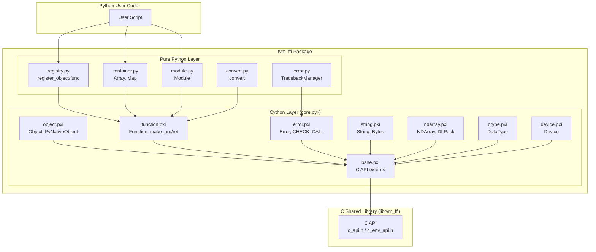
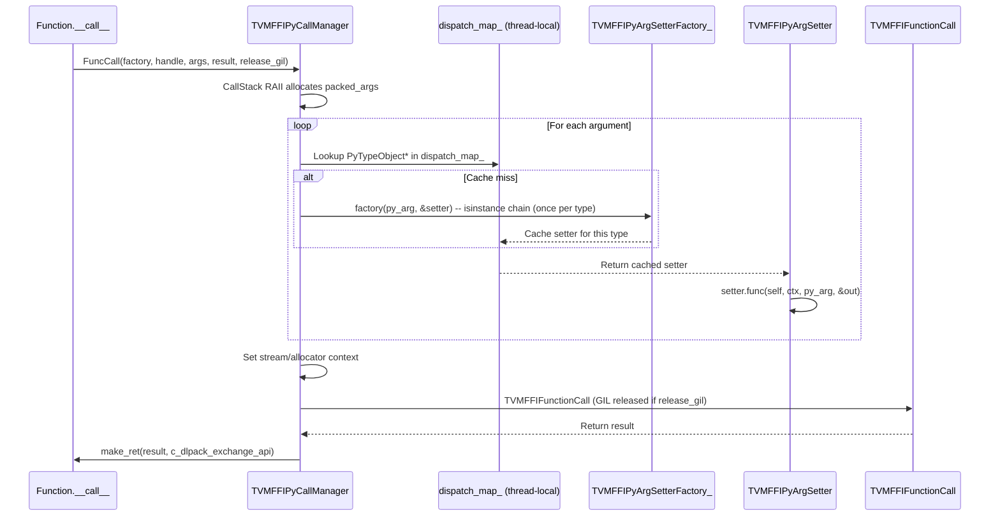

# Python Binding Layer Design

**TL;DR**:
- The `tvm_ffi` Python package provides a complete Cython-backed binding to the TVM FFI C API, exposing Object, Function, Tensor, Device, DataType, Error, String, and container types as Python objects.
- The Cython layer (`core.pyx` + 8 `.pxi` files) implements high-performance value marshaling via a C++-based type-dispatch system (`TVMFFIPyCallManager` + `TVMFFIPyArgSetter` functors in `tvm_ffi_python_helpers.h`). Each Python type's setter is cached in a thread-local `unordered_map` keyed by `PyTypeObject*`, eliminating per-call isinstance chains.
- Pure-Python wrapper modules (`registry.py`, `container.py`, `module.py`, `error.py`, `convert.py`) provide idiomatic Python APIs (decorators, `collections.abc` compliance, traceback reconstruction) on top of the Cython core.

## Problem Statement
### Background
- The FFI's C++ core defines a complete type-erased value system (`TVMFFIAny`), ref-counted objects (`Object`/`ObjectRef`), and packed functions (`Function`), all accessible through a C ABI.
- Python is the primary user-facing language for ML frameworks. A Python binding must bridge CPython's object model with the FFI's value system with minimal overhead on hot paths (function calls, argument packing).
- The binding must support: calling C++ functions from Python, wrapping Python callables for C++ consumption, automatic object lifecycle management (ref-counting), and cross-language error propagation with full traceback reconstruction.

### Solution
- A Cython extension module (`tvm_ffi.cython.core`) provides direct C-level access to the FFI's C API, avoiding ctypes overhead for argument packing and function dispatch.
- The Cython layer is split into 8 `.pxi` include files by concern: base (C declarations), object, function, error, string, ndarray, dtype, device.
- Pure-Python modules provide higher-level abstractions: `registry.py` (global function/object registration), `container.py` (Array/Map with `collections.abc` compliance), `module.py` (runtime Module), `error.py` (traceback reconstruction), `convert.py` (automatic Python-to-FFI conversion).

### Goals
- C-level performance for packed function calls (no Python dictionary lookups on hot path).
- Automatic ref-counting of `Object` handles via Cython `__dealloc__`.
- Reflection-based Python class decoration: C++ field/method metadata auto-populates Python properties/methods.
- Cross-language error propagation with reconstructed Python tracebacks from C++ traceback strings.
- Non-goals: supporting alternative Python runtimes (PyPy) beyond CPython; runtime code generation.

## Design

### Architecture Overview



### Value Marshaling: Type-Dispatch System

The core of the binding layer is a C++-based type-dispatch system for argument packing and a type-index-based return value unpacker.

#### Architecture: TVMFFIPyCallManager + TVMFFIPyArgSetter

The call path is implemented in `tvm_ffi_python_helpers.h` (a C++ header compiled into the Cython module) and Cython `.pxi` files:



**Key components:**
- `TVMFFIPyCallManager` -- Thread-local singleton managing a dispatch table (`unordered_map<PyTypeObject*, TVMFFIPyArgSetter>`) and a call stack allocator.
- `TVMFFIPyArgSetter` -- Functor struct with a `func` pointer and a `c_dlpack_exchange_api` pointer to a `DLPackExchangeAPI` struct (replaces three separate DLPack fields since 22a7894).
- `TVMFFIPyArgSetterFactory_` -- Cython function that creates setters using an isinstance chain (run once per Python type, then cached).
- `CallStack` -- RAII helper that allocates per-call argument memory from a thread-local stack, spilling to heap for large argument counts.

#### Setter Dispatch Table

The factory (`TVMFFIPyArgSetterFactory_`) maps Python types to setters:

| Python Type | Setter | Conversion | Notes |
|-------------|--------|-----------|-------|
| `float` | `TVMFFIPyArgSetterFloat_` (C++) | `kTVMFFIFloat`, `PyFloat_AsDouble` | POD, no temp needed |
| `int` | `TVMFFIPyArgSetterInt_` (C++) | `kTVMFFIInt`, `PyLong_AsLongLong` | POD, overflow check |
| `bool` | `TVMFFIPyArgSetterBool_` (C++) | `kTVMFFIBool`, `PyLong_AsLong` | POD |
| `NoneType` | `TVMFFIPyArgSetterNone_` (C++) | `kTVMFFINone` | POD |
| `Tensor` | `TVMFFIPyArgSetterTensor_` (Cython) | Object handle | |
| `Object` | `TVMFFIPyArgSetterObject_` (Cython) | Object handle | |
| DLPack exchange API type | `TVMFFIPyArgSetterDLPackExchangeAPI_` (Cython) | Direct C-level export via `DLPackExchangeAPI` struct | When `__c_dlpack_exchange_api__` present on class (renamed from `TVMFFIPyArgSetterDLPackCExporter_` in 22a7894) |
| `__cuda_stream__` type | `TVMFFIPyArgSetterCUDAStream_` (Cython) | `kTVMFFIOpaquePtr` from stream pointer | NVIDIA CUDA stream protocol (since b0537f0) |
| `torch.Tensor` (fallback) | `TVMFFIPyArgSetterTorch_` (Cython) | DLPack protocol | When no exchange API |
| `__dlpack__` type | `TVMFFIPyArgSetterDLPack_` (Cython) | DLPack protocol | Check on class (hasattr fix in b0537f0) |
| `str` | `TVMFFIPyArgSetterStr_` (Cython) | `TVMFFIStringFromByteArray` | Creates owned String (SSO-aware) |
| `bytes`/`bytearray` | `TVMFFIPyArgSetterBytes_` (Cython) | `TVMFFIBytesFromByteArray` | Creates owned Bytes (SSO-aware) |
| `DataType` subclass | `TVMFFIPyArgSetterDType_` (Cython) | `kTVMFFIDataType` | |
| `torch.dtype` | `TVMFFIPyArgSetterDTypeFromTorch_` (Cython) | `kTVMFFIDataType` | dict lookup in `TORCH_DTYPE_TO_DTYPE` (since d77606a) |
| `numpy.dtype` | `TVMFFIPyArgSetterDTypeFromNumpy_` (Cython) | `kTVMFFIDataType` | dict lookup in `NUMPY_DTYPE_TO_DTYPE` (since d77606a) |
| `__dlpack_data_type__` type | `TVMFFIPyArgSetterDLPackDataTypeProtocol_` (Cython) | `kTVMFFIDataType` | Duck-typing protocol: calls `arg.__dlpack_data_type__() -> tuple[int,int,int]` for `(code,bits,lanes)` (since 5e648f0) |
| `__dlpack_device__` type (no `__dlpack__`) | `TVMFFIPyArgSetterDLPackDeviceProtocol_` (Cython) | `kTVMFFIDevice` | Duck-typing protocol: calls `arg.__dlpack_device__() -> tuple[int,int]` for `(device_type,device_id)`. Guard: `not hasattr(arg_class, "__dlpack__")` prevents tensor types from being misrecognized (since 0f8bf9f) |
| `Device` | `TVMFFIPyArgSetterDevice_` (Cython) | `kTVMFFIDevice` | |
| `tuple` | `TVMFFIPyArgSetterTuple_` (Cython) | Recursive via `ConstructorCall` -> `ffi.Array` | Stream context propagation |
| `list` | `TVMFFIPyArgSetterTupleLike_` (Cython) | Coerce to tuple, then `ffi.Array` | |
| `dict` | `TVMFFIPyArgSetterMap_` (Cython) | Flatten k/v, `ConstructorCall` -> `ffi.Map` | |
| `PyNativeObject(str)` | `TVMFFIPyArgSetterPyNativeObjectStr_` (Cython) | Check `__tvm_ffi_object__` first | |
| `PyNativeObject(bytes)` | `TVMFFIPyArgSetterPyNativeObjectBytes_` (Cython) | Check `__tvm_ffi_object__` first | |
| `PyNativeObject` (general) | `TVMFFIPyArgSetterPyNativeObjectGeneral_` (Cython) | Requires `__tvm_ffi_object__` | |
| `ObjectConvertible` | `TVMFFIPyArgSetterObjectConvertible_` (Cython) | Calls `arg.asobject()` | |
| `__tvm_ffi_object__` type | `TVMFFIPyArgSetterFFIObjectCompatible_` (Cython) | Dynamic type index via `TVMFFIObjectGetTypeIndex` | Protocol: `__tvm_ffi_object__() -> Object`; generalized from tensor-only (since 8873700) |
| `ctypes.c_void_p` | `TVMFFIPyArgSetterCtypesVoidPtr_` (Cython) | `kTVMFFIOpaquePtr` | |
| `__tvm_ffi_opaque_ptr__` type | `TVMFFIPyArgSetterFFIOpaquePtrCompatible_` (Cython) | `kTVMFFIOpaquePtr` from `__tvm_ffi_opaque_ptr__()` | Protocol: returns int pointer (since 42e0612) |
| `Exception` | `TVMFFIPyArgSetterException_` (Cython) | `_convert_to_ffi_error` | |
| `ObjectRValueRef` | `TVMFFIPyArgSetterObjectRValueRef_` (Cython) | `kTVMFFIObjectRValueRef` | Move semantics |
| `__tvm_ffi_as_int__` type | (Cython) | `kTVMFFIInt` via `__tvm_ffi_as_int__()` | Custom integer protocol (since c1df05f) |
| `__tvm_ffi_as_float__` type | (Cython) | `kTVMFFIFloat` via `__tvm_ffi_as_float__()` | Custom float protocol (since c1df05f) |
| `__tvm_ffi_as_object__` type | (Cython) | Delegates to `__tvm_ffi_as_object__()` which returns an Object | Custom object conversion protocol; enables Python objects to define arbitrary FFI-object conversion (since 3dd7a817) |
| callable | `TVMFFIPyArgSetterCallable_` (Cython) | `_convert_to_ffi_func` | |
| (fallback) | `TVMFFIPyArgSetterFallback_` (Cython) | Error or last-resort conversion | |

#### Nested Constructor Call Convention

`TVMFFIPyConstructorCall` enables recursive container conversion (list/tuple/dict) in Cython:

```cpp
int TVMFFIPyConstructorCall(
    TVMFFIPyArgSetterFactory setter_factory,
    void* func_handle,       // e.g., ffi.Array constructor handle
    PyObject* py_arg_tuple,
    TVMFFIAny* result,
    int* c_api_ret_code,
    TVMFFIPyCallContext* parent_ctx);
```

Key invariant: child constructor calls propagate their detected `device_type`, `device_id`, `stream`, and `c_dlpack_exchange_api` to the parent context if the parent has not yet set them. This ensures that a list of torch tensors correctly propagates stream context and DLPack exchange API to the outer function call. (The separate `c_dlpack_tensor_allocator` and `c_dlpack_to_pyobject` fields were replaced by a single `c_dlpack_exchange_api` pointer in 22a7894.)

#### C-to-Python: `make_ret` (function.pxi)

```cython
cdef inline object make_ret(TVMFFIAny result, const DLPackExchangeAPI* c_dlpack_exchange_api)
```

Dispatches `result.type_index` to construct the appropriate Python object:

| type_index | Python Return | Notes |
|-----------|---------------|-------|
| `>= kTVMFFIStaticObjectBegin` | `make_ret_object(result)` | Dispatches through `TYPE_INDEX_TO_CLS` (direct class lookup, since 035975a) |
| `kTVMFFITensor` | framework tensor via `c_dlpack_exchange_api->managed_tensor_to_py_object_no_sync` if available, else `make_tensor_from_any(result)` | Auto-converts to caller framework |
| `kTVMFFINone` | `None` | |
| `kTVMFFIBool` | `bool(result.v_int64)` | |
| `kTVMFFIInt` | `result.v_int64` | |
| `kTVMFFIFloat` | `result.v_float64` | |
| `kTVMFFISmallStr` | `make_ret_small_str(result)` | SSO: extract from `v_bytes` |
| `kTVMFFISmallBytes` | `make_ret_small_bytes(result)` | SSO: extract from `v_bytes` |

`make_ret_object` looks up `TYPE_INDEX_TO_CLS[tindex]` (a Cython-level list, since 035975a) for the registered Python class. If the entry is `None` (type index allocated but no Python class registered), it falls back to base `Object` with a `UserWarning` (since d68c8d8). If the class is a `PyNativeObject` subclass, it calls `cls.__from_tvm_ffi_object__` to construct the hybrid Python/FFI object. Otherwise, it uses `cls.__new__(cls)` and sets `chandle`.

### Object System Binding (object.pxi)

#### Cython `Object` Class

```cython
cdef class Object:
    cdef void* chandle  # TVMFFIObjectHandle

    def __cinit__(self):
        self.chandle = NULL

    def __dealloc__(self):
        if self.chandle != NULL:
            CHECK_CALL(TVMFFIObjectDecRef(self.chandle))
            self.chandle = NULL
```

All FFI objects inherit from this Cython extension type. The `chandle` field holds the raw `TVMFFIObjectHandle`. Ref-counting is automatic: `__dealloc__` calls `TVMFFIObjectDecRef` (which does `DecRef`).

Key methods:
- `__init_handle_by_constructor__(fconstructor, *args)` -- calls a constructor function and stores the returned handle
- `same_as(other)` -- identity comparison via handle pointer equality
- `__hash__()` -- hash based on `chandle` pointer value (uint64)
- `__reduce__`/`__getstate__`/`__setstate__` -- pickle support via JSON graph serialization
- `_move()` -- creates `ObjectRValueRef` for move semantics

#### Object Type Registry

```cython
cdef list TYPE_INDEX_TO_INFO = []  # type_index -> TypeInfo (full metadata)
cdef list TYPE_INDEX_TO_CLS = []   # type_index -> type (parallel fast-path for make_ret_object)
cdef dict TYPE_KEY_TO_INFO = {}    # type_key -> TypeInfo (for lazy lookup by key)
```

`_register_object_by_index(type_index, type_cls) -> TypeInfo` populates both `TYPE_INDEX_TO_INFO` and `TYPE_INDEX_TO_CLS`, and indexes by key in `TYPE_KEY_TO_INFO`. Returns the `TypeInfo` metadata object (since 53b2e00). The `OBJECT_TYPE` (flat list) and `OBJECT_INDEX` (reverse dict) were removed in c86235c and 53b2e00 respectively.

`_set_type_cls(type_info, type_cls)` updates `TYPE_INDEX_TO_CLS` for an existing `TypeInfo` (signature changed from `(type_index, type_cls)` in 98cb8af). Validates that the `TypeInfo` is already registered.

`_update_registry(type_index, type_key, type_info, type_cls)` (since 98cb8af) centralizes registry updates to all three registries (`TYPE_INDEX_TO_INFO`, `TYPE_INDEX_TO_CLS`, `TYPE_KEY_TO_INFO`) in a single function.

`_lookup_or_register_type_info_from_type_key(type_key) -> TypeInfo` lazily creates a `TypeInfo` from C-level metadata for types that exist in C++ but have no Python class registered yet (`type_cls=None`). Always registers the TypeInfo into the global registries (renamed from `_lookup_type_info_from_type_key` in 98cb8af).

#### Python-Side TypeInfo Metadata Model (since 53b2e00)

```python
# Defined in type_info.pxi (Cython include)
@dataclass
class TypeField:
    name: str; doc: str | None; size: int; offset: int; frozen: bool
    getter: FieldGetter; setter: FieldSetter
    dataclass_field: object | None = None  # Field descriptor for c_class (since e98b94e)

    def as_property(self, cls: type) -> property:
        """Create a Python property with __name__, __module__, __qualname__, __doc__."""

@dataclass
class TypeMethod:
    name: str; doc: str | None; func: object; is_static: bool

@dataclass
class TypeInfo:
    type_cls: type | None; type_index: int; type_key: str
    fields: list[TypeField]; methods: list[TypeMethod]
    parent_type_info: TypeInfo | None
```

This metadata model mirrors the C-level `TVMFFITypeInfo`/`TVMFFIFieldInfo`/`TVMFFIMethodInfo` structs and enables pure-Python code to introspect registered types without calling back into Cython/C.

`TypeInfo` also has a `type_ancestors: list[int]` field (since 98cb8af) that mirrors `TVMFFITypeInfo::type_ancestors`. In `__post_init__`, it auto-resolves `parent_type_info` from `type_ancestors[-1]` by calling `_lookup_or_register_type_info_from_type_key`.

`TypeMethod.as_callable(cls)` (since 98cb8af) creates a properly wrapped Python method: instance methods use `_member_method_wrapper`, static methods use `staticmethod`. Sets `__module__`, `__name__`, `__qualname__`, `__doc__` from reflection metadata.

#### Auto-Fallback Class Creation (since 98cb8af)

When `make_ret_object` encounters a C++ type with no registered Python class, it calls `make_fallback_cls_for_type_index(type_index)` instead of falling back to bare `Object` with a warning. This creates a full proxy class:

1. Resolves `TypeInfo` via `_lookup_or_register_type_info_from_type_key`
2. Recursively creates parent classes if not yet registered
3. Creates a new Python class inheriting from the parent's class
4. Populates fields (as properties via `TypeField.as_property`), methods (via `TypeMethod.as_callable`)
5. Sets `__tvm_ffi_type_info__`, `__name__`, `__qualname__`, `__module__`, `__doc__` (auto-generated warning)
6. Registers in all three registries via `_update_registry`

The slow path triggers only once per unregistered type. Subsequent calls use the cached class from `TYPE_INDEX_TO_CLS`.

#### PyNativeObject Pattern

For Python types that must subclass a Python builtin (e.g., `tuple` for `Shape`), `PyNativeObject` provides a base class that carries a `_tvm_ffi_cached_object` handle alongside the Python-native value (renamed from `__tvm_ffi_object__` attribute in 8873700):

```python
class Shape(tuple, PyNativeObject):
    def __new__(cls, content):
        val = tuple.__new__(cls, content)
        val.__init_cached_object_by_constructor__(_ffi_api.Shape, *content)
        return val

    def __from_tvm_ffi_object__(cls, obj):
        content = core._shape_obj_get_py_tuple(obj)
        val = tuple.__new__(cls, content)
        val._tvm_ffi_cached_object = obj
        return val
```

Protocol: `__from_tvm_ffi_object__(cls, obj)` must be implemented as a classmethod. It is called by `make_ret_object` when the registered class is a `PyNativeObject` subclass.

#### Reflection-Based Class Decoration

`_add_class_attrs(type_cls, type_info)` (pure Python in `registry.py`, replacing the Cython `_add_class_attrs_by_reflection` since 53b2e00) consumes a `TypeInfo` and auto-populates the Python class:

1. For each `TypeField`: calls `TypeField.as_property(cls)` to create a Python `property` with rich metadata (`__name__`, `__module__`, `__qualname__`, `__doc__`), and sets on the class. Read-only fields get `setter=None`.
2. For each `TypeMethod`: extracts the `Function`, sets `__doc__` and `__name__` on the underlying function before wrapping with `staticmethod` (since `staticmethod` objects do not support direct attribute assignment), and sets on the class. Methods named `__ffi_init__` are renamed to `__c_ffi_init__` (since e98b94e).
3. Already-defined attributes are skipped (Python-side overrides take precedence).
4. **Auto-`__init__` generation** (since 0729193): After processing all fields/methods, if `"__init__" not in type_cls.__dict__` (class itself does not define `__init__`):
   - If `__ffi_init__` was found among reflected methods: sets `type_cls.__init__ = type_cls.__ffi_init__`, enabling `SomeObject(arg1, arg2)` to call the C++ constructor directly.
   - Else if the class is NOT a `PyNativeObject` subclass: sets `type_cls.__init__ = __init__invalid`, a sentinel that raises `RuntimeError("The __init__ method of this class is not implemented.")`.
   - `PyNativeObject` subclasses are excluded because they manage their own handle lifecycle.
   - This prevents the previous failure mode where constructing a `@register_object` class without `__init__` silently returned an object with `chandle=None`, leading to segfaults.

`FieldGetter` and `FieldSetter` are Cython cdef classes defined in `type_info.pxi` (moved from `function.pxi` in 53b2e00):

```cython
cdef class FieldGetter:
    cdef TVMFFIFieldGetter getter
    cdef int64_t offset

    def __call__(self, Object obj):
        cdef void* field_ptr = (<char*>obj.chandle) + self.offset
        c_api_ret_code = self.getter(field_ptr, &result)
        CHECK_CALL(c_api_ret_code)
        return make_ret(result)
```

### Function Binding (function.pxi)

#### Cython `Function` Class

`Function` is a `cdef class` (not a plain Python class) with a `release_gil` property:

```cython
cdef class Function(Object):
    cdef bint _release_gil  # default from TVM_FFI_RELEASE_GIL_BY_DEFAULT env var

    def __call__(self, *args):
        result.type_index = kTVMFFINone
        result.v_int64 = 0
        # Delegates to TVMFFIPyFuncCall -> TVMFFIPyCallManager.FuncCall
        ret = TVMFFIPyFuncCall(TVMFFIPyArgSetterFactory_, self.chandle,
                               args_tuple, &result, &c_api_ret_code,
                               self._release_gil, &out_ctx_dlpack_api)
        if ret != 0: return None  # Python error already set
        if c_api_ret_code == 0:
            return make_ret(result, out_ctx_dlpack_api)
        elif c_api_ret_code == -2:
            raise_existing_error()
        raise move_from_last_error().py_error()
```

The calling convention:
1. Initialize result to `kTVMFFINone` (critical: caller must initialize).
2. Call `TVMFFIPyFuncCall` which dispatches to `TVMFFIPyCallManager.FuncCall`. This packs args via cached type-dispatch setters, manages stream/device/allocator context, optionally releases the GIL, and calls `TVMFFIFunctionCall`.
3. On success (0): unpack result via `make_ret` (with optional DLPack importer for framework tensor conversion).
4. On error (-1): retrieve TLS error, convert to Python exception.
5. On frontend error (-2): re-raise existing Python exception.

#### CallStack RAII Allocator

`TVMFFIPyCallManager::CallStack` manages per-call argument memory using a thread-local stack (`temp_stack_`). For typical call depths, arguments are allocated from the stack; large argument counts spill to heap. The destructor recycles temp FFI objects (via `TVMFFIObjectDecRef`) and temp Python objects (via `Py_DecRef`).

#### CUDA Stream Context

When tensors with `__c_dlpack_exchange_api__` (providing `current_work_stream`) or `__tvm_ffi_env_stream__` are passed as arguments, the setter captures the device stream. The stream is now queried via the `DLPackExchangeAPI.current_work_stream` function pointer, decoupled from tensor export (since 22a7894). Before the C call, `TVMFFIEnvSetStream` installs it as the thread-local stream context. After the call returns, the previous stream is restored. For nested containers (e.g., a list of torch tensors), `TVMFFIPyConstructorCall` propagates stream/device context from children to the parent call context.

#### Python-to-FFI Function Wrapping

`_convert_to_ffi_func(pyfunc)` wraps a Python callable as an FFI `Function`:

```cython
def _convert_to_ffi_func(object pyfunc):
    Py_INCREF(pyfunc)
    CHECK_CALL(TVMFFIFunctionCreate(
        <void*>(pyfunc), tvm_ffi_callback, tvm_ffi_pyobject_deleter, &chandle))
```

The callback `tvm_ffi_callback` acquires the GIL, unpacks arguments via `make_ret`, calls the Python function, packs the return value via `make_args`, and handles exceptions via `set_last_ffi_error`. The deleter `TVMFFIPyObjectDeleter` (C++, replacing `tvm_ffi_pyobject_deleter` since 22c049b) conditionally acquires the GIL via `TVMFFIPyWithGILIfNotFreeThreaded`.

### Error Handling (error.pxi + error.py)

#### Cython Error Class

```cython
cdef class Error(Object):
    def py_error(self):
        error_cls = ERROR_NAME_TO_TYPE.get(self.kind, RuntimeError)
        py_error = error_cls(self.message)
        py_error = _WITH_APPEND_BACKTRACE(py_error, self.backtrace)
        py_error.__tvm_ffi_error__ = self
        return py_error
```

Properties (`kind`, `message`, `backtrace`) read directly from `TVMFFIErrorCell` via `TVMFFIErrorGetCellPtr`. (Renamed from `traceback` to `backtrace` in 6f020c1; see `.knowledge/ADRs/017-backtrace-storage-order.md`.)

#### Traceback Reconstruction (error.py)

`TracebackManager` in `error.py` parses C++ traceback strings and reconstructs Python `types.TracebackType` chains:

1. `_parse_traceback(traceback_str)` extracts `(filename, lineno, func)` tuples via regex matching `File "...", line N, in ...`.
2. `_get_cached_code_object(filename, lineno, func)` compiles `ast.parse("_getframe()", filename=filename)`, replaces `co_name` and `co_firstlineno`, and caches the code object by `(filename, lineno, func)` key.
3. `_create_frame(filename, lineno, func)` evaluates the code object with `{"_getframe": sys._getframe}` context, capturing the current frame.
4. `append_traceback(tb, filename, lineno, func)` creates `types.TracebackType(tb, frame, frame.f_lasti, lineno)` to chain frames.
5. `_with_append_traceback(py_error, traceback)` iterates parsed frames in reverse order (most recent first) to build the traceback chain.

Hooks: `core._WITH_APPEND_BACKTRACE` and `core._TRACEBACK_TO_BACKTRACE_STR` (renamed from `_WITH_APPEND_TRACEBACK`/`_TRACEBACK_TO_STR` in 6f020c1) are set by `error.py` to connect the pure-Python traceback logic to the Cython layer.

#### Error Registration

```python
# error.py
register_error("RuntimeError", RuntimeError)
register_error("ValueError", ValueError)
register_error("TypeError", TypeError)
register_error("AttributeError", AttributeError)
register_error("KeyError", KeyError)
register_error("IndexError", IndexError)
register_error("AssertionError", AssertionError)
```

Maps error kind strings to Python exception classes. When an FFI error is raised, `Error.py_error()` looks up the appropriate Python class.

### Global Function Registry (registry.py)

#### register_object

```python
def register_object(type_key=None):
    def register(cls):
        type_index = core._object_type_key_to_index(object_name)
        type_info = core._register_object_by_index(type_index, cls)
        _add_class_attrs(cls, type_info)
        return cls
    # ...
```

Workflow: (1) resolve type key to type index via `TVMFFITypeKeyToIndex`, (2) register class in `TYPE_INDEX_TO_INFO`/`TYPE_INDEX_TO_CLS` (returns `TypeInfo`), (3) auto-populate class with reflection-derived properties/methods via `_add_class_attrs`.

#### init_ffi_api Namespace Population (renamed from `_init_api` in 40f4d9d)

```python
def init_ffi_api(namespace, target_module_name=None):
    for name in list_global_func_names():
        if not name.startswith(prefix):
            continue
        fname = name[len(prefix) + 1:]
        if fname.find(".") != -1:
            continue
        f = get_global_func(name)
        f.__name__ = fname
        setattr(target_module, f.__name__, f)
```

Pattern: `_ffi_api.py` calls `init_ffi_api("ffi", __name__)` at module load time, scanning all globally registered functions with the `ffi.` prefix and binding them as module attributes. Functions with dots in the suffix (sub-namespaces) are skipped.

### Container Wrappers (container.py)

#### Array

```python
@register_object("ffi.Array")
class Array(core.Object, Sequence[T]):  # Generic since df58a05
    def __init__(self, input_list: Iterable[T]):  # Iterable since 54f527f
        self.__init_handle_by_constructor__(_ffi_api.Array, *input_list)
    def __getitem__(self, idx: SupportsIndex) -> T: ...
    def __getitem__(self, idx: slice) -> list[T]: ...  # returns list, not Array (90dba57)
    def __add__(self, other: Iterable[T]) -> Array[T]: ...  # since 54f527f
    def __radd__(self, other: Iterable[T]) -> Array[T]: ...  # since 54f527f
    def __iter__(self) -> Iterator[T]: ...  # explicit generator since df58a05
    def __len__(self) -> int: ...
```

Supports slice indexing (returns `list[T]`), negative indices, `SupportsIndex` protocol via `operator.index()`, concatenation via `+`/`__radd__`, and standard iteration. `getitem_helper` uses `slice.indices()` for correct edge-case handling.

#### Map

```python
@register_object("ffi.Map")
class Map(core.Object, Mapping[K, V]):  # Generic since df58a05
    def __init__(self, input_dict):
        list_kvs = []
        for k, v in input_dict.items():
            list_kvs.append(k)
            list_kvs.append(v)
        self.__init_handle_by_constructor__(_ffi_api.Map, *list_kvs)
```

Iteration uses `MapForwardIterFunctor` (a stateful C++ functor accessed via global function): `functor(0)` returns key, `functor(1)` returns value, `functor(2)` advances and returns whether more items exist. Custom `KeysView`, `ValuesView`, `ItemsView` classes provide lazy iteration.

### Automatic Conversion (convert.py)

`convert(value)` dispatches Python types to FFI values:
- `Object`/`PyNativeObject` pass through
- `bool`/`Number` pass through
- `list`/`tuple` -> `Array`
- `dict` -> `Map`
- `str` -> `String`
- `bytes`/`bytearray` -> `Bytes`
- `ObjectConvertible` -> `value.asobject()` (renamed from `ObjectGeneric` in 40f4d9d)
- callable -> `_convert_to_ffi_func`
- `__dlpack__` -> `from_dlpack`
- `Exception` -> `_convert_to_ffi_error`

Note: Since commit 043d9f6, nested container conversion (`list`/`tuple`/`dict`) is handled directly by Cython-level setters (`TVMFFIPyArgSetterTuple_`, `TVMFFIPyArgSetterTupleLike_`, `TVMFFIPyArgSetterMap_`) via `TVMFFIPyConstructorCall`, replacing the old `_FUNC_CONVERT_TO_OBJECT` Python callback. The `convert` function remains useful for explicit Python-level conversion but is no longer on the hot path for argument packing.

### Stream Context (stream.py)

`stream.py` provides Python context managers for setting the FFI thread-local stream (added in 3197cd0):

#### StreamContext

```python
class StreamContext:
    def __init__(self, device: Device, stream: Union[int, c_void_p]) -> None: ...
    def __enter__(self) -> "StreamContext": ...   # calls core._env_set_current_stream, caches prev
    def __exit__(self, *args) -> None: ...        # restores previous stream
```

On `__enter__`, calls `core._env_set_current_stream(device_type, device_id, stream)` which wraps `TVMFFIEnvSetStream` and returns the previous stream handle for save/restore semantics. Supports nesting.

#### TorchStreamContext

```python
class TorchStreamContext:
    def __init__(self, context: Optional[Any]) -> None: ...
    def __enter__(self) -> "TorchStreamContext": ...  # enters torch context, creates StreamContext
    def __exit__(self, *args) -> None: ...            # exits both FFI and torch contexts
```

Bridges `torch.cuda.stream()` / `torch.cuda.graph()` with the FFI stream table. When `context=None`, captures the current torch CUDA stream without an explicit torch context manager.

#### Factory Functions

- `use_raw_stream(device, stream) -> StreamContext` -- validates `int` or `c_void_p` input
- `use_torch_stream(context=None) -> TorchStreamContext` -- raises `ImportError` if torch unavailable

#### Stream Query

- `tvm_ffi.get_raw_stream(device: Device) -> int` (added in a153647): Returns the current FFI thread-local stream handle for the given device, delegating to `core._env_get_current_stream(device_type, device_id)`.
- `core._env_get_current_stream(device_type: int, device_id: int) -> int` (Cython in `base.pxi`): Wraps `TVMFFIEnvGetStream` and casts the returned `void*` to `uint64`.

#### Cython Bridge

`core._env_set_current_stream(device_type, device_id, stream) -> uint64` in `base.pxi` wraps `TVMFFIEnvSetStream` and returns the previous stream handle.

### External Dtype Auto-Conversion (since d77606a)

Three module-level lookup tables map external framework dtype objects to `DLDataType` C structs:

| Table | Module | Entries | Source |
|-------|--------|---------|--------|
| `TORCH_DTYPE_TO_DTYPE` | `dtype.pxi` | 24 torch dtypes (int8 through float8_e8m0fnu, bool); `float8_e8m0fnu` and `float4_e2m1fn_x2` guarded by `hasattr(torch, ...)` for torch < 2.8 compat (eb5492a) | torch enum -> DLDataType |
| `NUMPY_DTYPE_TO_DTYPE` | `dtype.pxi` | 11 standard numpy dtypes + ml_dtypes entries | numpy.dtype -> DLDataType |
| `MLDTYPES_DTYPE_TO_DTYPE` | `dtype.pxi` | 16 ml_dtypes (int2/4, uint2/4, bfloat16, float8/6/4 variants) | numpy.dtype -> DLDataType |

Two conversion paths:
- **Fast path** (Cython arg setters): `TVMFFIPyArgSetterDTypeFromTorch_` / `TVMFFIPyArgSetterDTypeFromNumpy_` perform a dictionary lookup and directly write the `DLDataType` into `TVMFFIAny`.
- **Slow path** (Python `convert()`): `_convert_torch_dtype_to_ffi_dtype` / `_convert_numpy_dtype_to_ffi_dtype` return a `DataType` wrapper.

Conditional imports of `torch`, `numpy`, and `ml_dtypes` are gated by the `TVM_FFI_BUILD_DOCS` environment variable (set to `"0"` to skip imports).

### Cython Type Stubs (since 785e8ca)

`python/tvm_ffi/core.pyi` is a hand-written type stub declaring bare signatures (no docstrings) of the Cython-compiled `tvm_ffi.core` extension module, enabling Pylance/mypy/pyright type checking and IDE autocomplete. Must be kept in sync with `core.pyx` + `.pxi` files manually. Since commit e10d1ed, docstrings live directly in the Cython `.pxi` source files (not in `.pyi`) for Sphinx autodoc compatibility. The `.pyi` file retains only bare signatures for IDE type-checking. The `annotation_typing=False` directive in `core.pyx` ensures Cython treats Python-style type annotations (`-> str`, etc.) as documentation rather than Cython type declarations.

`python/tvm_ffi/_ffi_api.pyi` (since 40e9c83) declares the FFI API functions that are dynamically populated at runtime via `init_ffi_api`, providing mypy with signatures for `ModuleGetKind`, `Array`, `Map`, `Shape`, etc.

`python/tvm_ffi/py.typed` (since 5cfd705) is a PEP 561 marker file bundled in sdists/wheels, signaling to type checkers that `tvm_ffi` ships inline types.

### Type Annotation Convention and mypy Enforcement

Since commit 8f4e044, the `ANN` (flake8-annotations) ruff rule set is enforced, requiring type annotations on all public Python API parameters and return types. All modules in `python/tvm_ffi/` use `from __future__ import annotations` and modern annotation syntax (`list[str]`, `X | Y` unions, `Optional[T]`). The `PTH` rule set (since 0bc968d) enforces `pathlib.Path` over `os.path` for all filesystem operations.

Since commit 40e9c83, **mypy** (v1.18.2) is enforced as a pre-commit hook with centralized `[tool.mypy]` configuration in `pyproject.toml`:
- `python_version = "3.9"`, `mypy_path = ["python", "examples", "tests/python"]`
- `allow_redefinition = true` (for `try: import torch / except: torch = None` pattern)
- `ignore_missing_imports = true` (for Cython extension modules)
- `_ffi_api.py` files excluded (dynamically populated)

The `typing-extensions>=4.5` package is a runtime dependency (since 5cfd705), providing `dataclass_transform` for the `c_class` decorator.

### Free-Threaded Python Support (since 22c049b)

The binding supports free-threaded Python (PEP 703, Python 3.14t):

- **`TVMFFIPyWithGILIfNotFreeThreaded`**: RAII class in `tvm_ffi_python_helpers.h`. No-op when `Py_GIL_DISABLED` is defined (free-threaded); acquires/releases GIL otherwise.
- **`TVMFFIPyObjectDeleter`**: `extern "C"` function replacing the Cython `tvm_ffi_pyobject_deleter`. Conditionally acquires the GIL via the RAII class, then calls `Py_DecRef`. Used as the destructor for both `TVMFFIFunctionCreate` (Python callback functions) and `TVMFFIObjectCreateOpaque` (opaque Python objects).
- **`freethreading_compatible = True`**: Cython module directive enabling free-threaded builds.
- **CMake detection**: `sysconfig.get_config_var('Py_GIL_DISABLED')` skips `USE_SABI` for free-threaded builds.
- **`OpaquePyObject` type hierarchy fix**: Changed from `ReserveBuiltinTypeIndex` (type_depth=0, no parent) to `GetOrAllocTypeIndex` with type_depth=1 and parent=`kTVMFFIObject`, so `OpaquePyObject` is correctly recognized as an `Object` subtype.

### Function Creation from Extern C / MLIR (since b64b46f, f6303b2)

Two static methods on the Cython `Function` class enable creating FFI functions from raw C function pointers without going through the global registry:

- **`Function.__from_extern_c__(c_symbol: int, *, keep_alive_object=None) -> Function`**: Wraps a `TVMFFISafeCallType`-compatible pointer. Calls `TVMFFIFunctionCreate`. When `keep_alive_object` is provided, it is `Py_INCREF`'d with `TVMFFIPyObjectDeleter` as deleter.
- **`Function.__from_mlir_packed_safe_call__(mlir_packed_symbol: int, *, keep_alive_object=None) -> Function`**: Wraps an MLIR packed safe call pointer (`void(void**)`) via `TVMFFIPyMLIRPackedSafeCall` adapter. The adapter translates packed convention `[&handle, &args, &num_args, &rv, &ret_code]` to TVM FFI safe call convention.

These enable JIT execution engines (MLIR, custom compilers) to expose compiled functions to Python.

### TypeSchema Python Class (since 28fe3cc)

`TypeSchema` is a dataclass in `type_info.pxi` for parsing and rendering C++ type schema JSON:

- `origin: str`, `args: tuple[TypeSchema, ...]`
- `from_json_str(s)` / `from_json_obj(dict)` class methods
- `repr(ty_map=None)` renders as Python-style annotation (e.g., `Callable[[int], int]`, `list[str]`)
- `_TYPE_SCHEMA_ORIGIN_CONVERTER` maps C++ names to Python names (e.g., `"ffi.Array" -> "list"`, `"DataType" -> "dtype"`)
- `TypeField.metadata` and `TypeMethod.metadata` dicts include `type_schema` key
- `get_global_func_metadata(name)` retrieves metadata for globally registered functions

### Inline Stub Generation (`tvm-ffi-stubgen`, since ea02e64)

`tvm-ffi-stubgen` is a CLI tool and Python module (`tvm_ffi.stub.stubgen`) that generates in-place, static type stubs inside marker blocks in `.py`/`.pyi` files. It replaces the hand-maintained `_ffi_api.pyi` stub file with auto-generated inline stubs guarded by `if TYPE_CHECKING:`. See `.knowledge/designs/0020-stubgen-tool.md` for details.

Key marker directives:
- `# tvm-ffi-stubgen(begin): global/<prefix>` / `# tvm-ffi-stubgen(end)` -- global function stub block
- `# tvm-ffi-stubgen(begin): object/<type_key>` / `# tvm-ffi-stubgen(end)` -- object field/method stub block
- `# tvm-ffi-stubgen(ty_map): <from> -> <to>` -- per-block type name remapping
- `# tvm-ffi-stubgen(skip-file)` -- skip processing the entire file

### GIL and Signal Handling (base.pxi)

At module load time, `_init_env_api()` registers three CPython function pointers into the FFI's `EnvCAPIRegistry`:

```cython
TVMFFIEnvRegisterCAPI("PyErr_CheckSignals", <void*>PyErr_CheckSignals)
TVMFFIEnvRegisterCAPI("PyGILState_Ensure", <void*>PyGILState_Ensure)
TVMFFIEnvRegisterCAPI("PyGILState_Release", <void*>PyGILState_Release)
```

This enables C++ code to check for Python signals (e.g., Ctrl+C) and acquire/release the GIL when calling back into Python.

### Key Classes, Fields and Interfaces

| Symbol | Kind | Signature / Description |
|--------|------|------------------------|
| `Object` (Cython) | cdef class | `cdef void* chandle` -- base for all FFI objects with automatic ref-counting |
| `Function` (Cython) | cdef class(Object) | `def __call__(self, *args)` -- type-dispatch call via `TVMFFIPyCallManager`; `release_gil` property |
| `Error` (Cython) | cdef class(Object) | `def py_error(self) -> Exception` -- convert FFI error to Python exception |
| `String` (Cython) | class(Object) | `def __str__(self) -> str` -- lazy Python string caching |
| `Bytes` (Cython) | class(Object) | `def __bytes__(self) -> bytes` -- lazy Python bytes caching |
| `Tensor` (Cython) | cdef class | DLPack import/export, numpy conversion, `shape`/`dtype`/`device` properties (renamed from `NDArray` in 3a551d8) |
| `DataType` (Cython) | cdef class | `cdef DLDataType cdtype` -- wraps DLDataType |
| `Device` (Cython) | cdef class | `cdef DLDevice cdevice` -- wraps DLDevice, string parsing |
| `PyNativeObject` | class | `_tvm_ffi_cached_object` attribute (renamed from `__tvm_ffi_object__` in 8873700), `__from_tvm_ffi_object__` classmethod protocol |
| `ObjectConvertible` | class | Abstract base, `asobject()` method (renamed from `ObjectGeneric` in 40f4d9d) |
| `FieldGetter` | cdef class | `TVMFFIFieldGetter getter; int64_t offset` -- field access via C callback (in `type_info.pxi`) |
| `FieldSetter` | cdef class | `TVMFFIFieldSetter setter; int64_t offset` -- field write via C callback (in `type_info.pxi`) |
| `TypeInfo` | dataclass | `type_cls, type_index, type_key, fields: list[TypeField], methods: list[TypeMethod], parent_type_info` |
| `TypeField` | dataclass | `name, doc, size, offset, frozen, getter, setter, dataclass_field` |
| `TypeMethod` | dataclass | `name, doc, func, is_static` |
| `Array` | class(Object, Sequence[T]) | Generic `Sequence[T]` compliance, `__add__`/`__radd__`, slice returns `list[T]` |
| `Map` | class(Object, Mapping[K, V]) | Generic `Mapping[K, V]` compliance, lazy `MapForwardIterFunctor` iteration, `Map.get` overloaded |
| `Module` | class(Object) | `get_function`, `import_module`, `__getattr__`/`__getitem__`, `__call__` delegates to `self.main` |
| `TracebackManager` | class | Caches code objects, reconstructs `types.TracebackType` chains from C++ traceback strings |
| `convert(value)` | function | `Any -> Any` -- automatic Python-to-FFI conversion |
| `register_object(type_key)` | decorator | Registers Python class in TYPE_INDEX_TO_CLS dispatch table with reflection |
| `c_class(type_key)` | decorator | `@dataclass_transform`; dataclass-style Python class for C++ objects (see 0019-c-class-decorator.md) |
| `register_global_func(name, f, override)` | decorator | Registers Python function in global FFI registry (renamed from `register_func` in 40f4d9d) |
| `init_ffi_api(namespace)` | function | Populates module namespace from global function registry by prefix (renamed from `_init_api` in 40f4d9d) |
| `TVMFFIPyCallManager` | C++ class | Thread-local call manager with `FuncCall`, `ConstructorCall`, `SetArgument`; caches `TVMFFIPyArgSetter` per `PyTypeObject*` |
| `TVMFFIPyArgSetter` | C struct | Dispatch functor: `func` pointer + `c_dlpack_exchange_api` pointer (replaces three separate fields since 22a7894) |
| `TVMFFIPyCallContext` | C struct | Per-call state: packed_args, device/stream, temp objects, `c_dlpack_exchange_api` (replaces separate DLPack fields since 22a7894) |
| `CallStack` | C++ class (RAII) | Per-call argument memory from thread-local stack or heap; recycles temp objects on destruction |
| `TVMFFIPyArgSetterFactory_` | Cython function | `(PyObject*, TVMFFIPyArgSetter*) -> int` -- creates setter per type (isinstance chain, run once) |
| `TVMFFIPyConstructorCall` | C++ inline | Nested constructor calling convention; propagates stream/device context to parent |
| `make_ret` | cdef function | `(TVMFFIAny, const DLPackExchangeAPI*) -> object` -- C-to-Python unpacking with optional framework tensor conversion (signature updated in 22a7894) |
| `get_raw_stream` | function | `(device: Device) -> int` -- query current FFI thread-local stream (since a153647) |
| `get_global_func_metadata` | function | `(name: str) -> dict[str, Any]` -- retrieve global function metadata (since 28fe3cc) |
| `TypeSchema` | dataclass | `origin: str, args: tuple[TypeSchema, ...]` -- parsed type schema with `repr(ty_map)` (since 28fe3cc) |
| `Function.__from_extern_c__` | static method | `(c_symbol: int, *, keep_alive_object=None) -> Function` -- create from extern C pointer (since b64b46f) |
| `Function.__from_mlir_packed_safe_call__` | static method | `(mlir_symbol: int, *, keep_alive_object=None) -> Function` -- create from MLIR packed pointer (since f6303b2) |
| `TVMFFIPyObjectDeleter` | C++ function | `void(void*)` -- GIL-conditional Python object deleter (replaces `tvm_ffi_pyobject_deleter` since 22c049b) |
| `TVMFFIPyWithGILIfNotFreeThreaded` | C++ RAII class | No-op in free-threaded Python; acquires GIL otherwise (since 22c049b) |
| `TVMFFIPyMLIRPackedSafeCall` | C++ class | MLIR packed convention adapter with `Invoke`/`Deleter` methods (since f6303b2) |

### Contracts, Assumptions and Invariants

- **Result initialization**: Callers MUST set `result.type_index = kTVMFFINone` and `result.v_int64 = 0` before `FuncCall`. Failure to do so can produce garbage return values.
- **zero_padding invariant**: All setters set `out->zero_padding = 0` for every argument. On 32-bit platforms, `v_int64` is also zeroed.
- **Setter cacheability**: The factory invariant requires that a setter created for a given `PyTypeObject*` works correctly for ALL instances of that type. Type-specific behavior must be in the setter function, not the factory.
- **GIL discipline**: `tvm_ffi_callback` is a `with gil` function. `TVMFFIPyObjectDeleter` (C++, replacing `tvm_ffi_pyobject_deleter` since 22c049b) conditionally acquires the GIL via `TVMFFIPyWithGILIfNotFreeThreaded` (no-op in free-threaded mode). `TVMFFIPyCallManager.FuncCall` releases the GIL (via `Py_BEGIN_ALLOW_THREADS`) during `TVMFFIFunctionCall` when `release_gil` is true. The `_init_env_api` registration enables C++ to re-acquire the GIL for signal checking.
- **Temp object lifecycle**: `CallStack` destructor recycles temp FFI objects via `TVMFFIObjectDecRef` (not direct deleter invocation, for weak-ref correctness) and temp Python objects via `Py_DecRef`. This replaces the old `temp_args` list.
- **Nested context propagation**: `TVMFFIPyConstructorCall` propagates stream/device/`c_dlpack_exchange_api` from children to parent only if parent has not yet set them (first writer wins).
- **OBJECT_TYPE fallback**: If a returned object's type index is not registered (either beyond the table length or a `None` entry in `TYPE_INDEX_TO_CLS`), `make_ret_object` falls back to base `Object` class with a `UserWarning`. This allows graceful degradation when Python-side registration is incomplete (since d68c8d8).
- **ByteArrayArg lifetime**: Any `ByteArrayArg` whose `.cptr()` is passed to a C API function must be assigned to a named `cdef` variable, never used as an inline temporary. Cython may destroy anonymous temporaries before the C function completes, causing use-after-free (fixed in 8e471b0).
- **`__c_ffi_init__` renaming**: Both `_add_class_attrs` and `c_class` rename the reflected `__ffi_init__` method to `__c_ffi_init__` on the class, avoiding collision with the base `Object.__ffi_init__` instance method (since e98b94e).

### Extension Points
- New Python object types: subclass `Object` and call `register_object(type_key)`.
- New `PyNativeObject` types: subclass both a Python builtin and `PyNativeObject`, implement `__from_tvm_ffi_object__` classmethod.
- Custom error types: call `register_error(name, cls)` to map FFI error kinds to Python exception classes.
- `_init_api` pattern: any module can call `_init_api(prefix)` to auto-bind C++-registered functions.
- `@c_class(type_key)` decorator: dataclass-style Python class definitions backed by C++ reflection. See `.knowledge/designs/0019-c-class-decorator.md`.
- Class override pattern: `core._CLASS_DEVICE` / `core._CLASS_TENSOR` + `_set_class_device` / `_set_class_tensor` allow downstream packages to inject framework-specific subclasses. Must be accessed via module attribute (`core._CLASS_DEVICE`), not local import, to ensure override visibility (fixed in c0add28).

### Usage Examples

#### Registering a Python object class backed by C++ reflection
**Context**: Creating a Python class that mirrors a C++-defined reflectable object.
```python
import tvm_ffi

@tvm_ffi.register_object("my.MyObj")
class MyObj(tvm_ffi.Object):
    # Fields and methods are auto-populated from C++ reflection metadata.
    # If MyObj in C++ has def_rw("x", &MyObj::x), then:
    #   obj.x  -> calls FieldGetter (reads field at C++ offset)
    #   obj.x = 42 -> calls FieldSetter (writes field)
    pass

# Create via packed-args constructor
create = tvm_ffi.get_global_func("ffi.MakeObjectFromPackedArgs")
obj = create("my.MyObj", "x", 42)
print(obj.x)  # 42 -- reads via FieldGetter
```

#### Wrapping a Python function for C++ consumption
**Context**: Registering a Python callback so C++ code can call it.
```python
import tvm_ffi

@tvm_ffi.register_func("my.python_add")
def python_add(x, y):
    return x + y

# Now callable from C++ via Function::GetGlobal("my.python_add")
# The Cython layer wraps python_add as an FFI Function with:
#   tvm_ffi_callback (GIL-acquiring C callback)
#   tvm_ffi_pyobject_deleter (GIL-acquiring destructor)
```

#### Cross-language error propagation with traceback
**Context**: C++ code throws an error that appears as a Python exception with C++ frames in the traceback.
```python
import tvm_ffi

try:
    f = tvm_ffi.get_global_func("my.failing_func")
    f()
except RuntimeError as e:
    # The traceback includes both C++ frames (from TVMFFIBacktrace)
    # and Python frames, reconstructed by TracebackManager.
    import traceback
    traceback.print_exc()
    # Output:
    # Traceback (most recent call last):
    #   File "src/my_impl.cc", line 42, in my_func  <-- C++ frame
    #   File "script.py", line 5, in <module>
    # RuntimeError: something went wrong
```

## Alternatives & Trade-offs
### ctypes-based bindings (no Cython)
- Pros: No compilation step for the Python layer; pure Python.
- Cons: ctypes has significant overhead per call (dictionary lookups, type conversions); cannot release the GIL during C calls; no direct access to C structs for field manipulation.
### pybind11 / nanobind
- Pros: C++-native binding with good type inference; automatic docstrings.
- Cons: Generates C++ code that compiles against the Python C API, tight coupling to Python version; pybind11 has known overhead for small-argument calls; not compatible with stable ABI easily; would duplicate the type-erased calling convention already provided by the FFI's C API.

## Related Work
### Design Docs & ADRs
- `.knowledge/designs/c-abi.md` -- C API structs (`TVMFFIAny`, `TVMFFIObject`, `TVMFFITypeInfo`) consumed by base.pxi
- `.knowledge/designs/function-system.md` -- Packed calling convention consumed by function.pxi
- `.knowledge/designs/object-system.md` -- Object/ObjectRef pattern consumed by object.pxi
- `.knowledge/designs/error-handling.md` -- Error/ErrorObj, TLS propagation consumed by error.pxi
- `.knowledge/designs/containers.md` -- Array/Map C++ types consumed by container.py
- `.knowledge/designs/reflection.md` -- TVMFFIFieldInfo/TVMFFIMethodInfo consumed by `_add_class_attrs`; `reflection::init<T>` and `__ffi_init__` convention
- `.knowledge/designs/0019-c-class-decorator.md` -- `@c_class` decorator, `field()`, exec-based `__init__` generation
- `.knowledge/ADRs/017-backtrace-storage-order.md` -- Backtrace rename and storage order decision
- `.knowledge/designs/0013-module-system.md` -- Module system consumed by module.py
- `.knowledge/designs/0015-python-packaging.md` -- Packaging architecture for the tvm_ffi wheel
- `.knowledge/ADRs/012-cython-binding-layer.md` -- Decision to use Cython for bindings
- `.knowledge/ADRs/013-standalone-ffi-packaging.md` -- Decision to package tvm_ffi as standalone wheel
- `.knowledge/designs/0018-dlpack-fast-path.md` -- DLPack fast-path protocol, environment tensor allocator, per-function GIL control

### Evidence Matrix
- Full Python package + Cython bindings -> `2025-08-24-2d41a5115f6a91e2781012a3379f9626bc9e18a1.md` + commit 2d41a51
- Type-dispatch call manager + cached DLPack + arg setter factory -> `2025-09-11-38d2cdaa.md` + commit 38d2cda
- DLPack fast path + env tensor allocator + per-function GIL + EnvContext -> `2025-09-12-f81ab9c2.md` + commit f81ab9c
- String/Bytes C API + nested container Cython setters -> `2025-09-13-043d9f64.md` + commit 043d9f6
- Plus 2 supporting commits (4dee97f rename, 30f1e0a repo scaffolding)
- `bytearray_to_bytes` Cython helper refactor -> `2025-09-14-cc93373b.md` + commit cc93373
- Reflection `__name__` fix for undocumented methods -> `2025-09-14-af82dbb9.md` + commit af82dbb
- StreamContext Python API -> `2025-09-15-3197cd09.md` + commit 3197cd0
- StreamContext `__enter__` return-self fix + ANN enforcement -> `2025-09-17-8f4e044a.md` + commit 8f4e044
- TypeSchema/Metadata/get_global_func_metadata -> `2025-10-03-28fe3cc7fc23b725ddefbb3ca1e1899a7dfd530c.md` + commit 28fe3cc
- DataType -> dtype display fix -> `2025-10-07-c046b17108484780b8b13142e1c1a46e263ec979.md` + commit c046b17
- TypeSchema.repr(ty_map) -> `2025-10-08-dd4fb0ae92ab69b1cc0280e812a18a58273d4ae6.md` + commit dd4fb0a
- get_raw_stream -> `2025-10-10-a15364746d60766bfaf6e0a6ccdb2353ceee7d7d.md` + commit a153647
- Free-threaded Python + OpaquePyObject fix -> `2025-10-08-22c049b8f3b64e7e2f17b28df044b065ae3fba83.md` + commit 22c049b
- Function.__from_extern_c__ -> `2025-10-10-b64b46f32e845b650850d73a5828a2d3f07d3406.md` + commit b64b46f
- Function.__from_mlir_packed_safe_call__ -> `2025-10-11-f6303b23fd97909b59f6ff67b85f2203371f5db1.md` + commit f6303b2
- DLPackExchangeAPI struct-based protocol, `__c_dlpack_exchange_api__` replaces three attributes -> `2025-10-11-22a78943b783.md` + commit 22a7894
- `tvm-ffi-stubgen` CLI tool for inline type stub generation -> `2025-10-12-ea02e646.md` + commit ea02e64
- `__cuda_stream__` protocol + hasattr class-level fix -> `2025-10-13-b0537f04.md` + commit b0537f0
- Torch `__cuda_stream__` backward-compat patch -> `2025-10-13-80bd4d83.md` + commit 80bd4d8
- `TVMFFIErrorSetRaisedFromCStrParts` C API -> `2025-10-13-550e92fc.md` + commit 550e92f
- `__tvm_ffi_object__` protocol (generalized from `__tvm_ffi_tensor__`), `_tvm_ffi_cached_object` attribute rename -> `2025-10-14-8873700a.md` + commit 8873700
- `find_library_by_basename`, testing library split -> `2025-10-14-da7007fd.md` + commit da7007f
- `DLPackTensorAllocator` -> `DLPackManagedTensorAllocator` rename -> `2025-10-15-9829dec9.md` + commit 9829dec
- `TVMFFIEnvTensorAlloc`, `Tensor::FromEnvAlloc`, env API renames -> `2025-10-15-f679fe54.md` + commit f679fe5
- `__tvm_ffi_opaque_ptr__` protocol -> `2025-10-16-42e06128.md` + commit 42e0612
- `__tvm_ffi_as_int__`/`__tvm_ffi_as_float__` number protocols -> `2025-11-08-c1df05f3.md` + commit c1df05f
- Dtype literal constants (`tvm_ffi.float32`, etc.) -> `2025-11-14-408aa78c.md` + commit 408aa78
- `_lookup_type_attr` Cython function -> `2025-11-08-4edf4f30.md` + commit 4edf4f3
- `get_registered_type_keys()` Python wrapper -> `2025-11-09-8fcd9245.md` + commit 8fcd924
- Stubgen staged pipeline refactor + `import` directive -> `2025-11-15-1af6d9f9.md` + commit 1af6d9f
- Stubgen `__all__` generation -> `2025-11-16-92e150b9.md` + commit 92e150b
- Plus 11 supporting commits (e6a85e9c nullptr fix, 6c85e562 cuda stream, 5a877494 dtype conversion, 82bc7b63 DLTensor* fix, 6897a5f5 TypeInfo fix, 4628f06b module-name, ae346ec9 bool dtype, d6bfb45e DLPack exchange, dd3de074 clang-tidy, 7a355c77 FunctionObjImpl, db53ce4f docs)
- `__tvm_ffi_as_object__` generic value protocol -> `2025-12-04-3dd7a8173363bdf79806610818121e83e99b3b56.md` + commit 3dd7a817
- kwargs wrapper utility -> `2025-12-04-3115b237d43fa2c7a24157ec88e1a9f9ec403900.md` + commit 3115b237
- `importlib.metadata`-based DSO discovery -> `2025-12-06-6887892d888e0f69df8bd0a8167c5ebe98873a0b.md` + commit 6887892d
- Error handling GC fix (reference cycle removal) -> `2025-12-12-6ccbdb6b48ca0bcf44db61cb705a960d359d6cf6.md` + commit 6ccbdb6b
- `keep_module_alive` parameter -> `2025-12-11-8dcaec1fb47bf7873b105385b7d2808d51f6b342.md` + commit 8dcaec1f
- `device()` numpy/torch scalar id -> `2025-12-18-a7ebc65f14eecd1592d407f1d5c952c65603a9aa.md` + commit a7ebc65f
- Plus 15 supporting commits (version bumps, lint, CI, test fixes, torch-c-dlpack, DLPack compat)
