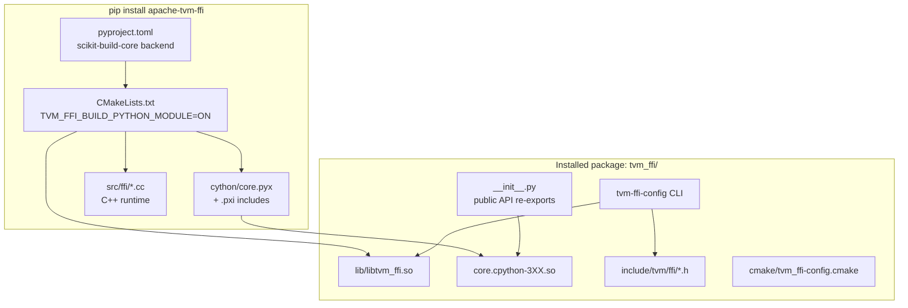
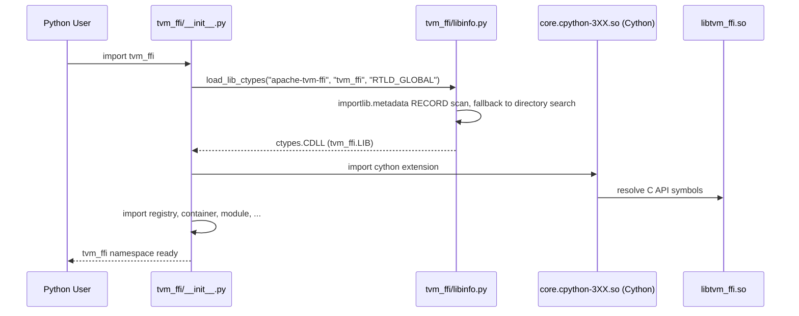
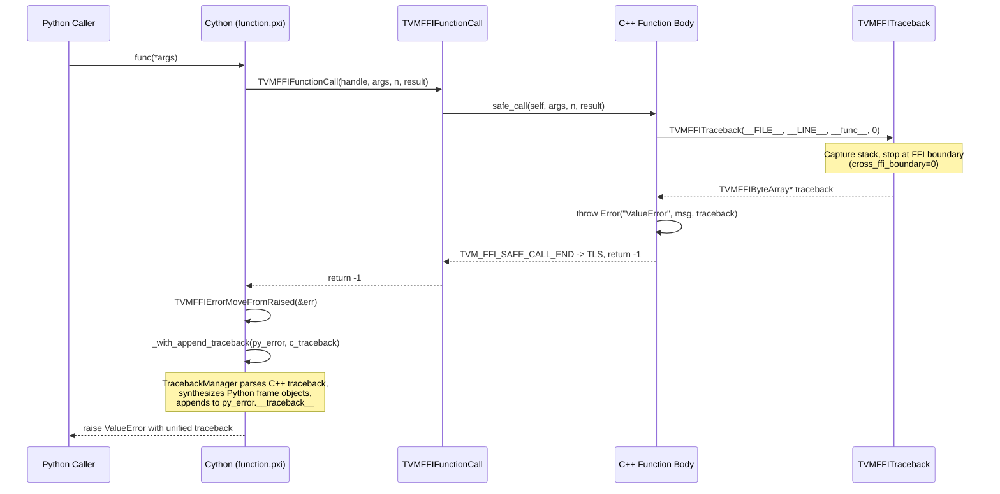
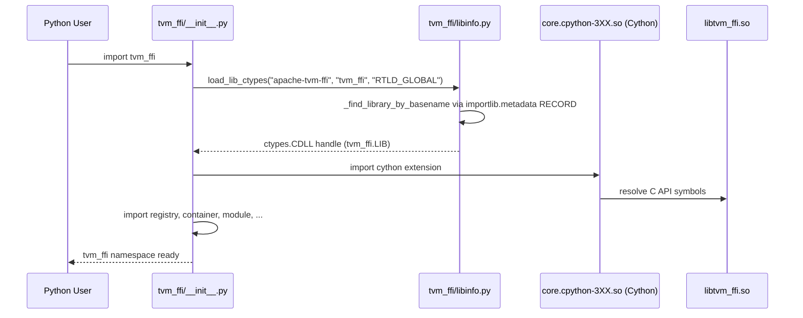

# Python Package (`tvm_ffi`)

**TL;DR**
- `tvm_ffi` is a standalone pip-installable Python package (runtime dependency: `typing-extensions>=4.5`) that wraps the TVM FFI C++ runtime via Cython bindings, exposing the core FFI primitives (Object, Function, Array, Map, Module, Tensor, etc.) to Python consumers.
- The package uses `scikit-build-core` as its build backend, compiling the C++ shared library and Cython extension in a single `pip install` step, and ships a `tvm-ffi-config` CLI for downstream C++ projects to discover include paths, library paths, and CMake config.
- A cross-language backtrace protocol (`TVMFFIBacktrace` with `cross_ffi_boundary` parameter + Python `TracebackManager`) synthesizes Python frame objects from C++ backtrace strings, producing unified tracebacks that span the C++/Python FFI boundary. Backtrace strings are stored most-recent-call-first; `TracebackMostRecentCallLast()` reverses for display.

## Problem Statement

### Background
- The TVM FFI C++ runtime provides type-erased values, reference-counted objects, packed functions, and container types. Python is the primary consumer of this runtime.
- Prior to this design, Python bindings were embedded within the monolithic `tvm` Python package, making it impossible for lightweight downstream projects (e.g., a kernel library that only needs function calling and module loading) to depend on the FFI layer without pulling in the entire compiler toolchain.
- Cross-language error tracebacks were limited: C++ stack frames were either absent from Python exceptions or displayed as raw text, making debugging of C++ -> Python -> C++ call chains difficult.

### Solution
- Extract the FFI Python bindings into a standalone package `tvm_ffi` (PyPI name: `apache-tvm-ffi`) with zero required dependencies.
- Use `scikit-build-core` to build the C++ shared library (`libtvm_ffi.so`/`.dylib`/`.dll`) and Cython extension (`core.*.so`) in one step.
- Provide `tvm-ffi-config` CLI and `cmake/tvm_ffi-config.cmake` so downstream C++ projects can `find_package(tvm_ffi)` and link against the installed library.
- Implement a `TracebackManager` that parses C++ traceback strings and synthesizes Python `types.TracebackType` objects, appending C++ frames to Python exceptions.

### Goals
- **Goal**: Enable lightweight downstream Python packages to depend only on `tvm_ffi` without the full TVM compiler toolchain.
- **Goal**: Provide a single `pip install` command that builds C++ and Cython from source.
- **Goal**: Produce unified tracebacks spanning C++/Python boundaries for debugging.
- **Goal**: Enable downstream C++ projects to discover and link against the installed `tvm_ffi` library via CMake.
- **Non-goal**: Not a general-purpose Python-C++ binding framework; specifically targets the TVM FFI ABI.
- **Non-goal**: Pre-built binary wheels are a deployment concern, not a design goal (though `cibuildwheel` config is included).

## Design



**Module import flow** (updated: `base.py` deleted in 6887892, replaced by `load_lib_ctypes`):



**Cross-language traceback flow**:



### Key Classes, Fields and Interfaces

**Package metadata** (`pyproject.toml`):
- PyPI name: `apache-tvm-ffi`, version derived by `setuptools_scm` from git tags (ac63fb9; was hardcoded `0.1.0b3`)
- Build backend: `scikit-build-core` (requires `scikit-build-core>=0.10.0, cython, setuptools-scm`)
- Version mechanism: `dynamic = ["version"]`, `[tool.setuptools_scm] version_file = "python/tvm_ffi/_version.py"`, `[tool.scikit-build] metadata.version.provider = "scikit_build_core.metadata.setuptools_scm"`
- `_version.py` is auto-generated by `setuptools_scm` at build time and gitignored; fallback `__version__ = "0.0.0.dev0"` when not present
- Python: `>=3.9`, zero runtime dependencies
- Wheel layout: `python/tvm_ffi/` maps to installed `tvm_ffi/`
- CMake args: `-DTVM_FFI_BUILD_PYTHON_MODULE=ON -DTVM_FFI_ATTACH_DEBUG_SYMBOLS=ON`

**`tvm_ffi.__init__` re-exports** (public API surface, updated per commits 40f4d9d, 3a551d8, 825aeb9):
```python
# Registration (renamed from register_func, _init_api)
register_object(type_key: str) -> Callable[[type], type]
register_global_func(func_name: str, f=None, override=False) -> Function  # was register_func
get_global_func(name: str, allow_missing=False) -> Function | None
init_ffi_api(namespace: str, target_module_name=None) -> None  # was _init_api

# Types
Object          # base for all FFI objects
Function        # packed function wrapper
Array           # immutable sequence (registered "ffi.Array")
Map             # immutable mapping (registered "ffi.Map")
Shape           # tuple subclass for shape objects
Tensor          # DLPack tensor (was NDArray, registered "ffi.Tensor")
Module          # runtime module (registered "ffi.Module")
ObjectConvertible  # was ObjectGeneric

# Module loading
load_module(path: str | PathLike) -> Module  # widened to accept PathLike (af898a2)
system_lib(symbol_prefix: str = "") -> Module
# ModulePropertyMask, String, Bytes, DataTypeCode removed from top-level re-exports

# Device and dtype
Device, device(device_type: str | int, index: int | None = None) -> Device  # was device_id=0
DLDeviceType    # IntEnum: kDLCPU=1, kDLCUDA=2, ... (extracted from Device constants)
dtype
# Convenience device constructors (cpu(), cuda(), etc.) removed

# Stream context management
StreamContext       # context manager for per-thread/per-device FFI environment stream
use_raw_stream(device: Device, stream: int | c_void_p) -> StreamContext
use_torch_stream(context: Optional[Any] = None) -> TorchStreamContext
get_raw_stream(device: Device) -> int  # query current env stream (added 22c049b)

# Utilities
convert, register_error, from_dlpack

# Sub-packages
tvm_ffi.cpp.load_inline(
    name, *, cpp_sources=None, cuda_sources=None, functions=None,
    extra_cflags=None, extra_cuda_cflags=None, extra_ldflags=None,
    extra_include_paths=None, build_directory=None
) -> Module  # JIT inline C++/CUDA compilation (API updated per 825aeb9)
tvm_ffi.cpp.build(
    name, *, cpp_files=None, cuda_files=None,
    extra_cflags=None, extra_cuda_cflags=None, extra_ldflags=None,
    extra_include_paths=None, build_directory=None
) -> str   # File-based build; returns .so path (5569e449)
tvm_ffi.cpp.load(
    name, *, cpp_files=None, cuda_files=None,
    extra_cflags=None, extra_cuda_cflags=None, extra_ldflags=None,
    extra_include_paths=None, build_directory=None
) -> Module  # File-based build+load; wraps build() + load_module() (5569e449)
tvm_ffi.utils.FileLock(path)   # Cross-platform advisory file lock
tvm_ffi.utils.kwargs_wrapper.make_kwargs_wrapper(
    target_func, arg_names, arg_defaults=(), kwonly_names=None,
    kwonly_defaults=None, prototype=None
) -> Callable  # Codegen wrapper adding kwargs to positional-only FFI functions (3115b23, 6bc1a8e)
tvm_ffi.utils.kwargs_wrapper.make_kwargs_wrapper_from_signature(
    target_func, signature, prototype=None, exclude_arg_names=None
) -> Callable  # Convenience from inspect.Signature
```

**`tvm-ffi-config` CLI** (`tvm_ffi.config:__main__`):
| Flag | Output |
|------|--------|
| `--includedir` | Path to `include/` with `tvm/ffi/*.h` headers |
| `--dlpack-includedir` | Path to `dlpack/include/` headers |
| `--cmakedir` | Path to `cmake/` with `tvm_ffi-config.cmake` |
| `--libdir` | Directory containing `libtvm_ffi.so` |
| `--libfiles` | Full path to shared library (or `.lib` on Windows) |
| `--sourcedir` | Package source root |
| `--cython-lib-path` | Path to compiled `core.*.so` Cython extension |
| `--cflags` | `-I<include> -I<dlpack>` (C compilation, no `-std=c++17`) |
| `--cxxflags` | `-I<include> -I<dlpack> -std=c++17` |
| `--ldflags` | `-L<libdir>` (Unix only) |
| `--libs` | `-ltvm_ffi` (Unix) or full `.lib` path (Windows) |

**`cmake/tvm_ffi-config.cmake`** -- CMake config-mode package:
```cmake
# Queries tvm-ffi-config via Python to resolve paths
# Provides two namespaced imported targets (renamed from tvm_ffi_header/tvm_ffi_shared in a1cb746):
#   tvm_ffi::header  -- INTERFACE IMPORTED library (headers only, C++17)
#   tvm_ffi::shared  -- SHARED IMPORTED library (headers + linked library)
find_package(Python COMPONENTS Interpreter REQUIRED)
execute_process(COMMAND "${Python_EXECUTABLE}" -m tvm_ffi.config --includedir ...)
execute_process(COMMAND "${Python_EXECUTABLE}" -m tvm_ffi.config --dlpack-includedir ...)
execute_process(COMMAND "${Python_EXECUTABLE}" -m tvm_ffi.config --libfiles ...)
add_library(tvm_ffi::header INTERFACE IMPORTED)
add_library(tvm_ffi::shared SHARED IMPORTED)
# Also includes Utils/Library.cmake and Utils/EmbedCubin.cmake
```

**`tvm_ffi_configure_target`** (in `cmake/Utils/Library.cmake`, added in ccd19f8) -- single-call integration point for downstream targets:
```cmake
tvm_ffi_configure_target(target
    [LINK_SHARED ON|OFF]    # Link tvm_ffi::shared (default: ON)
    [LINK_HEADER ON|OFF]    # Link tvm_ffi::header (default: ON)
    [DEBUG_SYMBOL ON|OFF]   # Apple dSYM generation (default: ON)
    [MSVC_FLAGS ON|OFF]     # MSVC-specific flags (default: ON)
    [STUB_DIR <dir>]        # Directory for stub generation post-build step
    [STUB_INIT ON|OFF]      # Enable init-mode stub generation (default: OFF)
    [STUB_PKG <pkg>]        # Package name (default: ${SKBUILD_PROJECT_NAME} or target name)
    [STUB_PREFIX <prefix>]  # Registry prefix (default: "${STUB_PKG}.")
)
```
Always-on behaviors: calls `tvm_ffi_add_prefix_map(target, CMAKE_CURRENT_SOURCE_DIR)`. When `STUB_DIR` is set, adds a post-build step running `python -m tvm_ffi.stub.cli`. When `STUB_INIT ON`, passes `--init-lib`, `--init-pypkg`, `--init-prefix` to the stubgen CLI. Validation: `STUB_PKG`/`STUB_PREFIX` require `STUB_DIR`; `STUB_INIT ON` requires `STUB_DIR`.

**`tvm_ffi_install`** (in `cmake/Utils/Library.cmake`, added in ccd19f8) -- platform-aware install helper:
```cmake
tvm_ffi_install(target [DESTINATION <dir>])
```
On Apple: installs `$<TARGET_FILE:target>.dSYM` bundle to DESTINATION (default `"."`), using `OPTIONAL`. On non-Apple: currently a no-op.

**`TracebackManager`** -- Python-side traceback synthesis:
```python
class TracebackManager:
    """Parses C++ backtrace strings and synthesizes Python frame objects."""
    _code_cache: dict[tuple[str,int,str], CodeType]  # (filename, lineno, func) -> code

    def _get_cached_code_object(self, filename: str, lineno: int, func: str) -> CodeType:
        """Create/cache a code object pointing to the given source location.
        Uses ast.parse("_getframe()") + code.replace(co_name=func, co_firstlineno=lineno)."""

    def _create_frame(self, filename: str, lineno: int, func: str) -> FrameType:
        """eval() the cached code object to produce a live frame object."""

    def append_traceback(self, tb: TracebackType, filename: str, lineno: int, func: str) -> TracebackType:
        """Append a synthetic frame to the traceback chain.
        Uses nested create() function to avoid holding frame in locals (6ccbdb6).
        Returns types.TracebackType(tb, frame, frame.f_lasti, lineno)."""

def _with_append_backtrace(py_error: BaseException, backtrace: str) -> BaseException:
    """Parse C++ backtrace string, append frames to py_error.__traceback__.
    Uses try...finally: del py_error, tb to break exception-traceback-frame cycles (6ccbdb6)."""

def _parse_backtrace(backtrace: str) -> list[tuple[str, int, str]]:
    """Parse 'File "...", line N, in func' pattern from C++ backtrace string."""

def _traceback_to_backtrace_str(tb: TracebackType | None) -> str:
    """Convert Python traceback to backtrace string (reverses line order for most-recent-first storage)."""
```

**`TVMFFIBacktrace` C API** (renamed from `TVMFFITraceback`):
```c
const TVMFFIByteArray* TVMFFIBacktrace(
    const char* filename,  // caller file (or NULL)
    int lineno,            // caller line number
    const char* func,      // caller function name (or NULL)
    int cross_ffi_boundary // 0 = stop at FFI boundary, 1 = cross boundary
);
```

**`DetectFFIBoundary`** -- determines when to stop collecting stack frames:
```cpp
inline bool DetectFFIBoundary(const char* filename, const char* symbol) {
    // Returns true if symbol is "TVMFFIFunctionCall" (the C ABI entry point)
    // When cross_ffi_boundary=0, traceback collection stops here
}
```

**`ShouldExcludeFrame`** -- filters internal frames:
```cpp
inline bool ShouldExcludeFrame(const char* filename, const char* symbol) {
    // Excludes: tvm::ffi::details::*, TVMFFITraceback*, TVMFFIErrorSetRaisedFromCStr*
}
```

**Renamed internal functions** (for clarity):
| Old name | New name |
|----------|----------|
| `ShouldStopTraceback()` | `DetectFFIBoundary()` |
| `backtrace_handler()` | `TVMFFISegFaultHandler()` |
| `install_signal_handler()` | `TVMFFIInstallSignalHandler()` |

**`TVM_FFI_THROW` macro expansion** (updated -- no longer uses `TVM_FFI_TRACEBACK_HERE`):
```cpp
#define TVM_FFI_THROW(ErrorKind)
  ::tvm::ffi::details::ErrorBuilder(
      #ErrorKind,
      TVMFFITraceback(__FILE__, __LINE__, TVM_FFI_FUNC_SIG, 0),  // direct call, no macro
      TVM_FFI_ALWAYS_LOG_BEFORE_THROW
  ).stream()
// Pseudocode expansion for TVM_FFI_THROW(ValueError) << "bad input":
// 1. TVMFFITraceback captures C++ stack up to FFI boundary, prepends caller file:line
// 2. ErrorBuilder("ValueError", traceback_bytes, false) constructed
// 3. .stream() returns ostringstream& for message accumulation
// 4. ~ErrorBuilder() throws Error("ValueError", "bad input", traceback)
```

**`libinfo.py`** -- library discovery and loading (refactored in 6887892, 3cfc5c5, f255650):
```python
def load_lib_ctypes(package: str, target_name: str, mode: str) -> ctypes.CDLL:
    """Primary public API for loading shared libraries.
    Uses importlib.metadata RECORD as primary discovery, directory scan as fallback."""

def load_lib_module(package: str, target_name: str, keep_module_alive: bool = True) -> Module:
    """Load a shared library as a TVM FFI Module via importlib.metadata discovery.
    Combines _find_library_by_basename with load_module. Recommended one-liner for
    downstream extension packages."""

def find_include_path() -> str:    # <package>/include/ or source tree
def find_cmake_path() -> str:      # <package>/cmake/ or source tree
def find_source_path() -> str:     # validates via (p / "src").is_dir() (fixed in 3cfc5c5)
def find_cython_lib() -> str:      # <package>/core.*.so
def find_windows_implib() -> str:  # moved from config.py

# Internal:
def _find_library_by_basename(package: str, target_name: str) -> Path:
    """Primary: importlib.metadata RECORD scan. Fallback: directory search."""
def _resolve_and_validate(paths, cond) -> str | None:
    """Centralized path resolution with error-safe condition checking."""
```

**Module import flow** (updated after 6887892 -- `base.py` deleted):


**Stream context management** (`python/tvm_ffi/stream.py`):
```python
class StreamContext:
    """Context manager for per-thread/per-device FFI environment stream."""
    def __init__(self, device: Device, stream: int | c_void_p) -> None: ...
    def __enter__(self) -> "StreamContext": ...   # calls core._env_set_current_stream, returns self
    def __exit__(self, *args) -> None: ...         # restores previous stream

class TorchStreamContext:
    """Context manager that syncs Torch and FFI stream contexts."""
    def __init__(self, context: Optional[Any]) -> None: ...
    def __enter__(self) -> "TorchStreamContext": ...  # enters torch context, then creates StreamContext from current_stream
    def __exit__(self, *args) -> None: ...

def use_raw_stream(device: Device, stream: int | c_void_p) -> StreamContext: ...
def use_torch_stream(context: Optional[Any] = None) -> TorchStreamContext: ...
def get_raw_stream(device: Device) -> int: ...
```
`get_raw_stream` (added in 22c049b) completes the stream get/set pair: it queries the current FFI environment stream for a given device without creating a context manager. Delegates to `core._env_get_current_stream(device.dlpack_device_type(), device.index)`, which wraps `TVMFFIEnvGetStream` and casts the `void*` result to `uint64_t`.

```python
```
`use_torch_stream` gracefully degrades: if `torch` is not importable, calling it raises `ImportError`. The `core._env_set_current_stream(device_type, device_id, stream) -> uint64` Cython function wraps `TVMFFIEnvSetStream`, returning the previous stream for save/restore.

**Cython byte-array conversion helpers** (`cython/base.pxi`):
```cython
cdef inline str bytearray_to_str(const TVMFFIByteArray* x):
    return PyBytes_FromStringAndSize(x.data, x.size).decode("utf-8")
cdef inline bytes bytearray_to_bytes(const TVMFFIByteArray* x):
    return PyBytes_FromStringAndSize(x.data, x.size)
```
All `TVMFFIByteArray*` -> Python conversions go through these named helpers, rather than calling `PyBytes_FromStringAndSize` directly.

### Contracts, Assumptions and Invariants
- **Runtime dependency**: `tvm_ffi` depends on `typing-extensions>=4.5` (for `dataclass_transform`, `TypeVar`). `numpy` and `torch.utils.cpp_extension` are optional lazy imports. It only requires the C++ shared library (`libtvm_ffi`) that is compiled during installation.
- **PEP 561 typing marker**: `python/tvm_ffi/py.typed` is an empty marker file bundled in wheels/sdists, signaling to type checkers (mypy, pyright) that `tvm_ffi` ships inline type information.
- **Cython type stub convention**: `core.pyi` provides bare type signatures only (docstrings removed in e10d1ed). Docstrings and inline Python type annotations now live in the Cython `.pxi` source files, making `.pxi` the single source of truth for both documentation and types. `_ffi_api.pyi` provides type annotations for the runtime-populated module. `# cython: annotation_typing=False` in `core.pyx` ensures Cython treats Python annotations as documentation rather than Cython type declarations.
- **RPATH convention**: The Cython extension (`core.*.so`) uses `INSTALL_RPATH` of `@loader_path/lib` (macOS) / `$ORIGIN/lib` (Linux) to find `libtvm_ffi_shared` in the installed wheel layout. `BUILD_WITH_INSTALL_RPATH` is NOT set, so build-time uses CMake default RPATH.
- **Library discovery order** (updated 6887892): `libinfo.load_lib_ctypes(package, target_name, mode)` uses `importlib.metadata.distribution(package).read_text("RECORD")` as the primary mechanism (scanning for platform-specific shared library filenames), then falls back to directory search (`lib/`, source-tree, env paths). The `find_libtvm_ffi()` function is superseded by `load_lib_ctypes`.
- **Traceback boundary semantics**: `cross_ffi_boundary=0` (default) stops stack collection at `TVMFFIFunctionCall`, producing a traceback scoped to the current C++ call. `cross_ffi_boundary=1` collects the full stack across boundaries, used by `TVMFFISegFaultHandler` for crash diagnostics.
- **Frame skip count**: When `filename` and `func` are non-NULL, `skip_frame_count=2` skips `TVMFFITraceback` itself and its caller (whose info is already provided via the parameters), avoiding duplicate frames.
- **Code object caching**: `TracebackManager._code_cache` caches code objects by `(filename, lineno, func)` key, avoiding repeated `ast.parse` + `compile` overhead for the same source location.
- **Error kind mapping**: `register_error` maps string error kinds (e.g., `"ValueError"`) to Python exception classes. Pre-registered: `RuntimeError`, `ValueError`, `TypeError`, `AttributeError`, `KeyError`, `IndexError`, `AssertionError`, `MemoryError` (00a9ad7).
- **FileLock re-entrant acquire contract** (021d78d): A `FileLock` instance that already holds the lock (`_file_descriptor is not None`) will refuse to acquire again: `acquire()` returns `False`, `blocking_acquire()` raises `RuntimeError("Lock is already held by this instance.")`. This prevents same-instance double-locking which could cause deadlock or undefined behavior on some platforms.
- **`register_object` type preservation** (0ee6444): `register_object(type_key)` now uses `TypeVar("_T", bound=type)` so the decorator preserves the decorated class's type identity through static type checkers. Previously, the return type was `type`, losing the class's specific type.
- **CUDA stream acquisition**: The torch CUDA stream is obtained via `torch._C._cuda_getCurrentRawStream(device_id)` (a PyTorch internal API used by Dynamo). This replaced a previous approach that JIT-compiled a C++ extension via `torch.utils.cpp_extension.load_inline`, eliminating cold-start latency and the runtime dependency on nvcc. The stream is captured lazily on first CUDA tensor encounter by the type-cached dispatch system (see [0015-python-ffi-call-dispatch.md](0015-python-ffi-call-dispatch.md)).
- **Stream context save/restore**: `StreamContext.__enter__` calls `core._env_set_current_stream` which wraps `TVMFFIEnvSetStream(device_type, device_id, stream, &prev_stream)`. The returned `prev_stream` is cached and restored in `__exit__`. Nesting is supported: each context saves and restores independently. `TorchStreamContext` enters the torch stream context first, then creates a `StreamContext` from `torch.cuda.current_stream()`.
- **MSVC developer environment on Windows**: On Windows, `_build_ninja()` in `load_inline` invokes ninja through `_run_command_in_dev_prompt()`, which locates Visual Studio via `vswhere.exe` at `%ProgramFiles(x86)%\Microsoft Visual Studio\Installer\vswhere.exe`, then sources `VsDevCmd.bat -arch=x64` before running the build command. This ensures `cl.exe`, `link.exe`, and MSVC headers are available without requiring the user to run from a Developer Command Prompt.
- **Default tensor.h include for inline modules**: `_decorate_with_tvm_ffi()` now prepends `#include <tvm/ffi/container/tensor.h>` to the auto-generated header block, making `tvm::ffi::TensorView` available to all inline modules by default. The idiomatic parameter type for inline module functions is `tvm::ffi::TensorView` (non-owning view), not `tvm::ffi::Tensor` (owning) or raw `DLTensor*`.
- **Type annotation enforcement**: All Python public APIs must carry type annotations, enforced by ruff's `ANN` rule family (flake8-annotations). Common typing imports: `from typing import Any, Optional, Union, Callable, NoReturn`.
- **`__tvm_ffi_env_stream__` protocol** (from commit db98729): A dunder method that tensor-like objects implement to return the raw stream handle (as an integer) for automatic stream context exchange. When a `__dlpack__`-compatible argument also implements `__tvm_ffi_env_stream__`, the Cython setter automatically captures and sets the stream context via `TVMFFIEnvSetStream` before the FFI call, and restores it afterward. This is a new cross-framework convention that generalizes the torch-specific stream handling.
- **`init_ffi_api` prefix stripping**: `init_ffi_api(namespace)` (renamed from `_init_api`) strips the `"tvm."` prefix if present, then imports all global functions matching `prefix.*` (without dots in the suffix) into the target module.
- **`[[maybe_unused]]` on final object statics**: `TVM_FFI_DECLARE_OBJECT_INFO_FINAL` annotates `_type_child_slots` and `_type_final` with `[[maybe_unused]]` to suppress compiler warnings in translation units that do not read these fields.
- **Class override pattern**: `_CLASS_DEVICE` and `_CLASS_TENSOR` are module-level globals in Cython that can be overridden via `_set_class_device(cls)` / `_set_class_tensor(cls)`. Code that reads these must access via `core._CLASS_DEVICE` (module attribute access at call time), never via `from .core import _CLASS_DEVICE` (which captures the import-time value). Violation causes overrides to be silently ignored.
- **ByteArrayArg lifetime invariant**: `ByteArrayArg` wraps a Python `bytes` object and exposes a `TVMFFIByteArray*` pointer. It must always be bound to a named `cdef` variable, never used as a temporary in a C API call expression. Cython may destruct temporaries before the enclosing C call completes, causing use-after-free. Example: `cdef ByteArrayArg arg = ByteArrayArg(c_str(key)); TVMFFITypeKeyToIndex(arg.cptr(), &idx)` (correct) vs `TVMFFITypeKeyToIndex(ByteArrayArg(c_str(key)).cptr(), &idx)` (buggy).
- **`tvm_ffi.dataclasses` sub-package**: Provides `@c_class` decorator (now a thin wrapper around `register_object`, b97ff1a). See [0018-python-dataclasses.md](0018-python-dataclasses.md).
- **CObject/Object split** (49a5d71): Cython `Object` is split into `CObject` (Cython extension type owning the low-level `chandle`) and `Object` (Python class with `_ObjectSlotsMeta` metaclass that auto-injects `__slots__=()`). All `Object` subclasses enforce `__slots__=()` by default; setting arbitrary instance attributes raises `AttributeError`. Classes needing `__dict__` must explicitly declare `__slots__ = ("__dict__",)` (e.g., `Module` for cached function lookups).
- **`_ObjectSlotsMeta`** (49a5d71): Extends `ABCMeta`, enabling `Object` subclasses to register as ABCs (e.g., `Sequence`, `MutableMapping`). Auto-injects `__slots__=()` when not declared in class namespace.
- **Reference-cycle-free error handling** (6ccbdb6): The error handling path guarantees no reference cycles between exception objects, traceback objects, and stack frames. `append_traceback` uses a nested function to avoid holding frames in locals; `_with_append_backtrace` uses `try...finally: del` to break the exception-traceback-frame cycle. This is critical for training workloads where immediate tensor deallocation (via CPython refcounting) matters for GPU memory pressure.
- **Failure mode -- library not found**: If `libinfo.load_lib_ctypes()` exhausts all search paths without finding the shared library, it raises `RuntimeError` with the list of candidate paths. This typically means the C++ build step was skipped or the library was installed to a non-standard location. Mitigation: set `LD_LIBRARY_PATH`/`DYLD_LIBRARY_PATH` or reinstall with `pip install --force-reinstall`.
- **Failure mode -- inaccessible directories**: `_resolve_and_validate()` wraps `path.is_dir()` and `path.resolve()` in `try/except OSError` to handle permission-denied or broken paths (53a7fe9, refactored 6887892).
- **Failure mode -- traceback parsing**: If `_parse_traceback` encounters a C++ traceback string that does not match the expected `File "...", line N, in func` format (e.g., on platforms without libbacktrace), the parsed result is an empty list and no C++ frames are appended to the Python exception. The error message and kind are still preserved.

### Extension Points
- **New Cython `.pxi` files**: Additional Cython binding files can be added under `cython/` and included from `core.pyx`. Each `.pxi` handles one domain (base, function, object, error, ndarray, string, device, dtype).
- **`register_error` for custom error kinds**: Downstream packages can map new C++ error kinds to Python exceptions via `register_error("MyError", MyError)`.
- **`init_ffi_api` for bulk function import**: Downstream modules call `init_ffi_api("tvm.my_module")` to auto-import all globally registered functions matching the namespace prefix.
- **CMake `find_package` extensibility**: New downstream C++ projects use `find_package(tvm_ffi)` and link against `tvm_ffi::header` (header-only) or `tvm_ffi::shared` (full library) via the namespaced imported targets (renamed from `tvm_ffi_header`/`tvm_ffi_shared` in a1cb746). The recommended approach is `tvm_ffi_configure_target(my_ext STUB_DIR "./python" STUB_INIT ON)` which handles linking, debug symbols, MSVC flags, and stub generation in a single call (ccd19f8).
- **`tvm_ffi_install` for debug artifacts**: `tvm_ffi_install(target)` installs platform-specific debug artifacts (Apple dSYM bundles). Pair with `tvm_ffi_configure_target(... DEBUG_SYMBOL ON)` (ccd19f8).
- **Downstream packaging pattern** (simplified in f255650, further in ccd19f8): The `examples/python_packaging/` project demonstrates building tvm-ffi-based C++ extensions as Python wheels. The CMakeLists.txt is reduced to 3 lines: `tvm_ffi_configure_target(my_ext STUB_DIR "./python" STUB_INIT ON)`, `install(TARGETS my_ext DESTINATION .)`, `tvm_ffi_install(my_ext)`. Generated `_ffi_api.py` uses `load_lib_module("my-ffi-extension", "my_ffi_extension")` for library loading.
- **C++ extension build pipeline** (`tvm_ffi.cpp`, renamed from `load_inline.py` to `extension.py` in 5569e449): Four public functions exported via `__init__.py`:
  - `build_inline`/`load_inline`: Accept inline source strings, auto-generate FFI export wrappers via `TVM_FFI_DLL_EXPORT_TYPED_FUNC`. Uses Ninja for build, SHA-256 content-addressed caching under `$TVM_FFI_CACHE_DIR` (default `~/.cache/tvm-ffi`), and `FileLock` for process-safe concurrent builds.
  - `build`/`load` (new, 5569e449): Accept file paths (`.cc`/`.cu`), compile them directly without FFI wrapper generation (user must use `TVM_FFI_DLL_EXPORT_TYPED_FUNC` manually). `build()` returns the `.so`/`.dll` path; `load()` wraps `build()` + `load_module()`.
  - All four functions share a common `_build_impl` infrastructure.
  - Platform-specific linking: Windows uses MSVC Developer Command Prompt (auto-detected via `vswhere.exe`), Unix uses `-L` + `-ltvm_ffi`.
  - CUDA support: auto-detect GPU compute capability via `nvidia-smi`, override via `TVM_FFI_CUDA_ARCH_LIST` env var. CUDA home resolved from `CUDA_HOME`/`CUDA_PATH`/`which nvcc`/default paths.
  - **`with_cpp` dispatch rule**: When `cpp_sources` is empty and `cuda_sources` is provided, `TVM_FFI_DLL_EXPORT_TYPED_FUNC` export macros are placed in the `cuda.cu` file instead of `main.cpp`, enabling CUDA-only modules to export functions without a C++ stub.
- **`Function.__from_extern_c__` and `__from_mlir_packed_safe_call__`** (a153647, f6303b2): Static methods on the Cython `Function` class for constructing FFI functions from raw C function pointers. `__from_extern_c__(c_symbol: int, *, keep_alive_object=None)` wraps a `TVMFFISafeCallType` pointer. `__from_mlir_packed_safe_call__(mlir_packed_symbol: int, *, keep_alive_object=None)` wraps an MLIR `void(*)(void**)` pointer via `TVMFFIPyMLIRPackedSafeCall` adapter. Both accept an optional `keep_alive_object` (keyword-only) whose refcount is incremented to prevent the backing JIT engine from being collected.
- **`__tvm_ffi_env_stream__` protocol**: Any tensor-like object that implements `__dlpack__` and `__tvm_ffi_env_stream__() -> int` participates in automatic stream context propagation through TVM FFI calls. The stream is set via `TVMFFIEnvSetStream` before the call and restored afterward.
- **DLPack speed-converter protocol**: External tensor types register a `DLPackExchangeAPI` struct via `__dlpack_c_exchange_api__` (renamed from `__c_dlpack_exchange_api__` in 5393647) for zero-Python-overhead DLPack conversion. See [0015-python-ffi-call-dispatch.md](0015-python-ffi-call-dispatch.md) for the full dispatch design.
- **Free-threaded Python (3.14t) support** (added in b64b46f): `# cython: freethreading_compatible = True` directive enables Cython to produce GIL-free code. `TVMFFIPyWithGILIfNotFreeThreaded` is an RAII guard: when `Py_GIL_DISABLED` is defined (free-threaded build), constructor/destructor are no-ops; otherwise, they call `PyGILState_Ensure`/`Release`. `TVMFFIPyObjectDeleter` (C-level, `tvm_ffi_python_helpers.h`) replaces the Cython-level `tvm_ffi_pyobject_deleter` as it is compatible with both GIL and free-threaded builds. `PYTHON_IS_FREE_THREADED` CMake variable is set by checking `sysconfig.get_config_var('Py_GIL_DISABLED') == 1`; when true, `USE_SABI` (Stable ABI) is disabled because it is incompatible with free-threaded Python.
- **OpaquePyObject type hierarchy fix** (b64b46f): `OpaquePyObject` registration changed from `ReserveBuiltinTypeIndex` (which sets `type_depth=0`, `parent=-1`) to `GetOrAllocTypeIndex` with `type_depth=1` and `parent_type_index=kTVMFFIObject`, so `IsInstance<Object>()` correctly returns true. `ReserveBuiltinTypeIndex` is only appropriate for POD types.
- **Per-function GIL release**: `Function.release_gil` (default `True`, controlled by `TVM_FFI_RELEASE_GIL_BY_DEFAULT` env var) controls whether the GIL is released during FFI calls. See [0015-python-ffi-call-dispatch.md](0015-python-ffi-call-dispatch.md).
- **Opaque PyObject wrapping**: Non-FFI-native Python objects are transparently wrapped as `OpaquePyObject` (type index `kTVMFFIOpaquePyObject=74`) instead of raising `TypeError`. The wrapping is identity-preserving: `tvm_ffi.convert(obj)` wraps, and returning the object through FFI unwraps back to the original `PyObject*`. This enables arbitrary Python objects in FFI containers (`Array`, `Map`) and as function arguments.
- **dtype literal constants** (408aa78): Pre-constructed `dtype` constants accessible as `tvm_ffi.<name>` (e.g., `tvm_ffi.float32`, `tvm_ffi.int64`, `tvm_ffi.bool`). Follows numpy 2.0 naming convention. 20 constants defined in `_dtype.py`: `bool`, `int8/16/32/64`, `uint8/16/32/64`, `float16/32/64`, `bfloat16`, `float8_e4m3fn`, `float8_e4m3fnuz`, `float8_e5m2`, `float8_e5m2fnuz`, `float8_e8m0fnu`, `float4_e2m1fnx2` (with alias `float4_e2m1fn_x2`). `convert()` passes `dtype` instances through unchanged.
- **Cython `--module-name`** (4628f06): The Cython build uses `--module-name "tvm_ffi.core"` so generated classes report the correct `__module__` attribute natively, eliminating the `_update_module()` post-import workaround.

### Usage Examples

#### End-to-end: build C++ kernel, load and call from Python
**Context**: The primary use case for `tvm_ffi` -- compile a C++ kernel into a shared library, install `tvm_ffi`, load the library, and call the kernel with numpy arrays.
```cpp
// src/add_one_cpu.cc
#include <tvm/ffi/function.h>
#include <tvm/ffi/container/tensor.h>
void AddOne(tvm::ffi::TensorView x, tvm::ffi::TensorView y) {
  for (int i = 0; i < x->shape[0]; ++i)
    static_cast<float*>(y->data)[i] = static_cast<float*>(x->data)[i] + 1;
}
TVM_FFI_DLL_EXPORT_TYPED_FUNC(add_one_cpu, AddOne);
```
```python
# run_example.py
import tvm_ffi
import numpy
mod = tvm_ffi.load_module("build/add_one_cpu.so")
x = numpy.array([1, 2, 3, 4, 5], dtype=numpy.float32)
y = numpy.empty_like(x)
mod.add_one_cpu(x, y)   # numpy arrays auto-converted via DLPack
print(y)  # [2. 3. 4. 5. 6.]
```

#### Stream context management
**Context**: Setting the FFI environment stream for device operations, with proper nesting and torch integration.
```python
import tvm_ffi

# Raw stream context (nested)
device = tvm_ffi.device("cuda:0")
with tvm_ffi.use_raw_stream(device, stream_handle_1):
    # FFI env stream is now stream_handle_1
    with tvm_ffi.use_raw_stream(device, stream_handle_2):
        # FFI env stream is now stream_handle_2
        pass
    # restored to stream_handle_1
# restored to original (NULL/0)

# Torch stream context
import torch
stream = torch.cuda.Stream()
with tvm_ffi.use_torch_stream(torch.cuda.stream(stream)):
    # Both torch current stream and FFI env stream are set to `stream`
    pass
```

#### Downstream CMake project linking against tvm_ffi
**Context**: A C++ kernel library that depends on the installed `tvm_ffi` package. Uses the single-call `tvm_ffi_configure_target` (ccd19f8) with namespaced targets (a1cb746).
```cmake
# CMakeLists.txt (recommended, 3 lines after boilerplate)
cmake_minimum_required(VERSION 3.18)
project(my_kernels)
find_package(tvm_ffi CONFIG REQUIRED)
add_library(my_kernel SHARED src/my_kernel.cc)
tvm_ffi_configure_target(my_kernel STUB_DIR "./python" STUB_INIT ON)
install(TARGETS my_kernel DESTINATION .)
tvm_ffi_install(my_kernel)

# Or manual linking with namespaced targets:
# target_link_libraries(my_kernel PRIVATE tvm_ffi::header tvm_ffi::shared)
```

#### Registering and looking up global functions from Python
**Context**: Registering a Python function for cross-language access.
```python
import tvm_ffi

@tvm_ffi.register_global_func("my_namespace.add")  # was register_func
def add(a, b):
    return a + b

# Later, from any Python module (or C++ via the global registry):
f = tvm_ffi.get_global_func("my_namespace.add")
result = f(3, 4)  # returns 7
```

## Alternatives & Trade-offs
### Monolithic `tvm` package (status quo ante)
- Pros: Single install, no version skew between FFI and compiler layers.
- Cons: Heavyweight dependency for consumers that only need function calling and module loading. Cannot independently version the FFI layer. Forces downstream kernel libraries to pull in the entire compiler toolchain.

### C-only distribution (no Python bindings in the package)
- Pros: Smaller package, no Cython build complexity.
- Cons: Every downstream Python project would need to implement its own ctypes/cffi wrappers. The Cython bindings are optimized for the FFI calling convention and handle reference counting, error propagation, and traceback synthesis -- reimplementing this correctly is non-trivial.

## Related Work
### Design Docs & ADRs
- [0001-c-abi-layer.md](../designs/0001-c-abi-layer.md) -- C ABI exports that the Cython bindings call
- [0004-function-system.md](../designs/0004-function-system.md) -- Function/packed calling convention used by Python wrappers
- [0016-ci-and-lint-pipeline.md](0016-ci-and-lint-pipeline.md) -- CI workflows, pre-commit hooks, ruff config, ANN enforcement
- [0006-error-handling.md](../designs/0006-error-handling.md) -- Error propagation and TVM_FFI_THROW macro (updated for traceback changes)
- [0008-containers.md](../designs/0008-containers.md) -- Array, Map, Shape Python wrappers
- [0013-module-system.md](../designs/0013-module-system.md) -- Module class, load_module, system_lib
- [0014-standalone-python-package.md](../ADRs/0014-standalone-python-package.md) -- Decision to decouple tvm_ffi as a standalone package
- [0015-python-ffi-call-dispatch.md](0015-python-ffi-call-dispatch.md) -- Type-cached FFI call dispatch, DLPack speed-converters, GIL release control
- [0017-dlpack-interop.md](0017-dlpack-interop.md) -- DLPack interop layer (torch addon, dtype conversions)
- [0018-python-dataclasses.md](0018-python-dataclasses.md) -- Python dataclasses sub-package (c_class, TypeInfo)
- [0016-type-cached-ffi-dispatch.md](../ADRs/0016-type-cached-ffi-dispatch.md) -- Decision to replace isinstance chain with type-cached dispatch

### Evidence Matrix
- Python package structure, pyproject.toml, RPATH, cibuildwheel -> `2025-08-24-2d41a511.md` + `2025-08-25-2cf211f1.md` + `2025-08-29-ad8e5d2c.md`
- Python API cleanup, NDArray-to-Tensor rename -> `2025-09-07-40f4d9dc.md` (40f4d9d) + `2025-09-06-3a551d83.md` (3a551d8)
- tvm_ffi.cpp.load_inline + API rename + platform fixes -> `2025-09-05-83805ec9.md` (83805ec), `2025-09-06-825aeb9a.md` (825aeb9), `2025-09-08-2df07e52.md` (2df07e5), `2025-09-14-4383b1a6.md` (4383b1a)
- Type-cached FFI dispatch, DLPack speed-converters -> `2025-09-11-38d2cdaa.md` (38d2cda), `2025-09-12-f81ab9c2.md` (f81ab9c), `2025-09-12-4dee97f1.md` (4dee97f)
- String/Bytes C API, nested container setters -> `2025-09-13-043d9f64.md` (043d9f6)
- Stream context APIs (StreamContext, use_raw_stream, use_torch_stream) -> `2025-09-15-3197cd09.md` (3197cd0)
- tvm-ffi-config --cflags, default tensor.h include, bytearray_to_bytes -> `2025-09-14-c100338d.md` (c100338), `2025-09-14-742b16e5.md` (742b16e), `2025-09-14-cc93373b.md` (cc93373)
- Type annotation enforcement (ANN), StreamContext bugfix -> `2025-09-17-8f4e044a.md` (8f4e044)
- OpaquePyObject, __tvm_ffi_env_stream__ protocol -> `2025-09-05-91d69f06.md` (91d69f0) + `2025-09-09-db987299.md` (db98729)
- Plus 12 supporting commits (CMake fixes, packaging, docs, CI, version bumps)
- core.pyi type stub, .pyi ASF header check -> `2025-09-18-785e8ca1.md` (785e8ca)
- TypeInfo/TypeField/TypeMethod, dual registry -> `2025-09-19-53b2e00e.md` (53b2e00)
- traceback -> backtrace rename across all layers -> `2025-09-22-6f020c11.md` (6f020c1)
- _CLASS_DEVICE override fix -> `2025-09-22-c0add281.md` (c0add28)
- Unregistered object fallback fix -> `2025-09-22-d68c8d8d.md` (d68c8d8)
- TYPE_INDEX_TO_CLS direct lookup, _set_type_cls -> `2025-09-23-035975a7.md` (035975a)
- ByteArrayArg use-after-free fix -> `2025-09-25-8e471b01.md` (8e471b0)
- mypy integration, _ffi_api.pyi, @overload, py.typed -> `2025-09-22-40e9c83.md` (40e9c83), `2025-09-23-5cfd705e.md` (5cfd705)
- get_raw_stream API -> `2025-10-08-22c049b8.md` (22c049b)
- dtype literal constants (tvm_ffi.float32, etc.) -> `2025-11-14-408aa78c4e7036127238ca626fdcb23e11103527.md` (408aa78)
- Cython --module-name, _update_module removal -> `2025-11-09-4628f06baaeb9f880c3522388ab33cc8b0736304.md` (4628f06)
- Free-threaded Python 3.14t, TVMFFIPyObjectDeleter, OpaquePyObject fix -> `2025-10-10-b64b46f3.md` (b64b46f)
- Function.__from_extern_c__ -> `2025-10-10-a15364746d60.md` (a153647)
- Function.__from_mlir_packed_safe_call__ -> `2025-10-11-f6303b23.md` (f6303b2)
- Auto-generate __init__ from __ffi_init__ for registered objects -> `2025-10-19-0729193f.md` (0729193)
- Cython docstring migration (.pyi -> .pxi), annotation_typing=False -> `2025-10-20-e10d1ed7.md` (e10d1ed)
- libinfo OSError robustification for inaccessible dirs -> `2025-10-21-53a7fe9f.md` (53a7fe9)
- load_module accepts PathLike objects -> `2025-10-24-af898a2c.md` (af898a2)
- setuptools_scm version derivation, check-version-consistency linter -> `2025-10-26-ac63fb9b.md` (ac63fb9)
- File-based build/load (extension.py), CUDA auto-detect -> `2025-11-05-5569e449.md` (5569e449)
- register_object TypeVar type hint preservation -> `2025-11-01-0ee64442.md` (0ee6444)
- FileLock re-entrant acquire fix + tests -> `2025-11-04-021d78db.md` (021d78d)
- MemoryError registration -> `2025-11-04-00a9ad7d.md` (00a9ad7)
- kwargs_wrapper codegen utility -> `2025-12-04-3115b237.md` (3115b23) + `2025-12-04-6bc1a8eb.md` (6bc1a8e)
- importlib.metadata-based load_lib_ctypes, base.py deletion -> `2025-12-06-6887892d.md` (6887892)
- find_source_path validation fix -> `2025-12-07-3cfc5c57.md` (3cfc5c5)
- load_lib_module for downstream library loading -> `2025-12-12-f255650b.md` (f255650)
- Reference-cycle-free error handling -> `2025-12-12-6ccbdb6b.md` (6ccbdb6)
- Device.__init__ widened to Integral + .item() -> `2025-12-18-a7ebc65f.md` (a7ebc65)
- `tvm_ffi_configure_target` + `tvm_ffi_install` CMake functions -> `2025-12-20-ccd19f8202a980bd03501a62600e338fa883f80c.md` (ccd19f8)
- Namespaced CMake targets (`tvm_ffi::header`/`tvm_ffi::shared`) -> `2025-12-22-a1cb746201412a943c29d942e6b2c29b36d97c48.md` (a1cb746)
- CObject/Object split, _ObjectSlotsMeta auto-slots, `object_repr()` local import -> `2026-02-27-49a5d71a3145aee20b6cfbcb7a2f7d9feb25f2f7.md` (49a5d71) + `cython/object.pxi`
- Plus 12 supporting commits (packaging guide expansion, quickstart polish, Rust docs, README updates, CI examples job, docs reorg)
