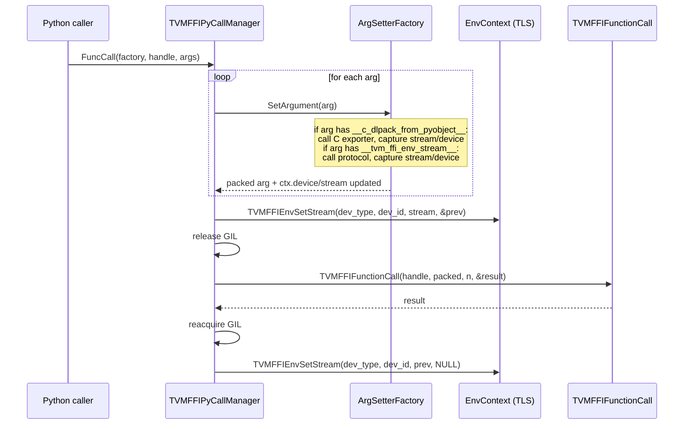

# Stream Exchange and Environment Context

**TL;DR**
- The `EnvContext` (C++, replacing `StreamContext`) is a thread-local singleton managing both a per-device stream table and a DLPack tensor allocator. It provides TLS-first resolution with global fallback for the allocator.
- The `__tvm_ffi_env_stream__` dunder protocol allows any `__dlpack__`-capable object to provide its execution stream to TVM FFI, extending automatic stream propagation beyond `torch.Tensor` to any framework (JAX, CuPy, custom).
- Python-level `StreamContext`, `use_torch_stream()`, and `use_raw_stream()` provide explicit `with`-statement stream save/restore, complementing the implicit stream propagation in the FFI call path.

## Problem Statement

### Background
- When calling TVM FFI functions with GPU tensors, the function must execute on the correct device stream. Previously, only `torch.Tensor` got automatic CUDA stream propagation via hardcoded detection in `make_args`.
- The old `StreamContext` (C++) only managed streams. The addition of DLPack tensor allocators (for C++ kernels to allocate output tensors in the caller's framework) required a broader per-thread context.
- Python users had no explicit API to set the FFI stream context; they relied entirely on implicit detection from tensor arguments.

### Solution
- Generalize `StreamContext` to `EnvContext` holding both stream table and tensor allocator.
- Define `__tvm_ffi_env_stream__` as a framework-agnostic dunder protocol for stream exchange.
- Provide Python context managers for explicit stream control.

### Goals
- Framework-agnostic automatic stream propagation.
- Explicit user control when implicit propagation is insufficient (e.g., CUDA graph capture).
- Non-goal: Multi-device stream scheduling within a single FFI call.

## Design



### Key Classes, Fields and Interfaces

```python
class EnvContext:
    """Thread-local environment context. Replaces StreamContext (f81ab9c)."""
    stream_table_: List[List[TVMFFIStreamHandle]]  # indexed by [device_type][device_id]
    dlpack_allocator_: DLPackManagedTensorAllocator        # TLS-level allocator
    # Invariant: exactly one instance per thread via ThreadLocal()
    # Interacts with: TVMFFIEnvSetStream, TVMFFIEnvGetStream
    # Extension: add new per-thread state (e.g., profiling context) by adding fields

    @staticmethod
    def ThreadLocal() -> Ptr[EnvContext]: ...

    @staticmethod
    def GlobalTensorAllocator() -> Ref[DLPackManagedTensorAllocator]: ...
        # Process-wide fallback when TLS allocator is nullptr
        # Interacts with: TVMFFIEnvSetDLPackManagedTensorAllocator(write_to_global_context=1)

# __tvm_ffi_env_stream__ protocol (db98729):
class StreamExchangeProtocol:
    """Duck-typed protocol for stream exchange with TVM FFI."""
    def __dlpack__(self, **kwargs) -> PyCapsule: ...
    def __dlpack_device__(self) -> tuple[int, int]: ...
    def __tvm_ffi_env_stream__(self) -> int:
        """Return stream handle (integer) for TVMFFIEnvSetStream."""
        ...
    # Interacts with: TVMFFIPyArgSetterFactory_ (detected via hasattr)
    # Interacts with: TVMFFIEnvSetStream (the returned value is cast to TVMFFIStreamHandle)
    # Invariant: only consulted for non-CPU devices (device_type != kDLCPU)
    # Invariant: only the FIRST non-CPU tensor's stream is used per FFI call

# Stream query API (22c049b):
def get_raw_stream(device: Device) -> int:
    """Get the current FFI environment stream for the given device.
    Read-side complement to use_raw_stream (write-side). Added in 22c049b."""
    # Interacts with: core._env_get_current_stream (Cython) -> TVMFFIEnvGetStream (C ABI)
    # Interacts with: EnvContext.stream_table_ (TLS, read path)
    # Invariant: returns 0 when no stream has been set for the device
    # Invariant: returned handle is a weak reference; caller does not own stream lifetime

# __cuda_stream__ protocol (b0537f0) -- DISTINCT from __tvm_ffi_env_stream__:
# __cuda_stream__ simply passes the stream pointer as an opaque argument value (kTVMFFIOpaquePtr).
# __tvm_ffi_env_stream__ sets the TLS stream context for the entire FFI call.
# Classes implementing NVIDIA's __cuda_stream__() -> (device_str, stream_ptr_int) protocol
# are auto-converted via TVMFFIPyArgSetterCUDAStreamProtocol_ in the dispatch chain (renamed from TVMFFIPyArgSetterCUDAStream_ in 6c85e56).
# cuda_driver.CUstream objects without __cuda_stream__ use TVMFFIPyArgSetterCUDADriverStreamFallback_ (temporary, 6c85e56).

# DLPack tensor allocator callback (c_api.h):
# Now accessed through DLPackExchangeAPI.managed_tensor_allocator (22a7894)
DLPackManagedTensorAllocator = Callable[
    [Ptr[DLTensor], Ptr[Ptr[DLManagedTensorVersioned]], Ptr[void], Callable], int
]
    # Interacts with: Tensor::FromEnvAlloc (C++ factory)
    # Invariant: must call SetError on failure and return -1
    # Extension: implement per-framework (e.g., TorchDLPackManagedTensorAllocator)

def TVMFFIEnvTensorAlloc(prototype: Ptr[DLTensor], out: Ptr[TVMFFIObjectHandle]) -> int: ...
    # NEW (f679fe5): Allocates a ffi::Tensor from the env allocator.
    # DLPack-to-TensorObj wrapping happens inside libtvm_ffi (not caller's module).
    # Interacts with: TVMFFIEnvGetDLPackManagedTensorAllocator (reads TLS allocator)
    # Invariant: allocator must have been set, else returns -1
    # Invariant: out receives an owned TVMFFIObject* of type kTVMFFITensor

class Tensor(ObjectRef):
    @staticmethod
    def FromEnvAlloc(
        env_alloc: Callable[[Ptr[DLTensor], Ptr[TVMFFIObjectHandle]], int],
        shape: ShapeView, dtype: DLDataType, device: DLDevice
    ) -> Tensor: ...
        # Renamed from FromDLPackAlloc (f679fe5). Now takes a generic function pointer
        # matching TVMFFIEnvTensorAlloc's signature instead of DLPackManagedTensorAllocator.
        # DLPack wrapping happens inside libtvm_ffi, avoiding module unload order issues.
        # Canonical usage: Tensor::FromEnvAlloc(TVMFFIEnvTensorAlloc, shape, dtype, device)
        # Interacts with: TVMFFIEnvTensorAlloc, TVM_FFI_CHECK_SAFE_CALL
        # Invariant: env_alloc must follow (DLTensor*, TVMFFIObjectHandle*) -> int signature
```

### Contracts, Assumptions and Invariants
- **First-non-CPU-device wins**: During argument packing, the first tensor argument on a non-CPU device determines the stream context for the entire FFI call. Subsequent tensors on different devices do not override it.
- **Stream save/restore**: `TVMFFIPyCallManager::FuncCall` saves the current stream before setting the new one, and restores it after the call completes, even on exception.
- **TLS priority for allocator**: `TVMFFIEnvGetDLPackManagedTensorAllocator` checks TLS first, falls back to global. This allows per-thread override while maintaining a process-wide default (e.g., `TorchDLPackManagedTensorAllocator`).
- **SetDLPackManagedTensorAllocator operation ordering** (71bbe917): `SetDLPackManagedTensorAllocator` must capture the original allocator via `GetDLPackManagedTensorAllocator()` BEFORE writing the new value. The ordering bug (writing before reading) was fixed in 71bbe917, restoring correct save/restore patterns used by `TVMFFIPyCallManager`.
- **Weak stream reference**: The stream handle is a weak reference; the caller (framework) owns the stream's lifetime.

### Extension Points
- **New framework adapters**: Implement `__tvm_ffi_env_stream__` on any tensor type for automatic stream propagation.
- **Custom tensor allocators**: Implement `DLPackManagedTensorAllocator` and register via `TVMFFIEnvSetDLPackManagedTensorAllocator`.
- **New EnvContext state**: Add fields to `EnvContext` for new per-thread context (profiling, memory pools).

### Usage Examples

#### Framework adapter implementing __tvm_ffi_env_stream__
**Context**: A non-torch framework providing automatic stream propagation to TVM FFI.

```python
class CuPyTensorWrapper:
    """CuPy tensor with TVM FFI stream exchange."""
    def __init__(self, cupy_array):
        self._arr = cupy_array
    def __dlpack__(self, **kwargs):
        return self._arr.__dlpack__(**kwargs)
    def __dlpack_device__(self):
        return self._arr.__dlpack_device__()
    def __tvm_ffi_env_stream__(self):
        # Return CuPy's current stream handle as integer
        return int(cupy.cuda.get_current_stream().ptr)

# When passed to a TVM FFI function:
tvm_func(CuPyTensorWrapper(cupy_array))
# -> make_args detects __tvm_ffi_env_stream__, sets FFI stream context
```

#### C++ kernel allocating output via env allocator
**Context**: A C++ kernel uses the env tensor allocator to return a framework-native tensor.

```cpp
ffi::Tensor allocate_output(DLTensor* input) {
    // Use the env allocator (set by torch, cupy, etc.)
    return ffi::Tensor::FromEnvAlloc(
        TVMFFIEnvGetDLPackManagedTensorAllocator(),
        ffi::Shape({input->shape[0]}),
        input->dtype, input->device);
}
// Python side: y = mod.allocate_output(torch_tensor)
// y is a torch.Tensor (not tvm_ffi.Tensor) because torch's allocator created it
```

#### Explicit stream context with CUDA graph capture
**Context**: Using Python context managers for explicit stream control during CUDA graph capture.

```python
import torch, tvm_ffi

graph = torch.cuda.CUDAGraph()
with tvm_ffi.use_torch_stream(torch.cuda.graph(graph)):
    # Both torch and FFI see the graph-capture stream
    tvm_func(x_cuda)  # captured into the CUDA graph
```

## Alternatives & Trade-offs

### Per-call stream argument instead of TLS
- Pros: Explicit, no hidden state, no TLS lookup
- Cons: Every FFI function would need a stream parameter, breaking the packed calling convention. TLS is the standard approach (CUDA Runtime API uses the same pattern).

### Registry-based stream exchange instead of dunder protocol
- Pros: Centralized, easier to enumerate participants
- Cons: Requires explicit registration per framework; the dunder protocol is zero-registration and works with any class.

## Related Work
### Design Docs & ADRs
- [0001-c-abi.md](../designs/0001-c-abi.md) -- C ABI functions for stream/allocator management
- [0012-python-bindings.md](../designs/0012-python-bindings.md) -- TVMFFIPyCallManager consuming stream context
- [ADR 0011](../ADRs/0011-cached-type-dispatch-ffi-call.md) -- Type dispatch caching that co-evolved with stream handling

### Evidence Matrix
- `__tvm_ffi_env_stream__` protocol, TVMFFIEnvSetCurrentStream rename -> `commits/2025-09-09-db987299f74aadcb4d8003cc6009cb67a75662c8.md` (db98729)
- EnvContext, DLPackManagedTensorAllocator, Tensor::FromEnvAlloc, Function.release_gil -> `commits/2025-09-12-f81ab9c25ae4d2a42706747c50c5c410c51d6cdd.md` (f81ab9c)
- DLPack rename: Exporter->FromPyObject, Importer->ToPyObject -> `commits/2025-09-12-4dee97f1b6473f32faeb8cd24fb2c960f3b17190.md` (4dee97f)
- Python stream context managers -> `commits/2025-09-15-3197cd0949ae9bb9a41eb5a429a4b1519d061db4.md` (3197cd0)
- Torch c_dlpack optional CUDA -> `commits/2025-09-13-c665fa362a2ffd4c6d5c919a2ef49d6961acdc70.md` (c665fa3)
- SetDLPackManagedTensorAllocator ordering fix (capture before write) -> `commits/2026-01-05-71bbe91737afd58a330c735369c069317f48cc29.md` (71bbe91)
