# Python Dataclass Decorators: `@c_class`, `@py_class`, and `field()`

**TL;DR**
- The `tvm_ffi.dataclasses` package provides two decorators: `@c_class` (Python proxy for C++-registered types) and `@py_class` (pure-Python FFI dataclasses with no C++ counterpart). Both use `field()` for per-field customization and produce classes with auto-generated `__init__`, `__repr__`, `__eq__`, and optional structural equality/hashing.
- `@c_class` reimplemented as `register_object(type_key)` + `_install_structural_dunders` (e5f3af7). It validates annotations against C++ reflected fields and synthesizes `__init__` via `exec()`.
- `@py_class` is a two-phase decorator: phase 1 allocates a C-level type index; phase 2 resolves annotations, registers fields with the C layer, and installs dunders. Forward references are handled via deferred `__init__` that retries phase 2 on first call. `__ffi_*` dunder methods (like `__ffi_repr__`, `__ffi_hash__`) are auto-registered as TypeMethod entries in the reflection system (5735098).

## Problem Statement

### Background
- C++ types with reflection expose fields/methods to Python via `register_object`, but users must write boilerplate `__init__` methods calling `__init_handle_by_constructor__`.
- Pure-Python FFI types (no C++ counterpart) were unsupported -- every type needed a C++ class definition.
- Python's `dataclasses` and `dataclass_transform` (PEP 681) are familiar patterns.

### Solution
- `@c_class(type_key)` reads C++ `TypeInfo`, validates field annotations, creates properties, and synthesizes `__init__` via `exec()`. Now implemented as `register_object` + `_install_structural_dunders` (e5f3af7).
- `@py_class` allows defining FFI-compatible dataclasses entirely in Python: field annotations become FFI fields with TypeSchema validation, the class gets a C-level type index, and all reflection-driven operations (repr, copy, serialization, structural eq/hash) work.
- `field()` supports `compare`, `hash`, `structure` ("ignore"/"def"), `default`, `default_factory`, `init`, `repr`, `kw_only`, and `doc` parameters.

### Goals
- Dataclass-style syntax for both C++ and Python-defined FFI types.
- Full compatibility with `mypy` and `pyright` via `@dataclass_transform`.
- Support for inheritance (derived classes inherit parent FFI fields).
- Structural equality/hashing integration via `structure` parameter on decorator and `field()`.
- Non-goal: Runtime performance parity with native C++ field access (Cython mediation is accepted).

## Design

```mermaid
flowchart TD
    subgraph "@c_class workflow"
        CC1["@c_class('type.key')"] --> CC2["register_object(type_key)"]
        CC2 --> CC3["_install_structural_dunders"]
        CC3 --> CC4["Validate annotations vs C++ TypeInfo"]
        CC4 --> CC5["Synthesize __init__ via exec()"]
    end

    subgraph "@py_class workflow"
        PC1["@py_class or @py_class('key')"] --> PC2["Phase 1: _phase1_register_type"]
        PC2 --> PC3{"Annotations resolvable?"}
        PC3 -->|Yes| PC4["Phase 2: _phase2_register_fields"]
        PC3 -->|No| PC5["Defer: install temp __init__"]
        PC5 --> PC6["On first __init__ call: retry phase 2"]
        PC6 --> PC4
        PC4 --> PC7["Register fields with C layer"]
        PC7 --> PC8["_collect_py_methods → register __ffi_* dunders"]
        PC8 --> PC9["_install_dataclass_dunders"]
    end

    subgraph "Shared infrastructure"
        S1["TypeSchema (Cython type_converter.pxi)"]
        S2["CAny (owned value wrapper)"]
        S3["__ffi_convert__ (C++ dispatch)"]
        S4["__ffi_new__ (Cython object allocator)"]
        S1 --> S3
        S2 --> S3
    end
```



### Key Classes, Fields and Interfaces

```python
# === @c_class (tvm_ffi.dataclasses.c_class) ===

@dataclass_transform(field_specifiers=(field, Field))
def c_class(type_key: str, init: bool = True, kw_only: bool = False,
            repr: bool = True) -> Callable[[type], type]:
    """Decorator binding Python class to a C++ FFI type.
    Reimplemented as register_object(type_key) + _install_structural_dunders (e5f3af7).
    Validates field annotations against C++ reflected fields, synthesizes __init__."""
    # Interacts with: register_object, _install_structural_dunders
    # Interacts with: ffi.RecursiveCompare, ffi.RecursiveHash, ffi.ReprPrint, ffi.DeepCopy
    # Invariant: type_key must match a C++ type registered via ObjectDef<T>
    # Extension: set init=False to provide a custom __init__; __post_init__ hook supported

# === @py_class (tvm_ffi.dataclasses.py_class) ===

@dataclass_transform(eq_default=False, order_default=False, field_specifiers=(field, Field))
def py_class(
    cls_or_type_key: type | str | None = None, /,
    *, type_key: str | None = None,
    init: bool = True, repr: bool = True, eq: bool = False,
    order: bool = False, unsafe_hash: bool = False,
    kw_only: bool = False, structure: str | None = None,
    slots: bool = True,
) -> Callable | type:
    """Register a Python-defined FFI class with dataclass-style semantics.

    Two-phase registration:
      Phase 1: allocate C-level type index via _phase1_register_type
      Phase 2: resolve annotations, register fields, install dunders

    Usage forms:
      @py_class             -- bare decorator, type_key = module.qualname
      @py_class("my.Point") -- explicit type key
      @py_class(eq=True)    -- with options
    """
    # Interacts with: _phase1_register_type, _phase2_register_fields
    # Interacts with: _collect_own_fields (parses annotations into Field objects)
    # Interacts with: _collect_py_methods (extracts __ffi_* dunders)
    # Interacts with: _install_dataclass_dunders (installs __init__, __repr__, __eq__, etc.)
    # Invariant: parent must be a registered FFI Object type
    # Invariant: all annotated fields become FFI fields with TypeSchema validation
    # Invariant: forward references handled via deferred __init__ + retry
    # Extension: structure parameter controls structural eq/hash kind

# Phase 1: always succeeds (or raises for non-Object parents)
def _phase1_register_type(cls: type, type_key: str | None) -> TypeInfo:
    """Allocate type index and register type. Walks __bases__ to find parent TypeInfo."""
    # Interacts with: core._register_py_class, _PY_CLASS_BY_MODULE
    # Invariant: registers in _PY_CLASS_BY_MODULE for sibling forward-reference resolution

# Phase 2: may defer on unresolved forward references
def _phase2_register_fields(cls, type_info, globalns, params) -> bool:
    """Resolve annotations, register fields, install dunders. Returns False to defer."""
    # Interacts with: typing.get_type_hints (for forward-reference resolution)
    # Interacts with: _collect_own_fields, _collect_py_methods
    # Interacts with: type_info._register_fields (C layer field registration)
    # Interacts with: type_info._register_py_methods (C layer method registration)
    # Interacts with: _add_class_attrs, _install_dataclass_dunders

# === Field descriptor (tvm_ffi.dataclasses.field) ===

class Field:
    """Descriptor for a single field in a Python-defined TVM-FFI type."""
    __slots__ = ("compare", "default", "default_factory", "doc", "hash",
                 "init", "kw_only", "name", "repr", "structure", "ty")
    name: str | None           # Filled by decorator, not user
    ty: TypeSchema | None      # Filled by decorator from annotation
    default: object            # MISSING when not set
    default_factory: Callable[[], object] | None
    init: bool                 # True = include in auto-generated __init__
    repr: bool                 # True = include in __repr__
    hash: bool | None          # None = follow compare
    compare: bool              # True = participate in recursive comparison
    kw_only: bool | None       # None = inherit from decorator
    structure: str | None      # None/"ignore"/"def" -- structural eq/hash annotation
    doc: str | None
    # Invariant: cannot specify both default and default_factory
    # Invariant: structure must be None, "ignore", or "def"
    # Interacts with: py_class._collect_own_fields (reads all fields)
    # Interacts with: c_class decorator (reads default_factory, init, kw_only)

def field(*, default=MISSING, default_factory=MISSING, init=True, repr=True,
          hash=None, compare=True, kw_only=None, structure=None, doc=None) -> Any:
    """Create a Field sentinel. Returns Any for dataclass_transform compatibility."""
    # Invariant: hash=None means "follow compare"
    # Interacts with: py_class decorator, c_class decorator

class KW_ONLY:
    """Sentinel annotation: all fields after this become keyword-only."""
    # Interacts with: _collect_own_fields (activates kw_only for subsequent fields)

# === __ffi_* dunder method auto-registration (5735098) ===

_FFI_RECOGNIZED_METHODS: frozenset[str] = frozenset({
    "__ffi_repr__",          # Custom repr via RecursiveRepr dispatch
    "__ffi_hash__",          # Custom hash via RecursiveHash dispatch
    "__ffi_eq__",            # Custom equality via RecursiveEq dispatch
    "__ffi_compare__",       # Custom comparison via RecursiveCompare dispatch
    "__s_equal__",           # Structural equality hook
    "__s_hash__",            # Structural hash hook
    "__data_to_json__",      # Custom serialization
    "__data_from_json__",    # Custom deserialization
})
# _collect_py_methods scans class body for these names
# Each is registered as both TypeMethod (for reflection) and TypeAttr (for C++ dispatch)
# Interacts with: type_info._register_py_methods, TypeAttrColumn

# === Structural eq/hash integration ===

_STRUCTURE_KIND_MAP: dict[str | None, int] = {
    None: 0,           # kTVMFFISEqHashKindUnsupported
    "tree": 1,         # kTVMFFISEqHashKindTreeNode
    "var": 2,          # kTVMFFISEqHashKindFreeVar
    "dag": 3,          # kTVMFFISEqHashKindDAGNode
    "const-tree": 4,   # kTVMFFISEqHashKindConstTreeNode
    "singleton": 5,    # kTVMFFISEqHashKindUniqueInstance
}
# py_class(structure="tree") sets structural_eq_hash_kind on TVMFFITypeMetadata
# field(structure="ignore") sets kTVMFFIFieldFlagBitMaskSEqHashIgnore
# field(structure="def") sets kTVMFFIFieldFlagBitMaskSEqHashDef
# Interacts with: StructuralEqual, StructuralHash, structural_equal(), structural_hash()

# === _install_structural_dunders (shared by c_class) ===

def _install_structural_dunders(cls: type, type_key: str) -> None:
    """Install __eq__, __hash__, __repr__, __copy__, __deepcopy__ on a class."""
    # Interacts with: ffi.RecursiveCompare, ffi.RecursiveHash, ffi.ReprPrint, ffi.DeepCopy
    # Invariant: delegates to C++ implementations for cross-language consistency

# === Object construction chain ===

class Object:
    def __ffi_init__(self, *args: Any) -> None:
        """Unified constructor bridge. Dispatches to type(self).__c_ffi_init__."""
        # __c_ffi_init__ is the C++ __ffi_init__ renamed during _add_class_attrs
        # Interacts with: __init_handle_by_constructor__

def _install_init(cls: type, type_key: str) -> None:
    """Auto-wire __init__ from C++ __ffi_init__ on register_object classes (b1abaee)."""
    # Detects __ffi_init__ from reflection, installs as __init__
    # Interacts with: TVMFFIObjectDefGetInitInfo, reflection registry

# __ffi_new__(type_index) -> Object  # Cython allocator for Python-side object creation
# Used as fallback when no explicit __ffi_init__ is registered (e3333e2)
# Interacts with: TVMFFITypeMetadata.creator

# === TypeSchema type converter (type_converter.pxi) ===

class TypeSchema:
    """Describes how to convert a Python value to an FFI type.
    Dispatches to C++ __ffi_convert__ reflection methods (5f5ca5a)."""
    # Interacts with: ObjectDef::def_convert, field setter pipeline
    # Extension: new type converters added by registering __ffi_convert__ methods

class CAny:
    """Cython owned-value wrapper mirroring C++ Any (2885cf8)."""
    # Invariant: owns the underlying TVMFFIAny value, destructs on dealloc
    # Interacts with: TypeSchema.convert (returns CAny), field setters
    # Extension: conversion from any Python value via TypeSchema
```

### Contracts, Assumptions and Invariants
- **c_class field order matching**: Python annotations in a `@c_class` must exactly match the C++ reflected fields in order and by name.
- **py_class field flexibility**: `@py_class` field order is determined by Python annotations. No C++ counterpart required.
- **Two-phase registration**: Phase 1 always allocates a type index (consumed permanently even on rollback). Phase 2 can be deferred if `typing.get_type_hints` raises `NameError` on forward references.
- **Rollback on failure**: If phase 2 fails for a non-NameError reason, `_rollback_registration` cleans up Python-level registry dicts so the type key can be reused.
- **Deferred __init__**: When phase 2 is deferred, a temporary `__init__` is installed that retries registration on first call. User-defined `__init__` is saved and restored after registration completes.
- **__ffi_* dunder recognition**: Only names in `_FFI_RECOGNIZED_METHODS` are collected from the class body. System-managed names (`__ffi_init__`, `__ffi_shallow_copy__`) are intentionally absent because the C++ runtime generates them.
- **Structural eq/hash opt-in**: `py_class(structure=None)` (default) means structural comparison is unsupported. Set `structure="tree"` to enable.
- **Field structure annotation**: `field(structure="ignore")` excludes from structural eq/hash. `field(structure="def")` marks definition regions for free variable mapping.
- **Setter error propagation**: Type conversion errors in field setters are properly raised (fixed in 0048790), preventing silent data corruption.
- **Parent field layout**: Inherited fields from C++ parent objects are correctly offset-calculated via `begin_index` in TypeAttrColumn (fixed in 0048790).

### Extension Points
- **New `__ffi_*` dunders**: Add new names to `_FFI_RECOGNIZED_METHODS` to enable auto-registration.
- **Custom `__init__`**: Set `init=False` on `@c_class`/`@py_class` to provide a fully custom `__init__`.
- **`__post_init__`**: Optional hook for post-construction logic (supported by c_class).
- **TypeSchema converters**: Register `__ffi_convert__` methods via `ObjectDef::def_convert` for custom Python-to-C++ type conversion.
- **Inheritance**: `@py_class` supports subclassing registered parent types. Parent fields are inherited automatically.

### Usage Examples

#### Defining a pure-Python FFI class with @py_class
**Context**: Creating an FFI-compatible dataclass entirely in Python, with structural equality and custom repr.

```python
from tvm_ffi.dataclasses import py_class, field
import tvm_ffi

@py_class("mylib.CachedResult", structure="tree")
class CachedResult(tvm_ffi.Object):
    key: str
    value: int
    cache_id: int = field(structure="ignore")  # excluded from structural eq

# Auto-generated __init__, __repr__, works across FFI boundary
r1 = CachedResult(key="a", value=1, cache_id=100)
r2 = CachedResult(key="a", value=1, cache_id=200)
assert tvm_ffi.structural_equal(r1, r2)  # True, cache_id ignored
assert repr(r1) == 'CachedResult(key="a", value=1, cache_id=100)'

# Custom __ffi_repr__ dunder (auto-registered as TypeMethod)
@py_class("mylib.Custom")
class Custom(tvm_ffi.Object):
    value: int
    def __ffi_repr__(self) -> str:
        return f"Custom<{self.value}>"
```

#### Defining a C++ type with @c_class
**Context**: A C++ type where some fields are constructor parameters and others are set internally.

```cpp
// C++ side
class TestCxxInitSubsetObj : public Object {
 public:
  int64_t required_field;
  int64_t optional_field;
  String note;
  explicit TestCxxInitSubsetObj(int64_t value, String note)
      : required_field(value), optional_field(-1), note(note) {}
  TVM_FFI_DECLARE_OBJECT_INFO("testing.TestCxxInitSubset", TestCxxInitSubsetObj, Object);
};

TVM_FFI_STATIC_INIT_BLOCK() {
  namespace refl = tvm::ffi::reflection;
  refl::ObjectDef<TestCxxInitSubsetObj>()
      .def(refl::init<int64_t, String>())
      .def_rw("required_field", &TestCxxInitSubsetObj::required_field)
      .def_rw("optional_field", &TestCxxInitSubsetObj::optional_field)
      .def_rw("note", &TestCxxInitSubsetObj::note);
}
```

```python
# Python side
from tvm_ffi.dataclasses import c_class, field

@c_class("testing.TestCxxInitSubset")
class TestCxxInitSubset:
    required_field: int
    optional_field: int = field(init=False)
    note: str = field(default_factory=lambda: "py-default", init=False)

obj = TestCxxInitSubset(required_field=42)
assert obj.required_field == 42
assert obj.optional_field == -1       # set by C++ constructor
```

### Evolution Timeline

| Commit | Change |
|--------|--------|
| c01dadf | `refl::init<T>` helper and `__ffi_init__` naming convention |
| e98b94e | `@c_class` decorator, `Field`, `field()`, `Object.__ffi_init__` bridge |
| daeb235 | `field(init=False)` support, `exec()`-based `__init__` generation |
| 360648f | `repr` parameter, `method_repr()`, `_get_all_fields()` |
| 3a5bf5e | `kw_only` parameter, `KW_ONLY` sentinel |
| b97ff1a | Remove Python-side field descriptor infrastructure, migrate to C++ reflection |
| b1abaee | Wire C++ `__ffi_init__` to Python `__init__` via `_install_init` |
| e5f3af7 | Reimplement `c_class` as `register_object` + `_install_structural_dunders` |
| e3333e2 | Centralize object creation with `__ffi_new__` fallback, re-introduce `Field` descriptor |
| 754f41d | TypeSchema type converter with function-pointer dispatch |
| 5f5ca5a | Rewrite TypeSchema to dispatch via C++ `__ffi_convert__` |
| 3374f57 | `@py_class` decorator for Python-defined FFI dataclasses |
| 84f46d4 | Structural equality/hashing integration for `py_class` and `field()` |
| 5735098 | Auto-register `__ffi_*` dunder methods as TypeMethod in `@py_class` |

## Alternatives & Trade-offs

### attrs / stdlib dataclasses directly
- Pros: No custom decorator needed, well-known API.
- Cons: Cannot integrate with C++ reflection metadata. Fields would not map to C++ object layout. No way to call `__ffi_init__` from a stdlib-generated `__init__`.

### pybind11-style class binding
- Pros: Single definition point (C++ side only), no Python-side annotations needed.
- Cons: Requires per-Python-version compilation (no abi3), less Pythonic, no static type checking from Python type checkers.

### Single decorator for both C++ and Python types
- Pros: Simpler API surface.
- Cons: C++ types require field validation against reflection metadata; Python types require annotation-to-field registration. The two workflows differ enough that a single decorator would require complex mode detection and produce confusing error messages.

## Related Work
### Design Docs & ADRs
- [0008-reflection.md](../designs/0008-reflection.md) -- ObjectDef<T>, refl::init<>, TypeInfo/TypeField/TypeMethod, __ffi_convert__ protocol
- [0012-python-bindings.md](../designs/0012-python-bindings.md) -- register_object, _add_class_attrs, _ObjectSlotsMeta, TypeSchema
- [0002-object-system.md](../designs/0002-object-system.md) -- Object base class, __init_handle_by_constructor__
- [0009-structural-equal-hash.md](../designs/0009-structural-equal-hash.md) -- StructuralEqual/Hash framework, SEqHashKind, __s_equal__/__s_hash__
- [ADR 0019](../ADRs/0019-python-defined-ffi-classes.md) -- Decision to support Python-defined FFI classes via @py_class

### Evidence Matrix
- @c_class decorator, Field, field(), Object.__ffi_init__ bridge -> `commits/2025-09-21-e98b94e118dfa5ac4bcf3764a8b1695afee3d596.md` (e98b94e)
- Remove Python-side field descriptors, migrate to C++ reflection -> `commits/2026-02-27-b97ff1ae2abd21f5b8a368d5e04f34b53e3985bf.md` (b97ff1a)
- Wire __ffi_init__ to Python __init__, __ffi_new__ Cython support -> `commits/2026-02-28-b1abaeac7103606a458d2bb91438652030d5ae88.md` (b1abaee)
- Reimplement c_class as register_object + structural dunders -> `commits/2026-02-28-e5f3af7bb83e6461c45d08117e4eaabe51add3b1.md` (e5f3af7)
- TypeSchema type converter, function-pointer dispatch -> `commits/2026-03-02-754f41d3a5c11bff968987661b7eed05a913f351.md` (754f41d)
- TypeSchema rewrite to C++ __ffi_convert__ dispatch -> `commits/2026-03-08-5f5ca5abd1bcec24219f34cfe379699e809f6f66.md` (5f5ca5a)
- @py_class decorator -> `commits/2026-03-09-3374f57595cca7b53336c8f255d4201f54e0c4d2.md` (3374f57)
- Structural eq/hash for py_class -> `commits/2026-03-14-84f46d45cb55871d64b69b66342176bf47931c0f.md` (84f46d4)
- __ffi_* dunder auto-registration -> `commits/2026-03-15-5735098a6faa1d37d486bb21ff07121fb063f75c.md` (5735098)
- Plus 5 supporting commits for setter fixes, CAny wrapper, Field re-introduction, and test expansion
