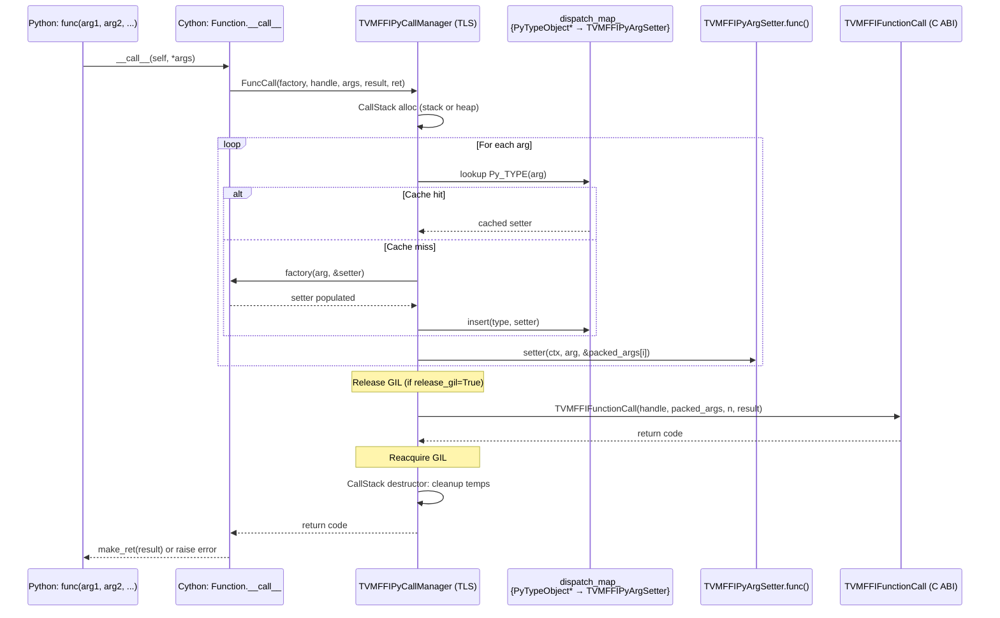

# Python FFI Call Dispatch

**TL;DR**
- The Python FFI call dispatch system replaces the original `make_args()` isinstance-chain with a C++ `TVMFFIPyCallManager` that caches `PyTypeObject* -> TVMFFIPyArgSetter` mappings in a thread-local hash map, achieving O(1) argument conversion after the first call per type.
- A DLPack "speed-converter" protocol based on `DLPackExchangeAPI` struct enables zero-Python-overhead tensor conversion between frameworks (e.g., torch) via a single `__dlpack_c_exchange_api__` class attribute containing a pointer to a struct with five function pointers.
- Additional duck-typing protocols (`__tvm_ffi_object__`, `__cuda_stream__`, `__tvm_ffi_opaque_ptr__`) enable custom Python objects to be passed efficiently through FFI calls as objects, streams, or opaque pointers respectively.
- Nested container conversion (tuple/list/dict) is handled entirely in Cython/C++ via dedicated per-type setters and a `TVMFFIPyConstructorCall` variant that propagates stream/device/allocator context upward from child calls.

## Problem Statement

### Background
- The prior Python-to-C++ call path used `make_args()` -- a Cython function containing a linear isinstance chain that tested every argument against all known types in order. For n argument types, each argument incurred O(n) type checks.
- DLPack tensor conversion went through Python's `__dlpack__` protocol, involving Python method calls and GIL overhead even when the source and destination were both C-level objects.
- Container arguments (list, dict, tuple) were converted via a Python callback (`_FUNC_CONVERT_TO_OBJECT`), losing CUDA stream context for nested tensors and adding Python-level overhead.
- String/bytes arguments were passed as raw `kTVMFFIRawStr`/`kTVMFFIByteArrayPtr` intermediates, requiring promotion at the C++ layer.

### Solution
- A thread-local `TVMFFIPyCallManager` singleton holds a hash map `PyTypeObject* -> TVMFFIPyArgSetter`. On first encounter of a type, a factory function determines the setter; subsequent calls are O(1) lookups.
- DLPack speed-converters bypass Python's `__dlpack__`/`from_dlpack` entirely by calling C function pointers stored on the tensor type object.
- Each Python type gets a dedicated Cython setter (strings, bytes, tuples, lists, dicts, ObjectConvertible, etc.), with recursive container setters calling `TVMFFIPyConstructorCall` to build Array/Map objects while propagating stream context.
- Two new C ABI functions (`TVMFFIStringFromByteArray`, `TVMFFIBytesFromByteArray`) construct String/Bytes objects directly, bypassing the `kTVMFFIRawStr` intermediate.

### Goals
- **Goal**: O(1) amortized argument conversion cost per call.
- **Goal**: Zero-Python-overhead tensor conversion for frameworks that register speed-converter function pointers.
- **Goal**: Correct CUDA stream propagation through nested containers.
- **Goal**: Per-function GIL release control for latency-sensitive short calls.
- **Non-goal**: Not a general Python-C++ call framework; specifically targets the TVM FFI packed calling convention.

## Design




### Key Classes, Fields and Interfaces

**`TVMFFIPyCallStack`** (Cython, standalone class, refactored in 3dd7a81 from nested `CallStack`):
```cpp
class TVMFFIPyCallStack {
  std::vector<TVMFFIAny> args_stack;                    // shared argument buffer
  int64_t args_stack_top;                                // allocation watermark
  std::vector<PyObject*> extra_temp_py_objects_stack;    // overflow for value protocol temps
};
```

**`TVMFFIPyCallContext`** (Cython, RAII guard, refactored in 3dd7a81) -- per-call state:
```cpp
struct TVMFFIPyCallContext {
  TVMFFIAny* packed_args;            // argument array (stack or heap)
  int device_type = -1;              // detected device, -1 = unset
  int device_id = 0;
  void* stream = nullptr;            // detected CUDA stream
  const DLPackExchangeAPI* dlpack_c_exchange_api{nullptr};  // (renamed in 5393647)
  TVMFFIPyCallStack* call_stack;     // borrows from thread-local stack
  void** temp_ffi_objects;           // temp FFI objects for RAII DecRef
  int num_temp_ffi_objects;
  void** temp_py_objects;            // temp Python objects for RAII Py_DecRef
  int num_temp_py_objects;
  DLPackToPyObject c_dlpack_to_pyobject{nullptr};   // return-value converter
  DLPackTensorAllocator c_dlpack_tensor_allocator{nullptr};  // env allocator
};
```

**`TVMFFIPyArgSetter`** (C++, `tvm_ffi_python_helpers.h`) -- per-type dispatch entry:
```cpp
struct TVMFFIPyArgSetter {
  int (*func)(TVMFFIPyArgSetter* self, TVMFFIPyCallContext* ctx,
              PyObject* arg, TVMFFIAny* out);
  const DLPackExchangeAPI* dlpack_c_exchange_api{nullptr};  // renamed from c_dlpack_exchange_api in 5393647
  int operator()(TVMFFIPyCallContext* ctx, PyObject* arg, TVMFFIAny* out) const;
};
```
```

**`TVMFFIPyArgSetterFactory`** (C++ typedef):
```cpp
typedef int (*TVMFFIPyArgSetterFactory)(PyObject* arg, TVMFFIPyArgSetter* out);
```
Called on cache miss. Inspects the argument's Python type and populates a setter struct.

**`TVMFFIPyCallManager`** (C++, thread-local singleton):
```cpp
class TVMFFIPyCallManager {
public:
  static TVMFFIPyCallManager* ThreadLocal();  // thread_local static instance
  int FuncCall(TVMFFIPyArgSetterFactory, void* func_handle, PyObject* py_arg_tuple,
               TVMFFIAny* result, int* ret_code, bool release_gil = true,
               DLPackToPyObject* optional_out_dlpack_importer = nullptr);
  int ConstructorCall(TVMFFIPyArgSetterFactory, void* func_handle, PyObject* py_arg_tuple,
                      TVMFFIAny* result, int* ret_code, TVMFFIPyCallContext* parent_ctx);
  int SetField(TVMFFIPyArgSetterFactory, TVMFFIFieldSetter, void*, PyObject*, int*);
  int PyObjectToFFIAny(TVMFFIPyArgSetterFactory, PyObject*, TVMFFIAny*, int*);
  size_t GetDispatchMapSize();
private:
  class CallStack : public TVMFFIPyCallContext { /* RAII workspace */ };
  std::unordered_map<PyTypeObject*, TVMFFIPyArgSetter> dispatch_map_;
};
```

**DLPack exchange API** -- all function pointers are now bundled in the `DLPackExchangeAPI` struct (see [0017-dlpack-interop.md](0017-dlpack-interop.md)):
```cpp
// Exposed as a single int64_t on tensor classes:
// torch.Tensor.__dlpack_c_exchange_api__ = reinterpret_cast<int64_t>(struct_ptr)
typedef struct {
    DLPackExchangeAPIHeader header;
    DLPackManagedTensorAllocator managed_tensor_allocator;
    DLPackManagedTensorFromPyObjectNoSync managed_tensor_from_py_object_no_sync;
    DLPackManagedTensorToPyObjectNoSync managed_tensor_to_py_object_no_sync;
    DLPackDLTensorFromPyObjectNoSync dltensor_from_py_object_no_sync;
    DLPackCurrentWorkStream current_work_stream;
} DLPackExchangeAPI;
```

**Environment tensor allocator C API** (in `extra/c_env_api.h`):
| Function | Signature | Purpose |
|----------|-----------|---------|
| `TVMFFIEnvSetDLPackManagedTensorAllocator` | `(DLPackManagedTensorAllocator, int write_to_global, DLPackManagedTensorAllocator* opt_out) -> int` | Set TLS (and optionally global) tensor allocator |
| `TVMFFIEnvGetDLPackManagedTensorAllocator` | `() -> DLPackManagedTensorAllocator` | Get tensor allocator (TLS first, then global fallback) |
| `TVMFFIEnvTensorAlloc` | `(DLTensor* prototype, TVMFFIObjectHandle* out) -> int` | Allocate tensor with metadata inside libtvm_ffi |

**String/Bytes C API** (in `c_api.h`):
```c
int TVMFFIStringFromByteArray(const TVMFFIByteArray* input, TVMFFIAny* out);
int TVMFFIBytesFromByteArray(const TVMFFIByteArray* input, TVMFFIAny* out);
```
Both construct String/Bytes values (small-string-optimized when length <= 7), replacing the `kTVMFFIRawStr`/`kTVMFFIByteArrayPtr` passthrough in Cython setters.

**`TVMFFIPyConstructorCall`** (C++ inline, for nested container conversion):
```cpp
int TVMFFIPyConstructorCall(
    TVMFFIPyArgSetterFactory setter_factory,
    void* func_handle,
    PyObject* py_arg_tuple,
    TVMFFIAny* result,
    int* c_api_ret_code,
    TVMFFIPyCallContext* parent_ctx
);
```
Like `TVMFFIPyFuncCall` but does NOT release the GIL and propagates device/stream/DLPack allocator context from child call back to `parent_ctx`.

**Cython setter catalog** (registered via `TVMFFIPyArgSetterFactory_`):

| Setter | Type | Behavior |
|--------|------|----------|
| `TVMFFIPyArgSetterInt_` | `int` (C++) | Direct int64 assignment |
| `TVMFFIPyArgSetterFloat_` | `float` (C++) | Direct float64 assignment |
| `TVMFFIPyArgSetterBool_` | `bool` (C++) | Direct bool assignment |
| `TVMFFIPyArgSetterNone_` | `NoneType` (C++) | Sets kTVMFFINone |
| `TVMFFIPyArgSetterStr_` | `str` (Cython) | Calls `TVMFFIStringFromByteArray` |
| `TVMFFIPyArgSetterBytes_` | `bytes` (Cython) | Calls `TVMFFIBytesFromByteArray` |
| `TVMFFIPyArgSetterTensor_` | `Tensor` (Cython) | Direct object ref |
| `TVMFFIPyArgSetterObject_` | `Object` subclass (Cython) | Direct object ref |
| `TVMFFIPyArgSetterFFIObjectProtocol_` | has `__tvm_ffi_object__` (Cython) | Extract inner Object, dynamic type index (4bc8925, 8873700, renamed c1df05f) |
| `TVMFFIPyArgSetterDLPackExchangeAPI_` | has `__dlpack_c_exchange_api__` (Cython) | Reads struct, calls `managed_tensor_from_py_object_no_sync` (22a7894) |
| `TVMFFIPyArgSetterCUDAStreamProtocol_` | has `__cuda_stream__` (Cython) | Extracts `(str, int)` tuple, packs as `kTVMFFIOpaquePtr` (b0537f0, renamed 6c85e56) |
| `TVMFFIPyArgSetterCUDADriverStreamFallback_` | `cuda.bindings.driver.CUstream` (Cython) | Fallback for CUstream without `__cuda_stream__` protocol; casts `int(arg)` to `kTVMFFIOpaquePtr` (6c85e56) |
| `TVMFFIPyArgSetterIntegral_` | `numbers.Integral` subclass (Cython) | Handles `np.int32` etc. via Cython `<long long>` cast (c1df05f) |
| `TVMFFIPyArgSetterReal_` | `numbers.Real` subclass (Cython) | Handles `np.float64` etc. via Cython `<double>` cast (c1df05f) |
| `TVMFFIPyArgSetterIntProtocol_` | has `__tvm_ffi_int__` (Cython) | Calls `arg.__tvm_ffi_int__()`, sets `kTVMFFIInt` (c1df05f) |
| `TVMFFIPyArgSetterFloatProtocol_` | has `__tvm_ffi_float__` (Cython) | Calls `arg.__tvm_ffi_float__()`, sets `kTVMFFIFloat` (c1df05f) |
| `TVMFFIPyArgSetterFFIValueProtocol_` | has `__tvm_ffi_value__` (Cython, 3dd7a81) | Calls `arg.__tvm_ffi_value__()`, pushes result to `extra_temp_py_objects_stack`, recursively dispatches via `TVMFFIPySetArgumentGenericDispatcher` |
| `TVMFFIPyArgSetterDLPack_` | has `__dlpack__` (Cython) | Python protocol fallback |
| `TVMFFIPyArgSetterTorchFallback_` | `torch.Tensor` w/o speed-converter (Cython) | Stream capture + DLPack |
| `TVMFFIPyArgSetterFFIOpaquePtrCompatible_` | has `__tvm_ffi_opaque_ptr__` (Cython) | Extract int as `kTVMFFIOpaquePtr` (42e0612) |
| `TVMFFIPyArgSetterDType_` | `DLDataType` (Cython) | Direct dtype copy |
| `TVMFFIPyArgSetterDevice_` | `Device` (Cython) | Direct device copy |
| `TVMFFIPyArgSetterTuple_` | `tuple` (Cython) | Recursive `ffi.Array` via `TVMFFIPyConstructorCall` |
| `TVMFFIPyArgSetterTupleLike_` | `list` (Cython) | Convert to tuple, then `ffi.Array` |
| `TVMFFIPyArgSetterMap_` | `dict` (Cython) | Flatten to (k,v,...) tuple, then `ffi.Map` |
| `TVMFFIPyArgSetterObjectConvertible_` | `ObjectConvertible` (Cython) | Calls `.asobject()` |
| `TVMFFIPyArgSetterCallable_` | callable (Cython) | Wraps as Function |
| `TVMFFIPyArgSetterPyNativeObjectStr_` | `PyNativeObject & str` (Cython) | Check `__tvm_ffi_object__` first |
| `TVMFFIPyArgSetterPyNativeObjectBytes_` | `PyNativeObject & bytes` (Cython) | Check `__tvm_ffi_object__` first |
| `TVMFFIPyArgSetterPyNativeObjectGeneral_` | `PyNativeObject` (Cython) | Requires `__tvm_ffi_object__` |
| `TVMFFIPyArgSetterObjectRValueRef_` | `ObjectRValueRef` (Cython) | Move semantics |
| `TVMFFIPyArgSetterDLPackDataTypeProtocol_` | has `__dlpack_data_type__` (Cython) | Protocol: `__dlpack_data_type__() -> tuple[int,int,int]` -> `DLDataType{code,bits,lanes}`. Dispatched after `numpy.dtype`, before `Exception`. (5e648f0) |
| `TVMFFIPyArgSetterDLPackDeviceProtocol_` | has `__dlpack_device__` AND NOT `__dlpack__` (Cython) | Protocol: `__dlpack_device__() -> tuple[int,int]` -> `Device{device_type,device_id}`. Guard excludes tensor-like objects. Dispatched after `__dlpack_data_type__`, before `Exception`. (0f8bf9f) |
| `TVMFFIPyArgSetterException_` | `Exception` (Cython) | Wraps as Error |
| `TVMFFIPyArgSetterCtypesVoidPtr_` | `ctypes.c_void_p` (Cython) | Raw pointer |
| `TVMFFIPyArgSetterFallback_` | anything else (Cython) | OpaquePyObject wrap |

**Python `Function.release_gil` property**:
```python
func.release_gil: bool  # default True; controls GIL release during FFI call
# Global default: TVM_FFI_RELEASE_GIL_BY_DEFAULT env var (default "1")
```

**Python dunder protocols for type dispatch**:
- `__dlpack_c_exchange_api__: int` -- pointer to `DLPackExchangeAPI` struct (as int64), bundles all DLPack conversion function pointers. Replaces the previous three separate attributes (`__c_dlpack_from_pyobject__`, `__c_dlpack_to_pyobject__`, `__c_dlpack_tensor_allocator__`).
- `__tvm_ffi_object__() -> tvm_ffi.Object` -- duck-typing protocol for objects wrapping an FFI Object. The setter dynamically queries the type index via `TVMFFIObjectGetTypeIndex` to support any Object subclass, not just Tensor. Dispatched before `__dlpack_c_exchange_api__` in the factory chain. (4bc8925 introduced as `__tvm_ffi_tensor__`, renamed in 8873700)
- `__cuda_stream__() -> tuple[str, int]` -- NVIDIA CUDA stream protocol. The int element is packed as `kTVMFFIOpaquePtr`. Dispatched after `__dlpack_c_exchange_api__`. (b0537f0, with backward-compat monkey-patch for older PyTorch in 80bd4d8)
- `__tvm_ffi_opaque_ptr__() -> int` -- opaque `void*` pointer protocol. Packed as `kTVMFFIOpaquePtr`. Dispatched after `ctypes.c_void_p`, before `callable`. (42e0612)
- `__dlpack_data_type__() -> tuple[int, int, int]` -- DLPack data type protocol for dtype ingestion. Returns `(type_code, bits, lanes)` tuple, auto-converted to `DLDataType`. Dispatched after `numpy.dtype`, before `Exception`. Complements `dtype.from_dlpack_data_type()` static factory method. (5e648f0)
- `__dlpack_device__() -> tuple[int, int]` -- DLPack device protocol for non-tensor device objects. Returns `(device_type, device_id)` tuple, auto-converted to `Device`. Guard: `hasattr(cls, "__dlpack_device__") and not hasattr(cls, "__dlpack__")` prevents tensor-like objects from being misclassified. Dispatched after `__dlpack_data_type__`, before `Exception`. (0f8bf9f)
- `__tvm_ffi_int__(self) -> int` -- duck-typing protocol for custom integer types. Classes implementing this method can be passed as `kTVMFFIInt` to FFI functions. Dispatched for types not recognized as exact `int`, `numbers.Integral`, etc. (c1df05f)
- `__tvm_ffi_float__(self) -> float` -- duck-typing protocol for custom float types. Classes implementing this method can be passed as `kTVMFFIFloat` to FFI functions. Dispatched alongside `__tvm_ffi_int__`. (c1df05f)
- `__tvm_ffi_value__(self) -> Any` -- generic value conversion protocol (3dd7a81). Classes implementing this method can declare how they convert to FFI-compatible values. The returned value undergoes **full recursive dispatch** through `TVMFFIPySetArgumentGenericDispatcher` -- it can return another `__tvm_ffi_value__` object, a list, an int, etc. Dispatched after `__tvm_ffi_float__`, before `Exception`.

### Contracts, Assumptions and Invariants
- **Thread-local singleton**: `TVMFFIPyCallManager` is thread-local. The dispatch map is never shared across threads, so no locking is needed for the cache.
- **Type keep-alive for cache safety**: A module-level `_DISPATCH_TYPE_KEEP_ALIVE` set (guarded by `threading.Lock`) in `TVMFFIPyArgSetterFactory_` holds strong references to every type registered through the dispatcher. This prevents GC-based address reuse that could cause the `dispatch_map_` to return wrong setters. The set grows monotonically (cfff30b).
- **CallStack RAII**: `CallStack` extends `TVMFFIPyCallContext`. For small arg counts, packed_args is a stack-allocated array; for large counts, heap-allocated. The destructor calls `TVMFFIObjectDecRef` on all temp FFI objects and `Py_DecRef` on all temp Python objects.
- **GIL release boundary**: The GIL is released just before `TVMFFIFunctionCall` and reacquired just after. This is controlled per-function via `release_gil`. `ConstructorCall` does NOT release the GIL because it runs inside an already-GIL-released section.
- **Stream context propagation**: When a `__dlpack_c_exchange_api__`-compatible argument is encountered, its stream is captured via the `current_work_stream` callback (if present in the struct) and set via `TVMFFIEnvSetStream` before the C ABI call. The tensor allocator (`managed_tensor_allocator`) is similarly set via `TVMFFIEnvSetDLPackManagedTensorAllocator`. Both are restored after the call.
- **Nested call context propagation**: `ConstructorCall` propagates `c_dlpack_to_pyobject` and `c_dlpack_tensor_allocator` from the child `CallStack` to `parent_ctx`, enabling nested container conversion to discover the correct return-value converter and allocator.
- **Return value auto-conversion**: If `c_dlpack_to_pyobject` was discovered during argument processing, the returned Tensor is automatically converted back to the source framework's tensor type (e.g., `torch.Tensor`) via the importer function pointer. This happens in `make_ret` (Cython) when the out_dlpack_importer is non-null.
- **Failure mode -- factory returns -1**: If the setter factory cannot determine a setter for a type, it returns -1. The call fails with an error propagated through the standard TLS mechanism.
- **Failure mode -- DLPack speed-converter fails**: If a `DLPackFromPyObject` function returns -1 with `PyErr` set, the setter falls back to the Python `__dlpack__` protocol. This is not automatic -- the error propagates. The `TVM_FFI_SKIP_c_dlpack_from_pyobject` env var can disable the fast path entirely.
- **Temp object recycling correctness**: Temp FFI objects are cleaned up via `TVMFFIObjectDecRef` (not the object's deleter directly), ensuring reference-count bookkeeping is correct even for multiply-referenced objects.

### Extension Points
- **New setter types**: Add a new `TVMFFIPyArgSetterXXX_` function and register it in `TVMFFIPyArgSetterFactory_` for new Python types.
- **Custom DLPack speed-converters**: Any Python type can opt in by setting `__dlpack_c_exchange_api__` to a `DLPackExchangeAPI` struct pointer (as int64). See [0017-dlpack-interop.md](0017-dlpack-interop.md) for the struct layout and implementation guide.
- **Custom object wrappers**: Implement `__tvm_ffi_object__() -> tvm_ffi.Object` on any class to enable transparent FFI pass-through for wrapper objects.
- **Custom opaque pointers**: Implement `__tvm_ffi_opaque_ptr__() -> int` on any class to pass C struct pointers through FFI.
- **CUDA stream pass-through**: Implement `__cuda_stream__() -> tuple[str, int]` to pass stream handles.

### Usage Examples

#### End-to-end: Python call through type-cached dispatch
**Context**: Calling an FFI function with mixed argument types. First call populates the cache; subsequent calls are O(1).
```python
import tvm_ffi

func = tvm_ffi.get_global_func("testing.echo")

# First call: cache miss for int, str, Tensor types
# factory_ inspects each arg's type, populates setter cache
result = func(42, "hello", tvm_ffi.Tensor.from_numpy(np.zeros(3)))

# Subsequent calls with same types: O(1) lookup per arg
result = func(100, "world", tvm_ffi.Tensor.from_numpy(np.ones(3)))
```

#### DLPack exchange API with torch tensors
**Context**: When the torch C DLPack extension is loaded, `torch.Tensor` arguments bypass Python's `__dlpack__` protocol entirely via the `DLPackExchangeAPI` struct.
```python
import torch
import tvm_ffi

# The _optional_torch_c_dlpack extension auto-sets:
# torch.Tensor.__dlpack_c_exchange_api__ = <pointer to DLPackExchangeAPI struct>

func = tvm_ffi.get_global_func("my_kernel")
x = torch.randn(100, device="cuda")

# Argument conversion: struct->managed_tensor_from_py_object_no_sync (C fn ptr)
# Return conversion: struct->managed_tensor_to_py_object_no_sync (C fn ptr)
y = func(x)  # y is a torch.Tensor, not tvm_ffi.Tensor
```

#### __tvm_ffi_object__ protocol for wrapper objects
**Context**: Wrapping an FFI Object in a custom Python class while still passing it through FFI calls.
```python
class MyObjectWrapper:
    def __init__(self, obj: tvm_ffi.Object) -> None:
        self._obj = obj
    def __tvm_ffi_object__(self) -> tvm_ffi.Object:
        return self._obj

pair = tvm_ffi.testing.TestIntPair(1, 2)
wrapper = MyObjectWrapper(pair)
fecho = tvm_ffi.get_global_func("testing.echo")
result = fecho(wrapper)  # auto-dispatched via __tvm_ffi_object__
assert result.a == 1
```

#### __tvm_ffi_opaque_ptr__ protocol for opaque C pointers
**Context**: Passing an opaque C struct pointer through the FFI.
```python
class MyOpaqueHandle:
    def __init__(self, ptr: int) -> None:
        self._ptr = ptr
    def __tvm_ffi_opaque_ptr__(self) -> int:
        return self._ptr

fecho = tvm_ffi.get_global_func("testing.echo")
x = MyOpaqueHandle(0xDEADBEEF)
y = fecho(x)  # passes as kTVMFFIOpaquePtr
```

#### __tvm_ffi_value__ protocol for generic value conversion
**Context**: Converting a custom Python object to an FFI-compatible value. The returned value undergoes full recursive dispatch, so it can return lists, ints, or other __tvm_ffi_value__ objects.
```python
class MyPoint:
    def __init__(self, x, y):
        self.x, self.y = x, y

    def __tvm_ffi_value__(self):
        return [self.x, self.y]  # converts to Array when passed to FFI

fecho = tvm_ffi.get_global_func("testing.echo")
result = fecho(MyPoint(1, 2))  # passes [1, 2] to FFI
```

#### Nested container argument conversion
**Context**: Passing nested Python containers through FFI. The Cython setters recursively convert, preserving CUDA stream context.
```python
import tvm_ffi

fecho = tvm_ffi.get_global_func("testing.echo")

# list/dict args are recursively converted in Cython via
# TVMFFIPyArgSetterTupleLike_ -> TVMFFIPyConstructorCall(ffi.Array)
# TVMFFIPyArgSetterMap_ -> TVMFFIPyConstructorCall(ffi.Map)
obj = tvm_ffi.convert((1, 2, 3))
y = fecho([obj, {"a": 1, "b": obj}])
# Stream context propagates through nested conversions
```

#### Controlling GIL release for short calls
**Context**: For very short FFI functions, the GIL release/reacquire overhead dominates. Disabling it for such calls improves latency.
```python
func = tvm_ffi.get_global_func("testing.nop")
func.release_gil = False  # don't release GIL for short calls
func()  # faster for sub-microsecond functions
```

### Evolution Timeline

| Commit | Change |
|--------|--------|
| `38d2cda` | Initial type-cached dispatch: `TVMFFIPyCallManager`, `TVMFFIPyArgSetter`, `TVMFFIPyCallContext`, `__dlpack_c_exporter__` protocol |
| `f81ab9c` | DLPack speed-converter protocol formalized: `DLPackPyObjectExporter/Importer`, `DLPackTensorAllocator`, per-function `release_gil`, `EnvContext` |
| `4dee97f` | Rename to data-flow naming: `DLPackFromPyObject`/`DLPackToPyObject`, `__c_dlpack_from_pyobject__`/`__c_dlpack_to_pyobject__` |
| `043d9f6` | String/Bytes C API, `TVMFFIPyConstructorCall` for nested containers, per-type setters |
| `4bc8925` | `__tvm_ffi_tensor__` protocol and `TVMFFIPyArgSetterFFITensorCompatible_` for Tensor wrapper objects |
| `8873700` | Rename `__tvm_ffi_tensor__` -> `__tvm_ffi_object__`, generalize from Tensor-only to any Object; rename internal `__tvm_ffi_object__` attr to `_tvm_ffi_cached_object` |
| `b0537f0` | `__cuda_stream__` protocol and `TVMFFIPyArgSetterCUDAStream_`; fix `__dlpack__` check to class-level |
| `22a7894` | Replace three separate dunder attributes with single `__dlpack_c_exchange_api__` (DLPackExchangeAPI struct) |
| `42e0612` | `__tvm_ffi_opaque_ptr__` protocol and `TVMFFIPyArgSetterFFIOpaquePtrCompatible_` |
| `5e648f0` | `__dlpack_data_type__` protocol: dtype ingestion from any object with 3-tuple method; `dtype.from_dlpack_data_type()` factory |
| `0f8bf9f` | `__dlpack_device__` protocol: device ingestion from non-tensor objects with 2-tuple method; `not hasattr(__dlpack__)` guard |
| `e6a85e9` | Fix Cython `c_handle` to handle `ctypes.c_void_p(0)` returning `None` |
| `6c85e56` | CUDAStream setter renamed to `CUDAStreamProtocol_`; new `CUDADriverStreamFallback_` for `cuda.bindings.driver.CUstream` |
| `c1df05f` | `__tvm_ffi_int__`/`__tvm_ffi_float__` protocols; dedicated `Integral_`/`Real_` setters; `FFIObjectCompatible_` -> `FFIObjectProtocol_` rename |
| `5a87749` | Torch fallback device tracking bug fix; dtype return type unified via `make_dtype_from_dl_data_type`; `convert()` protocol awareness |
| `3dd7a81` | `__tvm_ffi_value__` protocol; `TVMFFIPyCallStack`/`TVMFFIPyCallContext` refactored to standalone classes; `TVMFFIPySetArgumentGenericDispatcher` |
| `5393647` | Rename `__c_dlpack_exchange_api__` -> `__dlpack_c_exchange_api__` with backward compat |

## Alternatives & Trade-offs
### Linear isinstance chain (status quo ante)
- Pros: Simple, no cache state, deterministic behavior.
- Cons: O(n) per argument per call, where n is the number of registered types. For hot paths (e.g., calling kernels millions of times), this dominates. The profiled bottleneck in the original code.

### Python-level type dispatch (singledispatch or dict lookup)
- Pros: Stays in Python, no C++ code needed.
- Cons: Still incurs Python overhead per argument. The C++ hash map lookup avoids Python dictionary overhead and integrates with the GIL release boundary.

## Related Work
### Design Docs & ADRs
- [0014-python-package.md](../designs/0014-python-package.md) -- Python package structure; Cython binding layer
- [0001-c-abi-layer.md](../designs/0001-c-abi-layer.md) -- C ABI calling convention used by the dispatch system
- [0004-function-system.md](../designs/0004-function-system.md) -- FunctionObj and packed calling convention
- [0011-small-string-optimization.md](../designs/0011-small-string-optimization.md) -- SSO used by TVMFFIStringFromByteArray
- [0008-containers.md](../designs/0008-containers.md) -- Array/Map constructors called by nested container setters
- [0016-type-cached-ffi-dispatch.md](../ADRs/0016-type-cached-ffi-dispatch.md) -- ADR for replacing isinstance chain with cached dispatch

### Evidence Matrix
- TVMFFIPyCallManager, type-cached dispatch -> `2025-09-11-38d2cdaa.md` (38d2cda)
- DLPack speed-converters, release_gil -> `2025-09-12-f81ab9c2.md` (f81ab9c)
- `__tvm_ffi_object__` protocol (generalized from `__tvm_ffi_tensor__`) -> `4bc892542b93.md` (4bc8925) + `8873700a87d0.md` (8873700)
- `__cuda_stream__` protocol -> `b0537f045b30.md` (b0537f0)
- `DLPackExchangeAPI` struct replacing three attrs -> `22a78943b783.md` (22a7894)
- `__tvm_ffi_opaque_ptr__` protocol -> `42e0612838b2.md` (42e0612)
- `__dlpack_data_type__` protocol, `dtype.from_dlpack_data_type` factory -> `2025-10-20-5e648f05.md` (5e648f0)
- `__dlpack_device__` protocol for non-tensor objects -> `2025-10-20-0f8bf9fc.md` (0f8bf9f)
- `__tvm_ffi_int__`/`__tvm_ffi_float__` protocols, Integral/Real setters -> `2025-11-08-c1df05f3555d4e2a9e1a32822c0f41ccb8467251.md` (c1df05f)
- CUDADriverStreamFallback_, CUDAStreamProtocol_ rename -> `2025-11-07-6c85e562c00f098743ed257ff4516a250f5145e7.md` (6c85e56)
- ctypes.c_void_p(0) fix -> `2025-11-07-e6a85e9cbc4e2d0b8f414a2dfda051f4c37bb1a1.md` (e6a85e9)
- `__tvm_ffi_value__` protocol + call stack refactoring -> `2025-12-04-3dd7a817.md` (3dd7a81)
- DLPack attribute rename `__c_dlpack_exchange_api__` -> `__dlpack_c_exchange_api__` -> `2025-12-05-53936472.md` (5393647)
- Plus 5 supporting commits (container setters, DLPack rename, CUDA-only fix, torch stream patch, torch fallback fix)
