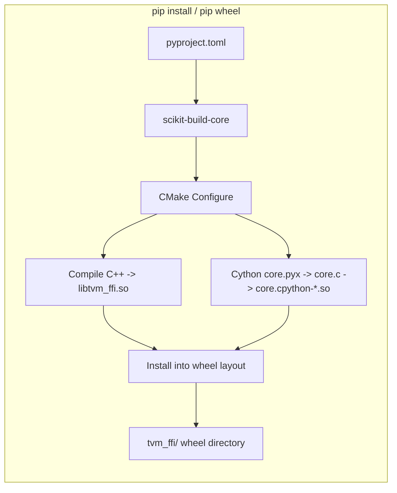

# Python Packaging Architecture Design

**TL;DR**:
- The `tvm_ffi` Python package is distributed as `apache-tvm-ffi`, a standalone pip-installable wheel with zero Python dependencies, built by `scikit-build-core` with Cython compilation and C++ shared library bundling.
- Library discovery (`libinfo.py`), a CLI tool (`tvm-ffi-config`), and a CMake config file (`tvm_ffi-config.cmake`) enable downstream C++ projects to locate headers, libraries, and cmake configs via `find_package(tvm_ffi)`.
- The CMake build supports dual-mode operation: standalone project (builds tests, Python module, wheel) and subdirectory inclusion (exports library targets only).

## Problem Statement
### Background
- The TVM FFI is a foundational library consumed by the main TVM compiler, downstream ML tools, and user-written kernel libraries. Previously, the FFI was not independently installable -- it was embedded inside the monolithic TVM package.
- Downstream C++ projects need to find the FFI's headers and shared library at CMake configure time, but the FFI is installed as a Python package (not in system paths).
- The build must compile both C++ source and Cython extensions in a single pass, producing a wheel that bundles everything.

### Solution
- Use `scikit-build-core` as the PEP 517 build backend to drive CMake compilation of both C++ and Cython code.
- Bundle the C++ shared library, headers, dlpack headers, cmake config, and Cython extension inside the wheel.
- Provide `libinfo.py` for Python-side path resolution and `tvm_ffi-config.cmake` for CMake-side path resolution (calls `python -m tvm_ffi.config`).
- Guard standalone-only CMake logic behind `if (NOT ${PROJECT_NAME} STREQUAL ${CMAKE_PROJECT_NAME})`.

### Goals
- Zero Python dependencies: the wheel contains only the compiled extension and shared library.
- `pip install apache-tvm-ffi` gives a working package with immediate Python usability.
- Downstream C++ projects can use `find_package(tvm_ffi CONFIG)` to discover includes and link targets.
- Support Stable ABI (Python 3.12+) for forward compatibility.
- Non-goals: conda-forge packaging; pre-built CUDA kernels in the wheel.

## Design

### Build Pipeline



### pyproject.toml Structure

```toml
[project]
name = "apache-tvm-ffi"
dynamic = ["version"]  # version derived from git tags via setuptools_scm (since ac63fb9)
requires-python = ">=3.8"
dependencies = []  # zero runtime dependencies

[build-system]
requires = ["scikit-build-core>=0.10.0", "cython", "cmake>=3.18", "ninja", "setuptools-scm"]
build-backend = "scikit_build_core.build"

[tool.scikit-build]
metadata.version.provider = "scikit_build_core.metadata.setuptools_scm"

[tool.setuptools_scm]
version_file = "python/tvm_ffi/_version.py"
write_to = "python/tvm_ffi/_version.py"

[tool.scikit-build]
wheel.py-api = "cp312"                    # Stable ABI target
cmake.args = ["-DTVM_FFI_BUILD_PYTHON_MODULE=ON"]
wheel.packages = ["python/tvm_ffi"]       # source location
wheel.install-dir = "tvm_ffi"             # destination in wheel
```

Key configuration:
- **`wheel.py-api = "cp312"`**: Targets the Python Stable ABI (PEP 384). On Python 3.12+, the Cython extension uses `USE_SABI 3.12` in CMake, producing an `abi3` wheel that works on all Python 3.12+ versions. On older Python, falls back to version-specific `WITH_SOABI`.
- **`cmake.args`**: Enables `TVM_FFI_BUILD_PYTHON_MODULE=ON` which triggers Cython compilation and Python install rules.
- **`wheel.packages/install-dir`**: Maps `python/tvm_ffi/` source directory to `tvm_ffi/` in the wheel.

### Wheel Directory Layout

```
tvm_ffi/
    __init__.py
    registry.py, error.py, convert.py, ...  (pure Python)
    core.cpython-312-*.so                   (Cython extension)
    lib/
        libtvm_ffi.so                       (C++ shared library)
    share/cmake/tvm_ffi/
        tvm_ffi-config.cmake                (CMake config, standard search path since df04392)
        Utils/Library.cmake                 (CMake utilities)
    include/
        tvm/ffi/*.h                         (C++ headers)
        dlpack/*.h                          (DLPack headers)
    cmake/                                  (CMake utility modules)
    src/                                    (packaged C++ source)
```

### CMake Dual-Mode Operation

The root `CMakeLists.txt` supports two modes:

```cmake
# Subproject guard: when included as add_subdirectory(), skip standalone-only logic
if (NOT ${PROJECT_NAME} STREQUAL ${CMAKE_PROJECT_NAME})
    return()
endif()
```

**Standalone mode** (building the wheel):
- `TVM_FFI_BUILD_PYTHON_MODULE=ON`: enables Cython compilation, `Python_add_library`, install rules.
- `TVM_FFI_BUILD_TESTS=ON`: builds GoogleTest test executable.
- `TVM_FFI_ATTACH_DEBUG_SYMBOLS=ON`: adds `-g1` for lightweight debug info.
- Sets warning flags, sanitizers, etc.

**Subdirectory mode** (included by another CMake project):
- Only exports `tvm_ffi_shared` and `tvm_ffi_static` targets.
- No Python, test, or install logic.

### CMake Import Target Namespacing (since a1cb7462)

The CMake config file (`tvm_ffi-config.cmake`) exports targets under the `tvm_ffi::` namespace following CMake convention for imported targets:

| Target | Type | Description |
|--------|------|-------------|
| `tvm_ffi::header` | `INTERFACE IMPORTED` | Header-only target: adds include directories and `cxx_std_17` compile feature |
| `tvm_ffi::shared` | `SHARED IMPORTED` | Shared library target: sets `IMPORTED_LOCATION` (or `IMPORTED_IMPLIB` on Windows) and include directories |

Note: The internal build tree still uses `tvm_ffi_shared`/`tvm_ffi_static`/`tvm_ffi_header` as non-imported targets. The `tvm_ffi::` namespace is only used in the installed config file and in `tvm_ffi_configure_target`. The `tvm_ffi_embed_cubin` function accepts both `tvm_ffi::header` and `tvm_ffi_header` for backward compatibility.

### CMake Function Namespacing

All CMake functions are prefixed with `tvm_ffi_` to avoid collisions when used as a subproject:
- `tvm_ffi_add_cxx_warning(target)` -- add compiler warnings
- `tvm_ffi_add_target_from_obj(name, srcs)` -- create target from object library
- `tvm_ffi_add_prefix_map()` -- add `-ffile-prefix-map` for reproducible builds

### CMake Integration Functions (since ccd19f82)

Two high-level CMake functions simplify downstream project integration:

#### `tvm_ffi_configure_target`
```cmake
tvm_ffi_configure_target(target_name
    [LINK_SHARED ON|OFF]    # Link tvm_ffi::shared (default: ON)
    [LINK_HEADER ON|OFF]    # Link tvm_ffi::header (default: ON)
    [DEBUG_SYMBOL ON|OFF]   # Apple dSYM generation (default: ON)
    [MSVC_FLAGS ON|OFF]     # MSVC-specific flags (default: ON)
    [STUB_DIR <dir>]        # Directory for Python stub generation
    [STUB_INIT ON|OFF]      # Enable --init-* mode (default: OFF)
    [STUB_PKG <pkg>]        # Python package name (requires STUB_INIT ON)
    [STUB_PREFIX <prefix>]  # Module prefix (requires STUB_INIT ON)
)
```

**Always-on behavior**: Calls `tvm_ffi_add_prefix_map(target, CMAKE_CURRENT_SOURCE_DIR)` for reproducible builds.

**STUB_DIR**: When set, adds a post-build step that invokes `python -m tvm_ffi.stub.cli <dir> --dlls <target_file>`. When `STUB_INIT=ON`, also passes `--init-lib`, `--init-pypkg`, `--init-prefix` flags for whole-package generation. `STUB_PKG` defaults to `SKBUILD_PROJECT_NAME` if set, otherwise the target name.

#### `tvm_ffi_install`
```cmake
tvm_ffi_install(target_name
    [DESTINATION <dir>]     # Install destination (default: ".")
)
```

On Apple platforms, installs the target's `.dSYM` bundle alongside the library (using `OPTIONAL` so it does not fail if absent). On other platforms, this is currently a no-op extension point for future PDB/DWARF packaging.

### Cython Compilation (CMake)

When `TVM_FFI_BUILD_PYTHON_MODULE=ON`:

```cmake
find_package(Python REQUIRED COMPONENTS Interpreter Development.Module)

# Cython -> C
add_custom_command(
    OUTPUT ${CMAKE_BINARY_DIR}/core.c
    COMMAND Python::Interpreter -m cython ${CMAKE_SOURCE_DIR}/python/tvm_ffi/cython/core.pyx
            -o ${CMAKE_BINARY_DIR}/core.c
    DEPENDS core.pyx *.pxi)

# C -> shared library
if(Python_VERSION VERSION_GREATER_EQUAL "3.12")
    Python_add_library(core MODULE USE_SABI 3.12 ${CMAKE_BINARY_DIR}/core.c)
else()
    Python_add_library(core MODULE WITH_SOABI ${CMAKE_BINARY_DIR}/core.c)
endif()

target_link_libraries(core PRIVATE tvm_ffi_shared)
```

### Library Discovery: libinfo.py

`libinfo.py` provides functions to locate installed components:

| Function | Returns | Search Strategy |
|----------|---------|-----------------|
| `find_libtvm_ffi()` | `str` (path to .so/.dylib/.dll) | Uses `importlib.metadata` to locate DSOs from installed package metadata (since 6887892d, replacing `__file__`-based path discovery); falls back to `tvm_ffi/lib/`, `../../build/lib/`, `LD_LIBRARY_PATH`/`DYLD_LIBRARY_PATH`/`PATH` |
| `find_include_path()` | `str` (include dir) | Checks `tvm_ffi/include/`, `../../include/` |
| `find_dlpack_include_path()` | `str` (dlpack include dir) | Checks `tvm_ffi/include/dlpack/`, `../../3rdparty/dlpack/include/` |
| `find_cmake_path()` | `str` (cmake config dir) | Checks `tvm_ffi/share/cmake/tvm_ffi/`, `../../cmake/` (relocated to standard search path in df04392) |
| `find_library_by_basename(base)` | `str` (library path) | Generalized library finder for any `libtvm_ffi_*` sibling library (since da7007f) |
| `load_lib_module(name)` | `Module` | Convenience: combines `find_library_by_basename` + `load_module(..., keep_module_alive=True)` (since f255650b) |
| `find_source_path()` | `str` (source root) | Checks for `cmake/` directory presence |
| `find_cython_lib()` | `str` (core.*.so path) | Globs `core*.so`/`core*.pyd` in package dir and build dir |
| `get_dll_directories()` | `list[str]` | All candidate directories for shared library search |

### CLI Tool: tvm-ffi-config

Installed as console script `tvm-ffi-config`. Provides flags for downstream build integration:

```bash
$ tvm-ffi-config --includedir      # -> /path/to/tvm_ffi/include
$ tvm-ffi-config --dlpack-includedir  # -> /path/to/dlpack/include
$ tvm-ffi-config --cmakedir        # -> /path/to/tvm_ffi/cmake
$ tvm-ffi-config --libfiles        # -> /path/to/libtvm_ffi.so
$ tvm-ffi-config --libdir          # -> /path/to/tvm_ffi/lib
$ tvm-ffi-config --cflags          # -> -I... -I... (C-only, no -std=c++17; added in c100338)
$ tvm-ffi-config --cxxflags        # -> -I... -I... -std=c++17
$ tvm-ffi-config --ldflags         # -> -L... -ltvm_ffi
$ tvm-ffi-config --cython-lib-path # -> /path/to/core.*.so
$ tvm-ffi-config --sourcedir       # -> /path/to/source
```

### CMake Config File: tvm_ffi-config.cmake

Installed to `tvm_ffi/share/cmake/tvm_ffi/tvm_ffi-config.cmake` (relocated to standard CMake search path in df04392). Includes `Utils/Library.cmake` for downstream access to `tvm_ffi_add_prefix_map` and `tvm_ffi_add_apple_dsymutil`. Enables `find_package(tvm_ffi CONFIG)` **without** the `execute_process` boilerplate that was previously needed:

```cmake
# Downstream projects just need:
find_package(Python COMPONENTS Interpreter REQUIRED)
find_package(tvm_ffi CONFIG REQUIRED)
# find_package(Python) adds sys.prefix to CMake search paths,
# and the config is at share/cmake/tvm_ffi/ under sys.prefix
```

### cibuildwheel Configuration

```toml
[tool.cibuildwheel]
build = ["cp38-*", "cp39-*", "cp310-*", "cp311-*", "cp312-*", "cp314t-*"]  # cp38 added in 5e2a0e5; cp314t added in 22c049b
skip = ["*musllinux*"]
# manylinux image selection moved to CI workflow matrix (since 997a366)
# Both manylinux2014 and manylinux_2_28 wheels are built
build-frontend = "build[uv]"
test-skip = ["cp39-*", "cp310-*", "cp311-*"]  # test only on cp312

[tool.cibuildwheel.linux]
archs = ["x86_64", "aarch64"]

[tool.cibuildwheel.macos]
archs = ["x86_64", "arm64"]
environment = { MACOSX_DEPLOYMENT_TARGET = "10.14" }

[tool.cibuildwheel.windows]
archs = ["AMD64"]
```

Builds wheels for Python 3.8-3.12 (plus 3.14t free-threaded), but tests only on cp312. The cp312 abi3 wheel serves all 3.12+ versions. Both manylinux2014 and manylinux_2_28 variants are built for Linux. Version 0.1.0 is the first stable release (since 792dc01).

### Key Classes, Fields and Interfaces

| Symbol | Signature / Description |
|--------|------------------------|
| `find_libtvm_ffi()` | `() -> str` -- returns path to C++ shared library |
| `find_include_path()` | `() -> str` -- returns C++ header directory |
| `find_python_helper_include_path()` | `() -> str` -- returns path to `tvm_ffi_python_helpers.h` (added in f81ab9c) |
| `include_paths()` | `() -> list[str]` -- returns all include paths needed for FFI C++ compilation (added in f81ab9c) |
| `find_dlpack_include_path()` | `() -> str` -- returns DLPack header directory |
| `find_cmake_path()` | `() -> str` -- returns cmake config directory |
| `find_source_path()` | `() -> str` -- returns packaged source root |
| `find_cython_lib()` | `() -> str` -- returns Cython extension path |
| `get_dll_directories()` | `() -> list[str]` -- returns search paths for shared libraries |
| `config.__main__()` | CLI entry point with `--includedir`, `--libfiles`, `--cflags`, `--cxxflags`, `--ldflags`, etc. |
| `tvm_ffi_configure_target(target ...)` | CMake function: links `tvm_ffi::header`/`tvm_ffi::shared`, applies prefix map, debug symbols, MSVC flags, optional stubgen post-build (since ccd19f82) |
| `tvm_ffi_install(target ...)` | CMake function: installs target artifacts including dSYM bundles on Apple (since ccd19f82) |

### Contracts, Assumptions and Invariants

- **Zero dependencies**: The wheel MUST NOT declare any Python runtime dependencies. The `dependencies = []` in pyproject.toml is intentional -- downstream packages that need torch integration specify it themselves.
- **Stable ABI targeting**: On Python 3.12+, the Cython extension is compiled with `USE_SABI 3.12`, producing an `abi3` wheel that works on any Python 3.12+ without recompilation. On older Python, a version-specific extension is built. Free-threaded Python (3.14t) builds skip `USE_SABI` (detected via `sysconfig.get_config_var('Py_GIL_DISABLED')`, added in 22c049b).
- **Library bundling**: The shared library (`libtvm_ffi.so`) is bundled inside the wheel at `tvm_ffi/lib/`. This avoids system-wide installation requirements.
- **RPATH configuration**: The Cython extension sets `INSTALL_RPATH` to `@loader_path/lib` (macOS) or `$ORIGIN/lib` (Linux) so it finds `libtvm_ffi.so` at install time. `BUILD_WITH_INSTALL_RPATH` is NOT set (removed in ad8e5d2) because the build-tree layout differs from the install-tree layout under scikit-build-core.
- **Optional numpy**: numpy is not required at runtime; the `dtype.NUMPY_DTYPE_TO_STR` population is deferred via `try/except ImportError` (since 2cf211f).
- **Lazy torch CUDA stream**: The JIT compilation of the CUDA stream getter was replaced with a direct call to `torch._C._cuda_getCurrentRawStream(device_id)` (since 1b07159), eliminating startup overhead.
- **Subproject guard**: The `if (NOT PROJECT_NAME STREQUAL CMAKE_PROJECT_NAME) return()` guard ensures that when tvm_ffi is included as `add_subdirectory()`, no standalone logic (tests, Python build, install) executes.
- **CMake function namespacing**: All utility functions use `tvm_ffi_` prefix to prevent name collisions.
- **CMake import target namespacing** (since a1cb7462): Installed config targets use `tvm_ffi::` namespace (`tvm_ffi::header`, `tvm_ffi::shared`). Internal build-tree targets remain unprefixed (`tvm_ffi_header`, `tvm_ffi_shared`).
- **Git-based versioning via setuptools_scm** (since ac63fb9): The single source of truth for the project version is git tags, accessed via `setuptools_scm.get_version()`. `python/tvm_ffi/_version.py` is auto-generated at build time (gitignored). `tvm_ffi.__version__` and `__version_tuple__` are imported from this file with a fallback to `"0.0.0.dev0"`. CI workflows require `fetch-depth: 0` + `fetch-tags: true` for correct version computation. A multi-language version linter (`tests/lint/check_version.py`) validates C++ macros and Rust crate versions against the canonical version via `--cpp` and `--rust` flags.

### Extension Points
- New cibuildwheel targets: add platform/arch entries in `[tool.cibuildwheel.*]`.
- New install components: extend the CMake install rules to bundle additional files in the wheel.
- New config flags: extend `tvm-ffi-config` with additional query options.

### Usage Examples

#### Installing and using tvm_ffi from Python
**Context**: Basic installation and verification.
```bash
pip install apache-tvm-ffi  # or: pip install -e .
python -c "import tvm_ffi; print(tvm_ffi.cpu(0))"
```

#### Using find_package from a downstream C++ project
**Context**: A C++ project that compiles against tvm_ffi headers and links the shared library. Since df04392, the `execute_process` boilerplate is no longer needed. Since a1cb7462, targets use the `tvm_ffi::` namespace.
```cmake
find_package(Python COMPONENTS Interpreter REQUIRED)
# Config file is at share/cmake/tvm_ffi/ under sys.prefix -- auto-discovered
find_package(tvm_ffi CONFIG REQUIRED)

add_library(my_kernels SHARED kernels.cc)
target_link_libraries(my_kernels PRIVATE tvm_ffi::shared)
```

#### Using tvm_ffi_configure_target for extension projects (since ccd19f82)
**Context**: A downstream extension that wants automatic linking, prefix maps, debug symbols, and stub generation.
```cmake
find_package(Python COMPONENTS Interpreter REQUIRED)
find_package(tvm_ffi CONFIG REQUIRED)

add_library(my_extension SHARED src/my_ext.cc)
tvm_ffi_configure_target(my_extension
    STUB_DIR "${CMAKE_SOURCE_DIR}/python/my_extension"
    STUB_INIT ON
    STUB_PKG "my-extension"
    STUB_PREFIX "my_extension."
)
tvm_ffi_install(my_extension DESTINATION "my_extension/lib")
```

#### Including tvm_ffi as a CMake subdirectory
**Context**: A larger project that bundles tvm_ffi source and builds it as part of its own CMake project.
```cmake
add_subdirectory(third_party/tvm_ffi)
# Only tvm_ffi_shared and tvm_ffi_static targets are available
# No Python module, tests, or install rules execute
target_link_libraries(my_lib PRIVATE tvm_ffi_shared)
```

## Alternatives & Trade-offs
### setuptools + manual build scripts
- Pros: Simpler setup.py; no CMake dependency.
- Cons: Cannot compile C++ and Cython in a unified build; no wheel-level bundling of shared libraries/headers; no Stable ABI support.
### meson-python
- Pros: Modern build backend with good Python integration.
- Cons: Less mature CMake interop; scikit-build-core provides direct CMake integration which is critical since the C++ build is already CMake-based.

## Related Work
### Design Docs & ADRs
- `.knowledge/designs/0014-python-bindings.md` -- The Cython binding layer that this packaging system builds and distributes.
- `.knowledge/designs/c-abi.md` -- The C API headers bundled in the wheel.
- `.knowledge/ADRs/013-standalone-ffi-packaging.md` -- Decision to decouple tvm_ffi as standalone package.

### Evidence Matrix
- pyproject.toml + CMake restructuring + libinfo + config + packaging -> `2025-08-24-2d41a5115f6a91e2781012a3379f9626bc9e18a1.md` + commit 2d41a51
- cibuildwheel explicit build list + RPATH + optional numpy + version a2 -> `2025-08-25-2cf211f.md` + commit 2cf211f
- BUILD_WITH_INSTALL_RPATH removal -> `2025-08-29-ad8e5d2.md` + commit ad8e5d2
- cmake install path flattening + extension packaging example + lazy torch + version a5 -> `2025-08-30-4523a83.md` + commit 4523a83
- setuptools_scm integration + multi-language version linter -> `2025-10-26-ac63fb9b.md` + commit ac63fb9
- `tvm_ffi_configure_target` + `tvm_ffi_install` CMake functions -> `2025-12-20-ccd19f82.md` + commit ccd19f82
- CMake import target namespace rename to `tvm_ffi::` -> `2025-12-22-a1cb7462.md` + commit a1cb7462
- Plus 7 supporting commits (c695f5f docs, 1b07159 torch stream, c100338 cflags, 9432896 cmake fix, 426ec96 guide, 7358796 Windows, ad8e5d2 RPATH)
