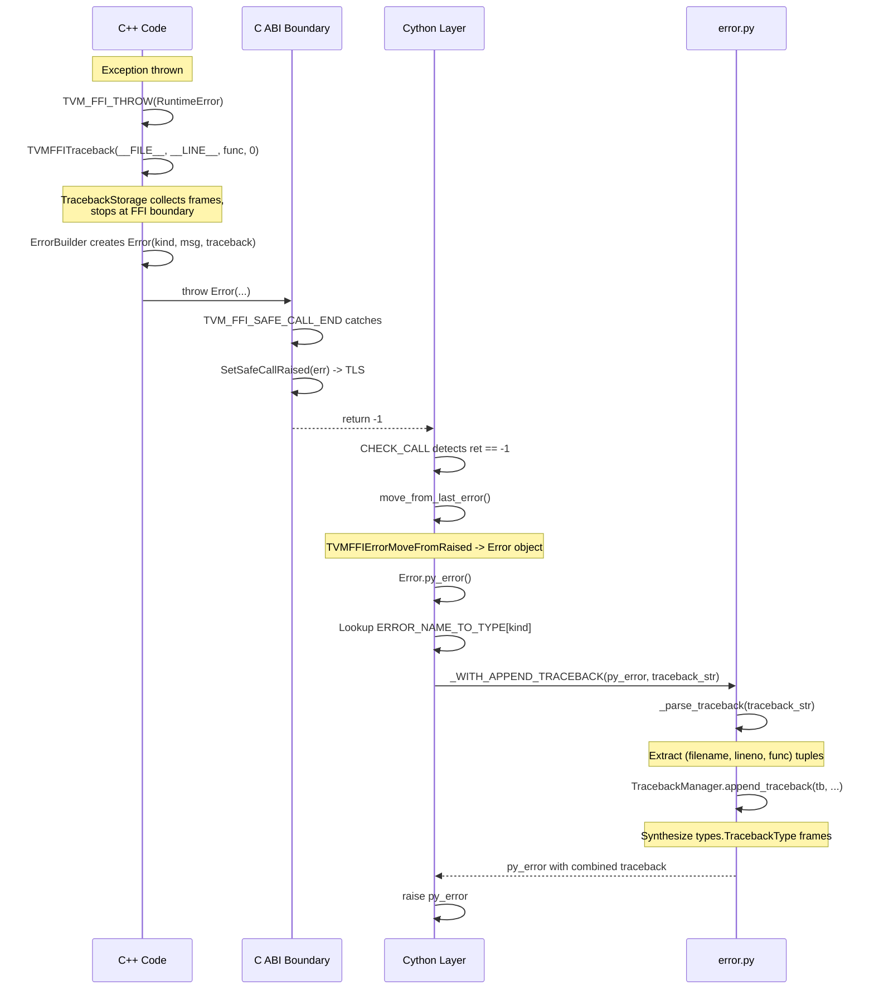
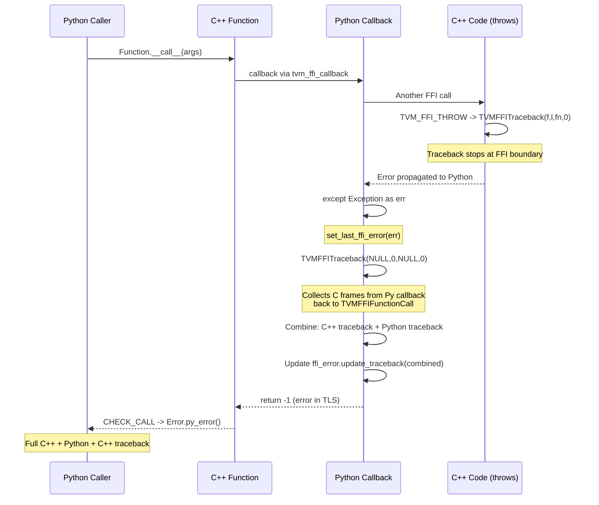

# Cross-Language Traceback System

**TL;DR**
- The traceback system provides unified C++/Python stack traces across FFI boundaries via the `TVMFFITraceback` C API function, which collects native stack frames using `libbacktrace` (non-Windows) or `CaptureStackBackTrace` (Windows), filters out internal FFI frames, and stops at the FFI call boundary by default.
- The `cross_ffi_boundary` parameter (added as the 4th argument to `TVMFFITraceback`) controls whether the traceback stops at the FFI boundary (`0`, default) or crosses it (`1`, used for segfault handlers). This is a breaking C ABI change from the previous 3-parameter signature.
- Python-side `TracebackManager` synthesizes real Python `types.TracebackType` frames from the C++ traceback string (Python-format `File "...", line N, in func` entries), enabling a seamless merged traceback when C++ exceptions propagate through Python.
- As of commit `6f020c1`, the `traceback` field in `TVMFFIErrorCell` is renamed to `backtrace` throughout the C ABI, C++ API, Cython bindings, and Python layer. Storage order is "most recent call first" (append-friendly). The `update_backtrace` function pointer takes an additional `TVMFFIBacktraceUpdateMode` parameter. See [ADR 0039](../ADRs/0039-backtrace-rename-and-append-mode.md).

## Problem Statement

### Background

When C++ code throws an exception, the error propagates through the C ABI boundary (via `TVM_FFI_SAFE_CALL_END`) into Python. Python users need to see where the error originated in C++ code. Similarly, when Python calls C++ which calls Python which calls C++ (nested FFI), the traceback needs to show the full call chain without noise from internal FFI framework frames or Python interpreter internals.

Before this design, the `TVM_FFI_TRACEBACK_HERE` macro captured a traceback inline. The new design removes this macro in favor of direct `TVMFFITraceback` calls with explicit FFI boundary control.

### Solution

A three-component system:
1. **C-level traceback capture** (`TVMFFITraceback`): Uses `libbacktrace` for native frame collection, with frame filtering and boundary detection.
2. **TracebackStorage**: Internal struct that collects frames, skips initial N frames, applies exclusion heuristics, and stops at FFI boundaries.
3. **Python-side synthesis** (`TracebackManager`): Parses C++ traceback strings into `(filename, lineno, func)` tuples and synthesizes real Python `types.TracebackType` objects.

### Goals

- **Goal**: Provide human-readable merged C++/Python tracebacks without internal FFI noise.
- **Goal**: Support both boundary-stopped tracebacks (for error display) and boundary-crossing tracebacks (for segfault handlers).
- **Goal**: Make C++ traceback frames appear as genuine Python frames in the Python exception traceback.
- **Non-goal**: Source-level stepping/debugging across the FFI boundary.
- **Non-goal**: Absolute frame accuracy (symbol demangling and line numbers from debug info can be approximate).

## Design

### Cross-Language Error Propagation Flow



### Round-Trip Error Propagation (Python -> C++ -> Python)



### TVMFFITraceback C API

```c
TVM_FFI_DLL const TVMFFIByteArray* TVMFFITraceback(
    const char* filename,    // Caller file (can be NULL)
    int lineno,              // Caller line (can be 0)
    const char* func,        // Caller function (can be NULL)
    int cross_ffi_boundary   // 0 = stop at boundary, non-zero = cross
);
```

**Behavior**:
- Returns a pointer to a `thread_local TVMFFIByteArray` containing the formatted traceback string (Python-format: `File "...", line N, in func\n`).
- When `filename` and `func` are non-NULL: prepends the explicit caller frame and sets `skip_frame_count = 2` (to skip `TVMFFITraceback` itself and the immediate caller, which is redundant with the explicit frame).
- When `filename` and `func` are NULL: captures only the native stack frames (used for capturing the C++ side of the call stack from Python).
- `cross_ffi_boundary = 0`: `TracebackStorage.stop_at_boundary = true`, frame collection stops when `DetectFFIBoundary` detects `TVMFFIFunctionCall` or Python interpreter symbols.
- `cross_ffi_boundary = 1`: `TracebackStorage.stop_at_boundary = false`, frame collection continues past FFI boundaries (used by segfault handler to get full stack).

### TracebackStorage Internal Structure

```cpp
struct TracebackStorage {
    std::vector<std::string> lines;  // Collected frames (most recent call first)
    size_t max_frame_size;           // From TVM_TRACEBACK_LIMIT env var (default 512)
    size_t skip_frame_count = 0;     // Skip N initial frames
    bool stop_at_boundary = true;    // Stop at FFI boundary

    void Append(filename, func, lineno);  // Format and add frame
    bool ExceedTracebackLimit();           // Check against max_frame_size
    std::string GetTraceback();            // Returns frames in stored order (most recent first)
};
```

### Frame Filtering Heuristics

Two categories of frame filtering, applied in this priority order:

**FFI Boundary Detection** (`DetectFFIBoundary`, checked first):
- `TVMFFIFunctionCall` -- the C ABI entry point for function calls
- `slot_tp_call`, `object_is_not_callable` -- Python ABI symbols
- `_Py*`, `PyObject*` -- Python interpreter internal frames

**Frame Exclusion** (`ShouldExcludeFrame`, checked after boundary):
- Symbol-based (checked first):
  - `tvm::ffi::Function*` -- Function system internals
  - `tvm::ffi::details::*` -- Implementation details
  - `TVMFFITraceback` -- The traceback function itself
  - `TVMFFIErrorSetRaisedFromCStr` -- Error creation internals
  - `__libc_*` -- C stdlib frames
  - `ffi_call_*` -- libffi.so frames
- Filename-based (checked if symbol is null or no match):
  - `include/tvm/ffi/error.h`
  - `include/tvm/ffi/function_details.h`
  - `include/tvm/ffi/function.h`
  - `include/tvm/ffi/any.h`
  - `include/c++/` -- C++ stdlib headers

### MSVC Tail-Call Prevention

On MSVC (`traceback_win.cc`), `TVMFFIFunctionCall` uses `volatile int ret` to prevent tail-call optimization:

```cpp
// The volatile prevents MSVC from optimizing away TVMFFIFunctionCall
// from the call stack, which is needed for reliable FFI boundary detection
volatile int ret = cell->safe_call(handle, args, num_args, result);
return ret;
```

This ensures `TVMFFIFunctionCall` always appears in the call stack, enabling `DetectFFIBoundary` to reliably identify the FFI boundary.

### Python-Side TracebackManager

`TracebackManager` in `error.py` converts C++ traceback strings into real Python `types.TracebackType` objects:

1. **Parse**: `_parse_traceback(traceback_str)` extracts `(filename, lineno, func)` tuples from lines matching `File "...", line N, in func`.
2. **Create code object**: `ast.parse("_getframe()", filename=filename)` creates an AST, then `compile()` produces a code object. `code_object.replace(co_name=func, co_firstlineno=lineno)` sets the correct function name and line number.
3. **Create frame**: `eval(code_object, {"_getframe": sys._getframe})` executes the code, which calls `sys._getframe()` and returns the frame object with the crafted code object.
4. **Chain traceback**: `types.TracebackType(tb, frame, frame.f_lasti, lineno)` creates a new traceback entry linked to the previous traceback.

Code objects are cached by `(filename, lineno, func)` key to avoid redundant compilation.

### Key Classes, Fields and Interfaces

- **`TVMFFITraceback`** (C API, `include/tvm/ffi/c_api.h`): `(const char* filename, int lineno, const char* func, int cross_ffi_boundary) -> const TVMFFIByteArray*`. Thread-local storage for result string.
- **`TracebackStorage`** (C++ struct, `src/ffi/backtrace_utils.h`): Frame collector with `lines`, `max_frame_size`, `skip_frame_count`, `stop_at_boundary`. `Append()` formats Python-style frame lines. `GetTraceback()` returns frames in "most recent call first" order (append-friendly for error propagation; display code reverses for Python-style "most recent call last" rendering). Renamed from `traceback.h` in commit `6f020c1`.
- **`ShouldExcludeFrame`** (C++ inline, `src/ffi/backtrace_utils.h`): Frame exclusion heuristic checking symbol names and filenames.
- **`DetectFFIBoundary`** (C++ inline, `src/ffi/backtrace_utils.h`): FFI boundary detection checking for `TVMFFIFunctionCall`, Python ABI symbols.
- **`GetTracebackLimit`** (C++ inline, `src/ffi/traceback.h`): Reads `TVM_TRACEBACK_LIMIT` env var (default 512).
- **`TracebackManager`** (Python class, `python/tvm_ffi/error.py`): Synthesizes Python `types.TracebackType` from C++ traceback strings. Caches code objects by `(filename, lineno, func)`.
- **`_with_append_traceback`** (Python function, `python/tvm_ffi/error.py`): Wired to `core._WITH_APPEND_TRACEBACK`. Parses traceback string, chains synthesized frames onto `py_error.__traceback__` in reverse order.
- **`_traceback_to_str`** (Python function, `python/tvm_ffi/error.py`): Wired to `core._TRACEBACK_TO_STR`. Converts Python traceback to Python-format string for embedding in FFI error objects.
- **`set_last_ffi_error`** (Cython function, `error.pxi`): Called when a Python exception must be propagated back to C++. Combines C++ traceback (from `TVMFFITraceback(NULL,0,NULL,0)`) with Python traceback, stores as FFI Error in TLS.
- **`Error.py_error()`** (Cython method, `error.pxi`): Converts FFI `Error` to Python exception by looking up `ERROR_NAME_TO_TYPE[kind]`, creating the Python exception, and appending synthesized traceback frames.
- **`TVM_FFI_THROW(Kind)`** (C++ macro, `error.h`): Now calls `TVMFFITraceback(__FILE__, __LINE__, TVM_FFI_FUNC_SIG, 0)` directly (the former `TVM_FFI_TRACEBACK_HERE` macro was removed).

### Contracts, Assumptions and Invariants

- **Thread-local result**: `TVMFFITraceback` returns a pointer to `thread_local` storage. The pointer is valid until the next call to `TVMFFITraceback` on the same thread.
- **libbacktrace mutex**: On non-Windows platforms, `backtrace_full` is guarded by a static mutex because libbacktrace is not thread-safe for concurrent calls.
- **Frame format invariant**: All frames use Python-style format: `  File "filename", line N, in func\n`. This format is consumed by `_parse_traceback` in Python and must remain stable.
- **Boundary detection relies on symbol names**: The system depends on `TVMFFIFunctionCall` and Python ABI symbols appearing in the call stack. On MSVC, `volatile int ret` prevents tail-call elimination to ensure this. If compiler optimizations inline these symbols, boundary detection may fail.
- **Callback wiring must precede errors**: `core._WITH_APPEND_TRACEBACK` must be set by `error.py` before any FFI call that could raise an error. The import order in `__init__.py` guarantees this.
- **Segfault handler uses cross_ffi_boundary=1**: The `TVMFFISegFaultHandler` crosses FFI boundaries because during a segfault there is no meaningful boundary to stop at.

### Extension Points

- **New frame exclusion patterns**: Add entries to `ShouldExcludeFrame` in `traceback.h` for new internal implementation files.
- **New FFI boundary markers**: Add entries to `DetectFFIBoundary` for additional language runtime symbols (e.g., Rust FFI bridge functions).
- **Custom traceback limit**: Set `TVM_TRACEBACK_LIMIT` environment variable.
- **Alternative backtrace backends**: Replace `libbacktrace` by implementing `TVMFFITraceback` with a different backend (the function signature is the only contract).

## Alternatives & Trade-offs

### Alternative: Always stop at FFI boundary (no cross_ffi_boundary parameter)

- Pros: Simpler API, no ABI break.
- Cons: Segfault handlers cannot get a useful traceback because they would stop at the first FFI boundary, which may not be near the crash site. Nested FFI calls (Python -> C++ -> Python -> C++) would lose context. The parameter adds minimal complexity and enables critical debugging scenarios.

### Alternative: Always cross FFI boundaries

- Pros: No parameter needed, always full traceback.
- Cons: Produces noisy tracebacks with Python interpreter internal frames (`_PyEval_EvalFrameDefault`, `slot_tp_call`, etc.) that are meaningless to users. The Python side already provides its own traceback for Python frames; duplicating them from the C++ side creates confusion.

### Alternative: Use Python-level traceback extraction instead of C++ traceback synthesis

- Pros: No code object hacking, simpler Python code.
- Cons: Cannot synthesize frames for C++ code that has no Python equivalent. The `ast.parse` + `compile` + `code_object.replace` approach creates genuine Python frames that integrate with standard Python debugging tools.

## Related Work

### Design Docs & ADRs

- [`.knowledge/designs/0007-error-handling.md`](0007-error-handling.md) -- Error object model and exception transport
- [`.knowledge/designs/0001-c-abi.md`](0001-c-abi.md) -- TVMFFITraceback C API signature
- [`.knowledge/designs/0004-function-system.md`](0004-function-system.md) -- TVMFFIFunctionCall used as boundary marker
- [`.knowledge/designs/0014-python-bindings.md`](0014-python-bindings.md) -- Python Error class and callback wiring
- [`.knowledge/ADRs/0005-safe-call-abi-boundary.md`](../ADRs/0005-safe-call-abi-boundary.md) -- Safe call convention
- [`.knowledge/ADRs/0022-traceback-boundary-parameter.md`](../ADRs/0022-traceback-boundary-parameter.md) -- Decision to add cross_ffi_boundary
- [`.knowledge/ADRs/0039-backtrace-rename-and-append-mode.md`](../ADRs/0039-backtrace-rename-and-append-mode.md) -- Rename traceback->backtrace, append-friendly ordering, update_mode

### Evidence Matrix

- TVMFFITraceback 4-parameter signature -> `.knowledge/commits/2025-08-24-2d41a5115f6a91e2781012a3379f9626bc9e18a1.md` + `2d41a51` + `include/tvm/ffi/c_api.h:846`
- TracebackStorage with skip_frame_count, stop_at_boundary -> `2d41a51` + `src/ffi/traceback.h:136-177`
- DetectFFIBoundary (renamed from ShouldStopTraceback) -> `2d41a51` + `src/ffi/traceback.h:111-131`
- ShouldExcludeFrame symbol-first priority -> `2d41a51` + `src/ffi/traceback.h:56-102`
- TVM_FFI_TRACEBACK_HERE macro removal -> `2d41a51` + `include/tvm/ffi/error.h:219,232`
- TracebackManager Python-side synthesis -> `2d41a51` + `python/tvm_ffi/error.py:54-124`
- MSVC volatile tail-call prevention -> `2d41a51` + `src/ffi/traceback_win.cc`
- Segfault handler with cross_ffi_boundary=1 -> `2d41a51` + `src/ffi/traceback.cc:154`
- Backtrace rename (traceback->backtrace), append-friendly storage, TVMFFIBacktraceUpdateMode -> `.knowledge/commits/2025-09-22-6f020c11c304ef11ac5d0dad904d41ebe42a3ffd.md` + `6f020c1`
