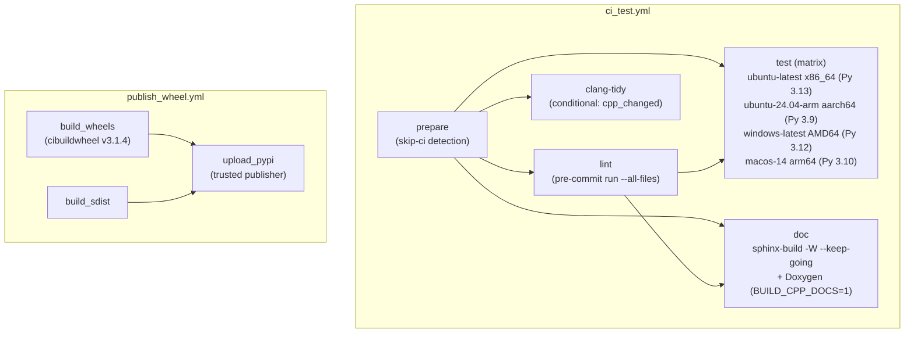
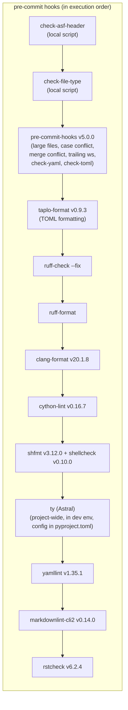

# CI and Lint Pipeline

**TL;DR**
- Two GitHub Actions workflows drive the project: `ci_test.yml` (lint + C++/Python tests on 4 OS/arch targets) and `publish_wheel.yml` (cibuildwheel build + PyPI publish via trusted publisher).
- Linting is fully managed by `pre-commit`, replacing the earlier monolithic `task_lint.sh` script. Hooks cover ruff (Python), clang-format (C++, Google style), cython-lint, shfmt/shellcheck (shell), and project-specific ASF header and file-type checks.
- Python code quality is enforced by ruff with a comprehensive rule set including `ANN` (type annotations on all public APIs), `UP` (Python upgrade), `D` (docstrings), and `I` (import sorting), replacing the earlier black+isort toolchain.

## Problem Statement

### Background
- The project needed CI to validate cross-platform builds (Linux x86/arm, macOS arm64, Windows AMD64) and enforce code quality consistently across C++, Python, Cython, and shell scripts.
- Early CI used a monolithic `tests/scripts/task_lint.sh` shell script that sequentially invoked individual linters (check_file_type, check_asf_header, black, clang-format). This was brittle, hard to extend, and did not support incremental runs.
- Python formatting was initially handled by black+isort, then migrated to ruff-format+ruff-check for unified configuration and faster execution.

### Solution
- Adopt `pre-commit` as the single lint orchestrator, with all linters configured as hooks in `.pre-commit-config.yaml`.
- Use `pre-commit/action@v3.0.1` in CI, replacing the custom `task_lint.sh` step.
- Configure ruff as the sole Python lint/format tool with an extensive rule set in `pyproject.toml`.

### Goals
- **Goal**: Every PR is validated on 4 OS/arch targets before merge.
- **Goal**: Lint checks run identically in CI and locally via `pre-commit run --all-files`.
- **Goal**: All Python public APIs carry type annotations (enforced by ruff ANN rules).
- **Non-goal**: Pre-built binary wheels for all platforms (covered by `publish_wheel.yml`, not the CI test workflow).
- **Non-goal**: CUDA-specific testing (no CUDA hardware in CI runners).

## Design





### Key Classes, Fields and Interfaces

**CI Workflows**:

| Workflow | Triggers | Jobs |
|----------|----------|------|
| `ci_test.yml` | push (main, dev), PR, workflow_dispatch | `prepare` -> `lint` + `clang-tidy` (conditional on C++ changes, 181e1b8) + `test` (4-target matrix) |
| `ci_mainline_only.yml` | push (main), workflow_dispatch | `clang-tidy` (0899b5d) -- runs heavier static analysis post-merge only; `examples` (a754afe) -- runs quickstart, stable_c_abi, and python_packaging examples on Linux/macOS/Windows |
| `publish_wheel.yml` | workflow_dispatch (branch input) | `build_wheels` -> `build_sdist` -> `upload_pypi` |
| `torch_c_dlpack.yml` | workflow_dispatch (branch input) | `build_libs` -> `build_wheels` -> `publish` (da570b0) -- builds torch C DLPack ext for torch 2.4-2.7 x {CPU,CUDA} x {x86_64,aarch64} using manylinux_2_28 + CUDA 13.0 |

**Composite Actions**:

| Action | Inputs | Outputs |
|--------|--------|---------|
| `detect-env-vars` | none | `cpu_count` (via `multiprocessing.cpu_count()`) |
| `detect-skip-ci` | `github_event_name`, `pr_base_ref`, `pr_head_sha` | `should_skip_ci_commit` (true if `[bypass ci]` prefix), `should_skip_ci_docs_only` (true if all changes under `docs/` or `*.md`) |

**Lint Scripts** (project-specific, invoked by pre-commit local hooks):

| Script | Purpose |
|--------|---------|
| `tests/lint/check_asf_header.py` | Verify/fix Apache 2.0 license headers. `FMT_MAP` maps extensions to header templates. CLI: `--check`, `--fix`, `--dry-run`. |
| `tests/lint/check_file_type.py` | Reject disallowed file extensions via `ALLOW_EXTENSION` set (~50 extensions). Uses `git ls-files`. |
| `tests/lint/check_version.py` | Multi-language version consistency linter (ac63fb9). Uses `setuptools_scm.get_version()` as canonical; validates C++ macros (`TVM_FFI_VERSION_{MAJOR,MINOR,PATCH}`) via `--cpp` and Rust `Cargo.toml` via `--rust`. Pre-commit hook: `check-version-consistency` (requires `setuptools-scm`, `packaging`, `tomli`). |

**Ruff configuration** (`pyproject.toml`):
```toml
[tool.ruff]
include = ["python/**/*.py", "tests/**/*.py"]
line-length = 100

[tool.ruff.lint]
select = ["UP", "PL", "I", "RUF", "NPY", "F", "PTH", "D", "ANN"]
# Key per-file ignores:
# __init__.py: F401 (unused imports)
# tests/*: E741 (ambiguous variable), ANN (annotations not required in tests)
```
The `ANN` rule enforces type annotations on all public function parameters and return types. The `D` rule enforces Google-style docstrings.

**Pre-commit hook versions** (`.pre-commit-config.yaml`):

| Hook | Version | Notes |
|------|---------|-------|
| pre-commit-hooks | v5.0.0 | Standard checks (large files, YAML, TOML, trailing ws, etc.) |
| taplo-format | v0.9.3 | TOML formatting (pyproject.toml, etc.) |
| ruff | v0.12.3 | ruff-check (--fix) + ruff-format |
| clang-format | v20.1.8 | Google style, auto-applied |
| cython-lint | v0.16.7 | max-line-length=120 |
| shfmt | v3.12.0-2 | Tab indentation |
| shellcheck | v0.10.0.1 | Shell script static analysis |
| ty (Astral) | latest | Replaced mypy (7619669); runs in dev virtualenv (e08dd68); config in `[tool.ty.*]` sections in pyproject.toml |
| yamllint | v1.35.1 | YAML lint; config in `.yamllint.yaml` |
| markdownlint-cli2 | v0.14.0 | Markdown lint; config in `.markdownlint-cli2.yaml` |
| rstcheck | v6.2.4 | RST lint; config in `docs/.rstcheck.cfg` |
| cmake-format | v0.6.13 | CMake formatting; config in `.cmake-format.json` |
| cmake-lint | v0.6.13 | CMake lint; naming conventions, best practices |

### Contracts, Assumptions and Invariants
- **Skip-CI protocol**: A commit message starting with `[bypass ci]` skips all CI jobs. Docs-only changes (all files under `docs/` or `*.md`) skip test jobs but still run lint.
- **Squash-only merges**: `.asf.yaml` enforces squash-only merges on GitHub PRs, with `squash_commit_message: PR_TITLE_AND_DESC` so the squashed commit message uses the PR title and description.
- **Branch protection**: The `main` branch requires at least 1 approving pull request review before merge.
- **Lint = pre-commit**: CI runs `pre-commit run --all-files`, the same command developers run locally. There is no separate lint script.
- **Test depends on lint**: The `test` job in `ci_test.yml` depends on both `prepare` and `lint`, so tests only run if linting passes.
- **`setuptools_scm` CI requirements** (ac63fb9): All CI `actions/checkout@v5` steps now use `fetch-depth: 0` and `fetch-tags: true` so that `setuptools_scm` can derive the version from git tag history. Without this, `setuptools_scm` falls back to `0.0.0.dev0`.
- **Per-platform Python versions in CI**: Test matrix uses per-platform Python versions: ubuntu-latest=3.13, ubuntu-24.04-arm=3.9, windows-latest=3.12, macos-14=3.10 (set via `astral-sh/setup-uv@v6.7.0` with `activate-environment: true`). Installation uses `uv pip install` instead of `pip install`.
- **Failure mode -- pre-commit hook fails**: If any hook fails, the commit is rejected locally and the CI lint job fails. Developers must fix the issue and retry. `pre-commit run <hook-id> --all-files` can run individual hooks for targeted debugging.
- **clang-tidy runs on PRs** (181e1b8): A `clang-tidy` job was added to `ci_test.yml` (PR workflow), conditional on `cpp_changed == 'true'` (detected by diffing C/C++ file extensions against the PR base branch). This prevents post-merge clang-tidy failures by catching issues before merge. clang-tidy also continues to run in `ci_mainline_only.yml` post-merge.
- **clang-tidy is separate from pre-commit**: clang-tidy runs as a separate CI job (not part of pre-commit) because it requires a compilation database and is significantly slower. The `.clang-tidy` configuration (added in 368af82) enables `clang-diagnostic-*`, `clang-analyzer-*`, `modernize-*`, `bugprone-*`, `performance-*`, `portability-*`, `google-*` checks with selected exclusions. `WarningsAsErrors: '*'` enforces all enabled checks. The runner script `tests/lint/clang_tidy_precommit.py` auto-generates `compile_commands.json` via CMake, runs clang-tidy in parallel via `ThreadPoolExecutor`, and wraps via `xcrun` on macOS.
- **cmake-format and cmake-lint**: `.cmake-format.json` (added in ec422f1) configures 100-col line width, 2-space indent, dangling parens, unix line endings, and lint rules for naming conventions. `cmake-format` v0.6.13 and `cmake-lint` are registered as pre-commit hooks.

### Extension Points
- **New pre-commit hooks**: Add new entries to `.pre-commit-config.yaml`. ty (Astral, replacing mypy), cmake-format, and cmake-lint are now active. Remaining planned additions: conventional commits.
- **New lint scripts**: Add `tests/lint/<name>.py` scripts and register them as local hooks in `.pre-commit-config.yaml`.
- **New ruff rules**: Enable additional ruff rule families in `pyproject.toml` `[tool.ruff.lint]` select list.
- **New CI targets**: Add entries to the `matrix.include` list in `ci_test.yml`.

### Usage Examples

#### Running lint locally
**Context**: A developer wants to run all lint checks before pushing.
```bash
# Run all hooks on all files (same as CI)
pre-commit run --all-files

# Run a single hook
pre-commit run ruff-check --all-files
pre-commit run clang-format --all-files

# Run clang-tidy separately (not part of pre-commit)
uv run --no-project --with "clang-tidy==21.1.1" \
  python tests/lint/clang_tidy_precommit.py \
    --build-dir=build-pre-commit \
    --jobs=$(sysctl -n hw.ncpu) \
    ./src/ ./include ./tests
```

#### Compiling pure C against TVM FFI headers
**Context**: A compiler codegen target that produces pure C (not C++) code. Uses `tvm-ffi-config --cflags` (no `-std=c++17`).
```bash
gcc -shared -fPIC `tvm-ffi-config --cflags` \
    src/add_one_c.c -o build/add_one_c.so \
    `tvm-ffi-config --ldflags` `tvm-ffi-config --libs`
```
```python
import tvm_ffi
mod = tvm_ffi.load_module("build/add_one_c.so")
mod.add_one_c(x, y)
```

### Evolution Timeline

| Commit | Change |
|--------|--------|
| `ef6d57b` | Initial CI: `ci_test.yml` (prepare -> lint + test, 4 targets), `publish_wheel.yml`, composite actions, `task_lint.sh`, basic `.pre-commit-config.yaml` |
| `5304752` | Add ruff to lint pipeline (`[tool.ruff]` in pyproject.toml), add isort and ruff to `task_lint.sh` |
| `64e4b7f` | Replace `task_lint.sh` with native pre-commit hooks; add clang-format, cython-lint, shfmt, shellcheck hooks; CI uses `pre-commit/action@v3.0.1` |
| `0bc968d` | Comprehensive ruff rule set (UP, PL, I, RUF, NPY, F, PTH, D); delete black/isort config; delete obsolete `task_lint.sh` and `git-clang-format.sh` |
| `8f4e044` | Enable ANN rule (type annotations on all public APIs); fix StreamContext `__enter__` return self |
| `23500b5` | Add taplo-format TOML formatter to pre-commit |
| `40e9c83` | Add mypy v1.17.0 as 4 pre-commit hooks; add `[tool.mypy]` config; `_ffi_api.pyi` stub; `@overload` for `get_global_func` |
| `f5633e9` | Per-platform Python version matrix (3.9/3.10/3.12/3.13); migrate CI from pip to uv |
| `66778b5` | Add `doc` CI job with `sphinx-build -W`; stub-file fallback for C++ index |
| `3bc6418` | Enable Doxygen in CI with `WARN_AS_ERROR`; `TVM_FFI_DOXYGEN_MODE` guard; `cpp_id_attributes` Sphinx config |
| `9582540` | Add yamllint, markdownlint-cli2, rstcheck pre-commit hooks |
| `5cfd705` | Consolidate mypy to single project-wide hook v1.18.2; centralize config in pyproject.toml; PEP 561 `py.typed` marker |
| `ec422f1` | Add cmake-format v0.6.13 + cmake-lint pre-commit hooks; `.cmake-format.json` config; reformat all CMake files; rename internal CMake variables for lint compliance |
| `368af82` | Add `.clang-tidy` configuration + `tests/lint/clang_tidy_precommit.py` runner; apply C++ modernizations (noexcept, std::move, using, static_cast); fix `MoveTVMFFIAnyToAny` signature (rvalue-ref -> pointer) |
| `ac63fb9` | `setuptools_scm` integration: CI `fetch-depth: 0`/`fetch-tags: true`, `check-version-consistency` pre-commit hook, version derived from git tags |
| `0899b5d` | Add `ci_mainline_only.yml` workflow for post-merge clang-tidy |
| `da570b0` | Add `torch_c_dlpack.yml` workflow for torch DLPack ext PyPI release (torch 2.4-2.7, manylinux_2_28, CUDA 13.0) |
| `a754afe` | Add `examples` CI job to `ci_mainline_only.yml`: runs quickstart, stable_c_abi, python_packaging examples on Linux/macOS/Windows; add Windows `.bat` scripts |
| `7619669` | Replace mypy with Astral's `ty` type checker: `[tool.mypy]` -> `[tool.ty.*]` in pyproject.toml; pre-commit hook updated; CI updated; ~30 files adjusted for stricter checking |
| `e08dd68` | Switch `ty` from `uvx` to running in dev virtualenv; minor type annotation fixes |
| `89cb606` | Fix broken wheel testing caused by test dependency group migration (single-line pyproject.toml fix) |

## Alternatives & Trade-offs
### Monolithic lint script (task_lint.sh)
- Pros: Single-file simplicity, easy to understand execution order.
- Cons: No incremental runs, no pre-commit integration, hard to add new linters without modifying the script. Each new linter requires updating the script, CI config, and developer docs. Replaced by pre-commit.

### Black+isort (prior Python formatting)
- Pros: Battle-tested, widely adopted.
- Cons: Two separate tools with potentially conflicting configurations. ruff provides formatting + linting + import sorting in a single tool, is significantly faster (Rust-based), and supports a much wider rule set (ANN, UP, PTH, etc.).

## Related Work
### Design Docs & ADRs
- [0014-python-package.md](0014-python-package.md) -- Python package that CI builds and tests
- [0014-standalone-python-package.md](../ADRs/0014-standalone-python-package.md) -- Decision to decouple tvm_ffi as standalone
- [0001-c-abi-layer.md](0001-c-abi-layer.md) -- C ABI tested by CI C++ tests

### Evidence Matrix
- Initial CI workflows, composite actions, lint scripts -> `2025-09-13-ef6d57b8.md` (ef6d57b)
- Ruff+isort config added to pyproject.toml -> `2025-09-13-5304752c.md` (5304752)
- Pre-commit replaces task_lint.sh -> `2025-09-17-64e4b7f0.md` (64e4b7f)
- Comprehensive ruff rules, black/isort removed -> `2025-09-17-0bc968d1.md` (0bc968d)
- ANN type annotation enforcement -> `2025-09-17-8f4e044a.md` (8f4e044)
- cmake-format/cmake-lint hooks, .cmake-format.json -> `2025-10-04-ec422f1a.md` (ec422f1)
- clang-tidy config + runner script + C++ modernizations -> `2025-10-07-368af824.md` (368af82)
- setuptools_scm integration, check-version-consistency hook, CI fetch-tags -> `2025-10-26-ac63fb9b.md` (ac63fb9)
- Mainline-only clang-tidy CI workflow -> `2025-10-28-0899b5d.md` (0899b5d)
- Torch DLPack ext release CI workflow -> `2025-11-03-da570b0.md` (da570b0)
- Examples CI job (quickstart, stable_c_abi, python_packaging on 3 platforms) -> `2025-12-21-a754afe248c0a29509236b5e0c8d2e30a26f7ffa.md` (a754afe)
- clang-tidy added to PR CI (ci_test.yml) conditional on C++ changes -> `2026-01-09-181e1b8b5d81599a4c6215375d07162d3d750438.md` (181e1b8)
- mypy -> ty type checker migration, `[tool.ty.*]` config -> `2026-02-07-761966953fec7e8ceba0fcc20dc003e39cf2692d.md` (7619669)
- Plus 10 supporting commits (ASF config, version bumps, branch protection, docs fixes, squash config, ty dev env fix, wheel test fix)
