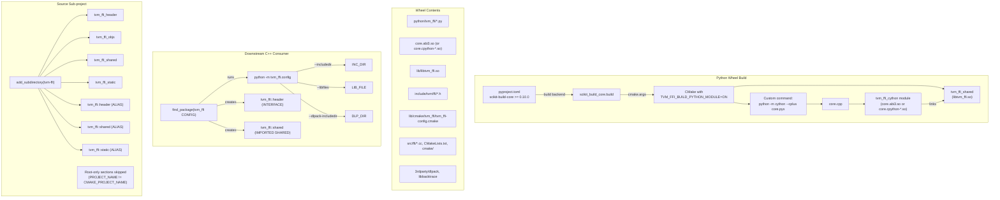
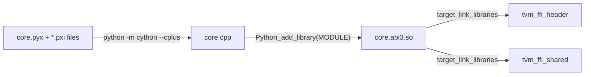

# Packaging and Build System

**TL;DR**
- The `apache-tvm-ffi` Python package uses `scikit-build-core` as its build backend with Cython transpilation via a CMake custom command. The Cython module links against `tvm_ffi_shared` and targets the Python Stable ABI (SABI 3.12+) when available, enabling a single wheel to work across Python 3.12+ versions.
- The CMake build supports two modes: (1) root-project mode for standalone builds and Python wheel builds (`TVM_FFI_BUILD_PYTHON_MODULE=ON`), and (2) sub-project mode for downstream consumers via `add_subdirectory`. A guard (`if (NOT ${PROJECT_NAME} STREQUAL ${CMAKE_PROJECT_NAME}) return()`) separates the two.
- Downstream C++ consumers integrate via `find_package(tvm_ffi CONFIG)`, which invokes `python -m tvm_ffi.config` to discover include dirs, library paths, and dlpack headers. The `tvm-ffi-config` CLI entry point provides the same information for non-CMake build systems.

## Problem Statement

### Background

The C++ FFI library and Python bindings need to be distributed as a pip-installable wheel that includes the shared library, Cython extension, C++ headers, CMake config files, and vendored dependencies (dlpack, libbacktrace source). Downstream C++ projects that depend on `tvm_ffi` need to find the library and headers without requiring a source checkout. The build system must also support development workflows where the library is built from source as a subdirectory.

### Solution

A `pyproject.toml`-driven build using `scikit-build-core >= 0.10.0` and Cython, with CMake as the underlying build system. The wheel bundles all artifacts needed for both Python usage (shared lib + Cython module) and downstream C++ compilation (headers + CMake config + source).

### Goals

- **Goal**: Single `pip install` installs everything needed for Python FFI usage.
- **Goal**: Downstream C++ projects can use `find_package(tvm_ffi CONFIG)` after `pip install apache-tvm-ffi`.
- **Goal**: Source builds work via `add_subdirectory` without `pip install`.
- **Goal**: Stable ABI wheels (SABI 3.12+) to reduce the number of wheels needed per platform.
- **Non-goal**: Full cross-compilation toolchain integration. However, as of commits `0d157dc`/`3b4a532`/`dcd07cf`, the CMake build supports disabling pthreads and dl linking via `TVM_FFI_USE_THREADS=OFF` and `TVM_FFI_USE_DL_LIBS=OFF` for bare-metal and cross-compilation targets. See [ADR 0054](../ADRs/0054-cmake-cross-compilation-toggles.md).

## Design

### Build System Architecture



### CMake Dual-Mode Guard

The `CMakeLists.txt` has a guard that separates root-project and sub-project behavior:

```cmake
# Core targets (always built):
# tvm_ffi_header, tvm_ffi_objs, tvm_ffi_shared, tvm_ffi_static

# Guard: everything below only runs when this is the root project
if (NOT ${PROJECT_NAME} STREQUAL ${CMAKE_PROJECT_NAME})
  return()
endif()

# Root-only: TVM_FFI_ATTACH_DEBUG_SYMBOLS, TVM_FFI_BUILD_TESTS, TVM_FFI_BUILD_PYTHON_MODULE
# prefix map, sanitizer, warnings, test targets, python module build, install rules
```

This means downstream projects using `add_subdirectory(tvm-ffi)` get the core library targets without test targets, Python module builds, or install rules.

### Namespace Aliases for Source Builds (commit `ac80ea3` #479)

As of commit `ac80ea3`, the source build creates CMake `ALIAS` targets that mirror the namespace-qualified names from the installed config file:

| ALIAS Target | Points To | Defined In |
|---|---|---|
| `tvm_ffi::header` | `tvm_ffi_header` | Top-level `CMakeLists.txt` |
| `tvm_ffi::shared` | `tvm_ffi_shared` | `cmake/Utils/Library.cmake` (`tvm_ffi_add_target_from_obj`) |
| `tvm_ffi::static` | `tvm_ffi_static` | `cmake/Utils/Library.cmake` (`tvm_ffi_add_target_from_obj`) |

This ensures that downstream code using `target_link_libraries(mylib tvm_ffi::shared)` works identically in both `add_subdirectory` (source) and `find_package` (installed) modes. Previously, source-dependency consumers had to use the non-namespaced names (`tvm_ffi_header`, `tvm_ffi_shared`), while `tvm_ffi_configure_target` expected the namespace-qualified names.

### Cython Compilation Pipeline



- **CMake custom command**: `add_custom_command` invokes Cython to transpile `core.pyx` -> `core.cpp`. The working directory is set to `CMAKE_CURRENT_SOURCE_DIR` so that relative file paths in tracebacks are project-relative.
- **SABI vs SOABI**: For Python >= 3.12, `Python_add_library(tvm_ffi_cython MODULE core.cpp USE_SABI 3.12)` produces a Stable ABI module (`core.abi3.so`). For Python < 3.12, `WITH_SOABI` produces a version-specific module (`core.cpython-311-*.so`).
- **Dependencies**: The Cython module links against `tvm_ffi_header` (for C++ header include paths) and `tvm_ffi_shared` (for the FFI shared library).
- **RPATH**: `INSTALL_RPATH` is set to `@loader_path/lib` (macOS) or `$ORIGIN/lib` (Linux), enabling the Cython module to find `tvm_ffi_shared` relative to itself in the installed wheel layout. `BUILD_WITH_INSTALL_RPATH` is deliberately NOT set, so build-tree modules use CMake's default RPATH (pointing to the build directory) while install-tree modules use the relative path. This two-phase approach avoids breaking editable installs and in-source builds.

### pyproject.toml Configuration

Key settings in `pyproject.toml`:

| Setting | Value | Purpose |
|---|---|---|
| `build-system.requires` | `["scikit-build-core>=0.10.0", "cython"]` | Build dependencies |
| `build-system.build-backend` | `"scikit_build_core.build"` | scikit-build-core as PEP 517 backend |
| `tool.scikit-build.wheel.py-api` | `"cp312"` | Target Python 3.12 Stable ABI |
| `tool.scikit-build.cmake.args` | `["-DTVM_FFI_BUILD_PYTHON_MODULE=ON", ...]` | Enable Python module build |
| `tool.scikit-build.wheel.packages` | `["python/tvm_ffi"]` | Package source location |
| `tool.scikit-build.wheel.install-dir` | `"tvm_ffi"` | Install into `tvm_ffi/` in the wheel |
| `project.scripts.tvm-ffi-config` | `"tvm_ffi.config:__main__"` | CLI entry point |

### tvm-ffi-config CLI

The `tvm-ffi-config` CLI (`python/tvm_ffi/config.py`) provides toolchain discovery for downstream consumers:

| Flag | Output |
|---|---|
| `--includedir` | Path to TVM FFI headers (`include/tvm/ffi/`) |
| `--dlpack-includedir` | Path to DLPack headers |
| `--cmakedir` | Path to CMake config files |
| `--sourcedir` | Path to packaged source |
| `--libdir` | Directory containing `libtvm_ffi.so` |
| `--libfiles` | Full path to library file (`.so`/`.dylib`/`.lib`) |
| `--cxxflags` | `-I<include> -I<dlpack> -std=c++17` |
| `--cflags` | `-I<include> -I<dlpack>` (C flags without `-std=c++17`, for pure-C compilation) |
| `--ldflags` | `-L<libdir>` |
| `--libs` | `-ltvm_ffi` (or `.lib` path on Windows) |
| `--cython-lib-path` | Path to compiled Cython extension |

**Config-mode import bypass** (commit `5c0deb9` #489): When `tvm-ffi-config` is invoked, `tvm_ffi.__init__.py` detects this via `_is_config_mode()` and skips all heavy imports (library loading, Cython extension, object registration). This means the CLI works even when the native library is not available (e.g., cross-compilation environments). On Windows (commit `bad3896` #490), the native library is loaded even in config mode because DLL search path resolution requires it.

### cmake/tvm_ffi-config.cmake

The `find_package(tvm_ffi CONFIG)` config file:

1. Finds Python interpreter (`find_package(Python COMPONENTS Interpreter REQUIRED)`).
2. Invokes `python -m tvm_ffi.config` with `--includedir`, `--dlpack-includedir`, `--libfiles` to discover paths.
3. Creates `tvm_ffi::header` (INTERFACE library) with include dirs and `cxx_std_17`.
4. Creates `tvm_ffi::shared` (IMPORTED SHARED library) with the discovered library file.
5. Includes `cmake/Utils/Library.cmake` and `cmake/Utils/EmbedCubin.cmake`, making `tvm_ffi_configure_target` and `tvm_ffi_install` available to downstream consumers.

On Windows, the imported library uses `IMPORTED_IMPLIB` (for `.lib` import libraries); on other platforms, `IMPORTED_LOCATION`.

**Note on target naming**: The imported targets use CMake namespace syntax (`tvm_ffi::shared`, `tvm_ffi::header`) to avoid name conflicts with locally-defined targets such as `tvm_ffi_shared` in the source build. See [`.knowledge/ADRs/0051-namespaced-cmake-import-targets.md`](../ADRs/0051-namespaced-cmake-import-targets.md).

### Wheel Contents

The installed wheel contains:

```
tvm_ffi/
    __init__.py, base.py, registry.py, ...     # Python modules
    core.abi3.so (or core.cpython-*.so)         # Cython extension
    lib/
        libtvm_ffi.so (.dylib, .dll)            # Shared library
        cmake/tvm_ffi/tvm_ffi-config.cmake      # CMake config
    include/
        tvm/ffi/*.h, tvm/ffi/extra/*.h          # C++ headers
        dlpack/*.h                               # DLPack headers
    src/ffi/*.cc                                 # C++ source (for recompilation)
    cmake/Utils/*.cmake                          # CMake utilities
    3rdparty/
        dlpack/include/...                       # DLPack headers (vendored)
        libbacktrace/...                         # libbacktrace source
    CMakeLists.txt                               # Root CMakeLists
```

This layout enables downstream consumers to either link against the pre-built shared library or recompile from source (e.g., with different compile options or as a static library).

### CMake Options Summary

| Option | Default | Scope | Purpose |
|---|---|---|---|
| `TVM_FFI_USE_LIBBACKTRACE` | ON | Always | Enable libbacktrace for stack traces |
| `TVM_FFI_USE_EXTRA_CXX_API` | ON | Always | Include extra-tier C++ APIs |
| `TVM_FFI_USE_THREADS` | ON | Always | Link against pthreads. Set to OFF for cross-compilation targets without pthreads. |
| `TVM_FFI_USE_DL_LIBS` | ON | Always | Link against `dl` library. Set to OFF for targets without dlopen (e.g., bare-metal, WASM). |
| `TVM_FFI_BACKTRACE_ON_SEGFAULT` | ON | Always | Install SIGSEGV handler |
| `TVM_FFI_ATTACH_DEBUG_SYMBOLS` | OFF | Root only | Add `-g1` even in Release mode |
| `TVM_FFI_BUILD_TESTS` | OFF | Root only | Build GoogleTest targets |
| `TVM_FFI_BUILD_PYTHON_MODULE` | OFF | Root only | Build Cython module + install rules |

### Test Target Configuration

- **Output directory**: Test binary placed in `${CMAKE_BINARY_DIR}/lib` (not `bin/`) so it co-locates with the shared library. On Windows, DLLs must be in the same directory as the executable (or on `PATH`), so this avoids additional `PATH` manipulation for tests.
- **MSVC runtime**: No explicit `MSVC_RUNTIME_LIBRARY` property on test targets. The test inherits the project-wide CRT policy (typically `MultiThreadedDLL`), avoiding `/MT` vs `/MD` mismatch when linking against the dynamic `tvm_ffi_shared`.
- **GoogleTest integration**: Uses `FetchContent_MakeAvailable(googletest)` (the idiomatic CMake 3.14+ pattern), replacing the older three-step `FetchContent_Populate` + `message` + `add_subdirectory` approach.

### Documentation Build (Sphinx)

The `docs/` directory contains a Sphinx documentation site:
- **Configuration**: `docs/conf.py` with sphinx-book-theme, MyST parser for Markdown, mermaid, nbsphinx, intersphinx (Python, NumPy, PyTorch, data-api, scikit_build_core).
- **Structure**: `docs/index.rst` with toctree organized into 6 sections: Get Started (`quickstart.rst`, `stable_c_abi.rst`), Guides (`kernel_library_guide.rst`, `compiler_integration.md`, `cubin_launcher.rst`, `python_lang_guide.md`, `cpp_lang_guide.md`, `rust_lang_guide.md`), Concepts (`abi_overview.md`), Packaging (`python_packaging.rst`, `cpp_packaging.md`), Reference (`python/`, `cpp/`, `rust/`), Developer Manual (`build_from_source.md`). See [`.knowledge/designs/0018-documentation-site.md`](0018-documentation-site.md) for details.
- **Live preview**: `make livehtml` target in `docs/Makefile`.
- **Dependencies**: `docs/requirements.txt` (18 dependencies including sphinx-book-theme, myst-parser, linkify-it-py, nbsphinx).
- **Code-to-test correspondence**: Code snippets in `docs/guides/cpp_lang_guide.md` have corresponding GoogleTest entries in `tests/cpp/test_example.cc`.

### cmake install path conventions

- `cmake/Utils/` installed to `cmake/Utils` (no trailing slash, avoiding nested `Utils/Utils/`).
- `tvm_ffi-config.cmake` installed to `cmake/` (not `lib/cmake/tvm_ffi/`), matching `libinfo.py:find_cmake_path()` discovery.
- `tvm_ffi-config.cmake` includes `cmake/Utils/Library.cmake` so downstream `find_package(tvm_ffi CONFIG)` consumers get utility functions automatically.

### Library Utility Functions (cmake/Utils/Library.cmake)

CMake utility functions (all prefixed with `tvm_ffi_`):

| Function | Purpose |
|---|---|
| `tvm_ffi_add_target_from_obj(name obj_target)` | Create `_shared` and `_static` library targets from an OBJECT library |
| `tvm_ffi_add_msvc_flags(target)` | Add MSVC-specific compile flags |
| `tvm_ffi_add_apple_dsymutil(target)` | Generate dSYM files on macOS |
| `tvm_ffi_add_prefix_map(target source_dir)` | Add `-ffile-prefix-map` for reproducible file paths in tracebacks |
| `tvm_ffi_configure_target(target [kwargs])` | One-call integration: link headers/shared lib, prefix map, dSYM, MSVC flags, stubgen post-build |
| `tvm_ffi_install(target [DESTINATION dir])` | Install TVM-FFI artifacts (dSYM bundles on Apple, extensible for PDB/DWARF) |

#### tvm_ffi_configure_target

Analogous to `pybind11_add_module` or `nanobind_add_module`, this function is the primary entry point for downstream CMake consumers. It configures an existing target with all TVM-FFI integration steps in a single call:

```cmake
tvm_ffi_configure_target(my_extension
    LINK_SHARED ON       # link tvm_ffi::shared (default: ON)
    LINK_HEADER ON       # link tvm_ffi::header (default: ON)
    DEBUG_SYMBOL ON      # Apple dSYM generation (default: ON)
    MSVC_FLAGS ON        # MSVC-specific flags (default: ON)
    STUB_DIR python/     # directory for stubgen post-build step
    STUB_INIT ON         # allow generating new _ffi_api.py/__init__.py
    STUB_PKG my-pkg      # Python package name (default: SKBUILD_PROJECT_NAME or target name)
    STUB_PREFIX my_pkg.  # registry prefix filter (default: "<STUB_PKG>.")
)
```

When `STUB_DIR` is set, a post-build `add_custom_command` invokes `python -m tvm_ffi.stub.cli` with the target's built library as `--dlls` argument, enabling automatic stub regeneration on every build.

**Validation rules**:
- `STUB_PKG`/`STUB_PREFIX` require `STUB_DIR` to be set.
- `STUB_PKG`/`STUB_PREFIX` require `STUB_INIT=ON`.
- `STUB_INIT=ON` requires `STUB_DIR`.

#### tvm_ffi_install

Handles platform-specific artifact installation:
- **Apple**: Installs the target's `.dSYM` bundle using `install(DIRECTORY ... OPTIONAL)`.
- **Other platforms**: Currently a no-op (extension point for PDB/DWARF packaging).

### Key Classes, Fields and Interfaces

- **`pyproject.toml`**: Build configuration. Package name `apache-tvm-ffi`, version `0.1.0b3` (progressed from `a0`..`a13` through alpha, then `b0`->`b1`->`b2`->`b3` through beta). Build system: `scikit-build-core >= 0.10.0` + `cython`. cibuildwheel configuration: explicit `build` list (`cp39-cp312`), skips musllinux, test-only on `cp312` (the ABI3 wheel), `test-groups` (migrated from `test-extras` in commit `89cb606` #444). Lint configuration: `[tool.ruff]` with comprehensive rules (UP, PL, I, RUF, NPY, F, PTH, D, ANN); `[tool.black]` and `[tool.isort]` sections removed (ruff subsumes both). Type checking: `[tool.ty]` (migrated from `[tool.mypy]` in commit `7619669` #432). Dependencies use `[dependency-groups]` (migrated from `[project.optional-dependencies]` in commit `7619669` #432).
- **`CMakeLists.txt`**: Dual-mode (root/sub-project) build file. Targets: `tvm_ffi_header`, `tvm_ffi_objs`, `tvm_ffi_shared`, `tvm_ffi_static`, `tvm_ffi_cython` (root-only).
- **`cmake/tvm_ffi-config.cmake`**: find_package config file. Creates `tvm_ffi::header` and `tvm_ffi::shared` IMPORTED targets. Includes `cmake/Utils/Library.cmake` and `cmake/Utils/EmbedCubin.cmake`.
- **`python/tvm_ffi/config.py`**: CLI entry point `tvm-ffi-config`. Functions: `__main__()`, `find_windows_implib()`.
- **`python/tvm_ffi/libinfo.py`**: Library discovery. Functions: `find_libtvm_ffi()`, `find_include_path()`, `find_dlpack_include_path()`, `find_python_helper_include_path()`, `include_paths()`, `find_cmake_path()`, `find_source_path()`, `find_cython_lib()`, `get_dll_directories()`. `include_paths()` is a convenience function combining `find_include_path()`, `find_python_helper_include_path()`, and `find_dlpack_include_path()` (added in commit `f81ab9c`).
- **`LICENSE`** / **`NOTICE`**: Apache 2.0 license files establishing the project as an Apache Software Foundation project (`Apache TVM FFI, Copyright 2024-present`). Added in commit `30f1e0a`.
- **`.gitmodules`**: Formalizes the two vendored submodules (`3rdparty/dlpack` from `dmlc/dlpack`, `3rdparty/libbacktrace` from `ianlancetaylor/libbacktrace`). Added in commit `30f1e0a`.
- **`.pre-commit-config.yaml`**: Authoritative lint configuration. Hooks: ruff-check/ruff-format, clang-format v20.1.8, cython-lint, shfmt, shellcheck, check-yaml/check-toml, plus local hooks for ASF header and file type checks. Replaces the former `task_lint.sh` approach (commit `64e4b7f`). See [0021-ci-cd-pipeline](0021-ci-cd-pipeline.md) for the full CI pipeline design.
- **`CONTRIBUTING.md`**: Contributor guidelines for the Apache TVM FFI project (added in commit `5facac5`).

### Contracts, Assumptions and Invariants

- **CMake minimum version**: 3.18 (bumped from 3.14 for `Python_add_library` with `USE_SABI` support).
- **SABI compatibility**: Python 3.12+ wheels use Stable ABI, meaning the Cython extension does not use any Python version-specific C API. This constrains the Cython code to avoid CPython internals not part of the Stable ABI.
- **Library discovery order**: `libinfo.py` searches in this order: (1) `tvm_ffi/lib/` (installed wheel), (2) `../../build/lib/` (in-source build), (3) `../../../build/lib/` (parent project build), (4) platform-specific environment variables (`LD_LIBRARY_PATH`, `DYLD_LIBRARY_PATH`, `PATH`).
- **Sub-project guard**: When used via `add_subdirectory`, the root-only sections (tests, Python module, install rules) are skipped. The sub-project gets `tvm_ffi_header`, `tvm_ffi_objs`, `tvm_ffi_shared`, `tvm_ffi_static`.
- **Wheel ships source**: The wheel includes C++ source and CMakeLists.txt so downstream consumers can recompile the library with different options (e.g., `TVM_FFI_USE_EXTRA_CXX_API=OFF` for a minimal build).
- **Static library excluded from wheel**: When `TVM_FFI_BUILD_PYTHON_MODULE=ON`, the static library is not installed in the wheel (the shared library and source are sufficient).

### Extension Points

- **New CMake options**: Add to the root-only section for options that should not affect sub-project consumers.
- **New Cython `.pxi` files**: Add to the `cython_sources` list in CMakeLists.txt and include in `core.pyx`.
- **New wheel contents**: Add `install()` commands in the `TVM_FFI_BUILD_PYTHON_MODULE` block.
- **New CLI flags**: Add to `config.py`'s argument parser and implement via `libinfo` functions.
- **Platform-specific library search**: Extend `get_dll_directories()` in `libinfo.py`.
- **`tvm_ffi_configure_target` extensions**: Add new keyword arguments following the existing `cmake_parse_arguments` pattern. Future platform-specific debug symbol handling can extend `tvm_ffi_install`.
- **Downstream package bootstrapping**: Use `tvm_ffi_configure_target(... STUB_DIR <dir> STUB_INIT ON)` to auto-generate Python package scaffolding from C++ FFI registrations. See [`.knowledge/designs/0023-type-schema-and-stubgen.md`](0023-type-schema-and-stubgen.md).

## Alternatives & Trade-offs

### Alternative: CMake-only distribution (no pip install)

- Pros: Simpler distribution, standard C++ workflow.
- Cons: Python users cannot `pip install` the package. Does not integrate with Python virtual environments. Cannot distribute pre-built wheels on PyPI.

### Alternative: setuptools instead of scikit-build-core

- Pros: More widely used, simpler for pure-Python packages.
- Cons: Poor CMake integration. scikit-build-core was purpose-built for CMake-based Python extensions and handles the CMake -> Python wheel pipeline natively, including SABI support.

### Alternative: Meson build system

- Pros: Native Python module support, simpler syntax.
- Cons: The existing codebase uses CMake extensively. Switching would require rewriting all build logic. scikit-build-core bridges the CMake ecosystem to Python packaging.

## Related Work

### Design Docs & ADRs

- [`.knowledge/designs/0014-python-bindings.md`](0014-python-bindings.md) -- Python package that this build system packages
- [`.knowledge/designs/0011-extra-api-tier.md`](0011-extra-api-tier.md) -- `TVM_FFI_USE_EXTRA_CXX_API` gating
- [`.knowledge/designs/0021-ci-cd-pipeline.md`](0021-ci-cd-pipeline.md) -- CI/CD pipeline consuming this build system
- [`.knowledge/ADRs/0021-standalone-python-package.md`](../ADRs/0021-standalone-python-package.md) -- Decision to create standalone package
- [`.knowledge/ADRs/0051-namespaced-cmake-import-targets.md`](../ADRs/0051-namespaced-cmake-import-targets.md) -- Decision to use `tvm_ffi::` namespace for imported targets
- [`.knowledge/ADRs/0054-cmake-cross-compilation-toggles.md`](../ADRs/0054-cmake-cross-compilation-toggles.md) -- Decision to add TVM_FFI_USE_THREADS and TVM_FFI_USE_DL_LIBS options
- [`.knowledge/designs/0023-type-schema-and-stubgen.md`](0023-type-schema-and-stubgen.md) -- Stubgen tool integrated via `tvm_ffi_configure_target`

### Evidence Matrix

- pyproject.toml with scikit-build-core -> `.knowledge/commits/2025-08-24-2d41a5115f6a91e2781012a3379f9626bc9e18a1.md` + `2d41a51` + `pyproject.toml`
- CMake dual-mode guard -> `2d41a51` + `CMakeLists.txt:142-144`
- Cython compilation pipeline (custom_command, USE_SABI/WITH_SOABI) -> `2d41a51` + `CMakeLists.txt:177-221`
- tvm_ffi-config.cmake find_package config -> `2d41a51` + `cmake/tvm_ffi-config.cmake`
- tvm-ffi-config CLI entry point -> `2d41a51` + `python/tvm_ffi/config.py`, `pyproject.toml:47`
- Library discovery (libinfo.py) -> `2d41a51` + `python/tvm_ffi/libinfo.py`
- TVM_FFI_BUILD_PYTHON_MODULE option -> `2d41a51` + `CMakeLists.txt:175`
- TVM_FFI_ATTACH_DEBUG_SYMBOLS option -> `2d41a51` + `CMakeLists.txt:146`
- CMake function name prefixing (tvm_ffi_*) -> `2d41a51` + `CMakeLists.txt:116-117`
- Wheel contents install rules -> `2d41a51` + `CMakeLists.txt:223-252`
- RPATH for Cython module (macOS @loader_path/lib, Linux $ORIGIN/lib) -> `.knowledge/commits/2025-08-25-2cf211f14a41a11c536fd16b6ea102dac3627c0a.md` + `2cf211f`
- Remove BUILD_WITH_INSTALL_RPATH (build vs install RPATH decoupling) -> `.knowledge/commits/2025-08-29-ad8e5d2c3345c4cca1a9ce50a24238c0cafcb05e.md` + `ad8e5d2`
- cibuildwheel config: explicit cp39-cp312, skip musllinux, test-only cp312 -> `.knowledge/commits/2025-08-25-2cf211f14a41a11c536fd16b6ea102dac3627c0a.md` + `2cf211f`
- FetchContent_MakeAvailable for GoogleTest -> `.knowledge/commits/2025-08-26-7358796ec49a9e28d32d18020357bbbab5ec24e1.md` + `7358796`
- Test output dir normalized to lib/ + MSVC runtime removal -> `.knowledge/commits/2025-08-26-7358796ec49a9e28d32d18020357bbbab5ec24e1.md` + `7358796`
- cmake install path fixes (trailing slash, cmake/ prefix) -> `.knowledge/commits/2025-08-30-4523a834e6d7331870230873365a895ce94da050.md` + `4523a83`
- Sphinx docs scaffolding -> `.knowledge/commits/2025-09-01-c695f5f16ab6e54c729fd6338361b555c7daf8b7.md` + `c695f5f`
- Docs favicon + linkify-it-py dependency -> `.knowledge/commits/2025-09-02-86ba210e02e8b1376cc1786fd6e2762f6d22e256.md` + `86ba210`
- Lazy numpy import pattern in dtype.py -> `.knowledge/commits/2025-08-25-2cf211f14a41a11c536fd16b6ea102dac3627c0a.md` + `2cf211f`
- Lazy torch import pattern in function.pxi -> `.knowledge/commits/2025-08-25-2cf211f14a41a11c536fd16b6ea102dac3627c0a.md` + `2cf211f`
- Packaging example (examples/packaging/, later renamed to examples/python_packaging/) -> `.knowledge/commits/2025-08-30-4523a834e6d7331870230873365a895ce94da050.md` + `4523a83`
- Missing packaging example files (extension.cc, run_example.py) -> `.knowledge/commits/2025-09-01-5a3e3cbd4dbdf1f01d61bdfbe17b38134cc45e84.md` + `5a3e3cb`
- Libbacktrace submodule update to upstream HEAD -> `.knowledge/commits/2025-08-29-7d09d6ae1670edeb2c3e2076ec3cbce3f1a3266d.md` + `7d09d6a`
- Repo scaffolding (LICENSE, NOTICE, .gitignore, .gitmodules, dlpack submodule update) -> `.knowledge/commits/2025-09-13-30f1e0af6a5c1ccab79a10560388756e3f95f7e6.md` + `30f1e0a`
- Version bumps 0.1.0a12 (commit `4dee97f`) and 0.1.0a13 (commit `043d9f6`) -> pyproject.toml
- libinfo.include_paths() + find_python_helper_include_path() -> `.knowledge/commits/2025-09-12-f81ab9c25ae4d2a42706747c50c5c410c51d6cdd.md` + `f81ab9c`
- Version bumps through beta: 0.1.0b0 (commit `3e07df4`), 0.1.0b1 (commit `5facac5`), 0.1.0b2 (commit `c100338`), 0.1.0b3 (commit `9432896`) -> pyproject.toml
- --cflags CLI option for pure-C compilation -> `.knowledge/commits/2025-09-14-c100338de52825097ddc44bbac3d03a92f45b33a.md` + `c100338`
- CMake install path fix for 3rdparty trailing slashes -> `.knowledge/commits/2025-09-16-943289686340fc04bc15ec3b377bff22a1839bab.md` + `9432896`
- Pre-commit modernization (replace task_lint.sh, ruff/clang-format/cython-lint/shfmt/shellcheck hooks) -> `.knowledge/commits/2025-09-17-64e4b7f01896e3b755a49f5f4f7c25329aacc0b7.md` + `64e4b7f`
- Comprehensive Ruff rules (UP, PL, I, RUF, NPY, F, PTH, D), remove black/isort config -> `.knowledge/commits/2025-09-17-0bc968d1c6c76db80e69d2e860eafc8e0a3e9a69.md` + `0bc968d`
- ANN (flake8-annotations) rule enforcement -> `.knowledge/commits/2025-09-17-8f4e044a90ff8a3db15742274f2c7df435142b04.md` + `8f4e044`
- CONTRIBUTING.md + version bump b1 + URL fixes -> `.knowledge/commits/2025-09-14-5facac5ff2881370ddcae7d9440849bc475b6ca7.md` + `5facac5`
- tvm_ffi_configure_target and tvm_ffi_install CMake helpers -> `.knowledge/commits/2025-12-20-ccd19f8202a980bd03501a62600e338fa883f80c.md` + `ccd19f8`
- CMake import target rename (tvm_ffi_shared -> tvm_ffi::shared, tvm_ffi_header -> tvm_ffi::header) -> `.knowledge/commits/2025-12-22-a1cb746201412a943c29d942e6b2c29b36d97c48.md` + `a1cb746`
- examples/packaging renamed to examples/python_packaging -> `.knowledge/commits/2025-12-22-dc0dd2f6e8367e3bb244e0dc09c6a1a41495499d.md` + `dc0dd2f`
- TVM_FFI_USE_THREADS option (cross-compilation: make threads optional) -> `.knowledge/commits/2026-01-11-0d157dc81551bdf57b26ae9cde62bf37fdc0f8ca.md` + `0d157dc` and `.knowledge/commits/2026-01-11-3b4a532763159d7810bf7094152860c97511a546.md` + `3b4a532`
- TVM_FFI_USE_DL_LIBS option (cross-compilation: make dl optional) -> `.knowledge/commits/2026-01-11-dcd07cfe27465287ee5b203b742e85dcfb99606a.md` + `dcd07cf`
- Dependency group migration (optional-deps to dependency-groups, ty config) -> `.knowledge/commits/2026-02-07-761966953fec7e8ceba0fcc20dc003e39cf2692d.md` + `7619669`
- Fix cibuildwheel test-extras to test-groups -> `.knowledge/commits/2026-02-11-89cb6066d1d8851e61e6201ca0782d78a4ed8160.md` + `89cb606`
- CMake namespace aliases for source builds (tvm_ffi::header, ::shared, ::static ALIAS targets) -> `.knowledge/commits/2026-02-28-ac80ea39735f0284451141837de23dff99b95129.md` + `ac80ea3`
- Config-mode import bypass (skip heavy imports for tvm-ffi-config CLI) -> `.knowledge/commits/2026-02-28-5c0deb94a9a8e9a56293ded341f0d4b0bcb7ba5b.md` + `5c0deb9`
- Windows config-mode library loading fix -> `.knowledge/commits/2026-03-01-bad3896fcd7b49a350978ec0be34926479341188.md` + `bad3896`
