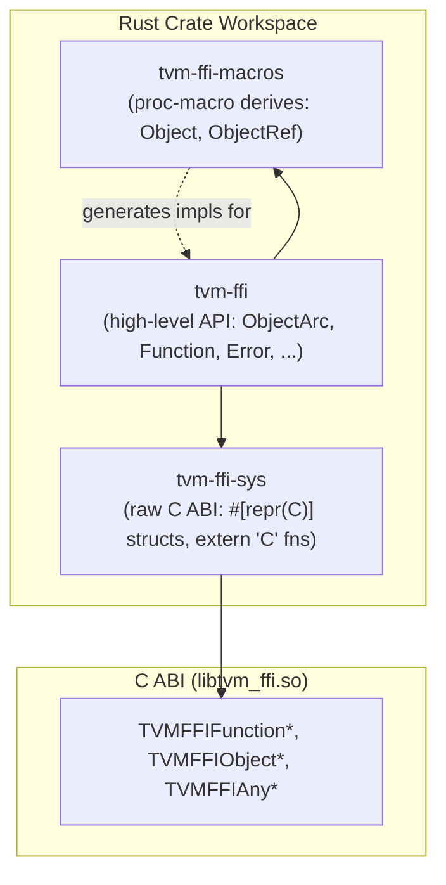
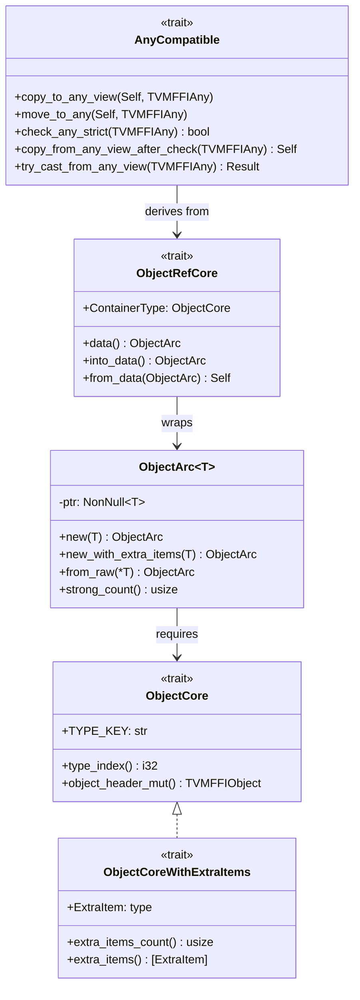

# Rust Bindings: Three-Crate FFI Workspace

**TL;DR**
- A three-crate Rust workspace (`tvm-ffi-sys`, `tvm-ffi-macros`, `tvm-ffi`) provides idiomatic Rust bindings over the C ABI, mirroring the C++ type system with Rust traits (`ObjectCore`, `ObjectRefCore`, `AnyCompatible`) and proc-macro derives (`#[derive(Object)]`, `#[derive(ObjectRef)]`).
- `ObjectArc<T>` is the Rust equivalent of C++ `ObjectPtr<T>`, providing ref-counted smart pointer ownership. Critically, it manipulates `TVMFFIObject.combined_ref_count` atomics directly in Rust (no C API call), matching the C++ two-phase strong/weak deletion protocol exactly.
- The `tvm_ffi_dll_export_typed_func!` macro generates `extern "C"` symbols with the `__tvm_ffi_` prefix, making Rust-compiled shared libraries loadable by the Module system.

## Problem Statement

### Background
- The C ABI (0001-c-abi.md) provides a stable binary interface for cross-language interop, but raw C function calls from Rust require verbose unsafe code for every operation.
- Rust developers expect ownership-tracking smart pointers, trait-based type conversion, and derive macros -- not manual `TVMFFIObjectIncRef`/`TVMFFIObjectDecRef` calls.
- The existing Python bindings (0012-python-bindings.md) and C++ API demonstrate that a high-level language layer can be built atop the C ABI without changing it.

### Solution
- Split into three crates following the standard Rust `-sys` crate convention:
  - `tvm-ffi-sys`: Raw `#[repr(C)]` struct mirrors and `extern "C"` function declarations
  - `tvm-ffi-macros`: Proc-macro derives for Object and ObjectRef
  - `tvm-ffi`: High-level safe Rust API built on the other two
- Implement native Rust ref-counting that bypasses C API overhead (see ADR 0013).
- Provide trait-based type conversion (`AnyCompatible`) analogous to C++ `TypeTraits<T>`.

### Goals
- Idiomatic Rust API with ownership semantics, error handling via `Result`, and zero-cost abstractions.
- Zero-overhead ref-counting (native Rust atomics, no FFI call for inc/dec ref).
- Derive macros to minimize boilerplate for new Object types.
- Non-goal: Replacing the C++ runtime -- Rust bindings link against the same `libtvm_ffi.so`.

## Design





### Key Classes, Fields and Interfaces

```python
# === Crate: tvm-ffi-sys (raw C ABI bindings) ===

class TVMFFIObject:
    """Rust #[repr(C)] mirror of C TVMFFIObject header (24 bytes)."""
    combined_ref_count: AtomicU64  # low32=strong, high32=weak
    type_index: i32
    __padding: u32
    deleter: Option[extern "C" fn(*mut c_void, i32)]
    # Invariant: layout byte-for-byte identical to C TVMFFIObject
    # Interacts with: ObjectArc (Rust), unsafe_::inc_ref/dec_ref (Rust native atomics)

class TVMFFIAny:
    """Rust #[repr(C)] mirror of C TVMFFIAny tagged union (16 bytes)."""
    type_index: i32
    small_str_len: u32
    data_union: TVMFFIAnyDataUnion  # v_int64, v_float64, v_ptr, v_obj, v_bytes[8]
    # Invariant: layout identical to C TVMFFIAny
    # Interacts with: Any, AnyView, all AnyCompatible implementations

class TVMFFITypeIndex(IntEnum):
    """Type index enum values mirroring C definitions."""
    kTVMFFINone = 0; kTVMFFIInt = 1; kTVMFFIBool = 2; kTVMFFIFloat = 3
    kTVMFFIOpaquePtr = 4; kTVMFFIDataType = 5; kTVMFFIDevice = 6
    kTVMFFISmallStr = 11; kTVMFFISmallBytes = 12
    kTVMFFIStaticObjectBegin = 64; kTVMFFIStr = 65; kTVMFFIBytes = 66
    kTVMFFIError = 67; kTVMFFIFunction = 68; kTVMFFIShape = 69
    kTVMFFITensor = 70; kTVMFFIArray = 71; kTVMFFIMap = 72
    kTVMFFIModule = 73; kTVMFFIOpaquePyObject = 74
    # Interacts with: C++ TVMFFITypeIndex, all check_any_strict() implementations

# extern "C" function declarations (linked via tvm-ffi-config --libdir):
# TVMFFIFunctionGetGlobal, TVMFFIFunctionSetGlobal, TVMFFIFunctionCreate,
# TVMFFIFunctionCall, TVMFFIErrorMoveFromRaised, TVMFFIErrorSetRaised,
# TVMFFIErrorCreate, TVMFFIAnyViewToOwnedAny, TVMFFITensor{From,To}DLPack{,Versioned},
# TVMFFIString/BytesFromByteArray, TVMFFIGetTypeInfo, TVMFFITypeKeyToIndex,
# TVMFFIEnvSetStream, TVMFFIEnvGetStream, TVMFFIEnvSetTensorAllocator,
# TVMFFIEnvModLookupFromImports, etc.
# Interacts with: C++ libtvm_ffi.so (dynamic linking via build.rs -> tvm-ffi-config)

# === Crate: tvm-ffi-macros (proc macros) ===

# derive(Object): generates ObjectCore impl
#   Input: struct with first field as base object (parent ObjectCore type)
#   Attributes: #[type_key = "..."], #[type_index(TypeIndex::kXxx)] (optional)
#   Generated code (pseudocode):
#     impl ObjectCore for MyObj {
#         const TYPE_KEY: &str = "my.TypeKey";
#         fn type_index() -> i32 { /* lazy TVMFFITypeKeyToIndex or static */ }
#         fn object_header_mut(&mut self) -> &mut TVMFFIObject { &mut self.base.header }
#     }
#   Interacts with: ObjectCore trait, TVMFFIObject header, TVMFFITypeKeyToIndex

# derive(ObjectRef): generates ObjectRefCore + AnyCompatible impls
#   Input: struct with single field data: ObjectArc<T>
#   Generated code (pseudocode):
#     impl ObjectRefCore for MyRef {
#         type ContainerType = MyObj;
#         fn data(&self) -> &ObjectArc<MyObj> { &self.data }
#         fn from_data(data: ObjectArc<MyObj>) -> Self { Self { data } }
#     }
#     impl AnyCompatible for MyRef { /* delegate to ObjectRefCore pattern */ }
#   Interacts with: ObjectRefCore trait, AnyCompatible trait, ObjectArc

# === Crate: tvm-ffi (high-level Rust API) ===

class ObjectArc[T: ObjectCore]:
    """Ref-counted smart pointer for FFI objects. Native Rust atomics."""
    ptr: NonNull[T]
    def new(data: T) -> ObjectArc[T]: ...
        # Allocates, writes TVMFFIObject header with combined_ref_count = BOTH_ONE
        # Sets deleter to object_deleter_for_new::<T>
    def new_with_extra_items(data: T, extra: &[ExtraItem]) -> ObjectArc[T]: ...
        # For tail-allocated objects (StringObj, BytesObj, ShapeObj)
        # Sets deleter to object_deleter_for_new_with_extra_items::<T,ExtraItem>
    def from_raw(ptr: *const T) -> ObjectArc[T]: ...
        # Takes ownership without incrementing ref count
    def into_raw(this: Self) -> *const T: ...
        # Releases ownership without decrementing ref count
    def strong_count(this: &Self) -> usize: ...
    def weak_count(this: &Self) -> usize: ...
    # Invariant: Drop calls dec_ref; Clone calls inc_ref
    # Invariant: new() initializes combined_ref_count = BOTH_ONE (strong=1, weak=1)
    # Interacts with: unsafe_::inc_ref/dec_ref (native Rust atomics, see ADR 0013)
    # Extension: new_with_extra_items for tail-allocated objects

class unsafe_:
    """Native Rust ref-counting operations (zero C API overhead)."""
    def inc_ref(handle: *mut TVMFFIObject) -> None: ...
        # fetch_add(1, Relaxed) on combined_ref_count
    def dec_ref(handle: *mut TVMFFIObject) -> None: ...
        # Fast path: old == BOTH_ONE -> deleter(BothMask)
        # Slow path: strong==1, weak>0 -> deleter(Strong), sub weak,
        #            if weak==0 -> deleter(Weak)
        # Invariant: mirrors C++ DecRef exactly (two-phase strong/weak deletion)
    def object_deleter_for_new[T](*mut c_void, i32) -> None: ...
        # drop_in_place + dealloc for standard objects
    def object_deleter_for_new_with_extra_items[T, U](*mut c_void, i32) -> None: ...
        # drop_in_place + dealloc for tail-allocated objects
    # Interacts with: ObjectArc (called from Drop and Clone)

trait ObjectCore:
    """Marks a Rust type as an FFI object (has TVMFFIObject header at known offset)."""
    TYPE_KEY: str                                      # e.g., "ffi.Function"
    def type_index() -> i32: ...                       # static or lazily resolved
    def object_header_mut(this: &mut Self) -> &mut TVMFFIObject: ...
    # Interacts with: derive(Object) macro, ObjectArc, TVMFFITypeKeyToIndex

trait ObjectCoreWithExtraItems(ObjectCore):
    """For objects with tail-allocated inline data (StringObj, BytesObj, ShapeObj)."""
    ExtraItem: type
    def extra_items_count(this: &Self) -> usize: ...
    def extra_items(this: &Self) -> &[ExtraItem]: ...
    # Interacts with: ObjectArc::new_with_extra_items

trait ObjectRefCore:
    """Maps a user-facing Ref wrapper to its ObjectArc<ContainerType>."""
    ContainerType: ObjectCore
    def data(this: &Self) -> &ObjectArc[ContainerType]: ...
    def into_data(this: Self) -> ObjectArc[ContainerType]: ...
    def from_data(data: ObjectArc[ContainerType]) -> Self: ...
    # Interacts with: derive(ObjectRef) macro, AnyCompatible

trait AnyCompatible:
    """Protocol for types convertible to/from TVMFFIAny. Rust analog of C++ TypeTraits<T>."""
    def copy_to_any_view(src: &Self, data: &mut TVMFFIAny): ...
    def move_to_any(src: Self, data: &mut TVMFFIAny): ...
    def check_any_strict(data: &TVMFFIAny) -> bool: ...
    def copy_from_any_view_after_check(data: &TVMFFIAny) -> Self: ...
    def move_from_any_after_check(data: &mut TVMFFIAny) -> Self: ...
    def try_cast_from_any_view(data: &TVMFFIAny) -> Result[Self, ()]: ...
    # Invariant: AnyCompatible is the Rust side of C++ TypeTraits<T> -- same semantics
    # Interacts with: Any, AnyView, Function argument marshaling
    # Extension: implement for new Rust types to make them passable through FFI

class AnyView:
    """Non-owning type-erased value (wraps TVMFFIAny, lifetime-bounded)."""
    def try_as[T: AnyCompatible](&self) -> Option[T]: ...
    # Invariant: Copy+Clone, no ref-count management
    # Interacts with: AnyCompatible::copy_from_any_view_after_check

class Any:
    """Owning type-erased value (wraps TVMFFIAny, manages ref counts)."""
    def try_as[T: AnyCompatible](&self) -> Option[T]: ...
    # Invariant: Drop dec_refs if type_index >= kTVMFFIStaticObjectBegin
    # Invariant: Clone inc_refs if type_index >= kTVMFFIStaticObjectBegin
    # Interacts with: Function return values, global registry

class Function:
    """Owned FFI function handle (ObjectArc<FunctionObj>)."""
    def call_packed(&self, args: &[AnyView]) -> Result[Any]: ...
    def call_tuple[T: TupleAsPackedArgs](&self, args: T) -> Result[Any]: ...
    def get_global(name: &str) -> Result[Function]: ...
    def register_global(name: &str, func: Function) -> Result[()]: ...
    def from_packed(func: Fn(&[AnyView]) -> Result[Any]) -> Function: ...
    def from_typed[F, I, O](func: F) -> Function: ...
    def from_extern_c(handle, safe_call, deleter) -> Function: ...
    # Interacts with: TVMFFIFunctionGetGlobal, TVMFFIFunctionSetGlobal, TVMFFIFunctionCreate
    # Interacts with: CallbackFunctionObjImpl (wraps Rust closures as FunctionObj)

class Error:
    """Owned FFI error (ObjectArc<ErrorObj>). Implements std::error::Error."""
    def new(kind: ErrorKind, message: &str, traceback: &str) -> Error: ...
    def from_raised() -> Error: ...   # TVMFFIErrorMoveFromRaised
    def set_raised(error: &Error): ...  # TVMFFIErrorSetRaised
    def kind(&self) -> ErrorKind: ...
    def message(&self) -> &str: ...
    # Interacts with: TVMFFIErrorCell, TLS error protocol (0005-error-system.md)

class String:
    """ABI-stable string (SSO <=7 bytes inline, heap StringObj otherwise)."""
    def as_str(&self) -> &str: ...
    def as_bytes(&self) -> &[u8]: ...
    # Invariant: type_index is kTVMFFISmallStr or kTVMFFIStr
    # Interacts with: StringObj (ObjectCoreWithExtraItems), AnyCompatible

class Bytes:
    """ABI-stable byte sequence (SSO <=7 bytes inline, heap BytesObj otherwise)."""
    # Same SSO/heap pattern as String

class Tensor:
    """Wraps DLTensor-backed NDArray via TVMFFITensor* C API."""
    def from_slice[T](data: &[T], shape: &[i64]) -> Result[Tensor]: ...
    def data_as_slice[T](&self) -> Result[&[T]]: ...
    # Interacts with: TVMFFITensorFromDLPack, TVMFFITensorToDLPack

class Shape:
    """Immutable shape descriptor (ObjectCoreWithExtraItems with i64 tail data)."""
    def from_slice(data: &[i64]) -> Shape: ...
    def as_slice(&self) -> &[i64]: ...

class Array(Generic[T]):
    """Typed array container for Rust FFI (d0d0e2f).
    FFI-compatible memory layout matching C++ ArrayObj."""
    # Invariant: T must implement AnyCompatible + Clone
    # Internal: data: ObjectArc<ArrayObj> with tail-allocated Any elements

    def new(items: List[T]) -> "Array[T]": ...
        # Allocates ArrayObj with tail-allocated element buffer via ObjectCoreWithExtraItems
    def len(self) -> int: ...
    def is_empty(self) -> bool: ...
    def get(self, index: int) -> Result[T, Error]: ...
        # Invariant: raises IndexError if out of bounds
    def iter(self) -> ArrayIterator[T]: ...
    # Implements: FromIterator<T>, Index<usize>, AnyCompatible
    # AnyCompatible impl:
    #   check_any_strict: verifies type_index == kTVMFFIArray, then checks each element
    #   try_cast_from_any_view: fast path (strict) + slow path (element-by-element)
    # Interacts with: ObjectArc ref-counting, ObjectCoreWithExtraItems

class Module:
    """Runtime module for loading shared libraries."""
    def load_from_file(file_name: &str) -> Result[Module]: ...
    def get_function(&self, name: &str) -> Result[Function]: ...
    # Interacts with: ffi.ModuleLoadFromFile global function

# === Macros ===

# tvm_ffi_dll_export_typed_func!(name, func)
#   Expansion (pseudocode):
#     #[no_mangle]
#     pub extern "C" fn __tvm_ffi_{name}(
#         handle: *mut c_void,
#         args: *const TVMFFIAny,
#         num_args: i32,
#         result: *mut TVMFFIAny,
#     ) -> i32 {
#         // 1. Convert args[0..num_args] to typed Rust values via AnyCompatible
#         // 2. Call func with typed args
#         // 3. Write result via AnyCompatible::move_to_any
#         // 4. Return 0 on success, -1 on error (error stored via Error::set_raised)
#     }
#   Interacts with: __tvm_ffi_ symbol prefix convention (ADR 0010)
#   Interacts with: Module system (DSOLibrary looks up these symbols)

# into_typed_fn!(func, Fn(T0, T1, ...) -> Result<R>)
#   Wraps an untyped Function into a typed Rust closure (0-8 args)
#   Expansion: moves func, returns closure that unpacks arguments via AnyCompatible

# check_safe_call!(expr), bail!(kind, fmt, ...), ensure!(cond, kind, fmt, ...)
#   Error handling macros with file/line traceback
#   Interacts with: Error::from_raised(), Error::set_raised()
```

### Contracts, Assumptions and Invariants
- **ABI compatibility**: All `#[repr(C)]` structs in `tvm-ffi-sys` must be byte-for-byte identical to their C counterparts. Verified by static assertions on size and alignment.
- **Ref-count protocol**: `unsafe_::dec_ref` must exactly replicate the C++ `DecRef` logic (fast path for `BOTH_ONE`, slow path for weak references). Divergence causes double-free or memory leaks.
- **ObjectArc ownership**: `ObjectArc::new()` initializes `combined_ref_count = BOTH_ONE` (strong=1, weak=1). `Drop` calls `dec_ref`; `Clone` calls `inc_ref`. `into_raw` prevents `Drop`; `from_raw` assumes caller has already inc'd.
- **Build linkage**: The `tvm-ffi-sys` build script invokes `tvm-ffi-config --libdir` and `tvm-ffi-config --includedir` to locate the installed `libtvm_ffi.so`. Rust tests require the Python package to be installed first (providing the shared library).
- **Failure mode -- missing library**: If `tvm-ffi-config` is not on PATH (e.g., Python package not installed), the build fails with a clear error message.

### Extension Points
- **New Rust-native Object types**: Annotate with `#[derive(Object)]` and `#[type_key = "my.Type"]`. Implement `ObjectCore` fields manually for complex inheritance hierarchies.
- **New AnyCompatible types**: Implement the trait for any Rust type to make it passable through FFI function calls.
- **Custom DLL exports**: Use `tvm_ffi_dll_export_typed_func!` to export Rust functions as `__tvm_ffi_*` symbols loadable by the Module system.

### Usage Examples

#### Exporting a Rust function as a DLL symbol
**Context**: Creating a compiled shared library (`.so`) from Rust that exposes FFI functions loadable by `Module::LoadFromFile`.

```rust
use tvm_ffi::*;

fn add_one(x: i32) -> Result<i32> { Ok(x + 1) }

tvm_ffi_dll_export_typed_func!(add_one, add_one);
// Generates: extern "C" fn __tvm_ffi_add_one(handle, args, num_args, result) -> i32
// Loadable via: Module::LoadFromFile("my_lib.so") -> mod.get_function("add_one")
```

#### Registering and calling global functions from Rust
**Context**: Cross-language interop by registering a Rust closure in the global function registry and calling it back.

```rust
use tvm_ffi::{Function, Result};

// Register a typed Rust function as a global
let func = Function::from_typed(|x: i32, y: i32| -> Result<i32> { Ok(x + y) });
Function::register_global("test.rust_add", func).unwrap();

// Retrieve by name (works from any language: C++, Python, Rust)
let retrieved = Function::get_global("test.rust_add").unwrap();
let result: i32 = retrieved.call_tuple_with_len::<2, _>((10, 20))?.try_into()?;
assert_eq!(result, 30);
```

#### Loading a compiled module and calling it with typed wrappers
**Context**: Rust consumer code loading a shared library and converting the untyped Function into a typed closure.

```rust
use tvm_ffi::{Module, Tensor, Result};

let lib = Module::load_from_file("add_one_cpu.so")?;
let add_one_cpu = lib.get_function("add_one_cpu")?;
let typed_fn = into_typed_fn!(add_one_cpu, Fn(&Tensor, &Tensor) -> Result<()>);

let x = Tensor::from_slice(&[0.0f32, 1.0, 2.0, 3.0], &[4])?;
let y = Tensor::from_slice(&[0.0f32; 4], &[4])?;
typed_fn(&x, &y)?;
// y now contains [1.0, 2.0, 3.0, 4.0]
```

## Alternatives & Trade-offs

### Calling C API for every ref-count operation
- Pros: Single source of truth for ref-count logic; no risk of Rust/C++ divergence.
- Cons: Each `inc_ref`/`dec_ref` crosses the FFI boundary (function call + possible indirection). For tight Rust loops, this overhead is measurable. See ADR 0013.

### Single monolithic crate instead of three
- Pros: Simpler dependency graph, single `cargo add tvm-ffi`.
- Cons: Proc macros must be in their own crate (Rust requirement). Raw C bindings benefit from isolation for downstream crates that want only FFI declarations. See ADR 0014.

## Related Work
### Design Docs & ADRs
- [0001-c-abi.md](../designs/0001-c-abi.md) -- C ABI consumed by tvm-ffi-sys
- [0002-object-system.md](../designs/0002-object-system.md) -- Object protocol replicated in Rust
- [0003-any-system.md](../designs/0003-any-system.md) -- Any/AnyView replicated in Rust
- [0004-function-system.md](../designs/0004-function-system.md) -- Function system replicated in Rust
- [0005-error-system.md](../designs/0005-error-system.md) -- TLS error protocol used by Rust Error
- [0006-type-traits.md](../designs/0006-type-traits.md) -- TypeTraits -> AnyCompatible mapping
- [0011-module-system.md](../designs/0011-module-system.md) -- Module loading consumes Rust DLL exports
- [ADR 0013](../ADRs/0013-rust-native-refcounting.md) -- Native Rust atomics for ref-counting
- [ADR 0014](../ADRs/0014-rust-crate-split.md) -- Three-crate workspace decision

### Evidence Matrix
- Rust bindings bringup (all crates, all types, all macros) -> `commits/2025-10-01-09477ce10de566f8cf511cce7dfe56e77759f100.md` (09477ce)
- Rust Array<T> container with full AnyCompatible integration -> `commits/2026-01-30-d0d0e2f935cda443bd85e097a3cfb18de2a96f4d.md` (d0d0e2f)
- Clippy lint fixes: with_stream and Function::from_extern_c marked unsafe fn, data_as_slice_mut safety docs -> `commits/2026-03-04-8255069663aad60ae24876a592ae4282cc91733e.md` (8255069)
