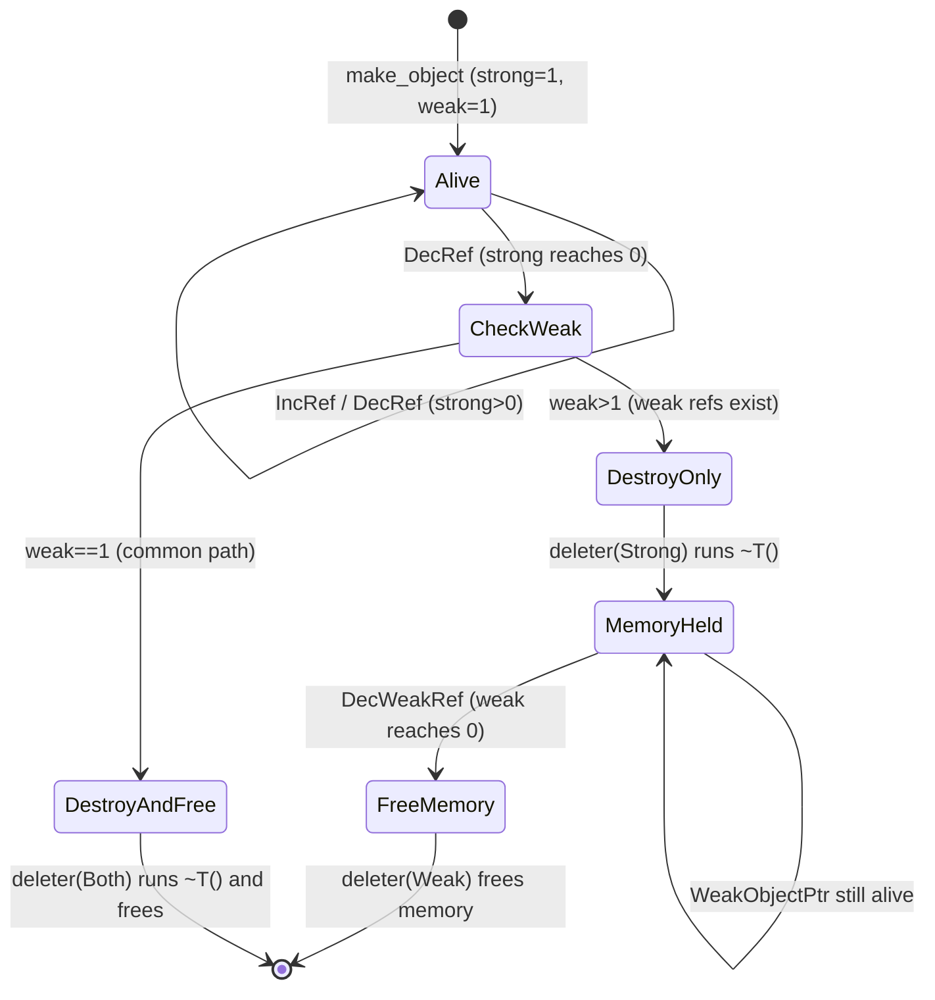

# Weak Reference Counting Design

**TL;DR**:
- The `TVMFFIObject` header was expanded from 16 bytes to 24 bytes to hold separate `strong_ref_count` (uint64) and `weak_ref_count` (uint32), enabling weak references that keep memory alive after an object's destructor has run.
- `WeakObjectPtr<T>` provides a non-owning smart pointer with a CAS-based `lock()` that atomically promotes to a strong reference (or returns nullptr if expired).
- A two-phase deleter protocol separates destruction (strong=0) from deallocation (weak=0), dispatched by a `TVMFFIObjectDeleterFlagBitMask` flags parameter on the deleter function.

## Problem Statement
### Background
- Before this change, the object system had only a single `int32_t ref_counter` for strong references. When the counter hit zero, the deleter immediately destroyed and freed the object.
- Some use cases (caches, observers, parent-child cycles) require holding a reference to an object without preventing its destruction. Without weak references, these patterns either leak memory (via cycles) or require manual out-of-band lifetime tracking.
- The `std::weak_ptr` / Rust `Arc`/`Weak` pattern is the well-established solution: separate strong and weak counters, with the destructor running when strong hits zero and memory freed when weak also hits zero.

### Solution
- Add a `weak_ref_count` (uint32_t) to the `TVMFFIObject` header, growing it from 16 to 24 bytes.
- Change the deleter signature to accept a `flags` bitmask indicating which phase (destroy, free, or both) to execute.
- Provide `WeakObjectPtr<T>` as the C++ smart pointer that increments/decrements the weak counter and uses compare-and-swap to safely promote to a strong reference.

### Goals
- Thread-safe weak reference support without global locks.
- Zero overhead on the common path (no weak references held): a single deleter call with `kBoth` flag.
- ABI-compatible with the existing allocator framework (allocators just need to handle the flags parameter).
- Non-goals: weak references from Python or Rust bindings (C++ only for now).

## Design

### TVMFFIObject Header Layout (24 bytes)

```
Offset  Size  Field
0       4     int32_t type_index
4       4     uint32_t weak_ref_count     (strong implicitly holds 1 weak ref)
8       8     uint64_t strong_ref_count
16      8     void (*deleter)(TVMFFIObject*, int flags) | int64_t __ensure_align
```

The initial state at object creation: `strong_ref_count=1`, `weak_ref_count=1`. The strong reference implicitly holds one weak reference -- this is the same convention as `std::shared_ptr` and Rust `Arc`.

### Deleter Flag Bitmask

```cpp
enum TVMFFIObjectDeleterFlagBitMask : int32_t {
  kTVMFFIObjectDeleterFlagBitMaskStrong = 1 << 0,  // run destructor
  kTVMFFIObjectDeleterFlagBitMaskWeak   = 1 << 1,  // free memory
  kTVMFFIObjectDeleterFlagBitMaskBoth   = Strong | Weak,  // common fast path
};
```

### Two-Phase Deletion Protocol



**Common path** (no external weak refs): When `strong_ref_count` reaches 0, check `weak_ref_count`. If it is 1 (only the implicit weak ref from the strong ref), call deleter once with `kBoth`. This avoids a second atomic decrement.

**Slow path** (weak refs exist): Call deleter with `kStrong` (destructor only), then decrement `weak_ref_count`. If that also reaches 0, call deleter with `kWeak` (free memory).

### DecRef Implementation

```cpp
void DecRef() {
    // Release-only decrement (fast path)
    if (__atomic_fetch_sub(&header_.strong_ref_count, 1, __ATOMIC_RELEASE) == 1) {
        // Strong count just hit zero. Check weak count (relaxed is fine).
        if (__atomic_load_n(&header_.weak_ref_count, __ATOMIC_RELAXED) == 1) {
            // Common fast path: no external weak refs
            __atomic_thread_fence(__ATOMIC_ACQUIRE);
            header_.deleter(&header_, kTVMFFIObjectDeleterFlagBitMaskBoth);
        } else {
            // Slow path: weak refs exist
            __atomic_thread_fence(__ATOMIC_ACQUIRE);
            header_.deleter(&header_, kTVMFFIObjectDeleterFlagBitMaskStrong);
            DecWeakRef();  // may trigger deleter(Weak)
        }
    }
}
```

### WeakObjectPtr<T>

```cpp
template<typename T>
class WeakObjectPtr {
public:
    WeakObjectPtr();                           // null
    WeakObjectPtr(nullptr_t);                  // null
    WeakObjectPtr(const ObjectPtr<T>& strong); // construct from strong, ++weak
    WeakObjectPtr(const WeakObjectPtr&);       // copy, ++weak
    WeakObjectPtr(WeakObjectPtr&&);            // move, no atomics
    template<typename U> WeakObjectPtr(const ObjectPtr<U>&);  // base-compatible
    template<typename U> WeakObjectPtr(const WeakObjectPtr<U>&);  // base-compatible
    ~WeakObjectPtr();                          // --weak

    ObjectPtr<T> lock() const;   // CAS-based promotion; nullptr if expired
    void reset();                // release weak ref
    void swap(WeakObjectPtr&);
    int use_count() const;       // strong count (for debugging)
    bool expired() const;        // strong==0 or null

    // Copy/move assignment operators
};
```

### CAS-Based Weak-to-Strong Promotion

`lock()` calls `Object::TryPromoteWeakPtr()`:

```cpp
bool TryPromoteWeakPtr() {
    uint64_t old_count = __atomic_load_n(&header_.strong_ref_count, __ATOMIC_RELAXED);
    while (old_count > 0) {
        if (__atomic_compare_exchange_n(&header_.strong_ref_count, &old_count,
                                         old_count + 1, true,
                                         __ATOMIC_ACQ_REL, __ATOMIC_RELAXED)) {
            return true;  // successfully incremented strong count
        }
        // CAS failed: old_count updated to current value, retry
    }
    return false;  // strong==0, object destroyed
}
```

### Allocator Integration

The `SimpleObjAllocator::Handler<T>::Deleter_` checks flag bits independently:

```cpp
static void Deleter_(TVMFFIObject* objptr, int flags) {
    T* tptr = details::ObjectUnsafe::RawObjectPtrFromUnowned<T>(objptr);
    if (flags & kTVMFFIObjectDeleterFlagBitMaskStrong) {
        tptr->T::~T();  // destroy object
    }
    if (flags & kTVMFFIObjectDeleterFlagBitMaskWeak) {
        delete reinterpret_cast<StorageType*>(tptr);  // free memory
    }
}
```

### Key Classes, Fields and Interfaces

| Symbol | Signature | Description |
|--------|-----------|-------------|
| `WeakObjectPtr<T>` | Template class | Non-owning weak reference smart pointer |
| `WeakObjectPtr<T>::lock()` | `ObjectPtr<T> lock() const` | CAS-based promotion to strong ref |
| `WeakObjectPtr<T>::expired()` | `bool expired() const` | True if object destroyed or null |
| `Object::TryPromoteWeakPtr()` | `bool TryPromoteWeakPtr()` | CAS loop incrementing strong if >0 |
| `Object::IncWeakRef()` | `void IncWeakRef()` | Atomic increment weak count |
| `Object::DecWeakRef()` | `void DecWeakRef()` | Atomic decrement; calls deleter(Weak) at 0 |
| `TVMFFIObjectDeleterFlagBitMask` | `enum : int32_t` | Strong=1, Weak=2, Both=3 |
| `TVMFFIObjectIncRef` | `int TVMFFIObjectIncRef(TVMFFIObjectHandle obj)` | C API strong ref increment |
| `TVMFFIObjectDecRef` | `int TVMFFIObjectDecRef(TVMFFIObjectHandle obj)` | C API strong ref decrement (was `TVMFFIObjectFree`) |
| `FObjectDeleter` | `void (*)(TVMFFIObject*, int flags)` | Deleter function type (added flags param) |

### Contracts, Assumptions and Invariants
- **weak_ref_count=1 at creation**: The strong reference implicitly holds one weak reference. This means `weak_ref_count` is always >= 1 while any strong reference exists.
- **Destruction before deallocation**: The destructor (`~T()`) always runs before memory is freed. When `strong_ref_count` reaches 0, the destructor runs immediately; memory persists until `weak_ref_count` also reaches 0.
- **CAS loop for promotion**: `lock()` is wait-free in practice (contention is rare) but not formally lock-free -- it retries on CAS failure. Returns nullptr deterministically when `strong_ref_count==0`.
- **Common path optimization**: When no external weak refs exist (`weak_ref_count==1`), the deleter is called exactly once with `kBoth`, avoiding the overhead of a separate `DecWeakRef` atomic operation.
- **MSVC uses `_InterlockedCompareExchange64`**: The CAS loop adapts to MSVC intrinsics for 64-bit compare-and-swap.

### Extension Points
- **Custom allocators**: Must update their `Deleter_` to handle the flags parameter. The two actions (destroy and free) must be independently dispatchable.
- **Language bindings**: Python/Rust bindings currently do not expose `WeakObjectPtr` but could wrap `TVMFFIObjectIncRef`/`TVMFFIObjectDecRef` + the weak ref C APIs if added in the future.

### Usage Examples

#### Breaking a reference cycle with weak references
**Context**: Parent holds strong ref to child; child holds weak ref back to parent.
```cpp
#include <tvm/ffi/object.h>
using namespace tvm::ffi;

ObjectPtr<ParentObj> parent = make_object<ParentObj>();
ObjectPtr<ChildObj> child = make_object<ChildObj>();
parent->child = child;                     // strong ref
child->parent = WeakObjectPtr<ParentObj>(parent);  // weak ref -- no cycle

// Check liveness from child
if (auto p = child->parent.lock()) {
    // parent still alive, use p->...
}

// When parent goes out of scope, its destructor runs immediately
// (child's weak ref does not prevent destruction)
parent.reset();
assert(child->parent.expired());
assert(child->parent.lock() == nullptr);
```

## Alternatives & Trade-offs
### Two uint64_t counters (32-byte header)
- Pros: Consistent counter width; no risk of weak count overflow on pathological use
- Cons: 32-byte header (+8 bytes over chosen design); wastes space since weak refs are expected to be rare. The `uint32_t` weak count supports ~4 billion concurrent weak refs which is more than sufficient.
### Single combined counter with bit splitting
- Pros: 16-byte header preserved; no ABI growth
- Cons: Complex bit manipulation; limits strong count range; harder to implement correct CAS; the strong count would lose bits, limiting maximum ref count.
### External weak reference table (no header change)
- Pros: Zero overhead on objects with no weak refs; no ABI change
- Cons: Requires global lock or concurrent hash map for the table; every weak ref operation involves a hash lookup; cache-unfriendly.

## Related Work
### Design Docs & ADRs
- `.knowledge/designs/object-system.md` -- Object header, ObjectPtr, DecRef
- `.knowledge/designs/memory.md` -- Allocator framework, deletion sequence
- `.knowledge/designs/c-abi.md` -- TVMFFIObject struct definition, C API functions
- `.knowledge/ADRs/014-weak-ref-24byte-header.md` -- Decision to use split counters with 24-byte header

### Evidence Matrix
- 24-byte header + WeakObjectPtr + two-phase deletion + CAS promotion -> `2025-09-01-ca9c3d10bb9640bffb972302f7064e49e592a526.md` + commit ca9c3d1
- TVMFFIObjectDecRef rename from TVMFFIObjectFree -> same commit
- TVMFFIObjectIncRef addition -> same commit
- Deleter flags bitmask -> same commit
- Cython binding updates (TVMFFIObjectFree -> TVMFFIObjectDecRef) -> same commit
- Version bump 0.1.0a5 -> 0.1.0a6 -> same commit
