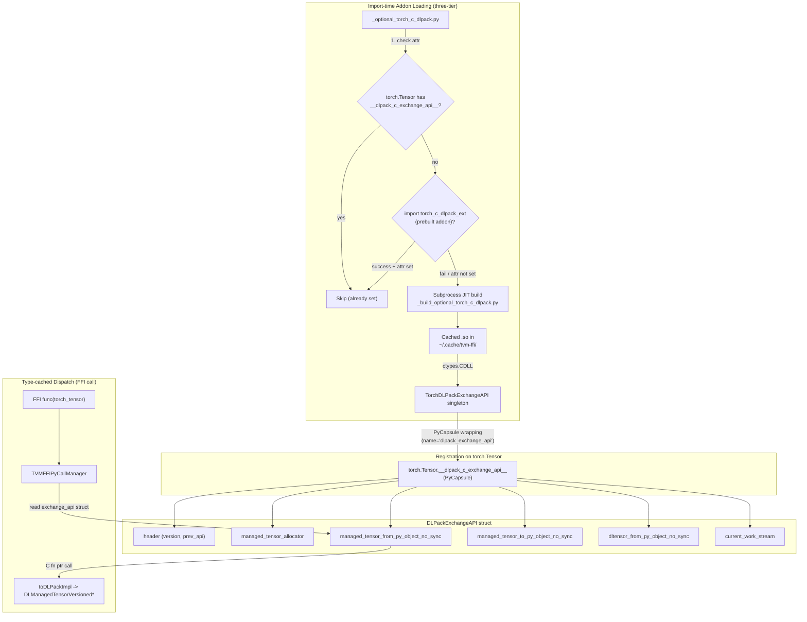

# DLPack Interop Layer (Torch Addon)

**TL;DR**
- The DLPack interop layer provides a JIT-compiled C++ extension (`_optional_torch_c_dlpack.py`) that implements high-performance, zero-Python-overhead DLPack conversion between PyTorch tensors and TVM FFI tensors, bypassing Python's `__dlpack__` protocol.
- A single `DLPackExchangeAPI` struct bundles five function pointers (managed tensor from/to, dltensor from, allocator, current_work_stream) and is exposed on `torch.Tensor` as a single `__dlpack_c_exchange_api__` class attribute, replacing the previous three separate dunder attributes. The struct supports ABI evolution via a `prev_api` linked-list header.
- Sub-byte dtype support (Float4, Float8 variants) uses the DLPack `lanes` field for packed types and requires torch version guards: `Float8_e8m0fnu` at torch >= 2.7, `Float4_e2m1fn_x2` at torch >= 2.8 (corrected in 8dbd281 from the previous combined >= 2.8 guard).
- Tensor allocation from loaded modules uses `TVMFFIEnvTensorAlloc` (C ABI) / `Tensor::FromEnvAlloc` (C++) to ensure metadata is allocated inside libtvm_ffi, preventing use-after-unload crashes.

## Problem Statement

### Background
- The standard Python `__dlpack__` protocol requires Python method calls, GIL overhead, and PyCapsule creation/destruction for each tensor conversion -- prohibitively expensive for high-frequency FFI calls.
- Sub-byte dtypes were added in PyTorch 2.7+ (`Float8_e8m0fnu`) and 2.8+ (`Float4_e2m1fn_x2`) along with DLPack, but the round-trip mapping between `DLDataType` and `ScalarType` was incomplete or incorrect for these types.
- Multi-dimensional tensors with size-1 dimensions had incorrect stride normalization during DLPack export, causing data corruption.

### Solution
- JIT-compile a C++ extension at import time (via `torch.utils.cpp_extension.load_inline`) that implements `toDLPackImpl<T>` and `fromDLPackImpl<T>` with direct C++ access to PyTorch tensor internals.
- Bundle five function pointers into a `DLPackExchangeAPI` struct (per DLPack proposal #175) and expose it as a single `__dlpack_c_exchange_api__` integer attribute on tensor classes. The type-cached dispatch system reads this struct to call conversion functions directly.
- Add `toScalarTypeForDLPackv1` as a custom DLDataType-to-ScalarType converter that handles all DLPack v1 type codes, including sub-byte types.
- All conversion functions use `_no_sync` naming, decoupling stream synchronization from tensor export/import. Stream querying is handled by a separate `current_work_stream` callback.
- Tensor allocation from loaded modules uses `TVMFFIEnvTensorAlloc` to allocate metadata inside libtvm_ffi, preventing module-unloading-order bugs.

### Goals
- **Goal**: Zero-Python-overhead tensor conversion between PyTorch and TVM FFI.
- **Goal**: Correct round-trip for all DLPack v1 dtype codes, including sub-byte types.
- **Goal**: Backward compatibility with PyTorch < 2.8 via preprocessor and `hasattr` guards.
- **Non-goal**: Support for non-PyTorch tensor frameworks (handled by the standard `__dlpack__` fallback path).

## Design



**Three-tier loading strategy** (f703a0c, a5241e5): `load_torch_c_dlpack_extension()` follows a three-tier loading order:
1. **Skip** if `torch.Tensor` already has `__dlpack_c_exchange_api__` (newer PyTorch versions may provide it natively).
2. **Prebuilt addon** -- try `import torch_c_dlpack_ext` (the AOT-compiled standalone package under `addons/torch_c_dlpack_ext/`). After import, verify the attribute was actually set before declaring success.
3. **JIT compile** -- fall back to building the C++ extension via `_build_optional_torch_c_dlpack.py` in a subprocess, caching the resulting `.so` in `$TVM_FFI_CACHE_DIR/torch_c_dlpack_addon/` (default `~/.cache/tvm-ffi/`), loaded via `ctypes.CDLL`.

**CUDA/ROCm device detection** (4fc83d7, 752ac8e): The device-type selection for addon loading/building is gated behind `torch.cuda.is_available()` first. Only when GPU hardware is actually present does the code check `torch.version.cuda` (CUDA) vs `torch.version.hip` (ROCm) to determine the GPU type. Without this gate, `torch.version.cuda` is non-None even in CPU-only environments.

**Platform-split JIT build strategy** (7a355c7): On Linux/macOS, the JIT build invokes the compiler directly (`c++ -std=c++17 ... -shared -o <lib>`) via `_run_build_on_linux_like`, eliminating the ninja dependency. On Windows, the existing ninja-based build path is preserved (`_generate_ninja_build_windows`). macOS uses `-Wl,-rpath,@loader_path` instead of Linux's `-Wl,-rpath,$ORIGIN`. Build output is captured (not printed to terminal) with errors collected into structured `RuntimeError`.

**`from_dlpack` exchange-API-first dispatch** (7f3f872): `_from_dlpack_universal()` now prioritizes the C-level exchange API: (1) `__dlpack_c_exchange_api__` -> (2) `__dlpack__` -> (3) PyCapsule. If exchange API conversion fails with `BufferError`, it falls back to `__dlpack__`. This establishes zero-Python-overhead tensor import as the default path.

**AOT addon package** (`torch_c_dlpack_ext`): A standalone pip-installable package under `addons/torch_c_dlpack_ext/` with a custom PEP 517 build backend (`build_backend.py`). The backend compiles the extension at wheel-build time via `tvm_ffi.utils._build_optional_torch_c_dlpack`, producing a version-tagged shared library named `libtorch_c_dlpack_addon_torch{major}{minor}-{cpu|cuda|rocm}.{so|dll|dylib}`. Multiple torch versions can coexist in the same cache directory. GitHub Actions workflows build and publish wheels:
- **Linux** (`torch_c_dlpack.yml`, `build_wheels_linux`): torch 2.4-2.9, Python 3.9-3.14, x86_64/aarch64, CUDA 13.0.
- **Windows** (`torch_c_dlpack_windows.yml`): torch 2.4-2.9, Python 3.9-3.14, x86_64, CUDA support (d1595c4).
- **macOS arm64** (`torch_c_dlpack.yml`, `build_wheels_macos`): torch versions matching macOS, CPU-only, uses `delocate-wheel` instead of `auditwheel` (d6bfb45).

**JIT build script** (`_build_optional_torch_c_dlpack.py`): A standalone build script supporting both AOT CLI mode and subprocess JIT invocation. Key features:
- Version-tagged library names prevent cache collisions across torch versions.
- File locking via `FileLock` for parallel-safe builds.
- Platform-specific linking: Linux omits Python library linking entirely; macOS and Windows link against `libtorch_python`.
- `TVM_FFI_DISABLE_TORCH_C_DLPACK=1` env var prevents circular import during build.
- `_LIB` module-level variable holds the `ctypes.CDLL` handle to prevent GC of the shared library while function pointers are still in use (bc2f408).

### Key Classes, Fields and Interfaces

**`DLPackExchangeAPI`** (C struct, declared in `dlpack/dlpack.h`, Cython binding in `base.pxi`):
```c
typedef struct {
    DLPackExchangeAPIHeader header;  // {version: {major, minor}, prev_api: DLPackExchangeAPI*}
    DLPackManagedTensorAllocator managed_tensor_allocator;
    DLPackManagedTensorFromPyObjectNoSync managed_tensor_from_py_object_no_sync;
    DLPackManagedTensorToPyObjectNoSync managed_tensor_to_py_object_no_sync;
    DLPackDLTensorFromPyObjectNoSync dltensor_from_py_object_no_sync;
    DLPackCurrentWorkStream current_work_stream;
} DLPackExchangeAPI;
```
- `header.prev_api` enables ABI evolution: newer structs can link to older versions via a linked list.
- `dltensor_from_py_object_no_sync` is a zero-copy, zero-refcount conversion filling a caller-owned `DLTensor` struct (no ownership transfer).
- `current_work_stream` decouples stream querying from tensor export.

**Function pointer typedefs** (Cython `base.pxi`):
- `DLPackManagedTensorAllocator(DLTensor*, DLManagedTensorVersioned**, void*, SetError) -> int`
- `DLPackManagedTensorFromPyObjectNoSync(void* py_object, DLManagedTensorVersioned**) -> int`
- `DLPackManagedTensorToPyObjectNoSync(DLManagedTensorVersioned*, void** out) -> int`
- `DLPackDLTensorFromPyObjectNoSync(void* py_object, DLTensor* out) -> int`
- `DLPackCurrentWorkStream(int device_type, int32_t device_id, void** out_stream) -> int`

**`TorchDLPackExchangeAPI`** (struct, inherits `DLPackExchangeAPI`):
- Implements all five function pointers as `private static` member functions.
- Constructor wires them into the base struct fields.
- `Global()` returns the singleton pointer.
- Exposed to Python as a `PyCapsule` (name `"dlpack_exchange_api"`) via `_create_dlpack_exchange_api_capsule(TorchDLPackExchangeAPIPtr())`. Prior to 7f3bb77, exposed as raw `int64_t`.

**Python class attribute**: `torch.Tensor.__dlpack_c_exchange_api__: PyCapsule` -- a `PyCapsule` wrapping the `DLPackExchangeAPI*` pointer with capsule name `"dlpack_exchange_api"`. Replaces the previous three separate attributes (`__c_dlpack_from_pyobject__`, `__c_dlpack_to_pyobject__`, `__c_dlpack_tensor_allocator__`). Migrated from raw `int` to `PyCapsule` in 7f3bb77 for type safety; backward compat preserved (see contracts below).

**`toDLPackImpl<T>(at::Tensor src) -> DLManagedTensorVersioned*`** (inline C++):
- Converts PyTorch tensor to DLPack versioned format.
- No stride normalization: source tensor strides are passed through unchanged for all tensor shapes. The previous 1D normalization workaround was fully removed in f4a65cd.
- Device mapping: `kCPU -> kDLCPU`, `kCUDA -> kDLCUDA`, `kHIP -> kDLROCM`, `kMPS -> kDLMetal`.

**`toDLPackNonOwningImpl(const Tensor&, DLTensor&) -> void`** (inline C++):
- New non-owning conversion filling a pre-allocated `DLTensor` struct.
- Used by `dltensor_from_py_object_no_sync` for zero-copy metadata inspection.

**`fromDLPackImpl<T>(DLManagedTensorVersioned* dlm) -> at::Tensor`** (inline C++):
- Converts DLPack versioned tensor back to PyTorch.
- Calls `toScalarTypeForDLPackv1(dtype)` instead of PyTorch's `at::toScalarType` for sub-byte type support.

**`toScalarTypeForDLPackv1(const DLDataType& dtype) -> ScalarType`** (inline C++):
- Full DLDataType-to-ScalarType mapping covering `kDLUInt`, `kDLInt`, `kDLFloat`, `kDLBfloat`, `kDLComplex`, `kDLBool`, plus Float8/Float4 variants.
- For `kDLFloat4_e2m1fn`: uses `dtype.lanes == 2` to map to `ScalarType::Float4_e2m1fn_x2`.

**`getDLDataTypeForDLPackv1(ScalarType scalar_type) -> DLDataType`** (inline C++):
- ScalarType-to-DLDataType mapping.
- `Float4_e2m1fn_x2`: correctly sets `{code=kDLFloat4_e2m1fn, bits=4, lanes=2}`.

**Cython exchange API accessor** (`cython/tensor.pxi`, added in 7f3bb77):
```cython
cdef int _get_dlpack_exchange_api(
    object dlpack_exchange_api_obj,
    const DLPackExchangeAPI** out_ptr
) except -1
```
Accepts either `int` (cast to pointer, backward compat) or `PyCapsule` with name `"dlpack_exchange_api"` (extract via `PyCapsule_GetPointer`). Raises `ValueError` if neither. Called from `function.pxi` dispatch instead of direct int-to-pointer cast.

**Python PyCapsule creator** (`_optional_torch_c_dlpack.py`, added in 7f3bb77):
```python
def _create_dlpack_exchange_api_capsule(ptr_as_int: int) -> PyCapsule
```
Creates a `PyCapsule` wrapping the raw pointer integer with capsule name `"dlpack_exchange_api"`. Used by both the JIT-loaded addon path and the int-to-PyCapsule upgrade path.

**Tensor allocation C API** (`include/tvm/ffi/extra/c_env_api.h`):

| Function | Signature | Notes |
|----------|-----------|-------|
| `TVMFFIEnvSetDLPackManagedTensorAllocator` | `int (DLPackManagedTensorAllocator, int write_to_global_context, DLPackManagedTensorAllocator* opt_out)` | Renamed from `TVMFFIEnvSetTensorAllocator` |
| `TVMFFIEnvGetDLPackManagedTensorAllocator` | `DLPackManagedTensorAllocator ()` | Renamed from `TVMFFIEnvGetTensorAllocator` |
| `TVMFFIEnvTensorAlloc` | `int (DLTensor* prototype, TVMFFIObjectHandle* out)` | New -- allocates metadata inside libtvm_ffi |

**`Tensor::FromEnvAlloc`** (C++, replaces `FromDLPackAlloc`):
```cpp
static Tensor FromEnvAlloc(
    int (*env_alloc)(DLTensor*, TVMFFIObjectHandle*),
    ShapeView shape, DLDataType dtype, DLDevice device);
```

**Cython dtype lookup tables** (`cython/dtype.pxi`):
- `TORCH_DTYPE_TO_DL_DATA_TYPE: dict[torch.dtype, DLDataType]` -- ~25 entries for standard types, plus `hasattr`-guarded conditional entries for `float8_e8m0fnu` and `float4_e2m1fn_x2`. Renamed from `TORCH_DTYPE_TO_DTYPE` in 5a87749 for clarity.
- `NUMPY_DTYPE_TO_DL_DATA_TYPE: dict[numpy.dtype, DLDataType]` -- 11 standard entries merged with `MLDTYPES_DTYPE_TO_DL_DATA_TYPE`. Renamed from `NUMPY_DTYPE_TO_DTYPE` in 5a87749.
- `MLDTYPES_DTYPE_TO_DL_DATA_TYPE: dict[numpy.dtype, DLDataType]` -- 8 unconditional entries for `ml_dtypes` types available in all versions (`int4`, `uint4`, `bfloat16`, `float8_e4m3b11fnuz`, `float8_e4m3fn`, `float8_e4m3fnuz`, `float8_e5m2`, `float8_e5m2fnuz`) plus 8 conditional entries guarded by `hasattr(ml_dtypes, "int2")` for `ml_dtypes >= 0.5` types (`int2`, `uint2`, `float8_e3m4`, `float8_e4m3`, `float8_e8m0fnu`, `float6_e2m3fn`, `float6_e3m2fn`, `float4_e2m1fn`) (9574e9d). The `float4_e2m1fn` registration in `_dtype.py` is similarly guarded behind `hasattr(ml_dtypes, "float4_e2m1fn")` (c897e4c).

**Bool dtype encoding** (ae346ec): The `"bool"` dtype is now represented as `{code=kDLBool(6), bits=8, lanes=1}` instead of the previous `{code=kDLUInt(1), bits=1, lanes=1}`. This aligns with the DLPack v1 specification where `kDLBool` is a dedicated type code. Python `DataTypeCode.BOOL = 6` enum entry was added. Bool dtype now supports lanes (e.g., `"boolx4"`).

### Contracts, Assumptions and Invariants
- **Sub-byte encoding convention**: Sub-byte types like Float4 use `DLDataType.lanes` to encode packing (e.g., `Float4_e2m1fn_x2` = `{code=kDLFloat4_e2m1fn, bits=4, lanes=2}`).
- **Stride pass-through invariant**: All tensors preserve their original strides in DLPack export without any normalization. The 1D normalization workaround from PyTorch gh-83069 was removed entirely (f4a65cd).
- **Torch version guards** (corrected in 8dbd281): `Float8_e8m0fnu` is guarded by `#if (TORCH_VERSION_MAJOR > 2) || (TORCH_VERSION_MAJOR == 2 && TORCH_VERSION_MINOR >= 7)` (available since torch 2.7). `Float4_e2m1fn_x2` is guarded by `#if (TORCH_VERSION_MAJOR > 2) || (TORCH_VERSION_MAJOR == 2 && TORCH_VERSION_MINOR >= 8)` (available since torch 2.8). The previous pattern `MAJOR >= 2 && MINOR >= N` was incorrect for `MAJOR > 2` where `MINOR` could be 0; the corrected pattern uses `(MAJOR > M) || (MAJOR == M && MINOR >= N)`. Cython side uses `hasattr(torch, "float8_e8m0fnu")` / `hasattr(torch, "float4_e2m1fn_x2")` respectively.
- **`make_tensor_from_chandle` ownership contract** (fixed in 7092774): When a TVM FFI tensor is returned to Python and successfully converted to a framework tensor via `managed_tensor_to_py_object_no_sync`, the Cython code creates a `DLManagedTensorVersioned` whose deleter holds its own reference to the underlying tensor. The original `chandle` is therefore a surplus reference and must be decremented via `TVMFFIObjectDecRef(chandle)`. On the error path, the DLManagedTensorVersioned must be freed via `dlpack.deleter(dlpack)` since ownership was not transferred.
- **Module-unloading-safe allocation**: `TVMFFIEnvTensorAlloc` allocates the `TensorObj` wrapper (including `DLManagedTensorVersioned` metadata) inside libtvm_ffi rather than the calling module. This prevents use-after-unload when the calling module is unloaded before the tensor is destroyed. `Tensor::FromEnvAlloc` is the C++ wrapper for this pattern.
- **Bool dtype invariant** (ae346ec): `"bool"` is `{kDLBool, 8, 1}`, not `{kDLUInt, 1, 1}`. All dtype consumers must use `DataTypeCode.BOOL == 6` (not `kDLUInt == 1`) for bool detection.
- **`from_dlpack` dispatch order** (7f3f872): Exchange API is always tried first when `__dlpack_c_exchange_api__` exists, then `__dlpack__`, then PyCapsule. Memory leak fix: on `TVMFFITensorFromDLPackVersioned` failure, the managed tensor's deleter is called to reclaim it.
- **Failure mode -- JIT compilation failure**: If the torch DLPack addon cannot be loaded (prebuilt package not installed, and JIT compilation fails -- e.g., no compiler), the addon is silently disabled and tensor conversion falls back to the standard Python `__dlpack__` protocol.
- **Symbol visibility** (7cd2e50): The JIT-built `.so` uses `-fvisibility=hidden` to export only explicitly marked symbols, reducing symbol table pollution.
- **ctypes.CDLL lifetime contract** (bc2f408): The `ctypes.CDLL` handle for the loaded addon must be kept alive at module scope (`_LIB`). If garbage-collected while `__dlpack_c_exchange_api__` still references its function pointer, the pointer becomes dangling.
- **Prebuilt import verification** (a5241e5): After `import torch_c_dlpack_ext`, the loader verifies `hasattr(torch.Tensor, "__dlpack_c_exchange_api__")`. If the attribute was not set (e.g., import succeeded but the library was incompatible), it falls through to JIT.
- **Circular import during build** (a5241e5): The build backend sets `TVM_FFI_DISABLE_TORCH_C_DLPACK=1` during subprocess calls to prevent recursive torch DLPack loading when `tvm_ffi` is imported inside the build script.
- **PyCapsule-based exchange API attribute** (7f3bb77): `__dlpack_c_exchange_api__` is now a `PyCapsule` (capsule name `"dlpack_exchange_api"`) instead of a raw `int`. Backward compat: `_get_dlpack_exchange_api` in Cython accepts both `int` and `PyCapsule`. On the setting side, if an existing `int` value is detected (e.g., from an older addon), `load_torch_c_dlpack_extension()` eagerly upgrades it to `PyCapsule` via `_create_dlpack_exchange_api_capsule`. The prebuilt addon (`torch_c_dlpack_ext`) similarly wraps its `int64_t` return value in a `PyCapsule`.

### Extension Points
- **New torch dtype mappings**: Add entries to `TORCH_DTYPE_TO_DTYPE` with `hasattr` guards for version safety. Add corresponding C++ cases in `getDLDataTypeForDLPackv1`/`toScalarTypeForDLPackv1` with `TORCH_VERSION` preprocessor guards.
- **New framework addons**: Implement `DLPackExchangeAPI`, expose a singleton, and set `__dlpack_c_exchange_api__` on the framework's tensor class (see Usage Examples below).
- **ABI evolution**: New function pointers can be added by creating a new struct version with `header.prev_api` pointing to the old one.
- **Cross-compilation JIT flags** (6d8b134): `TVM_FFI_JIT_EXTRA_CFLAGS` and `TVM_FFI_JIT_EXTRA_LDFLAGS` environment variables inject additional compiler/linker flags into the JIT build pipeline (e.g., for cross-compilation with `--target` and `--sysroot`).

### Usage Examples

#### torch -> TVM FFI tensor via DLPackExchangeAPI
**Context**: Passing a PyTorch tensor to a TVM FFI function with zero Python overhead after first-call cache warmup.
```python
import tvm_ffi
import torch

fecho = tvm_ffi.get_global_func("testing.echo")

# First call: factory discovers torch.Tensor.__dlpack_c_exchange_api__,
# reads the DLPackExchangeAPI struct, caches the managed_tensor_from_py_object_no_sync fn ptr
# Subsequent calls: O(1) dispatch through cached C function pointer
t = torch.randn(3, 4, device="cuda")
result = fecho(t)  # C-level: struct->managed_tensor_from_py_object_no_sync -> DLManagedTensorVersioned
```

#### Implementing DLPackExchangeAPI for a custom framework
**Context**: Any framework can implement the protocol by populating a `DLPackExchangeAPI` struct.
```c++
struct MyExchangeAPI : public DLPackExchangeAPI {
  MyExchangeAPI() {
    header.version = {DLPACK_MAJOR_VERSION, DLPACK_MINOR_VERSION};
    header.prev_api = nullptr;
    managed_tensor_from_py_object_no_sync = MyFromPyObjectNoSync;
    managed_tensor_to_py_object_no_sync = MyToPyObjectNoSync;
    current_work_stream = MyCurrentWorkStream;
    // optional: managed_tensor_allocator, dltensor_from_py_object_no_sync
  }
  static const DLPackExchangeAPI* Global() { static MyExchangeAPI inst; return &inst; }
};
// Python: wrap pointer in PyCapsule (name="dlpack_exchange_api"):
// capsule = _create_dlpack_exchange_api_capsule(
//     reinterpret_cast<int64_t>(MyExchangeAPI::Global()))
// setattr(MyTensor, "__dlpack_c_exchange_api__", capsule)
// Note: raw int is still accepted for backward compat via _get_dlpack_exchange_api
```

#### Allocating tensors from a loaded module
**Context**: C++ kernel allocating output tensors using the environment allocator to avoid module-unloading-order bugs.
```cpp
#include <tvm/ffi/extra/c_env_api.h>

ffi::Tensor return_add_one(ffi::TensorView x) {
  ffi::Tensor y = ffi::Tensor::FromEnvAlloc(
      TVMFFIEnvTensorAlloc,         // metadata allocated inside libtvm_ffi
      ffi::Shape({x.size(0)}),
      DLDataType{kDLFloat, 32, 1},
      x.device());
  // ... launch kernel writing into y ...
  return y;
}
```

#### External dtype conversion
**Context**: Passing torch/numpy dtype objects directly as FFI arguments.
```python
import tvm_ffi
import torch
import numpy as np

fecho = tvm_ffi.get_global_func("testing.echo")

# torch.dtype -> DLDataType (via Cython setter, O(1) lookup)
result = fecho(torch.float32)
assert result.type_code == 2  # kDLFloat
assert result.bits == 32

# numpy.dtype -> DLDataType
result = fecho(np.dtype(np.int64))
assert result.type_code == 0  # kDLInt
assert result.bits == 64
```

### Evolution Timeline

| Commit | Change |
|--------|--------|
| `4dee97f` | Initial Float4_e2m1fn_x2 support with TORCH_VERSION guard |
| `929effa` | Fix f4 `getDLDataTypeForDLPackv1` (lanes=2, bits=4); add `toScalarTypeForDLPackv1` |
| `53ffe5e` | Restrict stride normalization to 1D tensors |
| `71dea75` | Fix `ndim()` -> `dim()` API call |
| `d77606a` | Add `TORCH_DTYPE_TO_DTYPE`, `NUMPY_DTYPE_TO_DTYPE`, `MLDTYPES_DTYPE_TO_DTYPE` lookup tables; dtype arg setters |
| `b03cc78` | Guard Float4 cases behind `TORCH_VERSION >= 2.8` |
| `eb5492a` | Guard `Float8_e8m0fnu` in both C++ and Cython; `hasattr`-guarded conditional dict insertion |
| `22a7894` | Replace three separate function pointers with `DLPackExchangeAPI` struct; add `_no_sync` naming, `dltensor_from_py_object_no_sync`, `current_work_stream` |
| `965fc46` | Fix `__dlpack_version__` to use DLPack header constants; add C++ exchange API tests |
| `ef54bda` | Refactor Torch exchange API to static member functions of `TorchDLPackExchangeAPI` struct |
| `f679fe5` | Rename `TVMFFIEnvSet/GetTensorAllocator` -> `TVMFFIEnvSet/GetDLPackManagedTensorAllocator`; add `TVMFFIEnvTensorAlloc`; replace `Tensor::FromDLPackAlloc` with `Tensor::FromEnvAlloc` |
| `3373853` | Skip JIT compilation when `__dlpack_c_exchange_api__` already exists on torch.Tensor |
| `9574e9d` | Guard 8 ml_dtypes>=0.5-only dtype entries behind hasattr check |
| `e6a654a` | Extract torch C DLPack addon build into standalone script with AOT/JIT caching |
| `bc2f408` | Fix ctypes.CDLL GC: keep module-level `_LIB` reference |
| `7057705` | Refactor build script: version-tagged library names, separate build/output dirs |
| `a06d0df` | Fix Linux build: remove Python library linking |
| `f703a0c` | Add AOT standalone package `torch_c_dlpack_ext` with PEP 517 build backend |
| `a5241e5` | Fix import + prebuilt loading verification in `torch_c_dlpack_ext` |
| `da570b0` | Add GitHub Actions workflow for torch-c-dlpack-ext PyPI release |
| `c897e4c` | Guard float4_e2m1fn dtype behind ml_dtypes >= 0.5 check |
| `75c2a2b` | Refactor torch-c-dlpack-ext CI: merge build jobs, extract build script, add cp314 |
| `6d8b134` | Add `TVM_FFI_JIT_EXTRA_CFLAGS`/`TVM_FFI_JIT_EXTRA_LDFLAGS` env vars for cross-compilation |
| `8ee0e49` | Bump torch-c-dlpack-ext to 0.1.2, switch JIT build to `-O3` |
| `752ac8e` | Add ROCm backend support (`--build-with-rocm`, device detection via `torch.version.hip`) |
| `d1595c4` | Add Windows CI workflow and `build_aot_wheels.bat` for torch-c-dlpack-ext |
| `4fc83d7` | Fix CUDA availability check: gate behind `torch.cuda.is_available()` before version strings |
| `d6bfb45` | Add macOS arm64 wheel builds; fix `.so` extension on macOS; use `delocate-wheel` |
| `7f3f872` | Exchange-API-first dispatch in `_from_dlpack_universal`; memory leak fix on failure path |
| `ae346ec` | Bool dtype changed from `{kDLUInt, 1, 1}` to `{kDLBool, 8, 1}`; `DataTypeCode.BOOL = 6` |
| `5a87749` | Dtype map renames (`*_TO_DL_DATA_TYPE`); `make_dtype_from_dl_data_type` helper; env var rename |
| `8dbd281` | Fix torch version guard: `Float8_e8m0fnu` at >= 2.7 (was >= 2.8); split combined guard; fix `MAJOR >= M && MINOR >= N` comparison to `(MAJOR > M) \|\| (MAJOR == M && MINOR >= N)` |
| `7a355c7` | Remove ninja dependency for non-Windows JIT builds; direct compiler invocation |
| `74f53c5` | Remove `--no-as-needed` linker flag from Linux JIT build |
| `7cd2e50` | Add `-fvisibility=hidden` to JIT build; bump to 0.1.3 |
| `7f3bb77` | `__dlpack_c_exchange_api__` migrated from raw `int` to `PyCapsule` (name `"dlpack_exchange_api"`); `_get_dlpack_exchange_api` Cython accessor; backward compat int-to-capsule upgrade |
| `5393647` | Rename `__c_dlpack_exchange_api__` -> `__dlpack_c_exchange_api__` across full stack; `_check_and_update_dlpack_c_exchange_api()` backward compat; env var renamed `TVM_FFI_SKIP_DLPACK_C_EXCHANGE_API` |
| `4147ba7` | Fix `from_dlpack` fallback to use `_get_dlpack_exchange_api` for PyCapsule extraction |
| `91c64b7` | Fix int8 (`ScalarType::Char`) missing from DLPack dtype mapping for torch < 2.6; fix version check macro |

## Alternatives & Trade-offs
### Standard Python `__dlpack__` protocol only
- Pros: No JIT compilation, no torch-specific code, simpler.
- Cons: Each conversion involves Python method call, PyCapsule allocation, GIL contention. Unacceptable overhead for high-frequency FFI calls (the speed-converter path is ~10x faster).

### Static (ahead-of-time) compiled torch extension
- Pros: No JIT compilation latency on first import; reproducible builds.
- Cons: Requires matching the exact torch C++ ABI at build time. The JIT approach compiles against the user's installed torch, automatically matching ABI version. The cold-start cost is paid once and cached.
- **Update (f703a0c)**: The AOT approach is now supported via the `torch_c_dlpack_ext` addon package. The three-tier loading strategy (skip > prebuilt > JIT) gives the best of both worlds: zero latency when prebuilt wheels are installed, with JIT fallback for unsupported configurations. The prebuilt wheel CI builds for torch 2.4-2.9 x {CPU, CUDA, ROCm} x {Linux x86_64/aarch64, macOS arm64, Windows x86_64}.

## Related Work
### Design Docs & ADRs
- [0015-python-ffi-call-dispatch.md](0015-python-ffi-call-dispatch.md) -- Type-cached dispatch that consumes the exchange API
- [0014-python-package.md](0014-python-package.md) -- Python package structure, `_optional_torch_c_dlpack.py` location
- [0008-containers.md](0008-containers.md) -- Tensor type that DLPack converts to/from
- [ADR 0021-dlpack-exchange-api-struct.md](../ADRs/0021-dlpack-exchange-api-struct.md) -- Decision to use `DLPackExchangeAPI` struct

### Evidence Matrix
- `DLPackExchangeAPI` struct, `_no_sync` naming, `current_work_stream` -> `22a78943b783.md` (22a7894)
- `TVMFFIEnvTensorAlloc`, `FromEnvAlloc`, env function renames -> `f679fe54cf2e.md` (f679fe5)
- Torch exchange API refactored to static member functions -> `ef54bdac61f4.md` (ef54bda)
- Skip-loading optimization for newer PyTorch -> `33738534976882.md` (3373853)
- `toScalarTypeForDLPackv1`, f4 dtype fix -> `2025-09-18-929effa0.md` (929effa)
- Dtype lookup tables, arg setters -> `2025-09-19-d77606af.md` (d77606a)
- Cython tensor DLPack return path memory leak fix -> `2025-10-03-70927743.md` (7092774)
- AOT/JIT torch addon build pipeline, three-tier loading -> `2025-10-28-e6a654a.md` (e6a654a), `2025-10-31-f703a0c.md` (f703a0c), `2025-11-04-a5241e5.md` (a5241e5)
- ml_dtypes version-conditional dtype entries -> `2025-10-28-9574e9d.md` (9574e9d), `2025-11-05-c897e4c.md` (c897e4c)
- Torch DLPack release CI workflow -> `2025-11-03-da570b0.md` (da570b0)
- ROCm backend support, `--build-with-rocm` -> `2025-11-10-752ac8ed2a76b5dcdf1655116b9449c207b872f0.md` (752ac8e)
- CUDA availability gate fix -> `2025-11-11-4fc83d789052be1a30ca4678cd8cfb0250413e1d.md` (4fc83d7)
- Exchange-API-first `from_dlpack` dispatch -> `2025-11-12-7f3f8726156ab6e33f781562afafd9c6f219551f.md` (7f3f872)
- Bool dtype kDLBool/8 change -> `2025-11-14-ae346ec92a3c386f1376064ae086aae72947c329.md` (ae346ec)
- Torch version guard fix for Float8_e8m0fnu (>= 2.7), comparison pattern fix -> `2025-11-21-8dbd28112cddbaeeffa26420b1dee98a582a7cd7.md` (8dbd281)
- PyCapsule-based exchange API attribute, `_get_dlpack_exchange_api`, backward compat int->capsule upgrade -> `2025-11-26-7f3bb77155645f90f7d221889b3795704ffd7d6f.md` (7f3bb77)
- Plus 15 supporting commits (CI refactoring, version bumps, build improvements, macOS/Windows support, dtype renames, ninja removal, symbol hiding, linker fixes)
