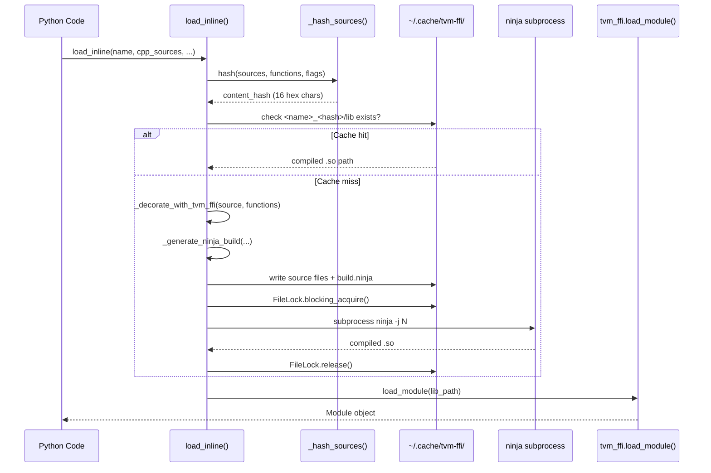

# Inline Module Compilation Design

**TL;DR**:
- `tvm_ffi.cpp.load_inline()` JIT-compiles inline C++ and/or CUDA source code into a shared library, loads it via `tvm_ffi.load_module()`, and returns a `Module` object whose functions are immediately callable from Python. `tvm_ffi.cpp.build()` and `tvm_ffi.cpp.load()` provide file-based equivalents that compile from source files on disk (since c897e4c).
- Compiled modules are cached in a content-addressable directory (`~/.cache/tvm-ffi/<name>_<hash>`) keyed by SHA-256 of all inputs (source, function mappings, flags). Concurrent builds are serialized by `tvm_ffi.utils.FileLock`.
- The build is driven by Ninja, with generated `build.ninja` files that compile C++ (via `$CXX`) and optionally CUDA (via `nvcc`) sources, then link into a single shared library.

## Problem Statement
### Background
- Users writing custom kernels for the FFI must create a separate CMake project, compile it externally, and load the `.so` via `tvm_ffi.load_module()`. This workflow is friction-heavy for prototyping and experimentation.
- PyTorch's `torch.utils.cpp_extension.load_inline` demonstrated that inline compilation with caching dramatically improves developer productivity. The FFI needed an analogous capability.
- The generated code must bridge user functions (which take `tvm::ffi::TensorView` or `DLTensor*` and other C types) to the FFI's packed calling convention via `TVM_FFI_DLL_EXPORT_TYPED_FUNC`. Since 1ec6236, `tvm::ffi::TensorView` (non-owning view) is the preferred parameter type for inline module functions, superseding `tvm::ffi::Tensor`.

### Solution
- A pure-Python module (`tvm_ffi.cpp.extension`, renamed from `tvm_ffi.cpp.load_inline` in c897e4c) that provides two compilation workflows:
  - **Inline** (`load_inline`/`build_inline`): decorates user source with FFI headers and export macros, generates a Ninja build file, compiles via subprocess, and loads the result via the existing module system.
  - **File-based** (`build`/`load`, since c897e4c): compiles C++/CUDA from source files on disk without automatic decoration — users must include FFI headers and export macros manually. Both workflows share a common `_build_impl()` helper.
- Content-addressable caching with file-based locking prevents redundant recompilation.

### Goals
- Single-function API: pass source code strings, get back a callable Module.
- Automatic CUDA support (architecture detection via `nvidia-smi` or `TVM_FFI_CUDA_ARCH_LIST`).
- Cache correctness: any change to source, functions, or flags triggers recompilation.
- Non-goals: incremental compilation; dependency tracking beyond content hashing; Windows CUDA support (not yet tested). Windows C++ support was added in 2df07e5 and fully fixed in 4383b1a (MSVC developer environment discovery); macOS support was fixed in 4ffbc88.

## Design

### End-to-End Workflow



### Source Decoration

`_decorate_with_tvm_ffi(source, functions)` prepends FFI headers and appends export macros:

```cpp
// Auto-prepended headers:
#include <tvm/ffi/function.h>
#include <tvm/ffi/dtype.h>
#include <tvm/ffi/error.h>
#include <tvm/ffi/extra/c_env_api.h>
#include <tvm/ffi/container/tensor.h>   // added in 742b16e, enables tvm::ffi::Tensor

// User source code inserted here

// Auto-appended for each function in the functions list:
// Exported name == C++ function name (unified convention since 825aeb9)
TVM_FFI_DLL_EXPORT_TYPED_FUNC(func_name, func_name);
// The generated symbol is __tvm_ffi_func_name (prefix applied by macro since 40e8a51)
```

For CUDA source, `cuda_runtime.h` is also included.

### Ninja Build Generation

`_generate_ninja_build(...)` produces a `build.ninja` file with platform-specific rules:

**Unix/macOS:**
- C++ compilation rules: `$CXX -O2 -fPIC -std=c++17 {extra_cflags} -I{include_paths}`
- CUDA compilation rules (if cuda_source): `nvcc -O2 -std=c++17 --compiler-options '-fPIC' -gencode {arch_flags} {extra_cuda_cflags}`
- Link rule: `$CXX -shared -L{tvm_ffi_lib_path} -ltvm_ffi -o {lib_name} {objects} {extra_ldflags}`

**Windows (MSVC, added in 2df07e5):**
- C++ compilation rules: `cl /std:c++17 /MD /EHsc {warning_suppressions} -c $in /Fo$out` with `deps = msvc` + `/showIncludes`
- Link rule: `$CXX $in /link $ldflags /DLL /LIBPATH:{tvm_ffi_lib_dir} {tvm_ffi_lib}.lib /out:$out`
- Colon escaping: Windows drive letter colons (`C:`) are escaped as `$:` in ninja paths

All platforms explicitly link against `libtvm_ffi` (Unix: `-L<path> -ltvm_ffi`, Windows: import library). The output extension is `.so` on Unix or `.dll` on Windows. Parallelism: controlled by `MAX_JOBS` env var.

**Windows MSVC Developer Environment** (added in 4383b1a):
On Windows, `_build_ninja()` delegates to `_run_command_in_dev_prompt()`, which locates the Visual Studio installation via `vswhere.exe` (from `C:\Program Files (x86)\Microsoft Visual Studio\Installer\vswhere.exe`), finds `VsDevCmd.bat`, and runs `cmd.exe /c "VsDevCmd.bat -arch=x64 & ninja ..."`. This ensures that `cl.exe`, `link.exe`, and all required MSVC environment variables (`PATH`, `INCLUDE`, `LIB`) are available to Ninja without requiring the user to manually launch a Developer Command Prompt.

### Content-Addressable Cache

Cache key: `SHA-256(cpp_sources + cuda_sources + functions + extra_cflags + extra_cuda_cflags + extra_ldflags + extra_include_paths)`, truncated to 16 hex chars. (Parameters unified in 825aeb9: `cpp_functions`/`cuda_functions` merged into `functions`.)

Cache directory: `$TVM_FFI_CACHE_DIR/<name>_<hash>/` (default `$TVM_FFI_CACHE_DIR` = `~/.cache/tvm-ffi`).

Cache layout:
```
~/.cache/tvm-ffi/hello_a1b2c3d4e5f6g7h8/
    main.cc          # decorated C++ source
    main.cu          # decorated CUDA source (if any)
    build.ninja      # generated build file
    libhello.so      # compiled shared library
    .lock            # file lock for concurrent builds
```

### FileLock Utility

```python
class FileLock:
    def __init__(self, lock_file_path: str): ...
    def acquire(self) -> bool:                            # non-blocking, returns True if acquired
    def blocking_acquire(self, timeout=None, poll_interval=0.1): ...  # blocks until acquired
    def release(self): ...
    def __enter__(self): ...  # blocking_acquire
    def __exit__(self, ...): ...  # release
```

Platform dispatch: `fcntl.flock(LOCK_EX | LOCK_NB)` on Unix, `msvcrt.locking(LK_NBLCK)` on Windows.

### CUDA Architecture Detection

`_get_cuda_target()` determines `-gencode` flags:
1. Check `TVM_FFI_CUDA_ARCH_LIST` env var (comma-separated, e.g., `"7.0,8.0"`)
2. Query `nvidia-smi --query-gpu=compute_cap --format=csv,noheader`
3. Fall back to `compute_70`

### File-Based Build API (since c897e4c)

The file-based API compiles C++/CUDA from **source files on disk** (as opposed to inline source strings). Unlike `load_inline`/`build_inline`, the file-based API does **not** auto-decorate sources with FFI headers or export macros — users must include `<tvm/ffi/function.h>` and use `TVM_FFI_DLL_EXPORT_TYPED_FUNC` manually in their source files.

Both inline and file-based APIs delegate to a shared `_build_impl()` internal helper (since c897e4c), which handles ninja generation, locking, and compilation. The `_generate_ninja_build()` function was refactored to accept explicit `cpp_files`/`cuda_files` lists (multiple files per category) instead of assuming a single hardcoded `main.cpp`/`cuda.cu`, producing indexed object files (`cpp_0.o`, `cpp_1.o`, ...).

**Module rename**: `load_inline.py` was renamed to `extension.py` in c897e4c. The import path `from tvm_ffi.cpp import ...` continues to work; the old `from tvm_ffi.cpp.load_inline import ...` is broken.

### Cubin Embedding Parameter (since d49effdb)

`load_inline` and `build_inline` accept an optional `embed_cubin: Mapping[str, bytes]` parameter that embeds pre-compiled cubin data into the resulting shared library. Each key in the mapping becomes the name used with `TVM_FFI_EMBED_CUBIN(name)` in the C++ source; each value is the raw cubin bytes (e.g., from `tvm_ffi.cpp.nvrtc.nvrtc_compile`).

The implementation writes each cubin to a temporary file, compiles the C++ source to an intermediate object file, then uses `tvm_ffi.utils.embed_cubin` to merge the cubin data into the object before final linking. The cubin bytes are included in `_hash_sources` for cache correctness.

See `.knowledge/designs/0021-cuda-extra-headers.md` for full details on the cubin launcher C++ API and embedding workflow.

### Key Classes, Fields and Interfaces

| Symbol | Signature | Description |
|--------|-----------|-------------|
| `tvm_ffi.cpp.load_inline` | `(name, *, cpp_sources=None, cuda_sources=None, functions=None, extra_cflags=None, extra_cuda_cflags=None, extra_ldflags=None, extra_include_paths=None, build_directory=None, embed_cubin: Mapping[str, bytes]=None) -> Module` | JIT-compile and load inline C++/CUDA (API renamed in 825aeb9; `embed_cubin` param since d49effdb) |
| `tvm_ffi.cpp.build` | `(name, *, cpp_files=None, cuda_files=None, extra_cflags=None, extra_cuda_cflags=None, extra_ldflags=None, extra_include_paths=None, build_directory=None) -> str` | Compile file-based C++/CUDA into shared library; returns path (since c897e4c) |
| `tvm_ffi.cpp.load` | `(name, *, cpp_files=None, cuda_files=None, extra_cflags=None, extra_cuda_cflags=None, extra_ldflags=None, extra_include_paths=None, build_directory=None) -> Module` | Calls `build()` then `load_module()` on the result (since c897e4c) |
| `tvm_ffi.utils.FileLock` | `FileLock(lock_file_path: str)` | Cross-platform advisory file lock |
| `FileLock.acquire` | `() -> bool` | Non-blocking lock attempt; returns `False` if already held by same instance (since 021d78d) |
| `FileLock.blocking_acquire` | `(timeout=None, poll_interval=0.1) -> bool` | Blocking lock with optional timeout; raises `RuntimeError` if already held by same instance (since 021d78d) |
| `_build_impl` | Internal | Shared implementation for `build()`, `build_inline()`, and `load_inline()` (since c897e4c) |
| `_hash_sources` | Internal | SHA-256 content hash for cache keying; accepts optional `cpp_files`/`cuda_files` for file-based builds |
| `_find_cuda_home` | Internal, `@lru_cache` | CUDA installation discovery |
| `_get_cuda_target` | Internal | Determines nvcc `-gencode` flags |
| `_generate_ninja_build` | Internal | Produces `build.ninja` content; supports multi-file builds with indexed object files (since c897e4c) |
| `_decorate_with_tvm_ffi` | Internal | Prepends FFI headers (including `container/tensor.h` since 742b16e), appends export macros |
| `_run_command_in_dev_prompt` | Internal (Windows) | Locates VS via `vswhere.exe`, sources `VsDevCmd.bat`, runs command in MSVC env (added in 4383b1a) |
| `build_ninja` | `(build_dir: str) -> None` | Run ninja in build directory; renamed from `_build_ninja` to public (since e6a654a) |

### Environment Variables

| Variable | Default | Description |
|----------|---------|-------------|
| `TVM_FFI_CACHE_DIR` | `~/.cache/tvm-ffi` | Build cache root directory |
| `TVM_FFI_CUDA_ARCH_LIST` | (auto-detect) | CUDA architecture targets, comma-separated |
| `MAX_JOBS` | (ninja default) | Ninja parallelism limit |
| `CXX` | `c++` | C++ compiler path |
| `CUDA_HOME` / `CUDA_PATH` | (auto-detect) | CUDA installation directory |

### Contracts, Assumptions and Invariants
- **Cache correctness**: Any change to any input parameter changes the hash and triggers a new build. The old cache entry is not deleted.
- **FileLock serialization**: Concurrent `load_inline` calls with the same cache key will block on the file lock. The first builder compiles; subsequent callers find the cached result.
- **FileLock re-entrance guard** (since 021d78d): A single `FileLock` instance cannot be acquired twice without an intervening `release()`. `acquire()` returns `False`; `blocking_acquire()` raises `RuntimeError("Lock is already held by this instance.")`. This prevents fd leaks and infinite loops.
- **Ninja must be installed**: The build requires `ninja` in PATH. No fallback to `make` or direct compiler invocation. Since 236e9e9, `pip install tvm-ffi[cpp]` (or `[test]` or `[torch]`) auto-installs it.
- **Inline vs file-based decoration**: For `load_inline`/`build_inline`, the generated source includes all necessary FFI headers and export macros automatically. For `build()`/`load()` (file-based), users must include headers and use `TVM_FFI_DLL_EXPORT_TYPED_FUNC` manually.
- **Function mapping is explicit** (inline API only): Users must provide the `functions` parameter (list or dict mapping exported names to docstrings). Exported name must match the C++ function name. There is no automatic discovery. The file-based API does not use the `functions` parameter.
- **Export macro placement**: Export macros are placed in the primary source (C++ if present, CUDA otherwise). When only `cuda_sources` is provided (no `cpp_sources`), export macros go into `cuda.cu` directly, enabling CUDA-only modules without a C++ forward declaration (since 1ce0f6f).
- **Compiled module links libtvm_ffi**: On all platforms, the compiled shared library explicitly links against `libtvm_ffi` to resolve FFI symbols (fixed for macOS in 4ffbc88, Windows in 2df07e5).

### Extension Points
- New language backends (e.g., HIP): add a new source parameter and compilation rule in `_generate_ninja_build`.
- Custom build systems: replace Ninja generation with CMake or other build system generation.
- Module caching policy: implement cache eviction in `TVM_FFI_CACHE_DIR`.

### Usage Examples

#### JIT-compiling a CPU kernel
**Context**: Quick prototyping of a custom tensor operation. Since 1ec6236, `tvm::ffi::TensorView` is the preferred parameter type for non-owning access (auto-included by the source decorator).
```python
import tvm_ffi.cpp
import numpy as np

mod = tvm_ffi.cpp.load_inline(
    name="add_one",
    cpp_sources="""
        void add_one(tvm::ffi::TensorView x, tvm::ffi::TensorView y) {
            int n = x->shape[0];
            float* xd = static_cast<float*>(x->data);
            float* yd = static_cast<float*>(y->data);
            for (int i = 0; i < n; ++i) yd[i] = xd[i] + 1.0f;
        }
    """,
    functions=["add_one"],
)

x = np.array([1, 2, 3], dtype=np.float32)
y = np.empty_like(x)
mod.add_one(x, y)  # calls via Module.__getattr__ -> GetFunction
assert np.allclose(y, [2, 3, 4])
```

#### CUDA-only module (no C++ forward declaration needed)
**Context**: Writing a pure-CUDA module without redundant C++ forward declarations (since 1ce0f6f).
```python
mod = tvm_ffi.cpp.load_inline(
    name="gpu_add",
    cuda_sources=r"""
        __global__ void AddOneKernel(float* x, float* y, int n) {
            int i = blockIdx.x * blockDim.x + threadIdx.x;
            if (i < n) y[i] = x[i] + 1.0f;
        }
        void add_one_cuda(tvm::ffi::TensorView x, tvm::ffi::TensorView y) {
            int n = x->shape[0];
            AddOneKernel<<<(n+255)/256, 256>>>(
                static_cast<float*>(x->data), static_cast<float*>(y->data), n);
        }
    """,
    functions=["add_one_cuda"],  # export macros go into cuda.cu directly
)
```

#### Mixed C++/CUDA compilation with stream interop
**Context**: Writing a CUDA kernel that respects the FFI stream context.
```python
mod = tvm_ffi.cpp.load_inline(
    name="gpu_add",
    cpp_sources="""
        void add_one_cuda(tvm::ffi::TensorView x, tvm::ffi::TensorView y);  // forward declaration
    """,
    cuda_sources="""
        __global__ void AddOneKernel(float* x, float* y, int n) {
            int i = blockIdx.x * blockDim.x + threadIdx.x;
            if (i < n) y[i] = x[i] + 1.0f;
        }
        void add_one_cuda(tvm::ffi::TensorView x, tvm::ffi::TensorView y) {
            int n = x->shape[0];
            cudaStream_t stream = static_cast<cudaStream_t>(
                TVMFFIEnvGetStream(x->device.device_type, x->device.device_id));
            AddOneKernel<<<(n+255)/256, 256, 0, stream>>>(
                static_cast<float*>(x->data), static_cast<float*>(y->data), n);
        }
    """,
    functions=["add_one_cuda"],
)

import torch
x = torch.ones(1024, device="cuda")
y = torch.empty_like(x)
mod.add_one_cuda(x, y)  # stream automatically captured from torch
```

#### File-based build and load (since c897e4c)
**Context**: Compiling from source files on disk (users manage their own FFI headers and export macros).
```python
import tvm_ffi.cpp
import numpy as np

# Build from a .cc file that already contains TVM_FFI_DLL_EXPORT_TYPED_FUNC
output_lib_path = tvm_ffi.cpp.build(
    name="hello",
    cpp_files=["my_kernel.cc"],
)

# Load and use
mod = tvm_ffi.load_module(output_lib_path)
x = np.array([1, 2, 3], dtype=np.float32)
y = np.empty_like(x)
mod.add_one_cpu(x, y)

# Or as a single step:
mod = tvm_ffi.cpp.load(name="hello", cpp_files=["my_kernel.cc"])
```

## Alternatives & Trade-offs
### Use torch.utils.cpp_extension.load_inline directly
- Pros: Battle-tested; already handles CUDA compilation; wide user familiarity
- Cons: Hard dependency on PyTorch; uses PyTorch's compilation conventions (pybind11); does not produce FFI-compatible modules with `TVM_FFI_DLL_EXPORT_TYPED_FUNC` export convention
### CMake-based JIT compilation
- Pros: Full CMake feature set; better dependency tracking; cross-platform
- Cons: Much slower startup (CMake configure step); harder to cache; overkill for single-file compilations
### Ahead-of-time compilation only (no JIT)
- Pros: No runtime compilation overhead; deterministic builds
- Cons: High friction for prototyping; requires separate build step for every change

## Related Work
### Design Docs & ADRs
- `.knowledge/designs/0013-module-system.md` -- Module loading (`load_module`), `TVM_FFI_DLL_EXPORT_TYPED_FUNC`
- `.knowledge/designs/function-system.md` -- Packed calling convention, `TVM_FFI_DLL_EXPORT_TYPED_FUNC` macro
- `.knowledge/designs/0015-python-packaging.md` -- Header/library discovery via `libinfo.py`
- `.knowledge/designs/c-abi.md` -- `TVMFFISafeCallType`, `TVMFFIEnvGetStream`

### Evidence Matrix
- `load_inline` + Ninja build + content cache + FileLock + CUDA detection -> `2025-09-05-83805ec949227620d05e61358a4ecb4f0c931979.md` + commit 83805ec
- `tvm_ffi.cpp` package + `tvm_ffi.utils` package -> same commit
- API rename (`cpp_sources`, `functions`, `build_directory`) -> `2025-09-06-825aeb9.md` + commit 825aeb9
- Windows support (MSVC, DLL linking, colon escaping) -> `2025-09-08-2df07e5.md` + commit 2df07e5
- macOS support (libtvm_ffi linking) -> `2025-09-08-4ffbc88.md` + commit 4ffbc88
- File-based `build()`/`load()` + `_build_impl` + module rename -> `2025-11-05-c897e4c9.md` + commit c897e4c
- FileLock re-entrance guard + tests -> `2025-11-04-021d78db.md` + commit 021d78d
- `build_ninja` renamed from `_build_ninja` (public) -> `2025-10-28-e6a654a.md` + commit e6a654a
- `embed_cubin` parameter + hash update + ninja build integration -> `2025-11-25-d49effdb22392363050e1f2d85cd4b31bf242cf0.md` + commit d49effdb
- Plus 3 supporting commits (236e9e9 ninja dep, 1ce0f6f CUDA-only, 742b16e Tensor auto-include)
