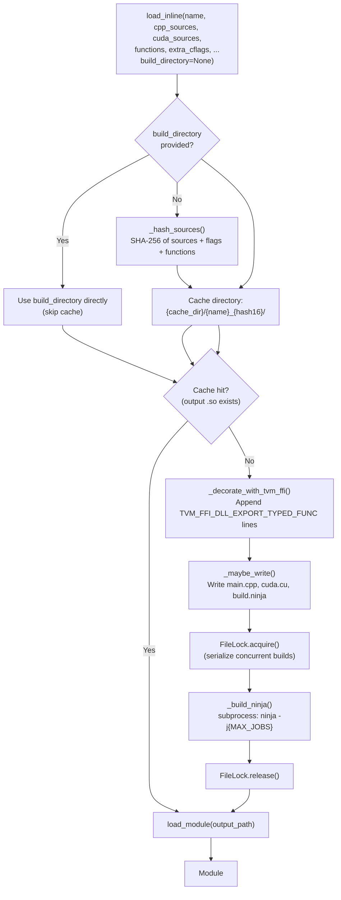

# Inline Module Compilation (load_inline)

**TL;DR**
- `tvm_ffi.cpp.load_inline()` is a PyTorch-`torch.utils.cpp_extension.load_inline`-inspired API that JIT-compiles inline C++ and/or CUDA source code into a TVM FFI `Module`, using `TVM_FFI_DLL_EXPORT_TYPED_FUNC` to export functions and `ninja` to build.
- Uses a content-addressed build cache (`~/.cache/tvm-ffi` or `$TVM_FFI_CACHE_DIR`) with SHA-256 hashing to avoid redundant recompilation, and a cross-platform `FileLock` to serialize concurrent builds in the same cache directory.
- The compilation pipeline: source decoration with FFI macros -> content-addressed cache lookup -> ninja build file generation -> subprocess compilation -> `load_module()` -> `Module`.

## Problem Statement

### Background

Users of the TVM FFI often need to quickly prototype C++ or CUDA functions and call them from Python without setting up a full CMake project. The existing workflow requires creating a shared library project with CMakeLists.txt, compiling, and loading via `tvm_ffi.load_module()`. This is too heavyweight for interactive development and rapid prototyping.

### Solution

A Python-side JIT compilation API (`tvm_ffi.cpp.load_inline`) that accepts inline C++ and/or CUDA source strings, automatically decorates them with FFI export macros, compiles via ninja, caches the result, and returns a loaded `Module` ready for function calls.

### Goals

- **Goal**: Enable one-call JIT compilation of C++/CUDA source from Python.
- **Goal**: Automatic caching to avoid redundant recompilation.
- **Goal**: Cross-platform support (Linux, macOS, Windows).
- **Goal**: CUDA compilation support alongside C++ host code.
- **Non-goal**: Incremental compilation of complex multi-file projects.
- **Non-goal**: Replacing the CMake-based packaging workflow for production modules.

## Design

### Compilation Pipeline



### API Surface

```python
tvm_ffi.cpp.load_inline(
    name: str,                                    # Module name (used for cache directory)
    *,
    cpp_sources: str | Sequence[str] = "",        # C++ host source code (joined with newlines)
    cuda_sources: str | Sequence[str] = "",       # CUDA source code (joined with newlines)
    functions: Sequence[str] | Mapping[str, str] | str = [],
                                                  # Functions to export. Mapping maps name->docstring.
    extra_cflags: list[str] = [],                 # Additional C++ compiler flags
    extra_cuda_cflags: list[str] = [],            # Additional CUDA compiler flags
    extra_ldflags: list[str] = [],                # Additional linker flags
    extra_include_paths: list[str] = [],          # Additional include directories
    build_directory: str | None = None            # Explicit build dir (bypasses cache)
) -> Module
```

**API alignment with PyTorch** (commit `825aeb9` #18274): Parameters were renamed to match `torch.utils.cpp_extension.load_inline`:
- `cpp_source` -> `cpp_sources` (accepts `Sequence[str]` for multiple source fragments)
- `cuda_source` -> `cuda_sources` (accepts `Sequence[str]`)
- `cpp_functions` / `cuda_functions` -> unified `functions` parameter
- Added `build_directory` for debugging (bypasses content-addressed cache)

The `functions` parameter accepts three forms: `Sequence[str]` (names with empty docstrings), `Mapping[str, str]` (names to docstrings), or `str` (single name).

**CUDA-only export dispatch** (commit `1ce0f6f` #18307): When `cpp_sources` is empty and only `cuda_sources` is provided, the `functions` list is exported from the CUDA source file (`cuda.cu`) instead of the C++ source file (`main.cpp`). This eliminates the previous requirement of providing forward declarations in `cpp_sources` for CUDA-defined functions. When `cpp_sources` is non-empty, behavior is unchanged (functions are exported from `main.cpp`). The dispatch is controlled by the `with_cpp` boolean in `_decorate_with_tvm_ffi()`. **Invariant**: exactly one of `cpp_source` or `cuda_source` receives the `functions` dict for decoration; the other receives an empty dict.

### Source Decoration

`_decorate_with_tvm_ffi()` transforms user source by:
1. Prepending standard FFI headers: `<tvm/ffi/dtype.h>`, `<tvm/ffi/error.h>`, `<tvm/ffi/extra/c_env_api.h>`, `<tvm/ffi/function.h>`, `<tvm/ffi/container/tensor.h>` (auto-included since commit `742b16e` so user code can use `ffi::Tensor` without explicit include).
2. Appending `TVM_FFI_DLL_EXPORT_TYPED_FUNC(exported_name, source_func_name)` for each function in `cpp_functions` / `cuda_functions`.

### Content-Addressed Cache

- Cache root: `$TVM_FFI_CACHE_DIR` or `~/.cache/tvm-ffi`.
- Cache key: SHA-256 hash of `(cpp_sources, cuda_sources, functions, extra_cflags, extra_cuda_cflags, extra_ldflags, extra_include_paths)`. First 16 hex digits used in directory name.
- `build_directory` bypass: When `build_directory` is provided, cache hashing is skipped entirely and the given directory is used directly. Created with `os.makedirs(build_dir, exist_ok=True)`.
- Layout: `{cache_dir}/{name}_{hash16}/main.cpp`, `cuda.cu`, `build.ninja`, `{name}.so`.
- Cache invalidation: content-addressed (any input change produces a different hash). No timestamp-based invalidation.
- Limitation: transitive header changes are not captured by the hash. Ninja's depfile tracking partially mitigates this for incremental builds within the same directory.

### Ninja Build Generation

`_generate_ninja_build()` produces a platform-aware `build.ninja` with:
- C++ compilation rule: C++17, `-fPIC`, include paths for TVM FFI headers and DLPack.
- CUDA compilation rule (optional): NVCC with `--compiler-options -fPIC`, architecture list from `$TVM_FFI_CUDA_ARCH_LIST`.
- Link rule: shared library output linking against `libtvm_ffi`.

**Platform-specific build invariants**:

| Aspect | Unix (Linux/macOS) | Windows (MSVC) |
|---|---|---|
| Compile rule deps | `depfile = $out.d` / `deps = gcc` | `deps = msvc` / `/showIncludes` |
| Compile flags | `-std=c++17 -fPIC` | `/std:c++17 /MD /EHsc /wd*` |
| Link output | `$CXX -shared $in -o $out -L<path> -ltvm_ffi` | `link.exe /DLL $in /link $ldflags /out:$out` |
| Library extension | `.so` (Linux), `.dylib` (macOS) | `.dll` |
| Library linkage | `-L<lib_path> -ltvm_ffi` | `/LIBPATH:<lib_path> tvm_ffi.lib` |
| Path escaping | None | Colon escape for drive letters (`C:` -> `C$:`) |
| Error encoding | `utf-8` | `oem` (MSVC OEM code page) |

The library location is resolved via `find_libtvm_ffi()` from `tvm_ffi.libinfo`.

**Explicit library linkage requirement**: `TVM_FFI_DLL_EXPORT_TYPED_FUNC`-generated symbols reference FFI runtime functions. On Linux, `-shared` with lazy binding resolves these at `dlopen` time, but macOS's strict linker (`ld64`) and Windows's MSVC linker require explicit linkage to `libtvm_ffi`. The Unix link rule was fixed to include `-ltvm_ffi` in commit `4ffbc88` (#18285).

### MSVC Developer Prompt (Windows)

On Windows, `_build_ninja()` wraps the ninja subprocess call in `_run_command_in_dev_prompt()` (added in commit `4383b1a` #11), which:
1. Locates Visual Studio via `vswhere.exe` (in `%ProgramFiles(x86)%\Microsoft Visual Studio\Installer\`).
2. Finds the latest VS installation path via `vswhere -latest -prerelease -products * -property installationPath`.
3. Constructs the path to `VsDevCmd.bat` (`{vs_install_path}\Common7\Tools\VsDevCmd.bat`).
4. Runs the build command via `cmd.exe`: `"{VsDevCmd.bat}" -arch=x64 & {ninja command}`.

This ensures `cl.exe`, `link.exe`, and other MSVC toolchain binaries are on `PATH` during the build, which is required because typical Python installations do not include the MSVC developer environment. On non-Windows platforms, `subprocess.run` is called directly without wrapping.

**Failure mode**: If `vswhere.exe` is not found or no Visual Studio installation exists, a `RuntimeError` is raised with the original command for debugging.

### Cross-Platform FileLock

`python/tvm_ffi/utils/lockfile.py` provides advisory file locking:
- Unix: `fcntl.flock(fd, LOCK_EX)` for blocking, `LOCK_NB` for non-blocking.
- Windows: `msvcrt.locking(fd, LK_NBLCK, 1)` with polling for blocking acquire.
- Used by `load_inline` to serialize concurrent builds in the same cache directory.

### Environment Variables

| Variable | Default | Purpose |
|---|---|---|
| `TVM_FFI_CACHE_DIR` | `~/.cache/tvm-ffi` | Cache root directory |
| `TVM_FFI_CUDA_ARCH_LIST` | (auto-detect) | CUDA target architectures |
| `CXX` | system default | C++ compiler |
| `MAX_JOBS` | `os.cpu_count()` | Ninja parallelism |

### Key Classes, Fields and Interfaces

- **`tvm_ffi.cpp.load_inline()`** (`python/tvm_ffi/cpp/load_inline.py`): Public API entry point. Returns `Module`. Internally calls `build_inline()` then `load_module()`.
- **`tvm_ffi.cpp.build_inline()`** (`python/tvm_ffi/cpp/load_inline.py`): Compile-only entry point (commit `4fcf94f`). Returns the path to the built shared library without loading it. Useful when users need to control loading separately (e.g., distributing compiled binaries, debugging build issues, or using alternative loaders).
- **`FileLock`** (`python/tvm_ffi/utils/lockfile.py`): Cross-platform advisory file lock. Methods: `acquire(blocking, timeout)`, `release()`, context manager support.

### Contracts, Assumptions and Invariants

- **Ninja required**: `ninja` must be on `$PATH`. Raises `RuntimeError` if not found.
- **C++ compiler required**: A C++17-compatible compiler must be available (via `$CXX` or system default).
- **CUDA toolkit required**: Only when `cuda_source` is non-empty. `nvcc` must be on `$PATH`.
- **Header availability**: TVM FFI headers and DLPack headers must be findable via `tvm_ffi.libinfo.find_include_path()` and `find_dlpack_include_path()`.
- **Cache directory writability**: The cache directory must be writable by the current user.
- **Single-file compilation**: Each `load_inline` call produces at most two source files (main.cpp + cuda.cu). Multi-file projects should use the CMake packaging workflow.

### Extension Points

- **New source languages**: The pipeline could be extended to support HIP or other GPU languages by adding new compilation rules to the ninja build generator.
- **Custom build backends**: The ninja dependency could be abstracted behind a build backend interface.
- **Cache management**: A cache cleanup utility could be added to remove stale entries.

## Alternatives & Trade-offs

### Alternative: Direct compiler invocation (no ninja)

- Pros: No ninja dependency. Simpler for single-file builds.
- Cons: No incremental builds. No depfile tracking. Harder to extend to multi-file compilations.

### Alternative: CMake for JIT compilation

- Pros: More powerful, handles complex build configurations.
- Cons: Heavyweight for single-file compilation. Requires CMake at runtime. Slower than ninja.

### Alternative: torch.utils.cpp_extension.load_inline

- Pros: Already exists in PyTorch ecosystem.
- Cons: Tied to PyTorch build infrastructure. Does not produce TVM FFI-compatible modules. Does not use `TVM_FFI_DLL_EXPORT_TYPED_FUNC`.

## Related Work

### Design Docs & ADRs

- [`.knowledge/designs/0008-module-export-system.md`](0008-module-export-system.md) -- `TVM_FFI_DLL_EXPORT_TYPED_FUNC` consumed by the decoration step
- [`.knowledge/designs/0013-module-system.md`](0013-module-system.md) -- `load_module` consumed by the loading step
- [`.knowledge/designs/0014-python-bindings.md`](0014-python-bindings.md) -- Python package architecture
- [`.knowledge/designs/0016-packaging-and-build.md`](0016-packaging-and-build.md) -- Build system context

### Platform Support Status

| Platform | Status | Notes |
|---|---|---|
| Linux (GCC/Clang) | Supported | Primary development platform |
| macOS (Clang) | Supported | Fixed in commit `4ffbc88` (#18285); requires explicit `-ltvm_ffi` linkage |
| Windows (MSVC) | Supported | Fixed in commit `2df07e5` (#18281); MSVC dev prompt integration added in `4383b1a` (#11) via `_run_command_in_dev_prompt()`, removing all `xfail` markers from Windows tests |

### Evidence Matrix

- load_inline implementation -> `.knowledge/commits/2025-09-05-83805ec949227620d05e61358a4ecb4f0c931979.md` + `83805ec`
- API alignment with torch (cpp_sources, cuda_sources, functions, build_directory) -> `.knowledge/commits/2025-09-06-825aeb9aff00911cc8500aeec9ebb3ade738b015.md` + `825aeb9`
- Windows MSVC fix (flags, colon escaping, OEM encoding, DLL linkage) -> `.knowledge/commits/2025-09-08-2df07e52ef8c8008be4ffa3a29e3f541ca98c1c2.md` + `2df07e5`
- macOS fix (explicit -ltvm_ffi linkage) -> `.knowledge/commits/2025-09-08-4ffbc88b60f659a74619035e699986792c071e8d.md` + `4ffbc88`
- Non-Linux xfail markers -> `.knowledge/commits/2025-09-07-236e9e9e7378f9f9b7de0e01acbc48c3dd57c323.md` + `236e9e9`
- Windows xfail + version bump 0.1.0a9 -> `.knowledge/commits/2025-09-09-8068d1df64275452ced5d7a960a4468f663f50de.md` + `8068d1d`
- CUDA-only export dispatch (functions exported from cuda.cu when cpp_sources empty) -> `.knowledge/commits/2025-09-12-1ce0f6fa8f7ed99e2972daaf9b69598c630f4244.md` + `1ce0f6f`
- MSVC developer prompt integration (_run_command_in_dev_prompt, vswhere discovery, VsDevCmd.bat wrapping) -> `.knowledge/commits/2025-09-14-4383b1a6d81f5403879e9266f3d0924a289c227a.md` + `4383b1a`
- Auto-include tensor.h in decorated sources + load_inline documentation -> `.knowledge/commits/2025-09-14-742b16e5c71cf388e3bf8834763755448f3f0033.md` + `742b16e`
- build_inline extraction (compile-only API) -> `.knowledge/commits/2025-09-29-4fcf94f6e2dcce9901e0e42c30c7d4d57487619d.md` + `4fcf94f`
