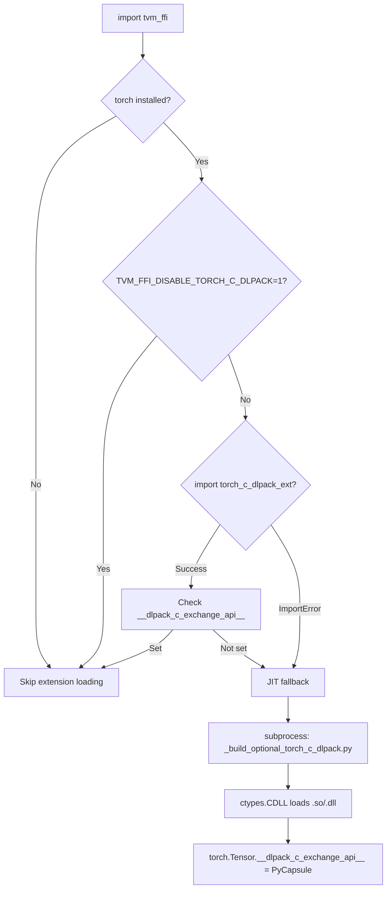

# Torch DLPack Addon: AOT and JIT Extension for PyTorch Tensor Exchange

**TL;DR**
- The `torch_c_dlpack_ext` addon provides a pre-built (AOT-compiled) shared library implementing the `DLPackExchangeAPI` struct for PyTorch, enabling zero-Python-overhead tensor exchange between PyTorch and TVM FFI without JIT compilation at import time.
- Two compilation paths exist: JIT (automatic subprocess build on first `import tvm_ffi` with torch installed, cached at `~/.cache/tvm-ffi`) and AOT (pre-built `torch_c_dlpack_ext` pip package). The AOT path takes priority; JIT is the fallback.
- A multi-platform CI pipeline (Linux x86_64/aarch64, macOS ARM64, Windows) builds per-PyTorch-version wheels across torch 2.4--2.9 with CPU, CUDA, and ROCm device variants.

## Problem Statement

### Background
- PyTorch's standard `__dlpack__` protocol goes through Python (PyCapsule creation, GIL round-trip), adding overhead on every tensor exchange.
- The `DLPackExchangeAPI` C struct ([ADR-0015](../ADRs/0015-dlpack-exchange-api-struct.md)) enables zero-Python-overhead exchange, but requires a C++ shared library that bridges PyTorch's internal DLPack implementation to the API struct.
- JIT-compiling this extension at `import tvm_ffi` time is slow and requires a C++ compiler on the user's machine. Cross-compilation scenarios (e.g., riscv64 sysroot) need custom compiler flags.

### Solution
- A standalone `addons/torch_c_dlpack_ext/` package with a custom PEP 517 build backend that conditionally compiles the native library at wheel build time.
- A ninja-based build pipeline (`_build_optional_torch_c_dlpack.py`) shared between JIT and AOT paths.
- Version-specific library naming (`libtorch_c_dlpack_addon_torch{M}{m}-{cpu|cuda|rocm}.{so|dll}`) allowing multiple PyTorch versions to coexist.

### Goals
- Eliminate JIT compile latency on first import for users who install the addon.
- Support CPU, CUDA, and ROCm device variants.
- Support cross-compilation via `TVM_FFI_JIT_EXTRA_CFLAGS`/`TVM_FFI_JIT_EXTRA_LDFLAGS`.
- Non-goal: this addon becomes unnecessary once PyTorch ships DLPack v1.2 support natively.

## Design



### Key Classes, Fields and Interfaces

```python
# === Build pipeline (python/tvm_ffi/utils/_build_optional_torch_c_dlpack.py) ===

def main() -> None:
    """Build libtorch_c_dlpack_addon_{version}-{device}.{so|dll}.
    Uses FileLock for concurrent-build safety. Builds in temp dir, output to --output-dir.
    Two-path build strategy (7a355c7): non-Windows uses _run_build_on_linux_like (direct c++ invocation),
    Windows uses _generate_ninja_build_windows (retains ninja)."""
    # Interacts with: tvm_ffi.libinfo.find_dlpack_include_path
    # Interacts with: tvm_ffi.utils.lockfile.FileLock
    # Interacts with: tvm_ffi.cpp.extension.build_ninja (Windows-only, deferred import)
    # Invariant: imports are deferred inside main() to avoid cyclic imports
    # Invariant: ninja dependency eliminated on Linux/macOS (7a355c7)
    # Extension: --build-with-cuda, --build-with-rocm (mutually exclusive)

def _run_build_on_linux_like(
    build_dir: Path, libname: str, source_path: Path,
    extra_cflags: Sequence[str], extra_ldflags: Sequence[str],
    extra_include_paths: Sequence[str],
) -> None:
    """Build by direct compiler invocation (non-Windows). Added in 7a355c7."""
    # Interacts with: $CXX env var (default "c++")
    # Invariant: macOS uses -Wl,-rpath,@loader_path; Linux uses -Wl,-rpath,$ORIGIN
    # Invariant: subprocess.run(check=False, capture_output=True) with structured error assembly

def _generate_ninja_build_windows(
    build_dir: Path, libname: str, source_path: Path,
    extra_cflags: Sequence[str], extra_ldflags: Sequence[str],
    extra_include_paths: Sequence[str],
) -> None:
    """Generate build.ninja for MSVC (Windows-only). Renamed from _generate_ninja_build in 7a355c7."""
    # Interacts with: tvm_ffi.cpp.extension.build_ninja (ninja runner)

def parse_env_flags(env_var_name: str) -> list[str]:
    """Parse shell-style flags from env var via shlex.split."""
    # Extension: reusable for any env-var-driven flag injection

# Environment variables:
# TVM_FFI_DISABLE_TORCH_C_DLPACK=1  -- skip auto-loading at import time
# TVM_FFI_CACHE_DIR                  -- override default ~/.cache/tvm-ffi
# TVM_FFI_JIT_EXTRA_CFLAGS           -- extra cflags for cross-compilation
# TVM_FFI_JIT_EXTRA_LDFLAGS          -- extra ldflags for cross-compilation

# === Loader (python/tvm_ffi/_optional_torch_c_dlpack.py) ===

def load_torch_c_dlpack_extension() -> Any:
    """Load torch c dlpack extension. Priority:
    1. import torch_c_dlpack_ext (AOT prebuilt)
    2. Check if __dlpack_c_exchange_api__ was set by AOT (or old __c_dlpack_exchange_api__, auto-migrated)
    3. JIT build via subprocess + ctypes.CDLL
    Sets both torch.Tensor.__dlpack_c_exchange_api__ (PyCapsule) and __c_dlpack_exchange_api__ (int, legacy).
    Renamed from __c_dlpack_exchange_api__ to __dlpack_c_exchange_api__ in 5393647."""
    # Interacts with: _check_and_update_dlpack_c_exchange_api (backward compat shim, 5393647)
    # Interacts with: _create_dlpack_exchange_api_capsule (7f3bb77)
    # Invariant: caches at TVM_FFI_CACHE_DIR / version-specific lib name
    # Invariant: backward compatible -- old __c_dlpack_exchange_api__ auto-migrated to new name

def _create_dlpack_exchange_api_capsule(ptr_as_int: int) -> PyCapsule:
    """Wrap DLPackExchangeAPI pointer in PyCapsule with name 'dlpack_exchange_api'. Added 7f3bb77."""
    # Interacts with: ctypes.pythonapi.PyCapsule_New
    # Invariant: capsule name must be b"dlpack_exchange_api"

# === AOT addon package (addons/torch_c_dlpack_ext/) ===

# build_backend.py -- custom PEP 517 backend wrapping setuptools
def build_wheel(...) -> str:
    """Build wheel; compile torch C DLPack lib if not prebuilt."""
    # Interacts with: _build_optional_torch_c_dlpack (subprocess)
    # Invariant: sets TVM_FFI_DISABLE_TORCH_C_DLPACK=1 in subprocess env to break circular import

# Library naming: libtorch_c_dlpack_addon_torch{major}{minor}-{cpu|cuda|rocm}.{so|dll}
# Invariant: major/minor from torch.__version__.split(".")[:2]

# === GPU device detection (canonical pattern) ===
# Two-step guard:
#   if torch.cuda.is_available():
#       if torch.version.cuda is not None: device = "cuda"
#       elif torch.version.hip is not None: device = "rocm"
#       else: raise ValueError(...)
#   else: device = "cpu"
# Invariant: torch.version.cuda can be non-None even without GPU
```

### Contracts, Assumptions and Invariants
- **AOT-before-JIT priority**: The loader always tries `import torch_c_dlpack_ext` before falling back to JIT compilation.
- **Version-specific library isolation**: Multiple PyTorch versions can coexist in the same cache directory without overwriting each other.
- **Two-step GPU detection**: `torch.cuda.is_available()` must be true before inspecting `torch.version.cuda` or `torch.version.hip`. This prevents CUDA builds on CPU-only machines with CUDA-compiled PyTorch.
- **Circular import prevention**: Build subprocess sets `TVM_FFI_DISABLE_TORCH_C_DLPACK=1` to prevent circular loading.
- **Platform-specific linking**: macOS links `-lpython{version}`; Linux does not; Windows sets `/LIBPATH:` only.

### Extension Points
- **New device backends**: Add `--build-with-<device>` flag, `#ifdef BUILD_WITH_<DEVICE>`, and device detection branch.
- **New PyTorch versions**: Add to the version matrix in `build_aot_wheels.sh`/`.bat` and CI workflow.
- **Obsolescence**: This addon becomes unnecessary when PyTorch ships DLPack v1.2 natively.

### Usage Examples

#### Installing prebuilt addon to skip JIT
**Context**: User wants to avoid slow first-import JIT compilation.
```python
# $ pip install torch_c_dlpack_ext
import tvm_ffi  # automatically picks up prebuilt extension
# torch.Tensor.__dlpack_c_exchange_api__ is set from prebuilt shared library
```

#### Cross-compilation with custom flags
**Context**: Building for riscv64 target with x86_64 host clang.
```bash
export TVM_FFI_JIT_EXTRA_CFLAGS="--target=riscv64-unknown-linux-gnu --sysroot=/"
export TVM_FFI_JIT_EXTRA_LDFLAGS="--target=riscv64-linux-gnu --sysroot=/ -L/prefix/lib"
python -c "import tvm_ffi"  # JIT build uses injected flags
```

## Alternatives & Trade-offs
### Pure Python DLPack exchange (no C extension)
- Pros: No compiler needed, no JIT latency
- Cons: Each tensor exchange goes through Python PyCapsule protocol; significant overhead for small tensors

### Vendoring torch DLPack headers at build time
- Pros: No runtime dependency on torch headers
- Cons: Breaks when PyTorch changes internal DLPack layout between minor versions; version-specific builds still needed

## Related Work
### Design Docs & ADRs
- [0012-python-bindings.md](../designs/0012-python-bindings.md) -- DLPack fast-path protocols, from_dlpack consumer path
- [0013-packaging.md](../designs/0013-packaging.md) -- Addon packaging pattern
- [ADR 0015](../ADRs/0015-dlpack-exchange-api-struct.md) -- DLPackExchangeAPI struct design decision

### Evidence Matrix
- Standalone build script extraction, JIT caching -> `commits/2025-10-28-e6a654aaaad469ca455057821db01a995f312e2f.md` (e6a654a)
- Version-specific library naming -> `commits/2025-10-29-70577053dcbd3c88e8352e137232d5c085997fb3.md` (7057705)
- AOT addon package, PEP 517 backend -> `commits/2025-10-31-f703a0cf9358fa30d8faee719f905c58d8ca6ee3.md` (f703a0c)
- ROCm backend support -> `commits/2025-11-10-752ac8ed2a76b5dcdf1655116b9449c207b872f0.md` (752ac8e)
- Two-step GPU detection fix -> `commits/2025-11-11-4fc83d789052be1a30ca4678cd8cfb0250413e1d.md` (4fc83d7)
- JIT cross-compilation env vars -> `commits/2025-11-07-6d8b134f5667c00f7d73fd648a2dd95bc63c8c75.md` (6d8b134)
- Ninja-free direct compiler build on Linux/macOS, build function split -> `commits/2025-11-17-7a355c77b7e74a9ac5a1269c3c55497e88fb76a4.md` (7a355c7)
- DLPack exchange API PyCapsule transport, _create_dlpack_exchange_api_capsule -> `commits/2025-11-26-7f3bb77155645f90f7d221889b3795704ffd7d6f.md` (7f3bb77)
- int8 (Char) version guard fix and switch-case dedup -> `commits/2025-12-08-91c64b71a7d571de83f2edf42d1be374d2dba7c5.md` (91c64b7)
- Plus 12 supporting commits for Linux build fix, import bugfixes, CI pipelines, linker flag cleanup (74f53c5, 7cd2e50), torch version guard fix (8dbd281)
