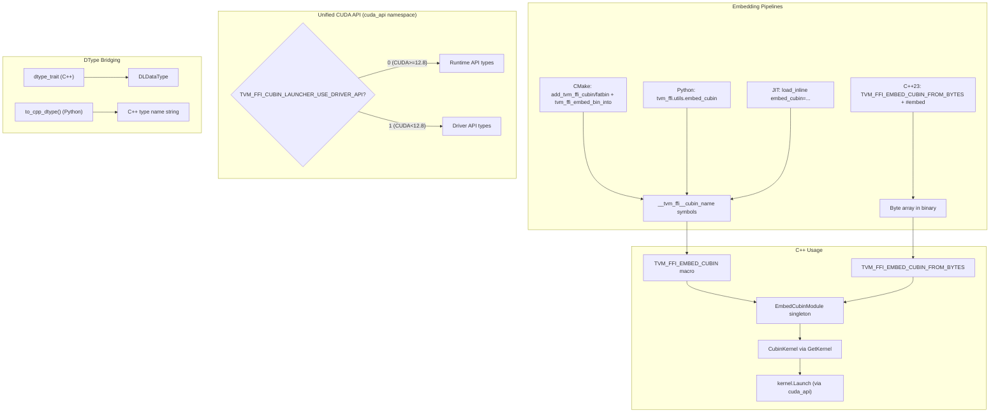

# CUDA Extra Utilities: CUBIN Launcher, Device Guard, and Base Macros

**TL;DR**
- A header-only C++ library under `include/tvm/ffi/extra/cuda/` providing CUBIN loading/launching (`CubinModule`/`CubinKernel`), device switching (`CUDADeviceGuard`), and shared error-checking macros (`TVM_FFI_CHECK_CUDA_ERROR`).
- Compile-time CUBIN embedding via `TVM_FFI_EMBED_CUBIN` / `TVM_FFI_EMBED_CUBIN_GET_KERNEL` macros, backed by three embedding pipelines: CMake (`tvm_ffi_embed_cubin`), Python CLI (`tvm_ffi.utils.embed_cubin`), and JIT (`load_inline(embed_cubin=...)`).
- Python NVRTC compilation utility (`tvm_ffi.cpp.nvrtc.nvrtc_compile`) converts CUDA source to CUBIN at runtime, feeding into the embedding pipeline.

## Problem Statement

### Background
- CUDA kernel launching from C++ requires managing CUDA Driver/Runtime API for module loading, kernel function handles, device guards, and dynamic shared memory configuration.
- Embedding precompiled CUBIN in shared libraries requires platform-specific toolchain knowledge (objcopy, ld) that is error-prone and varies across build systems.
- Multi-GPU scenarios require save/restore of the active CUDA device index to avoid cross-device kernel launches.

### Solution
- Header-only C++ classes (`CubinModule`, `CubinKernel`, `CUDADeviceGuard`) providing RAII wrappers around the CUDA API, abstracted via `tvm::ffi::cuda_api` unified layer (b16f11f6).
- Macros (`TVM_FFI_EMBED_CUBIN`, `TVM_FFI_EMBED_CUBIN_FROM_BYTES`, `TVM_FFI_EMBED_CUBIN_GET_KERNEL`) that declare extern symbol references and create singleton module instances, decoupling the embedding pipeline from usage.
- Three embedding pipelines (CMake declarative functions, Python CLI, JIT) all targeting the same `__tvm_ffi__cubin_<name>` symbol convention.
- `tvm_ffi::dtype_trait<T>` compile-time trait and `tvm_ffi.cpp.to_cpp_dtype()` Python function for cross-language dtype bridging (c51e519b).

### Goals
- Header-only: no link-time dependency beyond CUDA runtime.
- Multi-GPU safe: `CUDADeviceGuard` for device switching, `CubinKernel.SetMaxDynamicSharedMemory` iterates all devices.
- Pipeline-agnostic embedding: same C++ usage regardless of whether CUBIN was embedded via CMake, Python, or JIT.
- Non-goal: JIT CUDA compilation (that's `nvrtc_compile`'s role; these utilities consume the output).

## Design



### Key Classes, Fields and Interfaces

```python
# --- include/tvm/ffi/extra/cuda/internal/unified_api.h (b16f11f6) ---
# Namespace: tvm::ffi::cuda_api
# Compile-time switch: TVM_FFI_CUBIN_LAUNCHER_USE_DRIVER_API
#   Defaults to 0 (Runtime API) if CUDART_VERSION >= 12080, else 1 (Driver API)
#   static_assert if user requests Runtime API with CUDA < 12.8

# Type aliases (Driver API when USE_DRIVER_API=1, Runtime API otherwise):
StreamHandle = CUstream | cudaStream_t
DeviceHandle = CUdevice | int
LibraryHandle = CUlibrary | cudaLibrary_t
KernelHandle = CUkernel | cudaKernel_t
ResultType = CUresult | cudaError_t
kSuccess = CUDA_SUCCESS | cudaSuccess
# Interacts with: CubinModule, CubinKernel (all internal CUDA types now use these aliases)

def LoadLibrary(library: Ptr[LibraryHandle], image: void_ptr) -> ResultType: ...
def UnloadLibrary(library: LibraryHandle) -> ResultType: ...
def GetKernel(kernel: Ptr[KernelHandle], library: LibraryHandle, name: str) -> ResultType: ...
def GetDeviceHandle(device_id: int) -> DeviceHandle: ...
    # Invariant: cuDeviceGet for Driver API, identity for Runtime API
def LaunchKernel(kernel: KernelHandle, args: void_ptr_ptr, grid: dim3, block: dim3,
                 stream: StreamHandle, dyn_smem_bytes: int = 0) -> ResultType: ...
def GetKernelSharedMem(kernel: KernelHandle, out: Ref[int], device: DeviceHandle) -> ResultType: ...
def SetKernelMaxDynamicSharedMem(kernel: KernelHandle, shmem: int,
                                  device: DeviceHandle) -> ResultType: ...
def GetDeviceCount(count: Ptr[int]) -> ResultType: ...
def GetErrorString(err: ResultType, name: Ptr[str], str_: Ptr[str]) -> None: ...

# --- include/tvm/ffi/extra/cuda/base.h ---

# dim3 struct (MOVED from cubin_launcher.h in b16f11f6)
# Makes dim3 usable without pulling in full CUDA headers.

# Macro: TVM_FFI_CHECK_CUDA_ERROR(stmt)  (SPLIT in 10cb004)
# Location: include/tvm/ffi/extra/cuda/base.h
# Uses cudaError_t (CUDA runtime API only, NOT unified driver/runtime API)
# Interacts with: cudaGetErrorName, cudaGetErrorString
# Invariant: always uses CUDA runtime API, never driver API
# Interacts with: TVM_FFI_THROW(RuntimeError) from tvm/ffi/error.h

# Macro: TVM_FFI_CHECK_CUBIN_LAUNCHER_CUDA_ERROR(stmt)  (RENAMED in 10cb004)
# Location: include/tvm/ffi/extra/cuda/internal/unified_api.h
# Uses cuda_api::ResultType (may be driver or runtime depending on config)
# Interacts with: cuda_api::GetErrorString, unified API abstraction
# Invariant: only used within cubin launcher code paths

# --- include/tvm/ffi/extra/cuda/device_guard.h ---

class CUDADeviceGuard:
    """RAII guard: saves current CUDA device on construction, restores on destruction."""
    original_device_index_: int
    # Invariant: cudaSetDevice is only called if target differs from original (no-op optimization)
    # Invariant: destructor is noexcept(false) -- TVM_FFI_CHECK_CUDA_ERROR may throw on restore
    # Invariant: default constructor deleted -- device_index is required
    # Interacts with: cudaGetDevice, cudaSetDevice (CUDA runtime)
    # Interacts with: TVM_FFI_CHECK_CUDA_ERROR (from base.h)
    # Extension: instantiate at function scope before CUDA operations on a specific device
    # Added in cdfd041; modeled after PyTorch c10::cuda::CUDAGuard

    def __init__(self, device_index: int) -> None: ...

# --- include/tvm/ffi/extra/cuda/cubin_launcher.h ---

class dim3:
    """3D dimension for CUDA kernel launch (grid/block)."""
    x: unsigned_int  # default 1
    y: unsigned_int  # default 1
    z: unsigned_int  # default 1
    # Interacts with: CubinKernel.Launch (grid/block params)

class CubinModule:
    """RAII wrapper around cuda_api::LibraryHandle. Loads CUBIN from memory."""
    library_: cuda_api.LibraryHandle  # was: cudaLibrary_t (b16f11f6)
    # Invariant: cuda_api::UnloadLibrary called on destruction
    # Invariant: non-copyable, move-only

    def __init__(self, bytes: Bytes) -> None: ...
        # Calls cuda_api::LoadLibrary(&library_, bytes.data())
    def __init__(self, code: const_char_ptr) -> None: ...
        # Calls cuda_api::LoadLibrary(&library_, code)
    def __init__(self, code: const_unsigned_char_ptr) -> None: ...  # NEW overload (b16f11f6)
        # Enables TVM_FFI_EMBED_CUBIN_FROM_BYTES macro

    def GetKernel(self, name: str) -> CubinKernel: ...
        # Interacts with: CubinKernel constructor (cudaLibraryGetKernel)

    def GetKernelWithMaxDynamicSharedMemory(self, name: str,
                                             dynamic_smem_max: int = -1) -> CubinKernel: ...
        # Calls GetKernel then SetMaxDynamicSharedMemory
        # Interacts with: CubinKernel.SetMaxDynamicSharedMemory

    def __getitem__(self, name: str) -> CubinKernel: ...
        # Alias for GetKernel(name)

class CubinKernel:
    """Handle for a loaded CUDA kernel function. Non-copyable, move-only."""
    kernel_: cuda_api.KernelHandle  # was: cudaKernel_t (b16f11f6)
    # Invariant: kernel handle doesn't need explicit cleanup (library owns it)

    def __init__(self, library: cuda_api.LibraryHandle, name: str) -> None: ...
        # Calls cuda_api::GetKernel(&kernel_, library, name)

    def Launch(self, args: void_ptr_ptr, grid: dim3, block: dim3,
               stream: cuda_api.StreamHandle, dyn_smem_bytes: int = 0) -> cuda_api.ResultType: ...
        # Calls cuda_api::LaunchKernel (was direct cudaLaunchKernel)
        # Interacts with: cuda_api::LaunchKernel
        # Invariant: args must contain pointers to actual values, not values themselves
        # Extension: configure dyn_smem_bytes for dynamic shared memory kernels

    # private:
    def SetMaxDynamicSharedMemory(self, dynamic_smem_max: int = -1) -> None: ...
        # Iterates all devices, sets cudaFuncAttributeMaxDynamicSharedMemorySize
        # When -1: computes (device_max - kernel_static_shared)
        # Invariant: only errors if ALL devices fail
        # Interacts with: cudaDeviceGetAttribute, cudaFuncGetAttributes, cudaKernelSetAttributeForDevice

# Macro expansion: TVM_FFI_EMBED_CUBIN(name) produces:
#   extern "C" const char __tvm_ffi__cubin_<name>[];
#   extern "C" const char __tvm_ffi__cubin_<name>_end[];
#   struct EmbedCubinModule_<name> {
#       CubinModule mod{__tvm_ffi__cubin_<name>};
#       static EmbedCubinModule_<name>* Global();  // singleton
#   };
# Interacts with: objcopy/ld symbol injection (Python/CMake embedding pipelines)
# Interacts with: __tvm_ffi__cubin_ naming convention (ADR-0010)
# Invariant: name must match the embedding pipeline's --name / NAME parameter

# Macro expansion: TVM_FFI_EMBED_CUBIN_GET_KERNEL(name, kernel_name) produces:
#   EmbedCubinModule_<name>::Global()->mod[kernel_name]
# Interacts with: TVM_FFI_EMBED_CUBIN (requires prior declaration)

# Macro expansion: TVM_FFI_EMBED_CUBIN_FROM_BYTES(name, imageBytes) (b16f11f6):
# Creates singleton struct EmbedCubinModule_<name> with CubinModule constructed from imageBytes
# Interacts with: CubinModule(const unsigned char*) constructor
# Extension: use with C++23 #embed or bin2c output for zero-symbol-injection embedding

# --- CMake functions (cmake/Utils/EmbedCubin.cmake) (CHANGED b16f11f6) ---

# REMOVED: tvm_ffi_generate_cubin(OUTPUT, SOURCE, ARCH, OPTIONS, DEPENDS)
# REMOVED: tvm_ffi_embed_cubin(OUTPUT, SOURCE, CUBIN, NAME, DEPENDS)

# NEW: add_tvm_ffi_cubin(target_name CUDA source_file)
#   Creates object library with --cubin compile option

# NEW: add_tvm_ffi_fatbin(target_name CUDA source_file)
#   Creates object library with --fatbin compile option

# NEW: tvm_ffi_embed_bin_into(target_name SYMBOL symbol_name BIN bin_file)
#   Embeds CUBIN/FATBIN into existing target via PRE_LINK commands
#   Interacts with: tvm_ffi.utils.embed_cubin Python utility

# --- include/tvm/ffi/extra/dtype.h (c51e519b) ---

class dtype_trait(Generic[T]):
    """Compile-time trait mapping C++ type T to its DLDataType."""
    value: DLDataType  # constexpr static
    # Invariant: value is constexpr -- zero runtime cost
    # Invariant: CUDA/HIP types are forward-declared only (no vendor header dependency)
    # Extension: specialize dtype_trait<MyType> for custom numeric types
    # Specializations: CPU (all integer/float/bool), CUDA (__half, __nv_bfloat16, fp8, fp4),
    #                  HIP (__hip_bfloat16, hip_bfloat16, hip fp8/fp4 variants)

# --- Python: tvm_ffi.cpp.nvrtc ---

def nvrtc_compile(
    source: str,
    *,
    name: str = "kernel.cu",
    arch: str | None = None,         # auto-detect from current GPU if None
    extra_opts: Sequence[str] | None = None,
) -> bytes:
    """Compile CUDA source to CUBIN using NVRTC."""
    # Interacts with: cuda.bindings.nvrtc (nvrtcCreateProgram, nvrtcCompileProgram, nvrtcGetCUBIN)
    # Interacts with: cuda.bindings.driver (cuInit, cuCtxGetDevice, cuDeviceGetAttribute for arch)
    # Invariant: requires cuda-python package installed
    # Extension: pass extra_opts for custom defines, include paths

# --- Python: tvm_ffi.utils.embed_cubin ---

def embed_cubin(
    cubin_path: Path, input_obj_path: Path, output_obj_path: Path,
    name: str, verbose: bool = False,
) -> None:
    """Embed CUBIN into existing .o file via ld + objcopy pipeline."""
    # Pipeline: ld -r -b binary -> objcopy (add .note.GNU-stack) ->
    #   objcopy (rename symbols) -> ld -r (merge) -> objcopy (localize)
    # Symbol naming: _binary_embedded_<name>_cubin_start -> __tvm_ffi__cubin_<name>
    # Interacts with: GNU binutils (ld, objcopy)
    # Invariant: Unix-only (Windows not supported)
    # Invariant: symbols are localized to prevent cross-object conflicts

# --- Python: tvm_ffi.cpp.dtype (c51e519b) ---

CPU_DTYPE_MAP: dict[str, str]   # {"int8": "int8_t", "float32": "float", ...}
CUDA_DTYPE_MAP: dict[str, str]  # {"float16": "__half", "bfloat16": "__nv_bfloat16", ...}
ROCM_DTYPE_MAP: dict[str, str]  # {"float16": "__half", "bfloat16": "__hip_bfloat16", ...}

def to_cpp_dtype(dtype_str: str | Any) -> str: ...
    # Converts dtype string or torch.dtype to C++ type name string.
    # Checks CPU map first, then backend-specific map (CUDA/ROCm).
    # Interacts with: _determine_backend_once() for CUDA/ROCm detection via PyTorch
    # Invariant: raises ValueError for unsupported dtypes
    # Extension: add entries to maps for new types
```

### Contracts, Assumptions and Invariants
- **Header-only**: No link-time dependency; users include the header and link against CUDA runtime themselves.
- **Singleton CUBIN modules**: `TVM_FFI_EMBED_CUBIN` creates a process-lifetime singleton. CUBIN is loaded once, kernel handles are reusable across calls.
- **Symbol name matching**: The `name` parameter in `TVM_FFI_EMBED_CUBIN(name)` must exactly match the `name` passed to the embedding pipeline (CMake, Python CLI, or `load_inline`). Mismatch causes linker errors (undefined symbol).
- **Multi-GPU shared memory**: `SetMaxDynamicSharedMemory` iterates all visible CUDA devices to set the attribute per-device. This is necessary because CUDA's per-device function attributes are device-specific.
- **Failure mode -- CUDA version**: `cudaLibraryLoadData` requires CUDA Runtime >= 12.0. Older runtimes will fail at the API call.
- **Failure mode -- missing CUBIN symbol**: If the embedding pipeline didn't run or the name doesn't match, the linker reports undefined references to `__tvm_ffi__cubin_<name>`.

### Extension Points
- **New embedding backends**: The `__tvm_ffi__cubin_<name>` symbol convention is backend-agnostic. Any tool that produces object files with the right symbol names works.
- **New device guard targets**: The RAII pattern in `CUDADeviceGuard` can be templated for other device APIs (ROCm, Vulkan).
- **Dynamic CUBIN loading**: `CubinModule` can also be constructed from `Bytes` at runtime (without embedding macros), for cases where CUBIN is loaded from disk or network.

### Usage Examples

#### End-to-end: NVRTC compile, JIT embed, launch kernel
**Context**: Compiling a CUDA kernel from source at runtime, embedding it into a JIT-compiled C++ wrapper, and calling it from Python.

```python
from tvm_ffi import cpp
from tvm_ffi.cpp import nvrtc

# 1. Compile CUDA source to CUBIN
cubin = nvrtc.nvrtc_compile(
    'extern "C" __global__ void add_one(float* x, float* y, int n) { '
    'int i = threadIdx.x + blockIdx.x * blockDim.x; if (i < n) y[i] = x[i] + 1; }',
    name="kernel.cu",
)

# 2. Write C++ wrapper
wrapper = """
#include <tvm/ffi/extra/cuda/cubin_launcher.h>
TVM_FFI_EMBED_CUBIN(my_cubin);
void AddOne(ffi::TensorView x, ffi::TensorView y) {
    static auto kernel = TVM_FFI_EMBED_CUBIN_GET_KERNEL(my_cubin, "add_one");
    int n = x.size(0);
    void *xp = x.data_ptr(), *yp = y.data_ptr();
    void* args[] = {&xp, &yp, &n};
    kernel.Launch(args, ffi::dim3((n+255)/256), ffi::dim3(256), /*stream=*/nullptr);
}
TVM_FFI_DLL_EXPORT_TYPED_FUNC(add_one, AddOne);
"""

# 3. Build and call
mod = cpp.load_inline("my_module", cpp_sources=wrapper, embed_cubin={"my_cubin": cubin})
mod.add_one(x_cuda, y_cuda)
```

#### RAII device guard for multi-GPU kernel dispatch
**Context**: Ensuring the correct CUDA device is active before launching a kernel, restoring the original device afterward.

```cpp
#include <tvm/ffi/extra/cuda/device_guard.h>

void dispatch_kernel(ffi::TensorView input) {
    // Guard switches to tensor's device; restores original on scope exit
    ffi::CUDADeviceGuard guard(input.device().device_id);
    // Now safe to launch kernels on input's device
    // ... cudaLaunchKernel or CubinKernel.Launch ...
}
// Original device restored here
```

#### Byte-array CUBIN loading with C++23 `#embed`
**Context**: Loading CUBIN/FATBIN from byte arrays without symbol injection (b16f11f6).

```cpp
#include <tvm/ffi/extra/cuda/cubin_launcher.h>
constexpr unsigned char image[]{ #embed "kernel_fatbin.fatbin" };
TVM_FFI_EMBED_CUBIN_FROM_BYTES(my_kernels, image);

void MyFunc(ffi::TensorView x, ffi::TensorView y) {
    static auto kernel = TVM_FFI_EMBED_CUBIN_GET_KERNEL(my_kernels, "add_one_cuda");
    int64_t n = x.size(0);
    void *xp = x.data_ptr(), *yp = y.data_ptr();
    void* args[] = {&xp, &yp, &n};
    TVM_FFI_CHECK_CUDA_ERROR(
        kernel.Launch(args, ffi::dim3((n+255)/256), ffi::dim3(256), /*stream=*/nullptr));
}
```

#### Declarative CMake CUBIN embedding
**Context**: Using the new target-based CMake functions (b16f11f6, replaces imperative `tvm_ffi_embed_cubin`).

```cmake
add_tvm_ffi_fatbin(kernel_fatbin CUDA src/kernel.cu)
add_library(lib_embedded SHARED src/lib_embedded.cc)
tvm_ffi_embed_bin_into(lib_embedded SYMBOL env BIN "$<TARGET_OBJECTS:kernel_fatbin>")
```

#### Cross-language dtype bridging
**Context**: Using dtype_trait (C++) and to_cpp_dtype (Python) for end-to-end dtype mapping (c51e519b).

```python
from tvm_ffi.cpp import to_cpp_dtype, load_inline

cpp_type = to_cpp_dtype("bfloat16")  # "__nv_bfloat16" on CUDA, "__hip_bfloat16" on ROCm
source = f"""
#include <tvm/ffi/extra/dtype.h>
static_assert(tvm_ffi::dtype_trait<{cpp_type}>::value.bits == 16);
"""
```

```cpp
#include <tvm/ffi/extra/dtype.h>
// Compile-time: dtype_trait<float>::value == {kDLFloat, 32, 1}
// dtype_trait<__half>::value == {kDLFloat, 16, 1}
// dtype_trait<__nv_fp8_e4m3>::value == {kDLFloat8_e4m3fn, 8, 1}
```

## Alternatives & Trade-offs

### xxd-generated C arrays for CUBIN embedding
- Pros: Simple, no GNU binutils dependency, works on Windows
- Cons: Bloats compilation (large array constants in source), slower compile times for large CUBINs, poor build system integration (requires pre-build step)

### CUDA fatbinary for CUBIN embedding
- Pros: Native CUDA toolchain support, handles multi-arch automatically
- Cons: Requires NVCC at build time (not just runtime), tightly coupled to CUDA build system, not compatible with non-CUDA host compilers

## Related Work
### Design Docs & ADRs
- [0011-module-system.md](../designs/0011-module-system.md) -- `load_inline` / `build_inline` with `embed_cubin` parameter
- [0004-function-system.md](../designs/0004-function-system.md) -- `TVM_FFI_DLL_EXPORT_TYPED_FUNC` used by wrappers
- [0005-error-system.md](../designs/0005-error-system.md) -- `TVM_FFI_THROW(RuntimeError)` used by `TVM_FFI_CHECK_CUDA_ERROR`
- [0014-stream-and-env-context.md](../designs/0014-stream-and-env-context.md) -- `TVMFFIEnvGetStream` for stream in kernel launch
- [ADR 0010](../ADRs/0010-ffi-symbol-prefix-convention.md) -- `__tvm_ffi__cubin_<name>` symbol naming convention
- [ADR 0016](../ADRs/0016-cubin-embedding-via-symbol-injection.md) -- Decision to use ld + objcopy for CUBIN embedding
- [ADR 0017](../ADRs/0017-cuda-driver-runtime-api-abstraction.md) -- Decision to support both CUDA Driver and Runtime APIs via compile-time abstraction

### Evidence Matrix
- CUBIN launcher, embedding macros, nvrtc_compile, embed_cubin utility, load_inline embed_cubin parameter -> `commits/2025-11-25-d49effdb22392363050e1f2d85cd4b31bf242cf0.md` (d49effd)
- CUDADeviceGuard, base.h extraction, TVM_FFI_CHECK_CUDA_ERROR refactoring -> `commits/2025-11-25-cdfd04109f74a2115c909302f4adf90536bce865.md` (cdfd041)
- Kernel library guide documenting usage -> `commits/2025-11-20-db53ce4f4f8f2afc9cfd8070b5c7b092dcd04176.md` (db53ce4)
- CUDADeviceGuard RAII pattern in guide -> `commits/2025-11-26-803cdc84a4bb4502c8da0e5f69a61c1e7b1a38cf.md` (803cdc8)
- Unified CUDA API (cuda_api), TVM_FFI_EMBED_CUBIN_FROM_BYTES, declarative CMake -> `commits/2025-12-25-b16f11f60156cf07c6e5d3f9ddfa9e2273bdea03.md` (b16f11f6)
- dtype_trait<T> and to_cpp_dtype() -> `commits/2026-01-02-c51e519b2253c2c8754bebaf2f9af0434d89e1fc.md` (c51e519b)
- TVM_FFI_CHECK_CUDA_ERROR split: base.h (runtime) vs TVM_FFI_CHECK_CUBIN_LAUNCHER_CUDA_ERROR (unified) -> `commits/2026-01-12-10cb0048cef8f3a37282f403cded9eb96aa59464.md` (10cb004)
- Plus 1 supporting commit: missing include fix in device_guard.h (692a41a)
- cuLaunchKernelEx, ConstructLaunchConfig, CubinKernel::LaunchEx for SM90+ cluster launch -> `commits/2026-02-28-adac5ebd0ad695fc77bf5113c8127a7298c1ed52.md` (adac5eb)
