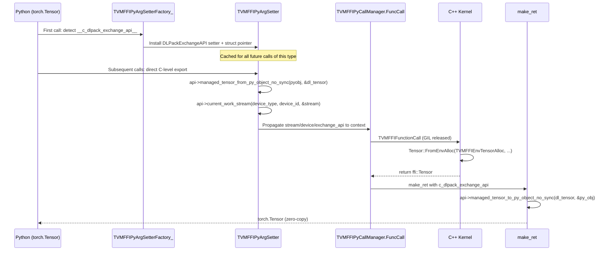
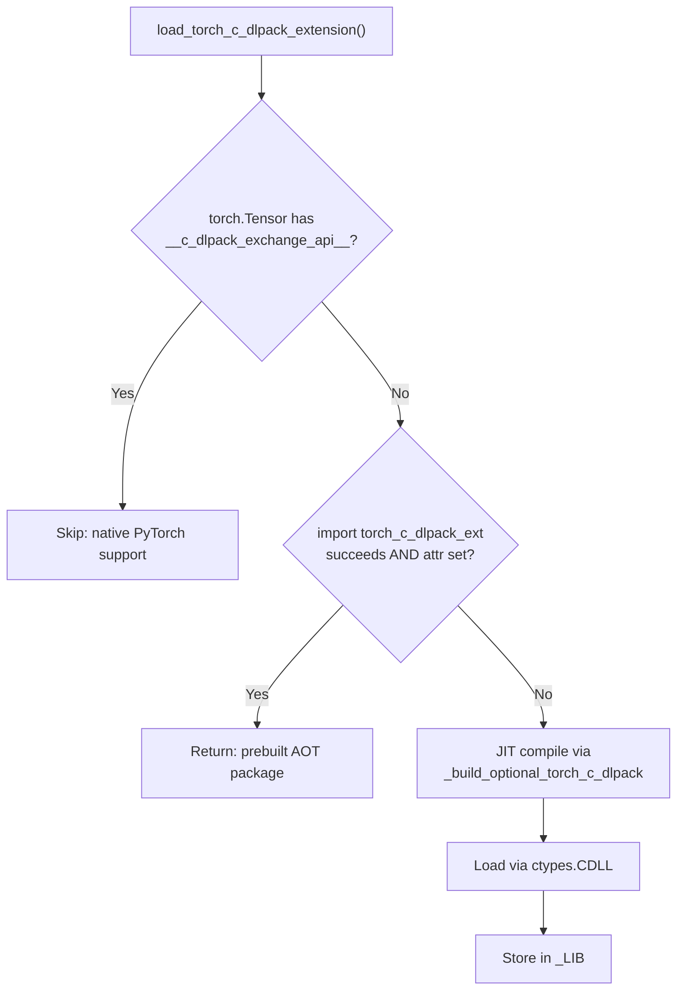

# DLPack Fast-Path Protocol and Environment Tensor Allocator

**TL;DR**:
- A unified `DLPackExchangeAPI` struct-based protocol (`__c_dlpack_exchange_api__` class attribute) replaces the earlier three-attribute protocol, allowing framework tensors (e.g., `torch.Tensor`) to convert to/from `DLManagedTensorVersioned` without going through Python's `__dlpack__` capsule protocol, eliminating per-call Python overhead. The struct includes version negotiation via `prev_api` chaining and a decoupled stream query via `current_work_stream`.
- An environment tensor allocator (`TVMFFIEnvSetDLPackManagedTensorAllocator` / `TVMFFIEnvGetDLPackManagedTensorAllocator`) enables C++ kernel code to allocate output tensors in the caller's framework. The new `TVMFFIEnvTensorAlloc` C API wraps allocation + DLPack-to-TensorObj conversion inside `libtvm_ffi`, and `Tensor::FromEnvAlloc` is the C++ convenience wrapper.
- `TensorObj` caches `DLManagedTensorVersioned` structs atomically (CAS-based), so repeated exports return the same pointer with only a refcount increment.

## Problem Statement
### Background
- The standard DLPack exchange protocol goes through Python's `__dlpack__` / `__dlpack_device__` dunders, which involve: Python method lookup, Python tuple allocation for the capsule, PyCapsule creation/destruction, and multiple Python-to-C round-trips per tensor argument.
- For hot-path FFI calls (e.g., calling a kernel with 5 torch tensors), this overhead dominates the actual computation.
- Additionally, C++ kernel code has no standard way to allocate output tensors in the caller's memory space. A kernel receiving `torch.Tensor` inputs may want to return `torch.Tensor` outputs (e.g., for CUDA memory pool reuse), but the FFI only knows about `ffi::Tensor`.

### Solution
- Define a C-level function pointer protocol that framework tensors can expose as Python class attributes. The argument setter detects these pointers during the factory phase (once per type) and caches a direct C-call path.
- Provide an environment tensor allocator API that is set during argument packing (when a framework tensor with `__c_dlpack_exchange_api__` is detected) and queried by kernel code at runtime.
- Cache the `DLManagedTensorVersioned` struct on `TensorObj` so that export is allocation-free after the first call.

### Goals
- Zero Python overhead for tensor conversion on hot paths when the fast protocol is available.
- Transparent framework tensor return: kernels returning `ffi::Tensor` automatically get converted back to `torch.Tensor` when called with torch inputs.
- Thread-safe caching of DLPack exports.
- Non-goals: supporting frameworks that cannot provide C-level function pointers; replacing the standard `__dlpack__` protocol entirely (it remains the fallback).

## Design

### Protocol Overview



### DLPackExchangeAPI Struct Protocol (since 22a7894)

Defined in `dlpack/dlpack.h` (upstream DLPack standard, proposal #175):

```c
typedef struct {
    DLPackVersion version;
    DLPackExchangeAPIHeader* prev_api;  // for version chaining
} DLPackExchangeAPIHeader;

typedef struct {
    DLPackExchangeAPIHeader header;
    DLPackManagedTensorAllocator managed_tensor_allocator;
    DLPackManagedTensorFromPyObjectNoSync managed_tensor_from_py_object_no_sync;
    DLPackManagedTensorToPyObjectNoSync managed_tensor_to_py_object_no_sync;
    DLPackDLTensorFromPyObjectNoSync dltensor_from_py_object_no_sync;  // non-owning export
    DLPackCurrentWorkStream current_work_stream;                        // decoupled stream query
} DLPackExchangeAPI;
```

### Python Class Attribute Protocol

Framework tensors expose a single struct pointer as an integer-valued class attribute:

| Attribute | Type | Points To | Description |
|-----------|------|-----------|-------------|
| `__c_dlpack_exchange_api__` | `int` (ptr cast) or `PyCapsule` (name `"dlpack_exchange_api"`) | `const DLPackExchangeAPI*` | Unified exchange API struct; discovered on the CLASS, not the instance. Since 7f3bb77, accepts PyCapsule in addition to integer; Cython `_get_dlpack_exchange_api` dispatches both formats. |

When `TVMFFIPyArgSetterFactory_` encounters a type with `__c_dlpack_exchange_api__`, it installs `TVMFFIPyArgSetterDLPackExchangeAPI_` as the setter and stores the struct pointer in `TVMFFIPyArgSetter.c_dlpack_exchange_api`. The setter calls the struct's function pointers directly -- no Python method calls, no capsule allocation.

**Cython exception-propagation convention**: All DLPack callback typedefs that return `int` and signal errors via `-1` must be declared `except -1` (not `noexcept`) in Cython, so that callers get automatic exception checking (fixed in 70caf4c).

**PyCapsule-based pointer passing** (since 7f3bb77): The `__c_dlpack_exchange_api__` attribute may now be a `PyCapsule` (capsule name `"dlpack_exchange_api"`) instead of a raw integer. This is safer because PyCapsule validates the name on retrieval and avoids exposing raw C pointers as Python integers. The Cython-side `_get_dlpack_exchange_api` helper checks `isinstance(obj, int)` first (backward compat), then `PyCapsule_IsValid`. The JIT loader (`_optional_torch_c_dlpack.py`) now wraps the integer pointer from the C extension into a PyCapsule via `_create_dlpack_exchange_api_capsule()`. When `torch_c_dlpack_ext` sets the attribute as an integer (backward compat), the JIT loader eagerly upgrades it to PyCapsule.

**Forward-compatibility guard**: `load_torch_c_dlpack_extension()` checks `hasattr(torch.Tensor, "__c_dlpack_exchange_api__")` before JIT-compiling the extension; if PyTorch natively provides the attribute, the extension is skipped (since 3373853).

### Cached DLManagedTensorVersioned on TensorObj

```cpp
class TensorObj : public Object, public DLTensor {
  // ...
  mutable std::atomic<DLManagedTensorVersioned*> cached_dl_managed_tensor_versioned_;

  DLManagedTensorVersioned* ToDLPackVersioned() {
    // Try to return cached
    DLManagedTensorVersioned* cached = cached_dl_managed_tensor_versioned_.load();
    if (cached != nullptr) {
      // Increment TensorObj refcount; consumer's deleter only does DecRef
      TVMFFIObjectIncRef(this);
      return cached;
    }
    // Allocate new, attempt CAS
    DLManagedTensorVersioned* fresh = AllocateNew();
    DLManagedTensorVersioned* expected = nullptr;
    if (cached_dl_managed_tensor_versioned_.compare_exchange_strong(expected, fresh)) {
      TVMFFIObjectIncRef(this);  // for the returned pointer
      return fresh;
    }
    // Another thread won the race; delete ours, use theirs
    delete fresh;
    TVMFFIObjectIncRef(this);
    return expected;
  }

  ~TensorObj() {
    DLManagedTensorVersioned* cached = cached_dl_managed_tensor_versioned_.load();
    if (cached) delete cached;
  }
};
```

The cached struct's deleter (`EmbeddedDLManagedTensorVersionedDeleter`) only calls `TVMFFIObjectDecRef` on the `TensorObj`, not `delete` on the struct itself. This is safe because the struct's `dl_tensor` fields point into the `TensorObj` which remains alive as long as any consumer holds a reference.

### Environment Tensor Allocator

Two-tier dispatch: thread-local first, then global fallback.

**C API** (in `c_env_api.h`, renamed in 9829dec and f679fe5):
```c
int TVMFFIEnvSetDLPackManagedTensorAllocator(
    DLPackManagedTensorAllocator allocator,
    int write_to_global_context,
    DLPackManagedTensorAllocator* opt_out_original_allocator);

DLPackManagedTensorAllocator TVMFFIEnvGetDLPackManagedTensorAllocator();

// New high-level API (since f679fe5): allocates Tensor object inside libtvm_ffi
int TVMFFIEnvTensorAlloc(DLTensor* prototype, TVMFFIObjectHandle* out);
```

**C++ convenience** (in `container/tensor.h`, renamed in f679fe5):
```cpp
static Tensor Tensor::FromEnvAlloc(
    int (*env_alloc)(DLTensor*, TVMFFIObjectHandle*),
    ShapeView shape, DLDataType dtype, DLDevice device);
```

The allocator is propagated through the call context:
1. During argument packing, if any argument's type has `__c_dlpack_exchange_api__`, the allocator pointer (from `managed_tensor_allocator`) is stored in `TVMFFIPyCallContext.c_dlpack_exchange_api`.
2. Before the C call, `TVMFFIEnvSetDLPackManagedTensorAllocator` installs it as thread-local.
3. Kernel code calls `Tensor::FromEnvAlloc(TVMFFIEnvTensorAlloc, ...)`. The `TVMFFIEnvTensorAlloc` implementation inside `libtvm_ffi` handles DLPack allocator lookup, invocation, error routing, and DLPack-to-TensorObj wrapping. This ensures object construction happens inside `libtvm_ffi`, preventing dangling references when the calling module is unloaded.
4. After the call returns, the previous allocator is restored.

### Per-Function GIL Control

`Function` is a `cdef class` (not a Python `class`) with a `release_gil` property:

```python
cdef class Function(Object):
    cdef bint _release_gil

    @property
    def release_gil(self):
        return self._release_gil

    @release_gil.setter
    def release_gil(self, bint value):
        self._release_gil = value
```

Default is controlled by `TVM_FFI_RELEASE_GIL_BY_DEFAULT` env var (default: `1`). The `FuncCall` path passes `release_gil` to `TVMFFIPyCallManager.FuncCall`, which conditionally uses `Py_BEGIN_ALLOW_THREADS`/`Py_END_ALLOW_THREADS`.

### Automatic Return-Value Framework Conversion

When a `DLPackExchangeAPI*` is captured during argument packing (from `__c_dlpack_exchange_api__`), it is stored in the call context and passed to `make_ret`. When `make_ret` encounters a `Tensor` result and `api->managed_tensor_to_py_object_no_sync` is non-null, it converts the result back to the framework's tensor type via the C importer function.

#### Ownership Invariants for `make_tensor_from_chandle` (fixed in 7092774)

When the DLPack fast-path succeeds in `make_tensor_from_chandle`:
1. `ToDLPackVersioned` calls `TVMFFIObjectIncRef` on the `TensorObj`, so the `DLManagedTensorVersioned` deleter holds a reference.
2. `c_dlpack_to_pyobject` converts to a framework tensor (e.g., `torch.Tensor`). The framework tensor will eventually trigger the DLPack deleter, releasing reference (1).
3. The original `chandle` passed to `make_tensor_from_chandle` still holds a separate reference. Since the returned Python object is the framework tensor (not a Cython `Object` whose `__dealloc__` would DecRef `chandle`), the fix explicitly calls `TVMFFIObjectDecRef(chandle)` to release this reference.

Exception path: When `c_dlpack_to_pyobject` fails, the `DLManagedTensorVersioned` struct's deleter is called to free the DLPack wrapper (which decrefs the `TensorObj`), and execution falls through to the default path where `chandle` is stored in a new `Tensor` Python object.

### EnvContext (replaces StreamContext)

Internal class in `env_context.cc` (renamed from `stream_context.cc`). Thread-local singleton managing:
- Stream table: 2D `vector<vector<void*>>` indexed by `(device_type, device_id)`
- Tensor allocator: TLS `DLPackTensorAllocator` pointer + global atomic `DLPackTensorAllocator`

```cpp
class EnvContext {
  static EnvContext* ThreadLocal();
  static std::atomic<DLPackTensorAllocator>& GlobalTensorAllocator();

  int SetStream(int32_t dev_type, int32_t dev_id, void* stream, void** out);
  void* GetStream(int32_t dev_type, int32_t dev_id);
  int SetTensorAllocator(DLPackTensorAllocator alloc, int write_global,
                         DLPackTensorAllocator* out_prev);
  DLPackTensorAllocator GetTensorAllocator();
};
```

### PyTorch Integration Module

`tvm_ffi._optional_torch_c_dlpack` manages a C++ extension that provides a `TorchDLPackExchangeAPI` struct inheriting `DLPackExchangeAPI`, with all five function pointers as private static members (encapsulated in ef54bda):

- `ManagedTensorFromPyObjectNoSync` -- exports torch tensor to DLPack (no sync, stream decoupled)
- `ManagedTensorToPyObjectNoSync` -- imports DLPack to torch tensor
- `ManagedTensorAllocator` -- allocates via `torch::empty` with appropriate device
- `DLTensorFromPyObjectNoSync` -- non-owning DLTensor fill (no refcount overhead)
- `CurrentWorkStream` -- queries CUDA stream for a device; returns `nullptr` for non-CUDA

The singleton's pointer is installed as `torch.Tensor.__c_dlpack_exchange_api__` at import time.

Additionally, `patch_torch_cuda_stream_protocol()` monkey-patches `torch.cuda.Stream.__cuda_stream__` on older PyTorch versions lacking native support (since 80bd4d8).

**Forward-compatibility**: If PyTorch already provides `__c_dlpack_exchange_api__` natively, the JIT extension is skipped entirely (since 3373853).

#### Build and Loading Architecture (since e6a654a)

The extension is built via a standalone build script (`python/tvm_ffi/utils/_build_optional_torch_c_dlpack.py`, renamed from `_build_optional_c_dlpack.py` in 70577053) that uses a custom Ninja build file and loads the result via `ctypes.CDLL`. This replaced the earlier `torch.utils.cpp_extension.load_inline` approach.

**Version-tagged library naming** (since 70577053): Libraries are named `libtorch_c_dlpack_addon_torch{major}{minor}-{cpu|cuda}.{ext}`, allowing multiple PyTorch versions to coexist in the same cache directory (`~/.cache/tvm-ffi/`).

**`_LIB` module-level keep-alive** (since bc2f408): The `ctypes.CDLL` handle returned by `load_torch_c_dlpack_extension()` is stored in the module-level `_LIB` variable. Without this, the GC could collect the handle and unload the shared library, leaving a dangling function pointer on `torch.Tensor.__c_dlpack_exchange_api__`.

**Platform-specific Python library linking** (since a06d0df): The linker flags for the extension are three-way platform-differentiated:
- **Linux**: No `libpython` linkage (no `libtorch_python` needed)
- **macOS**: Links `libpython` (required by `libtorch_python`)
- **Windows**: Uses `/LIBPATH` only (without explicit `python3.lib`)

**Environment variables**:
- `TVM_FFI_DISABLE_TORCH_C_DLPACK` -- when set to `"1"`, disables the torch C DLPack extension loading at import time (since e6a654a)
- `TVM_FFI_CACHE_DIR` -- controls where the JIT-built addon is cached (default `~/.cache/tvm-ffi`)

#### Three-Tier Load Priority (since f703a0c)

`load_torch_c_dlpack_extension()` follows a three-tier priority chain:



1. **Native PyTorch**: If `torch.Tensor` already has `__c_dlpack_exchange_api__` (future PyTorch with DLPack v1.2), skip entirely
2. **Prebuilt AOT package**: Try `import torch_c_dlpack_ext` (since f703a0c). After import, verify the attribute was actually set (since a5241e5) before returning early
3. **JIT compilation**: Build via standalone build script, load via `ctypes.CDLL`, store handle in `_LIB`

#### Standalone `torch_c_dlpack_ext` Addon Package (since f703a0c)

A standalone pip-installable package (`addons/torch_c_dlpack_ext/`) that bundles prebuilt shared libraries versioned by torch major.minor and device variant. Key components:

- **`torch_c_dlpack_ext.core.load_torch_c_dlpack_extension()`**: Loads a prebuilt `.so`/`.dylib`/`.dll` matching the current torch version/device, sets `torch.Tensor.__c_dlpack_exchange_api__` via `ctypes.CDLL`
- **Custom PEP 517 build backend** (`build_backend.py`): Wraps `setuptools.build_meta`, conditionally compiles the extension during wheel build if no prebuilt library is found. Sets `TVM_FFI_DISABLE_TORCH_C_DLPACK=1` in subprocess env to prevent circular import during build (since a5241e5)
- **CI workflow** (`.github/workflows/torch_c_dlpack.yml`, since da570b0): Manual-dispatch workflow building wheels for PyTorch 2.4-2.9, x86_64/aarch64, Python 3.9-3.13, with manylinux Docker builds and trusted-publishing to PyPI

**Build-time circular import prevention** (since a5241e5): Building the extension invokes `tvm_ffi`, which imports `_optional_torch_c_dlpack`, which tries to `import torch_c_dlpack_ext` -- the package currently being built. The fix sets `TVM_FFI_DISABLE_TORCH_C_DLPACK=1` in the build subprocess environment.

### Key Classes, Fields and Interfaces

| Symbol | Kind | Signature / Description |
|--------|------|------------------------|
| `DLPackExchangeAPI` | C struct | Unified function pointer table: `managed_tensor_allocator`, `managed_tensor_from_py_object_no_sync`, `managed_tensor_to_py_object_no_sync`, `dltensor_from_py_object_no_sync`, `current_work_stream` (since 22a7894) |
| `DLPackExchangeAPIHeader` | C struct | `version: DLPackVersion`, `prev_api: DLPackExchangeAPIHeader*` for version chaining |
| `DLPackManagedTensorAllocator` | C typedef | `int (*)(DLTensor*, DLManagedTensorVersioned**, void*, void(*)(void*,const char*,const char*))` (renamed from `DLPackTensorAllocator` in 9829dec; now from upstream `dlpack.h`) |
| `TVMFFIEnvSetDLPackManagedTensorAllocator` | C API | `int (DLPackManagedTensorAllocator, int write_global, DLPackManagedTensorAllocator*)` (renamed from `TVMFFIEnvSetTensorAllocator` in f679fe5) |
| `TVMFFIEnvGetDLPackManagedTensorAllocator` | C API | `DLPackManagedTensorAllocator ()` -- returns TLS or global allocator (renamed from `TVMFFIEnvGetTensorAllocator` in f679fe5) |
| `TVMFFIEnvTensorAlloc` | C API | `int (DLTensor* prototype, TVMFFIObjectHandle* out)` -- high-level allocator wrapping DLPack-to-TensorObj inside libtvm_ffi (since f679fe5) |
| `Tensor::FromEnvAlloc` | C++ static | `Tensor (int (*)(DLTensor*, TVMFFIObjectHandle*), ShapeView, DLDataType, DLDevice)` (replaced `FromDLPackAlloc` in f679fe5) |
| `TensorObj::ToDLPackVersioned` | C++ method | Returns cached `DLManagedTensorVersioned*` via atomic CAS |
| `TensorObj::cached_dl_managed_tensor_versioned_` | C++ field | `mutable atomic<DLManagedTensorVersioned*>` |
| `EmbeddedDLManagedTensorVersionedDeleter` | C++ | Deleter that only does `DecRef`, does not free struct |
| `Function.release_gil` | Python property | `bool`, default from `TVM_FFI_RELEASE_GIL_BY_DEFAULT` env var |
| `EnvContext` | C++ class (internal) | Thread-local singleton; holds stream table + tensor allocator (method names updated: `SetDLPackManagedTensorAllocator`/`GetDLPackManagedTensorAllocator`) |
| `patch_torch_cuda_stream_protocol` | Python function | Monkey-patches `torch.cuda.Stream.__cuda_stream__` on older PyTorch (since 80bd4d8) |

### Contracts, Assumptions and Invariants

- **Protocol attribute contract**: `__c_dlpack_exchange_api__` must be a class attribute (not instance), holding either an `int` (pointer cast) or a `PyCapsule` with name `"dlpack_exchange_api"` containing a valid `const DLPackExchangeAPI*` pointer. Since 7f3bb77, both formats are accepted; the Cython `_get_dlpack_exchange_api` helper dispatches via `isinstance(obj, int)` then `PyCapsule_IsValid`. All function pointers in the struct must be thread-safe (they may be called concurrently from multiple threads after GIL release).
- **Cached DLPack atomicity**: The CAS on `cached_dl_managed_tensor_versioned_` ensures exactly one allocation per `TensorObj`. Losers of the CAS race delete their allocation and use the winner's pointer.
- **Allocator callback error contract**: `DLPackManagedTensorAllocator` uses an error callback pattern (`SetError(ctx, kind, message)`) instead of TLS, because the allocator may be called from C++ contexts where TLS error state is already in use for the outer function call. When using `TVMFFIEnvTensorAlloc`, the error routing is handled internally via `TVMFFIErrorSetRaisedFromCStr`.
- **Allocator error propagation ordering** (fixed in 227bdd0): In `TVMFFIEnvTensorAlloc`, the return code from the allocator callback must be checked **before** asserting the output pointer is non-null. Checking the pointer first (via `TVM_FFI_ICHECK`) would mask the allocator's specific error (e.g., `MemoryError`) with a generic `InternalError`. The corrected order: `if (ret != 0) return ret;` first, then `TVM_FFI_CHECK(dlpack_tensor != nullptr, RuntimeError)` as a fallback.
- **Importer propagation**: The `managed_tensor_to_py_object_no_sync` importer is set from the first argument whose type provides `__c_dlpack_exchange_api__`. It applies to ALL tensor return values in that call, not just the first.
- **GIL release is per-Function, not per-call**: Setting `func.release_gil = False` affects all subsequent calls to that function object.
- **Module unloading safety**: `TVMFFIEnvTensorAlloc` performs object construction inside `libtvm_ffi` rather than in the calling module, avoiding dangling object references when the calling DSO is unloaded before the tensor is freed (since f679fe5).

### Extension Points
- New frameworks can participate by implementing a `DLPackExchangeAPI` struct and setting `__c_dlpack_exchange_api__` on their tensor classes (analogous to how torch integration works). The struct supports version chaining via `header.prev_api`.
- The `DLPackManagedTensorAllocator` can be set globally via `TVMFFIEnvSetDLPackManagedTensorAllocator(..., write_to_global_context=1, ...)` for frameworks that want a persistent allocator across all calls.
- `TVM_FFI_SKIP_c_dlpack_from_pyobject` env var disables the fast path for debugging (now gates `__c_dlpack_exchange_api__` detection).

### Usage Examples

#### Automatic PyTorch fast path (end-to-end)
**Context**: When PyTorch is installed, the fast path activates transparently. Prebuilt wheels can eliminate JIT latency.
```bash
# Optional: install prebuilt addon to skip JIT compilation
pip install torch-c-dlpack-ext
```
```python
import tvm_ffi
import torch

# _optional_torch_c_dlpack auto-loads at import time (unless TVM_FFI_DISABLE_TORCH_C_DLPACK=1)
# Load priority: native PyTorch > prebuilt torch_c_dlpack_ext > JIT compile
x = torch.randn(1024, device="cuda")
f = tvm_ffi.get_global_func("testing.echo")
y = f(x)  # C-level export -> FFI call -> C-level import
assert isinstance(y, torch.Tensor)
assert y.data_ptr() == x.data_ptr()  # zero-copy
```

#### Using the environment allocator in C++ kernel code
**Context**: A kernel allocates output tensors in the caller's memory framework.
```cpp
#include <tvm/ffi/container/tensor.h>
#include <tvm/ffi/extra/c_env_api.h>

ffi::Tensor my_add(ffi::TensorView a, ffi::TensorView b) {
    ffi::Tensor out = ffi::Tensor::FromEnvAlloc(
        TVMFFIEnvTensorAlloc, ffi::Shape({a.size(0)}),
        DLDataType{kDLFloat, 32, 1}, a.device());
    // ... compute out = a + b ...
    return out;  // auto-converted back to torch.Tensor by the importer
}
```

#### Controlling GIL release per function
**Context**: Disabling GIL release for very short functions where release/acquire overhead dominates.
```python
func = tvm_ffi.get_global_func("my.short_func")
func.release_gil = False  # keep GIL for sub-microsecond calls
result = func(42)
```

### Evolution Timeline
| Version | Commit | Change | Motivation |
|---------|--------|--------|------------|
| v1 | 38d2cda | `__dlpack_c_exporter__` protocol; cached `DLManagedTensorVersioned`; `TVMFFIPyCallManager` dispatch | Eliminate isinstance-chain and DLPack Python overhead |
| v2 | f81ab9c | `__c_dlpack_exporter/importer/tensor_allocator__`; `TVMFFIEnvSetTensorAllocator`; `Tensor::FromDLPackAlloc`; `Function.release_gil`; `EnvContext` replaces `StreamContext` | Full DLPack fast path: export + import + allocate; per-function GIL control |
| v3 | 4dee97f | Rename `Exporter/Importer` to `FromPyObject/ToPyObject`; add `Float4_e2m1fn_x2` scalar type support (torch >= 2.8 only) | Clarify data-flow direction in naming |
| v4 | 929effa | Custom `toScalarTypeForDLPackv1` replacing `at::toScalarType` in import path; fix f4 export `dtype.bits`/`dtype.lanes` | Full f4/f8 dtype round-trip support |
| v5 | 53ffe5e | Restrict stride normalization to 1D tensors in `toDLPackImpl` (fix PyTorch #163274) | Multi-dim tensor strides preserved correctly |
| v6 | b03cc78 | Wrap `kDLFloat4_e2m1fn` in `#if TORCH_VERSION >= 2.8` guard (version bump b6->b7) | Backward compat with torch < 2.8 |
| v7 | eb5492a | Guard `Float8_e8m0fnu` in C++ and Cython; add `float4_e2m1fn_x2` to Cython `TORCH_DTYPE_TO_DTYPE` | Complete torch < 2.8 compat for all f4/f8 types |
| v8 | 22a7894 | Replace three-attribute protocol with unified `DLPackExchangeAPI` struct; `__c_dlpack_exchange_api__`; non-owning `DLTensorFromPyObjectNoSync`; decoupled stream query `CurrentWorkStream` | Align with DLPack standard proposal #175 |
| v9 | 9829dec | Rename `DLPackTensorAllocator` -> `DLPackManagedTensorAllocator`; remove stale typedefs | Align with upstream dlpack.h naming |
| v10 | f679fe5 | `TVMFFIEnvTensorAlloc` C API; `Tensor::FromEnvAlloc`; rename env API functions | Module unloading safety; encapsulate DLPack interaction in libtvm_ffi |
| v11 | 70caf4c | Fix Cython `except -1` annotations for DLPack callbacks; fix `make_tensor_from_chandle` cast | Exception propagation + type safety |
| v12 | ef54bda | Encapsulate torch exchange functions as static members; `Py_DecRef` portability | Code hygiene |
| v13 | 3373853 | Skip JIT extension when PyTorch natively provides `__c_dlpack_exchange_api__` | Forward-compatibility guard |
| v14 | 80bd4d8 | Patch `torch.cuda.Stream.__cuda_stream__` for older PyTorch | Backward-compat for CUDA stream protocol |
| v15 | 965fc46 | Inline C++ tests validating DLPackExchangeAPI struct; fix `__dlpack_version__` to derive from C header | Test coverage + version sync |
| v16 | 837701 | Expose `Tensor.strides` property in Python with NULL-strides fallback; bump DLPack to v1.2 | Complete Python tensor API |
| v17 | e6a654a | Refactor torch C DLPack from inline JIT (`load_inline`) to standalone build script + `ctypes.CDLL` | Decouple from `torch.utils.cpp_extension`; enable AOT packaging |
| v18 | bc2f408 | Add `_LIB` module-level keep-alive for `ctypes.CDLL` handle | Prevent GC-induced use-after-free of `__c_dlpack_exchange_api__` pointer |
| v19 | 70577053 | Version-tagged library names (`libtorch_c_dlpack_addon_torch{M}{m}-{device}.so`); rename build script | Multi-PyTorch-version cache coexistence |
| v20 | a06d0df | Platform-specific Python library linking (Linux: none, macOS: libpython, Windows: /LIBPATH) | Fix Linux CI build failure |
| v21 | f703a0c | Standalone `torch_c_dlpack_ext` addon package with PEP 517 build backend | Pre-compiled wheels eliminate JIT latency |
| v22 | da570b0 | CI workflow for `torch-c-dlpack-ext` PyPI release (6 torch versions x 2 arch x 5 Python) | Automated multi-version wheel builds |
| v23 | 227bdd0 | Fix error propagation order in `TVMFFIEnvTensorAlloc`; register `MemoryError` | Allocator errors no longer masked by `InternalError` |
| v24 | a5241e5 | Fix relative import in `torch_c_dlpack_ext`; build-time circular import prevention; prebuilt verification | Correctness fixes for addon package |
| v25 | 752ac8e | ROCm/HIP backend support for tensor conversion via torch-c-dlpack; detect `torch.version.hip` | Extend fast path to AMD GPUs |
| v26 | d6bfb45 | `from_dlpack` prefers DLPack exchange API (`__dlpack__`/`__dlpack_device__`) when available; fallback to legacy | Reduce overhead by preferring v2 exchange protocol |
| v27 | 8dbd281 | Fix `Float8_e8m0fnu` version guard from `>= 2.8` to `>= 2.7`; separate `Float4_e2m1fn_x2` to `>= 2.8`; fix version comparison to handle major version > 2 | Correct dtype availability per PyTorch version |
| v28 | 7f3bb77 | `__c_dlpack_exchange_api__` now accepts PyCapsule (name `"dlpack_exchange_api"`) in addition to int; `_get_dlpack_exchange_api` Cython helper dispatches both; `_create_dlpack_exchange_api_capsule` creates PyCapsule from int pointer; JIT loader and prebuilt `torch_c_dlpack_ext` upgraded to PyCapsule format with int fallback compat | Align with PyCapsule-based passing for safer pointer exchange across library boundaries |

## Alternatives & Trade-offs
### Extend Python `__dlpack__` protocol with C optimizations
- Pros: Standard protocol; no new dunder attributes needed.
- Cons: `__dlpack__` inherently involves Python method dispatch, PyCapsule allocation, and reference counting overhead. Even with Cython optimizations, the Python-level indirection remains.
### Use a global type registry instead of class attributes
- Pros: No monkey-patching of framework classes.
- Cons: Requires a separate registration step; harder to discover which types support fast path; class attributes are self-documenting and follow the `__dlpack__` precedent.

## Related Work
### Design Docs & ADRs
- `.knowledge/designs/0014-python-bindings.md` -- Python binding layer that implements the arg setter dispatch
- `.knowledge/designs/c-abi.md` -- `DLPackTensorAllocator` typedef, stream/tensor allocator env APIs
- `.knowledge/designs/function-system.md` -- Packed calling convention consumed by the call manager
- `.knowledge/ADRs/012-cython-binding-layer.md` -- Decision to use Cython; extended by this design with C++ dispatch for POD types

### Evidence Matrix
- Type-dispatch call manager + cached DLPack + `__dlpack_c_exporter__` -> `2025-09-11-38d2cdaa.md` + commit 38d2cda
- DLPack exporter/importer/allocator + env tensor allocator + per-function GIL + EnvContext -> `2025-09-12-f81ab9c2.md` + commit f81ab9c
- Rename Exporter/Importer -> FromPyObject/ToPyObject -> `2025-09-12-4dee97f1.md` + commit 4dee97f
- Standalone torch build script + ctypes.CDLL + `_LIB` keep-alive -> `2025-10-28-e6a654a.md` + commit e6a654a, `2025-10-29-bc2f4088.md` + commit bc2f408
- Standalone `torch_c_dlpack_ext` addon package + PEP 517 backend -> `2025-10-31-f703a0cf.md` + commit f703a0c
- Fix error propagation in `TVMFFIEnvTensorAlloc` + register `MemoryError` -> `2025-11-04-227bdd0c.md` + commit 227bdd0
- ROCm backend support -> `2025-11-10-752ac8ed.md` + commit 752ac8e
- DLPack exchange API preference in `from_dlpack` -> `2025-11-12-d6bfb45e.md` + commit d6bfb45
- Fix f8e8m0fnu version guard + version comparison fix -> `2025-11-21-8dbd28112cddbaeeffa26420b1dee98a582a7cd7.md` + commit 8dbd281
- PyCapsule-based `__c_dlpack_exchange_api__` passing + `_get_dlpack_exchange_api` Cython helper -> `2025-11-26-7f3bb77155645f90f7d221889b3795704ffd7d6f.md` + commit 7f3bb77
- Plus 12 supporting commits (d13141d SVG fix, 70577053 lint/rename, a06d0df Linux build fix, bc0d225 README, da570b0 CI workflow, a5241e5 import fix, 75c2a2b CI improvements, 6d8b134 compiler flags, 8ee0e49 O3 optimization, d1595c4 Windows wheels, 7f3f872 macOS wheels, 4fc83d7 CUDA availability check)
