# Documentation Site

**TL;DR**
- The `docs/` directory hosts a Sphinx documentation site using sphinx-book-theme, MyST parser for Markdown, mermaid for diagrams, nbsphinx for Jupyter notebooks, and intersphinx for cross-linking to Python, NumPy, and PyTorch documentation.
- The site is organized into 6 sections: Get Started (`quickstart.rst`, `stable_c_abi.rst`), Guides (`kernel_library_guide.rst`, `compiler_integration.md`, `cubin_launcher.rst`, `python_lang_guide.md`, `cpp_lang_guide.md`, `rust_lang_guide.md`), Concepts (`abi_overview.md`), Packaging (`python_packaging.rst`, `cpp_packaging.md`), Reference (Python, C++, Rust), Developer Manual (`build_from_source.md`). Code snippets in guide pages have corresponding GoogleTest entries in `tests/cpp/test_example.cc`.
- The `examples/` directory provides runnable examples: `examples/quickstart/` (minimal C++ extension), `examples/python_packaging/` (full wheel packaging workflow with `my_ffi_extension`), `examples/stable_c_abi/` (pure-C ABI demo), `examples/cubin_launcher/`, and `examples/inline_module/`.

## Problem Statement

### Background

The TVM FFI project had no user-facing documentation beyond inline code comments and the `CLAUDE.md` developer guide. Users needed to read source code to understand the API, build workflows, and packaging patterns.

### Solution

A Sphinx-based documentation site with structured content covering installation, quick start, C++ and Python API guides, packaging instructions, and ABI concepts. Runnable examples in `examples/` complement the documentation with working code.

### Goals

- **Goal**: Provide end-to-end documentation from installation to advanced usage.
- **Goal**: Code snippets in docs are tested via `tests/cpp/test_example.cc`.
- **Goal**: Support both Markdown (MyST) and RST for documentation pages.
- **Non-goal (achieved)**: API reference generated from docstrings -- C++ API reference via Breathe/Exhale was added in commit `24125d0` (#18279), and Python API reference via autosummary was added in commit `40f4d9d` (#18277).

## Design

### Site Structure

```mermaid
graph TD
    INDEX["docs/index.rst"] --> GS["Get Started"]
    INDEX --> GUIDES["Guides"]
    INDEX --> CONCEPTS["Concepts"]
    INDEX --> PKG_SEC["Packaging"]
    INDEX --> REF["Reference"]
    INDEX --> DEV["Developer Manual"]

    GS --> QS["get_started/quickstart.rst"]
    GS --> SABI["get_started/stable_c_abi.rst"]

    GUIDES --> KL["guides/kernel_library_guide.rst"]
    GUIDES --> COMPILER["guides/compiler_integration.md\n(codegen + runtime state)"]
    GUIDES --> CUBIN["guides/cubin_launcher.rst"]
    GUIDES --> PY["guides/python_lang_guide.md\n(includes load_inline section)"]
    GUIDES --> CPP["guides/cpp_lang_guide.md"]
    GUIDES --> EFC["guides/export_func_cls.rst"]
    GUIDES --> RUST["guides/rust_lang_guide.md"]

    CONCEPTS --> ABI["concepts/abi_overview.md"]
    CONCEPTS --> EXC["concepts/exception_handling.rst"]

    PKG_SEC --> PYPKG["packaging/python_packaging.rst\n(literalinclude from examples)"]
    PKG_SEC --> CPPTOOL["packaging/cpp_tooling.rst\n(merged C++ tooling + packaging)"]
    PKG_SEC --> STUBGEN["packaging/stubgen.rst"]

    REF --> PYREF["reference/python/\n(autosummary, stream API)"]
    REF --> CPPREF["reference/cpp/\n(Breathe/Exhale, gated)"]
    REF --> RUSTREF["reference/rust/index.rst"]

    DEV --> BUILD["dev/source_build.rst"]
    DEV --> CICD["dev/ci_cd.rst"]
    DEV --> DOCBUILD["dev/doc_build.rst"]
```



### Sphinx Configuration (`docs/conf.py`)

| Setting | Value | Purpose |
|---|---|---|
| Theme | `sphinx_book_theme` | Clean, modern documentation theme |
| Parser | `myst_parser` | Markdown support via MyST |
| Extensions | `mermaid`, `nbsphinx`, `intersphinx`, `breathe`, `exhale` (gated by `BUILD_CPP_DOCS=1`) | Diagrams, notebooks, cross-doc linking, C++ API ref |
| Version | Read from `pyproject.toml` via `tomli` | Automatic version sync |
| Footer | Apache Foundation footer with Bootstrap dropdown | ASF branding |
| Edit link | `github_version` path | "Edit on GitHub" links |
| Static files | `docs/_static/custom.css` | Sidebar scrollbar fix for sphinx-book-theme |

### Dependencies (`docs/requirements.txt`)

18 dependencies including: sphinx, sphinx-book-theme, myst-parser, linkify-it-py, sphinxcontrib-mermaid, nbsphinx, ipython, numpy, torch.

### C++ API Reference (Breathe/Exhale)

Commit `24125d0` (#18279) integrated Breathe + Exhale for auto-generated C++ API reference docs:

- **Gating**: The `BUILD_CPP_DOCS` environment variable (default `"0"`) must be set to `"1"` to enable Doxygen execution during the Sphinx build.
- **Configuration** (`docs/conf.py`): `exhale_args` defines `containmentFolder`, `rootFileName`, `doxygenStripFromPath`, and `PREDEFINED` macros (`TVM_FFI_DLL`, `TVM_FFI_INLINE`, `TVM_FFI_EXTRA_CXX_API`, `__cplusplus=201703`).
- **Filtering**: `EXCLUDE_SYMBOLS` suppresses `*details*`, `*TypeTraits*`, `std`, `*operator*`. `EXCLUDE_PATTERNS` suppresses `*details.h`.
- **Doxygen suppression pattern**: `/// \cond Doxygen_Suppress` / `/// \endcond` blocks hide internal implementation details (macros, type trait specializations, `TVM_FFI_DEFINE_OBJECT_REF_METHODS` expansions) from generated API docs. Applied across 20+ headers.
- **Entry point**: `docs/reference/cpp/index.rst` with header organization overview and key class table.

### Python API Reference

Commit `40f4d9d` (#18277) added `docs/reference/python/index.rst` using `autosummary` with `:toctree: generated/` to auto-generate API reference pages for `Object`, `Function`, `Module`, `Array`, `Map`, `Tensor`, `Device`, `Shape`, and key registration functions. The Python API reference was extended with stream context API documentation (commit `3197cd0` #5) covering `StreamContext`, `use_raw_stream`, `use_torch_stream`, and `get_raw_stream`. A separate API reference page for `tvm_ffi.cpp.load_inline` was added at `docs/reference/python/cpp/index.rst` (commit `742b16e` #12).

### Compiler Integration Guide (commit `240ea44` #10, `5511c6c` #14, `c100338` #15)

The `docs/guides/compiler_integration.md` guide covers how compiler backends target the TVM FFI ABI:

1. **Exporting functions**: Using `TVM_FFI_DLL_EXPORT_TYPED_FUNC` to create `__tvm_ffi_<ExportName>` symbols.
2. **Bundling modules**: Import trees via `load_module` and the `ProcessLibraryBin` binary layout.
3. **Runtime state management**: The recommended pattern for compiler-specific state via global function registration using `TVM_FFI_STATIC_INIT_BLOCK()` and singleton state classes (added in commit `5511c6c` #14).
4. **Pure-C codegen example**: `examples/quick_start/src/add_one_c.c` demonstrates the raw FFI ABI convention using `TVMFFIAny` directly from C (added in commit `c100338` #15).

The guide uses Sphinx cross-references (`{c:macro}`, `{cpp:func}`, `{cpp:class}`) for precise linking to the C++ API reference (improved in commit `7163aeb` #13).

### Code-to-Test Correspondence

Every code example in `docs/guides/cpp_lang_guide.md` has a corresponding GoogleTest case in `tests/cpp/test_example.cc`:

| Guide Section | Test Case |
|---|---|
| Any and AnyView | `Example.Any` |
| Functions | `Example.Function` |
| Tensor (NDArray) | `Example.NDArray` |
| String | `Example.String` |
| Array | `Example.Array` |
| Map | `Example.Map` |
| Optional | `Example.Optional` |
| Variant | `Example.Variant` |
| Object and ObjectRef | `Example.ObjectPtr` |

This invariant ensures documentation stays correct as the API evolves.

### Testing Fixture: TestIntPair

`src/ffi/extra/testing.cc` registers `testing.TestIntPair`, a reflection-based object with fields `a: int64` and `b: int64`, plus a `__create__` static method. This serves as the canonical example object for the Python guide's "Register Your Own Object" section.

### Example Directory Layout

```
examples/
    quickstart/
        CMakeLists.txt, run_example.py, run_all_cpu.sh, run_all_cpu.bat,
        src/*.cc, src/add_one_c.c, README.md
    python_packaging/
        CMakeLists.txt, pyproject.toml, README.md
        src/extension.cc
        run_example.py
        python/my_ffi_extension/  (auto-generated via STUB_INIT)
    stable_c_abi/
        CMakeLists.txt, run_all.sh, run_all.bat, README.md
        src/add_one_cpu.c
    cubin_launcher/
        dynamic_cubin/, embedded_cubin/
    inline_module/
```

The Python packaging example (`my_ffi_extension`) demonstrates:
- `TVM_FFI_DLL_EXPORT_TYPED_FUNC` (symbol-based export) and `GlobalDef().def()` (reflection-based registration) in a single extension.
- scikit-build-core configuration for wheel building.
- `tvm_ffi_configure_target(... STUB_INIT ON)` for automatic Python scaffolding generation.
- The `python/my_ffi_extension/` directory is auto-generated during build (can be deleted and recreated).

The `python_packaging.rst` doc uses `literalinclude` directives to embed code from `examples/python_packaging/` directly, keeping documentation and examples in sync.

### Key Classes, Fields and Interfaces

- **`docs/conf.py`**: Sphinx configuration with theme, extensions, version sync.
- **`docs/Makefile`**: Build targets including `livehtml` for live preview.
- **`docs/requirements.txt`**: Documentation build dependencies.
- **`tests/cpp/test_example.cc`**: GoogleTest file mirroring documentation code snippets.
- **`src/ffi/extra/testing.cc`**: `TestIntPairObj`/`TestIntPair` fixture registration.

### Contracts, Assumptions and Invariants

- **Code-to-test sync**: Every code snippet in `cpp_lang_guide.md` should have a corresponding test in `test_example.cc`. Violations should be caught during documentation review.
- **Version auto-sync**: `conf.py` reads version from `pyproject.toml`. Version bumps in `pyproject.toml` automatically propagate to the docs.
- **MyST and RST mixed**: Guide and concept pages use MyST Markdown. Packaging tutorials and `index.rst` use RST for `literalinclude` and `toctree` directives.
- **Literalinclude sync**: `python_packaging.rst` includes code from `examples/python_packaging/` via `literalinclude`. If example files change, the docs update automatically.
- **Failure mode -- broken literalinclude**: If an example file is renamed or deleted, the Sphinx build fails with a missing-include error. Mitigation: CI builds docs on every PR.

### Extension Points

- **New guide pages**: Add to `docs/guides/` and include in the `index.rst` toctree under the Guides caption.
- **New concept pages**: Add to `docs/concepts/` under the Concepts caption.
- **New packaging guides**: Add to `docs/packaging/` under the Packaging caption.
- **New developer docs**: Add to `docs/dev/` under the Developer Manual caption.
- **API reference**: Python reference via `autodoc`/`autosummary`, C++ reference via Breathe/Exhale (already implemented).
- **New examples**: Add to `examples/` with corresponding documentation page and CI coverage in `ci_mainline_only.yml`.

## Related Work

### Design Docs & ADRs

- [`.knowledge/designs/0016-packaging-and-build.md`](0016-packaging-and-build.md) -- Build system including documentation build
- [`.knowledge/designs/0008-module-export-system.md`](0008-module-export-system.md) -- Export macros demonstrated in examples
- [`.knowledge/designs/0006-reflection.md`](0006-reflection.md) -- Reflection system demonstrated by TestIntPair
- [`.knowledge/designs/0017-inline-module-compilation.md`](0017-inline-module-compilation.md) -- load_inline documented in python_guide.md
- [`.knowledge/designs/0001-c-abi.md`](0001-c-abi.md) -- C ABI documented in compiler_integration.md and abi_overview.md
- [`.knowledge/designs/0021-ci-cd-pipeline.md`](0021-ci-cd-pipeline.md) -- CI/CD pipeline that builds docs

### Evidence Matrix

- Sphinx docs scaffolding (all docs/ files) -> `.knowledge/commits/2025-09-01-c695f5f16ab6e54c729fd6338361b555c7daf8b7.md` + `c695f5f`
- Docs fixes (favicon, linkify-it-py) -> `.knowledge/commits/2025-09-02-86ba210e02e8b1376cc1786fd6e2762f6d22e256.md` + `86ba210`
- TestIntPair fixture + test_example.cc -> `.knowledge/commits/2025-09-01-c695f5f16ab6e54c729fd6338361b555c7daf8b7.md` + `c695f5f`
- Packaging example creation -> `.knowledge/commits/2025-08-30-4523a834e6d7331870230873365a895ce94da050.md` + `4523a83`
- Missing packaging example files -> `.knowledge/commits/2025-09-01-5a3e3cbd4dbdf1f01d61bdfbe17b38134cc45e84.md` + `5a3e3cb`
- Example rename (tvm_ffi_extension -> my_ffi_extension) + quick_start reorganization -> `.knowledge/commits/2025-09-01-c695f5f16ab6e54c729fd6338361b555c7daf8b7.md` + `c695f5f`
- Breathe/Exhale C++ API reference, Doxygen comments on all 34 public headers, Doxygen_Suppress pattern -> `.knowledge/commits/2025-09-07-24125d0ac466beb67965c1dd9ae23f2a71f424ad.md` + `24125d0`
- Python API reference (autosummary), docstrings with Sphinx cross-references -> `.knowledge/commits/2025-09-07-40f4d9dc38e3794d5a5ec617002eba90311f86f4.md` + `40f4d9d`
- Docs updated for standalone tvm-ffi repo, Tensor API references -> `.knowledge/commits/2025-09-13-011b10500c0dd789f4a453723986861fa60cb9e8.md` + `011b105`
- Compiler integration guide (codegen, module bundling, load_module) -> `.knowledge/commits/2025-09-14-240ea44afe7e06bf7e9759201a2e436710995914.md` + `240ea44`
- load_inline documentation + API reference page -> `.knowledge/commits/2025-09-14-742b16e5c71cf388e3bf8834763755448f3f0033.md` + `742b16e`
- Sphinx cross-ref fixes, gtest discovery timeout -> `.knowledge/commits/2025-09-14-7163aeba46e572d7f979f83d47b56ecec4e49ec6.md` + `7163aeb`
- Runtime state management section for compiler integration guide + custom.css -> `.knowledge/commits/2025-09-14-5511c6c3d04aabe37613e2126321ae3ed154a195.md` + `5511c6c`
- C example (add_one_c.c), c_api.h C-compilation fixes, --cflags -> `.knowledge/commits/2025-09-14-c100338de52825097ddc44bbac3d03a92f45b33a.md` + `c100338`
- py:func cross-ref syntax fix in container.py docstrings -> `.knowledge/commits/2025-09-15-d6845f7d94c522d19fb13025a6ae86acc7860c7c.md` + `d6845f7`
- Stream context API added to Python reference -> `.knowledge/commits/2025-09-15-3197cd0949ae9bb9a41eb5a429a4b1519d061db4.md` + `3197cd0`
- Docs restructure: 6-section hierarchy, RST packaging tutorial, file renames -> `.knowledge/commits/2025-12-21-19da7e8f07bd85245ceddb6084f2b44afbfeadc1.md` + `19da7e8`
- examples/packaging renamed to examples/python_packaging, literalinclude -> `.knowledge/commits/2025-12-22-dc0dd2f6e8367e3bb244e0dc09c6a1a41495499d.md` + `dc0dd2f`
- Final doc tweaks on Python packaging -> `.knowledge/commits/2025-12-22-89be2d3ff90d021355975a52d72e5eefc02bc335.md` + `89be2d3`
- README.md minor update -> `.knowledge/commits/2025-12-22-9268e6740f968d5fdd70ced548d2534f3a27d337.md` + `9268e67`
- Standalone stub generation doc (stubgen.rst) -> `.knowledge/commits/2026-02-05-463083f9fdc7abeef3d0e0db22d4f27d5cf8e5ef.md` + `463083f`
- Standalone exception handling doc (exception_handling.rst) -> `.knowledge/commits/2026-02-05-e7c42f61a430f97d5977c1a5da6ae7adc66c8edd.md` + `e7c42f6`
- Merge C++ tooling and C++ packaging (cpp_tooling.rst) -> `.knowledge/commits/2026-02-05-437323c9aecce445409820527abcf237c1c66dc1.md` + `437323c`
- Update kernel library guide + examples/kernel_library/ -> `.knowledge/commits/2026-02-06-b17709aabcc2f1bd776fb001bd05a9c1b4cfe421.md` + `b17709a`
- Export functions and classes guide -> `.knowledge/commits/2026-02-08-90162ddc42c81bbe2913ada3fe1734d4805f741e.md` + `90162dd`
- Developer manuals (ci_cd.rst, doc_build.rst, source_build.rst) -> `.knowledge/commits/2026-02-08-245bd0d2512ca164eb57b1c18da12245981a9b17.md` + `245bd0d`
