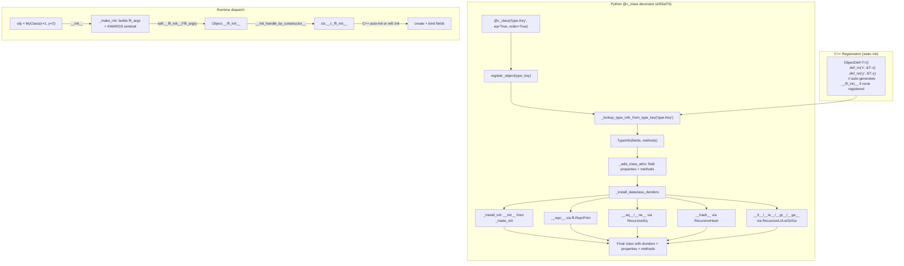

# Python Dataclasses (`tvm_ffi.dataclasses`)

**TL;DR**
- The `tvm_ffi.dataclasses` sub-package provides `@c_class`, which combines `register_object(type_key)` with structural dunder installation (`__eq__`, `__hash__`, `__lt__`, `__repr__`, `__init__`) delegating to C++ recursive operations (e5f3af7b). Decorated with `@dataclass_transform` for IDE/type-checker support.
- A `TypeInfo`/`TypeField`/`TypeMethod` Python-side data model mirrors C++ `TVMFFITypeInfo` and enables pure-Python introspection of FFI type metadata, with a triple registry (`TYPE_INDEX_TO_INFO` + `TYPE_KEY_TO_INFO` + `TYPE_INDEX_TO_CLS`) for fast dispatch.
- The `__ffi_init__` protocol standardizes constructor registration: C++ either explicitly registers `def(refl::init<Args...>())` or auto-generates `__ffi_init__` from reflection metadata (6b39efb), Python's `Object.__ffi_init__` dispatches through `type(self).__c_ffi_init__`, and `_add_class_attrs` always overrides `__c_ffi_init__` per type.
- Python `__init__` wiring (b1abaeac, 6973d225) uses `_make_init` / `_make_init_signature` / `_install_init` to bridge C++ auto-generated `__ffi_init__` to Python with proper `inspect.Signature`, respecting per-field `c_init`, `c_kw_only`, `c_has_default` flags.

## Problem Statement

### Background
- Defining Python proxies for C++ FFI types required boilerplate: `@register_object("key")`, a manual `__init__` calling `self.__init_handle_by_constructor__`, and separate field property definitions.
- There was no Python-side introspection of C++ type reflection data; metadata was only accessible through C API calls.
- Constructor registration used ad-hoc names (`__create__`) with no standardized pattern.

### Solution
- `@c_class(type_key)` reads `TypeInfo` fields from C++ reflection, validates Python annotations match C++ field names, creates properties, and synthesizes `__init__` with defaults.
- `TypeInfo`, `TypeField`, `TypeMethod` dataclasses surface C-side reflection data as first-class Python objects.
- `reflection::init<T, Args...>` and the `__ffi_init__` convention standardize constructor registration.

### Goals
- **Goal**: Dataclass-style syntax for FFI type proxies with minimal boilerplate.
- **Goal**: Full Python-side introspection of C++ type reflection metadata.
- **Goal**: Standardized constructor convention across C++ and Python.
- **Non-goal**: Replace `@register_object` entirely; `@c_class` is for types with reflection metadata, `@register_object` remains for legacy or non-reflectable types.

## Design



### Key Classes, Fields and Interfaces

**`TypeInfo`** (Cython dataclass, `cython/type_info.pxi`):
```python
@dataclasses.dataclass(eq=False)
class TypeInfo:
    type_cls: type | None           # None for unregistered types
    type_index: int
    type_key: str
    fields: list[TypeField]
    methods: list[TypeMethod]
    parent_type_info: TypeInfo | None
```

**`TypeField`** (Cython dataclass, `cython/type_info.pxi`):
```python
@dataclasses.dataclass(eq=False)
class TypeField:
    name: str
    doc: str | None
    size: int
    offset: int
    frozen: bool                    # True if read-only
    getter: FieldGetter            # Cython cdef class, callable(Object) -> value
    setter: FieldSetter            # Cython cdef class, callable(Object, value) -> None
    dataclass_field: Field | None  # Set by c_class for default handling
    def as_property(self, cls: type) -> property: ...
```

**`TypeMethod`** (Cython dataclass, `cython/type_info.pxi`):
```python
@dataclasses.dataclass(eq=False)
class TypeMethod:
    name: str
    doc: str | None
    func: object                   # FFI Function object
    is_static: bool
```

**Triple type registry** (Cython module-level, `cython/object.pxi`):

| Registry | Type | Purpose |
|----------|------|---------|
| `TYPE_INDEX_TO_INFO` | `cdef list[TypeInfo \| None]` | Maps type_index -> TypeInfo |
| `TYPE_KEY_TO_INFO` | `cdef dict[str, TypeInfo]` | Maps type_key -> TypeInfo |
| `TYPE_INDEX_TO_CLS` | `cdef list[type \| None]` | Maps type_index -> Python class (hot path) |

Invariant: `len(TYPE_INDEX_TO_CLS) == len(TYPE_INDEX_TO_INFO)`. Both are always extended together. `TYPE_INDEX_TO_CLS[i]` equals `TYPE_INDEX_TO_INFO[i].type_cls` when both are non-None.

**`c_class(type_key, *, init, repr, eq, order, unsafe_hash) -> Callable`** (`dataclasses/c_class.py`, reimplemented in e5f3af7b):
```python
@dataclass_transform(eq_default=False, order_default=False)
def c_class(
    type_key: str,
    *,
    init: bool = True,
    repr: bool = True,
    eq: bool = False,
    order: bool = False,
    unsafe_hash: bool = False,
) -> Callable[[_T], _T]:
    """Register a C++ FFI class and install structural dunder methods."""
    def decorator(cls: _T) -> _T:
        cls = register_object(type_key)(cls)
        _install_dataclass_dunders(cls, init=init, repr=repr, eq=eq, order=order, unsafe_hash=unsafe_hash)
        return cls
    return decorator
```
Parameters: `init` (default True) installs `__init__` from C++ reflection metadata via `_install_init`; `repr` (default True) installs `__repr__` via `ffi.ReprPrint`; `eq` (default False) installs `__eq__`/`__ne__` via `RecursiveEq`; `order` (default False) installs `__lt__`/`__le__`/`__gt__`/`__ge__` via `RecursiveLt`/`Le`/`Gt`/`Ge`; `unsafe_hash` (default False) installs `__hash__` via `RecursiveHash`. User-defined dunders in the class body are never overwritten.

**`_install_dataclass_dunders(cls, *, init, repr, eq, order, unsafe_hash) -> None`** (`registry.py`, e5f3af7b):
Installs structural dunders on a class. Each dunder delegates to the corresponding C++ recursive structural operation. Uses `_is_comparable(self, other) -> bool` to return `NotImplemented` for unrelated types (checks `isinstance(other, type(self)) or isinstance(self, type(other))`).

**`_make_init(type_cls, type_info) -> Callable`** (`registry.py`, b1abaeac):
Builds a Python `__init__` that delegates to `self.__ffi_init__(*ffi_args)` using the KWARGS sentinel protocol. Reads per-field `c_init`, `c_kw_only`, `c_has_default` from `TypeField` bitmask. Sets `__signature__` from `_make_init_signature` for introspection.

**`_make_init_signature(type_info) -> inspect.Signature`** (`registry.py`, b1abaeac):
Constructs `inspect.Signature` from reflection fields: walks the parent chain (parent-first), collects init-participating fields, reorders required-before-optional within positional and keyword-only groups.

**`_install_init(cls, *, enabled: bool) -> None`** (`registry.py`, 6973d225):
If `enabled=True` and no user-defined `__init__` exists: checks `__ffi_init__` method metadata for `auto_init=True`, then calls `_make_init`; otherwise exposes raw `__ffi_init__` as `__init__`. If `enabled=False`, installs a guard that raises `TypeError`.

**New `TypeField` properties** (exposed via Cython, b1abaeac):
- `field.c_init: bool` -- whether field participates in init (inverse of `kTVMFFIFieldFlagBitMaskInitOff`)
- `field.c_kw_only: bool` -- keyword-only parameter (`kTVMFFIFieldFlagBitMaskKwOnly`)
- `field.c_has_default: bool` -- has default value (`kTVMFFIFieldFlagBitMaskHasDefault`)

**`core.KWARGS`** -- sentinel object for KWARGS calling convention (`ffi.GetKwargsObject()`), used by `_make_init` to separate positional args from keyword args in the packed call.

**Removed exports** (b97ff1a): `field()`, `Field`, `KW_ONLY`, `MISSING`, `_utils.py`, `field.py` -- all deleted. Python-side field descriptor infrastructure is now handled by C++ reflection metadata and the C++ auto-init system (6b39efb).

**`reflection::init<Args...>`** (C++, `reflection/registry.h`, fc2630f):
```cpp
namespace tvm::ffi::reflection {
template <typename... Args>
struct init {
  init();  // default constructor
private:
  template <typename Class>
  static inline ObjectRef execute(Args&&... args);
  // Calls make_object<Class>(forward<Args>(args)...) where Class is deduced
};
}
```

**`Object.__ffi_init__`** (Cython, `cython/object.pxi`):
```python
def __ffi_init__(self, *args) -> None:
    self.__init_handle_by_constructor__(type(self).__c_ffi_init__, *args)
```

**`__ffi_init__` -> `__c_ffi_init__` renaming** (`registry.py`):
When `_add_class_attrs` encounters a reflected method named `__ffi_init__`, it renames it to `__c_ffi_init__` on the class to prevent collision with `Object.__ffi_init__` (the dispatch method). **Always overrides** (b97ff1a): `__c_ffi_init__` is now always set per type (matching `__ffi_shallow_copy__` pattern), preventing inherited base-class constructors from masking derived-class constructors.

**Registration functions**:

| Function | Signature | Purpose |
|----------|-----------|---------|
| `_register_object_by_index` | `(type_index: int, type_cls: type) -> TypeInfo` | Register a Python class for a type index; returns TypeInfo |
| `_lookup_type_info_from_type_key` | `(type_key: str) -> TypeInfo` | Create/return TypeInfo from C++ reflection data |
| `_set_type_cls` | `(type_index: int, type_cls: type) -> None` | Deferred class registration (sets type_cls after TypeInfo created with None) |

### Contracts, Assumptions and Invariants
- **c_class = register_object + structural dunders** (e5f3af7b): `c_class` calls `register_object(type_key)` then `_install_dataclass_dunders` with the provided flags. All field/method binding is delegated to C++ reflection + `_add_class_attrs`. Python-side field descriptors (`Field`, `KW_ONLY`, `field()`) have been removed (b97ff1a).
- **C++ is the single source of truth** (b97ff1a): Field metadata (types, defaults, kw_only, repr visibility) is defined entirely in C++ `ObjectDef` registration. Python annotations are optional documentation.
- **`__c_ffi_init__` always-override** (b97ff1a): `_add_class_attrs` always sets `__c_ffi_init__` per type, preventing inherited base-class constructors from masking derived-class constructors.
- **Unregistered type fallback**: `make_ret_object` guards against None entries in `TYPE_INDEX_TO_CLS`. When a C++ type has no Python registration, it falls back to `Object` with a `UserWarning`.
- **TYPE_INDEX_TO_CLS sync invariant**: `TYPE_INDEX_TO_CLS` and `TYPE_INDEX_TO_INFO` must always have the same length. Both are extended atomically in `_register_object_by_index`.
- **isinstance correctness** (721d8781): `_ObjectSlotsMeta.__instancecheck__`/`__subclasscheck__` were removed because they unconditionally returned True for any `CObject` instance/subclass. Standard Python MRO-based isinstance/issubclass now correctly distinguishes Object subclasses (e.g., `isinstance(Map(...), Array)` returns False).
- **Structural dunder user-override priority** (e5f3af7b): `_install_dataclass_dunders` never overwrites a dunder already defined in `cls.__dict__`. User-defined `__eq__`, `__hash__`, `__init__`, `__repr__` are always preserved.
- **NotImplemented for unrelated types** (e5f3af7b): Structural comparison dunders return `NotImplemented` when `self` and `other` do not share a type hierarchy, enabling Python to fall back to identity comparison.

### Extension Points
- **Custom `__init__`**: Users can provide their own `__init__` in the class body; both `c_class` and `@register_object` will skip `__init__` synthesis and the user calls `self.__ffi_init__()` manually.
- **Auto `__init__` for `@register_object` classes** (6973d225): `_install_init` is called by both `register_object` (with `enabled=True`) and `c_class`. It checks `__ffi_init__` method metadata for `auto_init=True` and synthesizes a Python `__init__` via `_make_init` with proper `inspect.Signature`. If the class body defines `__init__`, it is kept. If no `__ffi_init__` exists and no `__init__` is present (and the class is not a `PyNativeObject` subclass), a sentinel `__init__invalid` is set that raises `TypeError`.
- **C++ auto-init** (6b39efb): When no explicit `refl::init<Args...>` is registered, `ObjectDef` destructor auto-generates `__ffi_init__` from reflection field metadata via `RegisterAutoInit`. Per-field control via `refl::init(false)` (InitOff) and `refl::kw_only(true)` (KwOnly) flags. See [ADR 0027](../ADRs/0027-auto-init-from-reflection.md).
- **Per-field opt-out** (6b39efb): `refl::compare(false)`, `refl::hash(false)`, `refl::init(false)`, `refl::kw_only(true)` control field participation in recursive comparison, hashing, and auto-init.

### Usage Examples

#### End-to-end: C++ type with `@c_class` proxy and inheritance
**Context**: Defining a reflectable C++ type hierarchy with Python dataclass-style proxies.

```cpp
// C++ side (src/ffi/extra/testing.cc)
class TestCxxClassBase : public Object {
 public:
  int64_t v_i64;
  int32_t v_i32;
  TestCxxClassBase(int64_t v_i64, int32_t v_i32) : v_i64(v_i64), v_i32(v_i32) {}
  TVM_FFI_DECLARE_OBJECT_INFO("testing.TestCxxClassBase", TestCxxClassBase, Object);
};

class TestCxxClassDerived : public TestCxxClassBase {
 public:
  double v_f64;
  float v_f32;
  TestCxxClassDerived(int64_t a, int32_t b, double c, float d)
      : TestCxxClassBase(a, b), v_f64(c), v_f32(d) {}
  TVM_FFI_DECLARE_OBJECT_INFO("testing.TestCxxClassDerived", TestCxxClassDerived, TestCxxClassBase);
};

TVM_FFI_STATIC_INIT_BLOCK() {
  refl::ObjectDef<TestCxxClassDerived>()
      .def_static("__ffi_init__", refl::init<TestCxxClassDerived, int64_t, int32_t, double, float>)
      .def_rw("v_f64", &TestCxxClassDerived::v_f64)
      .def_rw("v_f32", &TestCxxClassDerived::v_f32);
}
```
```python
# Python side (simplified since b97ff1a -- c_class = register_object)
from tvm_ffi.dataclasses import c_class
from tvm_ffi import Object

@c_class("testing.TestCxxClassBase")
class _TestCxxClassBase(Object):
    v_i64: int
    v_i32: int

@c_class("testing.TestCxxClassDerived")
class _TestCxxClassDerived(_TestCxxClassBase):
    v_f64: float
    v_f32: float

# __init__ comes from C++ auto-generated __ffi_init__ (positional args in field order)
obj = _TestCxxClassDerived(123, 456, 4.0, 8.0)
assert obj.v_f32 == 8.0
assert obj.v_i64 == 123  # inherited field
```

#### C++ auto-init with per-field control
**Context**: C++ defines field-level init participation; Python side uses simplified c_class.
```cpp
// C++ side: auto-init generated from reflection metadata
TVM_FFI_STATIC_INIT_BLOCK() {
  refl::ObjectDef<TestCxxInitSubset>()
      .def_rw("required_field", &TestCxxInitSubset::required_field)
      .def_rw("optional_field", &TestCxxInitSubset::optional_field,
              refl::init(false))  // excluded from auto-init
      .def_rw("note", &TestCxxInitSubset::note,
              refl::DefaultValue("default-note"));
  // No refl::init<Args...> -> auto-generated __ffi_init__
}
```
```python
@c_class("testing.TestCxxInitSubset")
class _TestCxxInitSubset(Object):
    required_field: int
    optional_field: int   # init=False in C++ (excluded from __ffi_init__)
    note: str

obj = _TestCxxInitSubset(42)  # only required_field as positional
assert obj.required_field == 42
assert obj.note == "default-note"  # C++ default applied
```

#### Introspecting TypeInfo
**Context**: Programmatic access to C++ type reflection from Python.
```python
import tvm_ffi
from tvm_ffi.core import TypeInfo

info = tvm_ffi.core._lookup_type_info_from_type_key("testing.TestCxxClassBase")
assert isinstance(info, TypeInfo)
assert info.type_key == "testing.TestCxxClassBase"
for f in info.fields:
    print(f"field: {f.name}, frozen={f.frozen}, size={f.size}")
for m in info.methods:
    print(f"method: {m.name}, static={m.is_static}")
```

#### c_class with structural equality and ordering
**Context**: Using `@c_class` with `eq`, `order`, and `unsafe_hash` to get Python-standard comparison and hashing from C++ recursive operations (e5f3af7b).
```python
from tvm_ffi.dataclasses import c_class
from tvm_ffi import Object

@c_class("testing.MyClass", eq=True, unsafe_hash=True, order=True)
class MyClass(Object):
    v_i64: int
    v_f64: float

a = MyClass(1, 2.0)
b = MyClass(1, 2.0)
assert a == b           # RecursiveEq
assert hash(a) == hash(b)  # RecursiveHash
assert not a < b        # RecursiveLt
assert a in {b}         # hash + eq
```

#### Repr and kw_only via C++ reflection traits
**Context**: Field repr visibility and keyword-only parameters are now controlled in C++ via reflection traits (6b39efb), not Python-side `field()` descriptors.
```cpp
// C++ side: control repr, kw_only, compare at registration time
TVM_FFI_STATIC_INIT_BLOCK() {
  refl::ObjectDef<ConfigObj>()
      .def_rw("name", &ConfigObj::name)
      .def_rw("value", &ConfigObj::value, refl::DefaultValue(0))
      .def_rw("internal", &ConfigObj::internal,
              refl::repr(false), refl::init(false))
      .def_rw("tag", &ConfigObj::tag, refl::kw_only(true));
}
```
```python
@c_class("my_ext.Config")
class Config(Object):
    name: str
    value: int
    internal: Any  # excluded from repr and init
    tag: str       # keyword-only

cfg = Config("test", 42, tag="v1")
repr(cfg)  # "my_ext.Config(name=\"test\", value=42, tag=\"v1\")" -- internal excluded
```

## Alternatives & Trade-offs
### Manual `@register_object` + `__init__`
- Pros: Explicit, no magic, works without C++ reflection metadata.
- Cons: Boilerplate-heavy for types with many fields. No default value handling. No field introspection. Each type requires hand-written `__init__` calling `__init_handle_by_constructor__`.

### Python `dataclasses.dataclass` (stdlib)
- Pros: Familiar API, battle-tested.
- Cons: Cannot bind to C++ objects. Does not integrate with FFI reflection. `c_class` mirrors the `dataclass` API where possible (`field()`, `default_factory`, `init` parameter) but targets cross-language objects.

## Related Work
### Design Docs & ADRs
- [0009-reflection.md](0009-reflection.md) -- C++ reflection system that `c_class` consumes
- [0014-python-package.md](0014-python-package.md) -- Python package structure, `register_object`, `Object` base class
- [0015-python-ffi-call-dispatch.md](0015-python-ffi-call-dispatch.md) -- Type-cached dispatch that uses `TYPE_INDEX_TO_CLS`
- [0017-c-class-over-register-object.md](../ADRs/0017-c-class-over-register-object.md) -- Decision: when to use `@c_class` vs `@register_object`

### Evidence Matrix
- TypeInfo/TypeField/TypeMethod introduction -> `2025-09-19-53b2e00e.md` (53b2e00)
- `reflection::init<T, Args...>`, `__ffi_init__` convention -> `2025-09-21-c01dadf3.md` (c01dadf)
- `@c_class` decorator, `Object.__ffi_init__`, `__c_ffi_init__` renaming -> `2025-09-21-e98b94e1.md` (e98b94e)
- `field()` mypy fix, `_FieldValue` TypeVar -> `2025-09-22-b5dd851f.md` (b5dd851)
- `field(init=...)` three-way dispatch, `exec()`-based code gen -> `2025-09-24-daeb235a.md` (daeb235)
- TYPE_INDEX_TO_CLS parallel array -> `2025-09-23-035975a7.md` (035975a)
- Unregistered object fallback fix -> `2025-09-22-d68c8d8d.md` (d68c8d8)
- c_class `repr` parameter, method_repr, field(repr=), _get_all_fields -> `2026-01-18-360648f30ccb14523ab6fbb81f37eb085b801f98.md` (360648f)
- c_class `kw_only` parameter, KW_ONLY sentinel, field(kw_only=) -> `2026-01-18-3a5bf5e68ad1b4108045ef6b336a13efcd2037d9.md` (3a5bf5e)
- Remove Python-side field descriptor infrastructure (Field, KW_ONLY, _utils.py, field.py); simplify c_class = register_object; __c_ffi_init__ always-override -> `2026-02-27-b97ff1ae2abd21f5b8a368d5e04f34b53e3985bf.md` (b97ff1a)
- Python `_make_init`/`_make_init_signature` for __init__ wiring from C++ reflection with KWARGS convention -> `2026-02-28-b1abaeac7103606a458d2bb91438652030d5ae88.md` (b1abaeac)
- Reimplement `c_class` = register_object + structural dunders (__eq__, __hash__, __lt__, __repr__, __init__) delegating to C++ RecursiveEq/Hash/Lt/Le/Gt/Ge; `@dataclass_transform` -> `2026-02-28-e5f3af7bb83e6461c45d08117e4eaabe51add3b1.md` (e5f3af7b)
- Wire __init__ from C++ reflection in register_object + stubgen (`_install_init`, `InitFieldInfo`, `ObjectInfo.gen_init()`) -> `2026-03-01-6973d225eb3c67a7c306e36b20a100c5e9ff46f7.md` (6973d225)
- Remove broken `_ObjectSlotsMeta.__instancecheck__`/`__subclasscheck__` -> `2026-03-06-721d87816152e4a1cdc5c7906b116d46007699f8.md` (721d8781)
- Plus 2 supporting commits (RecursiveEq/Hash Python binding b87196f, 5796ff4; regression test dad4c402)
