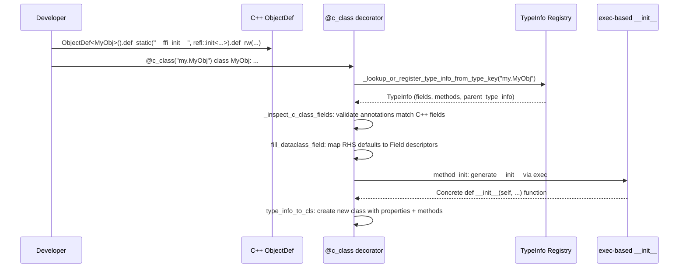

# c_class Decorator: FFI-Backed Dataclasses

**TL;DR**:
- The `@c_class(type_key)` decorator provides Python `dataclasses`-style syntax for defining classes backed by C++ objects registered via the `ObjectDef` reflection system.
- It validates Python type annotations against C++ reflected fields, synthesizes `__init__` methods via `exec`-based code generation, and supports `field(init=False)` for selective parameter exclusion.
- The `__ffi_init__` calling convention bridges the Python constructor to the C++ `reflection::init<T, Args...>` factory, routed through `Object.__ffi_init__` -> `type(self).__c_ffi_init__`.

## Problem Statement
### Background
- C++ object types registered with `ObjectDef` expose fields and a constructor via the reflection system. The existing `@register_object(type_key)` decorator auto-populates fields as Python properties but requires manual `__init__` methods that call `self.__init_handle_by_constructor__(ConstructorFunc, *args)`.
- This is verbose and error-prone. Users must manually track field ordering, handle defaults, and keep the Python `__init__` signature in sync with the C++ constructor.

### Solution
- `@c_class(type_key)` reads the C++ reflection metadata (via `TypeInfo`), validates that the Python class annotations match the C++ fields, and generates a proper `__init__` method that delegates to the C++ constructor.
- Uses Python's `exec`-based code generation pattern (same as `dataclasses` and `pydantic`) for clean signatures and stack traces.

### Goals
- Declarative Python class definitions that mirror C++ reflectable objects with type safety.
- Automatic `__init__` synthesis with defaults, `field(init=False)`, and `__post_init__` support.
- Non-goals: supporting mutable field overrides from Python; runtime schema evolution; automatic C++ code generation from Python annotations.

## Design

### End-to-End Workflow



### Key Classes, Fields and Interfaces

**Decorator**:
```python
def c_class(type_key: str, init: bool = True) -> Callable[[type], type]:
    """Decorated with @dataclass_transform. Reads C++ reflection metadata,
    validates annotations, synthesizes __init__, creates class with properties."""
```

**Field descriptor**:
```python
class Field:
    __slots__ = ("default_factory", "init", "name")
    def __init__(self, *, name: str | None = None,
                 default_factory: Callable[[], _FieldValue] | _MISSING_TYPE = MISSING,
                 init: bool = True) -> None: ...

def field(*, default: _FieldValue = MISSING,
          default_factory: Callable[[], _FieldValue] = MISSING,
          init: bool = True) -> _FieldValue:  # TypeVar return for mypy compat
    """Factory for Field descriptors. Mirrors dataclasses.field() semantics."""
```

The `field()` return type uses `_FieldValue = TypeVar("_FieldValue")` with `typing.cast` internally, mirroring how `dataclasses.field` is typed in typeshed. This eliminates `# type: ignore[assignment]` noise in class definitions.

**C++ helper**:
```cpp
namespace tvm::ffi::reflection {
template <typename T, typename... Args>
inline ObjectRef init(Args&&... args) {
    // If T derives from Object: make_object<T>(forward<Args>(args)...) -> ObjectRef
    // If T derives from ObjectRef: make_object<T::ContainerType>(forward<Args>(args)...) -> ObjectRef
}
}
```

**Python calling convention**:
```python
class Object:
    def __ffi_init__(self, *args) -> None:
        """Dispatches to type(self).__c_ffi_init__(*args) via __init_handle_by_constructor__."""
        self.__init_handle_by_constructor__(type(self).__c_ffi_init__, *args)
```

The `__ffi_init__` name in C++ reflection is renamed to `__c_ffi_init__` as a class attribute in Python (to avoid collision with the `Object.__ffi_init__` instance method).

### exec-Based __init__ Code Generation

`method_init()` in `_utils.py` generates `__init__` at class-creation time:

```python
def method_init(type_cls, type_info) -> Callable:
    """Generate __init__ via exec, following dataclasses/pydantic pattern."""
    # 1. Separate fields into three categories:
    #    a) init=True: appear in __init__ signature
    #    b) init=False with default: computed silently, forwarded to __ffi_init__
    #    c) init=False without default: omitted from __ffi_init__ call (C++ sets them)
    # 2. Build parameter list with defaults (MISSING sentinel for lazy factory)
    # 3. Generate function body that evaluates defaults and calls self.__ffi_init__(...)
    # 4. exec the source string, extract the function
    # 5. Call __post_init__ if defined on type_cls
```

The three-way field routing protocol:

| Field Configuration | In `__init__` Signature | Forwarded to `__ffi_init__` |
|--------------------|-----------------------|---------------------------|
| `init=True` (default) | Yes | Yes |
| `init=False` + `default`/`default_factory` | No | Yes (with computed default) |
| `init=False`, no default | No | No (C++ constructor sets it) |

### Contracts, Assumptions and Invariants
- **Annotation-field parity**: `_inspect_c_class_fields` validates that every Python annotation corresponds to a C++ reflected field and vice versa. `ClassVar`, `InitVar`, and `__tvm_ffi`-prefixed names are filtered. Extraneous or missing annotations raise `TypeError`.
- **`__ffi_init__` must exist**: The decorator requires that the C++ type registers a `__ffi_init__` static method. If absent, the decorator raises an error.
- **`__c_ffi_init__` renaming invariant**: Both `_add_class_attrs` (in `registry.py`, for `register_object`) and `type_info_to_cls` (in `_utils.py`, for `c_class`) rename the reflected `__ffi_init__` method to `__c_ffi_init__` on the Python class. The base `Object.__ffi_init__` instance method dispatches through `type(self).__c_ffi_init__`.
- **Inheritance**: `c_class` supports class hierarchies. `get_parent_type_info` walks `__bases__` for `__tvm_ffi_type_info__` to find the parent `TypeInfo`. Fields from parent classes are inherited through the C++ reflection chain.

### Extension Points
- **`__post_init__`**: If defined on the class, called after `__ffi_init__` in the generated `__init__`. Follows `dataclasses.__post_init__` convention.
- **Custom `__init__`**: If the class defines its own `__init__`, the decorator skips `__init__` synthesis (controlled by `init=True/False` on the decorator).
- **New `FieldInfoTrait` subclasses**: Future C++ field metadata (e.g., validators) would be accessible through `TypeField` and could be consumed by `c_class`.

### Usage Examples

#### Defining a C++-backed dataclass (end-to-end)
**Context**: A C++ class with a three-level hierarchy, partially bound in Python with defaults.

```cpp
// C++ side
class TestCxxClassBase : public Object {
 public:
  int64_t v_i64;
  int32_t v_i32;
  TestCxxClassBase(int64_t v_i64, int32_t v_i32) : v_i64(v_i64), v_i32(v_i32) {}
  static constexpr bool _type_mutable = true;
  TVM_FFI_DECLARE_OBJECT_INFO("testing.TestCxxClassBase", TestCxxClassBase, Object);
};

TVM_FFI_STATIC_INIT_BLOCK() {
  namespace refl = tvm::ffi::reflection;
  refl::ObjectDef<TestCxxClassBase>()
      .def_static("__ffi_init__", refl::init<TestCxxClassBase, int64_t, int32_t>)
      .def_rw("v_i64", &TestCxxClassBase::v_i64)
      .def_rw("v_i32", &TestCxxClassBase::v_i32);
}
```

```python
# Python side
from tvm_ffi.dataclasses import c_class, field

@c_class("testing.TestCxxClassBase")
class TestCxxClassBase:
    v_i64: int
    v_i32: int = 0  # default value

obj = TestCxxClassBase(v_i64=42)
assert obj.v_i64 == 42
assert obj.v_i32 == 0  # default applied
```

#### Using field(init=False) for hidden fields
**Context**: C++ constructor takes a subset of fields; some are set internally.

```python
@c_class("testing.TestCxxInitSubset")
class TestCxxInitSubset:
    required_field: int
    optional_field: int = field(init=False)                         # C++ sets to -1
    note: str = field(default_factory=lambda: "py-default", init=False)  # forwarded silently

obj = TestCxxInitSubset(required_field=42)
assert obj.required_field == 42
assert obj.optional_field == -1    # C++ constructor default
assert obj.note == "py-default"    # Python default_factory forwarded
```

### Evolution Timeline
| Version | Commit | Change | Motivation |
|---------|--------|--------|------------|
| v1 | c01dadf | `reflection::init<T, Args...>` helper + `__ffi_init__` convention | Eliminate constructor registration boilerplate |
| v2 | e98b94e | `c_class` decorator + `Field`/`field()` + `Object.__ffi_init__` method + exec-based `__init__` | Dataclass-style Python class definitions for C++ objects |
| v3 | b5dd851 | `field()` TypeVar return type | mypy compatibility without `type: ignore` |
| v4 | daeb235 | `field(init=False)` + exec-based code gen rewrite of `method_init()` | Selective `__init__` parameter exclusion |

## Alternatives & Trade-offs
### Use Python's standard `dataclasses.dataclass` directly
- Pros: No custom decorator needed; mature ecosystem integration.
- Cons: `dataclasses` generates Python-level storage and `__init__`; cannot delegate to C++ constructors or validate against reflection metadata. The Python object would have duplicate state (Python fields + C++ fields).
### Manual `__init__` with `__init_handle_by_constructor__` (status quo ante)
- Pros: Explicit; no magic code generation.
- Cons: Verbose; error-prone field ordering; no validation that Python annotations match C++ fields; must manually maintain defaults. Every new field requires updating the Python `__init__` signature.

## Related Work
### Design Docs & ADRs
- `.knowledge/designs/reflection.md` -- `ObjectDef<T>`, `def_static`, `reflection::init<T, Args...>`, `TypeInfo`
- `.knowledge/designs/0014-python-bindings.md` -- `register_object`, `Object.__init_handle_by_constructor__`, `TypeInfo`/`TypeField`/`TypeMethod`
- `.knowledge/designs/object-system.md` -- Object base class, `_type_mutable`, dual-class pattern

### Evidence Matrix
- `reflection::init<T>` + `__ffi_init__` convention -> `2025-09-21-c01dadf31a66e74cdbfd7fdb1ffc81a75007965f.md` + commit c01dadf
- `c_class` decorator + `Field`/`field()` + generated `__init__` -> `2025-09-21-e98b94e118dfa5ac4bcf3764a8b1695afee3d596.md` + commit e98b94e
- `field()` TypeVar return type for mypy -> `2025-09-22-b5dd851f7019f4f63a19d9dce074ba62706f16e7.md` + commit b5dd851
- `field(init=False)` + exec-based `method_init()` rewrite -> `2025-09-24-daeb235a29c576d8702d447fa5f4773170bb1e8f.md` + commit daeb235
- Plus 1 supporting commit (40e9c83 mypy enforcement)
