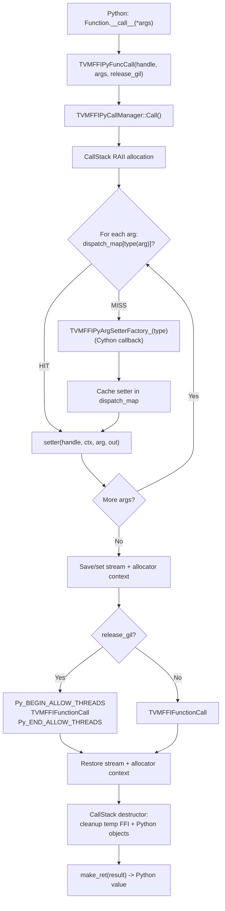
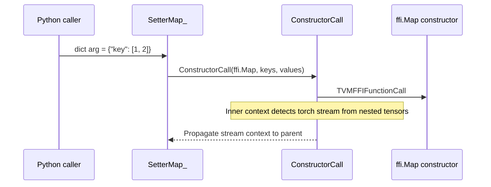

# Python FFI Call Dispatch (TVMFFIPyCallManager)

**TL;DR**
- The Python FFI hot path uses a C++-based type-dispatched call manager (`TVMFFIPyCallManager`) that caches per-`PyTypeObject*` argument setter function pointers in a thread-local `unordered_map`, reducing argument dispatch from O(n) `isinstance`-chain to O(1) hash lookup on repeat calls.
- The architecture separates three concerns: (1) `TVMFFIPyArgSetterFactory` (Cython callback) classifies new Python types on first encounter, (2) `TVMFFIPyArgSetter` (C function pointer) converts a single argument per invocation, (3) `TVMFFIPyCallManager` orchestrates stack allocation, GIL management, stream/allocator context, and temporary object lifetime via RAII.
- Temporary FFI and Python objects are tracked in a pre-allocated C++ stack (`CallStack`) rather than a Python list, eliminating Python list allocation overhead on every FFI call.

## Problem Statement

### Background

The previous Cython argument-packing function (`make_args`) performed an O(n) `isinstance`-chain per argument on every FFI call: `Tensor` > `Object` > `torch.Tensor` > `__dlpack__` > `PyNativeObject` > `bool` > `int` > `float` > `DType` > `Device` > `str` > ... (20 priority items). For hot paths calling the same function repeatedly with the same argument types, the `isinstance` chain was measurable overhead. Temporaries were tracked in a Python `list` (`temp_args`), incurring Python list allocation and `append` overhead per call.

### Solution

A C++ call manager (`tvm_ffi_python_helpers.h`) that:
- Caches a `TVMFFIPyArgSetter` function pointer per `PyTypeObject*` in a thread-local `unordered_map`.
- On first encounter of a new type, invokes a Cython factory callback (`TVMFFIPyArgSetterFactory_`) to classify the type and produce the setter.
- On subsequent calls with the same type, bypasses the factory entirely (O(1) hash lookup).
- Pre-allocates a thread-local C++ stack for packed arguments and temporary tracking, falling back to heap for large argument lists.

### Goals

- **Goal**: O(1) per-argument type dispatch on repeat calls with the same argument types.
- **Goal**: Eliminate Python list allocation for temporary tracking.
- **Goal**: Preserve the existing argument packing priority order and correctness.
- **Goal**: Support GIL release, stream context, and DLPack allocator context threading.
- **Non-goal**: Thread-safe dispatch map (thread-local by design, no sharing).

## Design

### Architecture Overview



### Three-Layer Architecture

```mermaid
graph TB
    subgraph "Layer 1: Factory (Cython)"
        FACTORY["TVMFFIPyArgSetterFactory_()"]
        NOTE_F["One-time type classification\nReturns TVMFFIPyArgSetter + metadata\nPriority order preserved"]
    end
    subgraph "Layer 2: Setters (C/Cython functions)"
        S_TENSOR["SetterTensor_"]
        S_OBJ["SetterObject_"]
        S_DLPACK["SetterDLPackFromPyObject_"]
        S_TORCH["SetterTorch_"]
        S_INT["SetterInt_ (C++)"]
        S_FLOAT["SetterFloat_ (C++)"]
        S_BOOL["SetterBool_ (C++)"]
        S_NONE["SetterNone_ (C++)"]
        S_STR["SetterStr_"]
        S_BYTES["SetterBytes_"]
        S_TUPLE["SetterTuple_"]
        S_LIST["SetterTupleLike_"]
        S_MAP["SetterMap_"]
        S_CALLABLE["SetterCallable_"]
        S_FALLBACK["SetterFallback_"]
    end
    subgraph "Layer 3: Call Manager (C++)"
        MGR["TVMFFIPyCallManager"]
        STACK["CallStack (RAII)"]
        DISPATCH["thread_local dispatch_map"]
    end
    FACTORY --> S_TENSOR
    FACTORY --> S_OBJ
    FACTORY --> S_DLPACK
    FACTORY --> S_TORCH
    FACTORY --> S_INT
    FACTORY --> S_FLOAT
    FACTORY --> S_BOOL
    FACTORY --> S_NONE
    FACTORY --> S_STR
    FACTORY --> S_BYTES
    FACTORY --> S_TUPLE
    FACTORY --> S_LIST
    FACTORY --> S_MAP
    FACTORY --> S_CALLABLE
    FACTORY --> S_FALLBACK
    MGR --> DISPATCH
    MGR --> STACK
```



### Argument Packing Priority Order (Post-Refactor)

The factory (`TVMFFIPyArgSetterFactory_`) classifies types in this order:

1. `None` -> `SetterNone_`
2. `Tensor` (FFI Tensor) -> `SetterTensor_`
3. `Object` (any registered FFI object) -> `SetterObject_`
4. `ObjectRValueRef` -> `SetterObjectRValueRef_`
5. `PyNativeObject` subclass of `str` -> `SetterPyNativeObjectStr_`
6. `PyNativeObject` subclass of `bytes` -> `SetterPyNativeObjectBytes_`
7. `PyNativeObject` (general) -> `SetterPyNativeObjectGeneral_`
8. `__c_dlpack_from_pyobject__` protocol -> `SetterDLPackFromPyObject_`
9. `torch.Tensor` -> `SetterTorch_` or `SetterDLPackFromPyObject_` (if C exporter available)
10. `__dlpack__` protocol -> `SetterDLPack_`
11. `bool` -> `SetterBool_` (C++, before int because `bool` is `int` subclass)
12. `Integral` (int) -> `SetterInt_` (C++)
13. `float` -> `SetterFloat_` (C++)
14. `_CLASS_DTYPE` -> `SetterDType_` (before `str` because DType subclasses `str`)
15. `_CLASS_DEVICE` -> `SetterDevice_`
16. `str` -> `SetterStr_` (uses `TVMFFIStringFromByteArray`)
17. `bytes`/`bytearray` -> `SetterBytes_` (uses `TVMFFIBytesFromByteArray`)
18. `tuple` -> `SetterTuple_` (recursive via `ConstructorCall`)
19. `list` -> `SetterTupleLike_` (recursive via `ConstructorCall`)
20. `dict` -> `SetterMap_` (recursive via `ConstructorCall`)
21. `ctypes.c_void_p` -> `SetterCtypesVoidPtr_`
22. `__tvm_ffi_opaque_ptr__` protocol -> `SetterFFIOpaquePtrCompatible_` (commit `42e0612` #147)
23. `numpy.dtype` -> `SetterDTypeFromNumpy_`
24. `__dlpack_data_type__` protocol -> `SetterDLPackDataTypeProtocol_` (commit `5e648f0` #178)
25. `__dlpack_device__` protocol (without `__dlpack__`) -> `SetterDLPackDeviceProtocol_` (commit `0f8bf9f` #179)
26. `__tvm_ffi_int__` protocol -> `SetterIntProtocol_` (returns int64 directly)
27. `__tvm_ffi_float__` protocol -> `SetterFloatProtocol_` (returns float64 directly)
28. `__tvm_ffi_value__` protocol -> `SetterFFIValueProtocol_` (returns any FFI-compatible Python object, re-dispatched)
29. `Exception` -> `SetterException_`
30. `ObjectConvertible` -> `SetterObjectConvertible_`
31. `callable` -> `SetterCallable_`
32. **Fallback**: any unrecognized type -> `SetterFallback_` (wraps as `OpaquePyObject`)

### Generic Value Protocols (Groups 17-21 Addition)

Three opt-in dunder protocols allow arbitrary Python classes to participate in FFI dispatch without modifying the core dispatch chain. See [ADR 0048](../ADRs/0048-generic-value-protocol.md).

| Protocol | Setter | Behavior |
|---|---|---|
| `__tvm_ffi_int__()` | `SetterIntProtocol_` | Calls method, writes result as int64 |
| `__tvm_ffi_float__()` | `SetterFloatProtocol_` | Calls method, writes result as float64 |
| `__tvm_ffi_value__()` | `SetterFFIValueProtocol_` | Calls method, pushes result to extra temp stack, re-dispatches via `TVMFFIPySetArgumentGenericDispatcher` |

The `__tvm_ffi_value__` protocol creates a temporary Python object that must outlive the FFI call. This is managed by a new `extra_temp_py_objects_stack` on `TVMFFIPyCallStack` (separate from the per-argument temp budget).

### Protocol-Based Argument Setters (Groups 14-16 Additions)

Several new protocol-based setters were added between commits `4bc8925` and `0f8bf9f`:

| Protocol | Setter | Type Passed to FFI | Introduced |
|---|---|---|---|
| `__tvm_ffi_tensor__()` | `SetterFFITensorCompatible_` | `kTVMFFITensor` via Object handle | `4bc8925` (#108) |
| `__tvm_ffi_object__()` | `SetterFFIObjectCompatible_` | Object handle from returned FFI object | `8873700` (#115) |
| `__cuda_stream__` | `SetterCUDAStream_` | `kTVMFFIOpaquePtr` (void*) | `b0537f0` (#109) |
| `__tvm_ffi_opaque_ptr__()` | `SetterFFIOpaquePtrCompatible_` | `kTVMFFIOpaquePtr` (void*) | `42e0612` (#147) |
| `__dlpack_data_type__()` | `SetterDLPackDataTypeProtocol_` | `kTVMFFIDataType` (DLDataType) | `5e648f0` (#178) |
| `__dlpack_device__()` | `SetterDLPackDeviceProtocol_` | `kTVMFFIDevice` (DLDevice) | `0f8bf9f` (#179) |

**`__tvm_ffi_object__` protocol** (generalized from `__tvm_ffi_tensor__`): Allows any Python wrapper type to return its underlying FFI object for fast dispatch. The initial `__tvm_ffi_tensor__` protocol (commit `4bc8925`) was renamed to `__tvm_ffi_object__` (commit `8873700`) to support generic objects, not just tensors.

**`__tvm_ffi_opaque_ptr__` protocol**: Enables DSL compilers to pass opaque C structs through the FFI by returning a raw pointer as `int` from `__tvm_ffi_opaque_ptr__()`.

**`__dlpack_data_type__` / `__dlpack_device__` protocols**: Enable dtype and device exchange from external frameworks using the DLPack-compatible protocols (`(type_code, bits, lanes)` for dtype, `(device_type, device_id)` for device). The `__dlpack_device__` setter is only used for objects that implement `__dlpack_device__` but **not** `__dlpack__` (to avoid conflict with tensor conversion).

### CallStack RAII

`TVMFFIPyCallContext` (promoted from the former inner `CallStack` class) pre-allocates `num_args * 2` `TVMFFIAny` slots from a thread-local `TVMFFIPyCallStack` (default 4KB, page-aligned). Memory layout:

```
[TVMFFIAny[0]..TVMFFIAny[num_args-1]]  -- packed arguments
[void* temp_ffi_objects[0..n]]           -- reinterpreted from second half
[void* temp_py_objects[0..m]]
```

Falls back to heap (`new TVMFFIAny[count]`) when the thread-local stack is exhausted. RAII destructor handles:
- Temporary FFI objects: `TVMFFIObjectDecRef` for each tracked object
- Temporary Python objects: `Py_DecRef` for each tracked Python object
- Extra temporary Python objects: `Py_DecRef` for each entry in `extra_temp_py_objects_stack` (used by `__tvm_ffi_value__` protocol)

The refactoring in commit `3dd7a81` promoted `CallStack` from an inner class of `TVMFFIPyCallManager` to standalone `TVMFFIPyCallContext`, and extracted the memory pool into `TVMFFIPyCallStack`. This enables the extra temp stack to be shared across nested calls without increasing the per-argument budget.

### ConstructorCall: Recursive Container Conversion

`TVMFFIPyConstructorCall` / `TVMFFIPyCallManager::ConstructorCall` enables recursive argument packing for nested containers. Unlike `FuncCall`, it:
- Does not set stream/allocator context itself
- Propagates detected `device_type`, `device_id`, `stream`, `c_dlpack_tensor_allocator`, and `c_dlpack_to_pyobject` back to the parent `TVMFFIPyCallContext`
- Used by `SetterTuple_`, `SetterTupleLike_`, `SetterMap_` to call `ffi.Array` or `ffi.Map` constructors



### Key Classes, Fields and Interfaces

- **`TVMFFIPyCallManager`** (`tvm_ffi_python_helpers.h`): Central orchestrator. Fields: `dispatch_map_` (thread-local `unordered_map<PyTypeObject*, TVMFFIPyArgSetter>`), `temp_stack_` (pre-allocated `TVMFFIAny[32]`), `factory_` (Cython callback). Methods: `Call`, `ConstructorCall`, `SetArgument`, `CallFieldSetter`, `PyObjectToFFIAny`.
- **`TVMFFIPyCallContext`** (C struct): Per-call context. Fields: `device_type`, `device_id`, `stream`, `c_dlpack_from_pyobject`, `c_dlpack_to_pyobject`, `c_dlpack_tensor_allocator`, `num_temp_ffi_objects`, `num_temp_py_objects`, `temp_ffi_objects`, `temp_py_objects`.
- **`TVMFFIPyArgSetter`** (C struct): Cached per-type dispatch entry. Fields: `setter_func` (C function pointer), `c_dlpack_from_pyobject`, `c_dlpack_to_pyobject`, `c_dlpack_tensor_allocator`.
- **`TVMFFIPyArgSetterFactory`** (C function pointer): `int (*)(PyTypeObject* type, TVMFFIPyArgSetter* out)`. Cython-implemented callback that classifies a new type.
- **`CallStack`** (C++ RAII class): Inherits `TVMFFIPyCallContext`. Manages pre-allocated stack and heap fallback.

### Contracts, Assumptions and Invariants

- **Type-level caching invariant**: The `TVMFFIPyArgSetter` returned by the factory must be correct for _all_ instances of the given `PyTypeObject*`, not just the specific instance passed to the factory. The setter is a function of the type, not the value. This holds because all setters dispatch on type identity, and subtypes with different FFI semantics (e.g., `DType` vs `str`) are given different setters by the factory's priority ordering.
- **Type liveness invariant**: Registered types are pinned in `_DISPATCH_TYPE_KEEP_ALIVE` (a `set` guarded by a threading lock) to prevent garbage collection. Without this, if a Python type object is collected and a new type reuses the same `PyTypeObject*` address, the `dispatch_map_` would incorrectly use the old type's setter (use-after-free). Fixed in commit `cfff30b`.
- **Factory priority ordering**: The factory must check `_CLASS_DTYPE` before `str` and `bool` before `Integral` to ensure subtypes get specialized setters before generic ones are cached.
- **Thread-local dispatch map**: Each thread has its own `dispatch_map_`. No locking is needed. The map grows lazily as new types are encountered.
- **Pre-allocated stack lifetime**: The thread-local `temp_stack_` must outlive all `CallStack` instances on the same thread. Guaranteed by `thread_local` storage duration.
- **GIL release is conditional**: `TVMFFIPyCallManager::Call` conditionally wraps `TVMFFIFunctionCall` in `Py_BEGIN_ALLOW_THREADS`/`Py_END_ALLOW_THREADS` based on the `release_gil` flag passed from `Function.release_gil`.
- **Stream/allocator context save-restore**: The call manager saves and restores both stream and allocator context around each function call.

### Extension Points

- **New Python types**: Add a branch in `TVMFFIPyArgSetterFactory_` (Cython). The dispatch map is automatically extended on first encounter.
- **New C-level setters for POD types**: Add `noexcept` C++ functions in `tvm_ffi_python_helpers.h` for types that benefit from avoiding Cython overhead.
- **New context fields**: Extend `TVMFFIPyCallContext` with new fields for additional per-call context (e.g., new framework integration hooks).
- **Framework dtype setters**: As of commit `d77606a`, `TVMFFIPyArgSetterDTypeFromTorch_` and `TVMFFIPyArgSetterDTypeFromNumpy_` convert framework dtype objects to `DLDataType` via lookup tables, integrated into the factory dispatch chain. See [0014-python-bindings](0014-python-bindings.md).

## Alternatives & Trade-offs

### Alternative A: Cython-level caching with Python `dict[type, callable]`

- Pros: Stays in Cython, simpler debugging.
- Cons: Python dict lookup overhead (~100ns vs ~20ns for `unordered_map`). Python function call overhead per setter. Does not eliminate Python list for temporaries.

### Alternative B: Typed function wrappers (per-signature specialization)

- Pros: Zero dispatch overhead for known signatures.
- Cons: Combinatorial explosion: N argument types ^ M arguments = infeasible number of wrappers. Cannot handle dynamic argument types.

### Alternative C: Keep `isinstance`-chain in Cython (status quo)

- Pros: Simple, readable, proven.
- Cons: O(n) per argument per call. Measurable overhead on hot paths. Python list allocation for temporaries.

## Related Work

### Design Docs & ADRs

- [`.knowledge/designs/0014-python-bindings.md`](0014-python-bindings.md) -- Package architecture and prior `make_args` description
- [`.knowledge/designs/0020-dlpack-exchange-acceleration.md`](0020-dlpack-exchange-acceleration.md) -- DLPack C-level exchange consumed by DLPack setters
- [`.knowledge/designs/0004-function-system.md`](0004-function-system.md) -- Packed calling convention used by `TVMFFIFunctionCall`
- [`.knowledge/designs/0001-c-abi.md`](0001-c-abi.md) -- C API functions consumed by setters
- [`.knowledge/ADRs/0033-type-dispatched-arg-setter.md`](../ADRs/0033-type-dispatched-arg-setter.md) -- Decision to adopt type-dispatched caching
- [`.knowledge/ADRs/0035-optional-gil-release.md`](../ADRs/0035-optional-gil-release.md) -- Per-function GIL release decision
- [`.knowledge/ADRs/0037-recursive-container-conversion-in-cython.md`](../ADRs/0037-recursive-container-conversion-in-cython.md) -- Recursive container conversion via ConstructorCall

### Evidence Matrix

- TVMFFIPyCallManager architecture + type-dispatched setter caching -> `.knowledge/commits/2025-09-11-38d2cdaa03adc26a630e9cc3cc99b3c7e9f55097.md` + `38d2cda` + `python/tvm_ffi/cython/tvm_ffi_python_helpers.h`
- ConstructorCall for recursive container conversion -> `.knowledge/commits/2025-09-13-043d9f647677cc3b4a8baba198a2ced45f99cc98.md` + `043d9f6` + `python/tvm_ffi/cython/function.pxi`
- TVMFFIStringFromByteArray/TVMFFIBytesFromByteArray string setters -> `.knowledge/commits/2025-09-13-043d9f647677cc3b4a8baba198a2ced45f99cc98.md` + `043d9f6` + `include/tvm/ffi/c_api.h`
- Function as cdef class with release_gil -> `.knowledge/commits/2025-09-12-f81ab9c25ae4d2a42706747c50c5c410c51d6cdd.md` + `f81ab9c` + `python/tvm_ffi/cython/function.pxi`
- DLPack converter renames (FromPyObject/ToPyObject) -> `.knowledge/commits/2025-09-12-4dee97f1b6473f32faeb8cd24fb2c960f3b17190.md` + `4dee97f`
- Stream/allocator context save-restore in call manager -> `.knowledge/commits/2025-09-12-f81ab9c25ae4d2a42706747c50c5c410c51d6cdd.md` + `f81ab9c`
- Framework dtype setters (torch.dtype/numpy.dtype) -> `.knowledge/commits/2025-09-19-d77606afb21e3a40bc1da9cfaabd04562afbc1d0.md` + `d77606a`
- GC race fix (_DISPATCH_TYPE_KEEP_ALIVE type pinning) -> `.knowledge/commits/2025-09-26-cfff30bd59e401e426ed6f3a3de5f7280ce5aed0.md` + `cfff30b`
- Always-inline hints on call-manager helpers + 4K stack size -> `.knowledge/commits/2025-09-26-000e1970c197b4b73f0670c647fb5582263712f6.md` + `000e197`
- __tvm_ffi_tensor__ protocol introduction -> `.knowledge/commits/2025-10-13-4bc892542b937074e1d813ae7e7f8ea204be4aac.md` + `4bc8925`
- __tvm_ffi_tensor__ renamed to __tvm_ffi_object__ protocol -> `.knowledge/commits/2025-10-14-8873700a87d0b8426d1840f29e28015e7be2e48c.md` + `8873700`
- __cuda_stream__ protocol support -> `.knowledge/commits/2025-10-13-b0537f045b30334a12bf3365438aedb2c3bc7285.md` + `b0537f0`
- __tvm_ffi_opaque_ptr__ protocol -> `.knowledge/commits/2025-10-16-42e0612838b231570864474ed3e1a8b1b0ebdfca.md` + `42e0612`
- __dlpack_data_type__ protocol -> `.knowledge/commits/2025-10-20-5e648f052f93a423f7ef3cb20d2675925d64bf96.md` + `5e648f0`
- __dlpack_device__ protocol -> `.knowledge/commits/2025-10-20-0f8bf9fc582fff89e838cadf2aacbfb2a5724ddf.md` + `0f8bf9f`
