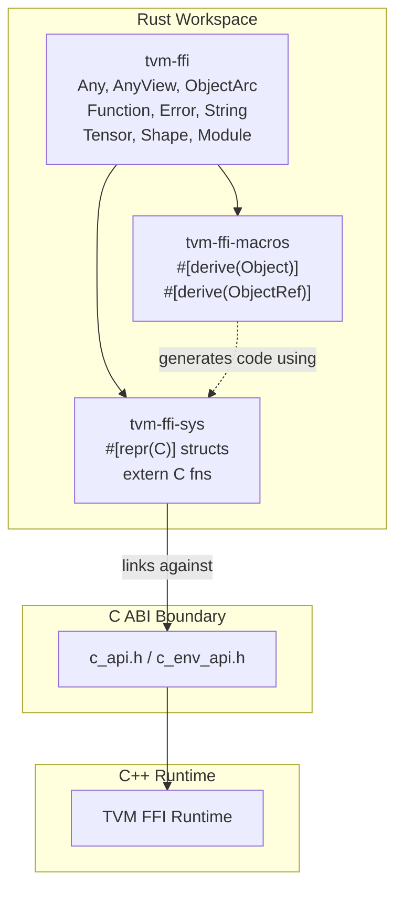
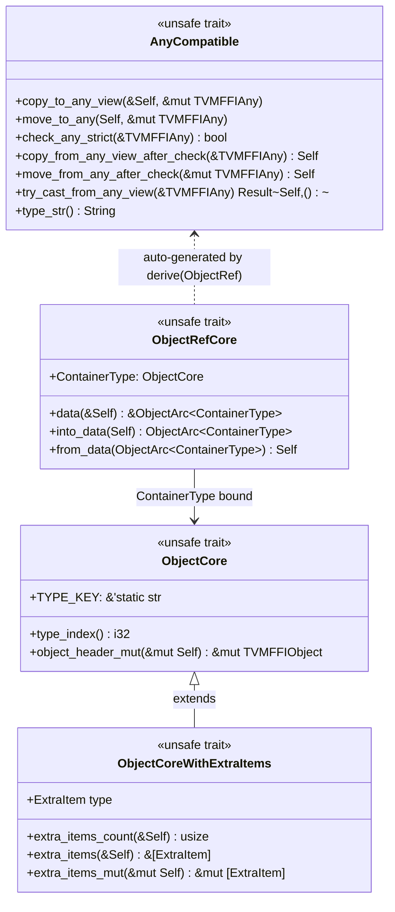

# Rust FFI Bindings (3-Crate Workspace)

**TL;DR**
- Provides ergonomic Rust APIs for the TVM FFI C ABI through a 3-crate workspace: `tvm-ffi-sys` (raw C ABI), `tvm-ffi-macros` (proc-macro code generation), and `tvm-ffi` (high-level API).
- Maps the C++ Object/ObjectRef pattern to Rust via `ObjectCore`/`ObjectRefCore` traits and `#[derive(Object)]`/`#[derive(ObjectRef)]` proc macros, with native atomic refcounting reimplemented in pure Rust for efficiency.
- Supports both consuming FFI libraries (loading `.so` modules, calling global functions) and producing them (exporting Rust functions via `tvm_ffi_dll_export_typed_func!`).

## Problem Statement

### Background
- The TVM FFI C ABI (`.knowledge/designs/0001-c-abi-layer.md`) defines the cross-language substrate that Python/Cython bindings already use, but no Rust binding existed.
- Rust users need safe, ergonomic wrappers over the C ABI that integrate with Rust's ownership model (RAII, `Drop`, `Clone`) while preserving the exact ABI semantics (type-erased `Any`/`AnyView`, intrusive refcounting with strong/weak split, packed calling convention).
- The C++ API uses macros (`TVM_FFI_DECLARE_OBJECT_INFO`, `TVM_FFI_DEFINE_OBJECT_REF_METHODS`) and template specializations (`TypeTraits<T>`) that have no direct equivalent in Rust; the binding must replicate these patterns using Rust's trait system and proc macros.

### Solution
- A 3-crate workspace under `rust/`:
  - **`tvm-ffi-sys`**: Hand-written `#[repr(C)]` struct definitions and `extern "C"` function declarations mirroring `c_api.h`. Not generated by bindgen — manually authored for precise control over atomic semantics and layout.
  - **`tvm-ffi-macros`**: Proc-macro crate providing `#[derive(Object)]` and `#[derive(ObjectRef)]` to auto-generate trait implementations and ABI glue.
  - **`tvm-ffi`**: High-level API with safe wrappers: `Any`, `AnyView`, `ObjectArc<T>`, `Function`, `Error`, `String`, `Bytes`, `Tensor`, `Shape`, `Module`.

### Goals
- **Goal**: Provide type-safe Rust wrappers for the full TVM FFI object/function/error surface.
- **Goal**: Enable Rust code to both consume and produce TVM FFI shared libraries.
- **Goal**: Zero overhead for refcount operations (native Rust atomics, no FFI call per inc/dec_ref).
- **Non-goal**: Reflection-based object creation from Rust (not implemented in this initial bringup).
- **Non-goal**: Rust implementations of all containers — `Map`, `List`, `Dict` are not yet bound. `Array<T>` was added in d0d0e2f.

## Design

The Rust binding mirrors the C++ layer structure but maps C++ patterns to Rust idioms:



**C++ to Rust pattern mapping:**

| C++ Pattern | Rust Equivalent |
|---|---|
| `TypeTraits<T>` (8-method template specialization) | `unsafe trait AnyCompatible` (7 methods + `type_str`) |
| `TVM_FFI_DECLARE_OBJECT_INFO("key", T, Base)` | `#[derive(Object)] #[type_key = "key"]` on struct with base as first field |
| `TVM_FFI_DEFINE_OBJECT_REF_METHODS(Ref, BaseRef, T)` | `#[derive(ObjectRef)]` on struct with `data: ObjectArc<T>` |
| `make_object<T>(args...)` | `ObjectArc::new(T { ... })` |
| `ObjectRef` (implicit-sharing smart pointer) | `ObjectArc<T>` (explicit RAII, `Clone` = inc_ref, `Drop` = dec_ref) |
| `Function::Call(args...)` | `Function::call_packed(&[AnyView])` or `call_tuple(tuple)` |
| `TVM_REGISTER_GLOBAL("name")` | `Function::register_global("name", func)` |
| `GetGlobal("name")` | `Function::get_global("name")` |

### Key Classes, Fields and Interfaces

**Trait hierarchy:**



**`ObjectArc<T: ObjectCore>`** — the Rust equivalent of C++ `ObjectRef`:
```rust
#[repr(C)]
pub struct ObjectArc<T: ObjectCore> {
    ptr: std::ptr::NonNull<T>,
    _phantom: std::marker::PhantomData<T>,
}
// Key API:
impl<T: ObjectCore> ObjectArc<T> {
    pub fn new(data: T) -> Self;                           // alloc + init header + set deleter
    pub fn new_with_extra_items<U>(data: T) -> Self        // trailing-data allocation
        where T: ObjectCoreWithExtraItems<ExtraItem = U>;
    pub unsafe fn from_raw(ptr: *const T) -> Self;         // adopt existing ref (no inc_ref)
    pub unsafe fn into_raw(this: Self) -> *const T;        // release without dec_ref
    pub fn strong_count(this: &Self) -> usize;
    pub fn weak_count(this: &Self) -> usize;
}
impl<T: ObjectCore> Clone for ObjectArc<T> { /* inc_ref */ }
impl<T: ObjectCore> Drop for ObjectArc<T>  { /* dec_ref */ }
impl<T: ObjectCore> Deref for ObjectArc<T> { type Target = T; }
impl<T: ObjectCore> DerefMut for ObjectArc<T> { /* ... */ }
```

**`Any` / `AnyView<'a>`** — type-erased value containers:
```rust
#[repr(C)]
pub struct Any { data: TVMFFIAny }        // Owning: inc_ref on From<ObjectRef>, dec_ref on Drop
#[repr(C)]
pub struct AnyView<'a> { data: TVMFFIAny } // Non-owning: no refcount ops

impl Any {
    pub fn new() -> Self;                  // kTVMFFINone
    pub fn type_index(&self) -> i32;
    pub fn try_as<T: AnyCompatible>(&self) -> Option<T>;
}
impl<T: AnyCompatible> From<T> for Any { /* move_to_any */ }
impl<'a, T: AnyCompatible> From<&'a T> for AnyView<'a> { /* copy_to_any_view */ }
```

**`Function`** — packed callable:
```rust
pub struct Function { data: ObjectArc<FunctionObj> }

impl Function {
    pub fn call_packed(&self, packed_args: &[AnyView]) -> Result<Any>;
    pub fn call_tuple<T: TupleAsPackedArgs>(&self, tuple: T) -> Result<Any>;
    pub fn call_tuple_with_len<const LEN: usize, T: TupleAsPackedArgs>(&self, tuple: T) -> Result<Any>;
    pub fn get_global(name: &str) -> Result<Function>;
    pub fn register_global(name: &str, func: Function) -> Result<()>;
    pub fn from_packed<F: Fn(&[AnyView]) -> Result<Any> + 'static>(func: F) -> Self;
    pub fn from_typed<F, I, O>(func: F) -> Self where F: AsPackedCallable<I, O> + 'static;
    pub fn from_extern_c(handle: *mut c_void, safe_call: TVMFFISafeCallType, deleter: Option<...>) -> Self;
}
```

**`CallbackFunctionObjImpl<F>` pattern** — tail-allocation trick:
```rust
// Layout: { FunctionObj header, F callback } — contiguous in memory
#[repr(C)]
struct CallbackFunctionObjImpl<F: Fn(&[AnyView]) -> Result<Any> + 'static> {
    function: FunctionObj,   // standard object header + FunctionCell
    callback: F,             // arbitrary Rust closure, tail-allocated
}
// Created via ObjectArc::new(CallbackFunctionObjImpl::from_callback(closure))
// Then cast: ObjectArc<CallbackFunctionObjImpl<F>> -> ObjectArc<FunctionObj>
// This works because CallbackFunctionObjImpl's first field IS a FunctionObj,
// and ObjectCore delegates to FunctionObj's header.
```

**Native refcounting (`object::unsafe_`):**
```rust
// CRITICAL: Reimplemented in pure Rust, NOT calling TVMFFIObjectIncRef/DecRef through C API.
// This eliminates FFI call overhead per refcount operation.

pub unsafe fn inc_ref(handle: *mut TVMFFIObject) {
    (*handle).combined_ref_count.fetch_add(1, Ordering::Relaxed);  // strong += 1
}

pub unsafe fn dec_ref(handle: *mut TVMFFIObject) {
    let old = (*handle).combined_ref_count.fetch_sub(STRONG_ONE, Ordering::Relaxed);
    if old == BOTH_ONE {
        // Fast path: last strong ref AND last weak ref
        fence(Ordering::Acquire);
        deleter(ptr, FlagBoth);
    } else if (old & MASK_U32) == STRONG_ONE {
        // Slow path: last strong ref but weak refs remain
        fence(Ordering::Acquire);
        deleter(ptr, FlagStrong);  // destroy object, keep memory
        let old_weak = fetch_sub(WEAK_ONE, Ordering::Release);
        if old_weak == WEAK_ONE {
            fence(Ordering::Acquire);
            deleter(ptr, FlagWeak);  // free memory
        }
    }
}
```
The atomic ordering matches the C++ implementation exactly: `Relaxed` for increments, `Relaxed` fetch_sub + `Acquire` fence before calling deleter. See [ADR 0020](../ADRs/0020-native-rust-refcounting.md).

**`Array<T>` / `ArrayObj`** — generic immutable array container (d0d0e2f):
```rust
#[repr(C)]
#[derive(Object)]
#[type_key = "ffi.Array"]
#[type_index(TypeIndex::kTVMFFIArray)]
pub struct ArrayObj {
    pub object: Object,
    pub data: *mut core::ffi::c_void,
    pub size: i64,
    pub capacity: i64,
    pub data_deleter: Option<unsafe extern "C" fn(*mut core::ffi::c_void)>,
}

#[repr(C)]
pub struct Array<T: AnyCompatible + Clone> {
    data: ObjectArc<ArrayObj>,
    _marker: PhantomData<T>,
}

impl<T: AnyCompatible + Clone> Array<T> {
    pub fn new(items: Vec<T>) -> Self;
    pub fn len(&self) -> usize;
    pub fn is_empty(&self) -> bool;
    pub fn get(&self, index: usize) -> Result<T, Error>;  // bounds-checked with inc_ref
    pub fn iter(&self) -> ArrayIterator<T>;                // typed iterator
}
// Traits: ObjectCoreWithExtraItems (ExtraItem = TVMFFIAny), ObjectRefCore,
//         AnyCompatible (recursive element-type checking in check_any_strict),
//         FromIterator<T>, IntoIterator for &Array<T>, Index<usize>,
//         TryFrom<Any>, TryFrom<AnyView>, Default, Clone, Debug
```
The `AnyCompatible` implementation for `Array<T>` performs recursive type checking: `check_any_strict` iterates all elements and verifies each matches `T`'s type. This prevents miscasting (e.g., `Array<Tensor>::try_from` on an `Array<Shape>` returns `Err`).

**`AsPackedCallable<I, O>` trait** — typed-to-packed adapter:
```rust
pub trait AsPackedCallable<I, O> {
    fn call_packed(&self, packed_args: &[AnyView]) -> Result<Any>;
}
// Implemented via macro for Fn(T0, ..., Tn) -> Result<Out> for n = 0..8
// Each impl: checks arg count, extracts typed args via ArgTryFromAnyView, calls fn, wraps return in Any.
```

**`TupleAsPackedArgs` trait** — call-site tuple-to-AnyView conversion:
```rust
pub trait TupleAsPackedArgs {
    const LEN: usize;
    fn fill_any_view<'a>(&'a self, any_view: &mut [AnyView<'a>]);
}
// Implemented for (T0,), (T0, T1), ..., (T0, ..., T7) via macro
```

**Bugfix: `Any::into_raw_ffi_any`** (d0d0e2f):
```rust
// Now wraps in ManuallyDrop to prevent double-free when extracting raw TVMFFIAny:
pub unsafe fn into_raw_ffi_any(this: Self) -> TVMFFIAny {
    let this = std::mem::ManuallyDrop::new(this);  // prevents Drop from running
    this.data
}
```

### Contracts, Assumptions and Invariants
- **`#[repr(C)]` layout guarantee**: All FFI-facing structs (`Any`, `AnyView`, `ObjectArc`, `FunctionObj`, `ErrorObj`, etc.) use `#[repr(C)]` to ensure identical layout to C/C++ counterparts. `ObjectArc<T>` is a single `NonNull<T>` pointer, matching the C++ `ObjectRef` pointer semantics.
- **First-field inheritance**: `#[derive(Object)]` requires the first field to implement `ObjectCore`; the macro chains `object_header_mut()` through it. This ensures `ObjectArc<Derived>` can be safely reinterpreted as `ObjectArc<Base>` when the base is the first field.
- **AnyCompatible 7-method contract**: Any type that round-trips through `Any`/`AnyView` must implement all 7 `AnyCompatible` methods with semantics matching the C++ `TypeTraits<T>` protocol. Incorrect implementation leads to UB (hence `unsafe trait`).
- **`zero_padding` invariant**: All `AnyCompatible` implementations for non-small-string types set `small_str_len = 0`, preserving the C ABI invariant that enables 16-byte comparison in `same_as`.
- **Atomic ordering contract**: `inc_ref` uses `Relaxed`. `dec_ref` uses `Relaxed` fetch_sub + `Acquire` fence before deleter calls. This matches the C++ implementation and is required for correctness of the reference counting protocol.

### Extension Points
- **New object types**: Users define a struct with an `ObjectCore`-implementing first field, annotate with `#[derive(Object)] #[type_key = "..."]`, create a ref wrapper with `#[derive(ObjectRef)]`, and the macro generates all ABI glue.
- **New AnyCompatible types**: Implement the 7 unsafe methods to register a new POD type for `Any`/`AnyView` interop.
- **Container bindings**: `Array<T>` is fully bound (d0d0e2f) with `AnyCompatible` integration, typed iteration, and recursive element-type checking. Remaining: `Map`, `List`, `Dict` can be added following the same `#[derive(Object)]` + `#[derive(ObjectRef)]` pattern with `ObjectCoreWithExtraItems` for inline data.
- **Reflection from Rust**: The `TVMFFITypeInfo` and `TVMFFIFieldInfo` structs are exposed in `tvm-ffi-sys` but not yet used for object creation from Rust; this is a natural extension point.

### Usage Examples

#### Creating and calling a typed function from Rust
**Context**: Define a Rust function, wrap it as a TVM FFI `Function`, and call it through both the packed and typed interfaces. This demonstrates the full typed -> packed -> typed roundtrip.
```rust
use tvm_ffi::*;

// Define a typed function
let add = Function::from_typed(|x: i32, y: i32| -> Result<i32> { Ok(x + y) });

// Call via packed convention (cross-language compatible)
let result = add.call_packed(&[AnyView::from(&1), AnyView::from(&2)]).unwrap();
assert_eq!(i32::try_from(result).unwrap(), 3);

// Or wrap back into a typed closure via into_typed_fn! macro
let typed_add = into_typed_fn!(add, Fn(&i32, i32) -> Result<i32>);
assert_eq!(typed_add(&1, 2).unwrap(), 3);
```

#### Exporting a Rust function as a DLL entry point
**Context**: Make a Rust function loadable by `Module::load_from_file` from any language binding. The `tvm_ffi_dll_export_typed_func!` macro generates a `pub unsafe extern "C" fn __tvm_ffi_<name>` symbol following the `TVMFFISafeCallType` signature.
```rust
use tvm_ffi::*;

fn add_one_tensor(x: Tensor, y: Tensor) -> Result<()> {
    let x_data = x.data_as_slice::<f32>()?;
    let y_data = y.data_as_slice_mut::<f32>()?;
    for i in 0..x_data.len() { y_data[i] = x_data[i] + 1.0; }
    Ok(())
}
tvm_ffi_dll_export_typed_func!(add_one_tensor, add_one_tensor);
// Generates: pub unsafe extern "C" fn __tvm_ffi_add_one_tensor(
//     _handle: *mut c_void, args: *const TVMFFIAny, num_args: i32, result: *mut TVMFFIAny
// ) -> i32
```

#### Using Array<T> with type-safe roundtripping
**Context**: Create an Array, iterate it, and demonstrate type-safe roundtripping through Any.
```rust
use tvm_ffi::*;

// Create array from vector
let array = Array::new(vec![tensor1, tensor2]);
assert_eq!(array.len(), 2);

// Typed iteration
for t in &array {
    println!("ndim: {}", t.ndim());
}

// Roundtrip through Any
let any = Any::from(array);
let back: Array<Tensor> = Array::try_from(any).unwrap();

// Recursive type checking prevents miscast
let shape_arr = Array::new(vec![Shape::from(vec![1, 2])]);
let any_val = Any::from(shape_arr);
assert!(Array::<Tensor>::try_from(any_val.clone()).is_err()); // type mismatch
assert!(Array::<Shape>::try_from(any_val).is_ok());           // correct type
```

#### Loading an FFI module and calling a function from Rust
**Context**: Load a dynamically compiled shared library and invoke a function through the typed wrapper.
```rust
use tvm_ffi::{Module, Result, Tensor};

let lib = Module::load_from_file("add_one_cpu.so").unwrap();
let add_one = lib.get_function("add_one_cpu").unwrap();
let typed_add_one = tvm_ffi::into_typed_fn!(add_one, Fn(&Tensor, &Tensor) -> Result<()>);
let x = Tensor::from_slice(&[1.0f32, 2.0, 3.0], &[3]).unwrap();
let y = Tensor::from_slice(&[0.0f32; 3], &[3]).unwrap();
typed_add_one(&x, &y).unwrap();
```

### Macro Expansions

#### `#[derive(Object)]` expansion
Given:
```rust
#[derive(Object)]
#[type_key = "ffi.Function"]
#[type_index(TVMFFITypeIndex::kTVMFFIFunction)]
pub struct FunctionObj {
    object: Object,  // first field must impl ObjectCore
    cell: TVMFFIFunctionCell,
}
```
The proc macro generates:
```rust
unsafe impl ObjectCore for FunctionObj {
    const TYPE_KEY: &'static str = "ffi.Function";

    #[inline]
    fn type_index() -> i32 {
        TVMFFITypeIndex::kTVMFFIFunction as i32
        // If #[type_index] is absent, uses LazyLock + TVMFFITypeKeyToIndex for dynamic lookup
    }

    #[inline]
    unsafe fn object_header_mut(this: &mut Self) -> &mut TVMFFIObject {
        // Static assert: Object must implement ObjectCore
        const _: () = { fn assert_impl<T: ObjectCore>() {} let _ = assert_impl::<Object>; };
        // Delegate to first field's header
        Object::object_header_mut(&mut this.object)
    }
}
```

#### `#[derive(ObjectRef)]` expansion
Given:
```rust
#[derive(Clone, ObjectRef)]
pub struct Function {
    data: ObjectArc<FunctionObj>,
}
```
The proc macro generates:
```rust
unsafe impl ObjectRefCore for Function {
    type ContainerType = FunctionObj;  // inferred from ObjectArc<T>'s Deref::Target
    fn data(this: &Self) -> &ObjectArc<FunctionObj> { &this.data }
    fn into_data(this: Self) -> ObjectArc<FunctionObj> { this.data }
    fn from_data(data: ObjectArc<FunctionObj>) -> Self { Self { data } }
}

unsafe impl AnyCompatible for Function {
    // copy_to_any_view: sets type_index, stores raw ptr (no inc_ref)
    // move_to_any: sets type_index, into_raw (transfers ownership, no inc/dec_ref)
    // check_any_strict: compares type_index
    // copy_from_any_view_after_check: inc_ref + from_raw
    // move_from_any_after_check: from_raw (takes ownership)
    // try_cast_from_any_view: type_index check + copy_from_any_view_after_check
    // type_str: returns TYPE_KEY
    // ... (full implementations as described above)
}

impl_try_from_any!(Function);       // TryFrom<AnyView> + TryFrom<Any>
impl_arg_into_ref!(Function);       // ArgIntoRef for call-site ergonomics
impl_into_arg_holder_default!(Function);  // IntoArgHolder identity
```

#### `tvm_ffi_dll_export_typed_func!` expansion
Given:
```rust
tvm_ffi_dll_export_typed_func!(my_func, my_func_impl);
```
Generates (via `paste` crate for identifier concatenation):
```rust
pub unsafe extern "C" fn __tvm_ffi_my_func(
    _handle: *mut c_void,
    args: *const TVMFFIAny,
    num_args: i32,
    result: *mut TVMFFIAny,
) -> i32 {
    let packed_args = std::slice::from_raw_parts(args as *const AnyView, num_args as usize);
    let ret_value = call_packed_callable(my_func_impl, packed_args);
    match ret_value {
        Ok(value) => { *result = Any::into_raw_ffi_any(value); 0 }
        Err(error) => { Error::set_raised(&error); -1 }
    }
}
```
This follows the `__tvm_ffi_<name>` symbol convention defined in [0013-module-system.md](../designs/0013-module-system.md).

## Alternatives & Trade-offs
### Using bindgen instead of manual C ABI bindings
- Pros: Automatic synchronization with `c_api.h` changes; less manual maintenance.
- Cons: bindgen cannot express Rust's `AtomicU64` for `combined_ref_count` (generates plain `u64`); cannot control `repr` attributes precisely; generates overly permissive types. The manual approach ensures correct atomic semantics for the refcount field and enables native Rust refcounting. See [ADR 0019](../ADRs/0019-manual-c-abi-in-rust.md).

### Calling C API for refcounting instead of native Rust implementation
- Pros: Single source of truth for refcount logic; any C++ bug fix automatically applies.
- Cons: Every refcount operation requires an FFI call boundary crossing, adding overhead to the most frequent operation in the system (object clone/drop). The Rust implementation uses identical atomic ordering and logic, so correctness is maintained. See [ADR 0020](../ADRs/0020-native-rust-refcounting.md).

## Related Work
### Design Docs & ADRs
- [0001-c-abi-layer.md](../designs/0001-c-abi-layer.md) — C ABI substrate that Rust binds to
- [0002-any-value-system.md](../designs/0002-any-value-system.md) — Any/AnyView design mapped to Rust `Any`/`AnyView`
- [0003-object-system.md](../designs/0003-object-system.md) — Object/ObjectRef pattern mapped to `ObjectCore`/`ObjectArc`
- [0004-function-system.md](../designs/0004-function-system.md) — Function/packed calling convention mapped to Rust `Function`
- [0005-type-traits.md](../designs/0005-type-traits.md) — TypeTraits<T> protocol mapped to `AnyCompatible` trait
- [0006-error-handling.md](../designs/0006-error-handling.md) — Error/TLS pattern mapped to Rust `Error`
- [0011-small-string-optimization.md](../designs/0011-small-string-optimization.md) — SSO mapped to Rust `String`/`Bytes`
- [0013-module-system.md](../designs/0013-module-system.md) — Module/DLL export convention
- [ADR 0019](../ADRs/0019-manual-c-abi-in-rust.md) — Manual C ABI binding decision
- [ADR 0020](../ADRs/0020-native-rust-refcounting.md) — Native Rust refcounting decision

### Evidence Matrix
- 3-crate workspace architecture, all trait definitions, proc-macro code generation -> `2025-10-01-09477ce1.md` (09477ce)
- Array<T> container binding, ArrayObj, AnyCompatible recursive checking, Any::into_raw_ffi_any ManuallyDrop fix -> `2026-01-30-d0d0e2f935cda443bd85e097a3cfb18de2a96f4d.md` (d0d0e2f)
