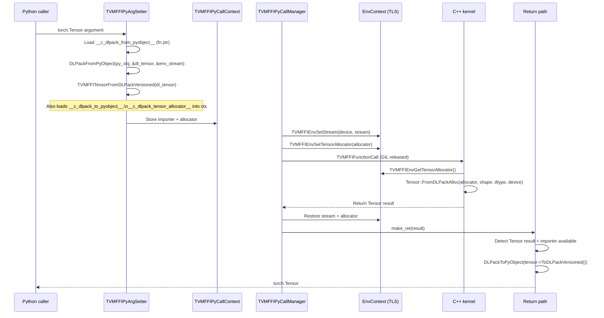
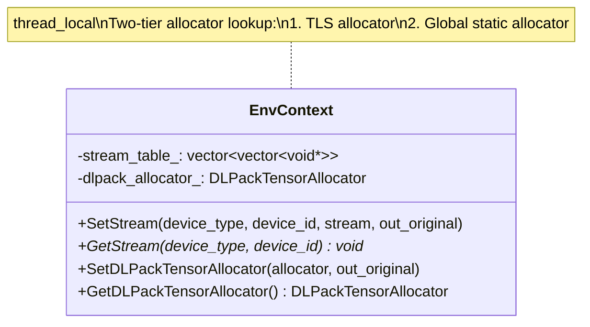
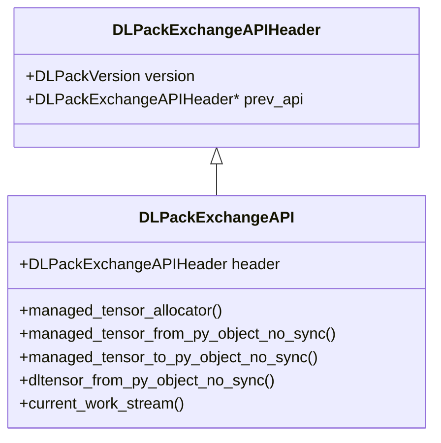

# DLPack Exchange Acceleration

**TL;DR**
- A C-level bypass of the Python `__dlpack__` protocol enables zero-Python-overhead bidirectional tensor conversion between frameworks (e.g., PyTorch) and TVM FFI, using three function pointer types: `DLPackFromPyObject` (export), `DLPackToPyObject` (import), and `DLPackTensorAllocator` (allocate).
- A unified `EnvContext` thread-local storage class (replacing the former `StreamContext`) holds both per-device stream handles and a `DLPackTensorAllocator`, enabling C++ kernel code to allocate output tensors using the caller's framework allocator without Python round-trips.
- `TensorObj` caches a `DLManagedTensorVersioned` struct (atomically initialized) to avoid repeated heap allocation when the same tensor is exported multiple times via DLPack.

## Problem Statement

### Background

The Python `__dlpack__` protocol for tensor exchange involves:
1. Python method dispatch to `__dlpack__()` on the source tensor
2. PyCapsule creation wrapping the `DLManagedTensor`
3. PyCapsule destruction after import

For high-frequency tensor passing (e.g., calling FFI functions in a training loop), this overhead is measurable: PyCapsule creation/destruction, Python method dispatch, and temporary Python object allocation dominate the cost when the actual FFI function is fast.

Additionally, when a kernel needs to allocate output tensors, it previously had to return raw data and rely on Python-side allocation, breaking the C++ execution pipeline.

### Solution

Three C function pointer types registered as class-level Python attributes on framework tensor types:
- **`DLPackFromPyObject`** (`__c_dlpack_from_pyobject__`): Exports a Python tensor to `DLManagedTensorVersioned*` at C level
- **`DLPackToPyObject`** (`__c_dlpack_to_pyobject__`): Converts a `DLManagedTensorVersioned*` back to a framework Python tensor
- **`DLPackTensorAllocator`** (`__c_dlpack_tensor_allocator__`): Allocates a tensor matching a prototype shape/dtype/device

These are stored as integer attributes (function pointers cast to `int64_t`) on the framework's tensor class. A JIT-compiled C++ extension (`_optional_torch_c_dlpack.py`) provides the PyTorch implementation.

### Complete DLPack Dtype Round-Trip (Float4/Float8)

As of commit `929effa`, the `_optional_torch_c_dlpack.py` JIT extension supports full dtype round-trip for all modern DLPack type codes:

- **`toScalarTypeForDLPackv1`**: Reverse conversion function mapping DLPack dtype codes back to PyTorch `ScalarType`. Handles `Float8_e5m2`, `Float8_e5m2fnuz`, `Float8_e4m3fn`, `Float8_e4m3fnuz`, `Float8_e8m0fnu`, and `Float4_e2m1fn_x2`.
- **FP4 multi-lane encoding**: `kDLFloat4_e2m1fn` uses `lanes=2, bits=4` to represent `Float4_e2m1fn_x2`, a non-standard use of the DLPack lanes field. Both export (`getDLDataTypeForDLPackv1`) and import (`toScalarTypeForDLPackv1`) paths handle this encoding correctly.
- **PyTorch version guards**: `#if TORCH_VERSION_MAJOR >= 2 && TORCH_VERSION_MINOR >= 8` guards protect `kDLFloat4_e2m1fn` and `Float8_e8m0fnu` code paths for compatibility with PyTorch < 2.8. Python-side `dtype.pxi` uses `hasattr` checks for conditional dtype mapping entries.

### PyCapsule-Based Exchange API

As of commit `7f3bb77`, the DLPack exchange API supports both PyCapsule and integer-based handle passing. The `__c_dlpack_from_pyobject__` attribute can now be a PyCapsule with name `"dlpack_exchange_api"` pointing to the `DLPackExchangeAPI` struct, in addition to the legacy integer (function pointer cast to int64) path. The Cython `_get_dlpack_exchange_api` helper checks for both formats, preferring capsule when valid. This is more robust than the integer path since PyCapsule validates the pointer type at extraction time.

### Torch C DLPack Extension (AOT Build)

The `addons/torch_c_dlpack_ext/` package provides ahead-of-time compiled wheels for the PyTorch DLPack exchange extension, replacing the previous JIT-compilation-on-first-import approach. The AOT path is preferred when available (matching Python version and PyTorch version), with JIT compilation as a fallback. The build script (`_build_optional_c_dlpack.py`) was also extracted as a reusable utility, supporting both AOT and JIT modes across Linux, macOS, and Windows (with MSVC detection via `locate_vsdevcmd_bat.py`).

### Stride Normalization Fix

As of commits `53ffe5e` and `71dea75`, the stride normalization logic in `toDLPackImpl` is restricted to 1D tensors with `size(0)==1` and `stride(0)!=1`, preventing incorrect stride rewriting for multi-dimensional tensors with unit-sized dimensions. The fix addresses upstream PyTorch issue pytorch/pytorch#163274.

### Goals

- **Goal**: Eliminate Python object creation overhead for tensor argument passing and return conversion.
- **Goal**: Enable C++ kernels to allocate output tensors using the caller's framework allocator.
- **Goal**: Preserve full DLPack compliance (the C-level bypass produces standard `DLManagedTensorVersioned` structs).
- **Goal**: Automatic round-trip: `torch.Tensor` argument -> FFI Tensor -> `torch.Tensor` return value.
- **Non-goal**: Replacing the standard `__dlpack__` protocol for general interop (the C bypass is TVM FFI-specific).

## Design

### End-to-End DLPack Round-Trip



### EnvContext: Unified TLS

`EnvContext` (in `src/ffi/extra/env_context.cc`) replaces the former `StreamContext` and holds both stream and allocator context:



The allocator uses a two-tier lookup:
1. Thread-local allocator (set per-call by the call manager)
2. Global static allocator (for single-framework deployments where the allocator is set once)

### Cached DLManagedTensorVersioned in TensorObj

`TensorObj` has a `mutable std::atomic<DLManagedTensorVersioned*> cached_dl_managed_tensor_versioned_` field. `ToDLPackVersioned()` uses lock-free lazy initialization:

```
cached = cached_.load(acquire);
if (cached == nullptr) {
    DLManagedTensorVersioned* ret = new ...;
    if (CAS(&cached_, nullptr, ret, release, acquire)) {
        cached = ret;  // we won the race
    } else {
        delete ret;     // another thread won, use theirs
        cached = expected;
    }
}
IncRef(tensor);  // each export gets its own ref-counted handle
return cached;
```

The embedded deleter (`EmbeddedDLManagedTensorVersionedDeleter`) only decrements the `TensorObj` ref count -- it does **not** free the `DLManagedTensorVersioned` struct itself. The struct is freed in `~TensorObj()`.

### DLPackTensorAllocator C ABI Type

```c
typedef int (*DLPackTensorAllocator)(
    const DLTensor* prototype,         // shape, dtype, device to match
    DLManagedTensorVersioned** out,    // output allocated tensor
    void (*set_error)(void*, int32_t, const char*),  // error callback
    void* error_ctx                    // error callback context
);
```

Follows the established error-propagation callback pattern (like `TVMFFISafeCallType`). Registered in `c_api.h` as a stable ABI type.

### DLPackExchangeAPI Struct Protocol

As of commit `22a7894` (#96), the previous separate function pointers (`__c_dlpack_from_pyobject__`, etc.) are replaced by a unified `DLPackExchangeAPI` struct, following the DLPack proposal [#175](https://github.com/dmlc/dlpack/issues/175). See [ADR 0045](../ADRs/0045-dlpack-exchange-api-struct.md).



**Key changes from the function-pointer approach:**
- All conversion functions are `_no_sync` variants; stream synchronization is now explicit via `current_work_stream()`.
- Adds `dltensor_from_py_object_no_sync` for non-owning `DLTensor` access, avoiding managed tensor overhead.
- Versioned header (`DLPackVersion`) with `prev_api` pointer for backward-compatible API evolution.
- Exposed via `__c_dlpack_exchange_api__` class attribute on `torch.Tensor` (replacing the three separate attributes).

The `TVMFFIPyCallContext` struct was updated to hold `const DLPackExchangeAPI*` instead of separate function pointers.

### _optional_torch_c_dlpack Module

`python/tvm_ffi/_optional_torch_c_dlpack.py` JIT-compiles a C++ extension using `torch.utils.cpp_extension.load_inline` that provides a complete `DLPackExchangeAPI` struct for PyTorch, including:
- `managed_tensor_from_py_object_no_sync`: Exports PyTorch tensor to `DLManagedTensorVersioned*`
- `managed_tensor_to_py_object_no_sync`: Imports `DLManagedTensorVersioned*` into PyTorch tensor
- `dltensor_from_py_object_no_sync`: Non-owning `DLTensor` extraction
- `managed_tensor_allocator`: Uses `at::empty` for allocation
- `current_work_stream`: Queries CUDA stream for stream synchronization

The struct is registered as `torch.Tensor.__c_dlpack_exchange_api__` (a single pointer attribute).

### Naming Evolution

The protocol attributes were renamed across commits:

| Commit | Protocol Attribute | Model |
|---|---|---|
| `38d2cda` | `__dlpack_c_exporter__` | Separate function pointers |
| `f81ab9c` | `__c_dlpack_exporter__` / `__c_dlpack_importer__` | Separate function pointers |
| `4dee97f` | `__c_dlpack_from_pyobject__` / `__c_dlpack_to_pyobject__` | Separate function pointers |
| `22a7894` | `__c_dlpack_exchange_api__` | Unified `DLPackExchangeAPI` struct |

### Key Classes, Fields and Interfaces

- **`DLPackExchangeAPI`** (C struct, `dlpack/dlpack.h`): Unified struct with versioned header and 5 function pointers for tensor exchange, allocation, and stream handling.
- **`DLPackExchangeAPIHeader`** (C struct): Version + `prev_api` linked list for backward compatibility.
- **`EnvContext`** (`src/ffi/extra/env_context.cc`): Unified TLS holding stream table + allocator.
- **`Tensor::FromEnvAlloc`** (`container/tensor.h`): Static factory using `TVMFFIEnvTensorAlloc` (replaced `FromDLPackAlloc`).
- **`Tensor::ToDLPackVersioned`** (`container/tensor.h`): Cached export returning `DLManagedTensorVersioned*`.
- **`Function.release_gil`** (`function.pxi`): Cython property (default from `TVM_FFI_RELEASE_GIL_BY_DEFAULT` env var) controlling per-function GIL release.
- **`TVMFFIEnvSetStream` / `TVMFFIEnvGetStream`** (`c_env_api.h`): Stream context APIs.
- **`TVMFFIEnvSetDLPackManagedTensorAllocator` / `TVMFFIEnvGetDLPackManagedTensorAllocator`** (`c_env_api.h`): Allocator context APIs (renamed from `TVMFFIEnvSetTensorAllocator` / `TVMFFIEnvGetTensorAllocator` in commit `f679fe5` #131).
- **`TVMFFIEnvTensorAlloc`** (`c_env_api.h`): Direct tensor allocation from DLTensor prototype (commit `f679fe5` #131).

### Contracts, Assumptions and Invariants

- **Cached DLManagedTensorVersioned ownership**: The cached struct is owned by `TensorObj` and freed in `~TensorObj()`. Each consumer gets a ref-counted handle (IncRef on export, DecRef in deleter). The struct pointer is valid as long as `TensorObj` is alive.
- **Atomic CAS thread safety**: `cached_.compare_exchange_strong` with `memory_order_release` on success ensures the fully constructed struct is visible to other threads. `memory_order_acquire` on load/failure ensures visibility.
- **Allocator two-tier lookup**: TLS allocator takes priority over global allocator. The call manager always saves/restores the TLS allocator around function calls.
- **Error propagation in allocator**: `DLPackTensorAllocator` uses the `set_error(error_ctx, kind, message)` callback pattern. `Tensor::FromDLPackAlloc` wraps this with an inner `ErrorContext` struct.
- **`__c_dlpack_exchange_api__` struct stability**: The `DLPackExchangeAPI` struct pointer registered on a type must remain valid for the type's lifetime. The struct is typically statically allocated.
- **GIL must be held when calling DLPack from/to**: The exporter/importer functions may access Python objects (e.g., tensor reference counting), so they must be called with the GIL held. The call manager invokes them before releasing the GIL.

### Extension Points

- **New framework support**: Implement a `DLPackExchangeAPI` struct for the framework's tensor type, register as `__c_dlpack_exchange_api__` class attribute. No TVM FFI code changes needed.
- **New allocator strategies**: `DLPackTensorAllocator` can be implemented with custom memory pools, pinned memory, etc.
- **Global vs per-call allocator**: The two-tier lookup supports both patterns.

## Alternatives & Trade-offs

### Alternative A: Optimize the Python `__dlpack__` path

- Pros: No non-standard protocol needed. Standard DLPack compliance.
- Cons: Fundamentally limited by CPython overhead: PyCapsule creation (~50ns), Python method dispatch (~100ns), capsule destruction (~30ns). Cannot eliminate these costs.

### Alternative B: Cache the tensor conversion result

- Pros: Zero cost on subsequent passes of the same tensor.
- Cons: Stale if tensor data changes (no invalidation mechanism without framework hooks). Breaks for in-place mutations.

### Alternative C: Upstream C-level DLPack protocol in dlpack.h

- Pros: Standardized, all frameworks benefit.
- Cons: Requires upstream DLPack spec changes and adoption across all frameworks. Multi-year timeline. The TVM FFI-specific protocol can be deployed immediately.

## Related Work

### Design Docs & ADRs

- [`.knowledge/designs/0019-python-ffi-call-dispatch.md`](0019-python-ffi-call-dispatch.md) -- Call dispatch architecture consuming DLPack setters
- [`.knowledge/designs/0014-python-bindings.md`](0014-python-bindings.md) -- Python bindings package architecture
- [`.knowledge/designs/0005-containers.md`](0005-containers.md) -- Tensor container with DLPack import/export
- [`.knowledge/designs/0011-extra-api-tier.md`](0011-extra-api-tier.md) -- Extra tier where EnvContext lives
- [`.knowledge/designs/0001-c-abi.md`](0001-c-abi.md) -- DLPackTensorAllocator typedef in c_api.h
- [`.knowledge/ADRs/0020-thread-local-stream-context.md`](../ADRs/0020-thread-local-stream-context.md) -- TLS stream context extended to EnvContext
- [`.knowledge/ADRs/0034-dlpack-c-level-exchange-protocol.md`](../ADRs/0034-dlpack-c-level-exchange-protocol.md) -- Decision to introduce C-level bypass
- [`.knowledge/ADRs/0045-dlpack-exchange-api-struct.md`](../ADRs/0045-dlpack-exchange-api-struct.md) -- Decision to adopt unified DLPackExchangeAPI struct
- [`.knowledge/ADRs/0035-optional-gil-release.md`](../ADRs/0035-optional-gil-release.md) -- Per-function GIL release
- [`.knowledge/ADRs/0031-relaxed-dlpack-import-defaults.md`](../ADRs/0031-relaxed-dlpack-import-defaults.md) -- Relaxed import defaults

### Evidence Matrix

- DLPackPyObjectCExporter introduction (__dlpack_c_exporter__) -> `.knowledge/commits/2025-09-11-38d2cdaa03adc26a630e9cc3cc99b3c7e9f55097.md` + `38d2cda` + `python/tvm_ffi/cython/tvm_ffi_python_helpers.h`
- Cached DLManagedTensorVersioned in TensorObj -> `.knowledge/commits/2025-09-11-38d2cdaa03adc26a630e9cc3cc99b3c7e9f55097.md` + `38d2cda` + `include/tvm/ffi/container/tensor.h`
- DLPackTensorAllocator, EnvContext, Tensor::FromDLPackAlloc, Function.release_gil -> `.knowledge/commits/2025-09-12-f81ab9c25ae4d2a42706747c50c5c410c51d6cdd.md` + `f81ab9c`
- DLPack converter renames (FromPyObject/ToPyObject) -> `.knowledge/commits/2025-09-12-4dee97f1b6473f32faeb8cd24fb2c960f3b17190.md` + `4dee97f`
- _optional_torch_c_dlpack JIT module -> `.knowledge/commits/2025-09-12-f81ab9c25ae4d2a42706747c50c5c410c51d6cdd.md` + `f81ab9c` + `python/tvm_ffi/_optional_torch_c_dlpack.py`
- Stream API rename to short form (TVMFFIEnvSetStream) -> `.knowledge/commits/2025-09-12-f81ab9c25ae4d2a42706747c50c5c410c51d6cdd.md` + `f81ab9c`
- Float4 dtype round-trip (toScalarTypeForDLPackv1, FP4 lanes=2 encoding) -> `.knowledge/commits/2025-09-18-929effa05c65d52f1608723c96efc9fdd24de746.md` + `929effa`
- Stride normalization fix (1D-only) -> `.knowledge/commits/2025-09-18-53ffe5ecd8b4f36506ee04f90d95bc34e456af78.md` + `53ffe5e`
- ndim()->dim() API fix in stride normalization -> `.knowledge/commits/2025-09-18-71dea752f43267b1929a119672b6862db20ac8aa.md` + `71dea75`
- PyTorch version guard for Float4/Float8_e8m0fnu -> `.knowledge/commits/2025-09-23-b03cc7845ae92060881e14c4f50a4b6da4d9f982.md` + `b03cc78`
- Extended torch version guard for Float8_e8m0fnu + hasattr checks in dtype.pxi -> `.knowledge/commits/2025-09-25-eb5492a1d2feaff5f11a51f32cf5ad339c789665.md` + `eb5492a`
- DLPackExchangeAPI struct replacing separate function pointers -> `.knowledge/commits/2025-10-11-22a78943b78306a73011757fa635afa9dce35114.md` + `22a7894`
- Inline C++ tests for DLPackExchangeAPI protocol on torch.Tensor -> `.knowledge/commits/2025-10-13-965fc4642f3e7e7973918c57cdefdda453e125c8.md` + `965fc46`
- Allocator rename to DLPack alignment (TVMFFIEnvSetDLPackManagedTensorAllocator) -> `.knowledge/commits/2025-10-15-f679fe54cf2e78ac175d4644a19b8713a9576c62.md` + `f679fe5`
- CUDA stream protocol in Cython arg setter -> `.knowledge/commits/2025-10-13-b0537f045b30334a12bf3365438aedb2c3bc7285.md` + `b0537f0`
- Torch CUDA stream protocol patch for older torch -> `.knowledge/commits/2025-10-13-80bd4d83d7e0b0abda8848bd8db00c406e6e3507.md` + `80bd4d8`
- AOT build for torch C DLPack extension -> `.knowledge/commits/2025-10-28-e6a654aaaad469ca455057821db01a995f312e2f.md` + `e6a654a`
- AOT build infrastructure (addons/torch_c_dlpack_ext) -> `.knowledge/commits/2025-10-31-f703a0cf9358fa30d8faee719f905c58d8ca6ee3.md` + `f703a0c`
- PyCapsule-based exchange API upgrade -> `.knowledge/commits/2025-11-26-7f3bb77155645f90f7d221889b3795704ffd7d6f.md` + `7f3bb77`
- Leverage DLPack exchange API in from_dlpack -> `.knowledge/commits/2025-11-12-7f3f8726156ab6e33f781562afafd9c6f219551f.md` + `7f3f872`
