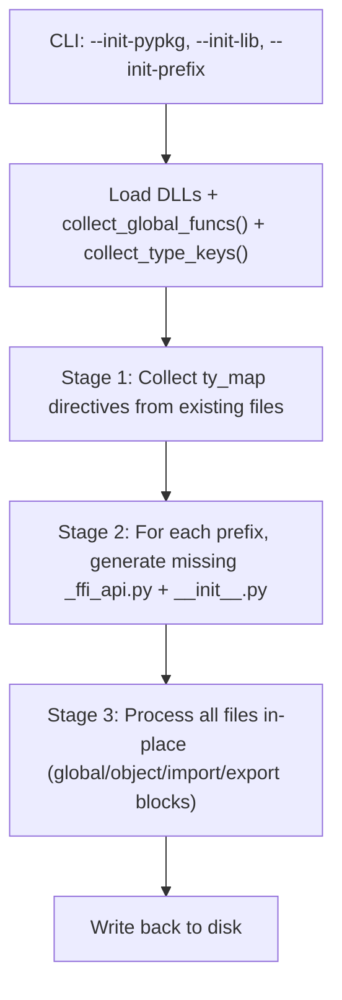

# tvm-ffi-stubgen: Inline Type Stub Generation

**TL;DR**:
- `tvm-ffi-stubgen` is a CLI tool and Python module (`tvm_ffi.stub.cli`) that generates in-place, static type stubs inside marker-delimited blocks in `.py`/`.pyi` files, guarded by `if TYPE_CHECKING:`.
- Replaces hand-maintained `.pyi` stub files with auto-generated inline stubs derived from the C++ reflection registry (TypeSchema, global function metadata, object field/method metadata).
- Uses a lightweight comment-based directive DSL for controlling stub generation scope and type name mappings.
- Supports whole-package generation mode (since b58c2e3d) via `--init-*` flags: recursively creates `_ffi_api.py` and `__init__.py` files for all registered prefixes, with topologically sorted object class definitions.

## Problem Statement
### Background
- The FFI dynamically populates Python module namespaces at import time via `init_ffi_api` and reflection. Type checkers (mypy, pyright) cannot see these dynamic attributes.
- Previously, hand-maintained `.pyi` stub files provided type information, but they drifted from the actual C++ definitions.

### Solution
- Generate stubs inline inside `.py` files between marker comments, using the live FFI registry as the source of truth.
- Stubs are wrapped in `if TYPE_CHECKING:` so they have zero runtime cost.
- The tool reads `TypeSchema` metadata from the C++ reflection system to produce accurate signatures.

### Goals
- Deterministic, reproducible stub output (sorted names, consistent formatting).
- Per-block type name remapping via `ty_map` directives.
- Support both global function stubs (`global/<prefix>`) and object field/method stubs (`object/<type_key>`).
- Whole-package generation: create `_ffi_api.py` and `__init__.py` for all registered prefixes under a root package (since b58c2e3d).
- Non-goals: generating separate `.pyi` files; runtime type checking.

## Design

### Marker Directive DSL

```python
# tvm-ffi-stubgen(begin): global/<prefix>
# (auto-generated stubs appear here)
# tvm-ffi-stubgen(end)

# tvm-ffi-stubgen(begin): object/<type_key>
# tvm-ffi-stubgen(ty_map): testing.SchemaAllTypes -> _SchemaAllTypes
# tvm-ffi-stubgen(import): typing           -- inject import statement (since 1af6d9f)
# (auto-generated field/method stubs appear here)
# tvm-ffi-stubgen(end)

# tvm-ffi-stubgen(skip-file)   -- skip processing entire file
```

The `import` directive (since 1af6d9f) allows injecting explicit import statements into generated stub blocks. This is useful when generated stubs reference types that are not otherwise imported in the file.

### Key Classes, Fields and Interfaces

Since 1af6d9f, the monolithic `stubgen.py` was refactored into a staged pipeline with separate modules:

| Module | Responsibility |
|--------|---------------|
| `tvm_ffi.stub.file_utils` | File parsing: reads `.py` files, finds marker blocks, extracts directives |
| `tvm_ffi.stub.consts` | Directive and format constants (marker patterns, keywords) |
| `tvm_ffi.stub.lib_state` | Stateful FFI registry queries: collects global funcs, type keys, object info; topological sorting of objects by inheritance (since b58c2e3d, replacing `analysis.py`) |
| `tvm_ffi.stub.codegen` | Code generation: produces inline stub text, `_ffi_api.py` content, `__init__.py` content |
| `tvm_ffi.stub.cli` | CLI entry point: argument parsing, DLL preloading, 3-stage pipeline orchestration |
| `tvm_ffi.stub.utils` | Data classes (`Options`, `InitConfig`, `FuncInfo`, `ObjectInfo`, `ImportItem`, `NamedTypeSchema`) and shared utilities |

| Symbol | Kind | Description |
|--------|------|-------------|
| `Options` | dataclass (`utils.py`) | CLI options: `imports: list[str]`, `dlls: list[str]`, `init: InitConfig \| None`, `indent: int`, `files: list[str]`, `verbose: bool`, `dry_run: bool` |
| `InitConfig` | dataclass (`utils.py`) | Package generation config: `pkg: str`, `shared_target: str`, `prefix: str` (since b58c2e3d) |
| `FuncInfo` | dataclass (`utils.py`) | Function metadata: `schema: NamedTypeSchema`, `is_member: bool`; has `gen(ty_map, indent) -> str` method |
| `ObjectInfo` | dataclass (`utils.py`) | Object type metadata: `fields`, `methods`, `type_key`, `parent_type_key`; constructed via `from_type_info(TypeInfo)` |
| `ImportItem` | frozen dataclass (`utils.py`) | Import statement: `mod: str`, `name: str`, `type_checking_only: bool`, `alias: str \| None` |
| `__main__() -> int` | function (`cli.py`) | CLI entry point; parses args, preloads DLLs, runs 3-stage pipeline, returns exit code |
| `collect_global_funcs() -> dict[str, list[FuncInfo]]` | function (`lib_state.py`) | Builds sorted prefix-to-FuncInfo table from global registry |
| `collect_type_keys() -> dict[str, list[str]]` | function (`lib_state.py`) | Builds sorted prefix-to-type-keys table from registered objects |
| `toposort_objects(type_keys) -> list[ObjectInfo]` | function (`lib_state.py`) | Topologically sorts objects by inheritance hierarchy using a heap-based algorithm |
| `object_info_from_type_key(type_key) -> ObjectInfo` | function (`lib_state.py`) | LRU-cached: constructs ObjectInfo from type key via TypeInfo lookup |
| `generate_ffi_api(...)` | function (`codegen.py`) | Generates `_ffi_api.py` content with global function stubs, object class definitions, imports, and `__all__` (since b58c2e3d) |
| `generate_init(...)` | function (`codegen.py`) | Generates `__init__.py` content with re-exports from `_ffi_api` submodule (since b58c2e3d) |

### Package Generation Mode (since b58c2e3d)

The `--init-*` flags enable whole-package stub generation. Given a shared library loaded via `--dlls`, the tool discovers all registered global functions and object types, then generates `_ffi_api.py` and `__init__.py` files for each prefix under the package root.



**Three-stage pipeline** (`cli.py`):
- **Stage 1** (`_stage_1`): Scan all files for `ty-map` directives, populating the global type map.
- **Stage 2** (`_stage_2`): For each prefix matching `--init-prefix`, find functions/objects not already defined in existing files. Create directory structure (`prefix.replace(".", "/")`), generate `_ffi_api.py` with function stubs and object class definitions (topologically sorted by inheritance), and `__init__.py` with re-exports.
- **Stage 3** (`_stage_3`): Process every file's directive blocks in-place: global function stubs, object stubs, import sections, `__all__` lists, and export blocks.

**Key invariants of package generation**:
- Objects are topologically sorted by inheritance (parent classes appear before children) using a min-heap algorithm in `toposort_objects`.
- Only prefixes matching `--init-prefix` are processed; prefixes already covered by existing directive blocks are skipped.
- `_ffi_api.py` files include a `load_lib_module` call to load the shared library at runtime.
- `__init__.py` files re-export all symbols from `_ffi_api` submodule.

**CMake integration**: `tvm_ffi_configure_target` can invoke stubgen as a post-build step via the `STUB_DIR`, `STUB_INIT`, `STUB_PKG`, and `STUB_PREFIX` keyword parameters (since ccd19f82). This runs `python -m tvm_ffi.stub.cli <dir> --dlls <target_file> --init-lib <target> --init-pypkg <pkg> --init-prefix <prefix>` after every build.

### `__all__` Generation (since 92e150b)

Stubgen can generate `__all__` export lists for Python modules, enabling proper symbol exporting for `from module import *`. The generated `__all__` is sorted alphabetically and formatted as a multi-line list.

```python
# Generated output:
__all__ = [
    "Array",
    "Function",
    "Map",
    "String",
]
```

### Contracts, Assumptions and Invariants
- Stubs are only written between `tvm-ffi-stubgen(begin)` / `tvm-ffi-stubgen(end)` markers.
- Output is deterministic: function names sorted alphabetically, fields in declaration order, objects topologically sorted by inheritance.
- `ty_map` and `import` directives must appear between `begin` and `end` markers.
- Default type mappings: `list -> Sequence`, `dict -> Mapping`.
- In `--init-*` mode, all three flags (`--init-pypkg`, `--init-lib`, `--init-prefix`) must be provided together.
- Package generation does not overwrite existing directive blocks; it only creates files/blocks that are missing.

### Extension Points
- New block types can be added by extending the `_generate_*` dispatch in `_stage_3`.
- Custom type mappings via `ty_map` directives enable per-block type name customization.
- New package-level generation behavior can be added in `_stage_2` for additional file types beyond `_ffi_api.py` and `__init__.py`.

### Usage Examples

#### Adding inline stubs to an FFI module
**Context**: A module that uses `init_ffi_api` to populate its namespace.
```python
# my_module/_ffi_api.py
from typing import TYPE_CHECKING
import tvm_ffi

tvm_ffi.init_ffi_api("my_prefix", __name__)

# tvm-ffi-stubgen(begin): global/my_prefix
# tvm-ffi-stubgen(end)
```
Then run:
```bash
tvm-ffi-stubgen my_module/_ffi_api.py
```

#### Object stubs with type name remapping
**Context**: Adding inline stubs for a registered object class.
```python
@register_object("testing.SchemaAllTypes")
class _SchemaAllTypes:
    # tvm-ffi-stubgen(begin): object/testing.SchemaAllTypes
    # tvm-ffi-stubgen(ty_map): testing.SchemaAllTypes -> _SchemaAllTypes
    # tvm-ffi-stubgen(end)
```

#### Whole-package stub generation via CLI (since b58c2e3d)
**Context**: Generating stubs for an entire downstream extension package from the command line, after building the shared library.
```bash
# Generate _ffi_api.py and __init__.py for all prefixes under my_ffi_extension
tvm-ffi-stubgen python/my_ffi_extension \
    --dlls build/libmy_ffi_extension_shared.so \
    --init-pypkg my-ffi-extension \
    --init-lib my_ffi_extension_shared \
    --init-prefix my_ffi_extension.
```

#### Whole-package stub generation via CMake (since ccd19f82)
**Context**: Automatically run stubgen as a post-build step in CMake.
```cmake
find_package(Python COMPONENTS Interpreter REQUIRED)
find_package(tvm_ffi CONFIG REQUIRED)

add_library(my_ext SHARED src/my_ext.cc)
tvm_ffi_configure_target(my_ext
    STUB_DIR "${CMAKE_SOURCE_DIR}/python/my_ffi_extension"
    STUB_INIT ON
    STUB_PKG "my-ffi-extension"
    STUB_PREFIX "my_ffi_extension."
)
tvm_ffi_install(my_ext)
```

## Alternatives & Trade-offs
### Separate .pyi stub files
- Pros: Standard Python convention; no marker comments needed.
- Cons: Drift from actual C++ definitions; must maintain separate files; cannot be auto-generated inline.
### Runtime __getattr__ with type: ignore
- Pros: No tooling needed.
- Cons: Type checkers cannot provide autocomplete or error checking.

## Related Work
### Design Docs & ADRs
- `.knowledge/designs/0014-python-bindings.md` -- Python binding layer whose stubs are generated
- `.knowledge/designs/reflection.md` -- TypeSchema and reflection metadata consumed by stubgen
- `.knowledge/designs/0015-python-packaging.md` -- CLI entry point registration; `tvm_ffi_configure_target` CMake integration for post-build stub generation

### Evolution Timeline
| Version | Commit | Change | Motivation |
|---------|--------|--------|------------|
| v1 | ea02e64 | Initial monolithic `stubgen.py` with global/object block types, `ty_map` directive | Replace hand-maintained `.pyi` stubs |
| v2 | 1af6d9f | Refactor into staged pipeline (file_utils, consts, analysis, codegen, cli, utils); add `import` directive | Modularity, extensibility, flexible import injection |
| v3 | 92e150b | Add `__all__` generation capability in `utils.py` | Enable proper symbol exporting; precursor to whole-package stub generation |
| v4 | b58c2e3d | Package generation mode: `--init-*` flags, `lib_state.py` (replacing `analysis.py`), `InitConfig`, topological object sorting, `_ffi_api.py`/`__init__.py` generation | Enable zero-config stub generation for entire downstream packages |

### Evidence Matrix
- `tvm-ffi-stubgen` CLI tool and module -> `2025-10-13-ea02e646aea916ad18755cd6990b22ace8afd4b2.md` + commit ea02e64
- Staged pipeline refactor + `import` directive -> `2025-11-15-1af6d9f9.md` + commit 1af6d9f
- `__all__` generation -> `2025-11-16-92e150b9.md` + commit 92e150b
- Package generation mode + `lib_state.py` + `InitConfig` + topological sorting -> `2025-12-18-b58c2e3d7deadbd60c7480f5c84633966260bc9a.md` + commit b58c2e3d
