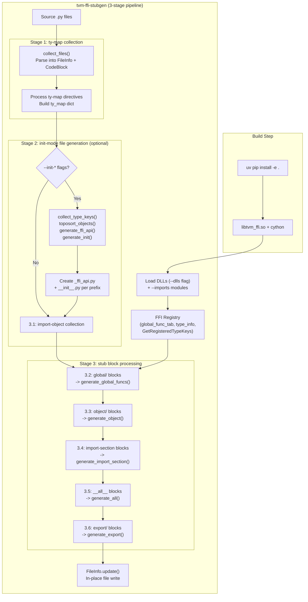

# Stub Generation System (tvm-ffi-stubgen)

**TL;DR**
- `tvm-ffi-stubgen` is a CLI tool that generates inline Python type stubs from the TVM FFI reflection registry, keeping stubs co-located with runtime code inside marker-delimited regions.
- Supports eight directive types: `global/<prefix>` for function stubs, `object/<type_key>` for object stubs, `import-section` for auto-generated import blocks, `__all__` for export lists, `ty-map` for type alias remapping, `import-object` for injecting custom imports, `export` for auto-generating re-export blocks, and `skip-file` to opt out.
- Uses a 3-stage pipeline: (1) collect ty-maps from source, (2) generate missing `_ffi_api.py`/`__init__.py` files via init mode (when `--init-*` flags are provided), (3) process existing stub blocks (global/object/import-section/__all__/export). Field annotations are emitted outside `TYPE_CHECKING` (runtime-visible); methods remain inside `TYPE_CHECKING`.
- Replaces separate `.pyi` stub files with in-place marker-delimited regions, eliminating stub drift. Init mode bootstraps entire downstream FFI packages from C++ registry metadata.

## Problem Statement

### Background
- The Python package exposes hundreds of global functions and object types registered through C++ reflection, but IDE tooling cannot infer their signatures without type stubs.
- Maintaining separate `.pyi` files manually is error-prone and drifts from the actual C++ reflection metadata over time.
- The reflection system already stores `TypeSchema` metadata for every registered function, field, and method.

### Solution
- A CLI tool (`tvm-ffi-stubgen`) scans `.py`/`.pyi` files for comment markers, queries the live FFI registry, and fills delimited regions with type-checked stub code.
- Stubs are wrapped in `if TYPE_CHECKING:` blocks for zero runtime cost.
- The tool is run after building (or after C++/Cython reflection changes) via `uv run tvm-ffi-stubgen python`.

### Goals
- **Goal**: Zero-maintenance type stubs derived from C++ reflection metadata.
- **Goal**: Co-located stubs (same file as runtime code) to prevent drift.
- **Goal**: Extensible to downstream FFI packages.
- **Non-goal**: Full `.pyi` generation for the entire package; only marker-delimited regions.

## Design



### Key Classes, Fields and Interfaces

**CLI entry point**: `tvm-ffi-stubgen` (registered in `pyproject.toml` as `tvm_ffi.stub.cli:__main__`)

**CLI flags**:
- `PATH` (positional) -- files or directories to process recursively
- `--dlls LIBS` -- semicolon-separated shared libraries to preload (e.g., `lib1.so;lib2.so`)
- `--imports IMPORTS` -- semicolon-separated Python modules to pre-import
- `--init-pypkg PKG` -- Python package name for init mode (must be used with `--init-lib` and `--init-prefix`)
- `--init-lib LIB` -- CMake shared library target name for init mode
- `--init-prefix PREFIX` -- registry prefix filter for init mode (e.g., `my_ffi_extension.`)
- `--indent N` -- extra indentation inside generated blocks (default: 4)
- `--verbose` -- print unified diffs of changes
- `--dry-run` -- preview changes without writing

**Module structure** (`python/tvm_ffi/stub/`, refactored from single `stubgen.py` in 1af6d9f, then `analysis.py` replaced by `lib_state.py` in b58c2e3):

| Module | Responsibility |
|--------|---------------|
| `cli.py` | `__main__()` entry point, argparse, 3-stage orchestration (stages 1-3) |
| `consts.py` | Marker strings (`STUB_BEGIN`, `STUB_END`, `STUB_IMPORT_OBJECT`, etc.), `TY_MAP_DEFAULTS`, `MOD_MAP`, `FN_NAME_MAP`, `BUILTIN_TYPE_KEYS`, `STUB_BLOCK_KINDS` TypeAlias, `DOC_URL`, scaffold prompt helpers |
| `file_utils.py` | `FileInfo`, `CodeBlock` dataclasses, `collect_files()` |
| `codegen.py` | `generate_global_funcs()`, `generate_object()`, `generate_import_section()`, `generate_all()`, `generate_export()`, `generate_ffi_api()`, `generate_init()` |
| `lib_state.py` | `collect_global_funcs()`, `collect_type_keys()`, `object_info_from_type_key()`, `toposort_objects()` -- runtime metadata queries (replaced `analysis.py` in b58c2e3) |
| `utils.py` | `Options`, `InitConfig`, `ImportItem`, `NamedTypeSchema`, `FuncInfo`, `ObjectInfo` dataclasses |

**Key classes**:
- `Options(imports: list[str], dlls: list[str], init: InitConfig | None, indent: int, files: list[str], verbose: bool, dry_run: bool)` -- CLI option container (extended with `imports` and `init` in b58c2e3)
- `InitConfig(pkg: str, shared_target: str, prefix: str)` -- configuration for `--init-*` mode (b58c2e3). `pkg` = Python package name (e.g., `my-ffi-extension`), `shared_target` = CMake target name, `prefix` = registry prefix filter
- `ImportItem(name: str, type_checking_only: bool = False, alias: str | None = None)` -- frozen dataclass representing an import statement (b58c2e3). Auto-splits `name` into `mod`/`name` on the last `.` and applies `MOD_MAP` prefix substitutions. Properties: `name_with_alias -> str`, `full_name -> str`. `__str__` renders as `from mod import name [as alias]`
- `NamedTypeSchema(name: str, schema: TypeSchema)` -- extends `TypeSchema` with an associated name; used by `FuncInfo` and `ObjectInfo` for type-aware code generation (b58c2e3)
- `CodeBlock(kind: STUB_BLOCK_KINDS, param: str | tuple[str, ...], lineno_start: int, lineno_end: int, lines: list[str])` -- `kind` is one of `"global"`, `"object"`, `"ty-map"`, `"import-section"`, `"import-object"`, `"export"`, `"__all__"`, or `None`. `param` is `str` for most kinds; for `global` blocks, it is `(prefix, import_from)` tuple; for `import-object` blocks, it is `(from, type_checking_only, alias)` 3-tuple (b58c2e3)
- `FileInfo(path: Path, code_blocks: list[CodeBlock], lines: tuple[str, ...])` -- parsed file with `update(verbose: bool, dry_run: bool)` method and `reload()` for re-reading after init-mode writes
- `FuncInfo(schema: NamedTypeSchema, is_member: bool)` -- wraps a function's metadata; static factory `from_schema(name: str, schema: TypeSchema, *, is_member: bool = False) -> FuncInfo` (renamed from `from_global_name` in b58c2e3); `gen(ty_map: Callable, indent: int) -> str` produces the stub line
- `ObjectInfo(fields: list[NamedTypeSchema], methods: list[FuncInfo], type_key: str | None, parent_type_key: str | None)` -- wraps an object's metadata; `gen_fields(ty_map, indent) -> list[str]`, `gen_methods(ty_map, indent) -> list[str]`, `gen_init(ty_map, indent) -> list[str]` (6973d225). Static factory `from_type_info(type_info: TypeInfo) -> ObjectInfo` (renamed from `from_type_key` in b58c2e3)
- `InitFieldInfo(name: str, type_schema: TypeSchema, kw_only: bool, has_default: bool)` -- per-field init metadata (6973d225); used by `ObjectInfo.gen_init()` to generate typed `__init__` stubs from reflection metadata

**Runtime metadata functions** (in `lib_state.py`, replacing `analysis.py`):
- `object_info_from_type_key(type_key: str) -> ObjectInfo` -- LRU-cached `ObjectInfo` factory; queries `_lookup_or_register_type_info_from_type_key` then delegates to `ObjectInfo.from_type_info`
- `collect_global_funcs() -> dict[str, list[FuncInfo]]` -- builds prefix-to-FuncInfo table from `list_global_func_names()` and `get_global_func_metadata()`
- `collect_type_keys() -> dict[str, list[str]]` -- queries `GetRegisteredTypeKeys()` to build prefix-to-type_key mapping
- `toposort_objects(type_keys: list[str]) -> list[ObjectInfo]` -- topological sort of ObjectInfo by inheritance hierarchy using heapq-based Kahn's algorithm; ensures generated class definitions appear in correct inheritance order

**Init-mode codegen functions** (in `codegen.py`, new in b58c2e3):
- `generate_ffi_api(code_blocks, ty_map, module_name, object_infos, init_cfg, is_root) -> str` -- generates full `_ffi_api.py` content: import-section, library loading (if root), global function block, object class definitions, `__all__`
- `generate_init(code_blocks, module_name, submodule="_ffi_api") -> str` -- generates `__init__.py` with `export/{submodule}` block
- `generate_export(code: CodeBlock) -> None` -- generates `from .{mod} import *` + `__all__` extension block for `export/{mod}` directives

**Marker protocol** (comment-based directives in source files):
- `# tvm-ffi-stubgen(begin): global/<prefix>` / `# tvm-ffi-stubgen(end)` -- global function block. Extended syntax: `global/<prefix>@<import_from>` where `@import_from` specifies which module provides `init_ffi_api` (b58c2e3)
- `# tvm-ffi-stubgen(begin): object/<type_key>` / `# tvm-ffi-stubgen(end)` -- object type block
- `# tvm-ffi-stubgen(begin): import-section` / `# tvm-ffi-stubgen(end)` -- auto-generated import block (renamed from `import` in b58c2e3)
- `# tvm-ffi-stubgen(begin): __all__` / `# tvm-ffi-stubgen(end)` -- auto-generated `__all__` list
- `# tvm-ffi-stubgen(begin): export/<submod>` / `# tvm-ffi-stubgen(end)` -- auto-generates `from .<submod> import *` + `__all__` extension (b58c2e3)
- `# tvm-ffi-stubgen(import-object): <from>;<type_checking_only>;<alias>` -- standalone directive injecting a custom import (b58c2e3). Example: `# tvm-ffi-stubgen(import-object): tvm_ffi.libinfo.load_lib_module;False;_FFI_LOAD_LIB`
- `# tvm-ffi-stubgen(ty-map): A.B -> C.D` -- type alias remapping (standalone line, not inside begin/end block)
- `# tvm-ffi-stubgen(skip-file)` -- opt out of processing
- `__ffi_init__` is renamed to `__c_ffi_init__` in generated stubs to avoid conflicts with Python `__init__` (controlled by `FN_NAME_MAP` in `consts.py`)

**Constants** (in `consts.py`):
- `STUB_BEGIN`, `STUB_END`, `STUB_TY_MAP`, `STUB_IMPORT_OBJECT`, `STUB_SKIP_FILE`, `DEFAULT_SOURCE_EXTS = {".py", ".pyi"}`
- `STUB_BLOCK_KINDS` -- `TypeAlias = Literal["global", "object", "ty-map", "import-section", "import-object", "export", "__all__", None]`
- `TY_MAP_DEFAULTS` -- default type alias map (e.g., `list -> Sequence`, `dict -> Mapping`, `Array -> Sequence`, `List -> MutableSequence`, `Map -> Mapping`, `Dict -> MutableMapping`, `Object -> ffi.Object`). Extended in 7786133 to include container-specific mappings.
- `MOD_MAP` -- module prefix substitution map (e.g., `"testing" -> "tvm_ffi.testing"`, `"ffi" -> "tvm_ffi"`)
- `FN_NAME_MAP = {"__ffi_init__": "__c_ffi_init__"}` -- function name remapping
- `BUILTIN_TYPE_KEYS` -- set of built-in type keys excluded from init-mode generation (e.g., `ffi.Object`, `ffi.String`, `ffi.Tensor`)
- `DOC_URL` -- URL to online documentation, displayed in `--help` output (dc0dd2f)
- Scaffold prompt helpers: `_prompt_globals(mod)`, `_prompt_class_def(type_name, type_key, parent_type_name)`, `_prompt_import_object(type_key, type_name)`, `PROMPT_IMPORT_SECTION`, `PROMPT_ALL_SECTION` -- templates for init-mode file generation

### Container-Specific Type Origins (7786133)

The TypeSchema origin mapping was updated to preserve container identity through the schema-to-annotation pipeline:

| C++ type key | Old origin | New origin | Stub annotation |
|-------------|-----------|-----------|-----------------|
| `ffi.Array` | `list` | `Array` | `collections.abc.Sequence` |
| `ffi.List` | `list` | `List` | `collections.abc.MutableSequence` |
| `ffi.Map` | `dict` | `Map` | `collections.abc.Mapping` |
| `ffi.Dict` | `dict` | `Dict` | `collections.abc.MutableMapping` |

Backward compatibility: raw `list`/`dict` origins remain accepted. `TypeSchema.repr()` now returns container-specific names (e.g., `Array[int]` instead of `list[int]`).

### Contracts, Assumptions and Invariants
- **Idempotent regeneration**: Running `tvm-ffi-stubgen` twice on the same file produces identical output. Init mode appends only to files that lack the relevant directives; re-running does not duplicate content.
- **Marker integrity**: The tool only modifies content between `tvm-ffi-stubgen(begin)` and `tvm-ffi-stubgen(end)` markers. Content outside markers is never touched.
- **Fields outside TYPE_CHECKING, methods inside** (1af6d9f): Field annotations are emitted as PEP 526 class-level attributes outside `TYPE_CHECKING` (runtime-visible for dataclass-like reflection), while method stubs remain guarded inside `if TYPE_CHECKING:`. This was changed from the original "everything inside TYPE_CHECKING" approach.
- **Single import block per file**: Only one `import-section` directive block is processed per file. The first one found is used. Likewise only one `__all__` block per file.
- **Init-mode atomicity** (b58c2e3): The three `--init-*` flags must be provided together or not at all. When provided, Stage 2 scans the registry for all prefixes matching `--init-prefix`, skipping prefixes whose functions/objects are already defined in existing source files. `BUILTIN_TYPE_KEYS` (e.g., `ffi.Object`, `ffi.String`) are always excluded from generation.
- **Topological class ordering**: `toposort_objects()` guarantees that parent classes appear before child classes in generated `_ffi_api.py` files, so Python class definitions are valid on first parse.
- **Prefix filter correctness** (19da7e8): The `_stage_2` prefix filter uses the actual `--init-prefix` value rather than hardcoded exclusions, so downstream packages with arbitrary prefix names are correctly handled.
- **Failure mode -- missing DLL**: If the shared library is not loaded (stale build), the registry will be empty and stubs will be blank. The CLI does not error; it generates empty blocks.
- **Failure mode -- missing type schema**: Functions without type schema metadata are silently skipped with a yellow warning. This allows partial stub generation when some functions lack reflection metadata.

### Extension Points
- **Downstream package bootstrapping**: The `--init-*` flags provide the primary extension point for downstream FFI packages. A single invocation of `tvm-ffi-stubgen --init-pypkg <pkg> --init-lib <target> --init-prefix <prefix> <dir>` bootstraps the entire Python package structure with `_ffi_api.py` and `__init__.py` files for all registered prefixes.
- **Custom imports via `import-object`**: The `import-object` directive allows downstream packages to inject custom imports (e.g., library loaders, parent classes from other packages) into generated files without modifying the stubgen tool.
- **CMake post-build integration**: `tvm_ffi_configure_target(... STUB_DIR ... STUB_INIT ON)` automates stubgen as a CMake post-build step, removing the need for manual CLI invocation. See [0014-python-package.md](0014-python-package.md).
- **Module prefix mapping via `MOD_MAP`**: The `MOD_MAP` dict in `consts.py` controls how type key prefixes are mapped to Python module paths when generating import statements. Extending this dict supports new module namespaces.

### Usage Examples

#### Bootstrapping a downstream FFI package (init mode)
**Context**: Creating a new Python package that wraps a C++ FFI extension library. This is the primary extension workflow.
```bash
# Generate _ffi_api.py and __init__.py for all registered prefixes
tvm-ffi-stubgen examples/python_packaging/python \
  --dlls examples/python_packaging/build/libmy_ffi_extension.dylib \
  --init-pypkg  my-ffi-extension \
  --init-lib    my_ffi_extension \
  --init-prefix "my_ffi_extension."
```
The generated `_ffi_api.py` has this structure:
```python
# tvm-ffi-stubgen(begin): import-section
from __future__ import annotations
from tvm_ffi import Object as _ffi_Object, init_ffi_api as _FFI_INIT_FUNC, register_object as _FFI_REG_OBJ
from tvm_ffi.libinfo import load_lib_module as _FFI_LOAD_LIB
# tvm-ffi-stubgen(end)
# tvm-ffi-stubgen(import-object): tvm_ffi.libinfo.load_lib_module;False;_FFI_LOAD_LIB
LIB = _FFI_LOAD_LIB("my-ffi-extension", "my_ffi_extension")
# tvm-ffi-stubgen(begin): global/my_ffi_extension
_FFI_INIT_FUNC("my_ffi_extension", __name__)
if TYPE_CHECKING:
    def raise_error(_0: str, /) -> None: ...
# tvm-ffi-stubgen(end)
```
Re-running is idempotent -- existing files are not overwritten.

#### CLI usage (normal mode)
**Context**: Regenerating stubs after a C++/Cython change.
```bash
# Recursively scan directories
uv run tvm-ffi-stubgen python/tvm_ffi examples/python_packaging/python/my_ffi_extension

# Preload shared libraries for extension packages
uv run tvm-ffi-stubgen --dlls build/libtvm_runtime.so my_pkg/_ffi_api.py
```

#### Source marker patterns
**Context**: The directive types and the field-outside-TYPE_CHECKING convention.
```python
# import-section directive (auto-generates imports based on used types):
# tvm-ffi-stubgen(begin): import-section
# fmt: off
# isort: off
from __future__ import annotations
from typing import Any, TYPE_CHECKING
if TYPE_CHECKING:
    from collections.abc import Sequence
    from tvm_ffi import Object
# isort: on
# fmt: on
# tvm-ffi-stubgen(end)

# import-object directive (standalone, injects a custom import):
# tvm-ffi-stubgen(import-object): tvm_ffi.libinfo.load_lib_module;False;_FFI_LOAD_LIB

# ty-map directive (standalone, not in begin/end block):
# tvm-ffi-stubgen(ty-map): ffi.reflection.AccessStep -> ffi.access_path.AccessStep

# Object block (fields outside TYPE_CHECKING, methods inside):
@register_object("testing.TestIntPair")
class TestIntPair(Object):
    # tvm-ffi-stubgen(begin): object/testing.TestIntPair
    # fmt: off
    a: int
    b: int
    if TYPE_CHECKING:
        @staticmethod
        def __c_ffi_init__(_0: int, _1: int, /) -> Object: ...
    # fmt: on
    # tvm-ffi-stubgen(end)

# export directive (auto-generates re-exports in __init__.py):
# tvm-ffi-stubgen(begin): export/_ffi_api
from ._ffi_api import *  # noqa: F403
__all__.extend(_ffi_api.__all__)
# tvm-ffi-stubgen(end)

# __all__ directive (auto-generated sorted export list):
__all__ = [
    # tvm-ffi-stubgen(begin): __all__
    "Array",
    "ArrayGetItem",
    "Map",
    # ... (auto-generated, sorted UPPERCASE > CamelCase > snake_case)
    # tvm-ffi-stubgen(end)
]
```

## Alternatives & Trade-offs
### Separate .pyi stub files
- Pros: Python standard; supported by all tools.
- Cons: Drifts from runtime metadata. Must be manually maintained or generated by a separate step that is easy to forget. The co-located approach ensures stubs are always next to the code they describe.

### Runtime-only type annotations (no stubs)
- Pros: Zero maintenance.
- Cons: FFI-generated functions and reflected fields/methods have no Python-visible signatures. IDEs cannot provide autocompletion or type checking.

## Related Work
### Design Docs & ADRs
- [0009-reflection.md](0009-reflection.md) -- Reflection system providing `TypeSchema` metadata
- [0014-python-package.md](0014-python-package.md) -- Python package structure, `tvm_ffi_configure_target` CMake integration
- [ADR 0022-inline-stubs-over-pyi.md](../ADRs/0022-inline-stubs-over-pyi.md) -- Decision to use inline stubs

### Evolution Timeline

| Commit | Change |
|--------|--------|
| `ea02e64` | Initial `tvm-ffi-stubgen`: single-file `stubgen.py`, global/object blocks, ty_map |
| `1af6d9f` | Staged pipeline refactor: split into 5 modules (`cli.py`, `consts.py`, `file_utils.py`, `codegen.py`, `analysis.py`, `utils.py`); `import` directive; fields outside `TYPE_CHECKING`; `CodeBlock`/`FileInfo` replacing `StubConfig`; `--verbose`/`--dry-run` flags |
| `92e150b` | `__all__` directive; `FuncInfo`/`ObjectInfo`/`FieldInfo` classes; `FN_NAME_MAP`; re-added tests |
| `b58c2e3` | 3-stage pipeline with init mode: `analysis.py` replaced by `lib_state.py`; `InitConfig`/`ImportItem`/`NamedTypeSchema` classes; `import` renamed to `import-section`; new directives `import-object` and `export`; `--init-pypkg`/`--init-lib`/`--init-prefix`/`--imports` CLI flags; topological object sorting; `testing/` restructured as package |
| `19da7e8` | Prefix filter fix: `_stage_2` now uses actual `--init-prefix` value instead of hardcoded exclusions |
| `dc0dd2f` | CLI help simplified: 150-line inline epilog replaced by `DOC_URL` link to online documentation |
| `7786133` | Container-specific TypeSchema origins: `ffi.Array`->`Array`, `ffi.List`->`List`, `ffi.Map`->`Map`, `ffi.Dict`->`Dict`; stub annotations: `Sequence`/`MutableSequence`/`Mapping`/`MutableMapping` |
| `6973d225` | `InitFieldInfo` / `ObjectInfo.gen_init()`: generate typed `__init__` stubs from reflection metadata; `_install_init` in `register_object` for runtime init wiring |

### Evidence Matrix
- `tvm-ffi-stubgen` CLI, marker protocol, `_ffi_api.pyi` removal -> `ea02e646aea9.md` (ea02e64)
- Staged pipeline refactor, import directive, CodeBlock/FileInfo -> `2025-11-15-1af6d9f9648bb2547d97d455bb4464d217654fc4.md` (1af6d9f)
- `__all__` directive, FuncInfo/ObjectInfo, FN_NAME_MAP -> `2025-11-16-92e150b9cb8222eeadf5469eae2e06400e4af850.md` (92e150b)
- 3-stage pipeline, init mode, `lib_state.py`, `InitConfig`/`ImportItem`, new directives -> `2025-12-18-b58c2e3d7deadbd60c7480f5c84633966260bc9a.md` (b58c2e3)
- Container-specific TypeSchema origins, TY_MAP_DEFAULTS extension with Array/List/Map/Dict -> `2026-02-21-7786133167902a810dd4717fd0e7d39f4c6f7e99.md` (7786133) + `cython/type_info.pxi`, `stub/consts.py`
- `InitFieldInfo`, `ObjectInfo.gen_init()`, `_install_init` in register_object: wire __init__ from C++ reflection in both stubgen and runtime -> `2026-03-01-6973d225eb3c67a7c306e36b20a100c5e9ff46f7.md` (6973d225)
- Plus 3 supporting commits (19da7e8 prefix filter fix, dc0dd2f DOC_URL, a754afe CI examples job)
