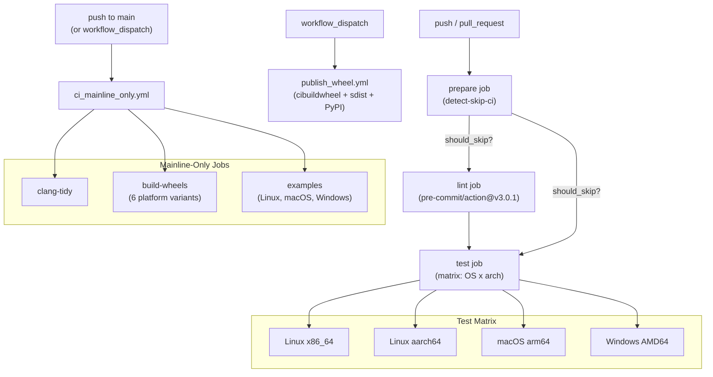
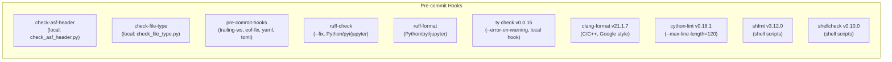

# CI/CD Pipeline

**TL;DR**
- The CI/CD pipeline uses GitHub Actions with a three-stage structure: `prepare` (skip-CI detection) -> `lint` (pre-commit hooks) -> `test` (matrix across Linux x86_64/aarch64, macOS arm64, Windows AMD64). A separate `publish_wheel.yml` handles PyPI wheel publishing via `cibuildwheel` with trusted publisher attestations.
- Pre-commit is the single source of truth for all lint checks: ruff (Python lint+format), ty (Python type checking), clang-format (C++), cython-lint, shfmt/shellcheck (shell), plus local hooks for ASF header and file type enforcement. CI runs `pre-commit/action@v3.0.1` directly with `uv sync --group dev --no-install-project` for environment setup.
- Ruff is configured with comprehensive rule coverage (UP, PL, I, RUF, NPY, F, PTH, D, ANN) enforcing pyupgrade, pylint, isort, pydocstyle, and type annotations on all public APIs.
- `ty` (Astral's type checker, pinned to v0.0.15) replaces mypy for Python type checking, providing significantly faster and more accurate checking. See [ADR 0057](../ADRs/0057-mypy-to-ty-migration.md).

## Problem Statement

### Background

The TVM FFI project is a multi-language (C++, Python, Rust) library targeting multiple platforms (Linux x86_64/aarch64, macOS arm64, Windows AMD64). Before the CI pipeline, there was no automated validation of code quality, cross-platform compatibility, or wheel building. Contributors had no consistent lint tooling, and the project relied on manual testing.

### Solution

A GitHub Actions-based CI pipeline that automates linting, testing, and wheel publishing. The lint stage uses pre-commit hooks as the authoritative lint configuration, ensuring developers and CI run identical checks. The test stage exercises C++, Python, and Rust tests across all supported platforms. A separate workflow handles PyPI publishing.

### Goals

- **Goal**: Automated validation of every PR and push to `main`.
- **Goal**: Pre-commit hooks as the single source of truth for lint, so local and CI checks are identical.
- **Goal**: Cross-platform test coverage (Linux, macOS, Windows) with architecture variants.
- **Goal**: Automated wheel building and PyPI publishing with attestation.
- **Non-goal**: Cross-compilation or embedded target CI.
- **Non-goal**: Performance benchmarking in CI.

## Design

### Pipeline Architecture

### Skip-CI Detection

The `prepare` job runs a custom `detect-skip-ci` composite action that:
1. Checks for `[bypass ci]` prefix in the commit message -> `should_skip_ci_commit`
2. Compares changed files against docs-only patterns (`docs/`, `.md`) -> `should_skip_ci_docs_only`

The `lint` job always runs (no skip conditions). The `test` job skips when either flag is set. This asymmetry ensures lint catches formatting issues even in docs-only PRs.

### Lint Stage: Pre-commit as Authority

The lint job is a single step: `pre-commit/action@v3.0.1`. All lint tools are configured in `.pre-commit-config.yaml`:

This replaced the former `task_lint.sh`-based approach (commit `64e4b7f0`) which manually installed black, pylint, ruff, and clang-format-15 in CI.

### Ruff Configuration

The `[tool.ruff]` section in `pyproject.toml` configures comprehensive Python lint rules:

| Rule Set | ID | Purpose |
|---|---|---|
| pyupgrade | UP | Modernize Python syntax |
| pylint | PL | General Python best practices |
| isort | I | Import ordering |
| ruff-specific | RUF | Ruff-native rules |
| numpy | NPY | NumPy-specific rules |
| pyflakes | F | Error detection |
| pathlib | PTH | Prefer pathlib over os.path |
| pydocstyle | D | Google-style docstrings |
| flake8-annotations | ANN | Type annotations on public APIs |

Per-file ignores:
- `__init__.py`: F401 (unused imports, re-exports are intentional)
- `tests/`: E741, D (relaxed naming and docstring rules)

The `[tool.black]` and `[tool.isort]` sections were removed (commit `0bc968d1`); ruff subsumes both.

### Test Stage

The test job depends on both `prepare` and `lint` (ensuring lint passes before tests run). It uses a matrix strategy across:

| Platform | Runner | Architecture |
|---|---|---|
| Linux x86_64 | ubuntu-latest | x86_64 |
| Linux aarch64 | (ARM runner) | aarch64 |
| macOS arm64 | macos-latest | arm64 |
| Windows AMD64 | windows-latest | AMD64 |

Each test runner builds C++ tests (`TVM_FFI_BUILD_TESTS=ON`), runs Python tests (`pytest`), and runs Rust tests (`cargo test`).

### Wheel Publishing Pipeline

The `publish_wheel.yml` workflow is triggered manually (`workflow_dispatch`):
1. Builds platform-specific wheels via `cibuildwheel` on all 4 platforms.
2. Builds source distribution (sdist).
3. Publishes to PyPI with trusted publisher attestations.

### Mainline-Only Workflow (`ci_mainline_only.yml`)

A separate workflow (`ci_mainline_only.yml`) runs on every push to `main` and on `workflow_dispatch`. It executes heavier checks that are too expensive or disruptive for every PR:

| Job | Purpose | Matrix |
|---|---|---|
| `clang-tidy` | Static analysis on C++ code (`./src/`, `./include`, `./tests`) | ubuntu-latest |
| `build-wheels` | Build platform wheels via `cibuildwheel` (6 variants: manylinux2014/manylinux_2_28 x86_64, manylinux2014/manylinux_2_28 aarch64, Windows AMD64, macOS arm64) | per-variant |
| `examples` | Run `examples/quickstart`, `examples/stable_c_abi`, `examples/python_packaging` end-to-end | Linux (Python 3.14), macOS (3.13), Windows (3.12) |

The examples job installs the package from source, builds each example, and runs them. Windows uses `.bat` scripts; POSIX uses `.sh` scripts. The `python_packaging` example demonstrates the full `STUB_INIT ON` workflow by deleting the `python/my_ffi_extension/` directory and regenerating it during build.

### Lint Scripts (Local Hooks)

Two local hooks survive from the original lint infrastructure:

- **`check_asf_header.py`** (`tests/lint/check_asf_header.py`): Enforces Apache 2.0 license headers on all git-tracked files. Supports format-specific templates (C-style `/*...*/`, Python-style `#`, RST-style `..`, etc.). Allowed file extensions are whitelisted.
- **`check_file_type.py`** (`tests/lint/check_file_type.py`): Whitelists allowed file extensions to prevent accidental binary check-ins.

### ASF Governance (`.asf.yaml`)

The `.asf.yaml` file configures GitHub repository settings via the ASF GitHub integration:
- Branch protection on `main` (1 required approving review).
- Squash-merge only (merge and rebase buttons disabled).
- Squash commit message strategy: `PR_TITLE_AND_DESC`.
- Notification routing: commits@, discuss-archive@, pullrequests@, jobs@, discussions@.

### Key Classes, Fields and Interfaces

- **`.github/workflows/ci_test.yml`**: Main CI workflow with prepare/lint/test jobs.
- **`.github/workflows/ci_mainline_only.yml`**: Mainline-only workflow with clang-tidy, wheel builds, and example runners.
- **`.github/workflows/publish_wheel.yml`**: Wheel publishing workflow (workflow_dispatch trigger).
- **`.github/actions/detect-skip-ci/`**: Composite action for skip-CI detection.
- **`.pre-commit-config.yaml`**: Authoritative lint configuration with 10+ hooks (ruff, ty, clang-format, cython-lint, shfmt, shellcheck, yamllint, taplo, ASF header, file type).
- **`pyproject.toml` `[tool.ruff]`**: Ruff lint/format configuration (rules: UP, PL, I, RUF, NPY, F, PTH, D, ANN).
- **`pyproject.toml` `[tool.ty]`**: ty type checker configuration.
- **`tests/lint/check_asf_header.py`**: ASF license header enforcement script.
- **`tests/lint/check_file_type.py`**: File extension whitelist script.
- **`.asf.yaml`**: ASF GitHub integration config (branch protection, merge strategy, notifications).

### Contracts, Assumptions and Invariants

- **Lint always runs**: The lint job has no skip conditions, ensuring every PR is lint-checked regardless of which files changed. This prevents docs-only PRs from accumulating lint debt in non-docs files.
- **Test depends on lint**: The `test` job declares `needs: [lint, prepare]`, guaranteeing lint passes before any test resources are consumed.
- **Pre-commit is authoritative**: All lint rules are defined in `.pre-commit-config.yaml` and `pyproject.toml` `[tool.ruff]`. No lint checks exist outside this system (the former `task_lint.sh` was removed). Developers running `pre-commit run --all-files` locally will get identical results to CI.
- **Skip-CI uses `[bypass ci]`**: The custom `[bypass ci]` prefix (not GitHub's native `[skip ci]`) enables finer granularity -- skip tests but keep lint for docs-only changes.
- **Squash-only merge**: Enforced via `.asf.yaml`, ensuring a clean linear history on `main`.
- **Failure mode -- pre-commit version skew**: If a developer's local pre-commit cache has different hook versions than CI, lint results may differ. Mitigation: `.pre-commit-config.yaml` pins exact revisions (`rev` fields) for all hooks, and `pre-commit autoupdate` can sync versions.

### Extension Points

- **New pre-commit hooks**: Add to `.pre-commit-config.yaml`. CI will pick them up automatically.
- **New Ruff rules**: Add rule IDs to the `select` list in `pyproject.toml` `[tool.ruff.lint]`.
- **New test platforms**: Add to the matrix in `ci_test.yml`.
- **Additional CI jobs**: New jobs can be added to `ci_test.yml` with appropriate `needs` dependencies.
- **Per-file Ruff ignores**: Add patterns to `[tool.ruff.lint.per-file-ignores]` in `pyproject.toml`.
- **New examples**: Add to `examples/` and add corresponding steps in `ci_mainline_only.yml` for both POSIX and Windows.

## Alternatives & Trade-offs

### Alternative: Manual lint scripts (task_lint.sh)

- Pros: Simple, no pre-commit framework dependency.
- Cons: Drift between local and CI lint behavior. Each developer must manually install the correct tool versions. CI must install tools separately, leading to version skew. The lint script approach was replaced by pre-commit in commit `64e4b7f0`.

### Alternative: GitHub's native `[skip ci]`

- Pros: Built-in, no custom action needed.
- Cons: Skips the entire workflow (including lint). The custom `[bypass ci]` with docs-only detection enables skipping tests while keeping lint for all PRs.

### Alternative: Separate lint tool management (black + isort + pylint)

- Pros: Mature individual tools with distinct configuration.
- Cons: Configuration sprawl across multiple `[tool.*]` sections. Version conflicts. Ruff subsumes black, isort, and many pylint rules in a single fast tool. The migration to ruff-only was completed in commit `0bc968d1`.

## Related Work

### Design Docs & ADRs

- [`.knowledge/designs/0016-packaging-and-build.md`](0016-packaging-and-build.md) -- Build system that CI validates
- [`.knowledge/designs/0017-inline-module-compilation.md`](0017-inline-module-compilation.md) -- Inline compilation tested in CI
- [`.knowledge/designs/0018-documentation-site.md`](0018-documentation-site.md) -- Docs build in CI
- [`.knowledge/ADRs/0057-mypy-to-ty-migration.md`](../ADRs/0057-mypy-to-ty-migration.md) -- Decision to switch from mypy to ty

### Evidence Matrix

- Genesis CI pipeline (ci_test.yml, publish_wheel.yml, detect-skip-ci, check_asf_header.py, check_file_type.py) -> `.knowledge/commits/2025-09-13-ef6d57b8debeb6630da726444efa85058062be74.md` + `ef6d57b`
- Initial ruff configuration in pyproject.toml -> `.knowledge/commits/2025-09-13-5304752c05e7db3c24d9b029835145533be13ee3.md` + `5304752`
- .asf.yaml governance config -> `.knowledge/commits/2025-09-13-306c8d0d2c591954d41ccffabfd4b7fb22d315b1.md` + `306c8d0`
- Version bump to beta + squash-only merge -> `.knowledge/commits/2025-09-13-3e07df45afbc8ea968ef03c34d84dc348ba6dfb0.md` + `3e07df4`
- Squash commit message PR_TITLE_AND_DESC -> `.knowledge/commits/2025-09-15-46f73580780f2973e6ea3afb6d3a9d6f6ffd02cc.md` + `46f7358`
- Branch protection switched from dev to main -> `.knowledge/commits/2025-09-16-89e0b88e7e821b52b9208bc5158ccfc907ac4073.md` + `89e0b88`
- Pre-commit modernization (replace task_lint.sh, add ruff/clang-format/cython-lint/shfmt/shellcheck hooks, test depends on lint) -> `.knowledge/commits/2025-09-17-64e4b7f01896e3b755a49f5f4f7c25329aacc0b7.md` + `64e4b7f`
- Comprehensive Ruff rules (UP, PL, I, RUF, NPY, F, PTH, D), remove black/isort sections -> `.knowledge/commits/2025-09-17-0bc968d1c6c76db80e69d2e860eafc8e0a3e9a69.md` + `0bc968d`
- ANN (flake8-annotations) rule enforcement -> `.knowledge/commits/2025-09-17-8f4e044a90ff8a3db15742274f2c7df435142b04.md` + `8f4e044`
- Mainline-only CI workflow (clang-tidy, build-wheels, examples runner) -> `.knowledge/commits/2025-12-21-a754afe248c0a29509236b5e0c8d2e30a26f7ffa.md` + `a754afe`
- Switch from mypy to ty type checker -> `.knowledge/commits/2026-02-07-761966953fec7e8ceba0fcc20dc003e39cf2692d.md` + `7619669`
- Pin ty v0.0.15, dependency group migration, hook reorder -> `.knowledge/commits/2026-02-11-e08dd6839a10d77d05ddef649840bcea99659d2f.md` + `e08dd68`
