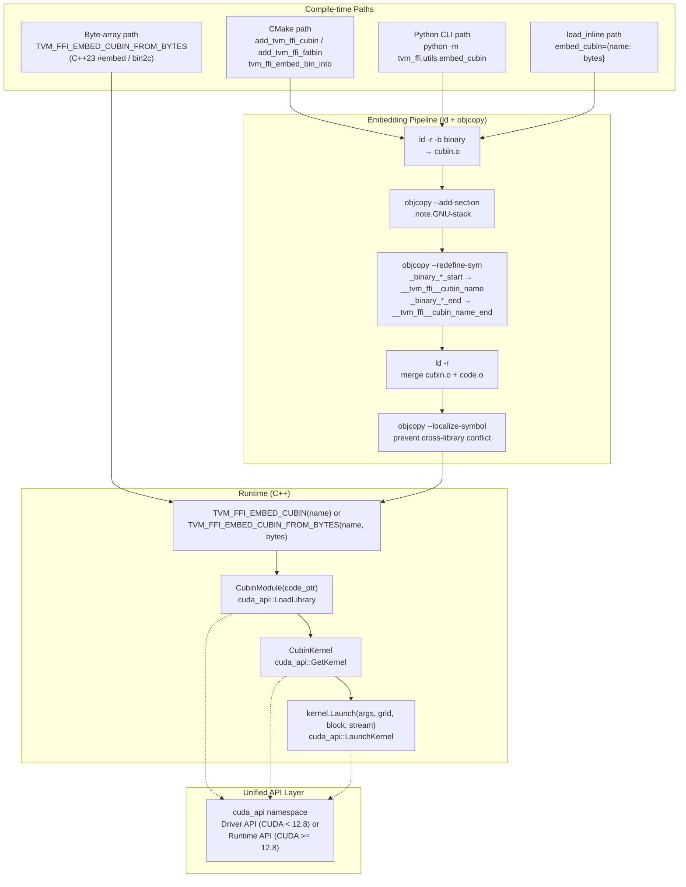
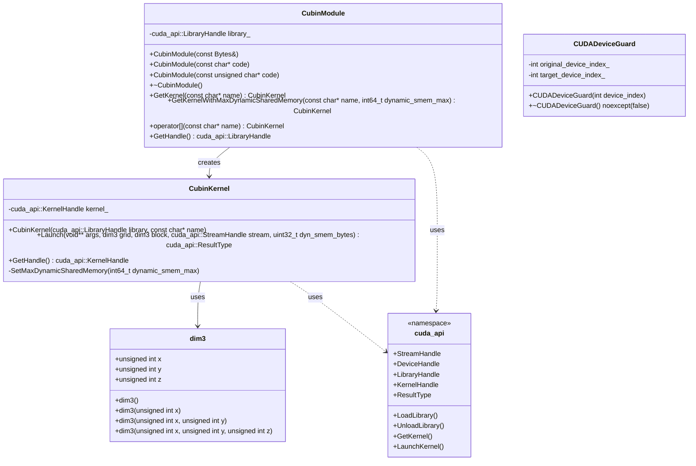

# CUBIN Launcher and CUDA Utilities

**TL;DR**
- Header-only C++ subsystem under `include/tvm/ffi/extra/cuda/` providing `CubinModule`/`CubinKernel` RAII wrappers for loading CUBIN from memory and launching kernels via a unified `cuda_api` abstraction layer (Driver or Runtime API, compile-time switchable), plus `CUDADeviceGuard` for multi-GPU device switching.
- Compile-time CUBIN embedding via `TVM_FFI_EMBED_CUBIN`/`TVM_FFI_EMBED_CUBIN_FROM_BYTES`/`TVM_FFI_EMBED_CUBIN_GET_KERNEL` macros using `__tvm_ffi__cubin_<name>` symbol convention, with three embedding paths: CMake (`add_tvm_ffi_cubin`/`add_tvm_ffi_fatbin`/`tvm_ffi_embed_bin_into`), Python CLI (`tvm_ffi.utils.embed_cubin`), and `load_inline` integration.
- Runtime CUDA-to-CUBIN compilation via `tvm_ffi.cpp.nvrtc.nvrtc_compile` wrapping NVIDIA's NVRTC library through `cuda.bindings`.

## Problem Statement

### Background
- TVM FFI enables compiled ML kernels to be loaded as shared libraries via the module system. CUDA kernels require an additional step: the CUBIN (compiled GPU binary) must be embedded into the shared library and loaded at runtime via the CUDA Runtime API.
- Without a standard embedding mechanism, each project would need its own `ld -r -b binary` + `objcopy` pipeline for embedding CUBIN data, with ad-hoc symbol naming and no symbol localization (risking cross-library conflicts).
- Multi-GPU kernel launches require explicit device switching to ensure kernels execute on the correct GPU, requiring RAII guards to restore the original device on scope exit.
- The `load_inline` C++ extension workflow needed CUBIN support for rapid CUDA kernel prototyping without manual build steps.

### Solution
- Three header-only C++ classes (`CubinModule`, `CubinKernel`, `dim3`) and three macros (`TVM_FFI_EMBED_CUBIN`, `TVM_FFI_EMBED_CUBIN_FROM_BYTES`, `TVM_FFI_EMBED_CUBIN_GET_KERNEL`) for the kernel loading/launching path.
- A unified `cuda_api` namespace (`internal/unified_api.h`) providing compile-time switchable abstraction over CUDA Driver and Runtime APIs, controlled by `TVM_FFI_CUBIN_LAUNCHER_USE_DRIVER_API`.
- A shared `base.h` header providing `dim3`; `TVM_FFI_CHECK_CUDA_ERROR` relocated to `unified_api.h`.
- `CUDADeviceGuard` RAII struct for safe multi-GPU device context switching.
- A three-path embedding toolchain (CMake, Python CLI, `load_inline`) that all produce the same `__tvm_ffi__cubin_<name>` symbol layout, with post-merge symbol localization to prevent cross-library conflicts. CMake functions modernized to target-based (`add_tvm_ffi_cubin`/`add_tvm_ffi_fatbin`/`tvm_ffi_embed_bin_into`).
- `nvrtc_compile` Python wrapper for runtime CUDA-to-CUBIN compilation.

### Goals
- **Goal**: Provide a minimal, header-only C++ API for loading and launching CUDA kernels from embedded CUBIN data.
- **Goal**: Provide three embedding paths (CMake, Python CLI, `load_inline`) that produce identical symbol layouts.
- **Goal**: Ensure CUBIN symbols are localized post-merge to prevent cross-library conflicts.
- **Goal**: Enable rapid CUDA kernel prototyping via `load_inline` with `embed_cubin` parameter.
- **Non-goal**: Not a CUDA kernel compiler -- CUBIN compilation is delegated to nvcc (CMake) or NVRTC (Python).
- **Non-goal**: Windows support for the embedding toolchain (raises `NotImplementedError`).

## Design





### Key Classes, Fields and Interfaces

**`cuda_api` namespace** (`tvm::ffi::cuda_api`, `extra/cuda/internal/unified_api.h`, b16f11f):
```cpp
namespace tvm::ffi::cuda_api {
  // Type aliases (Driver API or Runtime API depending on TVM_FFI_CUBIN_LAUNCHER_USE_DRIVER_API)
  using StreamHandle;   // CUstream or cudaStream_t
  using DeviceHandle;   // CUdevice or int
  using LibraryHandle;  // CUlibrary or cudaLibrary_t
  using KernelHandle;   // CUkernel or cudaKernel_t
  using ResultType;     // CUresult or cudaError_t
  constexpr ResultType kSuccess;

  // Wrapper functions
  ResultType LoadLibrary(LibraryHandle*, const void*);
  ResultType UnloadLibrary(LibraryHandle);
  ResultType GetKernel(KernelHandle*, LibraryHandle, const char*);
  DeviceHandle GetDeviceHandle(int device_id);
  ResultType LaunchKernel(KernelHandle, void**, dim3, dim3, StreamHandle, uint32_t);
  ResultType GetKernelSharedMem(KernelHandle, int&, DeviceHandle);
  ResultType SetKernelMaxDynamicSharedMem(KernelHandle, int, DeviceHandle);
  ResultType GetDeviceCount(int*);
  ResultType GetDeviceAttribute(int*, DeviceAttrType, DeviceHandle);
  // Extended launch API (adac5eb):
  ResultType LaunchKernelEx(KernelHandle kernel, void** args, const LaunchConfig& config);
  ResultType ConstructLaunchConfig(
      KernelHandle kernel, StreamHandle stream, uint32_t smem_size,
      dim3 grid, dim3 block, int cluster_dim,
      LaunchConfig& config, LaunchAttrType& attr);
  // LaunchKernelEx: Driver API -> cuLaunchKernelEx, Runtime API -> cudaLaunchKernelExC
  // ConstructLaunchConfig: populates config; if cluster_dim > 1, sets cluster dimension launch attribute (SM90+)
}
```
Compile-time API selection via `TVM_FFI_CUBIN_LAUNCHER_USE_DRIVER_API`:
- `0` (default for CUDA >= 12.8): Uses Runtime API (`cudaLibraryLoadData`, etc.)
- `1` (default for CUDA < 12.8): Uses Driver API (`cuLibraryLoadData`, etc.)
- User-overridable before including `unified_api.h`. `static_assert` if Runtime API requested but CUDA < 12.8.

**`CubinModule`** (`tvm::ffi`, header-only, RAII):
```cpp
class CubinModule {
public:
  explicit CubinModule(const Bytes& bytes);           // loads via cuda_api::LoadLibrary
  explicit CubinModule(const char* code);              // loads via cuda_api::LoadLibrary
  explicit CubinModule(const unsigned char* code);     // new: for byte arrays (b16f11f)
  ~CubinModule();                                      // cuda_api::UnloadLibrary
  CubinKernel GetKernel(const char* name);
  CubinKernel GetKernelWithMaxDynamicSharedMemory(const char* name, int64_t dynamic_smem_max = -1);
  CubinKernel operator[](const char* name);            // alias for GetKernel
  cuda_api::LibraryHandle GetHandle() const;
  // Non-copyable, movable
};
```

**`CubinKernel`** (`tvm::ffi`, header-only, RAII):
```cpp
class CubinKernel {
public:
  CubinKernel(cuda_api::LibraryHandle library, const char* name);  // cuda_api::GetKernel
  cuda_api::ResultType Launch(void** args, dim3 grid, dim3 block, cuda_api::StreamHandle stream,
                              uint32_t dyn_smem_bytes = 0);
  cuda_api::ResultType LaunchEx(void** args, const cuda_api::LaunchConfig& config);  // (adac5eb)
  cuda_api::KernelHandle GetHandle() const;
  // Non-copyable, movable
private:
  void SetMaxDynamicSharedMemory(int64_t dynamic_smem_max = -1);
  // Iterates all devices via cuda_api::GetDeviceCount/GetDeviceAttribute.
  // Only errors if setting fails for ALL devices.
  friend class CubinModule;
};
```

**`dim3`** (`tvm::ffi`, in `base.h` -- relocated from `cubin_launcher.h` in b16f11f):
```cpp
struct dim3 {
  unsigned int x, y, z;  // default (1, 1, 1)
  dim3();
  explicit dim3(unsigned int x);
  dim3(unsigned int x, unsigned int y);
  dim3(unsigned int x, unsigned int y, unsigned int z);
};
```

**`CUDADeviceGuard`** (`tvm::ffi`, RAII device switcher):
```cpp
struct CUDADeviceGuard {
  CUDADeviceGuard() = delete;
  explicit CUDADeviceGuard(int device_index);  // cudaGetDevice + conditional cudaSetDevice
  ~CUDADeviceGuard() noexcept(false);          // restores original device; can throw via TVM_FFI_CHECK_CUDA_ERROR
private:
  int original_device_index_;
  int target_device_index_;
};
```

**Python functions**:

| Function | Signature | Module |
|----------|-----------|--------|
| `nvrtc_compile` | `(source: str, *, name: str = "kernel.cu", arch: str \| None = None, extra_opts: Sequence[str] \| None = None) -> bytes` | `tvm_ffi.cpp.nvrtc` |
| `embed_cubin` | `(cubin_path: Path, input_obj_path: Path, output_obj_path: Path, name: str, verbose: bool = False) -> None` | `tvm_ffi.utils.embed_cubin` |
| `build_inline` | `(..., embed_cubin: Mapping[str, bytes] \| None = None) -> str` | `tvm_ffi.cpp.extension` |
| `load_inline` | `(..., embed_cubin: Mapping[str, bytes] \| None = None) -> Module` | `tvm_ffi.cpp.extension` |

**HIP/ROCm compilation support** (`tvm_ffi.cpp.extension`, 65b5e90):

`load_inline` auto-detects AMD HIP vs NVIDIA CUDA via `_detect_gpu_backend()`. The `cuda_sources` parameter is reused for HIP source code. Detection precedence: (1) `TVM_FFI_GPU_BACKEND` env var, (2) presence of `hipcc` in PATH / ROCm installation, (3) fallback to CUDA.

| Function | Signature | Description |
|----------|-----------|-------------|
| `_detect_gpu_backend()` | `() -> Literal["cuda", "hip"]` | Auto-detect GPU backend. Checks `TVM_FFI_GPU_BACKEND` env var, then probes for ROCm. Cached via `lru_cache`. |
| `_find_rocm_home()` | `() -> str` | Find ROCm install path. Checks `ROCM_HOME`/`ROCM_PATH`, then `hipcc` in PATH, then `/opt/rocm`. Cached. |
| `_get_rocm_target()` | `() -> list[str]` | Get `--offload-arch=gfxXXXX` flags via `rocm_agent_enumerator`. |
| `_resolve_gpu_backend(backend)` | `(str \| None) -> Literal["cuda", "hip"]` | Resolve explicit or auto-detected backend. |

When HIP is selected, `load_inline` uses `hipcc` as the compiler with HIP-specific flags (`-fPIC`, `--offload-arch=gfxXXXX`). The `TVM_FFI_GPU_BACKEND` environment variable provides explicit override (`"cuda"` or `"hip"`).

**CMake functions** (modernized in b16f11f, replacing `tvm_ffi_generate_cubin`/`tvm_ffi_embed_cubin`):

| Function | Parameters | Description |
|----------|------------|-------------|
| `add_tvm_ffi_cubin` | `OUTPUT`, `SOURCE`, `...` | Compile CUDA source to CUBIN (replaces `tvm_ffi_generate_cubin`) |
| `add_tvm_ffi_fatbin` | `OUTPUT`, `SOURCE`, `...` | Compile CUDA source to FATBIN |
| `tvm_ffi_embed_bin_into` | `TARGET`, `BIN`, `NAME`, `...` | Embed binary into target via `PRE_LINK` (replaces `tvm_ffi_embed_cubin`) |

### Macro Expansions

**`TVM_FFI_EMBED_CUBIN(name)`** expands to:
```cpp
// Pseudocode of expansion for TVM_FFI_EMBED_CUBIN(my_kernels):
extern "C" const char __tvm_ffi__cubin_my_kernels[];
extern "C" const char __tvm_ffi__cubin_my_kernels_end[];
namespace {  // anonymous namespace
struct EmbedCubinModule_my_kernels {
  tvm::ffi::CubinModule mod{__tvm_ffi__cubin_my_kernels};
  static EmbedCubinModule_my_kernels* Global() {
    static EmbedCubinModule_my_kernels inst;  // lazily constructed singleton
    return &inst;
  }
};
}  // anonymous namespace
```
Key properties: (1) `extern "C"` symbols match the `ld -r -b binary` + `objcopy` output; (2) anonymous namespace prevents ODR violations across translation units; (3) `CubinModule` is initialized lazily on first access, calling `cudaLibraryLoadData` at that point.

**`TVM_FFI_EMBED_CUBIN_FROM_BYTES(name, imageBytes)`** (b16f11f) expands to:
```cpp
// Pseudocode for TVM_FFI_EMBED_CUBIN_FROM_BYTES(my_kernels, kernel_image):
namespace {
struct EmbedCubinModule_my_kernels {
  tvm::ffi::CubinModule mod{kernel_image};  // uses unsigned char* ctor
  static EmbedCubinModule_my_kernels* Global() {
    static EmbedCubinModule_my_kernels inst;
    return &inst;
  }
};
}
```
Paired with `TVM_FFI_EMBED_CUBIN_GET_KERNEL(name, kernel_name)` to retrieve kernels. Enables C++23 `#embed` or `bin2c`-generated byte arrays.

**`TVM_FFI_EMBED_CUBIN_GET_KERNEL(name, kernel_name)`** expands to:
```cpp
// Pseudocode for TVM_FFI_EMBED_CUBIN_GET_KERNEL(my_kernels, "add_one"):
(EmbedCubinModule_my_kernels::Global()->mod["add_one"])
```
Returns a `CubinKernel` via `CubinModule::operator[]`. Typically stored in a `static` local variable for zero-overhead repeated access.

**`TVM_FFI_CHECK_CUBIN_LAUNCHER_CUDA_ERROR(stmt)`** (renamed from `TVM_FFI_CHECK_CUDA_ERROR` in 10cb004, `unified_api.h`) expands to:
```cpp
// Pseudocode for TVM_FFI_CHECK_CUBIN_LAUNCHER_CUDA_ERROR(cuda_api::LoadLibrary(...)):
do {
  cuda_api::ResultType __err = stmt;
  if (__err != cuda_api::kSuccess) {
    // Obtains error name/string via cuda_api wrappers (Driver or Runtime)
    TVM_FFI_THROW(RuntimeError) << "CUDA Error: " << __err_name
                                << " (" << static_cast<int>(__err) << "): " << __err_str;
  }
} while (0)
```
Isolated to cubin launcher usage only. Uses the unified `cuda_api::ResultType` (Driver or Runtime).

**`TVM_FFI_CHECK_CUDA_ERROR(stmt)`** (new in 10cb004, `base.h`) expands to:
```cpp
// Pseudocode for TVM_FFI_CHECK_CUDA_ERROR(cudaMemcpy(...)):
do {
  cudaError_t __err = stmt;
  if (__err != cudaSuccess) {
    TVM_FFI_THROW(RuntimeError) << "CUDA Error: " << cudaGetErrorName(__err)
                                << " (" << static_cast<int>(__err) << "): "
                                << cudaGetErrorString(__err);
  }
} while (0)
```
Purely CUDA Runtime API-based. For general CUDA error checking outside cubin launcher.

### Contracts, Assumptions and Invariants
- **CUBIN symbol naming**: Embedded CUBIN uses `__tvm_ffi__cubin_<name>` and `__tvm_ffi__cubin_<name>_end` (double-underscore internal prefix, consistent with `__tvm_ffi__library_bin`). After merging, symbols are localized via `objcopy --localize-symbol` to prevent cross-library conflicts. See [ADR 0023](../ADRs/0023-cubin-symbol-naming.md).
- **RAII ownership**: `CubinModule` owns `cudaLibrary_t` (unloaded in destructor). `CubinKernel` holds `cudaKernel_t` (no explicit cleanup needed -- lifetime tied to library). Both are non-copyable, movable.
- **Lazy singleton initialization**: `EmbedCubinModule_<name>::Global()` returns a function-local static, so the `CubinModule` (and thus `cudaLibraryLoadData`) is called on first access, not at static initialization time. This avoids CUDA initialization ordering issues.
- **Dynamic shared memory configuration**: `SetMaxDynamicSharedMemory` iterates all devices, setting the attribute per-device. It only throws if ALL devices fail. When `dynamic_smem_max == -1`, it queries `cudaFuncGetAttributes` to compute `device_max - static_shared`.
- **CUDA error macro split** (10cb004): `TVM_FFI_CHECK_CUDA_ERROR` in `base.h` is purely CUDA Runtime API (`cudaError_t` / `cudaGetErrorName`). `TVM_FFI_CHECK_CUBIN_LAUNCHER_CUDA_ERROR` in `unified_api.h` uses the unified `cuda_api::ResultType` (Driver or Runtime). The former is for general CUDA code; the latter is only for cubin launcher internals.
- **`CUDADeviceGuard` destructor can throw**: The destructor is `noexcept(false)` because `TVM_FFI_CHECK_CUDA_ERROR` can throw on `cudaSetDevice` failure. This is intentional -- failing to restore the device is a critical error.
- **Platform constraint**: The embedding toolchain (`ld -r -b binary`, `objcopy`) is Linux/Unix-only. Windows raises `NotImplementedError`. The C++ header-only classes are platform-independent (require only CUDA Runtime API).
- **Failure mode -- NVRTC compilation failure**: `nvrtc_compile` raises `RuntimeError` with the NVRTC compilation log on failure. Requires `cuda.bindings` (`pip install cuda-python`).
- **Failure mode -- missing CUBIN symbols**: If the `TVM_FFI_EMBED_CUBIN` symbols are not linked (e.g., CUBIN not embedded), the linker will fail with undefined symbol errors for `__tvm_ffi__cubin_<name>`.

### Extension Points
- **New CUDA utilities**: Add headers under `include/tvm/ffi/extra/cuda/`. Include `base.h` for the `TVM_FFI_CHECK_CUDA_ERROR` macro.
- **Alternative kernel runtimes**: The `CubinModule`/`CubinKernel` pattern could be adapted for HIP (ROCm) with a parallel `hip/` directory using `hipModule*` APIs. The Python-side `load_inline` already supports HIP compilation (65b5e90) via `hipcc` auto-detection.
- **Windows CUBIN embedding**: Would require replacing `ld -r -b binary` + `objcopy` with MSVC-compatible embedding (e.g., `/ASSEMBLYRESOURCE` or `bin2obj`).

### Usage Examples

#### C++ end-to-end: embed CUBIN and launch kernel
**Context**: A C++ shared library that embeds a pre-compiled CUBIN and launches it, integrated via the module system.
```cpp
#include <tvm/ffi/extra/cuda/cubin_launcher.h>

// Declare embedded CUBIN (symbols provided by embedding toolchain)
TVM_FFI_EMBED_CUBIN(my_kernels);

void AddOne(tvm::ffi::TensorView x, tvm::ffi::TensorView y) {
  // Cache kernel lookup in static variable (zero overhead after first call)
  static auto kernel = TVM_FFI_EMBED_CUBIN_GET_KERNEL(my_kernels, "add_one");

  int64_t n = x.size(0);
  void* x_ptr = x.data_ptr();
  void* y_ptr = y.data_ptr();
  void* args[] = {&x_ptr, &y_ptr, &n};

  tvm::ffi::dim3 grid((n + 255) / 256), block(256);
  cudaStream_t stream = static_cast<cudaStream_t>(
      TVMFFIEnvGetStream(x.device().device_type, x.device().device_id));

  cudaError_t result = kernel.Launch(args, grid, block, stream);
  TVM_FFI_CHECK_CUDA_ERROR(result);
}
```

#### Python cross-layer: compile, embed, load, and call
**Context**: Python compiles CUDA source at runtime, embeds CUBIN into a C++ extension, loads and calls it.
```python
from tvm_ffi import cpp
from tvm_ffi.cpp import nvrtc

# Step 1: Compile CUDA source to CUBIN via NVRTC
cubin_bytes = nvrtc.nvrtc_compile(cuda_source, name="kernel.cu")

# Step 2: Load C++ extension with embedded CUBIN
mod = cpp.load_inline(
    "my_module",
    cuda_sources=cpp_wrapper_code,
    embed_cubin={"my_kernels": cubin_bytes},
    extra_ldflags=["-lcudart"],
)

# Step 3: Call the exported function
mod.add_one(x_tensor, y_tensor)
```

#### C++ end-to-end: embed CUBIN from byte array (C++23 #embed)
**Context**: Using `TVM_FFI_EMBED_CUBIN_FROM_BYTES` for workflows that produce byte arrays (e.g., `bin2c`, C++23 `#embed`), avoiding the `ld`/`objcopy` embedding pipeline.
```cpp
#include <tvm/ffi/extra/cuda/cubin_launcher.h>

constexpr unsigned char kernel_image[] = {
  #embed "kernel.cubin"
};
TVM_FFI_EMBED_CUBIN_FROM_BYTES(my_kernels, kernel_image);

void RunKernel() {
  static auto kernel = TVM_FFI_EMBED_CUBIN_GET_KERNEL(my_kernels, "my_kernel");
  void* args[] = { &input, &output };
  TVM_FFI_CHECK_CUDA_ERROR(kernel.Launch(args, tvm::ffi::dim3(grid), tvm::ffi::dim3(block), stream));
}
```

#### Multi-GPU kernel launch with CUDADeviceGuard
**Context**: Launching a kernel on a specific GPU device, ensuring the original device is restored.
```cpp
#include <tvm/ffi/extra/cuda/device_guard.h>

void kernel(tvm::ffi::TensorView x) {
  // Guard switches to x's device and restores original on scope exit
  tvm::ffi::CUDADeviceGuard guard(x.device().device_id);
  // All CUDA operations now target x's device
  // ...
  // Original device restored automatically when guard goes out of scope
}
```

#### HIP/ROCm: compile and load a HIP kernel via load_inline
**Context**: Using `load_inline` on an AMD ROCm system. The `cuda_sources` parameter accepts HIP source code; backend is auto-detected.
```python
import tvm_ffi.cpp

# Auto-detects HIP when ROCm is available (or set TVM_FFI_GPU_BACKEND=hip)
mod = tvm_ffi.cpp.load_inline(
    name="hello_hip",
    cuda_sources='''
#include <hip/hip_runtime.h>
__global__ void add_one_kernel(const float* x, float* y, int64_t n) {
    int64_t i = blockIdx.x * blockDim.x + threadIdx.x;
    if (i < n) y[i] = x[i] + 1.0f;
}
void add_one_hip(tvm::ffi::TensorView x, tvm::ffi::TensorView y) {
    int64_t n = x.size(0);
    add_one_kernel<<<(n+255)/256, 256>>>(x.data_ptr<float>(), y.data_ptr<float>(), n);
}
''',
    functions="add_one_hip",
)
mod.add_one_hip(x_tensor, y_tensor)
```

## Alternatives & Trade-offs
### Direct CUDA Driver API (cuModuleLoad)
- Pros: No dependency on CUDA Runtime API; finer-grained control over context management.
- Cons: Requires explicit context management (`cuCtxCreate`/`cuCtxSetCurrent`). The `cuda_api` unified abstraction (b16f11f) now supports *both* Driver and Runtime APIs via compile-time switch, defaulting to Runtime API for CUDA >= 12.8 (which manages contexts transparently via primary context, compatible with PyTorch's CUDA context model).

### Embedding via C array literal (xxd)
- Pros: Cross-platform (works on Windows); no `ld`/`objcopy` dependency.
- Cons: Produces enormous C source files for large CUBINs (each byte becomes a comma-separated integer). Slower compilation, larger intermediate files. The `ld -r -b binary` approach embeds raw bytes directly into the object file with minimal overhead.

## Related Work
### Design Docs & ADRs
- [0013-module-system.md](0013-module-system.md) -- Module loading infrastructure; `load_inline` returns a `Module`/`LibraryModuleObj`
- [0006-error-handling.md](0006-error-handling.md) -- `TVM_FFI_THROW(RuntimeError)` pattern used in `TVM_FFI_CHECK_CUDA_ERROR`
- [ADR 0010-extra-api-isolation.md](../ADRs/0010-extra-api-isolation.md) -- Headers placed under `extra/cuda/` per the isolation convention
- [ADR 0023-cubin-symbol-naming.md](../ADRs/0023-cubin-symbol-naming.md) -- Symbol naming and localization decision
- [ADR 0025-unified-cuda-api-abstraction.md](../ADRs/0025-unified-cuda-api-abstraction.md) -- Decision to abstract over CUDA Driver/Runtime APIs with compile-time flag

### Evidence Matrix
- `CubinModule`, `CubinKernel`, `dim3`, embedding macros, Python/CMake toolchain, `nvrtc_compile` -> `2025-11-25-d49effdb.md` (d49effdb)
- `CUDADeviceGuard`, `base.h` extraction, `TVM_FFI_CHECK_CUDA_ERROR` relocation -> `2025-11-25-cdfd0410.md` (cdfd0410)
- Unified CUDA API abstraction (`cuda_api` namespace), `TVM_FFI_EMBED_CUBIN_FROM_BYTES`, new CMake functions (`add_tvm_ffi_cubin`/`add_tvm_ffi_fatbin`/`tvm_ffi_embed_bin_into`), `CubinModule(unsigned char*)` ctor, `dim3` relocation to `base.h`, `TVM_FFI_CHECK_CUDA_ERROR` relocation to `unified_api.h` -> `2025-12-25-b16f11f60156cf07c6e5d3f9ddfa9e2273bdea03.md` (b16f11f) + `extra/cuda/internal/unified_api.h`, `extra/cuda/cubin_launcher.h`, `extra/cuda/base.h`
- CUDA macro split: `TVM_FFI_CHECK_CUDA_ERROR` (runtime, base.h) vs `TVM_FFI_CHECK_CUBIN_LAUNCHER_CUDA_ERROR` (unified, unified_api.h), missing include fix in device_guard.h -> `2026-01-12-10cb0048cef8f3a37282f403cded9eb96aa59464.md` (10cb004), `2026-01-13-692a41a3a221897501e145a0c102ab8b055bc1e7.md` (692a41a)
- AMD HIP support in `load_inline`: `_detect_gpu_backend`, `_find_rocm_home`, `_get_rocm_target`, `TVM_FFI_GPU_BACKEND` env var, `hipcc` compilation path -> `2026-02-19-65b5e90576185cb6300f43bc1307158dc99afb54.md` (65b5e90) + `python/tvm_ffi/cpp/extension.py`
- `CubinKernel::LaunchEx`, `cuda_api::LaunchKernelEx`, `cuda_api::ConstructLaunchConfig` for SM90+ cluster launch attributes -> `2026-02-28-adac5ebd0ad695fc77bf5113c8127a7298c1ed52.md` (adac5eb) + `extra/cuda/cubin_launcher.h`, `extra/cuda/internal/unified_api.h`
- Plus 2 supporting commits: device guard docs in kernel library guide (803cdc84), compiler warning fixes (c22e10e), #embed compile-time check (ed067c1)
