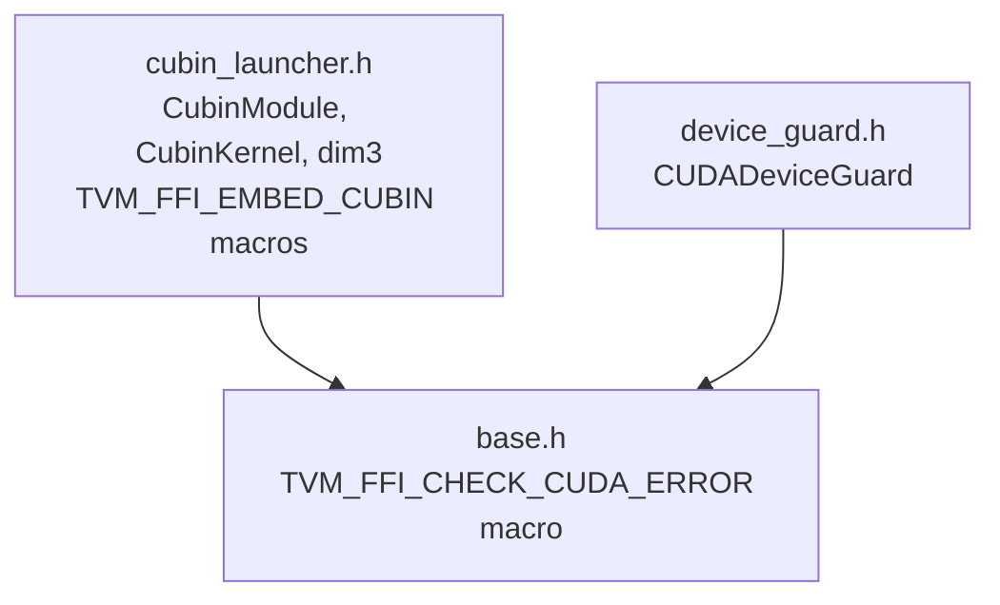

# CUDA Extra Headers: CubinModule, DeviceGuard, and Kernel Tooling

**TL;DR**:
- Header-only CUDA utilities shipped under `include/tvm/ffi/extra/cuda/` provide `CubinModule`/`CubinKernel` for loading and launching CUDA cubin kernels, `CUDADeviceGuard` for RAII device context switching, and `TVM_FFI_CHECK_CUDA_ERROR` for error checking. These are not compiled into `libtvm_ffi`; users link against `CUDA::cudart` themselves.
- Python tooling complements the C++ headers: `tvm_ffi.cpp.nvrtc` compiles CUDA source to cubin at runtime via NVRTC, `tvm_ffi.utils.embed_cubin` embeds cubin data into object files via `ld`/`objcopy`, and `cmake/Utils/EmbedCubin.cmake` provides CMake integration.
- The `embed_cubin` parameter on `tvm_ffi.cpp.load_inline()` enables a single-call workflow: compile CUDA source with NVRTC, embed the resulting cubin, and load the module.

## Problem Statement
### Background
- Kernel library developers need to load pre-compiled CUDA cubin binaries and launch them at runtime. The CUDA Driver API (`cuModuleLoad`/`cuLaunchKernel`) works but is verbose and requires manual resource management.
- Multi-GPU environments require careful device context management to ensure CUDA operations execute on the intended GPU.
- Embedding cubin data directly into shared libraries (rather than loading from files at runtime) is common in production deployments but requires manual `ld`/`objcopy` symbol juggling.

### Solution
- Provide lightweight, header-only C++ wrappers around the CUDA Runtime API (`cudaLibrary*` family) that handle resource management via RAII.
- Provide a `CUDADeviceGuard` RAII struct analogous to PyTorch's `c10::cuda::CUDAGuard`.
- Provide Python and CMake utilities for the cubin embedding workflow.

### Goals
- Zero runtime overhead over raw CUDA Runtime API calls (header-only, inlined).
- RAII-based resource management for CUDA library handles and device context.
- Simplified cubin embedding workflow (CMake, Python CLI, and `load_inline` integration).
- Non-goals: replacing nvcc for compilation; supporting non-CUDA GPU backends.

## Design

### Header Organization



All headers are under `include/tvm/ffi/extra/cuda/` and require `cuda_runtime.h` (link against `CUDA::cudart`).

### CubinModule / CubinKernel

`CubinModule` wraps `cudaLibrary_t` and loads cubin binary data (from memory or embedded symbols) via `cudaLibraryLoadData`. It is movable but not copyable.

`CubinKernel` wraps `cudaKernel_t` for a specific kernel function within a loaded cubin. It provides `Launch(args, grid, block, stream, dyn_smem_bytes)` which calls `cudaLaunchKernel`.

### Key Classes, Fields and Interfaces

**C++ Classes (namespace `tvm::ffi`):**

| Symbol | Kind | Signature / Description |
|--------|------|------------------------|
| `dim3` | struct | `dim3(unsigned x=1, unsigned y=1, unsigned z=1)` -- 3D dimension for kernel launch config |
| `CubinModule` | class | Loads cubin from `const char*` or `Bytes`. RAII: calls `cudaLibraryUnload` on destruction. Movable, not copyable. |
| `CubinModule::CubinModule(const Bytes& bytes)` | ctor | Load cubin from `Bytes` object via `cudaLibraryLoadData` |
| `CubinModule::CubinModule(const char* code)` | ctor | Load cubin from raw pointer (e.g., embedded ELF image) |
| `CubinModule::GetKernel(const char* name)` | method | `CubinKernel` -- retrieve kernel by name |
| `CubinModule::GetKernelWithMaxDynamicSharedMemory(const char* name, int64_t dynamic_smem_max = -1)` | method | `CubinKernel` -- retrieve kernel and set max dynamic shared memory across all devices. `-1` means max available (device max - kernel static shared memory). |
| `CubinModule::operator[](const char* name)` | method | `CubinKernel` -- alias for `GetKernel(name)` |
| `CubinKernel` | class | Wraps `cudaKernel_t`. Movable, not copyable. |
| `CubinKernel::Launch(void** args, dim3 grid, dim3 block, cudaStream_t stream, uint32_t dyn_smem_bytes = 0)` | method | `cudaError_t` -- launch kernel via `cudaLaunchKernel` |
| `CUDADeviceGuard` | struct | RAII guard: `cudaSetDevice(target)` on construction, `cudaSetDevice(original)` on destruction. Skips set if target == original. |
| `CUDADeviceGuard::CUDADeviceGuard(int device_index)` | ctor | Sets CUDA device, stores original |

**C++ Macros:**

| Symbol | Expansion | Description |
|--------|-----------|-------------|
| `TVM_FFI_CHECK_CUDA_ERROR(stmt)` | Evaluates `stmt`, throws `RuntimeError` with error name/string if `!= cudaSuccess` | CUDA error checking macro (defined in `base.h`) |
| `TVM_FFI_EMBED_CUBIN(name)` | Declares `extern "C"` symbols `__tvm_ffi__cubin_<name>` / `__tvm_ffi__cubin_<name>_end`, creates a singleton `EmbedCubinModule_<name>` with a `CubinModule` member | Declare embedded cubin for static initialization |
| `TVM_FFI_EMBED_CUBIN_GET_KERNEL(name, kernel_name)` | `EmbedCubinModule_<name>::Global()->mod[kernel_name]` | Retrieve a `CubinKernel` from an embedded cubin singleton |

**Python Modules:**

| Symbol | Signature | Description |
|--------|-----------|-------------|
| `tvm_ffi.cpp.nvrtc.nvrtc_compile` | `(source: str, *, name: str = "kernel.cu", arch: str \| None = None, extra_opts: Sequence[str] \| None = None) -> bytes` | Compile CUDA source to cubin via NVRTC. Auto-detects GPU architecture if `arch` is None. Requires `cuda-python` package. |
| `tvm_ffi.utils.embed_cubin.embed_cubin` | `(cubin_path: Path, input_obj_path: Path, output_obj_path: Path, name: str, verbose: bool = False) -> None` | Embed cubin data into an existing object file using `ld -r -b binary` + `objcopy`. Linux-only (requires GNU binutils). |
| `tvm_ffi.cpp.load_inline` (updated) | `embed_cubin: Mapping[str, bytes] \| None` parameter | When provided, each entry embeds the cubin bytes into the compiled module with the given name, accessible via `TVM_FFI_EMBED_CUBIN`. |

**CMake Functions (from `cmake/Utils/EmbedCubin.cmake`):**

| Symbol | Parameters | Description |
|--------|------------|-------------|
| `tvm_ffi_generate_cubin` | `OUTPUT, SOURCE, [ARCH], [OPTIONS], [DEPENDS]` | Compile CUDA source to cubin using nvcc. Default ARCH is `native`. |
| `tvm_ffi_embed_cubin` | `OUTPUT, SOURCE, CUBIN, NAME, [DEPENDS]` | Compile C++ source to intermediate `.o`, embed cubin data via Python utility, produce combined object file. |

### Contracts, Assumptions and Invariants
- **CUDA Runtime API requirement**: All headers require CUDA Runtime API (`cuda_runtime.h`). Users must link against `CUDA::cudart`. These headers are NOT compiled into `libtvm_ffi.so`.
- **cudaLibrary API requirement**: `CubinModule` uses `cudaLibraryLoadData` / `cudaLibraryUnload` / `cudaLibraryGetKernel`, available since CUDA 12.0. Older CUDA versions are not supported.
- **Embedded cubin symbol contract**: `TVM_FFI_EMBED_CUBIN(name)` expects linker symbols `__tvm_ffi__cubin_<name>` and `__tvm_ffi__cubin_<name>_end` to exist. These are created by either the CMake `tvm_ffi_embed_cubin` function or the `python -m tvm_ffi.utils.embed_cubin` CLI tool. Symbols are localized after linking to prevent cross-module conflicts.
- **DeviceGuard is not re-entrant**: Nesting `CUDADeviceGuard` objects is safe (each saves/restores the device at its scope boundary), but the destructor is `noexcept(false)` because `TVM_FFI_CHECK_CUDA_ERROR` can throw if `cudaSetDevice` fails.
- **NVRTC requires cuda-python**: `nvrtc_compile` imports `cuda.bindings.nvrtc` and `cuda.bindings.driver`. Users must install `pip install cuda-python`.
- **embed_cubin requires GNU binutils**: The Python utility uses `ld -r -b binary` and `objcopy`, which are Linux-specific. macOS and Windows are not supported for cubin embedding via this utility.
- **Dynamic shared memory**: `GetKernelWithMaxDynamicSharedMemory` sets `cudaFuncAttributeMaxDynamicSharedMemorySize` across all visible devices. Individual device failures are tolerated; an error is thrown only if ALL devices fail.

### Extension Points
- New CUDA utility headers can be added under `include/tvm/ffi/extra/cuda/`.
- The `embed_cubin` parameter in `load_inline` could be extended to support multiple cubin files per module.
- The NVRTC wrapper could be extended with PTX output, link-time optimization, or named expression compilation.

### Usage Examples

#### Loading and launching a kernel from embedded cubin
**Context**: Production deployment where cubin is embedded at build time for zero-I/O kernel loading.
```cpp
#include <tvm/ffi/extra/cuda/cubin_launcher.h>

// Declare the embedded cubin (symbols created by cmake or embed_cubin tool)
TVM_FFI_EMBED_CUBIN(my_kernels);

void LaunchKernel(tvm::ffi::TensorView input, tvm::ffi::TensorView output) {
    // Get kernel (cached in static variable)
    static auto kernel = TVM_FFI_EMBED_CUBIN_GET_KERNEL(my_kernels, "add_one");

    void* in_ptr = input.data_ptr();
    void* out_ptr = output.data_ptr();
    int64_t n = input.size(0);
    void* args[] = {&in_ptr, &out_ptr, &n};

    tvm::ffi::dim3 grid((n + 255) / 256);
    tvm::ffi::dim3 block(256);

    DLDevice device = input.device();
    cudaStream_t stream = static_cast<cudaStream_t>(
        TVMFFIEnvGetStream(device.device_type, device.device_id));

    cudaError_t result = kernel.Launch(args, grid, block, stream);
    TVM_FFI_CHECK_CUDA_ERROR(result);
}
```

#### Using DeviceGuard for multi-GPU execution
**Context**: Ensuring CUDA operations target the correct GPU when processing tensors from different devices.
```cpp
#include <tvm/ffi/extra/cuda/device_guard.h>

void kernel(tvm::ffi::TensorView x) {
    tvm::ffi::CUDADeviceGuard guard(x.device().device_id);
    // All CUDA operations here execute on x's device
    // Device is automatically restored when guard goes out of scope
}
```

#### End-to-end: NVRTC compile + load_inline with embedded cubin
**Context**: Development workflow compiling CUDA kernels at runtime and embedding them for repeated use.
```python
import torch
from tvm_ffi import cpp
from tvm_ffi.cpp import nvrtc

# Step 1: Compile CUDA kernel to cubin
cuda_source = '''
extern "C" __global__ void add_one(float* x, float* y, int n) {
    int idx = blockIdx.x * blockDim.x + threadIdx.x;
    if (idx < n) { y[idx] = x[idx] + 1.0f; }
}
'''
cubin_bytes = nvrtc.nvrtc_compile(cuda_source, name="kernel.cu")

# Step 2: Load module with embedded cubin
cpp_wrapper = '''
#include <tvm/ffi/extra/cuda/cubin_launcher.h>
TVM_FFI_EMBED_CUBIN(my_kernels);

void add_one(tvm::ffi::TensorView x, tvm::ffi::TensorView y) {
    static auto kernel = TVM_FFI_EMBED_CUBIN_GET_KERNEL(my_kernels, "add_one");
    void* xp = x.data_ptr(); void* yp = y.data_ptr();
    int64_t n = x.size(0);
    void* args[] = {&xp, &yp, &n};
    tvm::ffi::dim3 grid((n + 255) / 256), block(256);
    auto stream = static_cast<cudaStream_t>(
        TVMFFIEnvGetStream(x->device.device_type, x->device.device_id));
    TVM_FFI_CHECK_CUDA_ERROR(kernel.Launch(args, grid, block, stream));
}
'''
mod = cpp.load_inline(
    "my_module",
    cpp_sources=cpp_wrapper,
    embed_cubin={"my_kernels": cubin_bytes},
    extra_ldflags=["-lcudart"],
    functions=["add_one"],
)

# Step 3: Use it
x = torch.ones(1024, device="cuda")
y = torch.empty_like(x)
mod.add_one(x, y)
assert torch.allclose(y, x + 1)
```

## Alternatives & Trade-offs
### Use CUDA Driver API directly (cuModuleLoad/cuLaunchKernel)
- Pros: More fine-grained control; no dependency on CUDA Runtime API version.
- Cons: More verbose; requires manual CUmodule/CUfunction lifecycle management; no RAII.
### Use CUDA Runtime API with __global__ functions directly
- Pros: Simplest approach; no need for cubin files.
- Cons: Requires CUDA compilation at build time for the host code; cannot load dynamically generated cubin.
### Use cuFile / cudaGraphLaunch for kernel loading
- Pros: Could integrate with CUDA Graph for complex launch patterns.
- Cons: Overkill for single-kernel scenarios; adds complexity.

## Related Work
### Design Docs & ADRs
- `.knowledge/designs/0017-inline-module-compilation.md` -- `load_inline` is the host for the `embed_cubin` parameter
- `.knowledge/designs/0013-module-system.md` -- `load_module` used to load compiled shared libraries
- `.knowledge/designs/0018-dlpack-fast-path.md` -- `TVMFFIEnvGetStream` used for stream-aware kernel launches

### Evidence Matrix
- CubinModule/CubinKernel + dim3 + TVM_FFI_EMBED_CUBIN macros + NVRTC + embed_cubin -> `2025-11-25-d49effdb22392363050e1f2d85cd4b31bf242cf0.md` + commit d49effdb
- CUDADeviceGuard + base.h extraction + cubin_launcher refactor -> `2025-11-25-cdfd04109f74a2115c909302f4adf90536bce865.md` + commit cdfd0410
- DeviceGuard documentation in kernel library guide -> `2025-11-26-803cdc84a4bb4502c8da0e5f69a61c1e7b1a38cf.md` + commit 803cdc84
