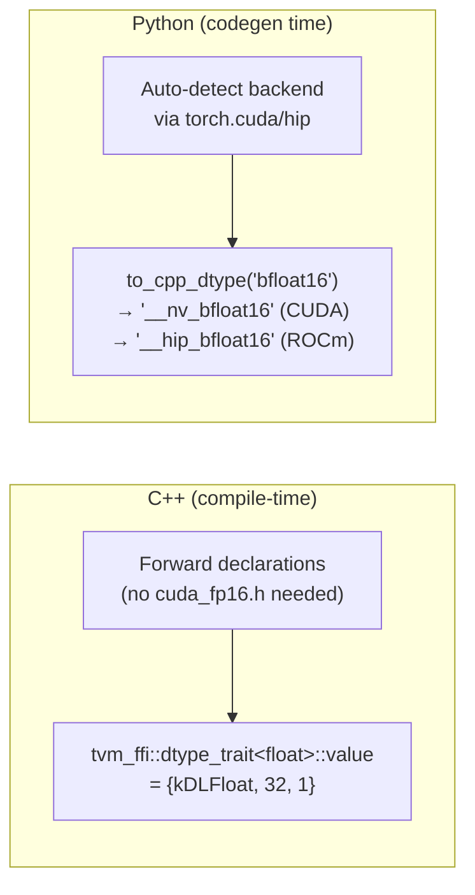

# DType Traits: Compile-time C++ Type to DLPack Data Type Mapping

**TL;DR**
- `tvm_ffi::dtype_trait<T>` is a header-only compile-time mapping from C++ scalar types to `DLDataType` values, covering standard integers, floats, bool, and vendor-specific half/fp8/fp4 types (CUDA and HIP).
- Python counterpart `tvm_ffi.cpp.dtype.to_cpp_dtype(dtype_str)` converts TVM/PyTorch dtype strings to C++ type name strings, with auto-detection of CUDA/ROCm/CPU backend.
- Designed for code generation workflows where C++ types and DLPack data types must be correlated at compile time or code-generation time.

## Problem Statement

### Background
- CUDA/HIP kernel code generation requires mapping between DLPack data types (used in the FFI Tensor system) and C++ scalar type names (used in kernel templates).
- CUDA and HIP have different type names for half-precision and quantized types (e.g., `__nv_bfloat16` vs `__hip_bfloat16`), requiring backend-aware mapping.
- Without a centralized mapping, each code generator would maintain its own ad-hoc dtype-to-typename table.

### Solution
- A C++ header-only trait (`extra/dtype.h`) with forward declarations of vendor types (no CUDA/HIP header dependencies), providing `constexpr DLDataType` for each type.
- A Python module (`tvm_ffi.cpp.dtype`) with pre-built dictionaries for CPU, CUDA, and ROCm backends, auto-detecting the active backend via PyTorch.

### Goals
- **Goal**: Compile-time C++ type to DLPack dtype mapping with no CUDA header dependency.
- **Goal**: Python codegen utility for dtype string to C++ type name conversion.
- **Non-goal**: Not a runtime type conversion system; for code generation and compile-time use only.

## Design



### Key Classes, Fields and Interfaces

**`tvm_ffi::dtype_trait<T>`** (`extra/dtype.h`):
```cpp
namespace tvm_ffi {
template <typename T> struct dtype_trait {};  // primary: empty (SFINAE-friendly)

// Specializations (each has: static constexpr DLDataType value = {code, bits, lanes})
// Standard types:
//   signed char, short, int, long, long long -> {kDLInt, sizeof(T)*8, 1}
//   unsigned char/short/int/long/long long   -> {kDLUInt, sizeof(T)*8, 1}
//   float -> {kDLFloat, 32, 1}, double -> {kDLFloat, 64, 1}
//   bool -> {kDLBool, 8, 1}
// CUDA types (forward-declared, no cuda_fp16.h needed):
//   __half          -> {kDLFloat, 16, 1}
//   __nv_bfloat16   -> {kDLBfloat, 16, 1}
//   __nv_fp8_e4m3   -> {kDLFloat, 8, 1}   // with custom code for FP8
//   __nv_fp8_e5m2   -> ... etc.
//   __nv_fp4_e2m1, __nv_fp4x2_e2m1 -> sub-byte types
// HIP types (forward-declared):
//   __hip_bfloat16, hip_bfloat16, __hip_fp8_*, __hip_fp4_*
}
```
Note: Uses `tvm_ffi` namespace (not `tvm::ffi`), consistent with extra utility headers.

**Python `tvm_ffi.cpp.dtype`** (`python/tvm_ffi/cpp/dtype.py`):
```python
CPU_DTYPE_MAP: dict[str, str]     # e.g., "float32" -> "float", "int8" -> "int8_t"
CUDA_DTYPE_MAP: dict[str, str]    # extends CPU with "__nv_bfloat16", "__half", etc.
ROCM_DTYPE_MAP: dict[str, str]    # extends CPU with "__hip_bfloat16", etc.

def to_cpp_dtype(dtype_str: str | Any) -> str:
    """Convert a dtype string (e.g., 'float32', 'bfloat16', torch.float16) to
    the corresponding C++ type name string.
    Backend auto-detected via torch.cuda.is_available() + torch.version.cuda/hip.
    Accepts torch.dtype objects (stripped of 'torch.' prefix)."""
```

### Contracts, Assumptions and Invariants
- **Forward declaration strategy**: CUDA/HIP types are forward-declared as structs in `extra/dtype.h`. Actual type definitions come from CUDA/HIP headers at the user's compilation site. This means `dtype_trait` specializations are available without pulling in `cuda_fp16.h` or `hip_fp16.h`.
- **Empty primary template**: `dtype_trait<T>` with no specialization is an empty struct (no `value` member), enabling SFINAE detection of unsupported types.
- **Python backend detection**: `to_cpp_dtype` lazy-initializes by checking `torch.cuda.is_available()` and `torch.version.cuda`/`torch.version.hip`. Falls back to CPU map if no GPU backend detected.

### Extension Points
- **New vendor types**: Add forward declarations and `dtype_trait` specializations for new hardware types (e.g., Intel AMX types, future NVIDIA types).
- **New Python backends**: Extend with additional `*_DTYPE_MAP` dictionaries for other accelerators.

### Usage Examples

#### C++ compile-time dtype resolution
**Context**: Using `dtype_trait` in kernel template instantiation to map C++ types to DLPack dtypes at compile time.
```cpp
#include <tvm/ffi/extra/dtype.h>

constexpr DLDataType dt = tvm_ffi::dtype_trait<float>::value;
// dt == {kDLFloat, 32, 1}
constexpr DLDataType dt_half = tvm_ffi::dtype_trait<__half>::value;
// dt_half == {kDLFloat, 16, 1}
```

#### Python dtype conversion for code generation
**Context**: Converting dtype strings to C++ type names for kernel codegen.
```python
from tvm_ffi.cpp.dtype import to_cpp_dtype

to_cpp_dtype("float32")       # "float"
to_cpp_dtype("bfloat16")      # "__nv_bfloat16" (CUDA) or "__hip_bfloat16" (ROCm)
to_cpp_dtype(torch.float16)   # "__half"
```

## Alternatives & Trade-offs
### Template specialization in user code
- Pros: Each project defines its own mappings, maximum flexibility.
- Cons: Duplicated across projects; inconsistent naming. The centralized `dtype_trait` provides a single source of truth.

### Runtime dtype registry
- Pros: Extensible at runtime, no template metaprogramming.
- Cons: Not `constexpr`, cannot be used in template arguments or static dispatch. The compile-time approach enables zero-overhead type selection in kernel templates.

## Related Work
### Design Docs & ADRs
- [0017-dlpack-interop.md](0017-dlpack-interop.md) -- `DLDataType`, `DLDataTypeCode` consumed by dtype_trait
- [0021-cubin-launcher.md](0021-cubin-launcher.md) -- CUDA kernel workflows that benefit from dtype_trait

### Evidence Matrix
- `tvm_ffi::dtype_trait<T>`, Python `to_cpp_dtype`, CPU/CUDA/ROCM maps -> `2026-01-02-c51e519b2253c2c8754bebaf2f9af0434d89e1fc.md` (c51e519) + `extra/dtype.h`, `python/tvm_ffi/cpp/dtype.py`
