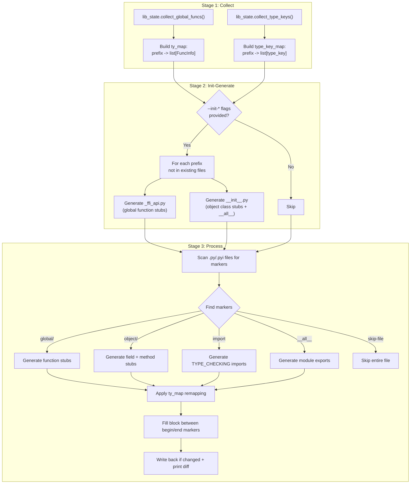

# Type Schema and Stub Generation

**TL;DR**
- A JSON-based type schema format (`{"type":"<key>", "args":[...]}`) provides machine-readable type information for all FFI types, generated at compile time via `TypeTraits<T>::TypeSchema()` and attached to fields, methods, and global functions as metadata.
- `tvm-ffi-stubgen` is a CLI tool that reads type schemas from the FFI registry and generates in-place Python type stubs between marker comments, giving static type checkers (mypy, pyright) precise signatures for FFI-exposed APIs.
- Together, these form a pipeline from C++ type declarations through JSON schemas to Python typing annotations, bridging the static typing gap across the FFI boundary.

## Problem Statement

### Background

TVM FFI functions and object fields are registered dynamically from C++. Python bindings expose them as generic callables and untyped attributes. Without type annotations, static analysis tools cannot check argument types, IDE autocompletion is limited, and documentation is imprecise.

The type information exists at the C++ level (template parameters encode argument/return types) but was previously lost at the FFI boundary.

### Solution

A two-stage pipeline:
1. **C++ type schema generation**: Each `TypeTraits<T>` specialization provides a `TypeSchema()` static method returning a JSON string. The reflection system attaches these schemas as metadata to fields, methods, and global functions.
2. **Python stub generation**: `tvm-ffi-stubgen` reads the metadata from the running FFI registry and fills in-place stub blocks in Python source files. With `--init-*` flags, it can also bootstrap entire package scaffolding (`_ffi_api.py`, `__init__.py`) from a single command.

### Goals

- **Goal**: Machine-readable type information for all FFI types, available at both C++ and Python levels.
- **Goal**: Static type annotations for FFI functions and object members in Python source files.
- **Goal**: Deterministic, idempotent stub generation (re-running produces no diff when inputs unchanged).
- **Goal**: Support type name remapping for Python-idiomatic annotations (e.g., `Array` -> `Sequence`, `Dict` -> `MutableMapping`).
- **Goal**: Single-command bootstrapping of downstream Python packages from their C++ FFI registrations.
- **Non-goal**: Runtime type checking (schemas are metadata for tooling, not enforcement).

## Design

### JSON Type Schema Format

The schema is a recursive JSON structure:

```json
{"type": "<type_key>"}                           // leaf type
{"type": "<container>", "args": [<sub-schemas>]} // parameterized type
```

Examples:
- `{"type":"int"}` -- integer
- `{"type":"ffi.Function","args":[{"type":"int"},{"type":"int"},{"type":"int"}]}` -- `Callable[[int, int], int]` (first arg is return type)
- `{"type":"Optional","args":[{"type":"ffi.String"}]}` -- `Optional[String]`
- `{"type":"ffi.Array","args":[{"type":"Any"}]}` -- `Array[Any]`
- `{"type":"ffi.Dict","args":[{"type":"ffi.String"},{"type":"int"}]}` -- `Dict[String, int]`

Type key mapping:

| C++ Type | Schema `type` Key |
|---|---|
| `int`, `int64_t`, ... | `int` |
| `float`, `double` | `float` |
| `bool` (strict) | `bool` |
| `String` | `ffi.String` |
| `Bytes` | `ffi.Bytes` |
| `DLDataType` | `DLDataType` |
| `DLDevice` | `DLDevice` |
| `void*` | `OpaquePtr` |
| `DLTensor*` | `DLTensor*` |
| `nullptr_t` | `None` |
| `Array<T>` | `Array` with `args` |
| `List<T>` | `List` with `args` |
| `Map<K,V>` | `Map` with `args` |
| `Dict<K,V>` | `Dict` with `args` |
| `Optional<T>` | `Optional` with `args` |
| `Tuple<Ts...>` | `tuple` with `args` |
| `Variant<Vs...>` | `Union` with `args` |
| `Function` | `ffi.Function` with optional `args` |
| `ObjectRef` subclass | `<type_key>` string |

### TypeSchema<T> C++ Trait

Every `TypeTraits<T>` specialization provides:

```cpp
static std::string TypeSchema();
```

For container types, the schema is composed recursively. For example, `TypeTraits<Array<String>>` generates:
```json
{"type":"ffi.Array","args":[{"type":"ffi.String"}]}
```

For typed functions, `FunctionInfo<Ret(Args...)>::TypeSchema()` generates:
```json
{"type":"ffi.Function","args":[<ret_schema>, <arg1_schema>, ...]}
```

### Metadata Attachment

The `Metadata` class allows attaching arbitrary key-value pairs during registration:

```cpp
GlobalDef()
    .def("my_func", my_func,
         Metadata{{"description", "Does X"}, {"version", 1}});
```

The type schema is automatically included in metadata as the `type_schema` key. Additional user-defined metadata (restricted to `int`, `bool`, `String` values) is serialized alongside.

### TypeSchema Python Dataclass

```python
@dataclasses.dataclass(repr=False)
class TypeSchema:
    origin: str        # e.g., "int", "Array", "Callable", "Union"
    args: tuple[TypeSchema, ...] = ()

    def repr(self, ty_map=None) -> str: ...
    @staticmethod
    def from_json_str(s: str) -> TypeSchema: ...
```

The `repr(ty_map)` method accepts an optional callable that remaps type names (e.g., mapping `Array` -> `Sequence` for stub output). This is used by stub generation to produce Python-idiomatic annotations.

**Distinct container type origins** (commit `7786133` #469): The `_TYPE_SCHEMA_ORIGIN_CONVERTER` in `type_info.pxi` maps C++ FFI container type keys to distinct Python-side origin names that preserve immutable vs mutable semantics:

| FFI type key | Schema `origin` | Default stub annotation (`TY_MAP_DEFAULTS`) |
|---|---|---|
| `ffi.Array` | `Array` | `collections.abc.Sequence` |
| `ffi.List` | `List` | `collections.abc.MutableSequence` |
| `ffi.Map` | `Map` | `collections.abc.Mapping` |
| `ffi.Dict` | `Dict` | `collections.abc.MutableMapping` |

Previously, all sequence types collapsed to `list` and all mapping types to `dict`, losing the immutable/mutable distinction. The raw `list`/`dict` origins still parse correctly in `TypeSchema` for backward compatibility.

**Auto-fill convention**: Empty `Array`/`List`/`list` args are auto-filled as `<origin>[Any]`, empty `Map`/`Dict`/`dict` args as `<origin>[Any, Any]` in `__post_init__`.

### tvm-ffi-stubgen CLI Tool

```
tvm-ffi-stubgen [--dlls LIB1 LIB2 ...] [--imports MOD1 MOD2 ...]
                [--init-pypkg PKG] [--init-lib LIB] [--init-prefix PREFIX]
                [--indent N] PATH [PATH ...]
```

| Flag | Purpose |
|---|---|
| `PATH` | Files/directories to scan; the directory of the first entry becomes the root for init generation |
| `--dlls` | Preload shared libraries via `ctypes.CDLL` so global function/type metadata is available |
| `--imports` | Pre-import Python modules before generation (populates the registry) |
| `--init-pypkg` | Published Python package name (wheel/sdist name), used in the loader string |
| `--init-lib` | CMake target / basename of the shared library (`lib<init-lib>.so`) |
| `--init-prefix` | Registry prefix to include when generating globals/objects (e.g., `my_ffi_extension.`) |
| `--indent` | Indentation width (default: 4) |

When `--init-*` flags are provided, the tool generates missing `_ffi_api.py` and `__init__.py` files under the derived package path, enabling full package bootstrapping from a single command.

#### Three-Stage Pipeline

The stubgen tool executes a three-stage pipeline:



#### lib_state Module

The `lib_state.py` module (`python/tvm_ffi/stub/lib_state.py`) centralizes runtime metadata queries, separating FFI introspection from code generation:

- **`collect_global_funcs()`**: Queries `list_global_func_names()` and `get_global_func_metadata()`, returning `dict[str, list[FuncInfo]]` keyed by prefix.
- **`collect_type_keys()`**: Queries `GetRegisteredTypeKeys()`, returning `dict[str, list[str]]` keyed by prefix.
- **`toposort_objects(type_keys)`**: Topologically sorts `ObjectInfo` instances by inheritance hierarchy using a min-heap, ensuring parent classes appear before children.
- **`object_info_from_type_key(type_key)`**: LRU-cached constructor that builds `ObjectInfo` from `_lookup_or_register_type_info_from_type_key()`.

#### InitConfig and ImportItem Data Classes

- **`InitConfig`** (`stub/utils.py`): Structured representation of `--init-*` CLI arguments. Fields: `pkg` (Python package name), `shared_target` (CMake target basename), `prefix` (registry prefix filter).
- **`ImportItem`** (`stub/utils.py`): Frozen dataclass representing a single `from X import Y` statement. Fields: `mod`, `name`, `type_checking_only`, `alias`. Handles module path remapping via `MOD_MAP` in the constructor.

#### Block Directives

**Global functions:**
```python
# tvm-ffi-stubgen(begin): global/ffi
# tvm-ffi-stubgen(end)
```

**Object types (with `__init__` generation, commit `6973d22` #491):**
```python
@register_object("testing.Foo")
class Foo:
    # tvm-ffi-stubgen(begin): object/testing.Foo
    # tvm-ffi-stubgen(ty_map): testing.Foo -> Foo
    # tvm-ffi-stubgen(end)
```

When the object has C++ reflection-based init metadata, the generated block includes an `__init__` signature. For auto-inits (KWARGS protocol), this includes proper parameter names, types, and defaults. For explicit inits (`refl::init<Args...>()`), a positional-only signature is generated. See [ADR 0073](../ADRs/0073-register-object-auto-wires-init.md).

**Import directive** (auto-generates `TYPE_CHECKING` imports):
```python
# tvm-ffi-stubgen(begin): import
# tvm-ffi-stubgen(end)
```

**`__all__` directive** (auto-generates module exports):
```python
# tvm-ffi-stubgen(begin): __all__
# tvm-ffi-stubgen(end)
```

**Skip file:**
```python
# tvm-ffi-stubgen(skip-file)
```

#### Output Format

Generated content is wrapped in `if TYPE_CHECKING:` blocks to avoid runtime impact:

```python
# tvm-ffi-stubgen(begin): global/ffi
if TYPE_CHECKING:
    def MakeObjectFromPackedArgs(
        type_key: str | int, *args: Any
    ) -> Object: ...
# tvm-ffi-stubgen(end)
```

### Key Classes, Fields and Interfaces

- **`TypeTraits<T>::TypeSchema()`** (C++, `type_traits.h`): Static method on every TypeTraits specialization returning JSON schema string.
- **`Metadata`** (C++, `reflection/registry.h`): `InfoTrait` subclass holding `vector<pair<String, Any>>`. Methods: `Apply(FieldInfoBuilder*)`, `Apply(MethodInfoBuilder*)`, static `ToJSON()`.
- **`FieldInfoBuilder` / `MethodInfoBuilder`** (C++, `reflection/registry.h`): Extend `TVMFFIFieldInfo` / `TVMFFIMethodInfo` with temporary metadata storage.
- **`TypeSchema`** (Python, `type_info.pxi`): Dataclass parsing JSON schema. Methods: `from_json_str()`, `from_json_obj()`, `repr(ty_map)`.
- **`get_global_func_metadata(name)`** (Python, `registry.py`): Returns metadata dict for a registered global function.
- **`tvm-ffi-stubgen`** (Python, `python/tvm_ffi/stub/cli.py`): CLI entry point for stub generation. Orchestrates the three-stage pipeline (collect, init-generate, process). Parses `--init-*`, `--dlls`, `--imports` flags.
- **`lib_state.py`** (Python, `python/tvm_ffi/stub/lib_state.py`): Centralized runtime metadata queries with LRU caching. Functions: `collect_global_funcs()`, `collect_type_keys()`, `toposort_objects()`, `object_info_from_type_key()`.
- **`codegen.py`** (Python, `python/tvm_ffi/stub/codegen.py`): Code generation for function stubs, field/method stubs, import blocks, `__all__` exports, and init file scaffolding.
- **`consts.py`** (Python, `python/tvm_ffi/stub/consts.py`): Constants and type maps (marker strings, `MOD_MAP`, `TY_MAP`).
- **`file_utils.py`** (Python, `python/tvm_ffi/stub/file_utils.py`): File parsing, marker detection, and write-back logic.
- **`utils.py`** (Python, `python/tvm_ffi/stub/utils.py`): Data classes (`InitConfig`, `Options`, `ImportItem`, `FuncInfo`, `NamedTypeSchema`, `ObjectInfo`, `InitFieldInfo`).
- **`InitFieldInfo`** (Python, `stub/utils.py`, commit `6973d22` #491): Dataclass capturing per-field init metadata for `__init__` stub generation: `name`, `type_schema`, `c_init` (participates in init), `c_kw_only`, `c_has_default`.
- **`ObjectInfo.gen_init()`** (Python, `stub/utils.py`, commit `6973d22` #491): Walks the TypeInfo parent chain to collect `InitFieldInfo` per field, then emits typed `__init__` stubs via `_gen_auto_init` (KWARGS protocol with proper signature) or `_gen_c_init` (positional pass-through from `__c_ffi_init__`). Returns a list of stub lines injected into the `TYPE_CHECKING` block by `codegen.py`.

### Contracts, Assumptions and Invariants

- **Schema determinism**: `TypeSchema<T>()` produces the same JSON string for the same C++ type across compilations.
- **Metadata value restriction**: Only `int`, `bool`, and `String` values are allowed in `Metadata`. Other types cause a `TypeError` at registration time.
- **Stubgen idempotency**: Running `tvm-ffi-stubgen` twice on unchanged input produces zero diff.
- **Marker integrity**: Begin and end markers must be paired. Orphaned markers cause an error.
- **Registry availability**: `tvm-ffi-stubgen` requires the FFI registry to be populated (shared libraries must be loaded). Use `--dlls` for native extensions.
- **Init-generation idempotency**: When `--init-*` flags are provided, files are only created if they do not already exist for the given prefix. Re-running does not duplicate content.
- **Topological ordering**: Objects in generated `__init__.py` files are sorted by inheritance depth (parents before children) via `toposort_objects()`, ensuring that base class imports precede derived class definitions.
- **Failure mode -- missing shared library**: If `--dlls` does not include the library exporting the target prefix, Stage 2 generates empty stubs. Mitigation: the CLI prints yellow warnings for functions/types without metadata.
- **Collision avoidance** (commit `7786133` #469): When a generated function name matches a type import suffix (e.g., a function named `StructuralKey` colliding with the imported type `StructuralKey`), the type import is aliased (e.g., `_StructuralKey`) to avoid shadowing.

### Extension Points

- **New TypeTraits specializations**: Adding `TypeSchema()` to a new `TypeTraits<T>` specialization automatically makes it available in metadata and stub generation.
- **Custom ty_map functions**: The `repr(ty_map)` hook allows arbitrary type name transformations for different output contexts (stubs, documentation, IDEs).
- **New block directives**: The marker parser can be extended with new `tvm-ffi-stubgen(begin): <kind>/<key>` patterns. Current directives: `global/<prefix>`, `object/<type_key>`, `import`, `__all__`, `ty-map`, `skip-file`.
- **CMake integration**: `tvm_ffi_configure_target(... STUB_DIR <dir> STUB_INIT ON)` adds a post-build step that invokes the stubgen CLI, enabling automatic stub regeneration on every build. See [`.knowledge/designs/0016-packaging-and-build.md`](0016-packaging-and-build.md).

## Alternatives & Trade-offs

### Alternative A: Standalone `.pyi` stub files

- Pros: Standard Python packaging convention. No source modification.
- Cons: Stub files drift from implementation. Cannot co-locate stubs with `@register_object` classes. Harder to maintain in monorepo with mixed Python/C++ types.

### Alternative B: Runtime `__annotations__` patching

- Pros: No build step needed. Always reflects current state.
- Cons: Not visible to static type checkers (mypy, pyright). No IDE support. Runtime overhead.

### Alternative C: Protocol Buffers for schema

- Pros: Well-established schema language. Cross-language tooling.
- Cons: Heavyweight dependency for a build system that targets minimal runtimes. JSON is sufficient for the recursive type structure and avoids an extra compilation step.

## Related Work

### Design Docs & ADRs

- [`.knowledge/designs/0006-reflection.md`](0006-reflection.md) -- Reflection system where metadata is registered
- [`.knowledge/designs/0004-function-system.md`](0004-function-system.md) -- GlobalDef and function registration
- [`.knowledge/designs/0014-python-bindings.md`](0014-python-bindings.md) -- Python TypeInfo consumed by stubgen
- [`.knowledge/designs/0019-python-ffi-call-dispatch.md`](0019-python-ffi-call-dispatch.md) -- Factory that classifies types
- [`.knowledge/designs/0016-packaging-and-build.md`](0016-packaging-and-build.md) -- CMake `tvm_ffi_configure_target` STUB_* integration
- [`.knowledge/ADRs/0073-register-object-auto-wires-init.md`](../ADRs/0073-register-object-auto-wires-init.md) -- register_object auto-wires __init__ (stubgen generates __init__ signatures)

### Evidence Matrix

- Metadata and JSON type schemas for fields, methods, global funcs -> `.knowledge/commits/2025-10-03-28fe3cc7fc23b725ddefbb3ca1e1899a7dfd530c.md` + `28fe3cc`
- TypeSchema.repr(ty_map) for flexible type name overrides -> `.knowledge/commits/2025-10-08-dd4fb0ae92ab69b1cc0280e812a18a58273d4ae6.md` + `dd4fb0a`
- Self schema bug fix for member functions -> `.knowledge/commits/2025-10-07-368af824845424ea439b9f3d68bf4a710afb38b1.md` + `368af82`
- tvm_ffi.dtype usage in schema -> `.knowledge/commits/2025-10-07-c046b17108484780b8b13142e1c1a46e263ec979.md` + `c046b17`
- tvm-ffi-stubgen CLI tool introduction -> `.knowledge/commits/2025-10-12-ea02e646aea916ad18755cd6990b22ace8afd4b2.md` + `ea02e64`
- Auto-extract type annotations from function definitions -> `.knowledge/commits/2025-10-13-17ff30bc77a9201e0a190431be8cf9376075e7a5.md` + `17ff30b`
- ObjectRef::MemFn schema support -> `.knowledge/commits/2025-10-14-7b57a46648662b11b483f252787db22ab701231f.md` + `7b57a46`
- Stubgen refactored into staged pipeline with import directive -> `.knowledge/commits/2025-11-15-1af6d9f9648bb2547d97d455bb4464d217654fc4.md` + `1af6d9f`
- `__all__` directive for auto-generating exports -> `.knowledge/commits/2025-11-16-92e150b9cb8222eeadf5469eae2e06400e4af850.md` + `92e150b`
- `--init-*` flags, three-stage pipeline, lib_state.py, InitConfig/ImportItem -> `.knowledge/commits/2025-12-18-b58c2e3d7deadbd60c7480f5c84633966260bc9a.md` + `b58c2e3`
- Stubgen CLI help text pointing to Python packaging docs -> `.knowledge/commits/2025-12-22-dc0dd2f6e8367e3bb244e0dc09c6a1a41495499d.md` + `dc0dd2f`
- Distinct container type origins (Array/List/Map/Dict), collision avoidance, TY_MAP_DEFAULTS update -> `.knowledge/commits/2026-02-21-7786133167902a810dd4717fd0e7d39f4c6f7e99.md` + `7786133`
- Stubgen __init__ generation from C++ reflection (InitFieldInfo, ObjectInfo.gen_init, _gen_auto_init/_gen_c_init) -> `.knowledge/commits/2026-03-01-6973d225eb3c67a7c306e36b20a100c5e9ff46f7.md` + `6973d22`
