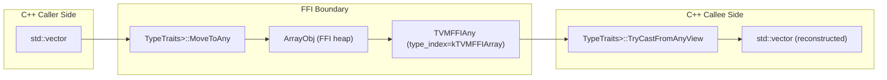

# STL Interop Layer (`extra/stl.h`)

**TL;DR**
- `include/tvm/ffi/extra/stl.h` provides `TypeTraits` specializations for C++ STL types (`std::vector`, `std::array`, `std::tuple`, `std::optional`, `std::variant`, `std::map`, `std::unordered_map`, `std::pair`, `std::string`), enabling automatic bidirectional conversion between STL types and TVM FFI `Any`/`AnyView` values.
- Users can write functions using standard C++ types and export them via `TVM_FFI_DLL_EXPORT_TYPED_FUNC`; the STL<->FFI marshalling happens transparently at the packed-function boundary.
- The header is in the extra tier (`extra/`) with a deliberate recommendation to prefer native FFI containers (`Array`, `Map`, `Tuple`) when possible, since they have stable ABI layouts accessible from DSLs via raw pointer access.

## Problem Statement

### Background

TVM FFI's core containers (`Array<T>`, `Map<K,V>`, `Tuple<Ts...>`) have stable data layouts designed for cross-language access. However, most C++ developers are more familiar with STL containers. When writing extension functions, having to manually convert between `std::vector<int>` and `ffi::Array<int>` creates friction and boilerplate.

### Solution

A header-only TypeTraits layer that intercepts STL types at the packed-function boundary, automatically converting them to/from the corresponding FFI container types (`Array`, `Map`, etc.) via the existing `Any`/`AnyView` machinery.

### Goals

- **Goal**: Allow C++ functions using STL types to be directly exported via FFI macros without manual conversion code.
- **Goal**: Support nested STL types (e.g., `std::vector<std::vector<int>>`, `std::optional<std::vector<int>>`).
- **Goal**: Type-safe conversion with `TryCastFromAnyView` returning `std::nullopt` on mismatch.
- **Non-goal**: Zero-copy sharing of STL containers across the FFI boundary (a copy to/from FFI containers is always made).

## Design

### Conversion Strategy

All STL types are converted through FFI containers as intermediaries. On the "move to Any" path, the STL container is copied into an FFI container object, then the object pointer is stored in the `TVMFFIAny`. On the "cast from Any" path, the FFI container is read element-by-element to reconstruct the STL type.

### Type Mapping

| STL Type | FFI Intermediate | field_static_type_index |
|---|---|---|
| `std::vector<T>` | `ArrayObj` | `kTVMFFIArray` |
| `std::array<T, N>` | `ArrayObj` (with size check) | `kTVMFFIArray` |
| `std::tuple<Ts...>` | `ArrayObj` | `kTVMFFIArray` |
| `std::pair<K, V>` | `ArrayObj` (size=2) | `kTVMFFIArray` |
| `std::map<K, V>` | `MapObj` | `kTVMFFIMap` |
| `std::unordered_map<K, V>` | `MapObj` | `kTVMFFIMap` |
| `std::optional<T>` | `T` or `nullptr` | (delegates to `T`) |
| `std::variant<Ts...>` | first matching `Ts` | (delegates to matched `Ts`) |
| `std::string` | `StringObj` | `kTVMFFIString` |

### Key Classes, Fields and Interfaces

- **`STLTypeTrait`** (base class): Provides `MoveToAnyImpl`, `CopyFromAnyImpl`, `ConstructFromAny` helpers. Uses `TryCast` (not `CheckArgStrict`) since not all STL types support strict checking.
- **`STLTypeMismatch`** (exception): Internal sentinel thrown by `ConstructFromAny` when element-level type conversion fails, caught by outer `TryCastFromAnyView` to return `std::nullopt`.
- **`TypeTraits<details::ListTemplate>`**: Shared base for all array-like STL types. Provides `CopyToArray`, `MoveToArray`, `CopyToTuple`, `MoveToTuple` helpers.
- **`TypeTraits<details::MapTemplate>`**: Shared base for map-like STL types. Provides `CopyToMap`, `MoveToMap`, `ConstructMap` helpers.
- **Per-type specializations**: Each STL type gets its own `TypeTraits<T>` with `CopyToAnyView`, `MoveToAny`, `TryCastFromAnyView`, `TypeStr`, `TypeSchema`.

### Contracts, Assumptions and Invariants

- **Copy semantics**: STL-to-FFI conversion always copies. There is no shared ownership between a `std::vector` and the resulting `ArrayObj`.
- **Element-level type safety**: `TryCastFromAnyView` returns `std::nullopt` if any element in a container fails to convert to the expected type, using the `STLTypeMismatch` exception for control flow.
- **Variant priority**: `std::variant<Ts...>` conversion tries alternatives in declaration order, returning the first successful match.
- **std::array size check**: Converting from `Any` to `std::array<T, N>` fails if the `ArrayObj` size does not equal `N`.
- **storage_enabled = false**: STL type traits set `storage_enabled = false`, meaning STL types cannot be stored as direct fields in reflected objects (only passed through function arguments/returns).

### Extension Points

- **New STL types**: Add a new `TypeTraits<T>` specialization inheriting from `STLTypeTrait`, `ListTemplate`, or `MapTemplate`.
- **Custom user types**: Follow the same pattern to create TypeTraits for non-STL container types.

## Alternatives & Trade-offs

### Alternative A: Require explicit conversion

- Pros: No implicit copies; user is aware of the cost. Simpler implementation.
- Cons: Boilerplate-heavy. Discourages adoption by C++ developers unfamiliar with FFI containers.

### Alternative B: Zero-copy wrapping with reference-counted STL containers

- Pros: Avoids copy overhead.
- Cons: STL containers have no stable ABI layout; DSLs and compiled LLVM code cannot access them via raw pointers. Would require a custom reference-counting wrapper. The copy cost is acceptable for the convenience gained.

## Related Work

### Design Docs & ADRs

- [`.knowledge/designs/0002-any-system.md`](0002-any-system.md) -- Any/AnyView where STL values are marshalled
- [`.knowledge/designs/0005-containers.md`](0005-containers.md) -- Native FFI containers (Array, Map, Tuple) used as intermediaries
- [`.knowledge/designs/0011-extra-api-tier.md`](0011-extra-api-tier.md) -- Extra tier where stl.h resides
- [`.knowledge/designs/0008-module-export-system.md`](0008-module-export-system.md) -- Export macro that triggers STL marshalling

### Evidence Matrix

- stl.h introduction (649 lines) -> `.knowledge/commits/2025-11-30-c3fc8f7f0e95a97beed342b6ddec4c3f6add0441.md` + `c3fc8f7`
- use-after-move fix in std::tuple handling -> `.knowledge/commits/2025-11-30-88d5130d4c640ef157d80cb9b612df4c8050fed4.md` + `88d5130`
