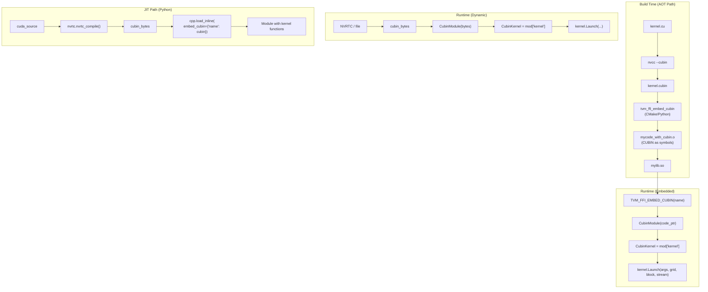
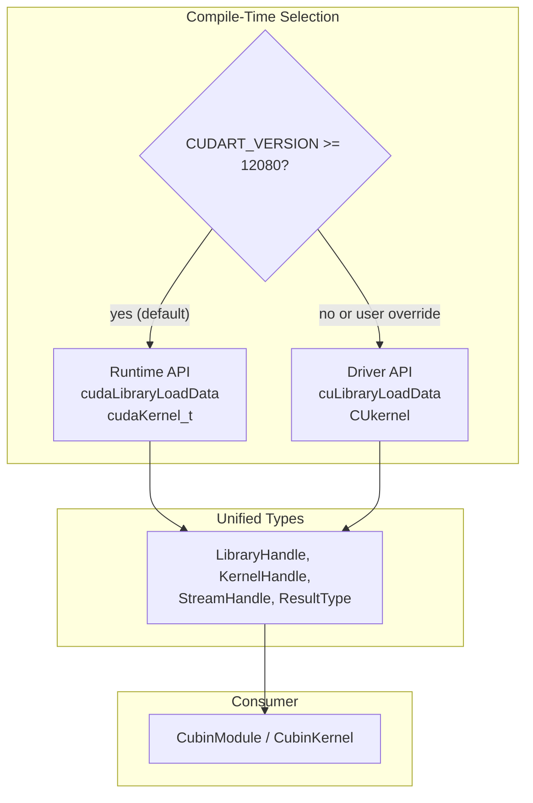
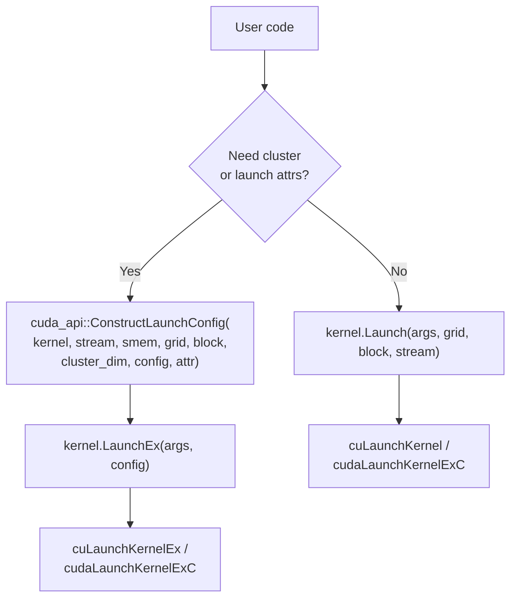

# CUBIN Launcher System

**TL;DR**
- A header-only CUDA utility (`include/tvm/ffi/extra/cuda/cubin_launcher.h`) provides `CubinModule` and `CubinKernel` abstractions for loading CUBIN binaries from memory and launching kernels, with multi-GPU support via CUDA primary contexts.
- Companion utilities include: CMake `tvm_ffi_embed_cubin` for embedding CUBIN in shared libraries, Python `tvm_ffi.cpp.nvrtc` for NVRTC JIT compilation, and `tvm_ffi.utils.embed_cubin` for cross-platform CUBIN embedding via objcopy/ld.
- Benchmarks show 2.41x lower kernel launch overhead versus Triton (2.034 vs 4.911 us/call), making this suitable for latency-sensitive inference paths.

## Problem Statement

### Background

CUDA kernel libraries compiled to CUBIN need a lightweight loading and launch mechanism. The existing approaches (CUDA driver API directly, or full TVM runtime) are either too low-level or too heavyweight. Framework integration (e.g., Triton) adds measurable launch overhead.

### Solution

A three-layer system: (1) C++ header for loading/launching CUBIN, (2) CMake/Python build utilities for embedding CUBIN data into shared libraries at compile time, (3) Python JIT path via NVRTC for development workflows.

### Goals

- **Goal**: Minimal kernel launch overhead (< 3 us per call).
- **Goal**: Support both embedded CUBIN (AOT) and dynamic CUBIN (runtime loaded) workflows.
- **Goal**: Multi-GPU support without manual device context management.
- **Goal**: Integration with the existing `TVM_FFI_DLL_EXPORT_TYPED_FUNC` export system.
- **Non-goal**: Replacing CUDA's native launch mechanism for inline `__global__` functions.

## Design

### End-to-End Workflow



### Unified CUDA API Abstraction

As of commit `b16f11f` (#300), a unified API layer (`include/tvm/ffi/extra/cuda/internal/unified_api.h`) abstracts over CUDA Driver and Runtime APIs, enabling the cubin launcher to work with either backend.



**Selection mechanism:**
- `TVM_FFI_CUBIN_LAUNCHER_USE_DRIVER_API` macro: user-definable before including the header. If not set, defaults to Runtime API when `CUDART_VERSION >= 12080`, Driver API otherwise.
- `_TVM_FFI_CUDA_FUNC(name)` macro: expands to `cuda##name` (Runtime) or `cu##name` (Driver).
- Unified type aliases: `LibraryHandle`, `KernelHandle`, `StreamHandle`, `ResultType`, `LaunchConfig`, etc.

**Key invariant:** The `unified_api.h` header lives in `cuda/internal/` and is not a public API; only `cubin_launcher.h` should include it.

### CubinModule and CubinKernel

```cpp
class CubinModule {
  cuda_api::LibraryHandle library_;
public:
  explicit CubinModule(const char* code);              // from raw pointer (embedded)
  explicit CubinModule(const Bytes& bytes);            // from Bytes object (dynamic)
  explicit CubinModule(const unsigned char* bytes, size_t size);  // from byte array
  CubinKernel GetKernel(const char* name);
  CubinKernel GetKernelWithMaxDynamicSharedMemory(const char* name, int64_t max);
  CubinKernel operator[](const char* name);            // convenience
};

class CubinKernel {
  cuda_api::KernelHandle kernel_;
public:
  cuda_api::ResultType Launch(void** args, dim3 grid, dim3 block,
                              cuda_api::StreamHandle stream, size_t smem = 0);
  cuda_api::ResultType LaunchEx(void** args, const cuda_api::LaunchConfig& config);
  cuda_api::KernelHandle GetHandle() const;
};
```

The `CubinModule` constructor now accepts `const unsigned char*` byte arrays (in addition to embedded symbols and `Bytes` objects), enabling C++23 `#embed` and `bin2c`-style embedding.

### Extended Kernel Launch: cuLaunchKernelEx (commit `adac5eb` #476)

As of commit `adac5eb`, `CubinKernel` supports extended launch parameters via `LaunchEx()`, enabling features like cluster dimensions (SM90+ / Hopper) that require `cuLaunchKernelEx` (Driver API) or `cudaLaunchKernelExC` (Runtime API).



**Key functions in `unified_api.h`:**
- **`cuda_api::LaunchKernelEx(kernel, args, config)`**: Dispatches to `cuLaunchKernelEx` (Driver) or `cudaLaunchKernelExC` (Runtime) depending on compile-time API selection.
- **`cuda_api::ConstructLaunchConfig(kernel, stream, smem, grid, block, cluster_dim, config, attr)`**: Populates a `LaunchConfig` struct with grid/block dimensions, shared memory, stream, and optionally a cluster dimension launch attribute. The `attr` parameter must outlive the launch call. When `cluster_dim > 1`, sets `CU_LAUNCH_ATTRIBUTE_CLUSTER_DIMENSION` (Driver) or `cudaLaunchAttributeClusterDimension` (Runtime).

**Types:**
- **`cuda_api::LaunchConfig`**: `CUlaunchConfig` (Driver) or `cudaLaunchConfig_t` (Runtime).
- **`cuda_api::LaunchAttrType`**: `CUlaunchAttribute` (Driver) or `cudaLaunchAttribute` (Runtime).

**Extension point**: Additional launch attributes (e.g., cooperative launch, programmatic dependent launch) can be added by extending the `ConstructLaunchConfig` function with new attribute types.

### Embedding Macros

Two embedding approaches are supported:

1. **Symbol-based (objcopy/ld):**
```cpp
TVM_FFI_EMBED_CUBIN(my_kernels);  // declares external symbols + singleton
static auto kernel = TVM_FFI_EMBED_CUBIN_GET_KERNEL(my_kernels, "add_one");
```

2. **Byte-array-based (C++23 `#embed` or `bin2c`):**
```cpp
TVM_FFI_LOAD_LIBRARY_FROM_BYTES(my_kernels, imageBytes);
// where imageBytes is unsigned char[] from #embed or header inclusion
```

Symbol naming convention: `__tvm_ffi__cubin_<name>` and `__tvm_ffi__cubin_<name>_end` (created by objcopy or the Python embed utility).

### CMake Utilities (Refactored)

As of commit `b16f11f` (#300), the CMake utilities were refactored from imperative `tvm_ffi_generate_cubin`/`tvm_ffi_embed_cubin` to declarative, target-based functions:

- **`add_tvm_ffi_cubin`**: Compiles CUDA source to CUBIN.
- **`add_tvm_ffi_fatbin`**: Compiles CUDA source to FATBIN.
- **`tvm_ffi_embed_bin_into`**: Embeds CUBIN/FATBIN into an existing target using `PRE_LINK` commands.
- **`ObjectCopyUtil.cmake`**: Utility module for cross-platform binary embedding via objcopy/ld.

The refactored approach uses `PRE_LINK` commands to inject binary data into object files, integrating with CMake's dependency graph.

### CUDA DeviceGuard

A companion RAII class (`include/tvm/ffi/extra/cuda/device_guard.h`) for safe device context switching:

```cpp
struct CUDADeviceGuard {
  explicit CUDADeviceGuard(int device_index);
  ~CUDADeviceGuard() noexcept(false);  // restores original device
};
```

### Key Classes, Fields and Interfaces

- **`CubinModule`** (`cubin_launcher.h`): RAII wrapper around `cuda_api::LibraryHandle`. Movable, not copyable. Accepts raw pointer, `Bytes`, or `unsigned char*` byte array.
- **`CubinKernel`** (`cubin_launcher.h`): Lightweight wrapper around `cuda_api::KernelHandle` with `Launch()` and `LaunchEx()` methods.
- **`cuda_api::LaunchKernelEx`** (`unified_api.h`): Extended kernel launch dispatching to `cuLaunchKernelEx` or `cudaLaunchKernelExC`.
- **`cuda_api::ConstructLaunchConfig`** (`unified_api.h`): Populates a `LaunchConfig` with grid/block/smem/stream and optional cluster dimension attribute.
- **`cuda_api::LaunchConfig`** / **`cuda_api::LaunchAttrType`** (`unified_api.h`): Unified type aliases for the extended launch config and attribute types.
- **`dim3`** (`base.h`): Custom dim3 struct (moved from `cubin_launcher.h` to `base.h` in the refactor; avoids CUDA header dependency at the type level).
- **`TVM_FFI_CHECK_CUDA_ERROR`** (`unified_api.h`): Error-checking macro wrapping either Driver or Runtime API return codes.
- **`TVM_FFI_LOAD_LIBRARY_FROM_BYTES`** (`cubin_launcher.h`): Macro for registering a `CubinModule` from a byte array (C++23 `#embed` or `bin2c`).
- **`cuda_api::LibraryHandle`** / **`cuda_api::KernelHandle`** / **`cuda_api::StreamHandle`** (`unified_api.h`): Unified type aliases that resolve to either Driver or Runtime API types.
- **`CUDADeviceGuard`** (`device_guard.h`): RAII device context guard.
- **`add_tvm_ffi_cubin`** / **`add_tvm_ffi_fatbin`** / **`tvm_ffi_embed_bin_into`** (CMake, `EmbedCubin.cmake`): Declarative target-based CMake utilities for CUBIN compilation and embedding.
- **`ObjectCopyUtil.cmake`** (CMake): Cross-platform binary embedding utility module.
- **`tvm_ffi.cpp.nvrtc.nvrtc_compile()`** (Python): NVRTC JIT compilation wrapper.
- **`tvm_ffi.utils.embed_cubin`** (Python): Cross-platform CUBIN embedding via objcopy.

### Contracts, Assumptions and Invariants

- **Dual API requirement**: The header requires either CUDA Runtime API (`cuda_runtime.h`, for CUDA >= 12.8) or CUDA Driver API (`cuda.h`). The unified API layer selects automatically based on `CUDART_VERSION`.
- **Thread safety**: `CubinModule` itself is not thread-safe, but multiple threads can launch the same `CubinKernel` concurrently (as per CUDA semantics).
- **Embedded symbol lifetime**: Embedded CUBIN data has static storage duration; the `CubinModule` constructed from it is valid for the program lifetime.
- **Byte-array lifetime**: For `TVM_FFI_LOAD_LIBRARY_FROM_BYTES`, the byte array must outlive the `CubinModule` construction call (the CUDA library load copies the data).
- **DeviceGuard exception safety**: `~CUDADeviceGuard` is `noexcept(false)` -- it will throw if `cudaSetDevice` fails during cleanup.
- **Internal header contract**: `cuda/internal/unified_api.h` is not a public API surface; it should only be included by `cubin_launcher.h`.

### Extension Points

- **New kernel launch patterns**: `CubinKernel::LaunchEx` with `ConstructLaunchConfig` supports cluster dimensions (SM90+). Additional launch attributes can be added by extending `ConstructLaunchConfig`.
- **Additional embedding formats**: The symbol naming convention (`__tvm_ffi__cubin_<name>`) is extensible to other binary formats.

## Alternatives & Trade-offs

### Alternative A: Use CUDA driver API exclusively

- Pros: Works with all CUDA versions (no minimum version requirement for Runtime library API).
- Cons: Verbose boilerplate. The unified API layer now abstracts this choice, falling back to Driver API on CUDA < 12.8 automatically.

### Alternative B: Use existing TVM runtime Module system

- Pros: Already handles module loading, function dispatch.
- Cons: Too heavyweight for latency-sensitive paths. Involves packed function dispatch overhead. The CUBIN launcher bypasses this for direct kernel launches.

## Related Work

### Design Docs & ADRs

- [`.knowledge/designs/0011-extra-api-tier.md`](0011-extra-api-tier.md) -- Extra tier where cuda/ headers reside
- [`.knowledge/designs/0017-inline-module-compilation.md`](0017-inline-module-compilation.md) -- `load_inline` integration with `embed_cubin` parameter
- [`.knowledge/designs/0008-module-export-system.md`](0008-module-export-system.md) -- Export macro used alongside CUBIN kernels

### Evidence Matrix

- CUBIN launcher header + examples + Python utilities -> `.knowledge/commits/2025-11-25-d49effdb22392363050e1f2d85cd4b31bf242cf0.md` + `d49effd`
- CUDA DeviceGuard utility -> `.knowledge/commits/2025-11-25-cdfd04109f74a2115c909302f4adf90536bce865.md` + `cdfd041`
- Kernel library guide update with DeviceGuard -> `.knowledge/commits/2025-11-26-803cdc84a4bb4502c8da0e5f69a61c1e7b1a38cf.md` + `803cdc8`
- Cubin launcher refactor: unified CUDA API, byte-array loading, declarative CMake, 3 embedding strategies -> `.knowledge/commits/2025-12-25-b16f11f60156cf07c6e5d3f9ddfa9e2273bdea03.md` + `b16f11f`
- Kernel library guide update + examples/kernel_library/ -> `.knowledge/commits/2026-02-06-b17709aabcc2f1bd776fb001bd05a9c1b4cfe421.md` + `b17709a`
- Refactor Triton CUBIN extraction (compiled_kernel direct return) -> `.knowledge/commits/2026-02-10-731955b304d0f4445b981e4bb9417e49209c6c37.md` + `731955b`
- cuLaunchKernelEx support (LaunchEx, ConstructLaunchConfig, cluster dimensions) -> `.knowledge/commits/2026-02-28-adac5ebd0ad695fc77bf5113c8127a7298c1ed52.md` + `adac5eb`
